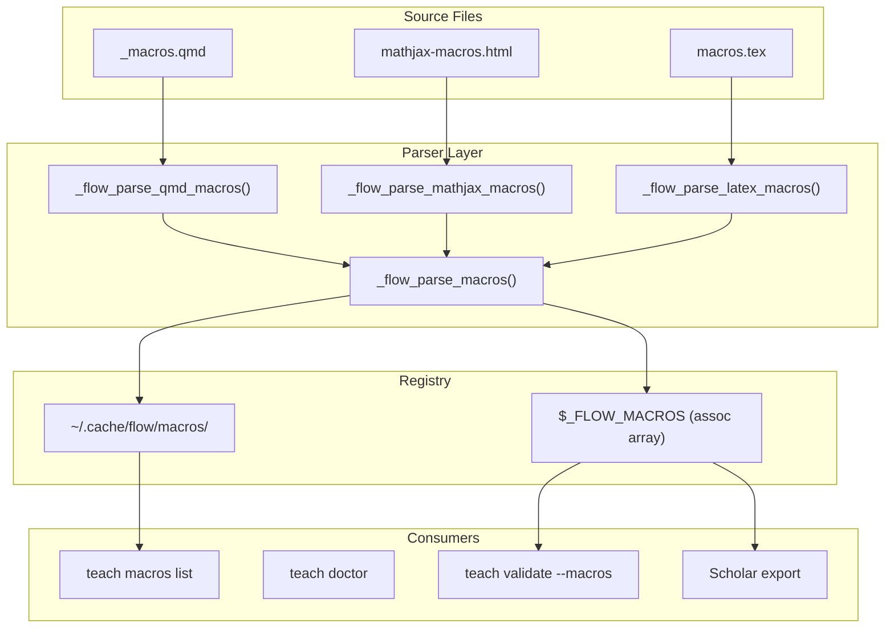

# BRAINSTORM: LaTeX Macro Configuration Support

**Generated:** 2026-01-28
**Mode:** Feature | **Depth:** Max (with agents)
**Issue:** #305
**Duration:** ~8 min

---

## Overview

Add explicit LaTeX macro configuration to `teach-config.yml` so content generation commands can reference and use project-specific macros consistently. Primary pain point: **AI generates wrong notation** (e.g., `$E[Y]$` instead of `$\E{Y}$`).

---

## Requirements Summary (from 8 Expert Questions)

| Question                      | Answer                                                |
| ----------------------------- | ----------------------------------------------------- |
| **Primary pain point**        | AI generates wrong notation                           |
| **Primary user**              | All equally (instructor + AI + TA)                    |
| **Macro source format**       | Both HTML and .tex equally important                  |
| **Validation level**          | Warn only (not blocking)                              |
| **Auto-sync**                 | Yes - extract from source files                       |
| **MVP scope**                 | Config schema + teach doctor display                  |
| **teach analyze integration** | Yes - add to concept analysis                         |
| **Scholar integration**       | All methods (config, CLI flag, env var)               |
| **Quarto method**             | Support all methods (auto-detect)                     |
| **Documentation locations**   | doctor, status --macros, teach macros list, CLAUDE.md |
| **Common macros**             | Operators, distributions, symbols, matrices           |

---

## Quick Wins (< 30 min each)

1. **Config schema design** - Add `latex_macros` section to teach-config.yml template
2. **teach macros help** - Add help text following existing pattern
3. **teach doctor section** - Show macro count and source file status

## Medium Effort (1-2 hours)

- [ ] `lib/macro-parser.zsh` - Parse macros from .qmd/.tex/.html (~350 lines)
- [ ] `commands/teach-macros.zsh` - list/sync/export commands (~200 lines)
- [ ] `teach validate --macros` - Check undefined/unused macros
- [ ] Cache layer with hash-based invalidation

## Long-term (Future sessions)

- [ ] Scholar plugin integration (prompt context)
- [ ] CLAUDE.md auto-generation with macro table
- [ ] IDE integration (hover docs for macros)

---

## Agent Analysis: Backend Architecture

### Proposed Config Schema

```yaml
teaching_style:
  latex_macros:
    enabled: true # Master toggle

    sources: # Searched in priority order
      - path: '_macros.qmd'
        format: 'qmd'
      - path: 'includes/mathjax-macros.html'
        format: 'mathjax'
      - path: 'tex/macros.tex'
        format: 'latex'

    auto_discover: true # Scan common locations

    validation:
      warn_undefined: true # Warn if macro used but not defined
      warn_unused: true # Warn if defined but never used
      warn_conflicts: true # Warn if same macro defined differently

    scholar:
      export_format: 'mathjax' # qmd | mathjax | latex | json
      include_in_prompts: true # Add to AI context
```

### Parser Architecture (Mermaid)



### New Files Required

| File                               | Purpose                     | Lines |
| ---------------------------------- | --------------------------- | ----- |
| `lib/macro-parser.zsh`             | Format parsers, registry    | ~350  |
| `commands/teach-macros.zsh`        | list, sync, export commands | ~200  |
| `tests/test-macro-parser.zsh`      | Unit tests                  | ~300  |
| `docs/reference/REFCARD-MACROS.md` | Quick reference             | ~100  |

---

## Agent Analysis: CLI UX Design

### Command Outputs

**teach macros list (compact):**

```
LaTeX Macros (14 available)

OPERATORS
  \E             → \mathbb{E}           Expectation
  \Var           → \text{Var}           Variance
  \Cov           → \text{Cov}           Covariance

DISTRIBUTIONS
  \Normal        → \mathcal{N}          Normal distribution
  \Binomial      → \text{Bin}           Binomial distribution

SYMBOLS
  \indep         → \perp\!\!\!\perp     Independence
  \iid           → \text{i.i.d.}        IID notation

Source: _macros.qmd (synced 2h ago)
```

**teach macros sync:**

```
Syncing macros from _macros.qmd...

Found 14 macros:
  + \E, \Var, \Cov, \Corr           (4 operators)
  + \Normal, \Binomial              (2 distributions)
  + \indep, \iid                    (2 symbols)
  + \bX, \bbeta, \bY, \bepsilon     (4 matrices)
  + \hat, \ol                       (2 decorators)

Updated .flow/macros.yml
Updated CLAUDE.md (macro reference section)

Done in 0.23s
```

**teach doctor (macro section):**

```
MACROS
  Source file     ✓ _macros.qmd exists
  Config sync     ✓ .flow/macros.yml up to date
  CLAUDE.md       ✓ Macro section present
  Usage check     ⚠ 2 macros unused in content
                    \convn, \asdf (consider removing)
```

### Performance Targets

| Operation                 | Target          |
| ------------------------- | --------------- |
| `teach macros list`       | < 10ms (cached) |
| `teach macros sync`       | < 500ms         |
| `teach validate --macros` | < 1s            |
| `teach doctor` macros     | < 50ms          |

---

## Research: Quarto Macro Methods

Three main approaches (from [Quarto discussions](https://github.com/quarto-dev/quarto-cli/discussions/12838)):

1. **`_macros.qmd` + include shortcode** (recommended)
   - Single source for HTML + PDF
   - Pandoc processes `\newcommand`
   - Requires boilerplate in each file: ``

2. **MathJax config + separate .tex**
   - Separate files for web vs PDF
   - More flexibility but harder to maintain

3. **Quarto `_common.qmd` include**
   - Works but can cause blank slides in revealjs

**flow-cli will support all methods via auto-detection.**

---

## Implementation Phases

### Phase 1: Core Parser (4h)

- Schema design in config template
- `lib/macro-parser.zsh` with 3 format parsers
- Unit tests

### Phase 2: Commands (3h)

- `teach macros list`
- `teach macros sync`
- `teach macros export`

### Phase 3: Integration (3h)

- `teach doctor` section
- `teach validate --macros`
- `teach analyze` extension

### Phase 4: Cache & Scholar (4h)

- Hash-based cache with mtime invalidation
- Scholar API (config file, CLI flag, env var)
- CLAUDE.md auto-generation

**Total: ~14 hours**

---

## Recommended Path

Start with **Phase 1** (config schema + parser) because:

1. Foundation for all other features
2. Can test with real course macro files immediately
3. Low risk - pure ZSH, no external dependencies
4. Unblocks Phase 2-4 work

**Immediate next step:** Create worktree and implement `lib/macro-parser.zsh`

---

## Open Questions

1. Should `teach macros sync` create source file if missing?
2. Should warnings be configurable per-macro (suppress specific warnings)?
3. Priority: integrate with `teach analyze` in Phase 3 or defer?

---

## Related Issues

- #298 - Config consolidation (teaching config in .flow/)
- #299 - Scholar plugin config consolidation
- Scholar plugin issue (to be created for AI integration)

---

## Sources

- [Quarto Global TeX Macro file discussion](https://github.com/quarto-dev/quarto-cli/discussions/12838)
- [Including LaTeX macros from a file](https://github.com/quarto-dev/quarto-cli/discussions/2845)
- [Defining LaTeX commands for HTML and PDF](https://github.com/quarto-dev/quarto-cli/discussions/1793)
