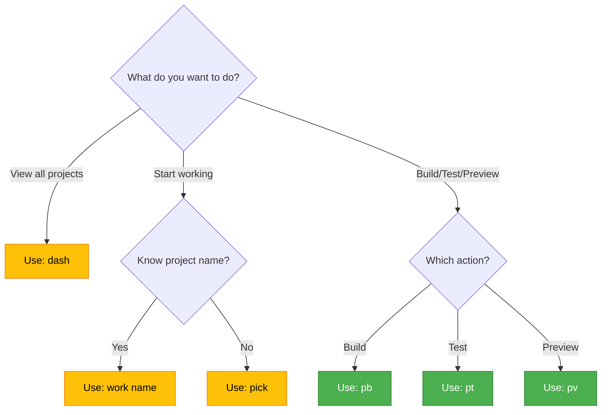
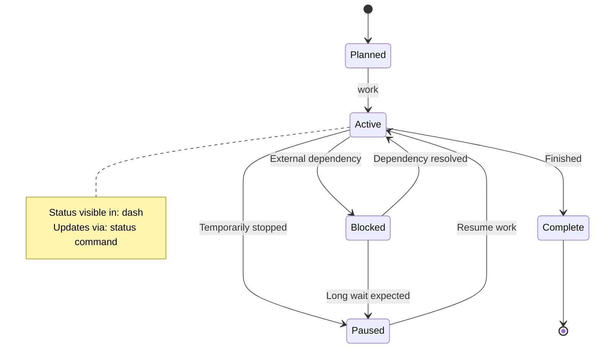
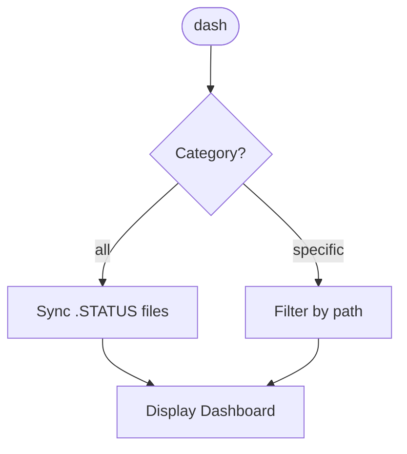

# 📊 Mermaid Diagram Documentation - Comprehensive Brainstorm

**Generated:** 2025-12-22
**Context:** flow-cli documentation enhancement
**Trigger:** User question about visualizing `dash` command procedure

---

## 🎯 Core Question

> "Should we include Mermaid diagrams in the online docs for `dash` and other commands to explain their procedures?"

**Short Answer:** ⭐ **YES, absolutely!** But with strategic priorities.

---

## 📋 Current State Analysis

### What Exists Now

1. **Mermaid Already Used** (5 files found)
   - `docs/architecture/VENDOR-INTEGRATION-ARCHITECTURE.md` - Architecture layers diagram
   - `docs/api/API-OVERVIEW.md` - API structure
   - Other architecture docs

2. **dash Command Flow** (from source code analysis)

   ```
   dash [category]
   ├─→ Sync .STATUS files to project-hub (if "all")
   ├─→ Filter by category (teaching/research/packages/dev/quarto)
   ├─→ Scan all .STATUS files
   ├─→ Categorize by status (active/ready/paused/blocked)
   └─→ Display formatted dashboard
   ```

3. **Documentation Site**
   - MkDocs-based site at `/docs`
   - 102 markdown files
   - Clean Architecture with ADRs
   - Already has syntax for Mermaid (MkDocs supports it)

### What's Missing

- **No command flow diagrams** in user-facing docs
- **No visual procedure guides** for complex commands
- **No decision trees** for command selection
- **No state diagrams** for workflow states

---

## 💡 BRAINSTORM: Diagram Types & Use Cases

### 1. ⭐ Command Flow Diagrams (HIGH PRIORITY)

**Purpose:** Show step-by-step execution flow

**Best For:**

- `dash` - complex multi-step sync + categorize + display
- `pick` - interactive selection with branching paths
- `work` - session start with multiple side effects
- `cc` / `gm` - project picker integration flow
- `pb` / `pt` / `pv` - context-aware dispatchers

**Example: `dash` Flow**

```mermaid
flowchart TD
    Start([User runs: dash category]) --> CheckCategory{Category?}

    CheckCategory -->|all| SyncStart[🔄 Sync .STATUS files]
    CheckCategory -->|specific| FilterPath[Set filter path]

    SyncStart --> FindStatus[Find all .STATUS files]
    FindStatus --> CopyToHub[Copy to project-hub]
    CopyToHub --> UpdateTime[Update timestamp]
    UpdateTime --> FilterPath

    FilterPath --> ScanFiles[Scan .STATUS files]
    ScanFiles --> ParseFields[Parse: status, priority, progress, next]

    ParseFields --> Categorize{Categorize by status}

    Categorize -->|active| ActiveList[🔥 Active Projects]
    Categorize -->|ready| ReadyList[📋 Ready Projects]
    Categorize -->|paused| PausedList[⏸️ Paused Projects]
    Categorize -->|blocked| BlockedList[🚫 Blocked Projects]

    ActiveList --> Display[Display Dashboard]
    ReadyList --> Display
    PausedList --> Display
    BlockedList --> Display

    Display --> ShowActions[Show Quick Actions]
    ShowActions --> End([Done])

    style Start fill:#4CAF50,stroke:#2E7D32,color:#fff
    style Display fill:#2196F3,stroke:#1565C0,color:#fff
    style End fill:#4CAF50,stroke:#2E7D32,color:#fff
```



**Benefits:**

- ✅ Visual understanding of complex logic
- ✅ Debugging aid for contributors
- ✅ Quick reference for users
- ✅ ADHD-friendly (visual > text)

---

### 2. Decision Trees (MEDIUM PRIORITY)

**Purpose:** Help users choose the right command

**Best For:**

- "Which command should I use?" guides
- Error troubleshooting paths
- Project type selection

**Example: "Which Project Command?"**



---

### 3. State Diagrams (MEDIUM PRIORITY)

**Purpose:** Show project/session lifecycle

**Best For:**

- Project status transitions (Active → Paused → Complete)
- Session states (Started → Working → Finished)
- Git workflow states

**Example: Project Status Lifecycle**



---

### 4. Architecture Diagrams (LOW PRIORITY - Already Have)

**Purpose:** System component relationships

**Status:** ✅ Already implemented in architecture docs

---

### 5. Sequence Diagrams (LOW PRIORITY)

**Purpose:** Show interactions between components over time

**Best For:**

- CLI → Shell → Filesystem interactions
- API request/response flows
- Complex multi-step workflows

**Example: `work` Command Sequence**

```mermaid
sequenceDiagram
    participant User
    participant ZSH as work function
    participant Detector as project-detector
    participant Git
    participant Session as worklog

    User->>ZSH: work medfit
    ZSH->>Detector: Get project type
    Detector->>Git: Check .git
    Detector->>Detector: Check DESCRIPTION
    Detector-->>ZSH: Type: r (R package)
    ZSH->>Git: git status
    Git-->>ZSH: Status output
    ZSH->>Session: Log session start
    Session-->>ZSH: ✅ Logged
    ZSH->>User: 📦 medfit | r | main ✓
```



---

## 🎨 VISUAL DESIGN CONSIDERATIONS

### 1. Color Consistency

**Proposed Color Scheme:**

```
🟢 Success/Start  : #4CAF50 (Green)
🔵 Process/Action : #2196F3 (Blue)
🟡 Decision/Choice: #FFC107 (Yellow)
🔴 Error/Block    : #F44336 (Red)
🟣 Info/Reference : #9C27B0 (Purple)
⚪ Neutral/End    : #757575 (Gray)
```

### 2. Icon Integration

**Consistent Icons Across Diagrams:**

- 🔥 Active/Hot
- 📋 List/Ready
- ⏸️ Paused
- 🚫 Blocked
- ✅ Success/Complete
- ⚠️ Warning
- 🔄 Sync/Process
- 📊 Dashboard/View

### 3. Complexity Levels

**Guidelines:**

- **Simple diagrams:** 5-10 nodes max (quick glance)
- **Medium diagrams:** 10-20 nodes (main reference)
- **Complex diagrams:** 20+ nodes (deep dive, optional)

---

## 📐 IMPLEMENTATION APPROACHES

### Option A: ⭐ Incremental Addition (RECOMMENDED)

**Strategy:** Add diagrams to high-traffic docs first

**Phase 1: Core Commands** (Week 1)

- [ ] `dash` command flow
- [ ] `pick` command flow
- [ ] `work` command flow
- [ ] Command selection decision tree

**Phase 2: Smart Dispatchers** (Week 2)

- [ ] `cc` / `gm` integration flow
- [ ] `pb` / `pt` / `pv` context detection
- [ ] `peek` file type auto-detection

**Phase 3: Advanced Flows** (Week 3)

- [ ] Project status lifecycle (state diagram)
- [ ] Session workflow (sequence diagram)
- [ ] Error handling paths

**Benefits:**

- ✅ Low risk, high value
- ✅ User feedback drives priorities
- ✅ Incremental learning curve

---

### Option B: Comprehensive Documentation Overhaul

**Strategy:** Create diagram-first documentation

**Scope:**

- Diagram for EVERY command (28+ diagrams)
- Interactive diagram gallery
- Diagram-based tutorials

**Benefits:**

- ✅ Complete visual reference
- ✅ Consistent experience

**Drawbacks:**

- ❌ High time investment (2-3 weeks)
- ❌ Maintenance burden
- ❌ May overwhelm simple commands

---

### Option C: Hybrid - Template + Selective

**Strategy:** Create reusable templates, apply selectively

**Components:**

1. **Diagram Templates** (5 types)
   - Command flow template
   - Decision tree template
   - State diagram template
   - Sequence diagram template
   - Integration diagram template

2. **Complexity-Based Rule**
   - Simple commands (< 5 steps): Text only
   - Medium commands (5-15 steps): Optional diagram
   - Complex commands (15+ steps): Diagram required

**Benefits:**

- ✅ Balance between completeness and effort
- ✅ Reusable patterns
- ✅ Clear guidelines for contributors

---

## 🎯 PRIORITY MATRIX

### High Priority (Do First) ⭐

| Command           | Reason                              | Diagram Type  | Effort |
| ----------------- | ----------------------------------- | ------------- | ------ |
| `dash`            | Complex, multi-step, high-traffic   | Flowchart     | 30 min |
| `pick`            | Interactive, branching logic        | Flowchart     | 20 min |
| `work`            | Multiple side effects, key workflow | Sequence      | 30 min |
| Command selection | Common user question                | Decision tree | 20 min |

**Total Effort:** ~2 hours

---

### Medium Priority (Next Phase)

| Command            | Reason                      | Diagram Type  | Effort      |
| ------------------ | --------------------------- | ------------- | ----------- |
| `cc` / `gm`        | Project integration pattern | Flowchart     | 15 min each |
| `pb` / `pt` / `pv` | Context detection logic     | Flowchart     | 20 min each |
| Status lifecycle   | Conceptual understanding    | State diagram | 25 min      |

**Total Effort:** ~2 hours

---

### Low Priority (Optional Enhancement)

| Item            | Reason                  | Diagram Type | Effort      |
| --------------- | ----------------------- | ------------ | ----------- |
| Simple commands | Text sufficient         | -            | -           |
| Architecture    | ✅ Already done         | -            | -           |
| API flows       | Technical audience only | Sequence     | 30 min each |

---

## 🛠️ TECHNICAL IMPLEMENTATION

### MkDocs Configuration

**Already Supported:** MkDocs Material supports Mermaid out-of-the-box

**Current Config Check:**

```yaml
# mkdocs.yml
markdown_extensions:
  - pymdownx.superfences:
      custom_fences:
        - name: mermaid
          class: mermaid
          format: !!python/name:pymdownx.superfences.fence_code_format
```

**If not configured, add:**

```yaml
markdown_extensions:
  - pymdownx.superfences:
      custom_fences:
        - name: mermaid
          class: mermaid
          format: !!python/name:pymdownx.superfences.fence_code_format
```

---

### Diagram Embedding

**Standard Pattern:**

````markdown
## Command Flow

The `dash` command follows this procedure:



**Steps:**

1. Parse category argument
2. Sync files if "all"
3. Filter by path
4. Display categorized projects
````

---

### Accessibility Considerations

**Best Practices:**

1. **Always provide text alternative** alongside diagram
2. **Use semantic HTML** for screen readers
3. **High contrast colors** for visibility
4. **Descriptive labels** on all nodes

**Example:**

````markdown
### Visual Flow

```mermaid
[diagram]
```
````

### Text Alternative

The `dash` command performs these steps:

1. Parses the category argument (teaching/research/packages/dev/all)
2. If category is "all", syncs .STATUS files to project-hub
3. Scans and filters .STATUS files by category
4. Categorizes projects by status (active/ready/paused/blocked)
5. Displays formatted dashboard with quick actions

````

---

## 🧠 ADHD-FRIENDLY DESIGN

### Cognitive Load Reduction

**Principles:**
1. **One diagram per concept** (avoid cluttered mega-diagrams)
2. **Progressive disclosure** (simple → detailed versions)
3. **Visual hierarchy** (color + size + spacing)
4. **Consistent patterns** (same layout for similar commands)

**Example: Two-Level Approach**

**Level 1: Quick View (5 nodes)**
```mermaid
flowchart LR
    Input([dash category]) --> Process[Scan & Filter] --> Output([Display Dashboard])
````

**Level 2: Detailed View (expandable section)**

```mermaid
flowchart TD
    [Full 20-node diagram with all details]
```

---

### Scan-Friendly Layout

**Bad:**

```
[Long paragraph of text explaining dash command flow with embedded references to files and functions and multiple conditional branches that require careful reading...]
```

**Good:**

```
## Quick Summary
Visual flow → [Diagram] → Key steps below

## Detailed Steps
1. Step one
2. Step two
[Expandable: Full details]
```

---

## 📊 METRICS & SUCCESS CRITERIA

### Documentation Quality Metrics

**Before Diagrams:**

- User questions: "How does X work?"
- Avg time to understand: ~10 min reading
- Contributor onboarding: ~1 week

**After Diagrams (Target):**

- User comprehension: 80% from diagram alone
- Avg time to understand: ~2 min (glance at diagram)
- Contributor onboarding: ~3 days

### Implementation Metrics

**Track:**

- Number of diagrams added
- Page views on diagram-heavy pages
- User feedback on clarity
- Time spent on each doc page (should decrease!)

---

## 🚀 RECOMMENDED NEXT STEPS

### Immediate Actions (This Session)

1. ⭐ **Create `dash` command flowchart** (30 min)
   - Add to new page: `docs/commands/dash.md`
   - Include both simple and detailed views
   - Add text alternative for accessibility

2. **Create command selection decision tree** (20 min)
   - Add to `docs/getting-started/quick-start.md`
   - Help new users pick right command

3. **Verify MkDocs Mermaid config** (5 min)
   - Check `mkdocs.yml` has Mermaid support
   - Test rendering locally

**Total Time:** ~1 hour

---

### Phase 2: Expand Coverage (Next Week)

4. Add `pick` command flowchart
5. Add `work` command sequence diagram
6. Create project status lifecycle diagram
7. Add diagrams to top 5 most-viewed pages

**Total Time:** ~2 hours

---

### Phase 3: Template & Guidelines (Future)

8. Create diagram template library
9. Write contributor guidelines for diagram creation
10. Add "when to use diagrams" decision tree for docs

**Total Time:** ~3 hours

---

## 💎 CREATIVE IDEAS (Wild & Unconventional)

### 1. Interactive Diagrams

**Concept:** Clickable nodes that expand/collapse

**Implementation:**

- Use Mermaid + JavaScript
- Click on node → Show code snippet
- Click on decision → Show example

**Example:**

```
[User clicks "Sync Files" node]
→ Tooltip shows: "Code: lines 48-71 in dash.zsh"
→ Expandable section shows actual code
```

**Benefit:** ⭐ Live reference while reading docs

---

### 2. Animated Flow Diagrams

**Concept:** Step-by-step animation showing execution

**Implementation:**

- CSS animations on Mermaid diagrams
- Highlight current step
- Auto-advance or click-to-advance

**Example:**

```
Step 1: [Start] (highlighted)
Step 2: [Parse Args] (highlighted after 1s)
Step 3: [Sync Files] (highlighted after 2s)
```

**Benefit:** Temporal understanding of flow

---

### 3. "Choose Your Own Adventure" Docs

**Concept:** Interactive decision tree in docs

**Implementation:**

```markdown
What do you want to do?

- [View projects] → Go to section 2.1
- [Start working] → Go to section 2.2
- [Build/Test] → Go to section 2.3
```

**Benefit:** Personalized learning path

---

### 4. Diagram Gallery Page

**Concept:** Centralized visual reference

**Implementation:**

- `/docs/diagrams/` page
- Thumbnail grid of all diagrams
- Click to expand with context

**Benefit:** Visual learners can browse all diagrams

---

### 5. Mermaid-Generated Command Help

**Concept:** `command help --diagram` shows ASCII art flow

**Implementation:**

```bash
$ dash help --diagram

     ┌────────┐
     │  dash  │
     └────┬───┘
          │
     ┌────▼────┐
     │category?│
     └─┬────┬──┘
   all │    │ specific
       │    │
     [sync] [filter]
```

**Benefit:** CLI-native visualization

---

### 6. LLM-Generated Diagrams

**Concept:** Auto-generate diagrams from code

**Implementation:**

- Parse function code
- Extract flow logic
- Generate Mermaid syntax
- Human review + edit

**Benefit:** Faster diagram creation, less manual work

---

## 🔄 MAINTENANCE CONSIDERATIONS

### Diagram Versioning

**Challenge:** Code changes → Diagrams outdated

**Solutions:**

1. **Automated tests** - Check if diagram matches code structure
2. **Git hooks** - Warning if function changes but diagram doesn't
3. **Quarterly review** - Scheduled diagram audit
4. **Version tags** - "Diagram updated: 2025-12-22"

---

### Contributor Guidelines

**Required in CONTRIBUTING.md:**

```markdown
## Adding Diagrams

1. Use Mermaid syntax (not images)
2. Follow color scheme (green=start, blue=process, yellow=decision)
3. Keep simple diagrams < 10 nodes
4. Always provide text alternative
5. Test rendering locally before PR
```

---

## 🎓 LEARNING RESOURCES

### For Creating Diagrams

- [Mermaid Live Editor](https://mermaid.live/) - Interactive preview
- [Mermaid Docs](https://mermaid.js.org/) - Full syntax reference
- [MkDocs Material](https://squidfunk.github.io/mkdocs-material/) - Integration guide

### Inspiration

- [GitHub Docs](https://docs.github.com/) - Uses Mermaid extensively
- [Rust Book](https://doc.rust-lang.org/book/) - Great diagrams
- [AWS Architecture Icons](https://aws.amazon.com/architecture/icons/) - Visual system design

---

## 🏆 SUMMARY & RECOMMENDATIONS

### Top 3 Recommendations

#### 1. ⭐⭐⭐ Start with `dash` + Decision Tree (60 min)

**Why:**

- Immediate value to users
- Addresses user's original question
- Low effort, high impact
- Tests the workflow

**Deliverables:**

- `docs/commands/dash.md` with flowchart
- `docs/getting-started/quick-start.md` with decision tree
- Test both render correctly

---

#### 2. ⭐⭐ Adopt Option A: Incremental Addition

**Why:**

- Low risk
- User feedback-driven
- Sustainable maintenance
- Flexible priorities

**Process:**

1. Add diagrams to high-traffic pages
2. Collect user feedback
3. Iterate based on value

---

#### 3. ⭐ Create Diagram Templates + Guidelines (2 hours)

**Why:**

- Consistency across diagrams
- Faster creation for contributors
- Clear quality standards
- Long-term scalability

**Deliverables:**

- 5 diagram templates (flowchart, decision, state, sequence, architecture)
- Contributor guidelines in CONTRIBUTING.md
- Color scheme + icon reference

---

## 🎯 QUICK WIN: Start Today

**Task:** Create `dash` command diagram in new page

**File:** `docs/commands/dash.md`

**Content:**

1. Command overview (2 sentences)
2. Quick flow diagram (simple, 5 nodes)
3. Detailed flow diagram (complete, 15-20 nodes)
4. Text-based step list (accessibility)
5. Examples section
6. Related commands

**Time:** 45 minutes

**Impact:**

- Answers user's question ✅
- Establishes diagram pattern ✅
- Demonstrates value ✅

---

## 🔮 FUTURE VISION

**6 Months from Now:**

- ✅ Every complex command has a diagram
- ✅ Interactive diagram gallery
- ✅ Consistent visual language
- ✅ Reduced support questions
- ✅ Faster contributor onboarding
- ✅ ADHD-friendly visual documentation

**12 Months from Now:**

- ✅ Auto-generated diagrams from code
- ✅ Animated execution flows
- ✅ Click-to-explore interactive docs
- ✅ Best-in-class CLI documentation

---

## 📝 ACTION CHECKLIST

### This Session

- [ ] Create `dash` command flowchart
- [ ] Add to documentation site
- [ ] Test rendering
- [ ] Get user feedback

### Next Week

- [ ] Add 3-5 more diagrams (priority commands)
- [ ] Create diagram templates
- [ ] Update contributor guidelines

### This Month

- [ ] Comprehensive diagram coverage for top 10 commands
- [ ] User survey on diagram helpfulness
- [ ] Establish maintenance process

---

**Status:** 💡 Ready for implementation
**Effort:** Low (start with 1 hour investment)
**Value:** High (visual clarity + ADHD-friendly)
**Risk:** Low (incremental, reversible)

**Recommendation:** ⭐ **START TODAY** with `dash` diagram!
