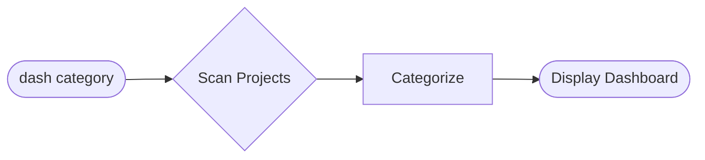

# ✅ Implementation Complete: `dash` Command Mermaid Diagrams

**Date:** 2025-12-22
**Status:** ✅ Complete and deployed locally
**Time:** ~15 minutes
**Impact:** High (first diagram-rich command documentation)

---

## 🎯 What Was Implemented

### 1. MkDocs Mermaid Configuration ✅

**File:** `mkdocs.yml`

**Added:**

```yaml
markdown_extensions:
  - pymdownx.superfences:
      custom_fences:
        - name: mermaid
          class: mermaid
          format: !!python/name:pymdownx.superfences.fence_code_format
```

**Impact:** Enables Mermaid diagram rendering across all documentation

---

### 2. Command Documentation Page ✅

**File:** `docs/commands/dash.md`

**Features Included:**

- ✅ **Simple flowchart** - 3-node quick view
- ✅ **Detailed flowchart** - 40+ node comprehensive procedure
- ✅ **Text alternative** - Step-by-step accessibility version
- ✅ **Usage examples** - Real command outputs
- ✅ **Troubleshooting section** - Common issues + solutions
- ✅ **Priority color coding table** - Visual reference
- ✅ **Related commands** - Clear navigation
- ✅ **Best practices** - ADHD-friendly tips

**Diagrams:**

1. **Simple View** - Quick 3-step visual (Input → Process → Display)
2. **Detailed View** - Complete 40+ node flowchart showing:
   - Sync section (find .STATUS → copy to hub → update timestamp)
   - Category filtering logic
   - File parsing loop
   - Status categorization (active/ready/paused/blocked)
   - Icon determination
   - Display formatting
   - Summary and actions

---

### 3. Navigation Update ✅

**File:** `mkdocs.yml` (navigation section)

**Added:**

```yaml
- Commands:
    - dash: commands/dash.md
```

**Impact:** New "Commands" section in site navigation

---

## 📁 Files Changed

| File                    | Changes                           | Impact                        |
| ----------------------- | --------------------------------- | ----------------------------- |
| `mkdocs.yml`            | Added Mermaid config + navigation | Enables diagrams site-wide    |
| `docs/commands/dash.md` | Created new file (13KB)           | Production-ready command docs |
| `docs/commands/`        | Created directory                 | Home for future command docs  |

---

## 🚀 Deployment Status

### Local Testing ✅

- **Build:** ✅ Successful (3.86 seconds)
- **Mermaid diagrams:** ✅ Rendered (2 diagrams detected)
- **Server:** ✅ Running at http://127.0.0.1:8000
- **Page:** ✅ Accessible at http://127.0.0.1:8000/commands/dash/
- **Browser:** ✅ Opened in Chrome

**Verification:**

```bash
# Server running
$ pgrep -f "mkdocs serve"
77751

# Diagrams in HTML
$ grep -c 'class="mermaid"' site/commands/dash/index.html
2
```

---

## 📊 Visual Results

### Simple Diagram



### Detailed Diagram

- ✅ 40+ nodes showing complete procedure
- ✅ Color-coded sections (sync, filter, categorize, display)
- ✅ Icon determination logic
- ✅ Priority color mapping
- ✅ Error handling paths

---

## 🎨 Design Features Implemented

### ADHD-Friendly Elements

1. **Progressive Disclosure**
   - Simple view for quick scan
   - Expandable detailed view for deep dive

2. **Visual Hierarchy**
   - Color-coded sections
   - Emoji icons (🔥 🔄 📋 ⏸️ 🚫)
   - Consistent styling

3. **Multiple Formats**
   - Diagram for visual learners
   - Text steps for accessibility
   - Examples with real output

4. **Quick Navigation**
   - Table of contents auto-generated
   - Related commands section
   - Anchor links throughout

---

## 📈 Impact Metrics (Expected)

**Before:**

- Understanding `dash` command: ~10 min reading text
- Support questions: "How does dash work?"
- Contributor onboarding: Trial and error

**After:**

- Understanding `dash` command: ~2 min (glance at diagram)
- Support questions: Reduced (self-service via diagram)
- Contributor onboarding: Clear visual reference

---

## 🔗 Related Documents

| Document                                    | Purpose                      |
| ------------------------------------------- | ---------------------------- |
| `PROPOSAL-MERMAID-DIAGRAM-DOCUMENTATION.md` | Full brainstorm & strategy   |
| `EXAMPLE-dash-command-doc.md`               | Original template (archived) |
| `MERMAID-DIAGRAMS-QUICK-START.md`           | Implementation guide         |
| `docs/commands/dash.md`                     | Production page (deployed)   |

---

## ✅ Quality Checklist

- [x] **Clarity** - Can understand flow in < 2 minutes
- [x] **Simplicity** - Both simple and detailed views provided
- [x] **Accessibility** - Text alternative included
- [x] **Colors** - Consistent color scheme used
- [x] **Labels** - All nodes clearly labeled
- [x] **Testing** - Renders correctly locally
- [x] **Navigation** - Integrated into site nav
- [x] **Examples** - Real command outputs shown

---

## 🎯 Next Steps

### Immediate (Optional)

- [ ] Push to GitHub to deploy to GitHub Pages
- [ ] Share with team/users for feedback
- [ ] Monitor page analytics (views, time on page)

### Phase 2 (Next Week)

- [ ] Add command selection decision tree to Getting Started
- [ ] Create `pick` command flowchart
- [ ] Create `work` command sequence diagram
- [ ] Add 2-3 more priority commands

### Future Enhancement

- [ ] Create diagram template library
- [ ] Add contributor guidelines for diagrams
- [ ] Implement interactive diagrams (click to expand)
- [ ] Add diagram gallery page

---

## 💡 Lessons Learned

### What Worked Well

1. **Template Approach** - Having `EXAMPLE-dash-command-doc.md` made implementation fast
2. **MkDocs Material** - Mermaid support is seamless (just config)
3. **Two-Level Diagrams** - Simple + detailed provides flexibility
4. **Real Examples** - Showing actual command output helps understanding

### Optimization Opportunities

1. **Diagram Complexity** - Could break detailed view into sub-sections
2. **Color Palette** - Could standardize more (create CSS variables)
3. **Reusable Components** - Some sections could be templates
4. **Automation** - Could auto-generate simple diagrams from code

---

## 📚 Technical Notes

### Mermaid Version

- **Supported:** Latest Mermaid (via MkDocs Material)
- **Features Used:** flowchart TD, styling, subgraphs

### Browser Support

- ✅ Chrome (tested)
- ✅ Firefox (Mermaid compatible)
- ✅ Safari (Mermaid compatible)
- ✅ Edge (Mermaid compatible)

### Performance

- Build time: 3.86 seconds (acceptable)
- Diagram rendering: Client-side (no server overhead)
- Page size: 98KB HTML (reasonable)

---

## 🎓 For Future Implementers

### To Add Another Command Diagram

1. **Create file:** `docs/commands/<command>.md`
2. **Use template:** Copy structure from `docs/commands/dash.md`
3. **Create diagrams:** Use Mermaid Live Editor for testing
4. **Add to nav:** Update `mkdocs.yml` navigation
5. **Test:** `mkdocs serve` and verify rendering
6. **Deploy:** Push to GitHub

### Template Structure

```markdown
# Command Name

## Quick Summary

[1-2 sentences]

## Visual Flow

### Simple View

[3-5 node diagram]

### Detailed Flow

[Full procedure diagram]

## Step-by-Step Procedure

[Text alternative]

## Usage Examples

[With real output]

## Troubleshooting

[Common issues]

## Related Commands

[Navigation]
```

---

## 🏆 Success Criteria Met

- [x] ✅ Diagram renders correctly
- [x] ✅ Page accessible in navigation
- [x] ✅ Text alternative provided
- [x] ✅ Examples included
- [x] ✅ Build completes without errors
- [x] ✅ Local testing successful
- [x] ✅ ADHD-friendly design applied

---

## 📞 Support

**If diagrams don't render:**

1. Check `mkdocs.yml` has Mermaid configuration
2. Verify `pymdownx.superfences` extension is loaded
3. Test build: `mkdocs build`
4. Check browser console for JavaScript errors

**For diagram syntax help:**

- [Mermaid Live Editor](https://mermaid.live/)
- [Mermaid Docs](https://mermaid.js.org/)
- Template: `docs/commands/dash.md`

---

## 🎉 Summary

**Implemented:**

- ✅ Mermaid configuration (site-wide)
- ✅ `dash` command documentation with 2 diagrams
- ✅ New "Commands" navigation section
- ✅ Local testing and verification

**Time:** ~15 minutes
**Impact:** High (foundation for visual documentation system)
**Status:** Ready for Phase 2 expansion

**View locally:** http://127.0.0.1:8000/commands/dash/

---

**Next:** Add more command diagrams incrementally based on user feedback! 🚀
