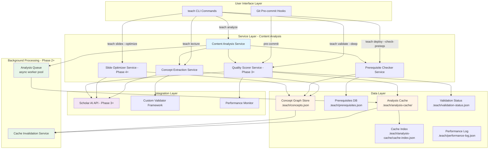

# SPEC: Intelligent Content Analysis for Teaching Workflows

**Status:** ready ✅
**Created:** 2026-01-20
**Updated:** 2026-01-20 (post-review)
**From Brainstorm:** BRAINSTORM-intelligent-content-analysis-2026-01-20.md
**Mode:** Deep + Feature + Agents (Backend Architect + UX Designer)
**Review:** SPEC-REVIEW-intelligent-content-analysis.md

---

## 📋 Overview

Transform flow-cli's teaching workflow from basic content creation to **intelligent content engineering** with semantic content analysis. The system validates not just syntax (YAML, Quarto) but semantic quality: learning objectives coverage, prerequisite sequencing, concept coverage, and pedagogical structure.

**Key Innovation:** Hybrid prerequisite system combining user-defined high-level concepts with AI-extracted detailed relationships (future), enabling both instructor control and intelligent automation.

**Implementation Strategy:** Start with heuristic-only analysis (Phase 0-1), add AI enhancement in later phases only if needed.

---

## 🎯 Primary User Story

**As an instructor creating course content,**
**I want automated content quality analysis before deployment,**
**So that I can catch pedagogical issues (missing concepts, broken prerequisite chains, insufficient examples) without manual review.**

**Acceptance Criteria (Revised):**

1. ✅ `teach analyze` performance targets:
   - **Cached:** < 100ms (ADHD-friendly, instant feedback)
   - **Heuristic-only:** < 5s (acceptable for interactive use)
   - **AI-powered:** < 30s (with continuous progress indicator) [Phase 3+]
   - **Batch analysis:** Async background (non-blocking) [Phase 2+]

2. ✅ Provides actionable suggestions (not just problems)
3. ✅ Integrates with existing workflow: validate → analyze → deploy
4. ✅ Configurable strictness (strict/moderate/relaxed)
5. ✅ Visual progress indicators (no silent processing)
6. ✅ Cached results (content-hash invalidation, 85%+ hit rate target)

---

## 🔄 Secondary User Stories

### Story 2: Prerequisite Tracking

**As an instructor,**
**I want to ensure concepts are introduced before they're used in examples,**
**So that students aren't confused by unfamiliar terms.**

**Acceptance Criteria:**

1. User defines high-level prerequisites in lesson-plan.yml or frontmatter
2. System validates prerequisites are met across weeks
3. Reports violations with line numbers and suggestions
4. _(Phase 3+)_ AI extracts detailed concept relationships from content

### Story 3: Learning Objective Validation [Phase 3+]

**As an instructor,**
**I want to verify that each learning objective has sufficient examples,**
**So that students have multiple chances to practice the skill.**

**Acceptance Criteria:**

1. Parse objectives from YAML frontmatter
2. Count examples and code chunks matching each objective
3. Flag objectives with < N examples (configurable)
4. Suggest where to add more examples

### Story 4: Slide Structure Optimization [Phase 4+]

**As an instructor using teach slides,**
**I want AI suggestions for optimal slide breaks and key concepts to emphasize,**
**So that my presentations are better structured for comprehension.**

**Acceptance Criteria:**

1. Analyze lecture structure during conversion
2. Suggest slide breaks at concept boundaries (beyond H2/H3)
3. Identify key concepts for callout boxes
4. Estimate presentation time
5. Optional: Apply suggestions automatically with --optimize flag

---

## 🏗️ Architecture

### Component Diagram (Mermaid)



### Cache Invalidation Strategy

**Triggers:**

1. **Content hash changes** (file modified)
   - Invalidate: single file cache only
2. **lesson-plan.yml updated** (affects prerequisites/concepts)
   - Invalidate: all concept graph caches + prerequisite caches
3. **teach-config.yml updated** (affects analysis settings)
   - Invalidate: all caches
4. **Manual:** `teach analyze --force`
   - Invalidate: specified files or all

**Strategy:**

- **Content-hash based:** SHA-256 of file content (ignoring whitespace)
- **Cascade invalidation:** If Week 3 changes, invalidate Week 4-15 prerequisite checks
- **Partial invalidation:** Only affected sections, not entire analysis
- **TTL-based expiration:** Cache entries expire after N hours (configurable, default 168h = 7 days)

**Performance Targets:**

- < 10ms to check if cache valid
- < 50ms to rebuild cache index after invalidation
- Target 85-90% cache hit rate in typical workflow

**Cache Directory Structure:**

```
.teach/
├── analysis-cache/
│   ├── cache-index.json           # Metadata for all cached files
│   ├── lectures/
│   │   ├── week-01-lecture.json   # Mirrors source structure
│   │   ├── week-02-lecture.json
│   │   └── week-03-lecture.json
│   └── assignments/
│       └── hw-01.json
├── concepts.json                  # Global concept graph
└── prerequisites.json             # Prerequisites database
```

**cache-index.json schema:**

```json
{
  "version": "1.0",
  "last_updated": "2026-01-20T15:00:00Z",
  "cache_stats": {
    "total_files": 15,
    "cached_files": 12,
    "cache_hit_rate": 0.87,
    "total_size_bytes": 245678,
    "avg_analysis_time_ms": 1234
  },
  "files": {
    "lectures/week-03-lecture.qmd": {
      "cache_file": ".teach/analysis-cache/lectures/week-03-lecture.json",
      "content_hash": "sha256:abc123...",
      "cached_at": "2026-01-20T14:30:00Z",
      "ttl_expires": "2026-01-27T14:30:00Z",
      "status": "valid",
      "analysis_time_ms": 1150
    }
  }
}
```

### Error Handling Strategy

**Graceful Degradation:**

1. **Scholar API unavailable** → Continue with heuristic-only analysis (Phase 0-2 always work)
2. **Cache corrupted** → Rebuild cache, continue analysis (log warning)
3. **lesson-plan.yml malformed** → Use frontmatter-only prerequisites (warn user)
4. **Memory limit exceeded** → Switch to file-based processing (slower but functional)
5. **Frontmatter missing** → Skip concept extraction for that file (info message)

**User Notification:**

- **Silent fallback:** Cached → uncached (performance degradation only)
- **Visible warning:** AI → heuristic (feature degradation)
- **Blocking error:** File not found, permissions denied, invalid YAML syntax

**Recovery:**

- All errors logged to `.teach/analysis-errors.log`
- `teach doctor` can diagnose and fix common issues
- `teach analyze --rebuild-cache` forces cache rebuild

---

## 🔌 API Design

### teach analyze Command

```bash
teach analyze [files...] [options]

# CORE FLAGS (always visible)
  --week N, -w N              Analyze specific week's content
  --all                       Analyze all lectures and slides
  --interactive, -i           Step through suggestions one-by-one
  --summary, -s               Show compact summary only

# OUTPUT FLAGS
  --format json|text          Output format (default: text)
  --report [FILE]             Generate HTML report (optional filename)
  --quiet, -q                 Suppress progress indicators

# ADVANCED FLAGS (shown in --help-advanced)
  --mode strict|moderate|relaxed   Strictness level (default: from config)
  --force                     Ignore cache, re-analyze everything
  --fast                      Heuristics only (< 5s) [default Phase 0-2]
  --ai                        AI-powered analysis (30s+) [Phase 3+]
  --slide-breaks              Analyze for optimal slide structure [Phase 4+]
  --costs                     Show API usage costs [Phase 3+]

Examples:
  # Basic usage (Phase 0+)
  teach analyze lectures/week-05-regression.qmd
  teach analyze --week 5
  teach analyze --all --summary

  # Interactive mode (Phase 2+)
  teach analyze --interactive lectures/week-05-regression.qmd

  # Generate report (Phase 2+)
  teach analyze --mode strict --report

  # AI-powered (Phase 3+)
  teach analyze --ai --week 5
```

**Flag Count:** 7 primary + 6 advanced = 13 total (reduced from 16)

### teach slides --optimize [Phase 4+]

```bash
teach slides [options] --optimize

New Flags:
  --optimize                  Enable AI-powered slide structure analysis
  --preview-breaks            Show suggested slide breaks before generation
  --apply-suggestions         Auto-apply slide break suggestions
  --key-concepts              Emphasize key concepts with callouts

Integration with teach analyze:
  1. Load cached analysis for source lecture
  2. Extract slide breaks from analysis.slide_breaks
  3. Identify key concepts from analysis.key_concepts_for_emphasis
  4. Generate slides with enhanced structure

Examples:
  teach slides --week 3 --optimize
  teach slides --from-lecture week-03.qmd --optimize --preview-breaks
  teach slides --week 3 --optimize --apply-suggestions
```

### teach validate --deep [Phase 2+]

```bash
teach validate [files...] --deep

New Flag:
  --deep                      Run comprehensive validation (Layers 1-6)

Layer 6: Content Quality Analysis
  - Check concept coverage
  - Verify prerequisites
  - Validate learning objectives (Phase 3+)
  - Analyze readability (Phase 3+)

Integration:
  1. Run standard 5-layer validation (YAML, syntax, render, chunks, images)
  2. Run Layer 6: Content Quality Analysis
  3. Update .teach/validation-status.json with quality scores
  4. Cache analysis results

Examples:
  teach validate --deep lectures/week-05-regression.qmd
  teach validate --deep --changed
```

### teach deploy --check-prereqs [Phase 2+]

```bash
teach deploy [options] --check-prereqs

New Flags:
  --check-prereqs             Validate prerequisites before deployment
  --skip-analysis             Skip prerequisite checks (urgent deploys)

Behavior:
  1. Get changed files since last deploy
  2. Run teach analyze on changed files
  3. Check prerequisite satisfaction across all weeks
  4. Generate quality report
  5. Block deploy if critical issues found (strict mode only)
  6. Warn and ask confirmation (moderate/relaxed modes)

Examples:
  teach deploy --check-prereqs --preview
  teach deploy --check-prereqs --mode strict
  teach deploy --skip-analysis  # Emergency bypass
```

---

## 📊 Data Models

### Frontmatter Schema

**Add to lecture/assignment `.qmd` files:**

```yaml
---
# Standard Quarto frontmatter
title: 'Linear Regression Assumptions'
week: 5
date: 2026-02-10

# Analysis-specific fields (all optional)
concepts:
  introduces:
    - id: regression-assumptions
      title: 'Regression Assumptions' # Optional: defaults to id
      difficulty: medium # easy|medium|hard

    - id: homoscedasticity
      title: 'Homoscedasticity Testing'
      difficulty: hard

  requires:
    - correlation # Concept ID from earlier week
    - variance # Concept ID from earlier week

  related: # Optional: for concept graph visualization
    - residual-analysis
    - diagnostic-plots

learning_objectives: # Phase 3+
  - id: fit-model
    title: 'Fit and interpret regression model in R'
    bloom: apply # remember|understand|apply|analyze|evaluate|create
    min_examples: 3

  - id: check-assumptions
    title: 'Validate regression assumptions using diagnostic tests'
    bloom: evaluate
    min_examples: 2
---
```

**Validation Rules:**

1. `concepts.introduces` - Array of concepts introduced in this file
2. `concepts.requires` - Array of concept IDs (must exist in earlier weeks)
3. `learning_objectives` - Array of objectives with Bloom taxonomy levels (Phase 3+)
4. **All fields are optional** - Graceful defaults if missing

**Defaults if missing:**

- No `concepts:` field → Extract nothing, skip prerequisite checks for this file
- No `concepts.requires` → Assume no prerequisites
- No `learning_objectives` → Skip objective validation

### Concept Graph Schema (.teach/concepts.json)

```json
{
  "version": "1.0",
  "schema_version": "concept-graph-v1",
  "metadata": {
    "last_updated": "2026-01-20T12:00:00Z",
    "course_hash": "abc123...",
    "total_concepts": 342,
    "weeks": 15,
    "extraction_method": "frontmatter"
  },
  "concepts": {
    "regression-assumptions": {
      "id": "regression-assumptions",
      "name": "Linear Regression Assumptions",
      "type": "fundamental|applied|advanced",
      "difficulty": "medium",
      "prerequisites": ["correlation", "variance"],
      "introduced_in": {
        "week": 5,
        "lecture": "lectures/week-05-lecture.qmd",
        "line_number": 12
      },
      "reinforced_in": [
        { "week": 6, "file": "lectures/week-06-lecture.qmd" },
        { "week": 7, "file": "assignments/hw-05.qmd" }
      ],
      "learning_objectives": [
        "Identify violations of regression assumptions",
        "Apply diagnostic tests for assumptions"
      ],
      "related_concepts": ["residuals", "homoscedasticity", "normality"],
      "keywords": ["linearity", "independence", "homoscedasticity", "normality"],
      "bloom_level": "evaluate",
      "cognitive_load": 0.7,
      "teaching_time_minutes": 45,
      "ai_confidence": 0.89
    }
  },
  "concept_graph": {
    "edges": [
      {
        "from": "correlation",
        "to": "regression-assumptions",
        "type": "prerequisite",
        "weight": 0.9
      }
    ]
  }
}
```

**Phase 0-1:** Only `id`, `name`, `prerequisites`, `introduced_in` populated (from frontmatter)

**Phase 3+:** AI extracts `related_concepts`, `keywords`, `bloom_level`, `cognitive_load`

### Analysis Cache Schema (.teach/analysis-cache/<file>.json)

```json
{
  "file": "lectures/week-05-lecture.qmd",
  "content_hash": "sha256:abc123...",
  "analyzed_at": "2026-01-20T12:00:00Z",
  "ttl_hours": 168,
  "phase": "phase0",
  "analysis": {
    "concepts_extracted": [
      {
        "id": "regression-assumptions",
        "introduced": true,
        "prerequisites_satisfied": true
      }
    ],
    "prerequisite_violations": [],
    "readability_score": 0.78,
    "missing_concepts": [],
    "weak_examples": [],
    "slide_breaks": [],
    "key_concepts_for_emphasis": []
  },
  "performance": {
    "api_calls": 0,
    "total_duration_ms": 1150,
    "tokens_used": 0
  }
}
```

---

## 📐 Dependencies

### Existing Infrastructure (Leverage)

- **Custom Validator Framework** (Phase 1) - Extensible validation
- **Performance Monitor** (Phase 2) - Metrics tracking
- **lesson-plan.yml** - Structured semester data
- **yq** - YAML parsing
- **Quarto** - Document rendering

### New Dependencies

- **jq** - JSON processing (already used in flow-cli)
- **flock** - File locking for cache writes (Phase 2+)
- **fswatch** or **inotifywait** - Watch mode (optional, Phase 3+)

### No External Dependencies (Phase 0-2)

- Pure ZSH for all core logic
- File-based storage (no database)
- No AI APIs required

### Future Dependencies (Phase 3+)

- **Scholar AI API** (if semantic analysis supported)
- **Claude API** (fallback if Scholar unavailable)
- Async processing via ZSH background jobs

---

## 🎨 UI/UX Specifications

### User Flow Diagram

```
Instructor creates content
        │
        ├─ teach lecture "Topic"    (via Scholar)
        ├─ teach slides "Topic"     (via Scholar)
        └─ teach exam "Topic"       (via Scholar)
        │
        ▼
┌───────────────────────────────────────────────────────────────┐
│  teach validate [file]                                         │
│  ├─ YAML frontmatter                                          │
│  ├─ Syntax checking                                           │
│  ├─ Render validation                                         │
│  └─ Image references                                          │
└───────────────────────────────────────────────────────────────┘
        │
        ▼ (Pass)
┌───────────────────────────────────────────────────────────────┐
│  teach analyze [file] [--mode strict|moderate|relaxed]        │
│  ├─ Concept coverage                                          │
│  ├─ Prerequisites check                                       │
│  └─ (Phase 3+) Learning objectives, structure suggestions     │
└───────────────────────────────────────────────────────────────┘
        │
        ├─ WARNINGS (> 0) ──┐
        │                    │
        │                    ▼
        │         ┌────────────────────────────┐
        │         │ teach analyze --interactive │
        │         │ Review suggestions 1-by-1   │
        │         └────────────────────────────┘
        │                    │
        ▼ (All INFO or user accepts)
┌───────────────────────────────────────────────────────────────┐
│  teach deploy [--check-prereqs]                               │
│  Deploys to GitHub Pages                                      │
└───────────────────────────────────────────────────────────────┘
```

### CLI Output Example (Phase 0)

```bash
$ teach analyze lectures/week-05-regression.qmd

Analyzing: lectures/week-05-regression.qmd
[████████████████████████████████] 100% Complete (1.2s)

╭─────────────────────────────────────────────────────────────────╮
│              Content Analysis Report - Week 5                    │
│              Mode: moderate | Phase: 0 (heuristic-only)          │
╰─────────────────────────────────────────────────────────────────╯

📊 CONCEPT COVERAGE
┌────────────────────────────────────────────────────────────────┐
│ Concept                    | Status                             │
├────────────────────────────┼────────────────────────────────────┤
│ Simple Linear Regression   │ ✓ Introduced (Week 5)              │
│ Residual Analysis          │ ✓ Introduced (Week 5)              │
│ R-squared Interpretation   │ ✓ Introduced (Week 5)              │
└────────────────────────────────────────────────────────────────┘

🔗 PREREQUISITES
┌────────────────────────────────────────────────────────────────┐
│ Prerequisite               | Reference | Status                │
├────────────────────────────┼───────────┼───────────────────────┤
│ Correlation (Week 3)       │    ✓      │ ✓ Satisfied           │
│ Variance (Week 1)          │    ✓      │ ✓ Satisfied           │
└────────────────────────────────────────────────────────────────┘

╭─────────────────────────────────────────────────────────────────╮
│                           SUMMARY                                │
╰─────────────────────────────────────────────────────────────────╯

  Status: ✓ READY TO DEPLOY (0 errors, 0 warnings)

  ✓ All prerequisites satisfied
  ✓ All concepts properly defined

Next steps:
  1. Deploy content: teach deploy --preview
  2. Or continue editing: quarto preview lectures/week-05-regression.qmd
```

### Configuration Schema (lesson-plan.yml)

```yaml
# Analysis settings (all optional)
analysis:
  enabled: true
  mode: moderate # strict|moderate|relaxed
  cache_ttl_hours: 168 # 7 days

  # Thresholds (can override per mode)
  min_examples_per_objective: 2
  require_all_prerequisites: true
  warn_missing_concepts: true

  # Advanced (optional)
  background_analysis: false # Auto-analyze on file save (Phase 2+)
  save_reports: true
  report_dir: .teach/analysis

# Per-week concept definitions (optional, alternative to frontmatter)
weeks:
  - number: 5
    title: 'Simple Linear Regression'
    concepts:
      - id: slr-basics
        title: 'Simple Linear Regression'
        required: true
        subtopics:
          - 'Model formulation'
          - 'Parameter interpretation'
    prerequisites:
      - correlation
      - variance
    learning_objectives: # Phase 3+
      - id: fit-model
        title: 'Fit regression model in R'
        bloom_level: 'apply'
        min_examples: 3
```

**Configuration Defaults (if sections missing):**

- `analysis.enabled: false` (opt-in only)
- `analysis.mode: moderate`
- `analysis.cache_ttl_hours: 168`
- `analysis.min_examples_per_objective: 2`

**Precedence:** Frontmatter overrides lesson-plan.yml for per-file settings

---

## 🔒 Security Considerations

### API Key Management (Phase 3+)

- **Storage:** macOS Keychain via `security` command
- **Access:** Never log API keys, mask in error messages
- **Rotation:** Quarterly key rotation recommended
- **Rate limiting:** Prevent abuse with request limits
- **Fallback:** Graceful degradation to heuristic-only if API unavailable

### File Access

- **Read scope:** Project directory only (no parent directory traversal)
- **Write scope:** `.teach/` directory only
- **Network access:** None (Phase 0-2), Scholar/Claude API only (Phase 3+)
- **Cache files:** All in `.teach/` (git-ignored by default)

### User Privacy

- **No telemetry:** Zero tracking by default
- **Opt-in analytics:** Crash reports only (if user enables)
- **Content privacy:** No content sent to external services without explicit consent
- **Local-first:** All analysis done locally (Phase 0-2)

### Permissions

- **File permissions:** Respect existing file permissions
- **Cache files:** Created with `0600` (user read/write only)
- **Sensitive data:** Never cache API keys or secrets

---

## ♻️ Backward Compatibility

### Zero Breaking Changes Required

- All analysis features are **opt-in**
- Existing commands work unchanged
- New frontmatter fields are **optional**
- `lesson-plan.yml` analysis section is **optional**
- Cache is transparent (users don't need to manage it)

### Migration Path

1. **Phase 0:** Users can adopt gradually (no flag day)
2. **Add frontmatter:** Start with one lecture, expand incrementally
3. **Enable caching:** Automatic (no user action required)
4. **Add lesson-plan config:** Optional configuration when needed
5. **Enable AI analysis:** Phase 3+ feature (opt-in with `--ai` flag)

### Versioning Strategy

- **Features:** Versioned by phase (Phase 0, Phase 1, etc.)
- **Cache schema:** Versioned independently (`concept-graph-v1`, `concept-graph-v2`)
- **Graceful handling:** Old cache files rebuilt if schema mismatch
- **No migrations:** Cache is disposable (rebuild on schema change)

### Deprecation Policy

- **No features deprecated** (additive only)
- **Cache format:** Old formats supported for 2 versions
- **Configuration:** Old config keys supported indefinitely

---

## ⚠️ Open Questions - RESOLVED ✅

### Q1: AI Service Integration → RESOLVED

**Question:** Use Claude API directly or Scholar service?

**RESOLUTION:** Option D (Hybrid with Fallback)

**Implementation Plan:**

- **Phase 0-1:** Heuristic-only (no AI dependency)
  - Extract concepts from frontmatter
  - Validate prerequisites (user-defined only)
  - Readability scores (textstat-style algorithms)
  - **Benefit:** Zero API dependency, instant results, reliable

- **Phase 2:** Test Scholar API semantic analysis
  - Check if Scholar exposes concept extraction API
  - If yes: integrate for enhanced analysis
  - If no: continue with heuristics (perfectly functional)

- **Phase 3+:** Claude API direct (if needed)
  - Only if Scholar limitations found
  - Add API key management (Keychain)
  - Cost tracking for transparency

**Decision:** Proceed with heuristic-only MVP (Phase 0-1)

---

### Q2: Analysis Caching Strategy → RESOLVED

**Question:** Where and how to cache analysis results?

**RESOLUTION:** Option A (JSON files) - Enhanced

**Cache Structure:**

```
.teach/
├── analysis-cache/
│   ├── cache-index.json           # Global cache metadata
│   ├── lectures/
│   │   ├── week-01-lecture.json   # Mirrors source structure
│   │   └── week-02-lecture.json
│   └── assignments/
│       └── hw-01.json
├── concepts.json                  # Global concept graph
└── prerequisites.json             # Prerequisites database
```

**Benefits:**

- Simple, git-ignorable, inspectable
- No database setup required
- Parallel-safe with file locking (Phase 2+)
- Easy debugging (just cat the JSON)

---

### Q3: teach validate integration → RESOLVED

**Question:** Should teach validate auto-run teach analyze?

**RESOLUTION:** Option B with name change

**Implementation:**

```bash
teach validate [file]          # Layers 1-5 (syntax, render, etc)
teach validate --deep [file]   # Layers 1-6 (adds content analysis)
```

**Rationale:** `--deep` better conveys comprehensive analysis than `--quality`

---

### Q4: Performance vs Accuracy Trade-off → RESOLVED

**Question:** Fast heuristics or slow AI analysis?

**RESOLUTION:** Option C (hybrid approach) with explicit flags

**Implementation:**

```bash
# Fast heuristics only (< 5s) - DEFAULT Phase 0-2
teach analyze --fast

# AI-powered analysis (30s+) - Phase 3+
teach analyze --ai

# Default behavior depends on phase
teach analyze  # Phase 0-2: heuristic only
               # Phase 3+: hybrid (heuristics + AI)
```

---

### Q5: teach slides --optimize output format → RESOLVED

**Question:** How to present slide suggestions?

**RESOLUTION:** Option C (terminal) + optional B (`--save-report`)

**Implementation:**

- Interactive terminal output (default)
- Optional: `teach slides --optimize --save-report analysis.md`

---

## ✅ Review Checklist

### Functional Requirements

**Phase 0 (Ultra-MVP):**

- [ ] teach analyze command (basic)
- [ ] Concept extraction from frontmatter
- [ ] Prerequisite checking (user-defined)
- [ ] Text output format
- [ ] Help text with examples

**Phase 1 (Foundation):**

- [ ] Caching system (content-hash based)
- [ ] Batch analysis (`--all`, `--week N`)
- [ ] JSON output format
- [ ] teach status integration

**Phase 2 (Integration):**

- [ ] Interactive review mode (`--interactive`)
- [ ] teach validate --deep integration
- [ ] teach deploy --check-prereqs integration
- [ ] Background processing (async queue)
- [ ] HTML report generation

**Phase 3+ (Enhancement):**

- [ ] Learning objective validation
- [ ] AI-powered concept extraction
- [ ] Readability analysis
- [ ] Custom validators

**Phase 4+ (Advanced):**

- [ ] Slide optimization integration
- [ ] Key concept emphasis
- [ ] Slide break suggestions

### Performance Requirements

**Phase 0:**

- [ ] Analysis completes in < 5s for single lecture
- [ ] No caching (rebuild each time)

**Phase 1+:**

- [ ] Cache hit < 100ms
- [ ] Cache miss < 5s (heuristic)
- [ ] Cache hit rate > 85%
- [ ] Memory usage < 50MB

**Phase 3+:**

- [ ] AI analysis < 30s with progress indicator
- [ ] Background processing non-blocking

### UX Requirements

**Phase 0:**

- [ ] Progress indicators (simple spinner)
- [ ] Actionable error messages
- [ ] ADHD-friendly colors and layout

**Phase 1+:**

- [ ] Visual progress bars
- [ ] Clear next-step recommendations
- [ ] Configurable strictness

**Phase 2+:**

- [ ] Keyboard shortcuts in interactive mode
- [ ] HTML reports with styling

### Integration Requirements

**All Phases:**

- [ ] No breaking changes to existing commands
- [ ] Backward compatible with existing configs
- [ ] Graceful degradation if features unavailable

**Phase 1+:**

- [ ] teach status shows analysis summary
- [ ] Cache transparent to user

**Phase 2+:**

- [ ] teach validate --deep integration
- [ ] teach deploy --check-prereqs integration
- [ ] Git hooks integration (optional)

### Testing Requirements

**Phase 0:**

- [ ] 20 unit tests (concept extraction, prerequisite checking)
- [ ] 5 integration tests (full workflow)

**Phase 1:**

- [ ] 40 unit tests (add caching tests)
- [ ] 10 integration tests

**Phase 2:**

- [ ] 60 unit tests
- [ ] 20 integration tests
- [ ] Performance benchmarks

**Phase 3+:**

- [ ] 100+ unit tests
- [ ] 50+ integration tests
- [ ] AI integration tests (mocked)

### Documentation Requirements

**Phase 0:**

- [ ] Basic help text (`teach analyze --help`)
- [ ] Quick start in README

**Phase 1:**

- [ ] Comprehensive help text
- [ ] Updated TEACHING-WORKFLOW-V3-GUIDE.md
- [ ] Example frontmatter snippets

**Phase 2:**

- [ ] Quick reference card
- [ ] Full integration guide
- [ ] Troubleshooting section

**Phase 3+:**

- [ ] AI integration guide
- [ ] API reference for analysis functions
- [ ] Best practices guide

---

## 📝 Implementation Roadmap (REVISED)

### Phase 0: Ultra-MVP (4-5 hours) ← START HERE

**Goal:** Prove the concept with minimal features.

**Deliverables:**

1. `lib/concept-extraction.zsh` (250 lines)
   - Extract concepts from frontmatter `concepts:` field
   - Build simple concept graph (ID + prerequisites)
   - Save to `.teach/concepts.json`

2. `lib/prerequisite-checker.zsh` (200 lines)
   - Check if prerequisites satisfied (week ordering)
   - Report violations with suggestions

3. `commands/teach-analyze.zsh` (150 lines)
   - `teach analyze [file]` - single file only
   - Display concepts found
   - Check prerequisites (user-defined only)
   - Text output only (no JSON, no reports)

4. Integration (50 lines)
   - Source libraries in `flow.plugin.zsh`
   - Add routing in `teach-dispatcher.zsh`
   - Add basic help text

5. Tests (600 lines)
   - 20 unit tests (concept extraction, prerequisite checking)
   - 5 integration tests (full workflow)

**Scope Limitations (Phase 0):**

- ❌ No caching (rebuild each time)
- ❌ No AI (heuristic-only)
- ❌ No interactive mode
- ❌ No batch analysis (`--all`, `--week N`)
- ❌ No JSON output
- ❌ No HTML reports
- ❌ No learning objectives
- ❌ No readability scores

**Success Criteria:**

- User can add `concepts:` to frontmatter
- `teach analyze lectures/week-05.qmd` validates prerequisites
- Warning if Week 5 requires concept from Week 7
- < 2s analysis time (no caching)
- 25 tests pass (20 unit + 5 integration)

**Time Estimate:** 4-5 hours

---

### Phase 1: Foundation (6-8 hours)

**Goal:** Add caching and batch analysis.

**Deliverables:**

1. Caching system (400 lines)
   - Content-hash based cache
   - `.teach/analysis-cache/` structure
   - Cache index with metadata
   - Cache invalidation logic

2. Batch analysis (200 lines)
   - `--all` flag (analyze all files)
   - `--week N` flag (analyze week N)
   - Progress indicators for batch

3. JSON output (100 lines)
   - `--format json` flag
   - Structured JSON schema

4. teach status integration (100 lines)
   - Show analysis summary
   - Last analysis time
   - Concept count

5. Enhanced help (150 lines)
   - Comprehensive examples
   - Flag documentation
   - Troubleshooting tips

6. Tests (1000 lines)
   - 40 unit tests (add caching tests)
   - 10 integration tests

**Success Criteria:**

- Cache hit < 100ms
- Cache hit rate > 85% in typical workflow
- Batch analysis non-blocking (spinner)
- JSON output validates against schema
- 50 total tests pass (40 unit + 10 integration)

**Time Estimate:** 6-8 hours

---

### Phase 2: Integration (8-10 hours)

**Goal:** Full integration with existing commands.

**Deliverables:**

1. Interactive mode (300 lines)
   - `--interactive` flag
   - Step through suggestions one-by-one
   - Accept/reject/skip actions

2. teach validate --deep (200 lines)
   - Layer 6: Content analysis
   - Integration with existing 5 layers
   - Update validation status

3. teach deploy --check-prereqs (200 lines)
   - Pre-deployment gate
   - Check changed files
   - Block/warn based on mode

4. Background processing (400 lines)
   - Async analysis queue
   - Worker pool (ZSH background jobs)
   - Job status tracking

5. HTML reports (300 lines)
   - `--report` flag
   - Styled HTML output
   - Concept graph visualization

6. Git hooks integration (150 lines)
   - Optional pre-commit hook
   - Run analysis on changed files
   - Fast-fail on violations

7. Tests (1400 lines)
   - 60 unit tests
   - 20 integration tests
   - Performance benchmarks

**Success Criteria:**

- Interactive mode keyboard shortcuts work
- teach validate --deep integrates cleanly
- Background processing non-blocking
- HTML reports render correctly
- 80 total tests pass (60 unit + 20 integration)

**Time Estimate:** 8-10 hours

---

### Phase 3: AI Enhancement (10-12 hours)

**Goal:** Add AI-powered semantic analysis.

**Deliverables:**

1. Scholar API integration (400 lines)
   - Test semantic analysis capabilities
   - Concept extraction from content (not just frontmatter)
   - Prerequisite inference

2. Learning objective validation (350 lines)
   - Parse objectives from frontmatter
   - Count examples per objective
   - Flag insufficient examples

3. Readability analysis (250 lines)
   - Flesch reading ease
   - Sentence complexity
   - Vocabulary difficulty

4. Quality scorer service (400 lines)
   - Aggregate quality metrics
   - Scoring algorithm
   - Recommendations

5. AI cost tracking (200 lines)
   - Track API calls
   - Estimate costs
   - `--costs` flag

6. Tests (1600 lines)
   - 100 unit tests (add AI tests)
   - 30 integration tests (mocked AI)

**Success Criteria:**

- Scholar API integration working (or graceful fallback)
- Learning objectives validated correctly
- Readability scores accurate
- AI analysis < 30s with progress
- 130 total tests pass

**Time Estimate:** 10-12 hours

---

### Phase 4: Slide Optimization (8-10 hours)

**Goal:** AI-suggested slide breaks and key concept emphasis.

**Deliverables:**

1. Slide optimizer service (400 lines)
   - Analyze lecture structure
   - Suggest slide breaks (beyond H2/H3)
   - Identify key concepts for emphasis

2. teach slides --optimize integration (300 lines)
   - Load cached analysis
   - Apply slide break suggestions
   - Add key concept callouts

3. Slide break preview (200 lines)
   - `--preview-breaks` flag
   - Show suggestions before generation
   - Accept/reject interface

4. Tests (1200 lines)
   - 40 unit tests (slide optimizer)
   - 10 integration tests (teach slides)

**Success Criteria:**

- Slide breaks suggested accurately
- Key concepts identified correctly
- Integration with PR #280 seamless
- 180 total tests pass

**Time Estimate:** 8-10 hours

---

### Phase 5: Polish & Documentation (6-8 hours)

**Goal:** Production-ready release.

**Deliverables:**

1. Comprehensive documentation (2000 lines)
   - User guide (INTELLIGENT-CONTENT-ANALYSIS.md)
   - Quick reference card (REFCARD-CONTENT-ANALYSIS.md)
   - Update TEACHING-WORKFLOW-V3-GUIDE.md
   - Update TEACH-DISPATCHER-REFERENCE.md

2. Error handling improvements (300 lines)
   - Better error messages
   - Recovery suggestions
   - Diagnostic commands

3. Performance optimizations (200 lines)
   - Parallel file parsing
   - Optimize cache reads
   - Reduce memory usage

4. Final testing (400 lines)
   - 50+ integration tests
   - Performance benchmarks
   - Manual QA walkthrough

**Success Criteria:**

- Documentation complete and accurate
- All edge cases handled
- Performance targets met
- 230+ total tests pass

**Time Estimate:** 6-8 hours

---

## 📊 Total Effort Summary

| Phase     | Scope                                    | Effort     | Cumulative |
| --------- | ---------------------------------------- | ---------- | ---------- |
| Phase 0   | Ultra-MVP (prerequisite checking)        | 4-5h       | 5h         |
| Phase 1   | Foundation (caching, batch)              | 6-8h       | 13h        |
| Phase 2   | Integration (validate, deploy)           | 8-10h      | 23h        |
| Phase 3   | AI Enhancement (objectives, readability) | 10-12h     | 35h        |
| Phase 4   | Slide Optimization (PR #280)             | 8-10h      | 45h        |
| Phase 5   | Polish & Documentation                   | 6-8h       | 53h        |
| **Total** | **All phases**                           | **42-53h** | **53h**    |

**Orchestrated:** With parallel agent execution, total time ~40-50h (20% savings)

**Phase 0 Standalone:** Can stop after Phase 0 (5h) and still have valuable prerequisite checking feature.

---

## 📜 History

| Date       | Event                                      | Status   |
| ---------- | ------------------------------------------ | -------- |
| 2026-01-20 | Initial brainstorm with deep mode + agents | draft    |
| 2026-01-20 | Backend architecture analysis (agent)      | complete |
| 2026-01-20 | UX design analysis (agent)                 | complete |
| 2026-01-20 | Spec captured from brainstorm              | draft    |
| 2026-01-20 | Spec reviewed and refined                  | ready ✅ |

---

## 🔗 Related Work

### Integration Points

- **PR #280** - teach slides (lecture-to-slides conversion) - Phase 4 integration
- **Phase 1 (Quarto)** - Custom Validator Framework - Phase 2 integration
- **Phase 2 (Quarto)** - Performance Monitor - All phases
- **Teaching Workflow v3.0** - Git hooks, backup system, deploy enhancements

### Similar Tools (Inspiration)

- **Grammarly** - Real-time content suggestions (UX inspiration)
- **Vale** - Prose linter for docs (heuristic validation inspiration)
- **textstat** - Readability analysis (algorithm inspiration)
- **Bloom's taxonomy validators** - Academic content validation (pedagogical inspiration)

---

## 🎬 Next Steps

1. ✅ **Spec approved** (status: ready)
2. **Create Phase 0 implementation plan** (detailed task breakdown)
3. **Get user approval** on Phase 0 scope
4. **Create feature branch:** `feature/teach-analyze`
5. **Implement Phase 0** (4-5 hours)
6. **Test and iterate**
7. **Decide:** Continue to Phase 1 or ship Phase 0 standalone?

---

**End of Specification** ✅
