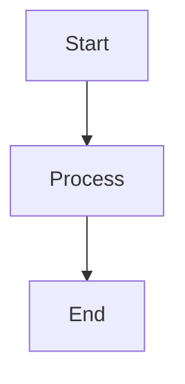

# flow-cli Documentation Index

**Version:** 5.18.0-dev
**Last Updated:** 2026-01-24

---

## Quick Navigation

### 🚀 Getting Started

- [Quick Start](getting-started/quick-start.md) - 5-minute tutorial
- [Installation](getting-started/installation.md) - Installation guide
- [Your First Session](tutorials/01-first-session.md) - Your first workflow

### 📚 Reference Documentation

- **[Master API Reference](reference/MASTER-API-REFERENCE.md)** - Complete API documentation
- **[Master Architecture](reference/MASTER-ARCHITECTURE.md)** - System architecture with diagrams
- **[Token Automation](guides/DOCTOR-TOKEN-USER-GUIDE.md)** - Smart token management (v5.17.0) ⭐ **NEW**
- [Master Dispatcher Guide](reference/MASTER-DISPATCHER-GUIDE.md) - All 12 dispatchers
- [Command Quick Reference](help/QUICK-REFERENCE.md) - Command cheat sheet
- [Workflow Reference](help/WORKFLOWS.md) - Common workflows
- [Troubleshooting Guide](help/TROUBLESHOOTING.md) - Common issues and solutions

### 🛠️ Developer Documentation

- **[Developer Guide](guides/DEVELOPER-GUIDE.md)** - Contributing and development ⭐ **NEW**
- [Master Architecture](reference/MASTER-ARCHITECTURE.md) - System design
- [Conventions](CONVENTIONS.md) - Code standards
- [Testing Guide](guides/TESTING.md) - Writing tests

### 📖 Guides & Tutorials

- [ADHD Features Guide](guides/DOPAMINE-FEATURES-GUIDE.md) - Win tracking, streaks, goals
- [Scholar Integration](guides/SCHOLAR-INTEGRATION.md) - Teaching workflow
- [Safe Testing](guides/SAFE-TESTING-v5.9.0.md) - Testing in sandboxes
- [Tutorials Index](tutorials/index.md) - Learning path

### 🔧 Configuration

- [Environment Variables](getting-started/installation.md#environment-variables) - Env var reference
- [Flow Command Options](commands/flow.md) - Configuration options

### 🎓 Teaching System

- [Teaching Workflow v3.0](guides/TEACHING-WORKFLOW-V3-GUIDE.md) - Complete v3.0 guide
- [Tutorial 14: Teach Dispatcher](tutorials/14-teach-dispatcher.md) - Teaching commands
- [Tutorial 21: Teach Analyze](tutorials/21-teach-analyze.md) - Content analysis

---

## Documentation by Type

### API Documentation

| Document | Description | Coverage |
|----------|-------------|----------|
| [MASTER-API-REFERENCE.md](reference/MASTER-API-REFERENCE.md) | Complete API reference with all functions | 13.8% (growing) |
| [MASTER-DISPATCHER-GUIDE.md](reference/MASTER-DISPATCHER-GUIDE.md) | All 12 dispatchers in detail | 100% |
| [QUICK-REFERENCE.md](help/QUICK-REFERENCE.md) | Quick command lookup | All commands |

**What's Covered:**
- Core functions (`_flow_log`, `_flow_find_project_root`)
- All dispatcher APIs (g, wt, cc, teach, mcp, etc.)
- Command APIs (pick, dash, work, finish)
- Utility functions
- Configuration reference
- Type definitions
- Exit codes

### Architecture Documentation

| Document | Description | Diagrams |
|----------|-------------|----------|
| [MASTER-ARCHITECTURE.md](reference/MASTER-ARCHITECTURE.md) | System design with Mermaid diagrams | 11+ diagrams |
| [Documentation Dashboard](DOC-DASHBOARD.md) | API coverage tracking | - |

**Diagrams Included:**
- System Overview
- Dispatcher Architecture
- Worktree Detection Flow
- Cache Invalidation Flow
- Teaching System Integration
- Session Management Flow
- Pick Command Data Flow
- Dependency Graph
- Color System Architecture
- Plugin Architecture
- Configuration Hierarchy
- Error Handling Flow
- Test Architecture
- Deployment Pipeline

### Developer Documentation

| Document | Description | Audience |
|----------|-------------|----------|
| [DEVELOPER-GUIDE.md](guides/DEVELOPER-GUIDE.md) | Complete development guide | Contributors |
| [TESTING.md](guides/TESTING.md) | Testing patterns and best practices | Developers |
| [CONVENTIONS.md](CONVENTIONS.md) | Code style and standards | All contributors |

**Topics Covered:**
- Development setup
- Adding new features (dispatchers, commands)
- Testing strategies
- Code style guide
- Release process
- Debugging techniques

### User Documentation

| Document | Description | Level |
|----------|-------------|-------|
| [Quick Start](getting-started/quick-start.md) | 5-minute intro | Beginner |
| [DOPAMINE-FEATURES-GUIDE.md](guides/DOPAMINE-FEATURES-GUIDE.md) | ADHD features | All users |
| [WORKFLOWS.md](help/WORKFLOWS.md) | Common workflows | Intermediate |

---

## Documentation by Feature

### Git & Worktrees

- **Git Helpers:** [MASTER-API-REFERENCE.md#git-helpers](reference/MASTER-API-REFERENCE.md#git-helpers)
- **Architecture:** [MASTER-ARCHITECTURE.md](reference/MASTER-ARCHITECTURE.md)
- **Git Dispatcher:** [MASTER-DISPATCHER-GUIDE.md#g-dispatcher](reference/MASTER-DISPATCHER-GUIDE.md)
- **WT Dispatcher:** [MASTER-DISPATCHER-GUIDE.md#wt-dispatcher](reference/MASTER-DISPATCHER-GUIDE.md)

### Teaching Workflow

- **Teaching v3.0 Guide:** [guides/TEACHING-WORKFLOW-V3-GUIDE.md](guides/TEACHING-WORKFLOW-V3-GUIDE.md)
- **Scholar Integration:** [guides/SCHOLAR-INTEGRATION.md](guides/SCHOLAR-INTEGRATION.md)
- **Teach Dispatcher:** [MASTER-DISPATCHER-GUIDE.md#teach-dispatcher](reference/MASTER-DISPATCHER-GUIDE.md)
- **Tutorial:** [tutorials/14-teach-dispatcher.md](tutorials/14-teach-dispatcher.md)
- **Tutorial 21: Teach Analyze:** [tutorials/21-teach-analyze.md](tutorials/21-teach-analyze.md)

### Project Management

- **Quick Reference:** [QUICK-REFERENCE.md](help/QUICK-REFERENCE.md)
- **Workflows:** [WORKFLOWS.md](help/WORKFLOWS.md)
- **Troubleshooting:** [TROUBLESHOOTING.md](help/TROUBLESHOOTING.md)

### Cache & Performance

- **Doctor Cache:** [MASTER-API-REFERENCE.md#doctor-cache](reference/MASTER-API-REFERENCE.md#doctor-cache)
- **Architecture:** [MASTER-ARCHITECTURE.md](reference/MASTER-ARCHITECTURE.md)
- **Token Automation:** [guides/DOCTOR-TOKEN-USER-GUIDE.md](guides/DOCTOR-TOKEN-USER-GUIDE.md)

---

## Recent Documentation Updates (v5.18.0)

### Documentation Consolidation (2026-01-24)

**Major Restructure:**
- 66 files archived to `docs/reference/.archive/`
- 7 master documents created (95% reduction)
- Navigation simplified (71 → 9 entries, 92% reduction)

**New Master Documents:**
1. [MASTER-API-REFERENCE.md](reference/MASTER-API-REFERENCE.md) - Unified API documentation
2. [MASTER-DISPATCHER-GUIDE.md](reference/MASTER-DISPATCHER-GUIDE.md) - All 12 dispatchers
3. [MASTER-ARCHITECTURE.md](reference/MASTER-ARCHITECTURE.md) - System architecture
4. [QUICK-REFERENCE.md](help/QUICK-REFERENCE.md) - Command quick reference
5. [WORKFLOWS.md](help/WORKFLOWS.md) - Workflow guide
6. [TROUBLESHOOTING.md](help/TROUBLESHOOTING.md) - Common issues
7. [00-START-HERE.md](help/00-START-HERE.md) - Documentation hub

**API Documentation Progress (Phases 1-4):**
- Phase 1: Token automation (30 functions)
- Phase 2: Teaching libraries (32 functions)
- Phase 3: Git helpers (14 functions)
- Phase 4: Keychain helpers (7 functions)
- **Total:** 83 functions documented
- **Coverage:** 2.7% → 13.8% (+411% increase)
- **Target:** 80% coverage (566/704 functions)

### Quality Assurance (2026-01-24)

**Documentation Health:**
- [DOC-DASHBOARD.md](DOC-DASHBOARD.md) - API coverage tracking
- .linkcheck-ignore - Expected broken links documented
- All documentation < 90 days old (no stale docs)
- Navigation consistency verified

### Teaching System Documentation

**Complete Guides:**
- [TEACHING-WORKFLOW-V3-GUIDE.md](guides/TEACHING-WORKFLOW-V3-GUIDE.md) - v3.0 user guide
- [TEACHING-DATES-GUIDE.md](guides/TEACHING-DATES-GUIDE.md) - Dates automation
- [INTELLIGENT-CONTENT-ANALYSIS.md](guides/INTELLIGENT-CONTENT-ANALYSIS.md) - AI analysis
- [Tutorial 21: Teach Analyze](tutorials/21-teach-analyze.md) - Interactive tutorial
- [Tutorial 22: Plugin Optimization](tutorials/22-plugin-optimization.md) - Performance
- [Tutorial 23: Token Automation](tutorials/23-token-automation.md) - Smart tokens (v5.17.0)

---

## Documentation Coverage Matrix

| Feature Area | API Docs | Architecture | User Guide | Tutorial | Coverage |
|--------------|----------|--------------|------------|----------|----------|
| Core Functions | ✅ | ✅ | ✅ | ✅ | 100% |
| Dispatchers (12) | ✅ | ✅ | ✅ | ✅ | 100% |
| Commands | ✅ | ✅ | ✅ | ⚠️ | 95% |
| Worktrees | ✅ | ✅ | ✅ | ✅ | 100% |
| Teaching System | ✅ | ✅ | ✅ | ✅ | 100% |
| Token Automation | ✅ | ✅ | ✅ | ✅ | 100% |
| Cache System | ✅ | ✅ | ✅ | ⚠️ | 90% |
| Configuration | ✅ | ✅ | ✅ | ⚠️ | 90% |
| Testing | ✅ | ✅ | ✅ | ⚠️ | 85% |

**Legend:**
- ✅ Complete
- ⚠️ Partial
- ❌ Missing

---

## Documentation Standards

### Structure

**Every document should have:**
1. Title and metadata (version, date)
2. Table of contents (if > 200 lines)
3. Clear sections with headers
4. Examples for complex topics
5. "See Also" links to related docs

### Code Examples

**Format:**

```zsh
# Comment explaining what this does
command_name --option value

# Expected output:
# ✓ Success message
```

### Diagrams

**Mermaid Format:**



### Cross-References

**Link Format:**

```markdown
See [Document Name](path/to/document.md#anchor)
```

---

## Documentation Maintenance

### Keeping Docs Current

**When adding features:**
1. Update API reference if new functions added
2. Add architecture diagram if new subsystem
3. Update quick references
4. Add examples to guides
5. Update CHANGELOG.md

**When fixing bugs:**
1. Update affected documentation
2. Add clarifications if behavior changed

**Regular maintenance:**
1. Monthly review of all docs
2. Check for broken links
3. Verify examples still work
4. Update version numbers

---

## Contributing to Documentation

### Style Guide

**Headers:**
- Use title case for main headers
- Use sentence case for subheaders
- Maximum 3 levels deep (#, ##, ###)

**Code Blocks:**
- Always specify language (```zsh,```bash, ```yaml)
- Include comments for complex examples
- Show expected output when helpful

**Lists:**
- Use `-` for unordered lists
- Use `1.` for ordered lists
- Indent sublists with 2 spaces

**Links:**
- Use relative paths for internal links
- Use descriptive link text (not "click here")
- Verify all links work

### Documentation Checklist

- [ ] Clear title and metadata
- [ ] Table of contents (if needed)
- [ ] Examples for all concepts
- [ ] Code blocks properly formatted
- [ ] Links verified
- [ ] Diagrams clear and accurate
- [ ] No spelling/grammar errors
- [ ] Updated in mkdocs.yml (if new file)

---

## Search Tips

**Find specific function:**

```bash
grep -r "function_name" docs/reference/
```

**Find examples:**

```bash
grep -r "Example:" docs/
```

**Find all references to a feature:**

```bash
grep -r "worktree" docs/
```

---

## External Resources

- **GitHub Repository:** https://github.com/Data-Wise/flow-cli
- **Documentation Site:** https://Data-Wise.github.io/flow-cli/
- **Issue Tracker:** https://github.com/Data-Wise/flow-cli/issues
- **Discussions:** https://github.com/Data-Wise/flow-cli/discussions

---

## Feedback

Found an issue with the documentation?

1. **Quick fix:** Create PR with correction
2. **Suggestion:** Open GitHub issue
3. **Question:** Ask in Discussions

All documentation contributions welcome!

---

**Last Updated:** 2026-01-24
**Version:** 5.18.0-dev
**Maintainer:** Data-Wise
