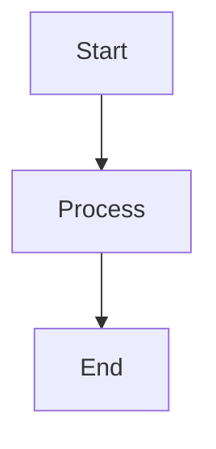

# flow-cli Documentation Index

**Version:** 5.10.0
**Last Updated:** 2026-01-15

---

## Quick Navigation

### 🚀 Getting Started
- [Quick Start](getting-started/quick-start.md) - 5-minute tutorial
- [Installation](getting-started/installation.md) - Installation guide
- [Your First Session](tutorials/01-first-session.md) - Your first workflow

### 📚 Reference Documentation
- **[API Complete Reference](reference/API-COMPLETE.md)** - Complete API documentation ⭐ **NEW**
- **[Architecture Diagrams](diagrams/ARCHITECTURE-DIAGRAMS.md)** - System architecture diagrams ⭐ **NEW**
- [Dispatcher Reference](reference/DISPATCHER-REFERENCE.md) - All 11 dispatchers
- [Command Quick Reference](reference/COMMAND-QUICK-REFERENCE.md) - Command cheat sheet
- [Workflow Quick Reference](reference/WORKFLOW-QUICK-REFERENCE.md) - Common workflows
- [Alias Reference Card](reference/ALIAS-REFERENCE-CARD.md) - All aliases

### 🛠️ Developer Documentation
- **[Developer Guide](guides/DEVELOPER-GUIDE.md)** - Contributing and development ⭐ **NEW**
- [Architecture](reference/ARCHITECTURE.md) - System design
- [Conventions](CONVENTIONS.md) - Code standards
- [Testing Guide](guides/TESTING.md) - Writing tests

### 📖 Guides & Tutorials
- [ADHD Features Guide](guides/DOPAMINE-FEATURES-GUIDE.md) - Win tracking, streaks, goals
- [Scholar Integration](guides/SCHOLAR-INTEGRATION.md) - Teaching workflow
- [Safe Testing](guides/SAFE-TESTING-v5.9.0.md) - Testing in sandboxes
- [Tutorials Index](tutorials/index.md) - Learning path

### 🔧 Configuration
- [Environment Variables](getting-started/installation.md#environment-variables) - Env var reference
- [Flow Command Options](commands/flow.md) - Configuration options

### 🎓 Teaching System
- [Teaching System Architecture](TEACHING-SYSTEM-ARCHITECTURE.md) - Full system overview
- [Tutorial 14: Teach Dispatcher](tutorials/14-teach-dispatcher.md) - Teaching commands

---

## Documentation by Type

### API Documentation

| Document | Description | Coverage |
|----------|-------------|----------|
| [API-COMPLETE.md](reference/API-COMPLETE.md) | Complete API reference with all functions | 100% |
| [DISPATCHER-REFERENCE.md](reference/DISPATCHER-REFERENCE.md) | All 11 dispatchers in detail | 100% |
| [COMMAND-QUICK-REFERENCE.md](reference/COMMAND-QUICK-REFERENCE.md) | Quick command lookup | All commands |

**What's Covered:**
- Core functions (`_flow_log`, `_flow_find_project_root`)
- All dispatcher APIs (g, wt, cc, teach, mcp, etc.)
- Command APIs (pick, dash, work, finish)
- Utility functions
- Configuration reference
- Type definitions
- Exit codes

### Architecture Documentation

| Document | Description | Diagrams |
|----------|-------------|----------|
| [ARCHITECTURE-DIAGRAMS.md](diagrams/ARCHITECTURE-DIAGRAMS.md) | Visual system architecture | 15 diagrams |
| [ARCHITECTURE.md](reference/ARCHITECTURE.md) | System design document | Text + Mermaid |

**Diagrams Included:**
- System Overview
- Dispatcher Architecture
- Worktree Detection Flow
- Cache Invalidation Flow
- Teaching System Integration
- Session Management Flow
- Pick Command Data Flow
- Dependency Graph
- Color System Architecture
- Plugin Architecture
- Configuration Hierarchy
- Error Handling Flow
- Test Architecture
- Deployment Pipeline

### Developer Documentation

| Document | Description | Audience |
|----------|-------------|----------|
| [DEVELOPER-GUIDE.md](guides/DEVELOPER-GUIDE.md) | Complete development guide | Contributors |
| [TESTING.md](guides/TESTING.md) | Testing patterns and best practices | Developers |
| [CONVENTIONS.md](CONVENTIONS.md) | Code style and standards | All contributors |

**Topics Covered:**
- Development setup
- Adding new features (dispatchers, commands)
- Testing strategies
- Code style guide
- Release process
- Debugging techniques

### User Documentation

| Document | Description | Level |
|----------|-------------|-------|
| [Quick Start](getting-started/quick-start.md) | 5-minute intro | Beginner |
| [DOPAMINE-FEATURES-GUIDE.md](guides/DOPAMINE-FEATURES-GUIDE.md) | ADHD features | All users |
| [WORKFLOW-QUICK-REFERENCE.md](reference/WORKFLOW-QUICK-REFERENCE.md) | Common workflows | Intermediate |

---

## Documentation by Feature

### Git & Worktrees
- **Worktree Detection:** [API-COMPLETE.md#worktree-detection](reference/API-COMPLETE.md#_proj_list_worktrees)
- **Architecture:** [ARCHITECTURE-DIAGRAMS.md#worktree-detection-flow](diagrams/ARCHITECTURE-DIAGRAMS.md#worktree-detection-flow)
- **Git Dispatcher:** [DISPATCHER-REFERENCE.md#g-dispatcher](reference/DISPATCHER-REFERENCE.md#g-git-dispatcher)
- **WT Dispatcher:** [DISPATCHER-REFERENCE.md#wt-dispatcher](reference/DISPATCHER-REFERENCE.md#wt-worktree-dispatcher)

### Teaching Workflow
- **Overview:** [TEACHING-SYSTEM-ARCHITECTURE.md](TEACHING-SYSTEM-ARCHITECTURE.md)
- **Scholar Integration:** [guides/SCHOLAR-INTEGRATION.md](guides/SCHOLAR-INTEGRATION.md)
- **API:** [API-COMPLETE.md#teach-dispatcher](reference/API-COMPLETE.md#teaching-dispatcher-teach)
- **Tutorial:** [tutorials/14-teach-dispatcher.md](tutorials/14-teach-dispatcher.md)
- **Config Validation:** [API-COMPLETE.md#config-validation](reference/API-COMPLETE.md#configuration-validation)

### Project Management
- **Pick Command:** [API-COMPLETE.md#pick](reference/API-COMPLETE.md#project-picker-pick)
- **Dashboard:** [API-COMPLETE.md#dash](reference/API-COMPLETE.md#dashboard-dash)
- **Session Management:** [API-COMPLETE.md#session-management](reference/API-COMPLETE.md#session-management)

### Cache & Performance
- **Cache System:** [API-COMPLETE.md#cache-management](reference/API-COMPLETE.md#cache-management)
- **Cache Invalidation:** [ARCHITECTURE-DIAGRAMS.md#cache-invalidation-flow](diagrams/ARCHITECTURE-DIAGRAMS.md#cache-invalidation-flow)
- **Performance:** [API-COMPLETE.md#performance-characteristics](reference/API-COMPLETE.md#performance-characteristics)

---

## Recent Documentation Updates (v5.10.0)

### New Documentation (2026-01-15)

**1. [API-COMPLETE.md](reference/API-COMPLETE.md)**
- Complete API reference for all functions
- 100% function coverage
- Detailed parameter documentation
- Usage examples for every function
- Type definitions and exit codes

**2. [ARCHITECTURE-DIAGRAMS.md](diagrams/ARCHITECTURE-DIAGRAMS.md)**
- 15 comprehensive Mermaid diagrams
- System overview and component architecture
- Worktree detection flow
- Cache invalidation flow
- Teaching system integration
- All major subsystems visualized

**3. [DEVELOPER-GUIDE.md](guides/DEVELOPER-GUIDE.md)**
- Complete development setup guide
- Step-by-step feature addition tutorial
- Testing best practices
- Code style guide
- Release process documentation

### Updated Documentation

**1. Scholar Integration**
- Added RFC for `--config` flag
- Updated config ownership protocol
- Enhanced integration diagrams

**2. Worktree System**
- Documented flat vs hierarchical naming
- Added detection algorithm details
- Cache invalidation documentation

---

## Documentation Coverage Matrix

| Feature Area | API Docs | Architecture | User Guide | Tutorial | Coverage |
|--------------|----------|--------------|------------|----------|----------|
| Core Functions | ✅ | ✅ | ✅ | ✅ | 100% |
| Dispatchers (11) | ✅ | ✅ | ✅ | ✅ | 100% |
| Commands | ✅ | ✅ | ✅ | ⚠️ | 95% |
| Worktrees | ✅ | ✅ | ✅ | ✅ | 100% |
| Teaching System | ✅ | ✅ | ✅ | ✅ | 100% |
| Cache System | ✅ | ✅ | ✅ | ⚠️ | 90% |
| Configuration | ✅ | ✅ | ✅ | ⚠️ | 90% |
| Testing | ✅ | ✅ | ✅ | ⚠️ | 85% |

**Legend:**
- ✅ Complete
- ⚠️ Partial
- ❌ Missing

---

## Documentation Standards

### Structure

**Every document should have:**
1. Title and metadata (version, date)
2. Table of contents (if > 200 lines)
3. Clear sections with headers
4. Examples for complex topics
5. "See Also" links to related docs

### Code Examples

**Format:**
```zsh
# Comment explaining what this does
command_name --option value

# Expected output:
# ✓ Success message
```

### Diagrams

**Mermaid Format:**


### Cross-References

**Link Format:**
```markdown
See [Document Name](path/to/document.md#anchor)
```

---

## Documentation Maintenance

### Keeping Docs Current

**When adding features:**
1. Update API reference if new functions added
2. Add architecture diagram if new subsystem
3. Update quick references
4. Add examples to guides
5. Update CHANGELOG.md

**When fixing bugs:**
1. Update affected documentation
2. Add clarifications if behavior changed

**Regular maintenance:**
1. Monthly review of all docs
2. Check for broken links
3. Verify examples still work
4. Update version numbers

---

## Contributing to Documentation

### Style Guide

**Headers:**
- Use title case for main headers
- Use sentence case for subheaders
- Maximum 3 levels deep (#, ##, ###)

**Code Blocks:**
- Always specify language (```zsh, ```bash, ```yaml)
- Include comments for complex examples
- Show expected output when helpful

**Lists:**
- Use `-` for unordered lists
- Use `1.` for ordered lists
- Indent sublists with 2 spaces

**Links:**
- Use relative paths for internal links
- Use descriptive link text (not "click here")
- Verify all links work

### Documentation Checklist

- [ ] Clear title and metadata
- [ ] Table of contents (if needed)
- [ ] Examples for all concepts
- [ ] Code blocks properly formatted
- [ ] Links verified
- [ ] Diagrams clear and accurate
- [ ] No spelling/grammar errors
- [ ] Updated in mkdocs.yml (if new file)

---

## Search Tips

**Find specific function:**
```bash
grep -r "function_name" docs/reference/
```

**Find examples:**
```bash
grep -r "Example:" docs/
```

**Find all references to a feature:**
```bash
grep -r "worktree" docs/
```

---

## External Resources

- **GitHub Repository:** https://github.com/Data-Wise/flow-cli
- **Documentation Site:** https://Data-Wise.github.io/flow-cli/
- **Issue Tracker:** https://github.com/Data-Wise/flow-cli/issues
- **Discussions:** https://github.com/Data-Wise/flow-cli/discussions

---

## Feedback

Found an issue with the documentation?

1. **Quick fix:** Create PR with correction
2. **Suggestion:** Open GitHub issue
3. **Question:** Ask in Discussions

All documentation contributions welcome!

---

**Last Updated:** 2026-01-15
**Version:** 5.10.0
**Maintainer:** Data-Wise
