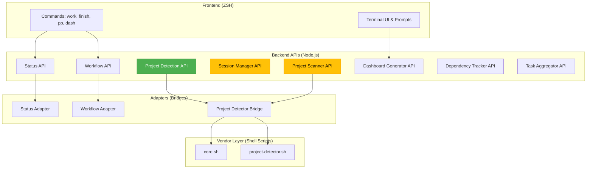

# API Overview - ZSH Configuration System

**Project:** flow-cli
**Version:** 0.1.0
**Type:** Personal Productivity & Project Management System

---

## Table of Contents

1. [Project Detection API](#1-project-detection-api) ✅ **Complete**
2. [Status API](#2-status-api) ⚠️ **Partial**
3. [Workflow API](#3-workflow-api) ⚠️ **Partial**
4. [Session Manager](#4-session-manager) 📋 **Planned**
5. [Project Scanner](#5-project-scanner) 📋 **Planned**
6. [Dashboard Generator](#6-dashboard-generator) 📋 **Planned**
7. [Dependency Tracker](#7-dependency-tracker) 📋 **Planned**
8. [Task Aggregator](#8-task-aggregator) 📋 **Planned**

---

## System Architecture



---

## 1. Project Detection API

**Status:** ✅ **Complete** (Week 1)
**Module:** `cli/lib/project-detector-bridge.js`
**Purpose:** Detect project types from filesystem paths

### Functions

#### detectProjectType(projectPath)

Detect the type of a single project.

```javascript
import { detectProjectType } from 'flow-cli/cli/lib/project-detector-bridge.js'

const type = await detectProjectType('/Users/dt/projects/r-packages/stable/rmediation')
// Returns: 'r-package'
```

**Parameters:**

- `projectPath` (string) - Absolute path to project

**Returns:** `Promise<string>`

- Project type: `'r-package'`, `'quarto'`, `'quarto-extension'`, `'research'`, `'generic'`, `'unknown'`

---

#### detectMultipleProjects(projectPaths)

Detect types for multiple projects in parallel.

```javascript
const results = await detectMultipleProjects([
  '/Users/dt/projects/r-packages/stable/rmediation',
  '/Users/dt/projects/teaching/stat-440'
])
// Returns: { '/Users/.../rmediation': 'r-package', '/Users/.../stat-440': 'quarto' }
```

**Parameters:**

- `projectPaths` (string[]) - Array of absolute paths

**Returns:** `Promise<Object>` - Map of path → type

---

#### getSupportedTypes()

Get list of all supported project types.

```javascript
const types = getSupportedTypes()
// Returns: ['r-package', 'quarto', 'quarto-extension', 'research', 'generic', 'unknown']
```

**Returns:** `string[]`

---

#### isTypeSupported(type)

Check if a project type is supported.

```javascript
isTypeSupported('r-package') // true
isTypeSupported('invalid') // false
```

**Parameters:**

- `type` (string) - Project type to check

**Returns:** `boolean`

---

**Documentation:** [PROJECT-DETECTOR-API.md](PROJECT-DETECTOR-API.md)

---

## 2. Status API

**Status:** ⚠️ **Partial** (Existing code, needs modernization)
**Module:** `cli/api/status-api.js`
**Purpose:** Query workflow and project status

### Functions

#### getDashboardData(projectPath?)

Get complete dashboard data for UI display.

```javascript
import { getDashboardData } from 'flow-cli/cli/api/status-api.js'

const data = await getDashboardData('/Users/dt/projects/teaching/stat-440')
// Returns: { session: {...}, project: {...}, timestamp: '...' }
```

**Parameters:**

- `projectPath` (string, optional) - Project to query (default: cwd)

**Returns:** `Promise<Object>`

```javascript
{
  session: {
    active: boolean,
    project: string,
    startTime: string,
    duration: string,
    durationMinutes: number,
    context: string,
    editor: string
  },
  project: {
    hasStatus: boolean,
    location: string,
    lastUpdated: string,
    currentStatus: string,
    progress: Array<Object>,
    nextActions: Array<Object>,
    recentWins: Array<string>
  },
  timestamp: string
}
```

---

#### getSessionStatus()

Quick check of current session status.

```javascript
const session = await getSessionStatus()
// Returns: { active: true, project: 'rmediation', duration: '2h 15min', ... }
```

**Returns:** `Promise<Object>` - Formatted session data

---

#### getProgressSummary(projectPath?)

Get project progress summary with completion percentages.

```javascript
const progress = await getProgressSummary('/path/to/project')
// Returns: { hasProgress: true, phases: [...], summary: {...} }
```

**Returns:** `Promise<Object>`

```javascript
{
  hasProgress: boolean,
  phases: Array<Object>,
  summary: {
    total: number,
    completed: number,
    inProgress: number,
    pending: number,
    percentComplete: number
  }
}
```

---

#### getTaskRecommendations(projectPath?)

Get recommended tasks based on project status.

```javascript
const tasks = await getTaskRecommendations()
// Returns: { recommendations: [...], suggested: {...}, quickWins: [...] }
```

**Returns:** `Promise<Object>`

```javascript
{
  recommendations: Array<{option, task, status, estimate}>,
  suggested: Object,       // Top recommended task
  quickWins: Array<Object>, // Tasks with ⚡ status
  ready: Array<Object>      // Tasks with 🟢 status
}
```

---

#### checkFlowState()

Determine if user is currently in flow state.

```javascript
const flow = await checkFlowState()
// Returns: { inFlow: true, duration: '45min', reason: 'Active session running' }
```

**Returns:** `Promise<Object>`

```javascript
{
  inFlow: boolean,
  duration: string,
  durationMinutes: number,
  reason: string
}
```

---

**Adapter:** Uses `cli/adapters/status.js` which reads:

- `~/.config/zsh/.worklog` - Session data
- `.STATUS` files - Project status

**Needs:**

- Migration to ES modules
- Integration with new Session Manager
- Enhanced .STATUS parsing

---

## 3. Workflow API

**Status:** ⚠️ **Partial** (Existing code, needs modernization)
**Module:** `cli/api/workflow-api.js`
**Purpose:** Control workflow commands (start/end sessions, build, test, preview)

### Functions

#### startSession(project, options?)

Start a new work session with validation.

```javascript
import { startSession } from 'flow-cli/cli/api/workflow-api.js'

const result = await startSession('rmediation', {
  context: 'Fix failing test',
  editor: 'vscode'
})
// Returns: { success: true, session: {...}, output: '...', timestamp: '...' }
```

**Parameters:**

- `project` (string) - Project name
- `options` (Object, optional)
  - `context` (string) - What you're working on
  - `editor` (string) - Editor to use

**Returns:** `Promise<Object>`

```javascript
{
  success: boolean,
  session?: Object,      // If successful
  error?: string,        // If failed
  currentSession?: Object, // If already in session
  output: string,
  timestamp: string
}
```

---

#### endSession(options?)

End the current work session.

```javascript
const result = await endSession({
  message: 'Fixed failing test in test_mediation.R'
})
// Returns: { success: true, session: {...}, output: '...', timestamp: '...' }
```

**Parameters:**

- `options` (Object, optional)
  - `message` (string) - Commit message
  - `force` (boolean) - Force end even with uncommitted changes

**Returns:** `Promise<Object>`

---

#### build()

Execute context-aware build command.

```javascript
const result = await build()
// Runs: R CMD build (for R package), quarto render (for Quarto), etc.
```

**Returns:** `Promise<Object>` - Build result with stdout/stderr

---

#### preview()

Execute context-aware preview/view command.

```javascript
const result = await preview()
// Runs: quarto preview (Quarto), open HTML (R), etc.
```

**Returns:** `Promise<Object>` - Preview result

---

#### test()

Execute context-aware tests.

```javascript
const result = await test()
// Runs: R CMD check (R package), pytest (Python), npm test (Node), etc.
```

**Returns:** `Promise<Object>` - Test result

---

#### getAvailableCommands(directory?)

Get commands available for current project type.

```javascript
const commands = await getAvailableCommands('/path/to/r-package')
// Returns: { projectType: 'r', commands: ['build', 'test', 'view', ...], context: {...} }
```

**Returns:** `Promise<Object>`

---

#### getSuggestions()

Get workflow suggestions based on current state.

```javascript
const suggestions = await getSuggestions()
// Returns: { suggestions: [...], session: {...}, context: {...} }
```

**Returns:** `Promise<Object>`

```javascript
{
  suggestions: Array<{action, command, reason, priority}>,
  session: { active: boolean, project?: string, duration?: number },
  context: { projectType: string, directory: string }
}
```

---

**Adapter:** Uses `cli/adapters/workflow.js` which executes ZSH commands

**Needs:**

- Migration to ES modules
- Integration with new Session Manager
- Better error handling

---

## 4. Session Manager

**Status:** 📋 **Planned** (Week 2)
**Module:** `cli/core/session-manager.js` (to be created)
**Purpose:** Persistent session state tracking and restoration

### Planned Functions

#### createSession(project, options)

Create a new work session.

```javascript
const session = await createSession('rmediation', {
  task: 'Fix failing test',
  branch: 'fix-test-failure',
  context: {
    files: ['R/mediation.R', 'tests/test_mediation.R'],
    notes: 'Need to check coefficient calculation'
  }
})
```

**Returns:**

```javascript
{
  id: 'session-uuid',
  project: 'rmediation',
  startTime: '2025-12-20T10:30:00Z',
  task: 'Fix failing test',
  branch: 'fix-test-failure',
  context: Object,
  state: 'active'
}
```

---

#### getActiveSession()

Get currently active session.

```javascript
const session = await getActiveSession()
// Returns: session object or null
```

---

#### updateSession(sessionId, updates)

Update session metadata.

```javascript
await updateSession('session-uuid', {
  progress: 50,
  notes: 'Found the issue - coefficient sign error'
})
```

---

#### endSession(sessionId, result)

End a session and save final state.

```javascript
await endSession('session-uuid', {
  outcome: 'completed',
  summary: 'Fixed coefficient calculation in mediation function',
  commits: ['abc123f'],
  duration: 125 // minutes
})
```

---

#### listSessions(filters?)

List all sessions with optional filters.

```javascript
const sessions = await listSessions({
  project: 'rmediation',
  state: 'completed',
  since: '2025-12-01'
})
```

---

#### restoreSession(sessionId)

Restore a previous session's context.

```javascript
await restoreSession('session-uuid')
// - cd to project directory
// - checkout git branch
// - restore editor state
// - show context notes
```

---

**Storage:** `~/.local/share/flow-cli/sessions/`
**Format:** JSON files with session metadata

---

## 5. Project Scanner

**Status:** 📋 **Planned** (Week 1 remaining task)
**Module:** `cli/core/project-scanner.js` (to be created)
**Purpose:** Recursive project discovery and metadata extraction

### Planned Functions

#### scanDirectory(basePath, options?)

Recursively scan directory for projects.

```javascript
import { scanDirectory } from 'flow-cli/cli/core/project-scanner.js'

const projects = await scanDirectory('/Users/dt/projects', {
  maxDepth: 3,
  includeHidden: false,
  types: ['r-package', 'quarto', 'research']
})
```

**Returns:**

```javascript
[
  {
    path: '/Users/dt/projects/r-packages/stable/rmediation',
    name: 'rmediation',
    type: 'r-package',
    metadata: {
      description: 'Parametric and Nonparametric Mediation Analysis',
      version: '1.0.0',
      lastModified: '2025-12-20T10:00:00Z'
    },
    status: { ... }  // .STATUS file content if exists
  },
  // ... more projects
]
```

---

#### scanAllProjects()

Scan all known project locations.

```javascript
const all = await scanAllProjects()
// Scans: ~/projects/r-packages, ~/projects/teaching, ~/projects/research, etc.
```

---

#### findProject(name)

Find a project by name.

```javascript
const project = await findProject('rmediation')
// Returns: project object or null
```

---

#### getProjectsByType(type)

Get all projects of a specific type.

```javascript
const rPackages = await getProjectsByType('r-package')
const quartoProjects = await getProjectsByType('quarto')
```

---

#### updateProjectCache()

Refresh cached project list.

```javascript
await updateProjectCache()
// Rescans all projects and updates cache
```

---

**Uses:** Project Detection API (`detectMultipleProjects`)
**Cache:** `~/.cache/flow-cli/projects.json`

---

## 6. Dashboard Generator

**Status:** 📋 **Planned** (Week 2-3)
**Module:** `cli/core/dashboard-generator.js` (to be created)
**Purpose:** Generate comprehensive project overview dashboards

### Planned Functions

#### generateDashboard(options?)

Generate main dashboard.

```javascript
const dashboard = await generateDashboard({
  format: 'terminal', // or 'markdown', 'html', 'json'
  sections: ['active', 'recent', 'quick-wins'],
  groupBy: 'category' // or 'priority', 'type'
})
```

**Returns:**

```javascript
{
  summary: {
    totalProjects: 32,
    activeProjects: 12,
    quickWins: 7
  },
  sections: {
    rPackages: [
      { name: 'rmediation', status: 'active', lastUpdated: '3 hours ago', nextAction: '...' },
      // ...
    ],
    teaching: [...],
    research: [...],
    devTools: [...]
  },
  formatted: '...'  // Formatted output based on format option
}
```

---

#### generateProjectSummary(projectPath)

Generate summary for single project.

```javascript
const summary = await generateProjectSummary('/path/to/rmediation')
```

---

#### generateWeeklySummary()

Generate weekly activity summary.

```javascript
const weekly = await generateWeeklySummary()
// Shows: sessions this week, completed tasks, progress updates
```

---

#### exportDashboard(format, destination)

Export dashboard to file.

```javascript
await exportDashboard('markdown', '/path/to/dashboard.md')
await exportDashboard('html', '/path/to/dashboard.html')
```

---

**Adapts:** apple-notes-sync dashboard logic
**Uses:** Status API, Project Scanner

---

## 7. Dependency Tracker

**Status:** 📋 **Planned** (Week 3-4)
**Module:** `cli/core/dependency-tracker.js` (to be created)
**Purpose:** Track relationships between projects

### Planned Functions

#### addDependency(project, dependsOn, type)

Define dependency relationship.

```javascript
await addDependency('rmediation', 'medfit', 'requires')
await addDependency('probmed', 'sensitivity', 'blocked-by')
```

**Relationship Types:**

- `requires` - Project requires another
- `used-by` - Project is used by another
- `related-to` - Projects in same ecosystem
- `blocked-by` - Project blocked by another

---

#### getDependencies(project)

Get all dependencies for a project.

```javascript
const deps = await getDependencies('rmediation')
// Returns: { requires: ['medfit'], usedBy: ['mediationverse'], relatedTo: ['probmed'] }
```

---

#### getImpactAnalysis(project)

Analyze impact of changes to a project.

```javascript
const impact = await getImpactAnalysis('medfit')
// Returns: { affectedProjects: ['rmediation', 'probmed'], riskLevel: 'high' }
```

---

#### getDependencyGraph()

Get complete dependency graph.

```javascript
const graph = await getDependencyGraph()
// Returns: graph structure suitable for visualization
```

---

**Storage:** `~/.local/share/flow-cli/dependencies.json`

---

## 8. Task Aggregator

**Status:** 📋 **Planned** (Week 3-4)
**Module:** `cli/core/task-aggregator.js` (to be created)
**Purpose:** Aggregate tasks across all projects

### Planned Functions

#### aggregateTasks(filters?)

Collect tasks from all projects.

```javascript
const tasks = await aggregateTasks({
  priority: ['P0', 'P1'],
  effort: 'quick-win',
  category: 'r-packages'
})
```

**Returns:**

```javascript
;[
  {
    project: 'rmediation',
    task: 'Fix typo in README',
    priority: 'P2',
    effort: 'quick-win',
    estimate: '10 minutes',
    status: '⚡'
  }
  // ... more tasks
]
```

---

#### getQuickWins()

Get all quick-win tasks (< 30 min).

```javascript
const quickWins = await getQuickWins()
// Returns: array of quick-win tasks
```

---

#### getTasksByPriority()

Group tasks by priority level.

```javascript
const grouped = await getTasksByPriority()
// Returns: { P0: [...], P1: [...], P2: [...], P3: [...] }
```

---

#### getTasksByCategory()

Group tasks by project category.

```javascript
const grouped = await getTasksByCategory()
// Returns: { rPackages: [...], teaching: [...], research: [...] }
```

---

**Uses:** Status API, Project Scanner

---

## API Usage Patterns

### Pattern 1: Complete Project Info

```javascript
import { detectProjectType } from 'flow-cli/cli/lib/project-detector-bridge.js'
import { getDashboardData } from 'flow-cli/cli/api/status-api.js'

// Get complete project information
const projectPath = '/Users/dt/projects/r-packages/stable/rmediation'

const [type, status] = await Promise.all([
  detectProjectType(projectPath),
  getDashboardData(projectPath)
])

console.log(`Project: ${status.project.location}`)
console.log(`Type: ${type}`)
console.log(`Status: ${status.project.currentStatus}`)
console.log(`Active Session: ${status.session.active ? 'Yes' : 'No'}`)
```

---

### Pattern 2: Work Session Workflow

```javascript
import { startSession, endSession } from 'flow-cli/cli/api/workflow-api.js'
import { getSessionStatus } from 'flow-cli/cli/api/status-api.js'

// Start session
await startSession('rmediation', {
  context: 'Fix failing test'
})

// Check status during work
const status = await getSessionStatus()
console.log(`Working for: ${status.duration}`)

// End session
await endSession({
  message: 'Fixed coefficient calculation bug'
})
```

---

### Pattern 3: Project Discovery

```javascript
import { scanAllProjects } from 'flow-cli/cli/core/project-scanner.js'
import { getTaskRecommendations } from 'flow-cli/cli/api/status-api.js'

// Find all projects
const projects = await scanAllProjects()

// Get tasks from active R packages
const rPackages = projects.filter(p => p.type === 'r-package' && p.status?.active)

for (const pkg of rPackages) {
  const tasks = await getTaskRecommendations(pkg.path)
  if (tasks.quickWins.length > 0) {
    console.log(`${pkg.name}: ${tasks.quickWins.length} quick wins available`)
  }
}
```

---

## Module Dependencies

```
project-detector-bridge.js (✅ Complete)
    └─ No dependencies (vendored shell scripts)

status-api.js (⚠️ Partial)
    └─ status.js adapter
        └─ Reads: .worklog, .STATUS files

workflow-api.js (⚠️ Partial)
    └─ workflow.js adapter
    └─ status.js adapter
        └─ Executes ZSH commands

session-manager.js (📋 Planned)
    └─ project-detector-bridge.js
    └─ status-api.js

project-scanner.js (📋 Planned)
    └─ project-detector-bridge.js (for type detection)

dashboard-generator.js (📋 Planned)
    └─ project-scanner.js
    └─ status-api.js

dependency-tracker.js (📋 Planned)
    └─ project-scanner.js

task-aggregator.js (📋 Planned)
    └─ project-scanner.js
    └─ status-api.js
```

---

## Implementation Timeline

### Week 1 (Complete ✅)

- ✅ Project Detection API (4 functions, 100% tested)
- ✅ Documentation suite

### Week 1 Remaining

- 📋 Project Scanner (basic implementation)

### Week 2

- 📋 Session Manager (create, get, update, end, list, restore)
- 📋 Dashboard Generator (terminal format)
- ⚠️ Modernize Status API (ES modules, enhanced parsing)

### Week 3-4

- 📋 Dependency Tracker
- 📋 Task Aggregator
- ⚠️ Modernize Workflow API

### Future

- Multiple dashboard formats (Markdown, HTML, JSON)
- Advanced dependency graphs
- AI-powered task recommendations
- Integration with external tools (JIRA, Notion)

---

## Testing Status

| Module                     | Unit Tests | Integration Tests | Coverage |
| -------------------------- | ---------- | ----------------- | -------- |
| project-detector-bridge.js | ✅ 7 tests | ✅ Real projects  | 100%     |
| status-api.js              | ❌ None    | ❌ None           | 0%       |
| workflow-api.js            | ❌ None    | ❌ None           | 0%       |
| session-manager.js         | 📋 Planned | 📋 Planned        | -        |
| project-scanner.js         | 📋 Planned | 📋 Planned        | -        |

**Priority:** Add tests for status-api.js and workflow-api.js before building new modules

---

## Documentation Status

| Module                     | API Docs     | Architecture | User Guide  |
| -------------------------- | ------------ | ------------ | ----------- |
| project-detector-bridge.js | ✅ Complete  | ✅ Complete  | ✅ Complete |
| status-api.js              | ✅ This file | ❌ None      | ❌ None     |
| workflow-api.js            | ✅ This file | ❌ None      | ❌ None     |
| session-manager.js         | ✅ This file | 📋 Planned   | 📋 Planned  |
| project-scanner.js         | ✅ This file | 📋 Planned   | 📋 Planned  |

---

## Related Documentation

- [Project Detector API](PROJECT-DETECTOR-API.md) - Detailed API reference
- [Vendor Integration Architecture](../architecture/VENDOR-INTEGRATION-ARCHITECTURE.md) - System design
- [Project Detection Guide](../reference/PROJECT-DETECTION-GUIDE.md) - User tutorial
- [Week 1 Progress](../../WEEK-1-PROGRESS-2025-12-20.md) - Implementation details
- [Project Scope](../../PROJECT-SCOPE.md) - Overall system design

---

**Last Updated:** 2025-12-20
**Maintainer:** DT
**Status:** Week 1 Complete, Week 2+ Planned
