# Flow CLI - Architecture Diagrams

**Version:** 2.0.0-beta.1
**Architecture:** Clean Architecture (4-Layer)
**Last Updated:** 2025-12-24

---

## Table of Contents

- [System Overview](#system-overview)
- [Clean Architecture Layers](#clean-architecture-layers)
- [Component Diagram](#component-diagram)
- [Sequence Diagrams](#sequence-diagrams)
- [Data Flow](#data-flow)
- [Deployment Architecture](#deployment-architecture)

---

## System Overview

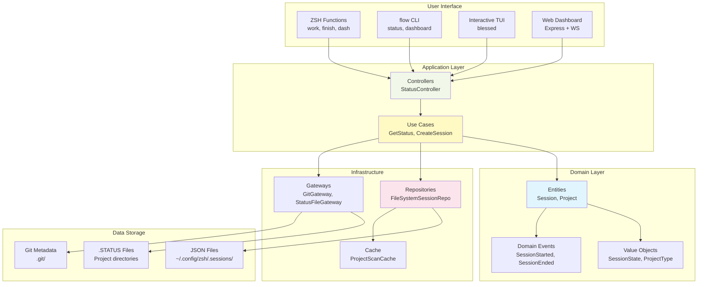

---

## Clean Architecture Layers

### Layer Dependencies

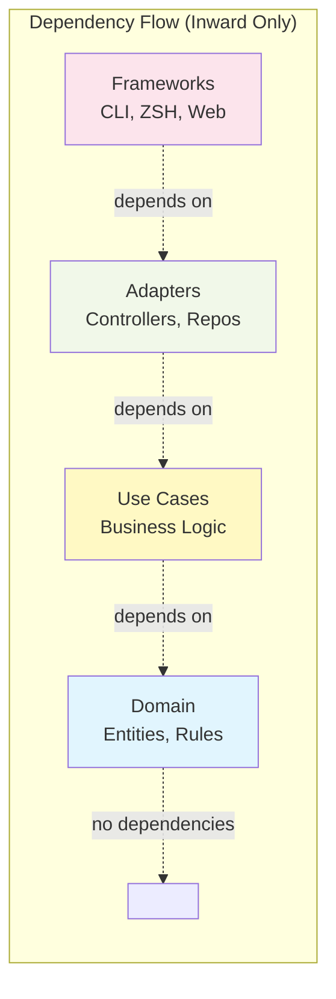

**Dependency Rule:** Source code dependencies point ONLY inward. Inner layers know nothing about outer layers.

---

### Layer Details

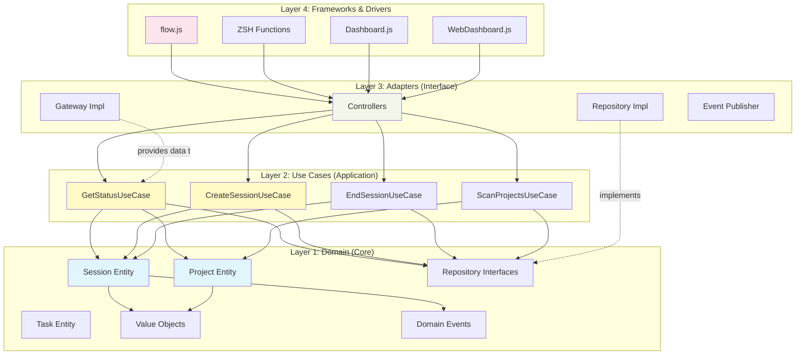

---

## Component Diagram

### Domain Layer Components

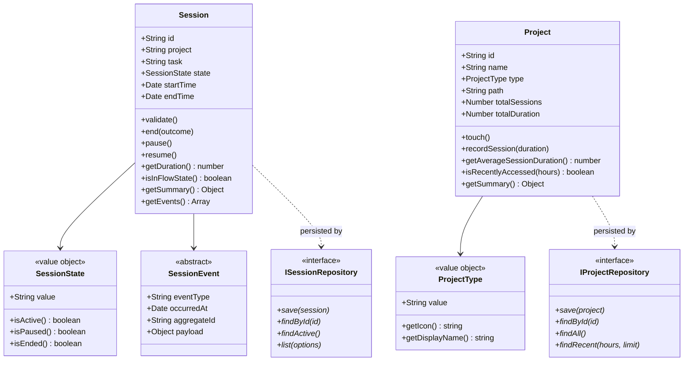

---

### Use Cases Components

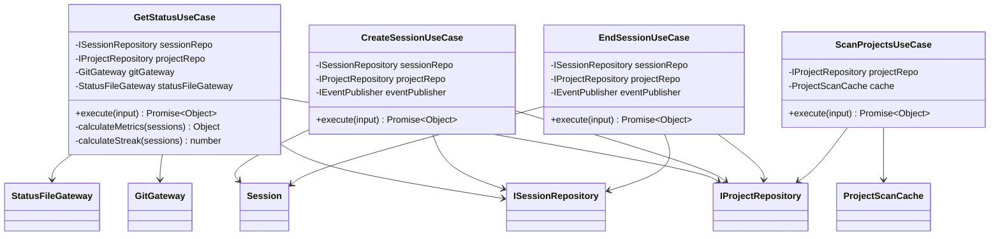

---

## Sequence Diagrams

### Create Session Flow

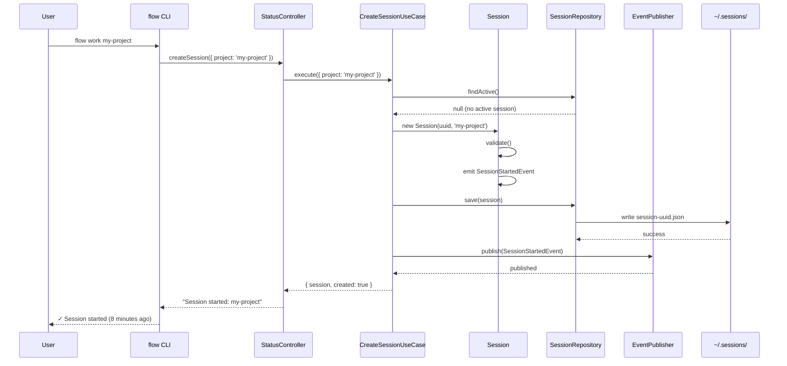

---

### Get Status Flow

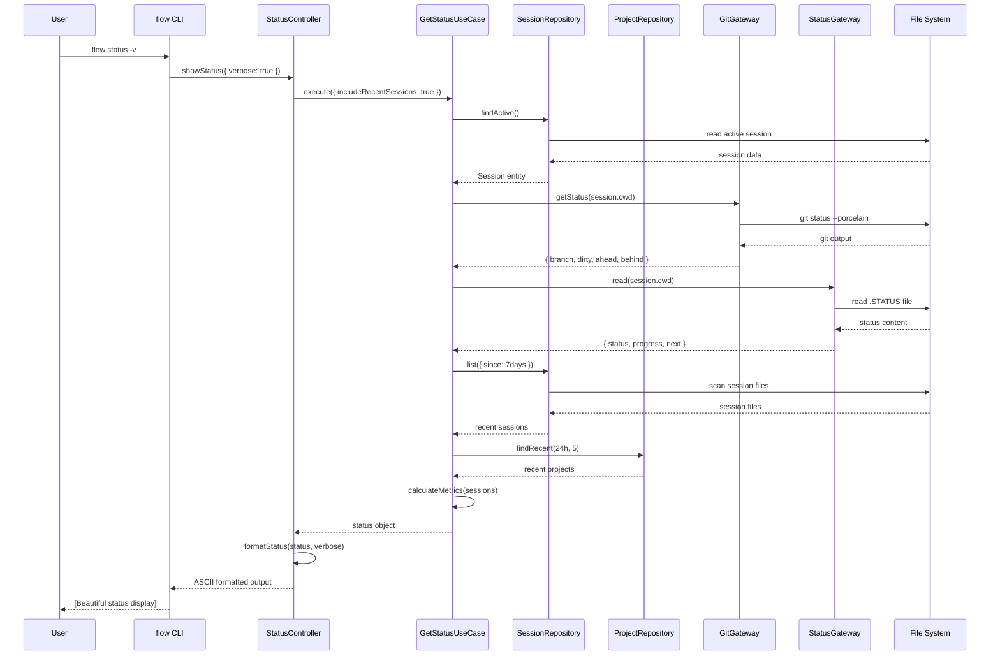

---

### End Session Flow

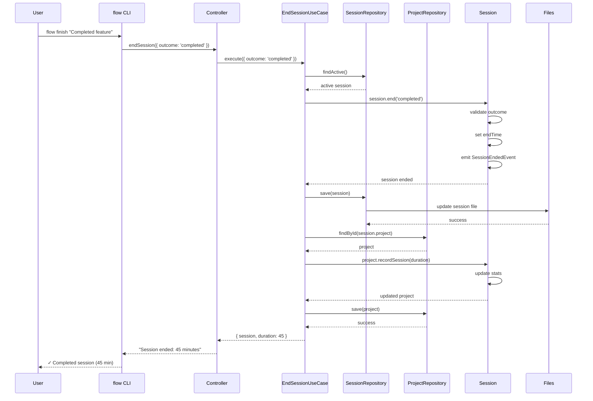

---

## Data Flow

### Status Command Data Flow

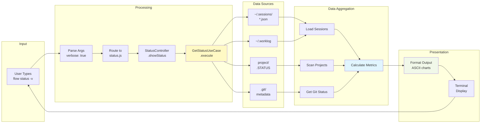

---

### Project Scanning Flow

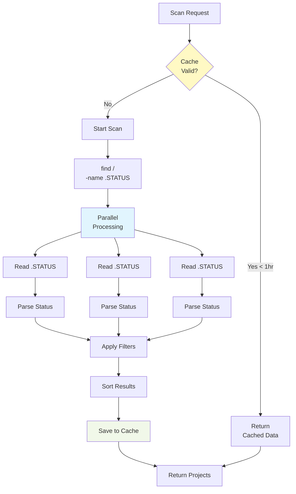

**Performance:**

- First scan: ~3ms (60 projects)
- Cached scan: <1ms
- Cache TTL: 1 hour
- Parallel processing: Promise.all

---

## Deployment Architecture

### Local Development

```mermaid
graph TB
    subgraph "User Environment"
        TERMINAL[iTerm2<br/>Terminal]
        ZSH_CONFIG[~/.config/zsh/]
    end

    subgraph "Flow CLI (Node.js)"
        CLI_BIN[/opt/homebrew/bin/flow]
        CLI_CODE[~/projects/dev-tools/<br/>flow-cli/cli/]
    end

    subgraph "Data Storage"
        SESSIONS[~/.config/zsh/<br/>.sessions/]
        WORKLOG[~/.config/zsh/<br/>.worklog]
        PROJECT_STATUS[~/projects/**/<br/>.STATUS]
    end

    subgraph "External Tools"
        GIT[git CLI]
        NODE[Node.js 18+]
    end

    TERMINAL --> ZSH_CONFIG
    ZSH_CONFIG --> CLI_BIN
    CLI_BIN --> CLI_CODE
    CLI_CODE --> SESSIONS
    CLI_CODE --> WORKLOG
    CLI_CODE --> PROJECT_STATUS
    CLI_CODE --> GIT
    CLI_CODE --> NODE

    style CLI_CODE fill:#e1f5fe
    style SESSIONS fill:#fff9c4
```

---

### Production (GitHub Pages)

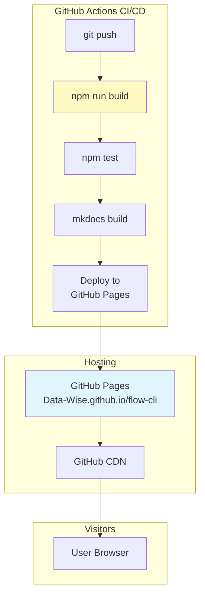

---

### System Context

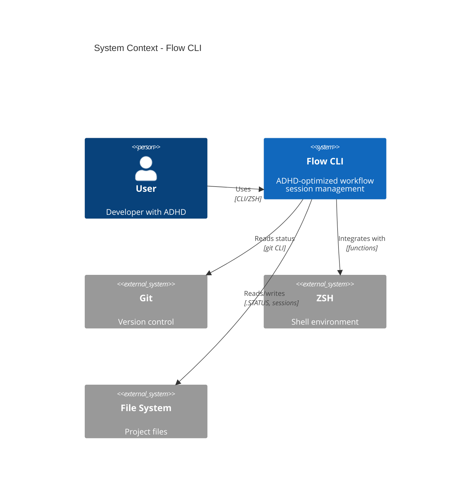

---

## Architecture Patterns

### Repository Pattern

```mermaid
graph LR
    subgraph "Use Case Layer"
        UC[GetStatusUseCase]
    end

    subgraph "Domain Layer"
        IFACE[ISessionRepository<br/>interface]
    end

    subgraph "Adapter Layer"
        FS_IMPL[FileSystemSessionRepository<br/>implementation]
        PG_IMPL[PostgresSessionRepository<br/>implementation]
    end

    subgraph "Infrastructure"
        FILES[JSON Files]
        DB[(PostgreSQL)]
    end

    UC --> IFACE
    IFACE <|.. FS_IMPL
    IFACE <|.. PG_IMPL

    FS_IMPL --> FILES
    PG_IMPL --> DB

    style IFACE fill:#e1f5fe
    style UC fill:#fff9c4
    style FS_IMPL fill:#f1f8e9
```

**Benefits:**

- Domain layer independent of infrastructure
- Easy to swap implementations
- Testable with mock repositories
- Multiple storage backends

---

### Event Sourcing (Domain Events)

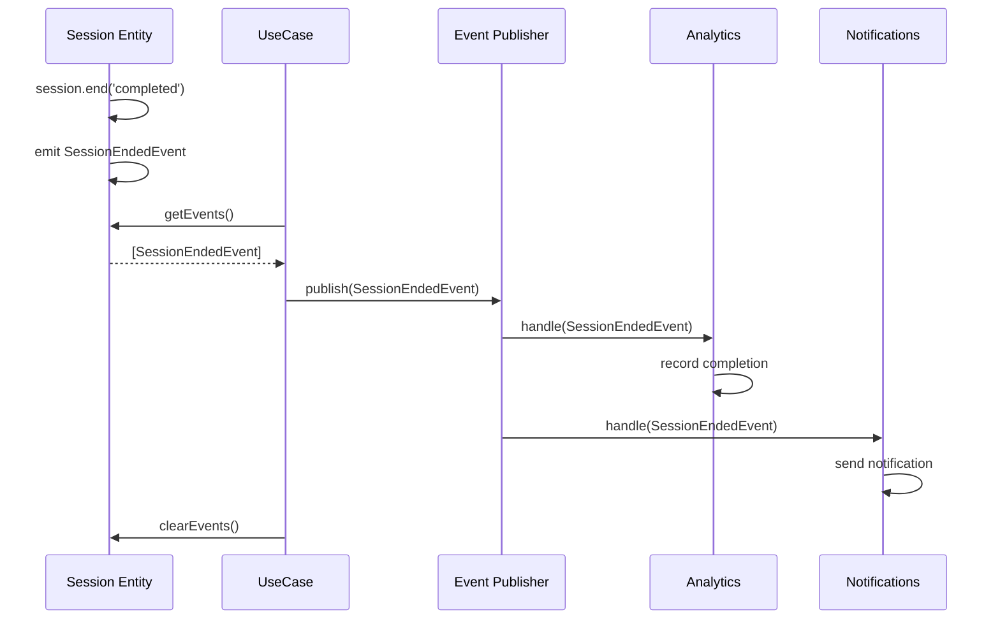

**Benefits:**

- Decoupled side effects
- Audit trail of domain changes
- Easy to add new event listeners
- Supports event-driven architecture

---

## See Also

- [API Reference](../api/API-REFERENCE.md)
- [ADR-002: Clean Architecture](../decisions/ADR-002-adopt-clean-architecture.md)
- [Architecture Patterns Analysis](ARCHITECTURE-PATTERNS-ANALYSIS.md)
- [Testing Guide](../testing/TESTING.md)

---

**Generated:** 2025-12-24
**Version:** 2.0.0-beta.1
