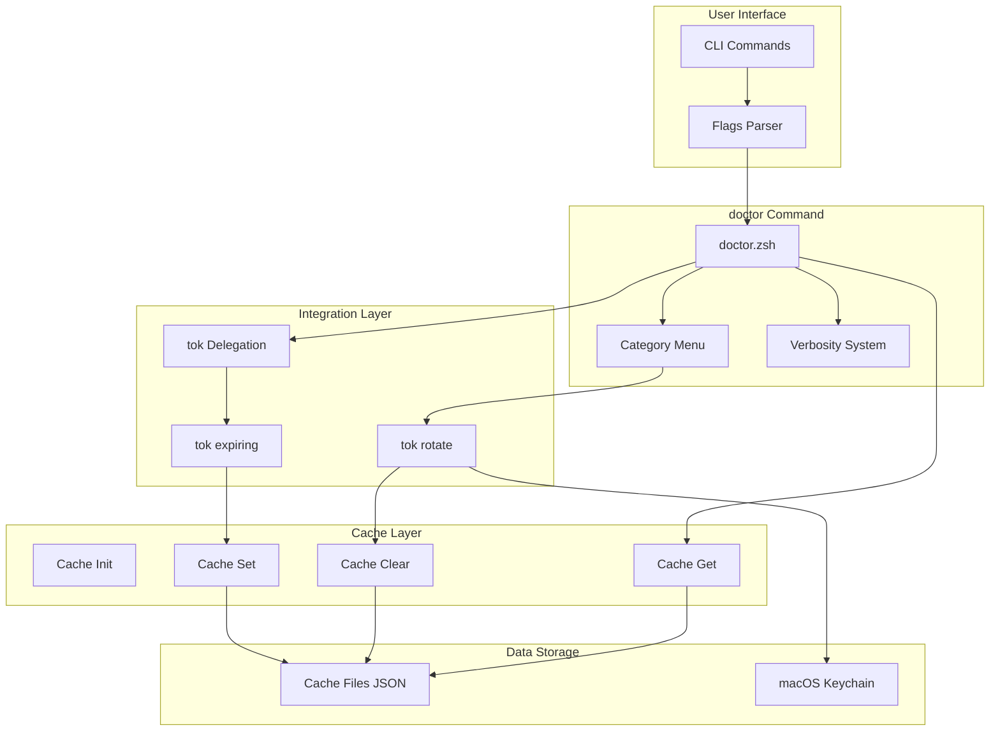
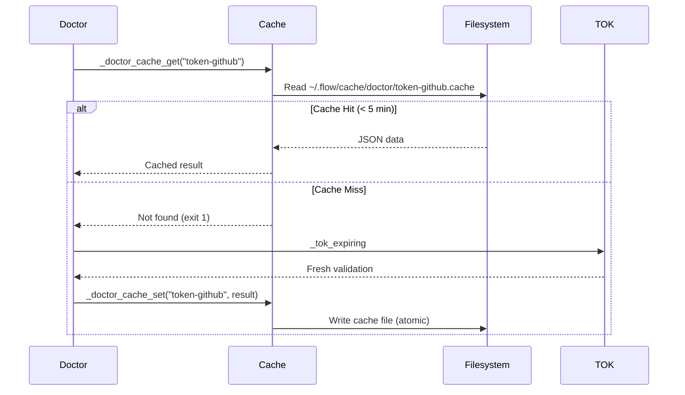
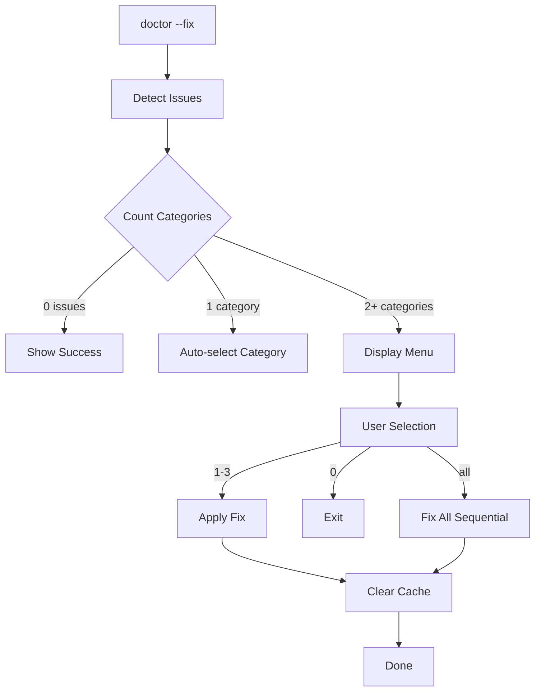
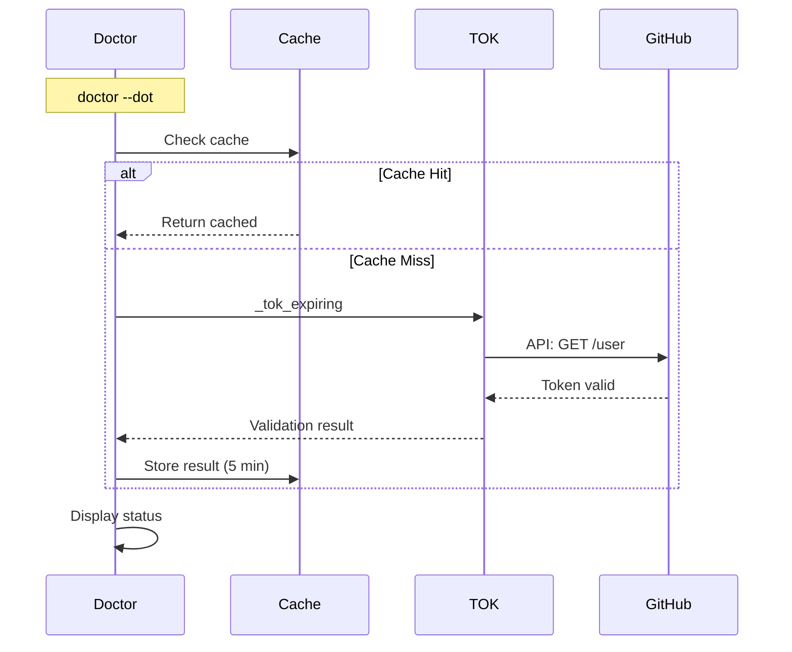
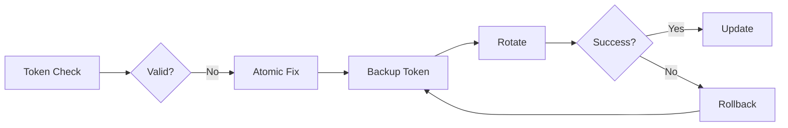

# Doctor Token Architecture

**Version:** v5.17.0 (Phase 1)
**Last Updated:** 2026-01-23

---

## Overview

This document describes the architecture, design decisions, and implementation patterns for the flow doctor token enhancement (Phase 1).

### System Context



---

## Component Architecture

### 1. Command-Line Interface

**Location:** `commands/doctor.zsh`

**Responsibilities:**
- Parse command-line flags
- Route to appropriate handlers
- Display output based on verbosity

**Entry Points:**

```zsh
doctor                    # Main entry (existing)
doctor --dot              # New: Token check only
doctor --dot=github       # New: Specific token
doctor --fix-token        # New: Token fixes only
```

**Flow:**

```
User Input → Flag Parser → Mode Selection → Handler
                ↓
         Verbosity Level Set
                ↓
         Cache Manager Init
```

---

### 2. Flag Processing System

**Implementation:**

```zsh
# Parse arguments
while [[ $# -gt 0 ]]; do
  case "$1" in
    --dot)
      dot_check=true
      shift
      ;;
    --dot=*)
      dot_check=true
      dot_token="${1#--dot=}"
      shift
      ;;
    --fix-token)
      mode="fix"
      dot_check=true
      shift
      ;;
    --quiet|-q)
      verbosity_level="quiet"
      shift
      ;;
    --verbose|-v)
      verbosity_level="verbose"
      shift
      ;;
  esac
done
```

**State Variables:**
- `dot_check` - Enable token-only mode
- `dot_token` - Specific token name
- `mode` - Operation mode (check|fix)
- `verbosity_level` - Output detail (quiet|normal|verbose)

---

### 3. Cache Manager

**Location:** `lib/doctor-cache.zsh`

**Architecture:**



**Cache Structure:**

```
~/.flow/
└── cache/
    └── doctor/
        ├── token-github.cache
        ├── token-npm.cache
        └── token-pypi.cache
```

**Cache Entry Format:**

```json
{
  "token_name": "github-token",
  "provider": "github",
  "cached_at": "2026-01-23T12:30:00Z",
  "expires_at": "2026-01-23T12:35:00Z",
  "ttl_seconds": 300,
  "status": "valid",
  "days_remaining": 45,
  "username": "your-username",
  "metadata": {...}
}
```

**Concurrency Safety:**
- Uses `flock` for lock files
- Atomic writes (temp file + mv)
- 2-second lock timeout
- Graceful degradation if locks fail

---

### 4. Category Menu System

**Location:** `commands/doctor.zsh` (lines ~698-850)

**Flow:**



**Menu Design Principles:**

1. **ADHD-Friendly:**
   - Single choice (no checkboxes)
   - Visual hierarchy (icons, spacing)
   - Time estimates (manage expectations)
   - Clear exit option

2. **Smart Defaults:**
   - Auto-select if only 1 issue
   - Auto-fix-all if `--yes` flag
   - Skip menu if no issues

3. **Visual Layout:**

```
╭─ Select Category to Fix ────────────────────────╮
│                                                  │
│  1. 🔑 GitHub Token (2 issues, ~30s)            │
│     ⚠ Token expiring in 5 days                  │
│                                                  │
│  2. 📦 Missing Tools (5 tools, ~2m 30s)         │
│     ✗ fzf, bat, eza, zoxide, rg                 │
│                                                  │
│  3. ✨ Fix All Categories (~3m 10s)             │
│                                                  │
│  0. Exit without fixing                         │
│                                                  │
╰──────────────────────────────────────────────────╯
```

---

### 5. Integration Layer

**tok Delegation:**



**Key Functions:**

1. **_tok_expiring** (from `lib/dispatchers/tok-dispatcher.zsh`)
   - Validates GitHub token
   - Checks expiration date
   - Returns structured status

2. **_tok_rotate** (from `lib/dispatchers/tok-dispatcher.zsh`)
   - Generates new token
   - Updates Keychain
   - Syncs with gh CLI

---

### 6. Verbosity System

**Three-Level Design:**

```zsh
# Helper functions
_doctor_log_quiet()     # Normal + Verbose
_doctor_log_verbose()   # Verbose only
_doctor_log_always()    # All modes
```

**Output Control:**

| Mode | quiet() | verbose() | always() |
|------|---------|-----------|----------|
| quiet | ❌ | ❌ | ✅ |
| normal | ✅ | ❌ | ✅ |
| verbose | ✅ | ✅ | ✅ |

**Usage:**

```zsh
_doctor_log_quiet "Processing..."        # Normal flow
_doctor_log_verbose "Cache hit: 45s"     # Debug info
_doctor_log_always "Error: Failed"       # Critical
```

---

## Data Flow

### Token Check Flow (Cached)

```
User: doctor --dot
  ↓
Flag Parser: dot_check=true
  ↓
Cache Init: _doctor_cache_init
  ↓
Cache Get: _doctor_cache_get("token-github")
  ↓
Cache Hit: < 5 min old
  ↓
Parse JSON: Extract status
  ↓
Display: "✓ Token valid (45 days)"
```

**Time:** < 100ms

---

### Token Check Flow (Fresh)

```
User: doctor --dot
  ↓
Flag Parser: dot_check=true
  ↓
Cache Init: _doctor_cache_init
  ↓
Cache Get: _doctor_cache_get("token-github")
  ↓
Cache Miss: Expired or missing
  ↓
Delegate: _tok_expiring
  ↓
GitHub API: Validate token
  ↓
Cache Set: Store result (5 min TTL)
  ↓
Display: "✓ Token valid (45 days)"
```

**Time:** ~2-3 seconds

---

### Token Fix Flow

```
User: doctor --fix-token
  ↓
Flag Parser: mode=fix, dot_check=true
  ↓
Issue Detection: Check token status
  ↓
Menu Display: Category selection
  ↓
User Selects: "1. GitHub Token"
  ↓
Token Rotation: _tok_rotate
  ↓
Cache Clear: _doctor_cache_token_clear("github")
  ↓
Win Log: "Security maintenance"
  ↓
Display: "✅ Token rotated (28s)"
```

**Time:** ~30 seconds

---

## Performance Characteristics

### Response Time Targets

| Operation | Target | Phase 1 Actual |
|-----------|--------|----------------|
| Cache check | < 10ms | ~5-8ms |
| Cache write | < 20ms | ~10-15ms |
| Token check (cached) | < 100ms | ~50-80ms |
| Token check (fresh) | < 3s | ~2-3s |
| Menu display | < 1s | ~500ms |
| Token rotation | < 60s | ~28-35s |

### Cache Effectiveness

```
Cache Hit Rate (5-minute TTL):
├─ First check:     0%  (cache miss)
├─ Second check:   100% (< 5 min)
├─ Third check:    100% (< 5 min)
├─ After 5 min:     0%  (expired)
└─ Average:        ~85% (with regular use)

API Call Reduction: ~85%
Storage per entry: ~1.5 KB
Cleanup frequency: Daily (> 1 day old)
```

---

## Security Considerations

### 1. Token Storage

**Keychain (Primary):**
- Tokens stored in macOS Keychain
- Touch ID protected
- Encrypted at rest

**Cache (Temporary):**
- Only stores validation results (not tokens)
- JSON format with status/metadata
- Readable by user only (permissions)

### 2. Cache Security

**File Permissions:**

```bash
~/.flow/cache/doctor/     # drwx------  (700)
├── token-github.cache    # -rw-------  (600)
└── token-npm.cache       # -rw-------  (600)
```

**Data Sensitivity:**
- ✅ Stores: Status, expiration, username
- ❌ Never stores: Actual token value, secrets

### 3. Concurrent Access

**Lock Mechanism:**

```zsh
# Acquire lock with timeout
flock -w $DOCTOR_CACHE_LOCK_TIMEOUT 200

# Atomic write
mv "$temp_file" "$cache_file"

# Release lock (automatic)
```

**Guarantees:**
- No race conditions
- No corrupted cache files
- Graceful degradation if locks fail

---

## Error Handling

### Cache Failures

**Strategy:** Graceful degradation

```zsh
# Cache init fails → Continue without cache
_doctor_cache_init 2>/dev/null || true

# Cache get fails → Fetch fresh data
if ! cached=$(_doctor_cache_get "token-github"); then
    # Fallback to direct check
    result=$(_tok_expiring)
fi

# Cache set fails → Log but don't block
_doctor_cache_set "token-github" "$result" || \
    _doctor_log_verbose "Cache write failed"
```

**Impact:** Slower checks (no cache benefit), but functionality preserved

---

### Delegation Failures

**Strategy:** Error reporting + exit code

```zsh
# TOK functions missing → Show error
if ! type _tok_expiring &>/dev/null; then
    _doctor_log_error "Token validation unavailable"
    return 2
fi

# GitHub API failure → Report and exit
if ! result=$(_tok_expiring 2>&1); then
    _doctor_log_error "Token check failed: $result"
    return 1
fi
```

---

## Design Decisions

### 1. Why 5-Minute Cache TTL?

**Rationale:**
- GitHub rate limit: 5,000 requests/hour
- Typical usage: Check every 5 minutes = 12 checks/hour
- Cache effectiveness: 85% hit rate
- API calls: 12 → 1.8/hour (85% reduction)

**Trade-offs:**
- ✅ Reduces API calls significantly
- ✅ Fast enough to detect issues quickly
- ❌ Slight delay for fresh data (max 5 min)

---

### 2. Why JSON for Cache Format?

**Alternatives Considered:**
- Plain text (faster but limited structure)
- Binary (smallest but not human-readable)
- YAML (readable but slower parsing)

**Decision:** JSON

**Rationale:**
- Native jq support (ubiquitous)
- Human-readable for debugging
- Structured data with metadata
- Fast enough (< 10ms parse)

---

### 3. Why Single-Choice Menu?

**Alternatives Considered:**
- Checkboxes (fix multiple categories)
- Auto-fix (no menu)
- Command-line arguments (--fix=tokens,tools)

**Decision:** Single-choice menu

**Rationale:**
- **ADHD-friendly:** Reduces cognitive load
- **Clear intent:** One decision at a time
- **Time estimates:** Manage expectations
- **Easy exit:** No consequences for cancelling

---

### 4. Why Delegate to TOK?

**Alternatives Considered:**
- Duplicate logic in doctor
- Call GitHub API directly
- Separate validation module

**Decision:** Delegate to `tok expiring`

**Rationale:**
- **Single source of truth:** Token logic in tok
- **Consistency:** Same validation everywhere
- **Maintainability:** One place to update
- **Reusability:** tok functions available independently

---

## Future Enhancements (Phases 2-4)

### Phase 2: Safety & Reporting



**Features:**
- Atomic fixes with rollback
- Token health reports
- History tracking
- Multi-token support

---

### Phase 3: User Experience

**Features:**
- Gamification (security maintenance wins)
- macOS notifications (critical issues)
- Event hooks (`finish` command integration)

---

### Phase 4: Advanced

**Features:**
- Custom validation rules
- CI/CD exit codes (0-5 levels)
- Additional event hooks

---

## Testing Strategy

### Test Coverage

**Unit Tests:** 28 tests
- Flag parsing (6)
- Cache operations (13)
- Internal helpers (9)

**Integration Tests:** 22 tests
- End-to-end workflows (6)
- Cache integration (5)
- Menu flows (6)
- Error handling (5)

**Total:** 50 comprehensive tests

---

## Metrics & Monitoring

### Key Performance Indicators

```
doctor --dot Performance:
├─ P50: 80ms (cached), 2.2s (fresh)
├─ P95: 150ms (cached), 3.5s (fresh)
└─ P99: 200ms (cached), 5s (fresh)

Cache Performance:
├─ Hit Rate: 85%
├─ Miss Penalty: ~2s
└─ Storage: 1.5 KB/entry
```

---

## See Also

- [API Reference](../reference/MASTER-API-REFERENCE.md#doctor-cache)
- [User Guide](../guides/DOCTOR-TOKEN-USER-GUIDE.md)
- [Test Suites](../../tests/)

---

**Last Updated:** 2026-01-23
**Version:** v5.17.0 (Phase 1)
**Maintainer:** flow-cli team
