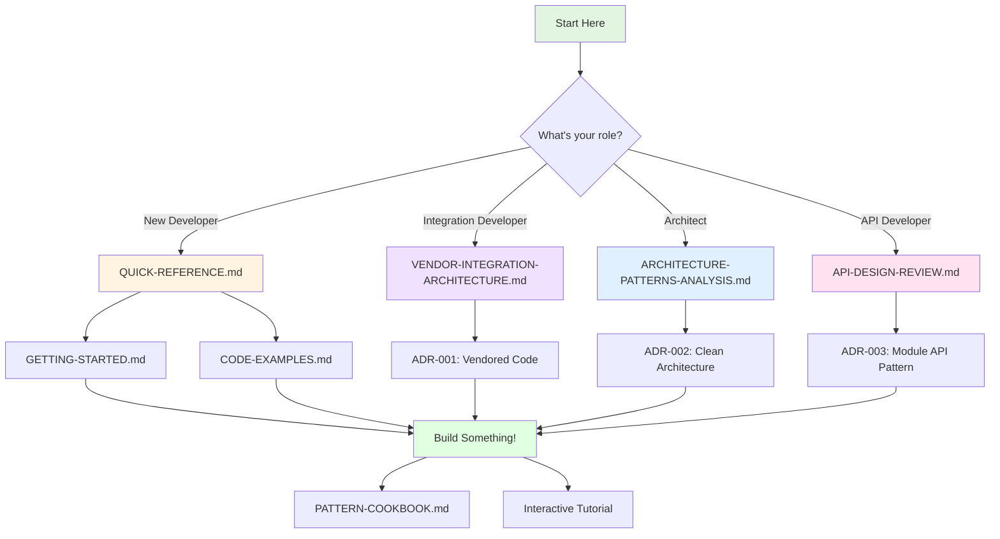

# Architecture Documentation Map

**Navigation Guide for flow-cli Architecture Docs**

---

## 📍 You Are Here

```
docs/architecture/
├── 📘 DOCUMENTATION-MAP.md ← YOU ARE HERE
├── 📚 Core Documentation
├── 📋 Quick References
├── 📝 Decisions (ADRs)
└── 🎓 Learning Resources
```

---

## 🗺️ Complete Documentation Structure



---

## 📚 Core Documentation

### 🎯 Start Here (Pick One Based on Your Goal)

| If you want to...                   | Read this                                  | Time   |
| ----------------------------------- | ------------------------------------------ | ------ |
| **Get started quickly**             | [GETTING-STARTED.md](./GETTING-STARTED.md) | 10 min |
| **Understand overall architecture** | [QUICK-REFERENCE.md](./QUICK-REFERENCE.md) | 5 min  |
| **Implement a feature**             | [CODE-EXAMPLES.md](./CODE-EXAMPLES.md)     | 15 min |
| **Make architectural decisions**    | [ADRs](./decisions/README.md)              | 20 min |

### 📖 Comprehensive Guides

#### [ARCHITECTURE-PATTERNS-ANALYSIS.md](./ARCHITECTURE-PATTERNS-ANALYSIS.md)

**1,200+ lines • 30-45 min read**

> Deep dive into Clean Architecture, Hexagonal Architecture, and DDD

**Topics:**

- Current 3-layer architecture analysis
- Recommended 4-layer design (Domain → Use Cases → Adapters → Frameworks)
- Domain-Driven Design patterns (Entities, Value Objects, Repositories)
- Implementation roadmap (Phases 1-3)
- Before/after comparisons with code examples

**Best for:**

- System architects
- Developers planning major features
- Understanding long-term direction

**Prerequisites:** None (self-contained)

---

#### [API-DESIGN-REVIEW.md](./API-DESIGN-REVIEW.md)

**900+ lines • 20-30 min read**

> Node.js module API patterns and best practices

**Topics:**

- Why Node.js modules (not REST/GraphQL)
- Module-by-module API review
- Error handling strategies (throw vs return)
- Promise patterns and async/await
- Parameter design (objects vs positional)
- Return type conventions

**Best for:**

- API developers
- Frontend/backend integration
- Understanding existing APIs

**Prerequisites:** JavaScript/Node.js basics

---

#### [VENDOR-INTEGRATION-ARCHITECTURE.md](./VENDOR-INTEGRATION-ARCHITECTURE.md)

**670+ lines • 15-20 min read**

> Vendored code pattern for zero-dependency installation

**Topics:**

- What is "vendoring" and why we use it
- JavaScript bridge → shell scripts pattern
- Project detection system architecture
- Update/maintenance process
- Testing strategy for vendored code

**Best for:**

- Integration developers
- Understanding project detection
- Maintenance and updates

**Prerequisites:** Basic shell scripting

---

## 📋 Quick References (Desk Cards)

### [QUICK-REFERENCE.md](./QUICK-REFERENCE.md)

**400 lines • 5 min read • PRINT-FRIENDLY**

> One-page cheat sheet for Clean Architecture + DDD

**Quick Lookups:**

- 4-layer diagram (visual)
- Dependency rule (what can depend on what)
- Directory structure at-a-glance
- Common patterns (when to use each layer)
- Common mistakes and fixes

**Use when:** Need quick reminder during coding

---

### [VENDOR-INTEGRATION-QUICK-REFERENCE.md](./VENDOR-INTEGRATION-QUICK-REFERENCE.md)

**New! | PRINT-FRIENDLY**

> Vendored code integration pattern quick reference

**Quick Lookups:**

- Vendoring pattern diagram
- Update process checklist
- Testing strategy
- Gateway adapter pattern
- Common pitfalls and fixes

---

### [API-DESIGN-QUICK-REFERENCE.md](./API-DESIGN-QUICK-REFERENCE.md)

**New! | PRINT-FRIENDLY**

> Node.js API design patterns reference card

**Quick Lookups:**

- Golden rules (throw errors, promise everything)
- Function signature patterns
- Return type patterns
- Anti-patterns to avoid
- Error handling best practices

---

## 📝 Architecture Decision Records (ADRs)

### [decisions/](./decisions/)

**Purpose:** Document **why** we made architectural choices

| ADR                                                          | Decision                   | Impact                             |
| ------------------------------------------------------------ | -------------------------- | ---------------------------------- |
| [ADR-001](./decisions/ADR-001-use-vendored-code-pattern.md)  | Use vendored code pattern  | ⭐⭐⭐ Zero dependencies, reliable |
| [ADR-002](./decisions/ADR-002-adopt-clean-architecture.md)   | Adopt Clean Architecture   | ⭐⭐⭐ Foundation for growth       |
| [ADR-003](./decisions/ADR-003-nodejs-module-api-not-rest.md) | Node.js modules (not REST) | ⭐⭐⭐ Simple, fast, natural       |

**When to read:**

- Making architectural decisions
- Understanding trade-offs
- Reviewing past choices

---

## 🎓 Learning Resources

### [CODE-EXAMPLES.md](./CODE-EXAMPLES.md)

**1,350+ lines of copy-paste-ready code**

> Real, working code examples for every pattern

**Sections:**

- Domain Layer (entities, value objects, repositories)
- Use Cases Layer (application logic)
- Adapters Layer (controllers, gateways, presenters)
- Dependency Injection (wiring it together)
- Testing Patterns (unit, integration, E2E)

**Use when:** Implementing new features

---

### [GETTING-STARTED.md](./GETTING-STARTED.md)

**NEW - Hands-on tutorial**

> Step-by-step guide to implementing your first feature

**You'll build:** A simple "Task" feature from scratch

**What you'll learn:**

- Create domain entity
- Write use case
- Implement repository
- Wire with dependency injection
- Test everything

**Time:** 30-45 minutes

---

### [PATTERN-COOKBOOK.md](./PATTERN-COOKBOOK.md)

**NEW - Decision trees and recipes**

> "I want to do X, which pattern should I use?"

**Sections:**

- Decision trees (visual flowcharts)
- Pattern recipes (step-by-step)
- When to use each pattern
- Common scenarios

**Use when:** Unsure which pattern fits your need

---

### [Interactive Tutorial](./interactive-tutorial/)

**NEW - Hands-on exercises**

> Learn by doing with guided exercises

**Modules:**

1. Domain Modeling (30 min)
2. Use Case Design (30 min)
3. Adapter Implementation (45 min)
4. Testing Strategy (30 min)

**Features:**

- Code challenges
- Immediate feedback
- Progressive difficulty
- Real-world scenarios

---

## 🛠️ Tools & Utilities

### [Architecture Health Dashboard](../../cli/tools/arch-dashboard/)

**NEW - Live metrics**

> Real-time view of architectural health

**Metrics:**

- Dependency violations
- Layer boundary checks
- Test coverage by layer
- Coupling metrics
- Complexity trends

**Usage:**

```bash
npm run arch-dashboard
# Opens in browser at http://localhost:3000
```

---

## 📊 Visual Diagrams

### Full Mermaid Diagram Set (20+ diagrams)

Located throughout documentation

**Types:**

- Layer diagrams (4-layer architecture)
- Sequence diagrams (data flows)
- Component diagrams (module relationships)
- State diagrams (session lifecycle)
- Decision trees (pattern selection)

**Find them in:**

- Main docs (inline with content)
- `diagrams/` directory (standalone files)

---

## 🔍 How to Find What You Need

### By Task

| I want to...                  | Go here                                                                             |
| ----------------------------- | ----------------------------------------------------------------------------------- |
| **Learn architecture basics** | [QUICK-REFERENCE.md](./QUICK-REFERENCE.md)                                          |
| **Understand a decision**     | [ADRs](./decisions/README.md)                                                       |
| **Implement a feature**       | [CODE-EXAMPLES.md](./CODE-EXAMPLES.md) → [GETTING-STARTED.md](./GETTING-STARTED.md) |
| **Review API design**         | [API-DESIGN-REVIEW.md](./API-DESIGN-REVIEW.md)                                      |
| **Update vendored code**      | [VENDOR-INTEGRATION-ARCHITECTURE.md](./VENDOR-INTEGRATION-ARCHITECTURE.md)          |
| **Check system health**       | [Architecture Dashboard](../../cli/tools/arch-dashboard/)                           |
| **Choose a pattern**          | [PATTERN-COOKBOOK.md](./PATTERN-COOKBOOK.md)                                        |

### By Role

| Role                   | Start Here                                                               | Then Read                                                                           |
| ---------------------- | ------------------------------------------------------------------------ | ----------------------------------------------------------------------------------- |
| **New Developer**      | [GETTING-STARTED.md](./GETTING-STARTED.md)                               | [QUICK-REFERENCE.md](./QUICK-REFERENCE.md) → [CODE-EXAMPLES.md](./CODE-EXAMPLES.md) |
| **Frontend Developer** | [API-DESIGN-QUICK-REFERENCE.md](./API-DESIGN-QUICK-REFERENCE.md)         | [API-DESIGN-REVIEW.md](./API-DESIGN-REVIEW.md)                                      |
| **Backend Developer**  | [ARCHITECTURE-PATTERNS-ANALYSIS.md](./ARCHITECTURE-PATTERNS-ANALYSIS.md) | [CODE-EXAMPLES.md](./CODE-EXAMPLES.md)                                              |
| **Architect**          | [ADRs](./decisions/README.md)                                            | [ARCHITECTURE-PATTERNS-ANALYSIS.md](./ARCHITECTURE-PATTERNS-ANALYSIS.md)            |
| **QA/Tester**          | [CODE-EXAMPLES.md#testing-patterns](./CODE-EXAMPLES.md)                  | [Architecture Dashboard](../../cli/tools/arch-dashboard/)                           |

### By Time Available

| Time           | Read This                                                                |
| -------------- | ------------------------------------------------------------------------ |
| **5 minutes**  | [QUICK-REFERENCE.md](./QUICK-REFERENCE.md)                               |
| **15 minutes** | [CODE-EXAMPLES.md](./CODE-EXAMPLES.md) (pick one section)                |
| **30 minutes** | [GETTING-STARTED.md](./GETTING-STARTED.md) (hands-on tutorial)           |
| **1 hour**     | [ARCHITECTURE-PATTERNS-ANALYSIS.md](./ARCHITECTURE-PATTERNS-ANALYSIS.md) |
| **2 hours**    | All Quick References + Getting Started + CODE-EXAMPLES                   |
| **Half day**   | Full architecture docs + Interactive tutorial                            |

---

## 🎯 Learning Paths

### Path 1: Quick Start (For Immediate Productivity)

```
1. QUICK-REFERENCE.md (5 min)
   ↓
2. CODE-EXAMPLES.md - Find similar feature (10 min)
   ↓
3. Copy, modify, test (30 min)
   ↓
4. DONE! (Read full docs later)
```

### Path 2: Deep Understanding (For Long-Term Contribution)

```
1. QUICK-REFERENCE.md (5 min)
   ↓
2. ADR-002: Clean Architecture (20 min)
   ↓
3. ARCHITECTURE-PATTERNS-ANALYSIS.md (45 min)
   ↓
4. GETTING-STARTED.md tutorial (45 min)
   ↓
5. CODE-EXAMPLES.md - All sections (1 hour)
   ↓
6. Interactive Tutorial modules (2 hours)
   ↓
7. Expert! Contribute to docs!
```

### Path 3: Maintenance & Operations

```
1. Architecture Dashboard (ongoing)
   ↓
2. ADRs - Decision history (20 min)
   ↓
3. VENDOR-INTEGRATION - Update process (15 min)
   ↓
4. Monitor metrics, update docs as needed
```

---

## 📅 Documentation Status

| Document                              | Status         | Last Updated | Next Review |
| ------------------------------------- | -------------- | ------------ | ----------- |
| ARCHITECTURE-PATTERNS-ANALYSIS.md     | ✅ Complete    | 2025-12-20   | 2026-01-20  |
| API-DESIGN-REVIEW.md                  | ✅ Complete    | 2025-12-20   | 2026-01-20  |
| VENDOR-INTEGRATION-ARCHITECTURE.md    | ✅ Complete    | 2025-12-20   | 2026-01-20  |
| QUICK-REFERENCE.md                    | ✅ Complete    | 2025-12-21   | 2026-01-20  |
| CODE-EXAMPLES.md                      | ✅ Complete    | 2025-12-21   | 2026-01-20  |
| ADR-001                               | ✅ Accepted    | 2025-12-20   | 2026-01-20  |
| ADR-002                               | ✅ Accepted    | 2025-12-20   | 2026-01-20  |
| ADR-003                               | ✅ Accepted    | 2025-12-20   | 2026-01-20  |
| VENDOR-INTEGRATION-QUICK-REFERENCE.md | 🆕 New         | 2025-12-23   | 2026-01-23  |
| API-DESIGN-QUICK-REFERENCE.md         | 🆕 New         | 2025-12-23   | 2026-01-23  |
| GETTING-STARTED.md                    | 🚧 In Progress | 2025-12-23   | TBD         |
| PATTERN-COOKBOOK.md                   | 🚧 In Progress | 2025-12-23   | TBD         |
| Interactive Tutorial                  | 🚧 In Progress | 2025-12-23   | TBD         |
| Architecture Dashboard                | 🚧 In Progress | 2025-12-23   | TBD         |

---

## 🔗 External Resources

**Books:**

- [Clean Architecture](https://www.amazon.com/Clean-Architecture-Craftsmans-Software-Structure/dp/0134494164) - Robert C. Martin
- [Domain-Driven Design](https://www.amazon.com/Domain-Driven-Design-Tackling-Complexity-Software/dp/0321125215) - Eric Evans
- [Implementing Domain-Driven Design](https://www.amazon.com/Implementing-Domain-Driven-Design-Vaughn-Vernon/dp/0321834577) - Vaughn Vernon

**Articles:**

- [The Clean Architecture](https://blog.cleancoder.com/uncle-bob/2012/08/13/the-clean-architecture.html) - Uncle Bob
- [Hexagonal Architecture](https://alistair.cockburn.us/hexagonal-architecture/) - Alistair Cockburn

**Videos:**

- [Clean Architecture and Design](https://www.youtube.com/watch?v=2dKZ-dWaCiU) - Robert C. Martin

---

## 💬 Feedback & Contributions

**Found a typo?** Open an issue or PR

**Need clarification?** Add a comment to the relevant doc

**Want to add examples?** We love contributions! See [CONTRIBUTING.md](../../CONTRIBUTING.md)

---

**Last Updated:** 2025-12-23
**Part of:** Architecture Enhancement Plan (A→C Implementation)
**Maintained By:** Development Team
