# Scholar Enhancement Architecture

**Feature:** Teaching Content Generation System
**Version:** v5.13.0
**Date:** 2026-01-17

---

## Table of Contents

- [System Overview](#system-overview)
- [Component Architecture](#component-architecture)
- [Data Flow](#data-flow)
- [Phase Integration](#phase-integration)
- [State Management](#state-management)
- [Sequence Diagrams](#sequence-diagrams)
- [Design Patterns](#design-patterns)

---

## System Overview

The Scholar Enhancement is a 6-phase composable system for AI-powered teaching content generation.

### Architecture Layers

```mermaid
graph TB
    subgraph "User Interface Layer"
        CLI[Command Line]
        Completion[ZSH Completion]
        Help[Help System]
    end

    subgraph "Orchestration Layer"
        Dispatcher[teach() dispatcher]
        Wrapper[_teach_scholar_wrapper]
    end

    subgraph "Phase Processing Layer"
        P1[Phase 1: Validation]
        P2[Phase 2: Resolution]
        P3[Phase 3: Lesson Plans]
        P4[Phase 4: Interactive]
        P5[Phase 5: Revision]
        P6[Phase 6: Context]
    end

    subgraph "Data Layer"
        LessonPlans[Lesson Plan YAML]
        Config[Course Config YAML]
        Materials[Course Materials]
    end

    subgraph "AI Layer"
        Claude[Claude Code]
        Scholar[Scholar Plugin]
    end

    CLI --> Dispatcher
    Completion --> Dispatcher
    Help --> Dispatcher

    Dispatcher --> Wrapper

    Wrapper --> P5
    Wrapper --> P6
    Wrapper --> P1
    Wrapper --> P2
    Wrapper --> P4
    Wrapper --> P3

    P3 --> LessonPlans
    P3 --> Config
    P6 --> Config
    P6 --> Materials

    Wrapper --> Claude
    Claude --> Scholar
```

### Key Principles

1. **Composability**: Each phase is independent and composable
2. **Progressive Enhancement**: Features layer on top of each other
3. **Graceful Degradation**: Missing dependencies don't break core functionality
4. **Zero Configuration**: Sensible defaults, configuration optional

---

## Component Architecture

### Phase 1: Flag Infrastructure

**Purpose:** Validate content flags for conflicts

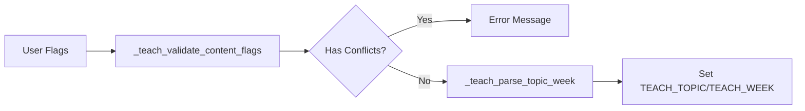

**Components:**
- `TEACH_CONTENT_FLAGS` - Associative array of 9 content flags
- `TEACH_SELECTION_FLAGS` - Associative array of selection flags
- `_teach_validate_content_flags()` - Conflict detection
- `_teach_parse_topic_week()` - Topic/week extraction

**Global State:**

```zsh
TEACH_TOPIC=""        # Explicit topic string
TEACH_WEEK=""         # Week number
```

### Phase 2: Preset System

**Purpose:** Resolve content from style presets and overrides

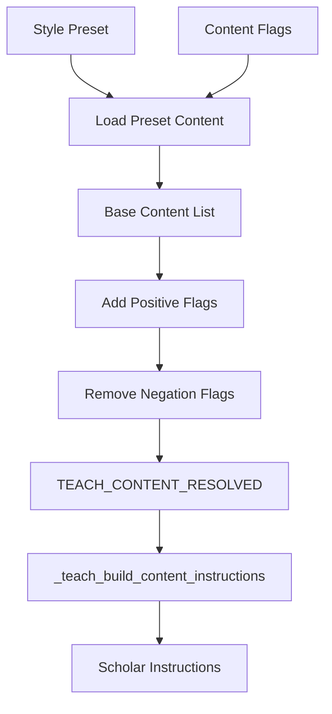

**Components:**
- `TEACH_STYLE_PRESETS` - Map of 4 style presets
- `_teach_resolve_content()` - Content resolution algorithm
- `_teach_build_content_instructions()` - Instruction builder

**Global State:**

```zsh
TEACH_CONTENT_RESOLVED=""  # Space-separated content list
```

**Resolution Algorithm:**

```zsh
1. Initialize content_list = []
2. If style preset exists:
     content_list = preset_content
3. For each positive flag (--X):
     Add X to content_list
4. For each negation flag (--no-X):
     Remove X from content_list
5. Return deduplicated content_list
```

### Phase 3: Lesson Plan Integration

**Purpose:** Load lesson plans and integrate with course config

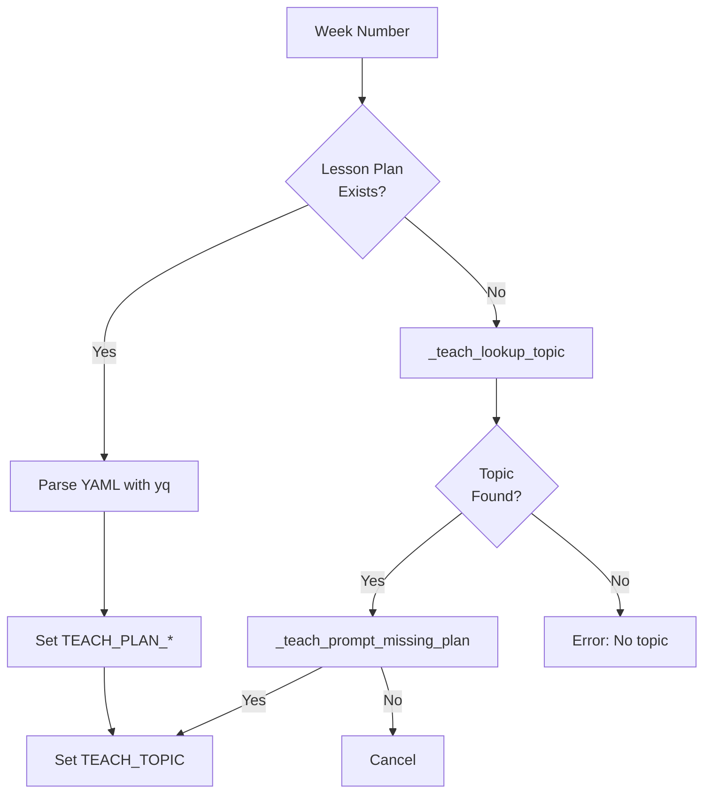

**Components:**
- `_teach_load_lesson_plan()` - YAML parsing
- `_teach_lookup_topic()` - Config fallback
- `_teach_prompt_missing_plan()` - User confirmation
- `_teach_integrate_lesson_plan()` - Main orchestrator

**Global State:**

```zsh
TEACH_PLAN_TOPIC=""           # Topic from plan
TEACH_PLAN_STYLE=""           # Style from plan
TEACH_PLAN_OBJECTIVES=""      # Pipe-separated
TEACH_PLAN_SUBTOPICS=""       # Pipe-separated
TEACH_PLAN_KEY_CONCEPTS=""    # Pipe-separated
TEACH_PLAN_PREREQUISITES=""   # Pipe-separated
TEACH_RESOLVED_STYLE=""       # Final style
```

### Phase 4: Interactive Mode

**Purpose:** Step-by-step wizards for topic and style selection

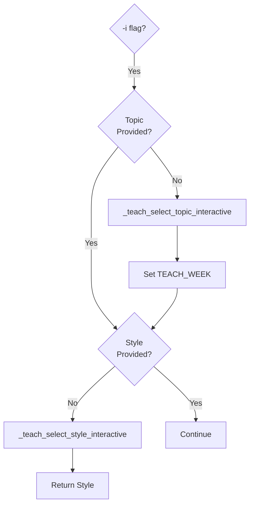

**Components:**
- `_teach_select_style_interactive()` - Style menu (4 options)
- `_teach_select_topic_interactive()` - Topic menu (from schedule)
- `_teach_interactive_wizard()` - Main wizard orchestrator

**UI Flow:**

```
1. Banner: "Interactive Teaching Content Generator"
2. If no week/topic → Show topic selection menu
3. User selects week [1-N]
4. If no style → Show style selection menu
5. User selects style [1-4]
6. Return selected style
```

### Phase 5: Revision Workflow

**Purpose:** Improve existing content with 6 revision options

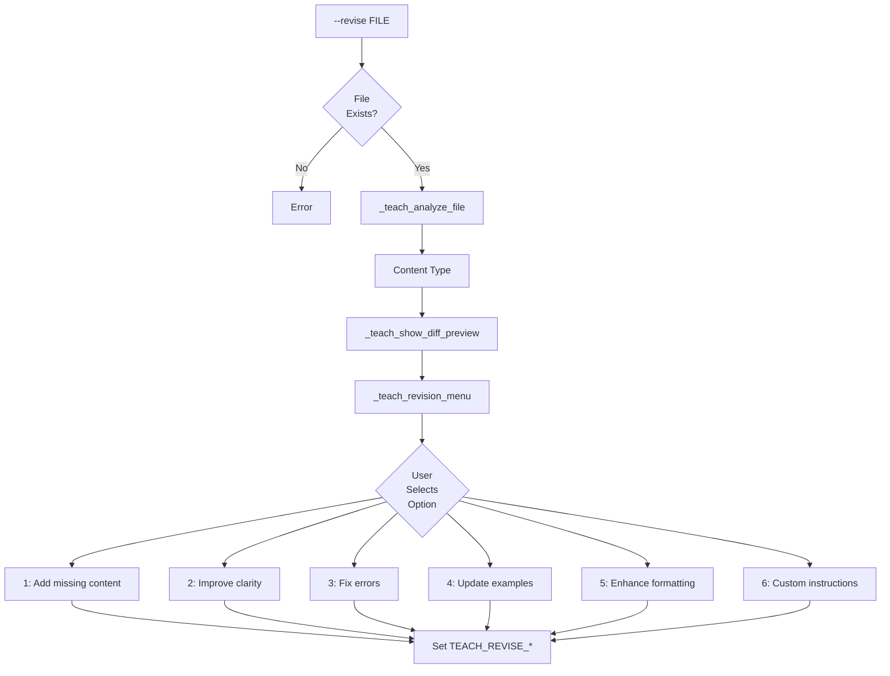

**Components:**
- `_teach_analyze_file()` - Content type detection (56 lines)
- `_teach_revision_menu()` - 6-option menu (58 lines)
- `_teach_show_diff_preview()` - Git diff display (26 lines)
- `_teach_revise_workflow()` - Main orchestrator (48 lines)

**Global State:**

```zsh
TEACH_REVISE_MODE="improve"       # Always "improve" for now
TEACH_REVISE_FILE=""              # File being revised
TEACH_REVISE_INSTRUCTIONS=""      # User-selected instruction
```

**Content Type Detection:**

```zsh
# Check YAML frontmatter
format: revealjs → slides
format: beamer → slides
title: "*Exam*" → exam
title: "*Quiz*" → quiz

# Check content patterns
"# Homework" → assignment
"Course: " → syllabus
"Criteria|Rubric" → rubric
```

### Phase 6: Context Integration

**Purpose:** Gather course context from materials

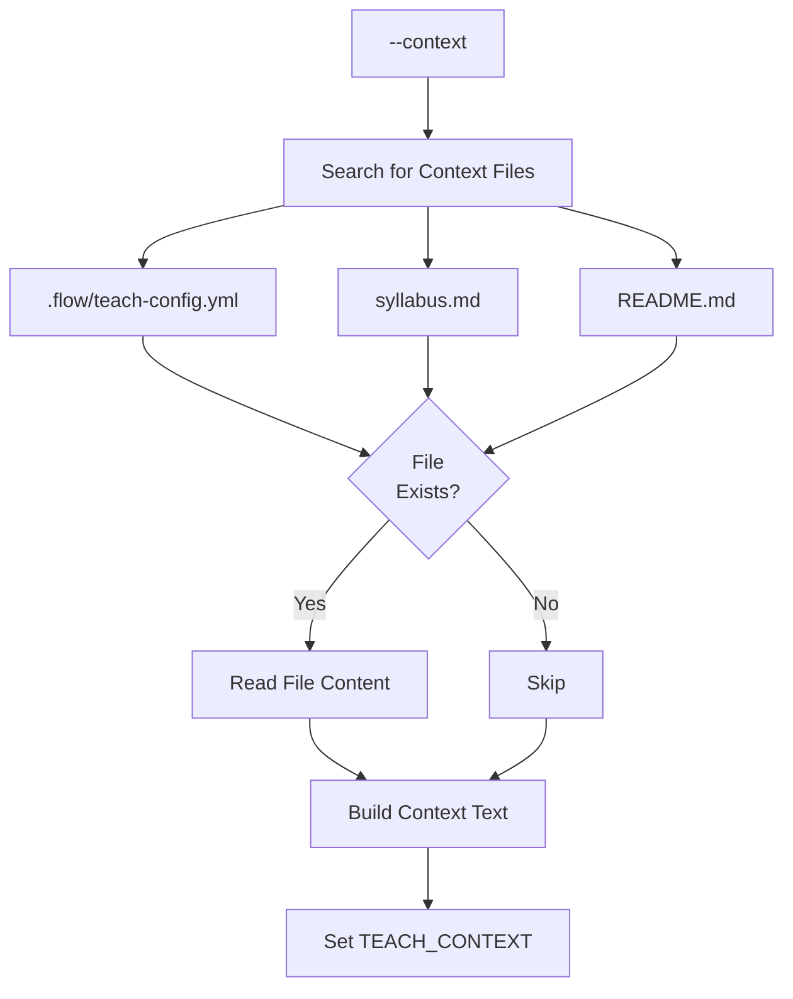

**Components:**
- `_teach_build_context()` - Context gathering (40 lines)

**Global State:**

```zsh
TEACH_CONTEXT=""  # Course context text
```

**Context Format:**

```
Course Information:
- From: .flow/teach-config.yml
- Content: [course name, semester, year]

Course Materials:
- From: syllabus.md
- Content: [first 500 chars]

Project Overview:
- From: README.md
- Content: [first 500 chars]
```

---

## Data Flow

### Complete Request Flow

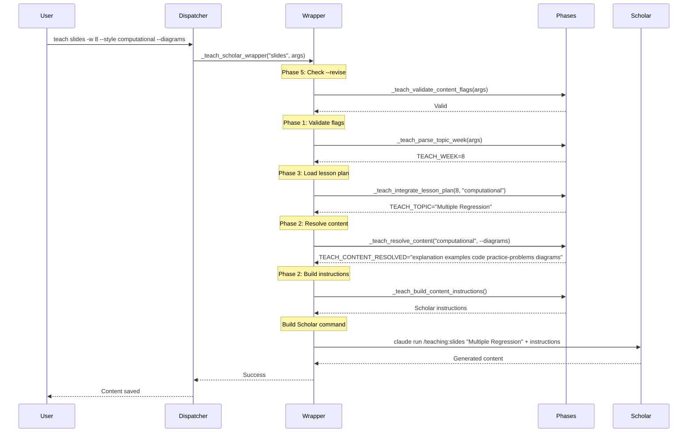

### Interactive Mode Flow

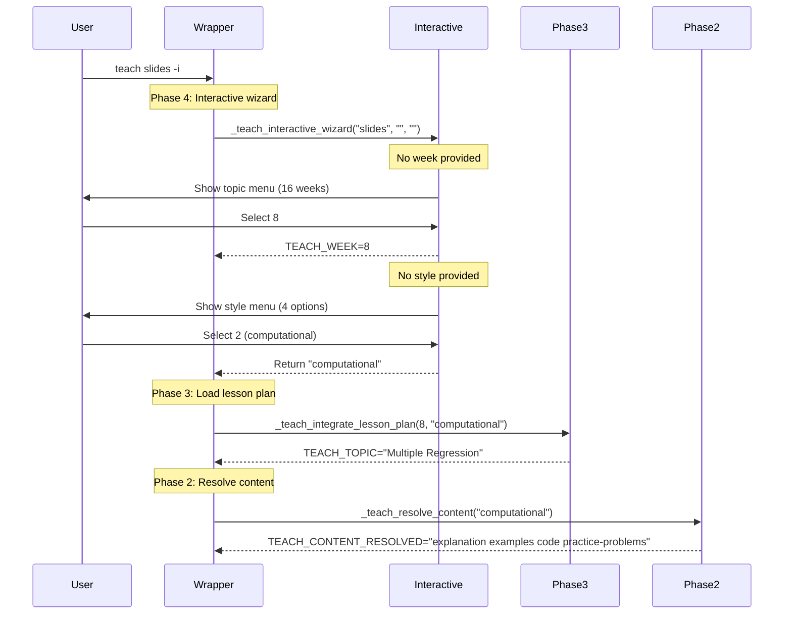

### Revision Workflow Flow

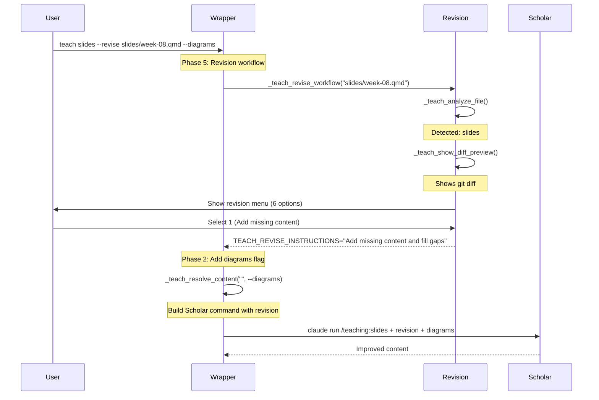

---

## Phase Integration

### Execution Order

The wrapper executes phases in this specific order:

```zsh
_teach_scholar_wrapper() {
    # 1. PHASE 5: Revision workflow (if --revise)
    if [[ -n "$revise_file" ]]; then
        _teach_revise_workflow "$revise_file" || return 1
    fi

    # 2. PHASE 6: Context integration (if --context)
    if [[ "$use_context" == "true" ]]; then
        course_context=$(_teach_build_context)
    fi

    # 3. PHASE 1: Flag validation
    _teach_validate_content_flags "${args[@]}" || return 1

    # 4. PHASE 1: Topic/week parsing
    _teach_parse_topic_week "${args[@]}" || return 1

    # 5. PHASE 4: Interactive wizard (if -i)
    if [[ "$interactive" == "true" ]]; then
        wizard_style=$(_teach_interactive_wizard "$subcommand" "$topic" "$style") || return 1
    fi

    # 6. PHASE 3: Lesson plan integration (if --week)
    if [[ -n "$TEACH_WEEK" ]]; then
        _teach_integrate_lesson_plan "$TEACH_WEEK" "$style" || return 1
    fi

    # 7. PHASE 2: Content resolution
    _teach_resolve_content "$final_style" "${args[@]}"

    # 8. PHASE 2: Build instructions
    local content_instructions=$(_teach_build_content_instructions)

    # 9. Build and execute Scholar command
    local scholar_cmd="claude run /teaching:$subcommand"
    # ... add revision, context, instructions
}
```

### Why This Order?

1. **Revision first** - Establishes file context before other processing
2. **Context second** - Available throughout remaining phases
3. **Validation third** - Catch errors early
4. **Topic/week fourth** - Needed for interactive and lesson plan phases
5. **Interactive fifth** - Can override or supplement previous selections
6. **Lesson plan sixth** - Uses week from previous phases
7. **Content resolution seventh** - Uses style from all previous phases
8. **Instructions eighth** - Final step before Scholar invocation

---

## State Management

### Global Variables

**Phase 1 Variables:**

```zsh
typeset -g TEACH_TOPIC=""        # Explicit topic
typeset -g TEACH_WEEK=""         # Week number
```

**Phase 2 Variables:**

```zsh
typeset -g TEACH_CONTENT_RESOLVED=""  # Resolved content list
```

**Phase 3 Variables:**

```zsh
typeset -g TEACH_PLAN_TOPIC=""           # From lesson plan
typeset -g TEACH_PLAN_STYLE=""           # From lesson plan
typeset -g TEACH_PLAN_OBJECTIVES=""      # From lesson plan
typeset -g TEACH_PLAN_SUBTOPICS=""       # From lesson plan
typeset -g TEACH_PLAN_KEY_CONCEPTS=""    # From lesson plan
typeset -g TEACH_PLAN_PREREQUISITES=""   # From lesson plan
typeset -g TEACH_RESOLVED_STYLE=""       # Final style
```

**Phase 5 Variables:**

```zsh
typeset -g TEACH_REVISE_MODE=""          # Always "improve"
typeset -g TEACH_REVISE_FILE=""          # File being revised
typeset -g TEACH_REVISE_INSTRUCTIONS=""  # Revision instruction
```

**Phase 6 Variables:**

```zsh
typeset -g TEACH_CONTEXT=""  # Course context
```

### State Lifecycle

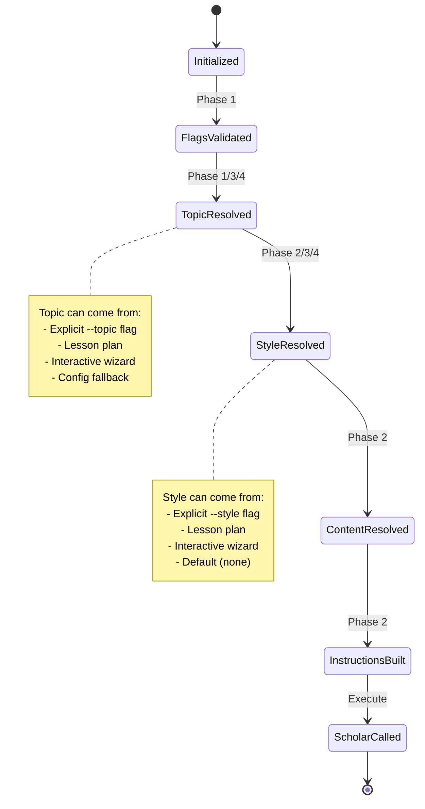

---

## Sequence Diagrams

### Complete Workflow (All Phases)

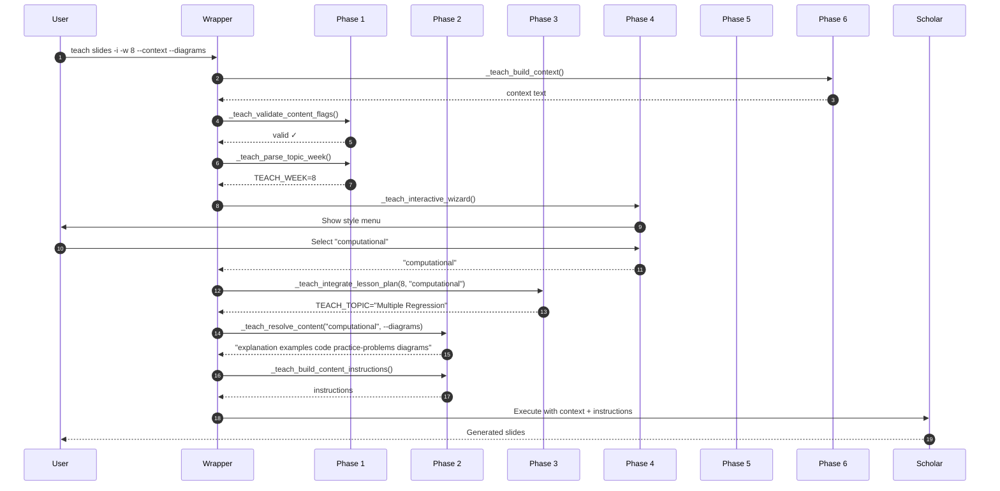

---

## Design Patterns

### 1. Pipeline Pattern

Each phase transforms data in sequence:

```
Input → Validation → Parsing → Interactive → Integration → Resolution → Output
```

### 2. Composition Pattern

Phases are composable and optional:

```zsh
# Minimal
teach slides "Topic"

# + Style
teach slides "Topic" --style computational

# + Week
teach slides -w 8 --style computational

# + Interactive
teach slides -i --style computational

# + Context
teach slides -i --style computational --context

# + Revision
teach slides --revise file.qmd --context
```

### 3. Strategy Pattern

Content resolution uses different strategies:

- **Preset Strategy**: Load from style preset
- **Override Strategy**: Add/remove from preset
- **Direct Strategy**: No preset, individual flags

### 4. Template Method Pattern

`_teach_scholar_wrapper()` defines the algorithm skeleton, phases fill in the steps:

```zsh
_teach_scholar_wrapper() {
    validate()      # Phase 1
    parse()         # Phase 1
    interactive()   # Phase 4 (optional)
    integrate()     # Phase 3 (optional)
    resolve()       # Phase 2
    execute()       # Final step
}
```

### 5. Facade Pattern

Wrapper provides simple interface to complex phase system:

```zsh
# User sees simple command
teach slides -w 8 --style computational

# Under the hood: 6 phases + Scholar integration
```

---

## Performance Considerations

### Optimization Strategies

1. **Lazy Loading**: Lesson plans loaded only when `-w` specified
2. **Short-circuit**: Validation fails fast on conflicts
3. **Caching**: Config parsed once per invocation
4. **Minimal I/O**: Only read necessary files

### Bottlenecks

| Operation | Time | Mitigation |
|-----------|------|------------|
| yq YAML parsing | ~5ms | Cache results, graceful fallback |
| File I/O | ~10ms | Read only needed files |
| User input | Variable | Cannot optimize |
| Scholar execution | 10-60s | Claude Code overhead, not our code |

---

## Future Architecture

### Planned Enhancements

1. **Context Caching**: Cache course context with invalidation
2. **Batch Mode**: Process multiple files in single invocation
3. **Plugin System**: Allow custom revision options
4. **Template Engine**: User-defined content templates
5. **Revision History**: Track and rollback revisions

### Extensibility Points

- **New Presets**: Add to `TEACH_STYLE_PRESETS` map
- **New Content Flags**: Add to `TEACH_CONTENT_FLAGS` array
- **New Revision Options**: Extend `_teach_revision_menu()`
- **New Context Sources**: Extend `_teach_build_context()`

---

**Last Updated:** 2026-01-17
**Status:** Production Ready
**Version:** v5.13.0
