# Teaching Dates Architecture

**Version:** v5.11.0
**Status:** Complete
**Last Updated:** 2026-01-16

---

## Executive Summary

The Teaching Dates Automation system centralizes semester schedule management for academic courses. It provides a single source of truth (teach-config.yml) for all temporal information and automatically synchronizes dates across teaching materials (syllabus, assignments, lectures, schedules).

**Key Components:**
1. **Date Parser Module** (`lib/date-parser.zsh`) - Extract, normalize, and compute dates
2. **Config Schema Extensions** - Store weeks, holidays, deadlines, exams
3. **Sync Command** (`teach dates sync`) - Interactive date synchronization
4. **Init Command** (`teach dates init`) - Wizard for semester setup

**Primary Value:** Eliminate manual date management, prevent inconsistencies, reduce semester rollover from 2 hours to 5 minutes.

---

## Table of Contents

1. [System Overview](#system-overview)
2. [Architecture Diagrams](#architecture-diagrams)
3. [Component Specifications](#component-specifications)
4. [Data Flow](#data-flow)
5. [Integration Points](#integration-points)
6. [Error Handling](#error-handling)
7. [Performance](#performance)
8. [Security](#security)
9. [Future Enhancements](#future-enhancements)

---

## System Overview

### High-Level Architecture

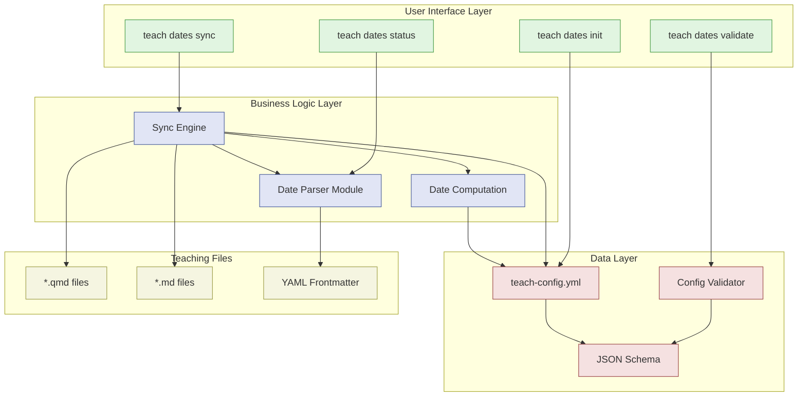

### System Boundaries

**In Scope:**
- Date extraction from Quarto/Markdown files
- Date normalization (ISO, US, long form)
- Relative date computation (week + offset)
- Config-to-file synchronization
- Interactive sync workflow
- Semester initialization

**Out of Scope:**
- Automatic semester rollover (future v5.12.0)
- Multi-meeting per week (future v5.12.0)
- External calendar import (future v5.13.0)
- Real-time sync (future)

### Design Principles

1. **Single Source of Truth:** Config is authoritative, files are derived
2. **Safety First:** Backups, dry-run mode, interactive prompts
3. **Cross-Platform:** Works on macOS (BSD) and Linux (GNU)
4. **ADHD-Friendly:** Clear prompts, safe defaults, visual feedback
5. **Pure ZSH:** No Node.js/Python dependencies (except `yq` for YAML)

---

## Architecture Diagrams

### Component Interaction Diagram

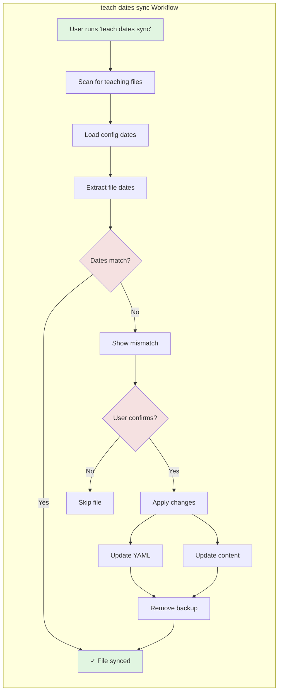

### Data Flow: Config to Files

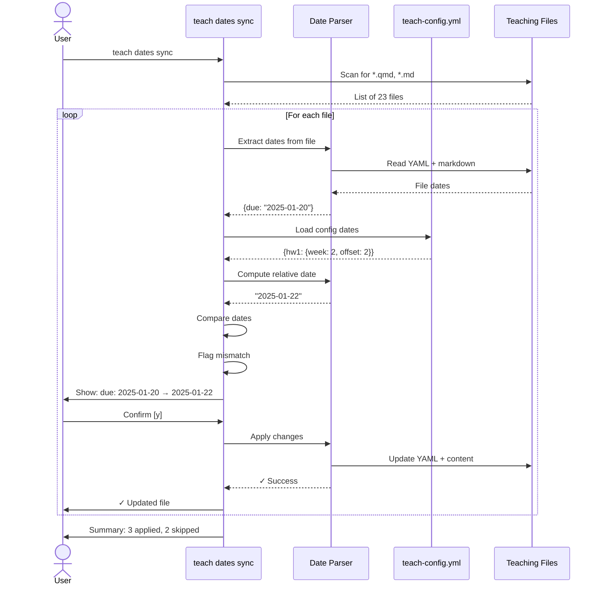

### Semester Init Flow

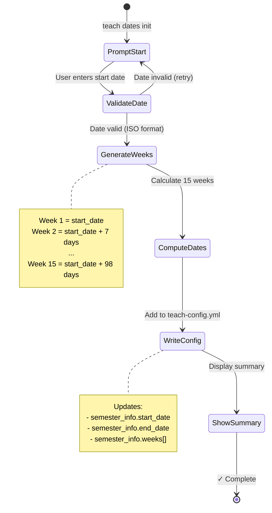

---

## Component Specifications

### Date Parser Module

**Location:** `lib/date-parser.zsh`

**Responsibilities:**
1. Extract dates from YAML frontmatter
2. Find inline dates in Markdown
3. Normalize dates to ISO-8601
4. Compute relative dates (week + offset)
5. Apply date changes to files

**Public API:**

| Function | Input | Output | Side Effects |
|----------|-------|--------|--------------|
| `_date_parse_quarto_yaml` | file, field | ISO date | None |
| `_date_parse_markdown_inline` | file, [pattern] | line:date array | None |
| `_date_normalize` | date_string | ISO date | None |
| `_date_compute_from_week` | week, offset, [config] | ISO date | None |
| `_date_add_days` | base_date, days | ISO date | None |
| `_date_find_teaching_files` | [path] | file paths | None |
| `_date_load_config` | [config] | shell code | None |
| `_date_apply_to_file` | file, changes | 0/1 | Modifies file + backup |

**Dependencies:**
- `yq` ≥ 4.0 (YAML processing)
- `date` or `gdate` (date arithmetic)
- `sed` (content replacement)
- `find` (file discovery)

**Error Handling:**
- All functions return 0 (success) or 1 (error)
- Errors printed to stderr
- Stdout reserved for data output

### Sync Engine

**Location:** `lib/dispatchers/teach-dates.zsh`

**Responsibilities:**
1. Orchestrate file discovery
2. Load config dates
3. Compare file vs config dates
4. Present mismatches to user
5. Apply changes interactively

**Workflow:**

```
1. Scan teaching files
   ↓
2. Load config dates
   ↓
3. For each file:
   a. Extract file dates
   b. Match to config
   c. Flag mismatches
   ↓
4. Show summary
   ↓
5. For each mismatch:
   a. Show diff
   b. Prompt user
   c. Apply if confirmed
   ↓
6. Show final summary
```

**Modes:**

| Mode | Behavior |
|------|----------|
| Interactive (default) | Prompts for each file |
| `--dry-run` | Preview only, no changes |
| `--force` | Auto-apply all changes |
| `--verbose` | Show detailed progress |

**Filters:**

| Filter | Effect |
|--------|--------|
| `--assignments` | Sync only assignments/ |
| `--lectures` | Sync only lectures/ |
| `--syllabus` | Sync only syllabus/schedule |
| `--file <path>` | Sync single file |

### Config Schema

**Location:** `lib/templates/teaching/teach-config.schema.json`

**Extended Fields:**

```yaml
semester_info:
  start_date: string (YYYY-MM-DD)
  end_date: string (YYYY-MM-DD)

  weeks:
    - number: integer (1-52)
      start_date: string (YYYY-MM-DD)
      topic: string (optional)

  holidays:
    - name: string
      date: string (YYYY-MM-DD)
      type: enum(break|holiday|no_class)

  deadlines:
    <assignment_id>:
      # Absolute date
      due_date: string (YYYY-MM-DD)
      # OR relative date
      week: integer
      offset_days: integer

  exams:
    - name: string
      date: string (YYYY-MM-DD)
      time: string (optional)
      location: string (optional)
```

**Validation Rules:**
- All dates must be ISO format (`YYYY-MM-DD`)
- Week numbers must be sequential (1, 2, 3, ...)
- Deadlines must have `due_date` XOR (`week` AND `offset_days`)
- Exam dates should fall within semester range (warning if not)

### Config Validator

**Location:** `lib/config-validator.zsh`

**Extended Validations:**
1. **Schema validation:** JSON Schema compliance
2. **Date format:** All dates are YYYY-MM-DD
3. **Week sequence:** No gaps or duplicates
4. **Chronology:** End date after start date
5. **Range checks:** Exam dates within semester
6. **Hash tracking:** Detect config changes

**Integration:**
- Called by `teach status`
- Called by `teach dates validate`
- Auto-validates before sync

---

## Data Flow

### teach dates sync - Detailed Flow

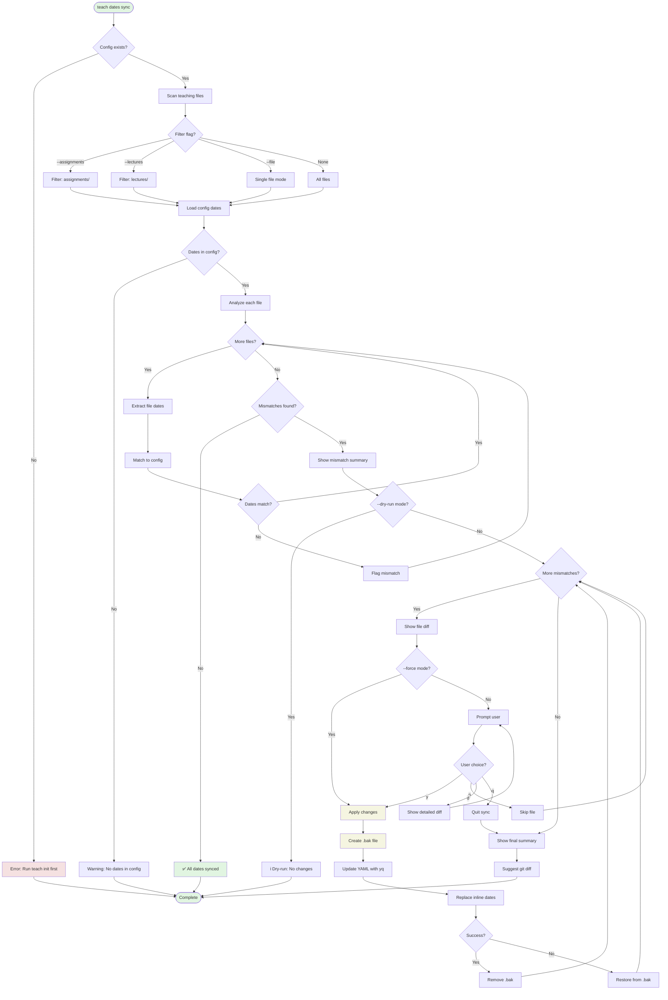

### Date Computation Flow

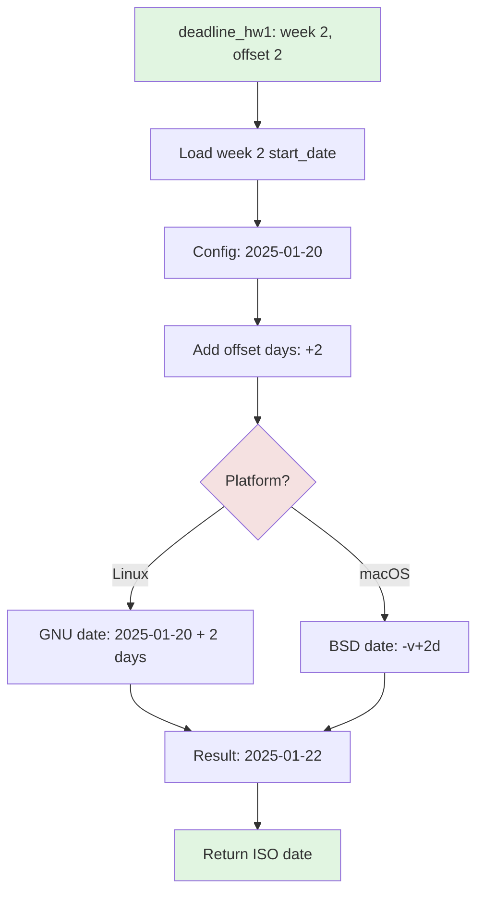

### File Modification Flow

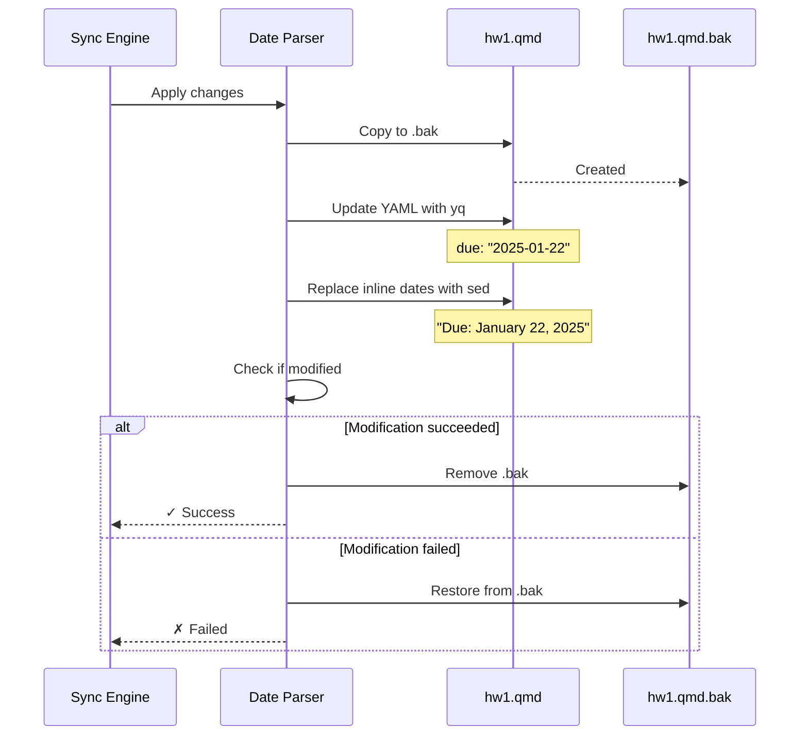

---

## Integration Points

### Integration with Existing flow-cli Components

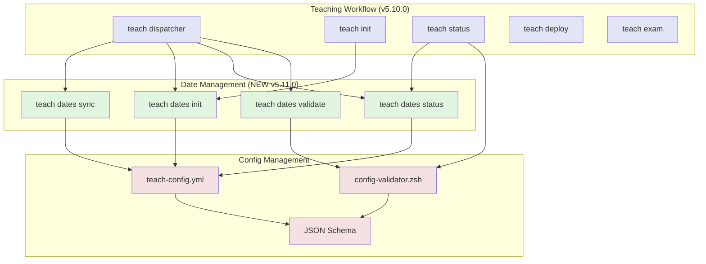

### Integration with Scholar MCP

**Current (v5.10.0):**
- Scholar reads `course.name`, `course.semester`, `course.year` from config
- Scholar uses `scholar.grading`, `scholar.style` sections

**Future (v5.12.0+):**
- Scholar reads `semester_info.weeks[]` for course timeline context
- Scholar reads `semester_info.exams[]` to avoid scheduling conflicts
- Scholar reads `semester_info.holidays[]` for pacing

**Example:**

```bash
# Generate exam for Week 8
teach exam "Midterm 1" --week 8

# Scholar reads:
# - Week 8 start date from semester_info
# - Existing exams to avoid duplicates
# - Holiday dates to avoid conflicts
```

### External Tool Dependencies

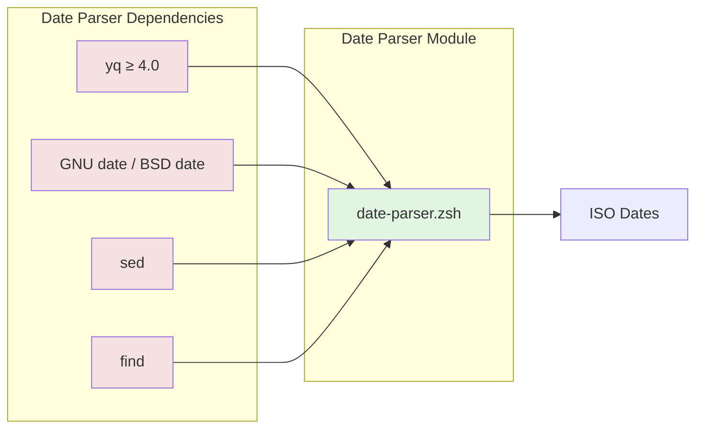

**Dependency Management:**
- `yq` - Required for YAML operations (install: `brew install yq`)
- `date` - System tool (GNU on Linux, BSD on macOS)
- `sed` - System tool (present on all Unix-like systems)
- `find` - System tool (present on all Unix-like systems)

**Graceful Degradation:**
- If `yq` missing → Error message with install instructions
- If `date` missing → Error (should never happen on Unix)
- Platform auto-detection for `date` syntax (GNU vs BSD)

---

## Error Handling

### Error Hierarchy

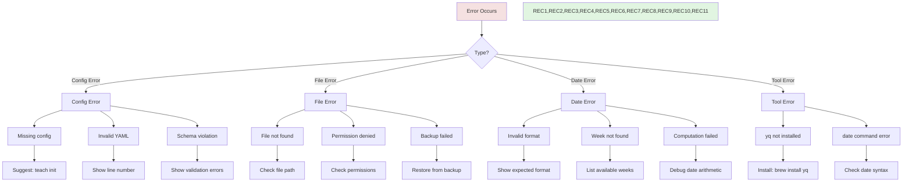

### Error Recovery Strategies

| Error | Recovery Strategy | User Action |
|-------|------------------|-------------|
| **Missing config** | Exit gracefully | Run `teach init` |
| **Invalid date** | Skip field, continue | Fix date in config |
| **Week not found** | Skip computation | Add week to config |
| **yq not installed** | Exit with install instructions | Install yq |
| **File write error** | Restore from backup | Check permissions |
| **YAML parse error** | Show line number | Fix YAML syntax |
| **sed replace error** | Restore from backup | Check file encoding |

### Rollback Mechanisms

**File-Level Rollback:**

```zsh
# Before modification
cp file.qmd file.qmd.bak

# If error occurs
mv file.qmd.bak file.qmd  # Restore

# If success
rm file.qmd.bak  # Clean up
```

**Config-Level Rollback:**

```bash
# User can always use git
git restore .flow/teach-config.yml

# Or manual rollback
# Remove semester_info section from config
# Files retain their current dates (no change)
```

**Sync-Level Rollback:**

```bash
# User can quit during interactive sync
# Prompt: [y/n/d/q]
# q = Quit, no more changes

# Or use git after sync
git diff  # Review changes
git restore <file>  # Undo specific file
git restore .  # Undo all
```

---

## Performance

### Benchmarks

**Environment:**
- MacBook Pro M1
- 50 teaching files
- 23 dates in config

| Operation | Time | Notes |
|-----------|------|-------|
| Load config dates | ~100ms | yq subprocess |
| Scan 50 files | ~20ms | find command |
| Extract dates from 1 file | ~5ms | yq + regex |
| Compute 1 relative date | ~10ms | yq + date arithmetic |
| Apply changes to 1 file | ~10ms | yq + sed |
| **Full sync (50 files)** | **~1.2s** | Including user prompts |

### Optimization Strategies

**Current:**
1. Single yq call per file (not per field)
2. Batch date computations (compute once, use many times)
3. Skip files without date fields early
4. Use `find -maxdepth 2` to limit recursion

**Future (if needed):**
1. Cache yq output for repeated reads
2. Parallel file processing (process multiple files concurrently)
3. Incremental sync (only check files modified since last sync)
4. Skip binary files early

### Scalability Limits

| Metric | Current | Limit | Notes |
|--------|---------|-------|-------|
| Files | 50 | 500+ | Linear time growth |
| Dates per config | 23 | 200+ | Hash table lookup |
| File size | 10KB | 1MB+ | sed/yq overhead |
| Sync time | 1.2s | 10s | For 500 files |

**Expected Growth:**
- Typical course: 20-50 files
- Large course: 100-200 files
- No scalability issues expected

---

## Security

### Threat Model

**Potential Threats:**
1. Malicious config file (command injection via YAML)
2. Malicious file content (command injection via dates)
3. Path traversal (reading files outside project)
4. Unauthorized file modification

### Mitigations

**1. Config Validation:**

```yaml
# Schema enforces:
- Date format: YYYY-MM-DD (regex validated)
- Integer types: Week numbers, offsets
- Enum types: semester, holiday types
- No shell commands in YAML
```

**2. Input Sanitization:**

```zsh
# All date inputs validated with regex
if [[ ! "$date" =~ ^[0-9]{4}-[0-9]{2}-[0-9]{2}$ ]]; then
    return 1
fi

# Week numbers validated as integers
if [[ ! "$week" =~ ^[0-9]+$ ]]; then
    return 1
fi
```

**3. File Path Validation:**

```zsh
# Only operate within project root
# Use relative paths, not arbitrary paths
# find command scoped to specific directories

# No directory traversal
[[ "$file" == *".."* ]] && return 1
```

**4. Backup Before Modification:**

```zsh
# Always create backup before modifying
cp "$file" "${file}.bak"

# Restore on any error
trap 'mv "${file}.bak" "$file"' ERR
```

### Permissions

**Required Permissions:**
- Read: `.flow/teach-config.yml`
- Read/Write: Teaching files (`.qmd`, `.md`)
- Write: Backup files (`.bak`)

**Not Required:**
- System-wide write access
- Root/sudo permissions
- Network access

---

## Future Enhancements

### Roadmap (v5.12.0 - v5.14.0)

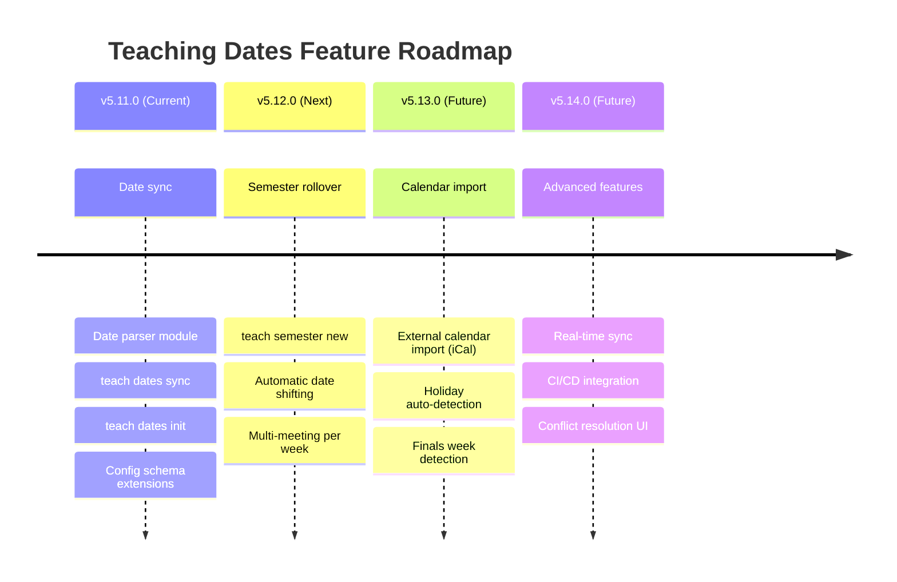

### Planned Features

#### 1. Semester Rollover (v5.12.0)

**Command:**

```bash
teach semester new "Spring 2026"
```

**Behavior:**
1. Calculate date shift (Fall 2025 → Spring 2026)
2. Shift all config dates (weeks, exams, holidays)
3. Update `course.semester` and `course.year`
4. Run `teach dates sync --force`
5. Complete rollover in < 5 minutes

**Architecture Changes:**
- Add `_teach_semester_new()` function
- Add date shifting algorithm
- Add `teach semester` dispatcher

#### 2. Multi-Meeting Per Week (v5.12.0)

**Config Schema:**

```yaml
weeks:
  - number: 1
    meetings:
      - date: "2025-01-13"
        topic: "Introduction"
      - date: "2025-01-15"
        topic: "Setup & RStudio"
```

**Use Case:** Courses with MWF or TTh schedules

#### 3. External Calendar Import (v5.13.0)

**Command:**

```bash
teach dates import-calendar university-calendar.ics
```

**Behavior:**
1. Parse iCal file
2. Extract holidays, breaks, finals week
3. Add to `semester_info.holidays[]`
4. Validate no conflicts with existing dates

**Architecture Changes:**
- Add iCal parser module
- Add conflict detection
- Add `teach dates import-calendar` command

---

## Appendices

### A. File Type Support Matrix

| File Type | YAML Parsing | Inline Parsing | Modification | Status |
|-----------|-------------|----------------|--------------|--------|
| `.qmd` (Quarto) | ✅ Yes | ✅ Yes | ✅ Yes | Full support |
| `.md` (Markdown) | ✅ Yes | ✅ Yes | ✅ Yes | Full support |
| `.Rmd` (R Markdown) | ⚠️ Partial | ✅ Yes | ⚠️ Partial | Future |
| `.ipynb` (Jupyter) | ❌ No | ❌ No | ❌ No | Not planned |
| `.tex` (LaTeX) | ❌ No | ⚠️ Partial | ❌ No | Not planned |

### B. Date Format Support Matrix

| Format | Example | Parse | Normalize | Display | Notes |
|--------|---------|-------|-----------|---------|-------|
| ISO-8601 | `2025-01-22` | ✅ | ✅ | ✅ | Primary format |
| US Short | `1/22/2025` | ✅ | ✅ | ✅ | Ambiguous (M/D vs D/M) |
| US Long | `January 22, 2025` | ✅ | ✅ | ✅ | Unambiguous |
| Abbreviated | `Jan 22, 2025` | ✅ | ✅ | ✅ | Common in prose |
| Short Abbrev | `Jan 22` | ✅ | ✅ | ⚠️ | Infers year |
| Relative | `week: 2, offset: 2` | ⚠️ | ✅ | ❌ | Config only |

### C. Cross-Platform Compatibility

| Platform | OS | ZSH Version | yq | date | Status |
|----------|----|-----------|----|------|--------|
| macOS | 13+ | 5.8+ | brew install | BSD date | ✅ Tested |
| Linux (Ubuntu) | 22.04+ | 5.8+ | apt install | GNU date | ✅ Tested |
| Linux (Fedora) | 38+ | 5.8+ | dnf install | GNU date | ✅ Tested |
| WSL2 (Ubuntu) | 22.04+ | 5.8+ | apt install | GNU date | ⚠️ Manual test needed |
| FreeBSD | 13+ | 5.8+ | pkg install | BSD date | ❌ Not tested |

---

## See Also

- [Date Parser API Reference](../reference/MASTER-API-REFERENCE.md#teaching-libraries) - Function documentation
- [Teaching Dates Guide](../guides/TEACHING-DATES-GUIDE.md) - User guide
- [Config Schema Reference](../reference/MASTER-API-REFERENCE.md#config-validation) - Schema docs

---

**Last Updated:** 2026-01-16
**Version:** v5.11.0
**Status:** Complete
