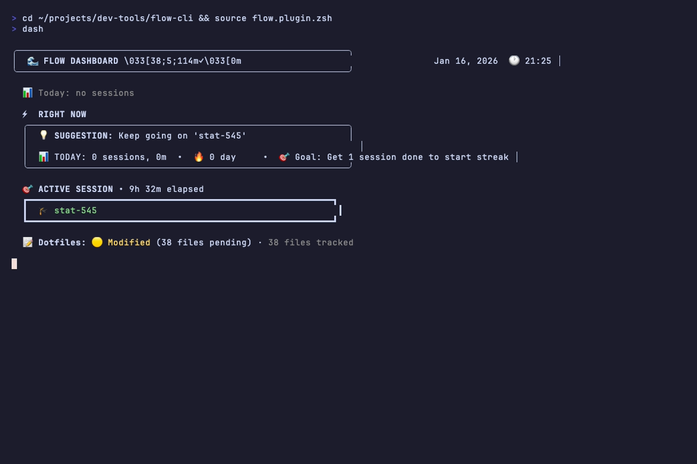
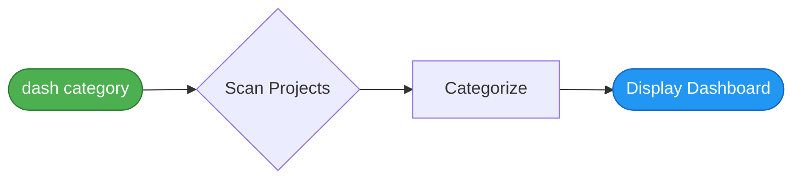
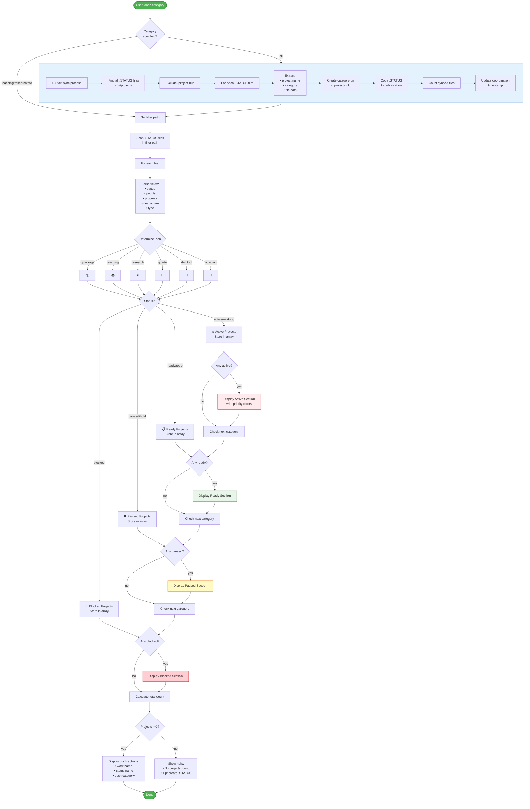

# `dash` - Master Project Dashboard

> **Unified project dashboard with smart categorization and .STATUS file sync**

**Command:** `dash [category]`
**Purpose:** Unified view of all active work across projects
**Type:** Display/Reporting

---

## Synopsis

```bash
dash [category]
dash -i          # Interactive TUI mode
dash --watch     # Live refresh mode
```

**Quick examples:**
```bash
# Show all projects
dash

# Filter by category
dash teaching
dash research

# Interactive mode with fzf
dash -i

# Live dashboard (refreshes every 5s)
dash --watch
```

---

## 📸 Example Output



*The flow-cli dashboard showing active session, quick access projects, and category breakdown*

---

## 🎯 Quick Summary

The `dash` command scans all `.STATUS` files across your projects, categorizes them by status (active/ready/paused/blocked), and displays a formatted dashboard. When run with "all" category, it also syncs status files to a central project-hub for coordination.

---

## 📊 Visual Flow

### Simple View



**In plain words:** Input → Scan → Organize → Display

---

### Detailed Flow

<details>
<summary>Click to expand full procedure diagram</summary>



</details>

---

## 📝 Step-by-Step Procedure

For accessibility and text-based reference:

### Phase 1: Category Parsing

1. Parse the category argument (default: "all")
2. Validate category is one of: all, teaching, research, packages, dev, quarto

### Phase 2: Sync (Only for "all" category)

3. Find all `.STATUS` files in `~/projects` (excluding `/project-hub`)
4. For each `.STATUS` file:
   - Extract project name, category, and path
   - Create category directory in `~/projects/project-hub/` if needed
   - Copy `.STATUS` file to `project-hub/category/name.STATUS`
   - Increment sync counter
5. Display sync completion message with count
6. Update coordination timestamp in `PROJECT-HUB.md`

### Phase 3: Filter Setup

7. Set filter path based on category:
   - `teaching` → `~/projects/teaching`
   - `research` → `~/projects/research`
   - `packages` → `~/projects/r-packages`
   - `dev` → `~/projects/dev-tools`
   - `quarto` → `~/projects/quarto`
   - `all` → `~/projects`

### Phase 4: Scan & Parse

8. Find all `.STATUS` files in filter path
9. For each `.STATUS` file:
   - Parse fields: `status`, `priority`, `progress`, `next`, `type`
   - Assign default values if fields missing
   - Determine project icon based on type
   - Create entry: `icon name | priority | progress | next`

### Phase 5: Categorization

10. Categorize each entry by status:
    - `active/working/in progress` → Active Projects array
    - `ready/todo/planned` → Ready Projects array
    - `paused/hold/waiting` → Paused Projects array
    - `blocked` → Blocked Projects array

### Phase 6: Display

11. Display header with category name
12. If Active Projects array not empty:
    - Display "🔥 ACTIVE NOW" section
    - For each project: show name, priority (colored), progress %, next action
13. If Ready Projects array not empty:
    - Display "📋 READY TO START" section
    - For each project: show name, priority (colored), next action
14. If Paused Projects array not empty:
    - Display "⏸️ PAUSED" section
    - For each project: show name, next action (dimmed)
15. If Blocked Projects array not empty:
    - Display "🚫 BLOCKED" section
    - For each project: show name, next action (dimmed)

### Phase 7: Summary & Actions

16. Calculate total project count
17. If total = 0:
    - Show "No projects found" message
    - Display tip about creating `.STATUS` files
18. If total > 0:
    - Display separator line
    - Show quick actions menu:
      - `work <name>` - Start working on a project
      - `status <name>` - Update project status
      - `dash [category]` - Filter by category or show all

---

## 🆕 New in v3.5.0

### Watch Mode

Auto-refresh the dashboard:

```bash
dash --watch        # Refresh every 5 seconds
dash --watch 10     # Custom interval (seconds)
```

### Interactive TUI

Enhanced keyboard shortcuts in `dash -i`:

| Key      | Action            |
| -------- | ----------------- |
| `Enter`  | Open project      |
| `Ctrl-E` | Edit .STATUS file |
| `Ctrl-S` | Show status       |
| `Ctrl-W` | Log a win         |
| `?`      | Show help         |

### Wins Section

The dashboard now shows recent wins and streak:

```
┌─ 🎉 Recent Wins ─────────────────────────────────────────────┐
│ 🎯 Daily Goal: ██████░░░░ 2/3                                │
│                                                              │
│ 💻 Implemented auth service              14:20               │
│ 🔧 Fixed login redirect bug              11:45               │
└──────────────────────────────────────────────────────────────┘
```

See [Dopamine Features Guide](../guides/DOPAMINE-FEATURES-GUIDE.md) for details.

---

## 💡 Usage Examples

### Example 1: View All Projects

```bash
$ dash
```

**Output:**

```
🔄 Updating project coordination...
  ✓ Synced 12 .STATUS files to project-hub
  ✓ Updated coordination timestamp: 2025-12-22 15:30:45

✅ Coordination complete

╭─────────────────────────────────────────────╮
│ 🎯 YOUR WORK DASHBOARD                      │
╰─────────────────────────────────────────────╯

🔥 ACTIVE NOW (3):
  📦 medfit [P0] 45% - Implement GLM
  📚 STAT-579 [P1] 60% - Grade assignments
  🔧 flow-cli [P2] 80% - Add diagrams to docs

📋 READY TO START (2):
  📊 collider [P1] - Respond to reviewers
  📦 medsim [P2] - Add simulation examples

⏸️ PAUSED (1):
  📊 sensitivity [P2] - Waiting for data

────────────────────────────────────────────────

💡 Quick actions:
   work <name>         Start working on a project
   status <name>       Update project status
   dash teaching       Filter by category
```

---

### Example 2: Filter by Category

```bash
$ dash teaching
```

**Output:**

```
╭─────────────────────────────────────────────╮
│ 🎯 TEACHING DASHBOARD                       │
╰─────────────────────────────────────────────╯

🔥 ACTIVE NOW (1):
  📚 STAT-579 [P1] 60% - Grade assignments

📋 READY TO START (1):
  📚 STAT-440 [P2] - Prepare Week 15 lecture

────────────────────────────────────────────────

💡 Quick actions:
   work <name>         Start working on a project
   status <name>       Update project status
   dash                Show all projects
```

---

### Example 3: No Projects Found

```bash
$ dash dev
```

**Output:**

```
╭─────────────────────────────────────────────╮
│ 🎯 DEV-TOOLS DASHBOARD                      │
╰─────────────────────────────────────────────╯

No projects found with .STATUS files

💡 Tip: Create .STATUS files with:
   status <project> --create
```

---

## 🎨 Priority Color Coding

When displaying projects, priorities are color-coded:

| Priority | Color     | Use Case             |
| -------- | --------- | -------------------- |
| **P0**   | 🔴 Red    | Critical/Urgent work |
| **P1**   | 🟡 Yellow | High priority        |
| **P2**   | 🔵 Blue   | Medium priority      |
| **--**   | ⚪ Gray   | No priority set      |

---

## ⚡ Quick Wins Section (v3.4.0+)

The dashboard now includes a **Quick Wins** section showing tasks that can be completed in under 30 minutes. This is designed for ADHD-friendly productivity - easy wins to build momentum.

### Triggering Quick Wins

Projects appear in Quick Wins when their `.STATUS` file contains:

```yaml
# Option 1: Mark as quick win directly
quick_win: yes

# Option 2: Set estimate under 30 minutes
estimate: 15m
estimate: 20min
```

### Display

```
  ⚡ QUICK WINS (< 30 min)
  ├─ ⚡ flow-cli      Fix typo in docs          ~15m
  ├─ 🔥 medfit       Update version number     ~10m
  └─ ⏰ stat-440     Post grades               ~20m
```

---

## 🔥 Urgency Indicators (v3.4.0+)

Projects can show urgency indicators in the Quick Access and Quick Wins sections:

| Icon | Urgency | Trigger                                        |
| ---- | ------- | ---------------------------------------------- |
| 🔥   | High    | `urgency: high`, `deadline: today`, or overdue |
| ⏰   | Medium  | `urgency: medium` or deadline within 3 days    |
| ⚡   | Low     | Quick win or `priority: low`                   |

### Setting Urgency in .STATUS

```yaml
# Direct urgency setting
urgency: high

# Or via deadline (YYYY-MM-DD format)
deadline: 2025-12-27

# Or via priority
priority: 1 # Maps to high urgency
```

---

## 📂 File Dependencies

### Required Files

- `.STATUS` files in project directories
- Format: Key-value pairs with fields
  ```
  status: active
  priority: P0
  progress: 45
  next: Implement GLM
  type: r
  ```

### Optional Directories

- `~/projects/project-hub/` - Central coordination hub
- `~/projects/project-hub/PROJECT-HUB.md` - Coordination file

---

## ⚙️ Configuration

### Category Paths

The command maps category arguments to filesystem paths:

```zsh
teaching  → ~/projects/teaching
research  → ~/projects/research
packages  → ~/projects/r-packages
dev       → ~/projects/dev-tools
quarto    → ~/projects/quarto
all       → ~/projects (root)
```

### Status Mapping

The command recognizes these status values (case-insensitive):

```
Active:  active, working, in progress
Ready:   ready, todo, planned
Paused:  paused, hold, waiting
Blocked: blocked
```

---

## 🔗 Related Commands

| Command         | Purpose                         |
| --------------- | ------------------------------- |
| `work <name>`   | Start working on a project      |
| `status <name>` | Update project status           |
| `pick`          | Interactive project picker      |
| `js`            | Just start (auto-picks project) |
| `finish`        | End session and commit          |

---

## 🎯 Design Philosophy

The `dash` command follows these ADHD-friendly principles:

1. **Visual Hierarchy** - Color-coded sections, emoji icons
2. **Quick Scan** - Key info visible at a glance
3. **Action-Oriented** - Shows next steps, not just status
4. **Low Friction** - One command to see everything
5. **Coordination** - Auto-syncs for multi-project awareness

---

## 🐛 Troubleshooting

### Issue: No projects shown

**Cause:** Missing `.STATUS` files

**Solution:**

```bash
# Create .STATUS file in project directory
cd ~/projects/my-project
status . --create
```

---

### Issue: Sync failed

**Cause:** project-hub directory doesn't exist

**Solution:**

```bash
# Create project-hub manually
mkdir -p ~/projects/project-hub
```

---

### Issue: Wrong category displayed

**Cause:** Project in unexpected directory structure

**Solution:**

```bash
# Check project location
pwd
# Should be under ~/projects/category/project-name
```

---

## 📚 Source Code

**File:** `~/.config/zsh/functions/dash.zsh`
**Lines:** 22-326 (main function)
**Dependencies:**

- `find` command
- `grep` command
- `.STATUS` file format

**Key Functions:**

- `dash()` - Main entry point (line 22)
- `_dash_help()` - Help display (line 282)

---

## ✅ Best Practices

1. **Keep .STATUS files updated** - Run `status` regularly
2. **Use consistent priorities** - P0 for critical, P1 for high, P2 for normal
3. **Write clear "next" actions** - Specific, actionable items
4. **Set project types** - Helps with icon display
5. **Run `dash` daily** - Morning check-in habit

---

## 🎓 See Also

- [Status Command Reference](status.md) - Update project status
- [Project Detection Guide](../reference/PROJECT-DETECTION-GUIDE.md) - How types are detected
- [Workflow Quick Reference](../reference/WORKFLOW-QUICK-REFERENCE.md) - Common workflows

---

**Last Updated:** 2026-01-07
**Command Version:** v4.8.0
**Status:** ✅ Production ready with interactive TUI
