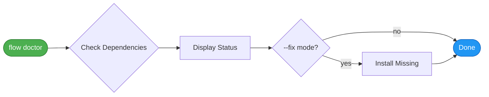

# `doctor` - Health Check & Dependency Manager

> **Comprehensive dependency checker with interactive installation and health diagnostics**

**Command:** `flow doctor [options]`
**Purpose:** Check installed dependencies and optionally fix issues
**Type:** Setup/Diagnostics
**Added:** v3.1.0 (2025-12-26)

---

## Synopsis

```bash
flow doctor                 # Check all dependencies
flow doctor --fix           # Interactive fix mode
flow doctor --fix --auto    # Auto-install everything
flow doctor --category <cat> # Check specific category
```

**Quick examples:**

```bash
# Check health
flow doctor

# Interactive install
flow doctor --fix

# Auto-install all missing
flow doctor --fix --auto

# Check only required dependencies
flow doctor --category required
```

---

## Quick Summary

The `doctor` command checks all flow-cli dependencies across multiple categories (required, recommended, optional, integrations, ZSH plugins). It can also interactively or automatically install missing tools using Homebrew, npm, or pip.

---

## Visual Flow

### Simple View



**In plain words:** Check → Report → (Optional) Fix

---

## Usage

```bash
# Check all dependencies
flow doctor

# Interactive fix mode (prompts before each install)
flow doctor --fix

# Auto-fix mode (install all without prompts)
flow doctor --fix -y

# AI-assisted troubleshooting (via Claude CLI)
flow doctor --ai

# Verbose output
flow doctor --verbose
```

---

## Options

| Option      | Short | Description                                |
| ----------- | ----- | ------------------------------------------ |
| `--fix`     | `-f`  | Enable fix mode (install missing tools)    |
| `--yes`     | `-y`  | Auto-confirm all installs (use with --fix) |
| `--ai`      | `-a`  | AI-assisted troubleshooting via Claude CLI |
| `--verbose` | `-v`  | Show additional diagnostic information     |
| `--help`    | `-h`  | Show help                                  |

---

## Dependency Categories

### Required (Core Functionality)

| Tool    | Purpose                                               |
| ------- | ----------------------------------------------------- |
| **fzf** | Fuzzy finder for `pick`, `dash -i`, interactive modes |

### Recommended (Enhanced Experience)

| Tool        | Purpose                           | Replaces  |
| ----------- | --------------------------------- | --------- |
| **eza**     | Modern ls with icons & git status | `ls`      |
| **bat**     | Syntax-highlighted file viewer    | `cat`     |
| **zoxide**  | Smart directory jumping           | `cd`, `z` |
| **fd**      | Fast file finder                  | `find`    |
| **ripgrep** | Fast text search                  | `grep`    |

### Optional (Nice to Have)

| Tool      | Purpose             | Replaces |
| --------- | ------------------- | -------- |
| **dust**  | Disk usage analyzer | `du`     |
| **duf**   | Disk free viewer    | `df`     |
| **btop**  | System monitor      | `top`    |
| **delta** | Better git diffs    | `diff`   |
| **gh**    | GitHub CLI          | -        |
| **jq**    | JSON processor      | -        |

### Integrations

| Tool       | Purpose                             | Install Via |
| ---------- | ----------------------------------- | ----------- |
| **atlas**  | Session tracking & state management | npm         |
| **radian** | Enhanced R console (if R installed) | pip         |

### ZSH Plugins (via antidote)

| Plugin                  | Purpose                 |
| ----------------------- | ----------------------- |
| **powerlevel10k**       | Modern ZSH prompt theme |
| **autosuggestions**     | Fish-like suggestions   |
| **syntax-highlighting** | Command syntax colors   |
| **completions**         | Extended completions    |

---

## Example Output

### Check Mode (Default)

```
╭─────────────────────────────────────────────╮
│  🩺 flow-cli Health Check                   │
╰─────────────────────────────────────────────╯

🐚 SHELL
  ✓ zsh          5.9
  ✓ git          2.43.0

⚡ REQUIRED (core functionality)
  ✓ fzf          0.46.0

✨ RECOMMENDED (enhanced experience)
  ✓ eza          0.18.0
  ✓ bat          0.24.0
  ✓ zoxide       0.9.2
  ✓ fd           9.0.0
  ✓ rg           14.1.0

📦 OPTIONAL (nice to have)
  ✓ dust         0.8.6
  ✓ duf          0.8.1
  ✓ btop         1.2.13
  ✓ delta        0.16.5
  ✓ gh           2.40.0
  ✓ jq           1.7

🔌 INTEGRATIONS
  ✓ atlas        1.2.0
  ✓ radian       0.6.7

🔧 ZSH PLUGINS (via antidote)
  ✓ powerlevel10k
  ✓ autosuggestions
  ✓ syntax-highlighting
  ✓ completions

🌊 FLOW-CLI
  ✓ Plugin loaded    v3.1.0
  ✓ Plugin directory ~/projects/dev-tools/flow-cli

────────────────────────────────────────────────
✅ All dependencies OK!
```

### With Missing Dependencies

```
⚡ REQUIRED (core functionality)
  ✗ fzf          NOT INSTALLED → brew install fzf

✨ RECOMMENDED (enhanced experience)
  ✓ eza          0.18.0
  ✗ bat          NOT INSTALLED → brew install bat
  ✓ zoxide       0.9.2
  ...

────────────────────────────────────────────────
⚠️  Some dependencies are missing

Quick fix options:
  flow doctor --fix       Interactive install (prompts each)
  flow doctor --fix -y    Auto-install all missing
  brew bundle --file=$FLOW_PLUGIN_DIR/setup/Brewfile
```

---

## Fix Mode

### Interactive Fix (`--fix`)

Prompts before each installation:

```bash
$ flow doctor --fix

Found 3 missing tools:
  1. fzf (required) - brew install fzf
  2. bat (recommended) - brew install bat
  3. dust (optional) - brew install dust

Install fzf? (y/N) y
⏳ Running: brew install fzf
✓ fzf installed successfully

Install bat? (y/N) y
⏳ Running: brew install bat
✓ bat installed successfully

Install dust? (y/N) n
⏸️  Skipped dust

────────────────────────────────────────────────
✅ Installed 2 tools, skipped 1
```

### Auto-Fix (`--fix -y`)

Installs all missing without prompts:

```bash
$ flow doctor --fix -y

Auto-installing 3 missing tools...

⏳ brew install fzf...
✓ fzf installed

⏳ brew install bat...
✓ bat installed

⏳ brew install dust...
✓ dust installed

────────────────────────────────────────────────
✅ Installed 3 tools
```

---

## AI Mode

Uses Claude CLI for intelligent troubleshooting:

```bash
$ flow doctor --ai

🤖 AI-Assisted Troubleshooting

Analyzing your environment...

Based on your flow-cli installation and missing dependencies,
here are my recommendations:

1. **fzf is required** - This is the core dependency for interactive
   project picking. Install with: brew install fzf

2. **Consider adding radian** - Since you have R installed, radian
   provides a much better console experience with syntax highlighting
   and multiline editing.

3. **Your ZSH plugins look good** - All recommended plugins are installed.

Would you like me to run the installation commands? (y/N)
```

---

## Quick Install All

For a complete setup, use the included Brewfile:

```bash
# Install all recommended tools at once
brew bundle --file=~/projects/dev-tools/flow-cli/setup/Brewfile

# Then verify
flow doctor
```

---

## Related Commands

| Command        | Purpose                    |
| -------------- | -------------------------- |
| `flow help`    | Show all flow-cli commands |
| `flow version` | Show flow-cli version      |
| `man flow`     | View man page              |

---

## Troubleshooting

### Issue: "brew not found"

**Cause:** Homebrew not installed

**Solution:**

```bash
/bin/bash -c "$(curl -fsSL https://raw.githubusercontent.com/Homebrew/install/HEAD/install.sh)"
```

### Issue: ZSH plugin shows as missing

**Cause:** Plugin not in antidote bundle

**Solution:**

```bash
# Add to ~/.config/zsh/.zsh_plugins.txt
echo "romkatv/powerlevel10k" >> ~/.config/zsh/.zsh_plugins.txt

# Rebuild antidote bundle
antidote bundle < ~/.config/zsh/.zsh_plugins.txt > ~/.config/zsh/.zsh_plugins.zsh
```

### Issue: npm packages fail to install

**Cause:** Global npm permissions issue

**Solution:**

```bash
# Use npx instead of global install for atlas
npx @data-wise/atlas --version

# Or fix npm permissions
npm config set prefix ~/.npm-global
export PATH=~/.npm-global/bin:$PATH
```

---

## Source Code

**File:** `commands/doctor.zsh`
**Dependencies:**

- `brew` command (Homebrew)
- `npm` command (optional, for atlas)
- `pip` command (optional, for radian)
- `claude` command (optional, for --ai mode)

**Key Functions:**

- `doctor()` - Main entry point
- `_doctor_check_cmd()` - Check individual command
- `_doctor_check_zsh_plugin()` - Check ZSH plugin
- `_doctor_install()` - Install missing tool
- `_doctor_help()` - Display help

---

## Design Philosophy

The `doctor` command follows these principles:

1. **Non-Destructive** - Check mode is read-only, fix mode requires explicit flag
2. **Categorized** - Clear distinction between required/recommended/optional
3. **Progressive** - Start with check, graduate to fix if needed
4. **Multi-Manager** - Supports Homebrew, npm, and pip package managers
5. **AI-Augmented** - Optional Claude integration for smart troubleshooting

---

## See Also

- [Setup Guide](../getting-started/quick-start.md) - First-time setup
- [Brewfile](https://github.com/Data-Wise/flow-cli/blob/main/setup/Brewfile) - All recommended tools
- [DISPATCHER-REFERENCE.md](../reference/MASTER-DISPATCHER-GUIDE.md) - Command reference

---

**Last Updated:** 2026-01-07
**Command Version:** v4.8.0 (doctor v1.0)
**Status:** ✅ Production ready with interactive install
