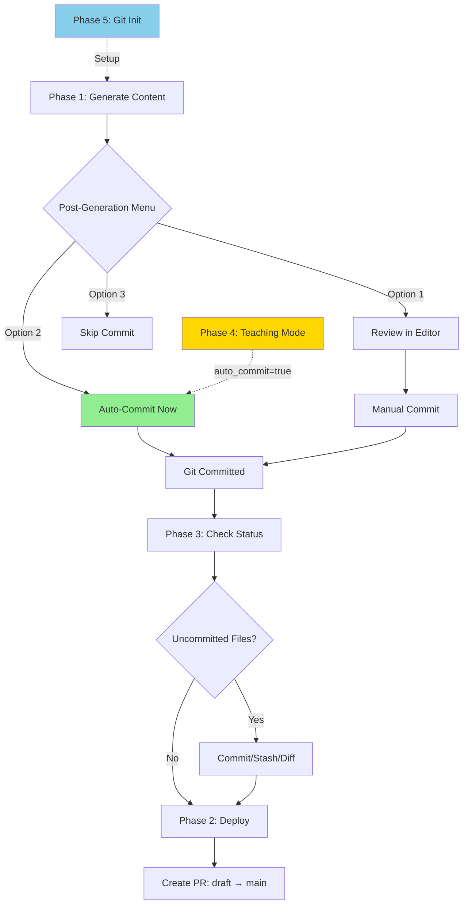
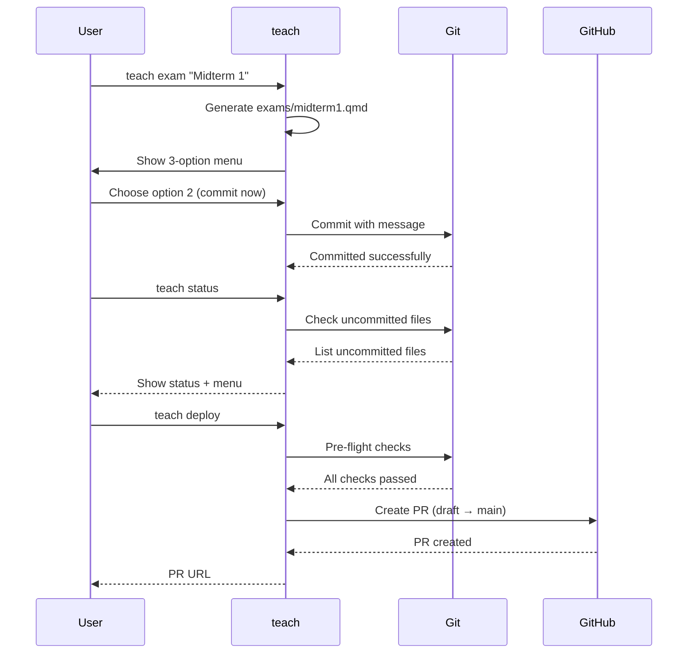

# teach - Teaching Workflow Dispatcher

Unified command interface for managing course websites and teaching workflows.

## Quick Start

```bash
# Initialize a new course
teach init "STAT 545"

# Non-interactive mode (accept defaults)
teach init -y "STAT 440"

# Check project status
teach status

# Deploy changes to production
teach deploy
```

---

## Git Workflow Overview (v5.12.0)

The teaching workflow integrates with Git across 5 phases:



**Key Integration Points:**

- **Phase 1**: Smart post-generation workflow (3-option menu)
- **Phase 2**: Deployment automation (PR creation)
- **Phase 3**: Git-aware status (uncommitted file tracking)
- **Phase 4**: Teaching mode (streamlined auto-commit)
- **Phase 5**: Repository initialization (complete git setup)

**Workflow Diagram:**



---

## Synopsis

```bash
teach <command> [args]
```

---

## Commands

| Command | Shortcut | Description |
|---------|----------|-------------|
| `init [name]` | `i` | Initialize teaching workflow (with git) |
| `exam [name]` | `e` | Create exam (with auto-commit) |
| `quiz [name]` | `q` | Create quiz (with auto-commit) |
| `slides [name]` | `sl` | Create slides (with auto-commit) |
| `lecture [name]` | `lec` | Create lecture notes (with auto-commit) |
| `assignment [name]` | `hw` | Create assignment (with auto-commit) |
| `deploy` | `d` | Deploy draft → production (creates PR) |
| `archive` | `a` | Archive semester |
| `config` | `c` | Edit teach-config.yml |
| `status` | `s` | Show project status + git changes |
| `week` | `w` | Show current week number |
| `doctor` | `doc` | Health checks with auto-fix |
| `analyze` | `concept` | Content analysis with AI insights (v5.16.0) |
| `migrate-config` | `mig` | Extract lesson plans from config (v5.20.0) |
| `templates` | `tmpl` | Manage content templates (v5.20.0) |
| `macros` | `m` | LaTeX macro management (v5.21.0) |
| `plan` | `pl` | Lesson plan CRUD management (v5.22.0) |
| `hooks` | `hk` | Git hook management |
| `dates` | `d8` | Date management |
| `validate` | `val` | Validate .qmd files |
| `profiles` | `pf` | Quarto profile management |
| `cache` | `c` | Cache operations |
| `clean` | `cl` | Delete build artifacts |
| `backup` | `bk` | Backup management |
| `--help` | `-h` | Show help |

---

## Examples

### Initialize a New Course

```bash
# Interactive mode (prompts for options, initializes git)
teach init "STAT 545"

# Non-interactive mode (uses safe defaults)
teach init -y "STAT 545"

# Skip git initialization (v5.12.0)
teach init --no-git "TEST 101"

# Preview migration plan without changes
teach init --dry-run "STAT 545"
```

### Daily Workflow with Git Integration (v5.12.0)

```bash
# Start working
work stat-545

# Check current week
teach week

# Create exam (auto-commit prompt)
teach exam "Midterm 1"
# ✓ Generated exams/midterm1.qmd
#
# 📝 Teaching content created
#
# What would you like to do?
#   1) Review in editor, then commit
#   2) Commit now with auto-generated message
#   3) Skip commit (do it manually later)
# Choice: 2
# ✓ Committed: teach: add exam for Midterm 1

# Check status (shows uncommitted files)
teach status
# Course: STAT 545 (Fall 2024)
# Week: 8 of 15
#
# 📝 Uncommitted Teaching Files:
#   • slides/week08.qmd

# Deploy when ready (creates PR)
teach deploy
# Pre-flight checks:
#   ✓ On draft branch
#   ✓ No uncommitted changes
#   ✓ No unpushed commits
#   ✓ No production conflicts
#
# Creating PR: draft → main
```

### Teaching Mode Workflow (v5.12.0)

```bash
# Enable teaching mode for streamlined auto-commit
teach config
# Edit workflow section:
#   teaching_mode: true
#   auto_commit: true
#   auto_push: false

# Now content auto-commits without prompts
teach exam "Midterm"
# ✓ Generated exams/midterm.qmd
# 🎓 Teaching Mode: Auto-committing...
# ✓ Committed: teach: add exam for Midterm

teach quiz "Chapter 5"
# ✓ Generated quizzes/quiz05.qmd
# 🎓 Teaching Mode: Auto-committing...
# ✓ Committed: teach: add quiz for Chapter 5

# Deploy all commits at once
teach deploy
```

### End of Semester

```bash
# Archive the semester
teach archive

# This creates a tagged snapshot and prepares for next semester
```

### Additional Commands

```bash
# Health checks with auto-fix
teach doctor --fix

# Install git hooks
teach hooks install

# Validate content
teach validate --render

# Manage cache
teach cache status
teach cache rebuild

# Backup management
teach backup create lectures/week-05
teach backup list
teach backup restore lectures.2026-01-20-1430
teach backup delete old-backup
teach backup archive spring-2026

# Quarto profiles
teach profiles list
teach profiles switch draft
```

### Content Creation Examples (v5.12.0)

```bash
# Create exam with Scholar
teach exam "Midterm 1"

# Create quiz
teach quiz "Chapter 5 Review"

# Create slides
teach slides "Introduction to Regression"

# Create lecture notes
teach lecture "Week 3 - Linear Models"

# Create assignment
teach assignment "Homework 1"

# All commands support --dry-run preview
teach exam "Topic" --dry-run --verbose
```

---

## Subcommand Details

### `teach init`

Initialize teaching workflow for a course repository. Creates:
- `.flow/teach-config.yml` - Course configuration
- `scripts/quick-deploy.sh` - Deployment script
- `scripts/semester-archive.sh` - Archive script
- Git repository (if not exists) - v5.12.0
- Branch structure (`draft` / `main`) - v5.12.0
- Teaching-specific `.gitignore` - v5.12.0

**Flags:**
- `-y`, `--yes` - Non-interactive mode (accept safe defaults)
- `--dry-run` - Preview migration plan without changes
- `--no-git` - Skip git initialization (v5.12.0)
- `-h`, `--help` - Show help

**Git Integration (v5.12.0):**
- Auto-initializes git repository for fresh projects
- Creates `draft` and `main` branches
- Copies teaching-specific `.gitignore` template
- Makes initial commit with conventional commits format
- Offers GitHub repo creation via `gh` CLI

**See:** [teach-init](teach-init.md) for full documentation.

### `teach deploy`

Deploy changes from `draft` branch to `main` branch. (v5.12.0: Creates GitHub PR)

```bash
teach deploy
# Pre-flight checks:
#   ✓ On draft branch
#   ✓ No uncommitted changes
#   ✓ No unpushed commits
#   ✓ No production conflicts
#
# Creating PR: draft → main
# → Auto-generated PR body with commit list
# → Deploy checklist included
```

**Pre-flight checks:**
- Verifies on `draft` branch
- Ensures no uncommitted changes
- Detects unpushed commits
- Checks for production branch conflicts

**Interactive rebase support:**
- Offers to rebase if production has new commits
- Prevents merge conflicts during deployment

### `teach archive`

Archive the current semester before starting a new one.

```bash
teach archive
# Runs ./scripts/semester-archive.sh
```

### `teach status`

Show teaching project status including:
- Course name and semester
- Current branch
- Safety warnings (if on production)
- **Uncommitted teaching files (v5.12.0)**
- **Interactive cleanup workflow (v5.12.0)**

```bash
teach status
# 📚 Teaching Project Status
# ━━━━━━━━━━━━━━━━━━━━━━━━━━
#   Course:   STAT 545
#   Semester: Spring 2026
#   Branch:   draft
#   ✓ Safe to edit (draft branch)
#
# 📝 Uncommitted Teaching Files:
#   • exams/exam02.qmd
#   • slides/week08.qmd
#
# What would you like to do?
#   1) Commit all teaching files
#   2) Stash changes
#   3) View diff
#   4) Skip
```

**Git Integration (v5.12.0):**
- Detects uncommitted teaching content (exams, slides, assignments, etc.)
- Filters non-teaching files (shows only relevant content)
- Interactive cleanup workflow:
  - Commit with auto-generated message
  - Stash with timestamp
  - View diff
  - Skip (manual handling)

### `teach week`

Show current week number based on semester start date.

```bash
teach week
# 📅 Week 8
#   Semester started: 2026-01-13
#   Days elapsed: 52
```

### `teach migrate-config` (v5.20.0)

Extract embedded lesson plans from `teach-config.yml` to separate `lesson-plans.yml`.

```bash
# Preview migration (no changes)
teach migrate-config --dry-run

# Run migration (creates backup)
teach migrate-config

# Skip confirmation prompt
teach migrate-config --force

# Don't create backup
teach migrate-config --no-backup
```

**Before Migration:**
```
.flow/
└── teach-config.yml    # 657 lines (course + 14 weeks embedded)
```

**After Migration:**
```
.flow/
├── teach-config.yml      # ~50 lines (course meta + reference)
├── teach-config.yml.bak  # Backup of original
└── lesson-plans.yml      # ~600 lines (all weeks extracted)
```

**Flags:**
- `--dry-run` - Preview changes without modifying files
- `--force` - Skip confirmation prompt
- `--no-backup` - Don't create `.bak` backup file
- `-h`, `--help` - Show help

**Rollback:**
```bash
cp .flow/teach-config.yml.bak .flow/teach-config.yml
rm .flow/lesson-plans.yml
```

### `teach templates` (v5.20.0)

Manage reusable content templates for lectures, labs, slides, and assignments.

```bash
# List all available templates
teach templates

# Filter by type
teach templates list --type content
teach templates list --source project

# Create content from template
teach templates new lecture week-05
teach templates new lab week-03 --topic "ANOVA"
teach templates new slides week-06 --dry-run

# Validate templates
teach templates validate
teach templates validate lecture.qmd

# Sync from plugin defaults
teach templates sync --dry-run
teach templates sync
teach templates sync --force
```

**Template types:**

| Type | Directory | Purpose |
|------|-----------|---------|
| `content` | `.flow/templates/content/` | .qmd starters (lecture, lab, slides) |
| `prompts` | `.flow/templates/prompts/` | AI generation prompts |
| `metadata` | `.flow/templates/metadata/` | _metadata.yml files |
| `checklists` | `.flow/templates/checklists/` | QA checklists |

**Variable substitution:**
Templates use `{{VARIABLE}}` syntax. Auto-filled from config:

- `{{WEEK}}` - Week number from CLI
- `{{TOPIC}}` - Topic from CLI or prompt
- `{{COURSE}}` - Course name from teach-config.yml
- `{{DATE}}` - Auto-generated current date
- `{{INSTRUCTOR}}` - Instructor from config
- `{{SEMESTER}}` - Semester from config

**Initialize with templates:**
```bash
teach init "STAT-545" --with-templates
```

**Resolution order:** Project templates override plugin defaults.

**See:** [Tutorial 24](../tutorials/24-template-management.md) for step-by-step guide.

### `teach macros` (v5.21.0)

Manage LaTeX macros for consistent AI-generated content notation.

```bash
# List all available macros
teach macros list
teach macros list --category operators
teach macros list --format json

# Sync macros from source files
teach macros sync
teach macros sync --verbose

# Export macros for Scholar integration
teach macros export
teach macros export --format mathjax
teach macros export --format json > macros.json

# Get help
teach macros help
```

**Primary purpose:** Ensure AI-generated content (via Scholar) uses correct notation like `\E{Y}` instead of `E[Y]`.

**Subcommands:**

| Subcommand | Description |
|------------|-------------|
| `list` | Display all macros with expansions |
| `sync` | Extract macros from source files |
| `export` | Export for Scholar AI integration |
| `help` | Show usage help |

**Source file formats supported:**

| Format | File Pattern | Example |
|--------|--------------|---------|
| QMD | `_macros.qmd` | Quarto shortcode includes |
| MathJax | `*.html` with MathJax config | HTML script tags |
| LaTeX | `*.tex` | Standard `\newcommand` |

**Macro categories:**

- **operators** - `\E`, `\Var`, `\Cov`, `\Corr`
- **distributions** - `\Normal`, `\Binomial`, `\Poisson`
- **symbols** - `\indep`, `\iid`, `\convp`, `\convd`
- **matrices** - `\bX`, `\bbeta`, `\bY`
- **derivatives** - `\dd`, `\pd`, `\grad`
- **probability** - `\Prob`, `\given`

**Configuration:**

Macros are configured in `.flow/teach-config.yml`:

```yaml
scholar:
  latex_macros:
    enabled: true
    sources:
      - path: "_macros.qmd"
        format: "qmd"
    auto_discover: true
    validation:
      warn_undefined: true
      warn_unused: true
      warn_conflicts: true
    export:
      format: "json"
      include_in_prompts: true
```

**Integration with Scholar:**

When `include_in_prompts: true`, macros are automatically included in AI context for content generation commands (`teach exam`, `teach quiz`, etc.).

**See:**
- [Tutorial 26: LaTeX Macros](../tutorials/26-latex-macros.md) for step-by-step guide
- [REFCARD-MACROS.md](../reference/REFCARD-MACROS.md) for quick reference

### `teach plan` (v5.22.0)

Manage lesson plan week entries in `.flow/lesson-plans.yml`.

```bash
# Create a new week (interactive prompts for missing fields)
teach plan create 3 --topic "Probability Foundations" --style rigorous

# Create with auto-populated topic from teach-config.yml
teach plan create 5

# List all weeks (table with gap detection)
teach plan list
teach plan list --json

# Show a single week's details
teach plan show 3
teach plan show 3 --json
teach plan 3                 # shortcut: bare number

# Edit in $EDITOR (jumps to correct line)
teach plan edit 3

# Delete with confirmation
teach plan delete 3
teach plan delete 3 --force  # skip confirmation

# Overwrite existing week
teach plan create 3 --topic "Updated Topic" --force
```

**Subcommands:**

| Subcommand | Description |
|------------|-------------|
| `create <week>` | Add week entry (interactive or with flags) |
| `list` | Show all weeks in table format |
| `show <week>` | Display formatted week details |
| `edit <week>` | Open `$EDITOR` at correct line |
| `delete <week>` | Remove week entry (with confirmation) |
| `help` | Show usage help |

**Options:**

| Option | Description |
|--------|-------------|
| `--topic, -t` | Topic name (prompted if not provided) |
| `--style, -s` | `conceptual`, `computational`, `rigorous`, `applied` |
| `--json, -j` | Machine-readable JSON output |
| `--force, -f` | Skip confirmation / overwrite existing |

**YAML schema:**

```yaml
# .flow/lesson-plans.yml
weeks:
  - number: 1
    topic: "Introduction to Statistics"
    style: "conceptual"
    objectives:
      - "Define descriptive statistics"
      - "Identify data types"
    subtopics:
      - "Measures of central tendency"
    key_concepts:
      - "descriptive-stats"
    prerequisites: []
```

**Features:**

- **Auto-populate** — pulls topic from `teach-config.yml` if available
- **Sorted insert** — weeks maintained in order by number
- **Gap detection** — `teach plan list` warns about missing weeks
- **YAML validation** — validates after edits, offers re-edit on failure
- **Integration** — created plans load via `teach slides --week N`, `teach lecture --week N`

**Workflow example:**

```bash
# After migrating config
teach migrate-config

# Add a new week not in the original config
teach plan create 16 --topic "Final Review" --style conceptual

# Review all plans
teach plan list

# Edit week 5 to add objectives
teach plan edit 5

# Generate slides using the plan
teach slides --week 5
```

**See:** [Tutorial 25](../tutorials/25-lesson-plan-migration.md) for migration + plan management workflow.

### `teach config`

Open the teaching configuration file in your editor.

```bash
teach config
# Opens .flow/teach-config.yml in $EDITOR

# View config without editing
teach config --view

# Print to stdout
teach config --cat
```

### Scholar Content Commands

Generate AI-powered teaching content using the Scholar plugin.

#### `teach lecture`

Generate lecture notes with comprehensive content.

```bash
teach lecture "Introduction to Regression"
teach lecture --week 5 --topic "Linear Models"
teach lecture "Hypothesis Testing" --style formal
```

**Flags:**
- `--week`, `-w` - Week number for organization
- `--topic`, `-t` - Topic override
- `--style` - Output style (formal/casual)
- `--template` - Template format (quarto/typst/markdown)
- `--dry-run` - Preview without generating

#### `teach slides`

Generate presentation slides.

```bash
teach slides "ANOVA Overview"
teach slides --week 8 --optimize   # With slide break optimization
teach slides "Regression" --template revealjs
```

**Flags:**
- `--week`, `-w` - Week number
- `--optimize` - Run slide optimizer for break suggestions
- `--template` - Slide format (revealjs/beamer/pptx)

#### `teach exam`

Generate exams with customizable question types.

```bash
teach exam "Midterm 1"
teach exam "Final" --topics "regression,anova,hypothesis-testing"
teach exam "Quiz 5" --duration 30 --points 50
```

**Flags:**
- `--topics` - Comma-separated topic list
- `--duration` - Exam duration in minutes
- `--points` - Total points
- `--question-types` - Types (multiple-choice/short-answer/problem)

#### `teach quiz`

Generate quick quizzes.

```bash
teach quiz "Chapter 5"
teach quiz --week 3 --questions 10
```

#### `teach assignment`

Generate homework assignments.

```bash
teach assignment "Homework 3"
teach assignment "Lab 5" --due "2026-02-15"
```

#### `teach syllabus`

Generate course syllabus.

```bash
teach syllabus
teach syllabus --template formal
```

#### `teach rubric`

Generate grading rubrics.

```bash
teach rubric "Final Project"
teach rubric "Presentation" --criteria "content,delivery,visuals"
```

#### `teach feedback`

Generate student feedback templates.

```bash
teach feedback "Assignment 3"
```

### `teach doctor`

Comprehensive health check for teaching projects.

```bash
teach doctor              # Full health check
teach doctor --fix        # Interactive fix mode
teach doctor --json       # JSON output for automation
teach doctor --quiet      # Minimal output
```

**Check categories:**
- Dependencies (yq, git, quarto, gh, claude, examark)
- Configuration validation
- Git status and branch setup
- Scholar integration
- Hook installation
- Cache health
- **Macro health** (v5.21.0) - Source files, cache sync, usage

### `teach validate`

Validate .qmd files for syntax and content issues.

```bash
teach validate                    # Validate all files
teach validate lectures/week-05.qmd  # Single file
teach validate --yaml             # YAML frontmatter only
teach validate --syntax           # YAML + syntax checking
teach validate --render           # Full render validation
teach validate --watch            # Continuous watch mode
teach validate --concepts         # Concept graph validation
teach validate --macros           # LaTeX macro validation
```

**Validation layers:**
1. YAML frontmatter validation
2. Syntax checking (typos, delimiters)
3. Full render via `quarto render`
4. Empty chunk detection
5. Image reference checking

### `teach analyze`

Analyze course content for concepts, prerequisites, and AI insights.

```bash
teach analyze lectures/week-05.qmd      # Single file analysis
teach analyze --batch lectures/         # Batch directory
teach analyze --slide-breaks week-05.qmd  # Slide optimization
teach analyze --ai                       # Include AI analysis
teach analyze --report markdown          # Generate report
```

**Analysis features:**
- Concept extraction from frontmatter
- Prerequisite validation (DAG ordering)
- Bloom's taxonomy classification
- Cognitive load estimation
- Teaching time estimates
- Slide break suggestions

### `teach hooks`

Manage git hooks for teaching workflow.

```bash
teach hooks install     # Install teaching hooks
teach hooks status      # Check hook status
teach hooks upgrade     # Upgrade to latest
teach hooks uninstall   # Remove hooks
```

**Installed hooks:**
- `pre-commit` - Validation before commit
- `pre-push` - Production branch protection
- `prepare-commit-msg` - Message formatting

### `teach dates`

Manage semester dates and scheduling.

```bash
teach dates             # Show current date info
teach dates --calendar  # Show semester calendar
teach dates week 8      # What date is week 8?
```

### `teach profiles`

Manage Quarto rendering profiles.

```bash
teach profiles list           # Show available profiles
teach profiles show draft     # Display profile config
teach profiles set production # Activate profile
teach profiles create slides  # Create new profile
```

**Built-in profiles:** default, draft, production, slides, print

### `teach cache`

Manage Quarto freeze cache.

```bash
teach cache status              # Show cache stats
teach cache clear               # Clear all cache
teach cache clear --lectures    # Clear only lectures
teach cache clear --old 7       # Clear older than 7 days
teach cache analyze             # Detailed diagnostics
teach cache rebuild             # Clear and regenerate
```

### `teach clean`

Delete build artifacts.

```bash
teach clean              # Interactive cleanup
teach clean --all        # Remove all artifacts
teach clean --output     # Remove _output only
teach clean --freeze     # Remove _freeze only
```

### `teach backup`

Manage content backups.

```bash
teach backup create lectures/week-05  # Create backup
teach backup list                      # List all backups
teach backup restore week-05.2026-01-20  # Restore backup
teach backup delete old-backup         # Delete backup
teach backup archive spring-2026       # Archive semester
```

**Retention policies:**
- Daily backups: 7 days
- Weekly backups: 4 weeks
- Semester archives: Indefinite

---

## Configuration

Teaching projects use `.flow/teach-config.yml`:

```yaml
course:
  name: STAT 545
  code: stat-545
  semester: Spring 2026

semester:
  start_date: 2026-01-13
  end_date: 2026-05-08

# Git configuration (v5.12.0)
git:
  draft_branch: draft           # Development branch
  production_branch: main       # Deployment branch
  auto_pr: true                 # Auto-create PRs
  require_clean: true           # Block deploy if uncommitted changes

# Workflow configuration (v5.12.0)
workflow:
  teaching_mode: false          # Streamlined auto-commit workflow
  auto_commit: false            # Auto-commit after content generation
  auto_push: false              # Auto-push commits (safety: false)
```

**Git Settings (v5.12.0):**
- `draft_branch` - Branch for development work (default: "draft")
- `production_branch` - Branch for deployed content (default: "main")
- `auto_pr` - Auto-create PRs during deployment (default: true)
- `require_clean` - Block deploy if uncommitted changes (default: true)

**Workflow Settings (v5.12.0):**
- `teaching_mode` - Enable streamlined auto-commit workflow (default: false)
- `auto_commit` - Auto-commit after content generation (default: false)
- `auto_push` - Auto-push commits to remote (default: false - safety)

All settings are backward compatible and default to false for safety.

---

## Related Commands

| Command | Purpose |
|---------|---------|
| [teach-init](teach-init.md) | Full initialization docs |
| [work](work.md) | Start work session |
| [finish](finish.md) | End work session |

---

## See Also

- [Teaching Workflow Guide](../guides/TEACHING-WORKFLOW.md)
- [Teaching Reference Card](../reference/.archive/REFCARD-TEACHING.md)
- [TEACH Dispatcher Reference](../reference/MASTER-DISPATCHER-GUIDE.md#teach-dispatcher)
