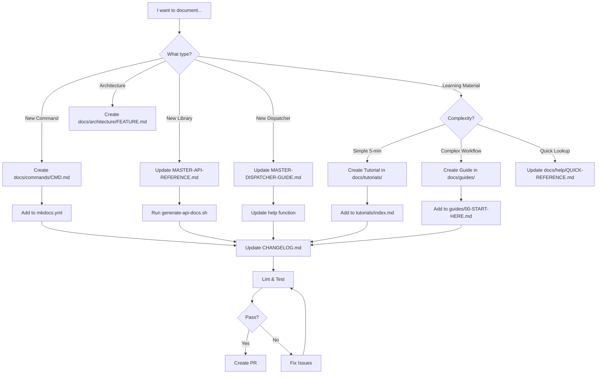

# Documentation Meta-Guide

**Purpose:** Comprehensive guide to flow-cli's documentation structure, standards, creation workflows, and maintenance processes.

**Audience:** Contributors, maintainers, and future documentation authors

**Last Updated:** 2026-01-24

---

## Table of Contents

- [Documentation Philosophy](#documentation-philosophy)
- [Documentation Structure](#documentation-structure)
- [Documentation Types](#documentation-types)
- [Creation Workflows](#creation-workflows)
- [Update Workflows](#update-workflows)
- [Standards and Conventions](#standards-and-conventions)
- [Quality Assurance](#quality-assurance)
- [Maintenance Processes](#maintenance-processes)

---

## Documentation Philosophy

### Core Principles

1. **ADHD-Friendly First**
   - Progressive disclosure (basics → advanced)
   - Visual hierarchy (headings, bullets, tables)
   - Quick wins highlighted
   - Concrete examples over theory

2. **Single Source of Truth**
   - No duplicate content across files
   - Cross-reference instead of copying
   - Master documents consolidate scattered info

3. **Learning Path Architecture**
   - Beginner → Intermediate → Advanced
   - Clear entry points for each level
   - Tutorials build on each other

4. **Discoverable & Searchable**
   - Clear navigation structure
   - Table of contents in long docs
   - Consistent naming conventions
   - Rich metadata (keywords, descriptions)

5. **Maintainable**
   - Automation where possible
   - Linting enforces consistency
   - Clear ownership and review process
   - Regular audits for staleness

---

## Documentation Structure

### Directory Layout

```
flow-cli/
├── docs/                           # MkDocs documentation site
│   ├── help/                       # User-facing help (NEW - consolidated)
│   │   ├── 00-START-HERE.md       # Main entry point
│   │   ├── QUICK-REFERENCE.md     # Single-page command reference
│   │   ├── WORKFLOWS.md           # Common workflow patterns
│   │   └── TROUBLESHOOTING.md     # Common issues & solutions
│   │
│   ├── getting-started/           # Onboarding documentation
│   │   ├── choose-your-path.md    # Learning path selector
│   │   ├── quick-start.md         # 5-minute tutorial
│   │   ├── installation.md        # Installation guide
│   │   ├── faq.md                 # General FAQ
│   │   ├── faq-dependencies.md    # Dependency FAQ
│   │   └── troubleshooting.md     # Troubleshooting guide
│   │
│   ├── tutorials/                 # Step-by-step tutorials (25+)
│   │   ├── index.md               # Tutorial overview & learning path
│   │   ├── 01-first-session.md    # Beginner tutorials
│   │   ├── ...                    #
│   │   ├── 24-git-workflow.md     # Plugin tutorials (NEW)
│   │   ├── ...                    #
│   │   └── scholar-enhancement/   # Teaching-specific tutorials
│   │
│   ├── guides/                    # Topic-focused guides
│   │   ├── 00-START-HERE.md       # Guide index
│   │   ├── ZSH-PLUGIN-ECOSYSTEM-GUIDE.md  # Plugin guide
│   │   ├── TEACHING-WORKFLOW-V3-GUIDE.md  # Teaching guide
│   │   ├── DOPAMINE-FEATURES-GUIDE.md     # ADHD features
│   │   └── ...                    # Feature-specific guides
│   │
│   ├── reference/                 # Technical reference (consolidated)
│   │   ├── MASTER-DISPATCHER-GUIDE.md    # All 12 dispatchers
│   │   ├── MASTER-API-REFERENCE.md       # Complete API docs
│   │   ├── MASTER-ARCHITECTURE.md        # System architecture
│   │   └── .archive/                     # Old consolidated docs
│   │
│   ├── commands/                  # Command documentation
│   │   ├── flow.md                # Core commands
│   │   ├── work.md                #
│   │   └── ...                    #
│   │
│   ├── contributing/              # Contributor guides
│   │   ├── CONTRIBUTING.md        # Contribution guidelines
│   │   ├── BRANCH-WORKFLOW.md     # Git workflow
│   │   ├── DOCUMENTATION-STYLE-GUIDE.md   # Writing standards
│   │   └── DOCUMENTATION-META-GUIDE.md    # This file
│   │
│   ├── architecture/              # Architecture documentation
│   │   └── DOCTOR-TOKEN-ARCHITECTURE.md   # Feature architectures
│   │
│   ├── diagrams/                  # Mermaid diagrams
│   │   ├── ARCHITECTURE-DIAGRAMS.md
│   │   ├── LIBRARY-ARCHITECTURE.md
│   │   └── TEACHING-V3-WORKFLOWS.md
│   │
│   ├── conventions/               # Documentation conventions
│   │   └── adhd/                  # ADHD-friendly design
│   │       ├── README.md          # Documentation templates
│   │       └── GIF-GUIDELINES.md  # GIF creation guide
│   │
│   └── planning/                  # Planning documents
│       └── ...                    # Feature planning specs
│
├── zsh/help/                      # DEPRECATED - moved to docs/help/
│   └── [Legacy help files]        # Will be deleted after migration
│
├── .markdownlint.yaml             # Markdown linting config
├── mkdocs.yml                     # MkDocs site configuration
├── scripts/
│   └── lint-docs.sh               # Markdown linting script
│
├── README.md                      # Project README (user entry point)
├── CLAUDE.md                      # Claude Code instructions
├── CONVENTIONS.md                 # Code conventions
├── PHILOSOPHY.md                  # Design philosophy
└── CHANGELOG.md                   # Version history
```

### Navigation Hierarchy

**MkDocs Navigation (mkdocs.yml):**

```yaml
nav:
  - Home: index.md
  - 📚 Documentation Hub: DOC-INDEX.md
  - Help:  # User-facing help (NEW)
      - 🎯 Start Here: help/00-START-HERE.md
      - ⚡ Quick Reference: help/QUICK-REFERENCE.md
      - 📋 Common Workflows: help/WORKFLOWS.md
      - 🔧 Troubleshooting: help/TROUBLESHOOTING.md
  - Getting Started:  # Onboarding
      - 🎯 Choose Your Path: getting-started/choose-your-path.md
      - ⚡ Quick Start (5-min): getting-started/quick-start.md
      - 📦 Installation: getting-started/installation.md
      - ❓ FAQ: getting-started/faq.md
      - 🔄 Troubleshooting: getting-started/troubleshooting.md
  - Tutorials:  # Learning by doing
      - Overview & Learning Path: tutorials/index.md
      - 1-23: [Existing tutorials]
      - 24-31: [Plugin tutorials - NEW]
      - Scholar Enhancement: tutorials/scholar-enhancement/index.md
  - Workflows:  # Common patterns
      - Quick Wins: guides/WORKFLOWS-QUICK-WINS.md
      - Teaching Workflow v3.0: guides/TEACHING-WORKFLOW-V3-GUIDE.md
      - Git Feature Flow: tutorials/08-git-feature-workflow.md
  - Guides:  # Topic-focused
      - Start Here: guides/00-START-HERE.md
      - ZSH Plugin Ecosystem: guides/ZSH-PLUGIN-ECOSYSTEM-GUIDE.md
      - Dopamine Features: guides/DOPAMINE-FEATURES-GUIDE.md
  - Reference:  # Technical deep-dive
      - 🎛️ Master Dispatcher Guide: reference/MASTER-DISPATCHER-GUIDE.md
      - 📚 Master API Reference: reference/MASTER-API-REFERENCE.md
      - 🏗️ Master Architecture: reference/MASTER-ARCHITECTURE.md
  - Commands:  # Command documentation
      - flow: commands/flow.md
      - work: commands/work.md
      - [...]
  - Development:  # Contributor guides
      - 🛠️ Developer Guide: guides/DEVELOPER-GUIDE.md
      - Contributing: contributing/CONTRIBUTING.md
      - Branch Workflow: contributing/BRANCH-WORKFLOW.md
      - Documentation Style Guide: contributing/DOCUMENTATION-STYLE-GUIDE.md
      - Documentation Meta-Guide: contributing/DOCUMENTATION-META-GUIDE.md
```

---

## Documentation Types

### 1. Help Files (`docs/help/`)

**Purpose:** Quick-access user help for immediate needs

**Characteristics:**
- Concise, scannable format
- 1-2 sentence per command/concept
- Minimal examples
- Cross-references to deeper docs
- Optimized for searching (Cmd+F)

**Files:**
- `00-START-HERE.md` - Main entry point, learning paths
- `QUICK-REFERENCE.md` - Single-page command cheatsheet
- `WORKFLOWS.md` - Common workflow patterns
- `TROUBLESHOOTING.md` - Common issues & solutions

**Target Length:** 400-1,000 lines per file

---

### 2. Getting Started (`docs/getting-started/`)

**Purpose:** Onboarding new users (0 → productive in 5-30 minutes)

**Characteristics:**
- Assumes ZERO prior knowledge
- Step-by-step instructions
- Screenshots/GIFs for visual learners
- Installation, first commands, troubleshooting
- Links to next steps (tutorials)

**Files:**
- `choose-your-path.md` - Learning path selector
- `quick-start.md` - 5-minute hands-on tutorial
- `installation.md` - Installation methods
- `faq.md` - Frequently asked questions
- `faq-dependencies.md` - Dependency questions
- `troubleshooting.md` - Common issues

**Target Length:** 200-500 lines per file

---

### 3. Tutorials (`docs/tutorials/`)

**Purpose:** Learning by doing (hands-on, step-by-step)

**Characteristics:**
- Progressive difficulty (1 → 23+)
- Builds on previous tutorials
- Concrete examples with real outputs
- "Try it yourself" sections
- ADHD-friendly (quick wins, clear milestones)
- Each tutorial = 5-15 minutes

**Structure:**

```markdown
# Tutorial X: [Topic]

**Time:** 5-10 minutes
**Difficulty:** Beginner/Intermediate/Advanced
**Prerequisites:** Tutorial Y, Z
**You'll Learn:**
- Skill 1
- Skill 2

## Overview
[1-2 paragraph summary]

## Step 1: [Action]
[Instructions]
```bash
# Command
```

**Expected output:**

```
[Output]
```

## Step 2: [Action]

...

## What You Learned

- Recap of skills gained

## Next Steps

- Tutorial X+1
- Related guide

```

**Naming Convention:**
- `01-first-session.md` (numbered, sequential)
- `24-git-workflow.md` (plugin tutorials start at 24)
- `scholar-enhancement/01-getting-started.md` (sub-series)

**Target Length:** 200-800 lines per tutorial

---

### 4. Guides (`docs/guides/`)

**Purpose:** Topic-focused deep dives (comprehensive coverage)

**Characteristics:**
- Single topic (e.g., Teaching Workflow, Plugins, ADHD Features)
- Complete coverage (beginner → advanced)
- Multiple workflows/use cases
- Troubleshooting section
- Cross-references to tutorials/reference

**Structure:**
```markdown
# [Topic] Guide

## Overview
[What this guide covers]

## Quick Start
[Fastest path to value]

## Core Concepts
[Essential understanding]

## Common Workflows
### Workflow 1: [Name]
[Step-by-step]

### Workflow 2: [Name]
...

## Advanced Usage
[Power user features]

## Troubleshooting
[Common issues]

## Related Documentation
- Tutorial X
- Reference Y
```

**Naming Convention:**
- `TEACHING-WORKFLOW-V3-GUIDE.md` (versioned)
- `ZSH-PLUGIN-ECOSYSTEM-GUIDE.md` (descriptive)
- `DOPAMINE-FEATURES-GUIDE.md`

**Target Length:** 800-2,000 lines per guide

---

### 5. Reference Documentation (`docs/reference/`)

**Purpose:** Complete technical reference (API, architecture, commands)

**Characteristics:**
- Exhaustive, not tutorial
- Searchable, scannable
- API signatures, parameters, return values
- Architecture diagrams
- Organized by topic/component
- Progressive disclosure (collapsible sections)

**Master Documents (NEW):**
- `MASTER-DISPATCHER-GUIDE.md` (3,000-4,000 lines)
  - All 12 dispatchers
  - Beginner → Advanced sections
  - Examples, workflows, plugins

- `MASTER-API-REFERENCE.md` (5,000-7,000 lines)
  - All library functions
  - Parameters, return values, examples
  - Organized by library (core, teaching, integration)

- `MASTER-ARCHITECTURE.md` (2,000-3,000 lines)
  - System architecture
  - Design patterns
  - Data flow diagrams
  - Performance optimization

**Standalone References (kept separate):**
- Command-specific: `PICK-COMMAND-REFERENCE.md`
- Deep-dive architecture: `TEACH-ANALYZE-ARCHITECTURE.md`
- Schemas: `TEACH-CONFIG-DATES-SCHEMA.md`

**Target Length:** 2,000-7,000 lines for master docs

---

### 6. Command Documentation (`docs/commands/`)

**Purpose:** Individual command documentation

**Characteristics:**
- One file per command
- Usage, options, examples
- Generated from help text when possible
- Cross-references to guides/tutorials

**Structure:**

```markdown
# `command` - [One-line description]

## Synopsis
`command [OPTIONS] [ARGS]`

## Description
[Full description]

## Options
- `-f, --flag` - Description
- `-o, --option VALUE` - Description

## Examples
### Example 1: [Use case]
```bash
command --option value
```

### Example 2: [Use case]

...

## See Also

- Related command
- Tutorial X
- Guide Y

```

**Target Length:** 100-400 lines per command

---

### 7. Contributor Documentation (`docs/contributing/`)

**Purpose:** Guidelines for contributing code/docs

**Characteristics:**
- Process-focused (how to contribute)
- Standards, conventions, workflows
- Code examples, templates
- Review checklists

**Files:**
- `CONTRIBUTING.md` - General contribution guidelines
- `BRANCH-WORKFLOW.md` - Git workflow (feature → dev → main)
- `DOCUMENTATION-STYLE-GUIDE.md` - Writing standards
- `DOCUMENTATION-META-GUIDE.md` - This file
- `PR-WORKFLOW-GUIDE.md` - Pull request process

**Target Length:** 400-2,000 lines per file

---

### 8. Architecture Documentation (`docs/architecture/`)

**Purpose:** Design decisions and architecture for major features

**Characteristics:**
- ADR (Architecture Decision Record) format
- Context, decision, consequences
- Mermaid diagrams
- Trade-off analysis

**Structure:**
```markdown
# [Feature] Architecture

## Context
[Background, problem statement]

## Decision
[What was decided]

## Consequences
### Positive
- Benefit 1
- Benefit 2

### Negative
- Drawback 1
- Drawback 2

## Alternatives Considered
### Alternative 1: [Name]
[Description, why rejected]

## Architecture

```mermaid
[Diagram]
```

## Implementation

[High-level implementation notes]

```

**Target Length:** 500-2,000 lines per feature

---

## Creation Workflows { #creation-workflows }

### Workflow 1: Adding a New Feature

**Trigger:** Feature development starts (during planning phase)

**Process:**

1. **During Planning (on `dev` branch)**

   a. Create feature specification:
   ```bash
   # Create spec in planning directory
   touch docs/planning/SPEC-feature-name.md
   ```

   **Template:** Use `docs/planning/SPEC-TEMPLATE.md`

   **Contents:**
- Overview
- User stories
- Implementation plan
- Documentation impact (NEW)

   b. Identify documentation needs:
- [ ] New command → Create `docs/commands/feature.md`
- [ ] New dispatcher → Update `MASTER-DISPATCHER-GUIDE.md`
- [ ] New library functions → Update `MASTER-API-REFERENCE.md`
- [ ] User-facing feature → Create tutorial
- [ ] Complex workflow → Create guide
- [ ] Architecture decision → Create architecture doc

   c. Add to documentation plan in spec:

   ```markdown
   ## Documentation Plan

   ### New Documentation
   - [ ] Tutorial 26: Feature Name (`docs/tutorials/26-feature-name.md`)
   - [ ] Guide: Feature Workflow (`docs/guides/FEATURE-WORKFLOW.md`)
   - [ ] Command Reference: `feature` (`docs/commands/feature.md`)

   ### Updates to Existing
   - [ ] Update `MASTER-DISPATCHER-GUIDE.md` - Add `f` dispatcher section
   - [ ] Update `MASTER-API-REFERENCE.md` - Add `lib/feature.zsh` functions
   - [ ] Update `help/QUICK-REFERENCE.md` - Add feature commands
   ```

1. **During Implementation (in worktree)**

   a. Create documentation alongside code:

   ```bash
   # In feature branch worktree
   cd ~/.git-worktrees/flow-cli/feature-name

   # Create docs
   touch docs/tutorials/26-feature-name.md
   touch docs/commands/feature.md
   ```

   b. Write documentation AS you code:
   - Write command doc → Write command implementation
   - Write API reference → Write library function
   - Write tutorial → Test feature manually

   **Benefit:** Documentation catches UX issues early

2. **Before PR**

   a. Run documentation checks:

   ```bash
   # Lint markdown
   ./scripts/lint-docs.sh --fix

   # Build docs locally
   mkdocs build

   # Test navigation
   mkdocs serve
   ```

   b. Update cross-references:
   - Add feature to `help/00-START-HERE.md` (if user-facing)
   - Update `help/QUICK-REFERENCE.md` (add commands)
   - Link tutorial from `tutorials/index.md`
   - Update `CHANGELOG.md`

   c. Create PR with documentation:

   ```bash
   gh pr create --base dev --fill
   ```

   **PR Description Template:**

   ```markdown
   ## Feature: [Name]

   ### Code Changes
   - Added `lib/feature.zsh`
   - Added `commands/feature.zsh`

   ### Documentation Changes
   - Created Tutorial 26: Feature Name
   - Updated MASTER-DISPATCHER-GUIDE.md (f dispatcher)
   - Updated QUICK-REFERENCE.md
   - Updated CHANGELOG.md

   ### Testing
   - [ ] Manual testing completed
   - [ ] Tests added/updated
   - [ ] Documentation builds successfully
   - [ ] Links verified
   ```

---

### Workflow 2: Updating Existing Feature

**Trigger:** Feature enhancement or bug fix

**Process:**

1. **Identify documentation impact**

   Ask:
   - [ ] Did command options change? → Update command doc
   - [ ] Did API change? → Update API reference
   - [ ] Did behavior change? → Update tutorial/guide
   - [ ] Did workflow change? → Update workflow guide
   - [ ] New use case? → Add example to guide

2. **Update affected documents**

   ```bash
   # Find affected docs
   grep -r "old_command_name" docs/

   # Update each file
   # - Change command syntax
   # - Update examples
   # - Update screenshots/GIFs if needed
   # - Update version numbers
   ```

3. **Add changelog entry**

   ```markdown
   ## v5.X.0 (Unreleased)

   ### Changed
   - `feature` command now accepts `--new-flag`

   ### Documentation
   - Updated Tutorial 26 with new flag examples
   - Updated QUICK-REFERENCE.md
   ```

4. **Verify links still work**

   ```bash
   # Check for broken links
   markdown-link-check docs/**/*.md

   # Build and test
   mkdocs serve
   ```

---

### Workflow 3: Creating a Tutorial

**Trigger:** New user-facing feature or workflow

**Process:**

1. **Plan the tutorial**

   a. Define learning objectives:
   - What will users be able to DO after this tutorial?
   - What prerequisite knowledge is required?
   - What's the simplest path to demonstrate value?

   b. Outline the tutorial:

   ```markdown
   # Tutorial X: [Topic]

   ## Outline
   1. Overview (30 seconds)
   2. Setup (1 minute)
   3. Basic usage (2 minutes)
   4. Common workflow (3 minutes)
   5. Next steps (30 seconds)

   Total: 5-7 minutes
   ```

2. **Write the tutorial**

   a. Use tutorial template:

   ```bash
   cp docs/conventions/adhd/TUTORIAL-TEMPLATE.md \
      docs/tutorials/26-feature-name.md
   ```

   b. Fill in sections:
   - Overview (what they'll learn)
   - Prerequisites (links to earlier tutorials)
   - Step-by-step instructions
   - Expected outputs (show what success looks like)
   - Troubleshooting (common issues)
   - What you learned (recap)
   - Next steps (link to next tutorial/guide)

   c. Test every command:
   - Copy each command block
   - Run it in a clean shell
   - Verify output matches documentation
   - Screenshot/GIF if visual

3. **Add visual aids**

   a. Create GIFs for complex workflows:

   ```bash
   # Record terminal session
   # See docs/conventions/adhd/GIF-GUIDELINES.md
   ```

   b. Add to tutorial:

   ```markdown
   
   ```

4. **Link from tutorial index**

   ```markdown
   # tutorials/index.md

   ## Intermediate Tutorials
   - Tutorial 26: [Feature Name](26-feature-name.md)
   ```

5. **Test tutorial with fresh user**

   - Have someone unfamiliar with feature follow tutorial
   - Note where they get stuck
   - Revise unclear sections
   - Add clarifications

---

### Workflow 4: Updating Standards

**Trigger:** New convention adopted or best practice discovered

**Process:**

1. **Document the standard**

   a. Identify which standard document:
   - Code conventions → `CONVENTIONS.md`
   - Documentation style → `contributing/DOCUMENTATION-STYLE-GUIDE.md`
   - Git workflow → `contributing/BRANCH-WORKFLOW.md`
   - Testing standards → `guides/TESTING.md`

   b. Add standard with rationale:

   ```markdown
   ## New Standard: [Name]

   ### Rationale
   [Why this matters]

   ### Rule
   [What to do]

   ### Examples
   ✅ **Good:**
   ```zsh
   # Good example
   ```

   ❌ **Bad:**

   ```zsh
   # Bad example
   ```

   ```

2. **Update affected documentation**

   a. Find documentation that violates new standard:

   ```bash
   grep -r "old_pattern" docs/
   ```

   b. Update each file to conform

   c. Add linting rule (if applicable):

   ```yaml
   # .markdownlint.yaml
   MD999:  # Custom rule
     enabled: true
     pattern: "bad_pattern"
     message: "Use new_pattern instead (see CONVENTIONS.md)"
   ```

3. **Communicate change**

   a. Add to `CHANGELOG.md`:

   ```markdown
   ## v5.X.0 (Unreleased)

   ### Changed
   - Documentation standard: [Standard Name] (see CONVENTIONS.md)
   ```

   b. Notify contributors:
   - Update `CONTRIBUTING.md` with new standard
   - Add note to PR template
   - Mention in next release notes

---

### Workflow 5: Creating a Guide

**Trigger:** Feature/workflow complex enough to need comprehensive coverage

**Process:**

1. **Determine scope**

   Ask:
   - Is this too narrow for a guide? → Use tutorial instead
   - Is this too broad? → Split into multiple guides
   - Does this replace/consolidate existing docs? → Note for archival

   Example:
   - ✅ "Teaching Workflow" - Good scope (single feature, multiple workflows)
   - ❌ "Everything about flow-cli" - Too broad (use tutorials/reference)
   - ❌ "How to use `work` command" - Too narrow (use tutorial or command doc)

2. **Create guide structure**

   ```bash
   cp docs/conventions/adhd/GUIDE-TEMPLATE.md \
      docs/guides/FEATURE-WORKFLOW-GUIDE.md
   ```

   **Template sections:**
   - Overview
   - Quick Start (fastest path to value)
   - Core Concepts
   - Common Workflows
   - Advanced Usage
   - Troubleshooting
   - Related Documentation

3. **Write for progressive disclosure**

   ```markdown
   ## Quick Start
   [Simplest possible example]

   ## Common Workflows
   ### Beginner: [Workflow name]
   [Step-by-step for new users]

   ### Intermediate: [Workflow name]
   [More complex workflow]

   <details>
   <summary>Advanced: [Workflow name] (Click to expand)</summary>
   [Power user workflow]
   </details>
   ```

4. **Add diagrams**

   ```markdown
   ## Architecture

   ```mermaid
   graph TD
       A[User] --> B[Feature]
       B --> C[Library]
       C --> D[Storage]
   ```

   ```

5. **Link from multiple places**

   - `guides/00-START-HERE.md` (guide index)
   - Relevant tutorials (as "next steps")
   - `help/00-START-HERE.md` (if user-facing)
   - Command docs (as "see also")

---

<a id="update-workflows"></a>

## Update Workflows

### When to Update Documentation

**Triggers:**

1. **Code Changes**
   - New feature added → Create tutorial + update reference
   - Feature modified → Update affected docs
   - Bug fixed → Update troubleshooting if user-facing
   - API changed → Update API reference
   - Command syntax changed → Update command doc + quick reference

2. **User Feedback**
   - Confusion reported → Clarify documentation
   - Missing use case → Add example
   - Error in docs → Fix immediately
   - Workflow not documented → Create guide/tutorial

3. **Regular Maintenance**
   - Version release → Update changelog, version numbers
   - Quarterly review → Check for stale content
   - New best practice → Update standards
   - Link rot → Fix broken links

---

### Feature Documentation Update Checklist

**Purpose:** Comprehensive checklist for updating documentation when code changes

#### When Adding a New Feature

Use this checklist when adding new functionality to flow-cli:

**1. Core Documentation (Required)**

- [ ] **Command Documentation** (`docs/commands/`)
  - Create `docs/commands/<command>.md` if new command
  - Include synopsis, description, options, examples
  - Test all examples before committing

- [ ] **API Reference** (`docs/reference/MASTER-API-REFERENCE.md`)
  - Add function signatures for new library functions
  - Document parameters, return values, examples
  - Run `./scripts/generate-api-docs.sh` (once implemented)

- [ ] **Quick Reference** (`docs/help/QUICK-REFERENCE.md`)
  - Add command to appropriate dispatcher section
  - Include one-line description
  - Add common options

**2. Learning Materials (Recommended)**

- [ ] **Tutorial** (`docs/tutorials/`)
  - Create standalone tutorial for complex features
  - Add to `docs/tutorials/index.md` learning path
  - Test with fresh user (someone unfamiliar)

- [ ] **Guide** (`docs/guides/`)
  - Create guide if feature has multiple workflows
  - Include use cases, best practices, troubleshooting
  - Add to `docs/guides/00-START-HERE.md` index

**3. Reference Updates (If Applicable)**

- [ ] **Dispatcher Guide** (`docs/reference/MASTER-DISPATCHER-GUIDE.md`)
  - Add new subcommand to existing dispatcher
  - Update help function documentation
  - Add to beginner/intermediate/advanced sections

- [ ] **Workflows** (`docs/help/WORKFLOWS.md`)
  - Add common workflow patterns
  - Include step-by-step instructions
  - Show example with real project

- [ ] **Architecture** (`docs/reference/MASTER-ARCHITECTURE.md`)
  - Document design decisions
  - Add Mermaid diagrams if complex
  - Explain integration points

**4. Navigation & Discovery (Required)**

- [ ] **Main Entry Point** (`docs/help/00-START-HERE.md`)
  - Add to relevant section (Getting Started, Commands, etc.)
  - Link to tutorial/guide if created

- [ ] **mkdocs.yml** (if new file)
  - Add to navigation structure
  - Place in logical section
  - Test navigation: `mkdocs serve`

- [ ] **Changelog** (`CHANGELOG.md`)
  - Add to "Unreleased" section
  - Use conventional commit format
  - Include migration notes if breaking change

**5. Examples & Testing (Required)**

- [ ] **Test Suite** (`tests/`)
  - Create test file for new feature
  - Add to `tests/run-all.sh`
  - Ensure tests pass before PR

- [ ] **Example in README** (if major feature)
  - Add to feature list
  - Include quick example
  - Link to full tutorial

**6. Quality Checks (Before PR)**

```bash
# Lint documentation
./scripts/lint-docs.sh --fix

# Build docs locally
mkdocs build

# Test navigation
mkdocs serve  # Open http://127.0.0.1:8000

# Run tests
./tests/run-all.sh
```

---

#### When Modifying an Existing Feature

Use this checklist when changing existing functionality:

**1. Identify Affected Documentation**

Run this to find mentions:

```bash
# Find all docs mentioning the feature
grep -r "feature_name" docs/

# Check API reference
grep "function_name" docs/reference/MASTER-API-REFERENCE.md

# Check quick reference
grep "command" docs/help/QUICK-REFERENCE.md
```

**2. Update All Affected Files**

- [ ] **Command Documentation**
  - Update syntax if changed
  - Update examples to match new behavior
  - Add migration notes if breaking

- [ ] **API Reference**
  - Update function signatures
  - Update parameters/return values
  - Mark deprecated functions

- [ ] **Tutorials**
  - Update affected steps
  - Re-test all commands
  - Update expected outputs

- [ ] **Guides**
  - Update workflows
  - Update best practices
  - Add new use cases

- [ ] **Quick Reference**
  - Update command syntax
  - Update common options
  - Update examples

**3. Add Migration Guide (If Breaking)**

- [ ] **Create Migration Section** (in changelog or guide)

  ```markdown
  ## Migration from v5.X to v5.Y

  ### Breaking Changes
  - `old_command` → `new_command`
  - Option `--old-flag` removed, use `--new-flag`

  ### Migration Steps
  1. Update scripts using `old_command`
  2. Test with `new_command --dry-run`
  3. Run `flow doctor` to verify
  ```

**4. Update Version References**

- [ ] **README.md** - Update version badge if applicable
- [ ] **CLAUDE.md** - Update version references
- [ ] **CHANGELOG.md** - Add to "Unreleased" section
- [ ] **package.json** - Version bump (if releasing)

**5. Quality Checks**

```bash
# Check for stale content
./scripts/check-doc-updates.sh

# Lint all docs
./scripts/lint-docs.sh --fix

# Verify builds
mkdocs build

# Test locally
mkdocs serve
```

---

#### When Removing a Feature

Use this checklist when deprecating or removing functionality:

**1. Mark as Deprecated (First)**

Before removing, deprecate in one release:

- [ ] **Add Deprecation Notice** (in all relevant docs)

  ```markdown
  > ⚠️ **DEPRECATED:** This feature is deprecated as of v5.17.0
  > and will be removed in v5.18.0. Use `new_feature` instead.
  >
  > **Migration:** See [Migration Guide](link)
  ```

- [ ] **Update Help Output** (in code)

  ```zsh
  echo "⚠️  WARNING: 'old_command' is deprecated, use 'new_command'"
  ```

- [ ] **Create Migration Guide**
  - Document replacement feature
  - Provide migration steps
  - Include examples

**2. Remove Documentation (Next Release)**

After one release cycle:

- [ ] **Move to Archive** (don't delete immediately)

  ```bash
  # Move old docs to archive
  mv docs/commands/old_feature.md \
     docs/reference/.archive/old_feature.md

  # Add note to archive README
  echo "- old_feature.md - Deprecated v5.17, removed v5.18" >> \
     docs/reference/.archive/README.md
  ```

- [ ] **Remove from Navigation**
  - Remove from `mkdocs.yml`
  - Remove from `docs/help/00-START-HERE.md`
  - Remove from `docs/help/QUICK-REFERENCE.md`

- [ ] **Update Cross-References**

  ```bash
  # Find all links to removed doc
  grep -r "old_feature.md" docs/

  # Update or remove links
  ```

- [ ] **Update API Reference**
  - Remove function entries
  - Add to "Removed Functions" section
  - Keep signature for reference

**3. Update Related Documentation**

- [ ] **Changelog**

  ```markdown
  ### Removed
  - `old_feature` - Deprecated v5.17, use `new_feature` instead
  ```

- [ ] **README.md** - Remove from feature list
- [ ] **Tutorials** - Remove references or update to new feature
- [ ] **Guides** - Update workflows to use replacement

**4. Test Documentation Build**

```bash
# Check for broken links
markdown-link-check docs/**/*.md

# Verify build
mkdocs build

# Test navigation
mkdocs serve
```

---

### Documentation Decision Tree

Use this Mermaid diagram to decide which document type to create:



### Automation Script Usage

Once implemented, use these scripts to automate documentation updates:

**1. Generate API Documentation**

```bash
# Auto-generate API reference from lib/*.zsh
./scripts/generate-api-docs.sh

# Review generated content
git diff docs/reference/MASTER-API-REFERENCE.md
```

**2. Generate Documentation Dashboard**

```bash
# Generate coverage metrics
./scripts/generate-doc-dashboard.sh

# View dashboard
cat docs/DOC-DASHBOARD.md
```

**3. Check for Missing Documentation**

```bash
# Check what needs updating
./scripts/check-doc-updates.sh

# Check since specific commit
./scripts/check-doc-updates.sh --since v5.16.0
```

**Run Schedule:**
- `generate-api-docs.sh` - After adding new functions
- `generate-doc-dashboard.sh` - Weekly
- `check-doc-updates.sh` - Before each PR

---

### Stale Documentation Detection

**Process:**

1. **Automated checks** (run monthly):

   ```bash
   # Check for broken links
   markdown-link-check docs/**/*.md

   # Check for version mismatches
   grep -r "v5\.15" docs/  # If current is v5.17

   # Check for TODO markers
   grep -r "TODO\|FIXME\|XXX" docs/
   ```

2. **Manual audit** (run quarterly):

   a. Review each master document:
   - [ ] Is information accurate?
   - [ ] Are examples up-to-date?
   - [ ] Are links working?
   - [ ] Are screenshots/GIFs current?
   - [ ] Are there new use cases to add?

   b. Create tracking issue:

   ```markdown
   ## Q1 2026 Documentation Audit

   ### Stale Content
   - [ ] Tutorial 15: Screenshots show old UI
   - [ ] QUICK-REFERENCE.md: Missing new commands from v5.17
   - [ ] Teaching guide: Workflow changed in v3.0

   ### Missing Content
   - [ ] No tutorial for new `feature` command
   - [ ] Advanced workflow not documented

   ### Broken Links
   - [ ] Link to old OMZ doc
   ```

3. **Prioritize fixes**:
   - P0 (Critical): Broken links, incorrect commands
   - P1 (High): Missing new features, outdated workflows
   - P2 (Medium): Old screenshots, minor clarifications
   - P3 (Low): Style improvements, nice-to-haves

---

### Documentation Review Process

**For Pull Requests:**

1. **Author checklist** (before creating PR):
   - [ ] Run `./scripts/lint-docs.sh --fix`
   - [ ] Build docs locally (`mkdocs serve`)
   - [ ] Test all code examples
   - [ ] Verify links work
   - [ ] Add to changelog
   - [ ] Update cross-references

2. **Reviewer checklist**:
   - [ ] Markdown linting passes
   - [ ] Follows DOCUMENTATION-STYLE-GUIDE.md
   - [ ] Examples are accurate
   - [ ] ADHD-friendly (clear hierarchy, progressive disclosure)
   - [ ] No duplicate content
   - [ ] Proper cross-references
   - [ ] Builds without warnings

3. **Approval criteria**:
   - ✅ Linting passes
   - ✅ Builds successfully
   - ✅ No broken links
   - ✅ Follows style guide
   - ✅ Adds value (not redundant)

---

## Standards and Conventions

### File Naming Conventions

**Format:** `[TYPE]-[DESCRIPTIVE-NAME][-VERSION].md`

**Types:**
- `TUTORIAL` - Not used in filename (numbered instead: `01-first-session.md`)
- `GUIDE` - Comprehensive topic guide
- `REFCARD` - Quick reference card
- `REFERENCE` - Technical reference
- `SPEC` - Feature specification
- `ARCHITECTURE` - Architecture decision record

**Examples:**
- ✅ `TEACHING-WORKFLOW-V3-GUIDE.md` (versioned guide)
- ✅ `ZSH-PLUGIN-ECOSYSTEM-GUIDE.md` (descriptive guide)
- ✅ `REFCARD-TOKEN.md` (quick reference)
- ✅ `DOCTOR-TOKEN-ARCHITECTURE.md` (architecture doc)
- ✅ `MASTER-DISPATCHER-GUIDE.md` (consolidated reference)
- ❌ `guide.md` (too generic)
- ❌ `teaching_workflow.md` (underscore, not dash)
- ❌ `TeachingWorkflow.md` (camelCase, not dash-case)

**Tutorial naming:**
- `01-first-session.md` (numbered, lowercase, dashes)
- `24-git-workflow.md` (plugin tutorials start at 24)
- `scholar-enhancement/01-getting-started.md` (sub-series)

---

### Document Structure Standards

**Every document MUST have:**

1. **Title** (H1, only one per document)

   ```markdown
   # Document Title
   ```

2. **Metadata** (for longer docs)

   ```markdown
   **Purpose:** [One sentence]
   **Audience:** [Who should read this]
   **Last Updated:** YYYY-MM-DD
   ```

3. **Table of Contents** (for docs > 400 lines)

   ```markdown
   ## Table of Contents

   - [Section 1](#section-1)
   - [Section 2](#section-2)
   ```

4. **Clear sections** (H2)

   ```markdown
   ## Section Name
   ```

5. **Progressive disclosure** (use `<details>` for advanced content)

   ```markdown
   <details>
   <summary>Advanced: [Topic] (Click to expand)</summary>

   [Advanced content]

   </details>
   ```

---

### Code Block Standards

**Always specify language:**

```markdown
✅ **Good:**
```bash
command --flag
```

❌ **Bad:**

```
command --flag
```

```

**Show expected output:**

```markdown
```bash
$ work my-project
```

**Expected output:**

```
✓ Started session: my-project
```

```

---

### Cross-Reference Standards

**Internal links:**

```markdown
# Same directory
[Tutorial 1](01-first-session.md)

# Parent directory
[Quick Start](../getting-started/quick-start.md)

# With anchor
[API Reference - Core Functions](../reference/MASTER-API-REFERENCE.md#core-functions)
```

**External links:**

```markdown
# Use markdown format
[MkDocs Documentation](https://www.mkdocs.org/)

# Not bare URLs (unless in code blocks)
❌ https://www.mkdocs.org/
```

---

### ADHD-Friendly Standards

**Use visual hierarchy:**

```markdown
## Main Topic

### Subtopic 1

#### Detail

- Bullet point
  - Sub-bullet
```

**Highlight quick wins:**

```markdown
## Quick Wins (< 30 min each)
1. ⚡ [Action] - [One sentence benefit]
2. ⚡ [Action] - [One sentence benefit]
```

**Use progressive disclosure:**

```markdown
## Beginner: [Topic]
[Simple explanation]

<details>
<summary>Intermediate: [Topic] (Click to expand)</summary>
[More complex explanation]
</details>

<details>
<summary>Advanced: [Topic] (Click to expand)</summary>
[Expert-level details]
</details>
```

**Use tables for comparison:**

```markdown
| Feature | Option A | Option B |
|---------|----------|----------|
| Speed | Fast | Slow |
| Complexity | Simple | Complex |
```

---

### Markdown Linting Standards

**Configuration:** `.markdownlint.yaml`

**Key rules:**
- Max line length: 120 characters
- Heading style: ATX (`###` not underline)
- List style: Dash (`-` not `*` or `+`)
- Code blocks: Fenced (` ``` ` not indented)
- Code block language: Required
- Blank lines around headings: 1 above, 1 below
- No trailing whitespace
- No duplicate headings (except when `siblings_only: true`)

**Linting commands:**

```bash
# Check for issues
./scripts/lint-docs.sh

# Auto-fix issues
./scripts/lint-docs.sh --fix

# Review auto-fixes
git diff
```

**When to lint:**
- After creating/editing any markdown file
- Before committing
- Before creating PR
- In CI/CD (future)

---

## Quality Assurance

### Documentation Quality Checklist

**For every new/updated document:**

- [ ] **Accuracy**
  - [ ] All commands tested and work
  - [ ] Expected outputs match reality
  - [ ] Links work and point to correct locations
  - [ ] Screenshots/GIFs are current

- [ ] **Completeness**
  - [ ] All sections filled in (no TODOs left)
  - [ ] Examples cover common use cases
  - [ ] Edge cases documented in troubleshooting
  - [ ] Cross-references to related docs

- [ ] **Clarity**
  - [ ] No jargon without definition
  - [ ] Clear step-by-step instructions
  - [ ] Expected outcomes stated explicitly
  - [ ] Examples before complex explanations

- [ ] **Consistency**
  - [ ] Follows DOCUMENTATION-STYLE-GUIDE.md
  - [ ] Naming conventions followed
  - [ ] Markdown linting passes
  - [ ] Voice/tone matches other docs

- [ ] **Accessibility**
  - [ ] Clear visual hierarchy
  - [ ] Progressive disclosure used
  - [ ] ADHD-friendly formatting
  - [ ] Quick wins highlighted

- [ ] **Maintainability**
  - [ ] No duplicate content
  - [ ] Single source of truth referenced
  - [ ] Version numbers accurate
  - [ ] Last updated date current

---

### Testing Documentation

**Manual testing:**

1. **Command testing**

   ```bash
   # For each code block in doc:
   # 1. Copy command exactly
   # 2. Run in fresh shell
   # 3. Verify output matches doc
   # 4. Document any discrepancies
   ```

2. **Link testing**

   ```bash
   # Check for broken links
   markdown-link-check docs/**/*.md

   # Click every link in browser
   mkdocs serve
   # Then manually click links in navigation
   ```

3. **Build testing**

   ```bash
   # Build locally
   mkdocs build

   # Check for warnings
   # Fix any broken references
   ```

4. **User testing**
   - Have someone unfamiliar follow tutorial
   - Note confusion points
   - Revise unclear sections

**Automated testing (future):**

- [ ] Markdown linting in CI/CD
- [ ] Link checking in CI/CD
- [ ] Build verification on PR
- [ ] Code block execution tests

---

## Maintenance Processes

### Monthly Maintenance Tasks

**First Monday of each month:**

1. **Run automated checks**

   ```bash
   # Broken links
   markdown-link-check docs/**/*.md | tee link-check.log

   # Linting
   ./scripts/lint-docs.sh | tee lint-check.log

   # Build
   mkdocs build 2>&1 | tee build-check.log
   ```

2. **Review logs**
   - Fix broken links
   - Fix linting errors
   - Fix build warnings

3. **Update version numbers**

   ```bash
   # Check for stale versions
   grep -r "v5\.16" docs/  # If current is v5.17

   # Update to current version
   ```

---

### Quarterly Maintenance Tasks

**First week of quarter (Jan, Apr, Jul, Oct):**

1. **Comprehensive audit**
   - Review every master document
   - Check for stale content
   - Identify missing documentation
   - Update screenshots/GIFs if UI changed

2. **User feedback review**
   - Check GitHub issues labeled "documentation"
   - Review user questions in discussions
   - Identify common pain points
   - Add missing examples/workflows

3. **Coverage analysis**

   ```bash
   # Check function coverage
   # Compare lib/*.zsh functions to API reference
   # Add missing function docs
   ```

4. **Standards update**
   - Review new best practices adopted
   - Update CONVENTIONS.md if needed
   - Update DOCUMENTATION-STYLE-GUIDE.md
   - Communicate changes to contributors

---

### Release Documentation Workflow

**For every release (v5.X.0):**

1. **Pre-release (1 week before)**

   a. Update CHANGELOG.md:

   ```markdown
   ## v5.17.0 (2026-01-30)

   ### Added
   - Feature X

   ### Changed
   - Feature Y now supports Z

   ### Fixed
   - Bug in feature W

   ### Documentation
   - Tutorial 26: Feature X
   - Updated MASTER-API-REFERENCE.md
   ```

   b. Version bump all docs:

   ```bash
   # Update version in:
   # - README.md (badge)
   # - CLAUDE.md (version references)
   # - docs/index.md
   # - package.json (if exists)
   ```

   c. Final lint + build:

   ```bash
   ./scripts/lint-docs.sh --fix
   mkdocs build
   git diff  # Review auto-fixes
   ```

2. **Release day**

   a. Tag release:

   ```bash
   git tag -a v5.17.0 -m "v5.17.0"
   git push --tags
   ```

   b. Deploy documentation:

   ```bash
   mkdocs gh-deploy --force
   ```

   c. Create GitHub release:
   - Use CHANGELOG.md content
   - Link to documentation
   - Highlight new tutorials/guides

3. **Post-release**

   a. Update .STATUS:

   ```markdown
   **Version:** v5.17.0 (Released 2026-01-30)
   **Status:** Production
   ```

   b. Archive old versions:
   - Move old REFCARD-*.md to `.archive/`
   - Update MASTER-* docs with latest info

   c. Plan next release:
   - Create v5.18.0 milestone
   - Identify documentation gaps
   - Schedule maintenance tasks

---

## Appendices

### A. Document Templates

**Location:** `docs/conventions/adhd/`

- `TUTORIAL-TEMPLATE.md`
- `GUIDE-TEMPLATE.md`
- `REFCARD-TEMPLATE.md`
- `SPEC-TEMPLATE.md`
- `ARCHITECTURE-TEMPLATE.md`

### B. Style Guide Reference

**See:** `docs/contributing/DOCUMENTATION-STYLE-GUIDE.md`

### C. Linting Configuration

**File:** `.markdownlint.yaml`

**Documentation:** [markdownlint rules](https://github.com/DavidAnson/markdownlint/blob/main/doc/Rules.md)

### D. Related Documentation

- [Contributing Guidelines](CONTRIBUTING.md)
- [Branch Workflow](BRANCH-WORKFLOW.md)
- [PR Workflow Guide](PR-WORKFLOW-GUIDE.md)
- [Documentation Style Guide](DOCUMENTATION-STYLE-GUIDE.md)

---

**Maintainer:** DT
**Last Reviewed:** 2026-01-24
**Next Review Due:** 2026-04-24 (Quarterly)
