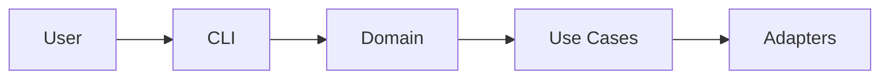

# Documentation Style Guide

**Standards for writing and maintaining flow-cli documentation**

**Last Updated:** 2025-12-24
**Target Audience:** Documentation contributors

---

## Table of Contents

- [Philosophy](#philosophy)
- [File Organization](#file-organization)
- [Writing Style](#writing-style)
- [Markdown Standards](#markdown-standards)
- [ADHD-Friendly Design](#adhd-friendly-design)
- [Code Examples](#code-examples)
- [Diagrams and Visuals](#diagrams-and-visuals)
- [Maintenance](#maintenance)

---

## Philosophy

### Core Principles

1. **Progressive Disclosure** - Start simple, reveal complexity gradually
2. **ADHD-Optimized** - Scannable, visual, clear hierarchy
3. **Practical Over Perfect** - Real examples > theoretical explanations
4. **Accessibility** - Clear language, no jargon without explanation
5. **Maintainable** - Easy to update, clear ownership

### Documentation Goals

**Good documentation:**

- ✅ Answers "How do I...?" questions quickly
- ✅ Provides copy-paste examples that work
- ✅ Uses visuals (diagrams, tables, code blocks)
- ✅ Links to related documentation
- ✅ Stays current with code changes

**Bad documentation:**

- ❌ Walls of text without structure
- ❌ Jargon without explanation
- ❌ Examples that don't work
- ❌ Outdated information
- ❌ No clear next steps

---

## File Organization

### Directory Structure

```
docs/
├── getting-started/       # New user onboarding
│   ├── 00-welcome.md      # Learning paths
│   ├── quick-start.md     # 5-minute start
│   ├── installation.md    # Setup guide
│   └── troubleshooting.md # Common issues
│
├── tutorials/             # Step-by-step guides
│   ├── 01-first-session.md
│   ├── 02-multiple-projects.md
│   ├── 03-status-visualizations.md
│   └── 04-web-dashboard.md
│
├── guides/                # How-to guides
│   ├── WORKFLOWS-QUICK-WINS.md
│   └── WORKFLOW-TUTORIAL.md
│
├── reference/             # Technical reference
│   ├── COMMAND-EXPLORER.md
│   ├── ALIAS-REFERENCE-CARD.md
│   └── WORKFLOW-QUICK-REFERENCE.md
│
├── api/                   # API documentation
│   ├── API-REFERENCE.md
│   ├── INTERACTIVE-EXAMPLES.md
│   └── API-OVERVIEW.md
│
├── architecture/          # System design
│   ├── README.md
│   ├── ARCHITECTURE-DIAGRAM.md
│   └── QUICK-REFERENCE.md
│
├── testing/               # Testing guides
│   └── TESTING.md
│
├── contributing/          # Contributor guides
│   ├── PR-WORKFLOW-GUIDE.md
│   ├── ADR-PROCESS-GUIDE.md
│   └── DOCUMENTATION-STYLE-GUIDE.md (this file)
│
└── decisions/             # Architecture decisions
    ├── README.md
    └── ADR-*.md
```

### File Naming

**Pattern:** `CAPITALIZED-KEBAB-CASE.md` for major docs

**Examples:**

- ✅ `ALIAS-REFERENCE-CARD.md` - Clear, descriptive
- ✅ `PR-WORKFLOW-GUIDE.md` - Acronym + purpose
- ✅ `01-first-session.md` - Numbered tutorial
- ❌ `reference.md` - Too generic
- ❌ `aliases_reference.md` - Snake case inconsistent
- ❌ `AliasReferenceCard.md` - PascalCase inconsistent

**Numbering:**

- Tutorials: `01-`, `02-`, `03-` (sequential learning)
- ADRs: `ADR-001-`, `ADR-002-` (chronological decisions)
- Regular docs: No numbers (timeless reference)

---

## Writing Style

### Tone and Voice

**Be:**

- ✅ Clear and direct
- ✅ Conversational but professional
- ✅ Encouraging and supportive
- ✅ Honest about limitations

**Avoid:**

- ❌ Overly formal/academic language
- ❌ Condescending "obviously" or "simply"
- ❌ Marketing speak / hype
- ❌ Unexplained jargon

### Examples

**Good:**

````markdown
The `flow status` command shows your current work session. If you have
an active session, you'll see the project name, task, and duration.

Example:

```bash
flow status
```
````

**Bad:**

```markdown
The flow status command, which is obviously one of the most important
commands in the entire system, provides comprehensive visibility into
your current workflow state by leveraging our proprietary session
tracking algorithm.
```

### Sentence Structure

**Keep it simple:**

- ✅ One idea per sentence
- ✅ Active voice preferred
- ✅ Short paragraphs (3-5 sentences max)
- ✅ Use bullet points for lists

**Examples:**

**Good (active voice):**

```markdown
The system caches project scans for one hour.
```

**Bad (passive voice):**

```markdown
Project scans are cached by the system for a duration of one hour.
```

---

## Markdown Standards

### Headers

**Use ATX-style headers (with #):**

```markdown
# H1 - Document Title (only one per document)

## H2 - Major Section

### H3 - Subsection

#### H4 - Rarely needed

##### H5 - Avoid if possible
```

**Best practices:**

- One H1 per document
- Don't skip levels (no H1 → H3)
- Use sentence case, not Title Case
- Add blank lines before and after headers

### Code Blocks

**Always specify language:**

````markdown
```bash
flow status
```
````

```javascript
const session = new Session('id', 'project', 'task')
```

```python
# Python example
result = process_data()
```

````

**Languages we use:**
- `bash` - Shell commands
- `javascript` - Node.js code
- `json` - Configuration files
- `yaml` - YAML files
- `markdown` - Markdown examples
- `mermaid` - Diagrams

### Links

**Use relative links for internal docs:**

```markdown
✅ See [Testing Guide](../testing/TESTING.md)
✅ Read the [API Reference](../api/API-REFERENCE.md)
❌ See [Testing Guide](https://data-wise.github.io/flow-cli/testing/TESTING/)
````

**Use full URLs for external links:**

```markdown
✅ [Clean Architecture Book](https://blog.cleancoder.com/uncle-bob/2012/08/13/the-clean-architecture.html)
```

### Lists

**Unordered lists:**

```markdown
- First item
- Second item
  - Nested item
  - Another nested item
- Third item
```

**Ordered lists:**

```markdown
1. First step
2. Second step
3. Third step
```

**Task lists:**

```markdown
- [ ] Todo item
- [x] Completed item
```

### Tables

**Use tables for structured data:**

```markdown
| Command       | Purpose              | Example             |
| ------------- | -------------------- | ------------------- |
| `flow status` | Show current session | `flow status`       |
| `flow work`   | Start session        | `flow work project` |
```

**Alignment:**

```markdown
| Left aligned | Center aligned | Right aligned |
| :----------- | :------------: | ------------: |
| Text         |      Text      |          Text |
```

---

## ADHD-Friendly Design

### Visual Hierarchy

**Use clear structure:**

1. **Headers** - Break up content
2. **Bullet points** - Scannable lists
3. **Code blocks** - Highlight examples
4. **Tables** - Compare options
5. **Admonitions** - Call attention

### Admonitions (Info Boxes)

**MkDocs Material supports admonitions:**

```markdown
!!! note "Quick Tip"
This is a helpful note that stands out.

!!! warning "Important"
Pay attention to this warning.

!!! tip "Pro Tip"
Use this pattern for better results.

!!! danger "Critical"
Don't do this - it will break things.
```

### Scannable Content

**Good (scannable):**

```markdown
## Quick Start

**Three steps to get started:**

1. **Install:** `npm install`
2. **Test:** `npm test`
3. **Run:** `flow status`

**Time:** 5 minutes
```

**Bad (wall of text):**

```markdown
## Quick Start

To get started with flow-cli you'll need to first install the
dependencies using npm install and then run the test suite to
make sure everything is working properly and finally you can
run the flow status command to see your first output.
```

### Visual Elements

**Use emojis sparingly:**

- ✅ Status indicators
- 🔥 Flow state
- ⚡ Quick wins
- 📊 Data/stats
- ❌ Don't overuse

**Use formatting:**

- **Bold** - Important terms, emphasis
- _Italic_ - Technical terms first use
- `Code` - Commands, file names, variables
- > Blockquotes - Important callouts

---

## Code Examples

### Principles

1. **Working examples** - Must actually run
2. **Self-contained** - Don't assume context
3. **Commented** - Explain non-obvious parts
4. **Realistic** - Real-world scenarios

### Example Template

````markdown
### Example: Creating a Session

**Scenario:** Start a work session on the rmediation project.

```bash
# Start session
flow work rmediation "Fix bug #123"

# Check status
flow status

# Output:
# ✅ ACTIVE SESSION
# Project: rmediation
# Task: Fix bug #123
# Duration: 0 min
```
````

**What this does:**

1. Creates new session for rmediation
2. Sets task description
3. Starts timer

````

### Best Practices

**DO:**
```markdown
✅ Show expected output
✅ Include comments
✅ Use realistic data
✅ Show error cases
````

**DON'T:**

```markdown
❌ Use "foo", "bar", "baz"
❌ Leave output ambiguous
❌ Skip error handling
❌ Use outdated examples
```

---

## Diagrams and Visuals

### Mermaid Diagrams

**We use Mermaid for diagrams:**

````markdown

````

````

**Diagram types we use:**
- **Flowcharts** - Process flows
- **Sequence diagrams** - Interactions
- **Class diagrams** - Entities
- **State diagrams** - State machines

### ASCII Art

**For simple visualizations:**

```markdown
````

┌─────────────────────────────────────┐
│ 📊 Dashboard │
├─────────────────────────────────────┤
│ Active: 3 projects │
│ Flow %: 85% │
└─────────────────────────────────────┘

```

```

### Screenshots

**When to use:**

- UI demonstrations
- Visual bugs
- Before/after comparisons

**How to include:**

```markdown

```

---

## Maintenance

### Document Metadata

**Every document should have:**

```markdown
# Document Title

**Brief description in one sentence**

**Last Updated:** YYYY-MM-DD
**Target Audience:** Who this is for
**Read Time:** Estimated time (optional)

---

[Content begins...]
```

### Version Information

**Include version where relevant:**

```markdown
**Version:** v2.0.0-beta.1
**Status:** Production Use Phase
```

### Update Protocol

**When to update documentation:**

1. **Code changes** - Update affected docs same PR
2. **API changes** - Update API reference immediately
3. **New features** - Add tutorial/guide
4. **Bug fixes** - Update troubleshooting if relevant
5. **Monthly** - Review for accuracy

### Deprecation Notices

**How to mark deprecated content:**

```markdown
!!! warning "Deprecated"
This feature was removed in v2.0.0. Use [new feature](#) instead.
```

---

## Quality Checklist

### Before Publishing

**Every documentation update should:**

- [ ] Have clear title and description
- [ ] Include last updated date
- [ ] Use proper markdown formatting
- [ ] Include working code examples
- [ ] Link to related documentation
- [ ] Follow ADHD-friendly design
- [ ] Pass spell check
- [ ] Test all commands/examples
- [ ] Build successfully (`mkdocs build --strict`)

### Review Criteria

**Self-review questions:**

1. **Clarity** - Would a newcomer understand this?
2. **Accuracy** - Are examples current and correct?
3. **Completeness** - Did I answer the user's question?
4. **Structure** - Is it easy to scan and navigate?
5. **Links** - Do all links work?

---

## Templates

### Tutorial Template

````markdown
# Tutorial: [Topic]

**What you'll learn:** [Brief description]
**Time:** X minutes
**Prerequisites:** [What you need first]

---

## Overview

[1-2 paragraph introduction]

## Step 1: [Action]

[Clear instructions]

```bash
# Command example
```
````

**What this does:** [Explanation]

## Step 2: [Next Action]

[Continue pattern...]

## Summary

**You learned:**

- Bullet point 1
- Bullet point 2

**Next steps:**

- Suggested next tutorial
- Related documentation

---

**Questions?** [Link to support]

````

### Reference Template

```markdown
# [Feature] Reference

**Quick reference for [feature]**

**Last Updated:** YYYY-MM-DD

---

## Quick Start

```bash
# Minimal example
````

## All Options

| Option   | Description  | Example          |
| -------- | ------------ | ---------------- |
| `--flag` | What it does | `command --flag` |

## Examples

### Example 1: [Use Case]

```bash
# Command
```

### Example 2: [Another Use Case]

```bash
# Command
```

---

**See also:**

- [Related doc 1](#)
- [Related doc 2](#)

````

---

## Common Mistakes

### Mistake 1: No Examples

**Bad:**
```markdown
The status command shows your session.
````

**Good:**

````markdown
The status command shows your session.

Example:

```bash
flow status
# ✅ ACTIVE SESSION
# Project: rmediation
# Duration: 45 min 🔥 IN FLOW
```
````

```

### Mistake 2: Outdated Information

**Problem:** Documentation mentions features that don't exist or old commands.

**Solution:**
- Update docs in same PR as code changes
- Monthly review cycle
- Add "Last Updated" dates

### Mistake 3: Broken Links

**Problem:** Links to moved/deleted files.

**Solution:**
- Use relative links
- Test with `mkdocs build --strict`
- Link checker in CI/CD

### Mistake 4: Walls of Text

**Problem:** Dense paragraphs without structure.

**Solution:**
- Break into sections with headers
- Use bullet points
- Add code examples
- Include visuals

---

## Tools and Resources

### Writing Tools

- **Spell check:** Use editor spell check
- **Markdown linter:** markdownlint
- **Link checker:** `mkdocs build --strict`
- **Preview:** `mkdocs serve`

### Reference Materials

- [Markdown Guide](https://www.markdownguide.org/)
- [MkDocs Material](https://squidfunk.github.io/mkdocs-material/)
- [Mermaid Docs](https://mermaid.js.org/)
- [Google Developer Docs Style](https://developers.google.com/style)

---

## Related Documentation

- [Contributing Guide](../contributing/CONTRIBUTING.md) - How to contribute
- [PR Workflow Guide](PR-WORKFLOW-GUIDE.md) - Pull request process
- [ADR Process Guide](ADR-PROCESS-GUIDE.md) - Architecture decisions

---

**Last Updated:** 2025-12-24
**Version:** v2.0.0-beta.1
**Maintained by:** flow-cli contributors
```
