# flow-cli Architecture Diagrams

**Version:** 5.10.0
**Last Updated:** 2026-01-15

---

## System Overview

```mermaid
graph TB
    subgraph "User Interface"
        CLI[ZSH Commands]
        Aliases[Shell Aliases]
        Completions[Tab Completions]
    end

    subgraph "Core Layer"
        Core[lib/core.zsh<br/>Colors, Logging, Utils]
        Config[lib/config.zsh<br/>Configuration]
        Cache[lib/project-cache.zsh<br/>Caching]
    end

    subgraph Dispatchers ["Dispatchers (13)"]
        G[g - Git]
        CC[cc - Claude Code]
        MCP[mcp - MCP Servers]
        WT[wt - Worktrees]
        Teach[teach - Teaching]
        R[r - R Packages]
        Qu[qu - Quarto]
        TM[tm - Terminal]
        Obs[obs - Obsidian]
        Dot[dot - Dotfiles]
        Prompt[prompt - Prompt Engine]
        V[v - Vibe/Workflow]
        EM[em - Email]
    end

    subgraph Commands [Commands]
        Work[work/finish/hop<br/>Session Management]
        Pick[pick<br/>Project Picker]
        Dash[dash<br/>Dashboard]
        Doctor[flow doctor<br/>Health Check]
        ADHD[js/next/stuck<br/>ADHD Helpers]
        Morning[morning/today<br/>Daily Routine]
        Capture[catch/win/yay<br/>Quick Capture]
        AI[ai/flow do<br/>AI Assistance]
    end

    subgraph "External Tools"
        Git[Git]
        Claude[Claude CLI]
        FZF[fzf]
        Atlas[Atlas<br/>(optional)]
    end

    CLI --> Core
    Aliases --> Dispatchers
    Completions --> Commands

    Core --> Cache
    Core --> Config

    Dispatchers --> Core
    Commands --> Core

    G --> Git
    CC --> Claude
    Pick --> FZF

    style Core fill:#e1f5ff
    style Dispatchers fill:#fff3e0
    style Commands fill:#f3e5f5
```

---

## Dispatcher Architecture

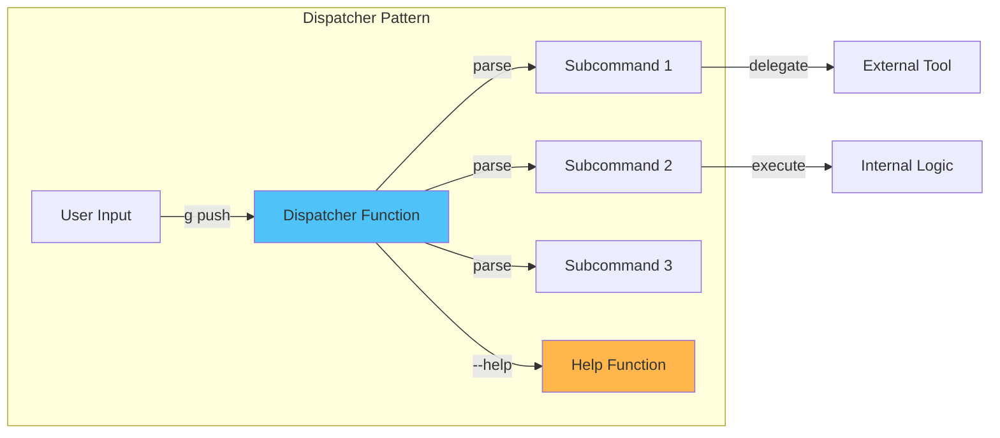

**Example Flow:**

```
User types: g push origin main
    ↓
g() function receives args
    ↓
Parse: subcommand="push", args=[origin, main]
    ↓
Route to: _g_push origin main
    ↓
Execute: git push origin main
    ↓
Log result with _flow_log_success
```

---

## Worktree Detection Flow

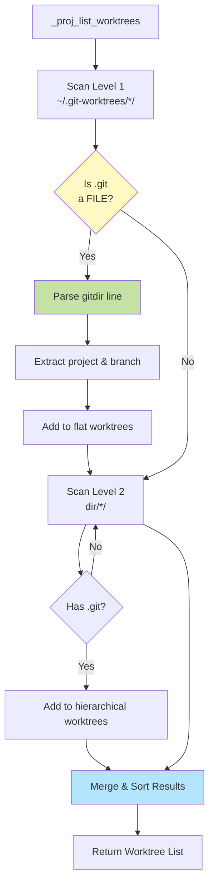

**Worktree Structure Detection:**

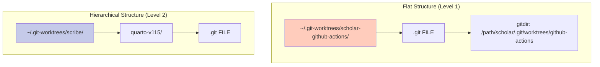

---

## Cache Invalidation Flow

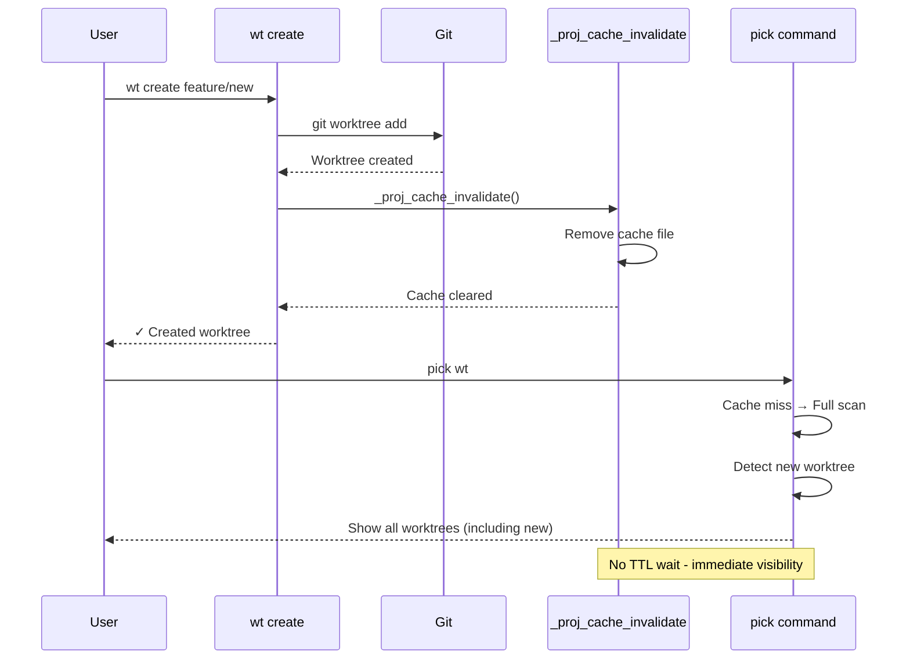

---

## Teaching System Integration

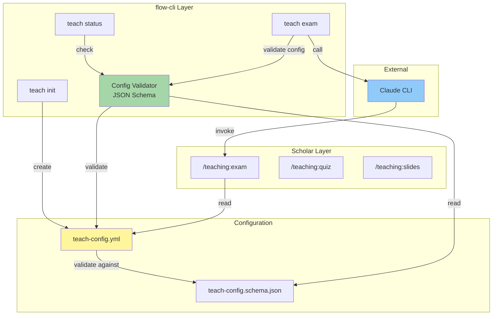

**Config Ownership Protocol:**

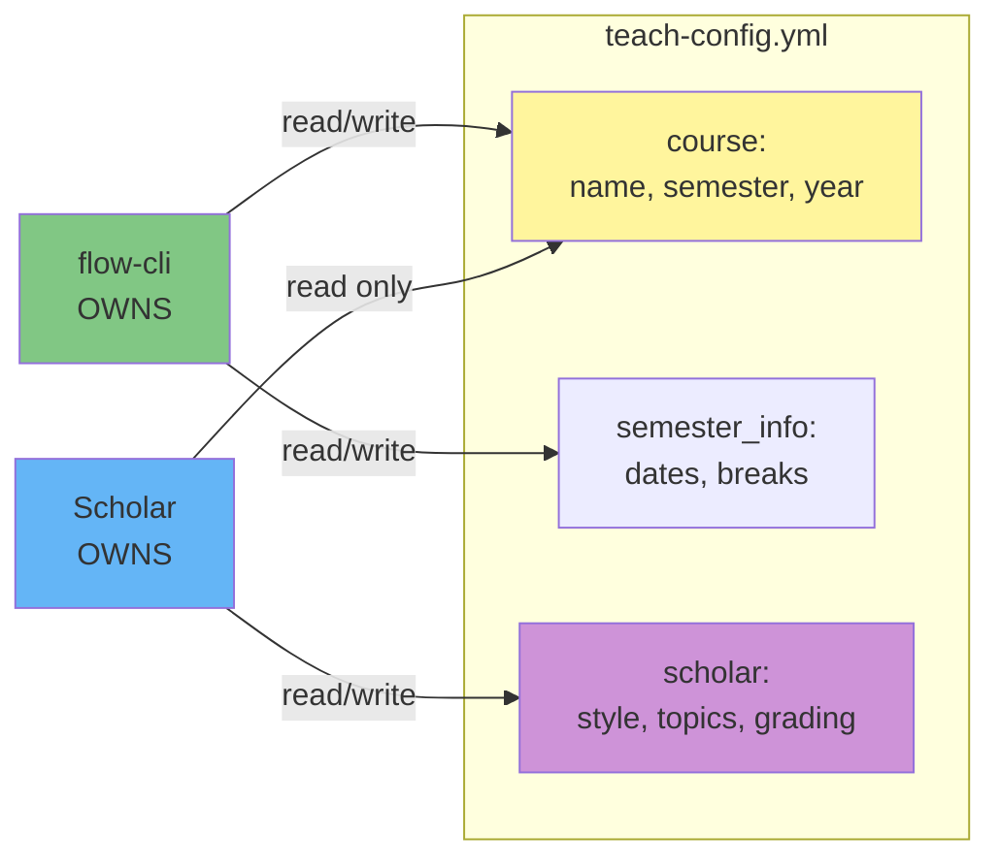

---

## Session Management Flow

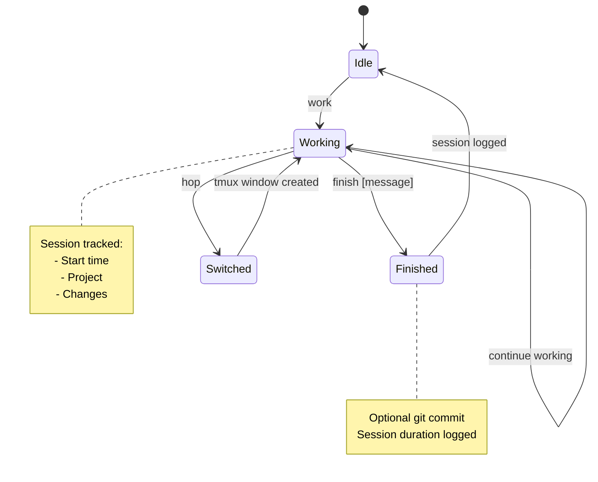

---

## Pick Command Data Flow

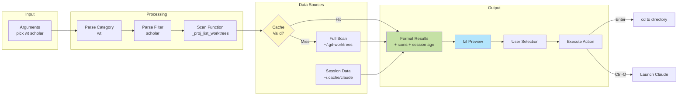

---

## Dependency Graph

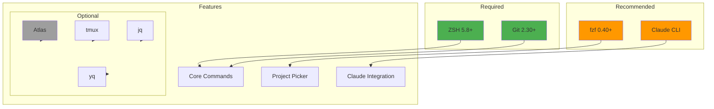

---

## Color System Architecture

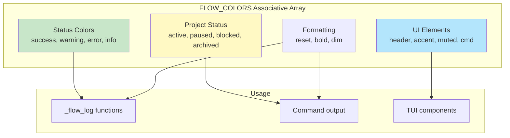

**Color Palette (ADHD-Friendly):**

```
Success:  #729C51 (Soft Green)
Warning:  #E5C07B (Warm Yellow)
Error:    #E06C75 (Soft Red)
Info:     #61AFEF (Calm Blue)
Active:   #729C51 (Green)
Paused:   #E5C07B (Yellow)
Header:   #9D9CC9 (Soft Purple)
Accent:   #D19A66 (Soft Orange)
```

---

## Plugin Architecture (Extensibility)

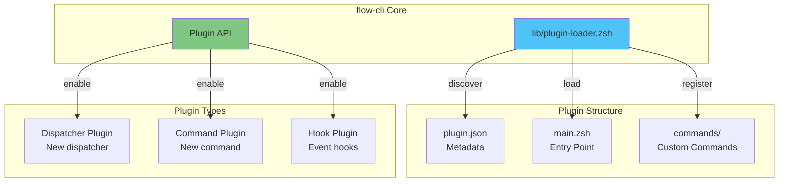

---

## Configuration Hierarchy

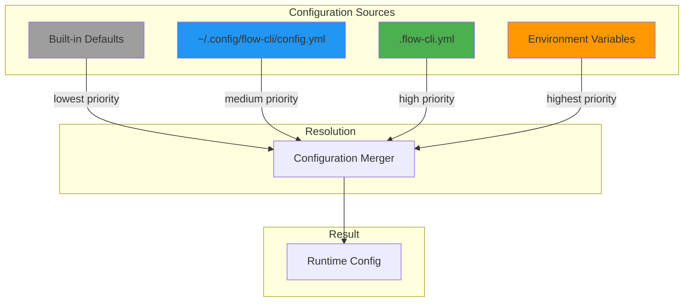

**Priority Order:**

1. Environment Variables (highest)
2. Project `.flow-cli.yml`
3. Global `~/.config/flow-cli/config.yml`
4. Built-in Defaults (lowest)

---

## Error Handling Flow

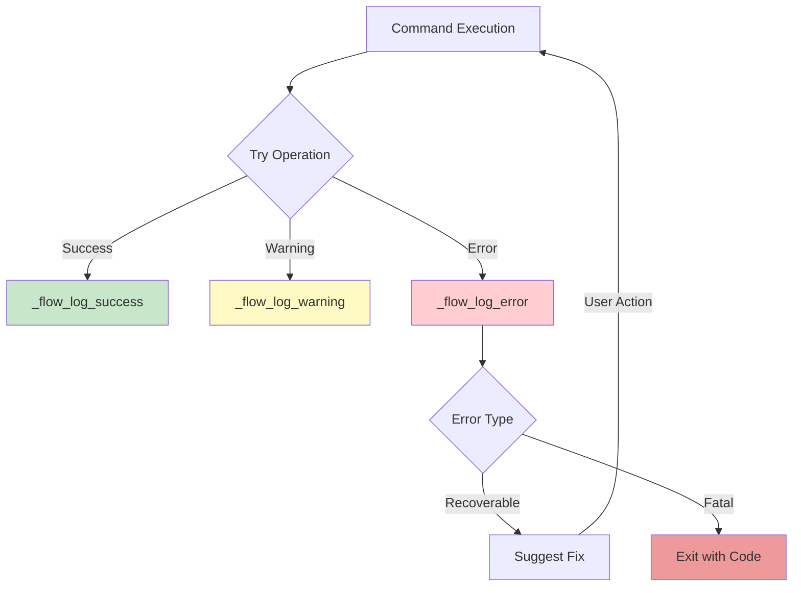

**Error Types:**

- **Recoverable:** Missing dependency, config issue → Suggest `flow doctor --fix`
- **Fatal:** Permission denied, git error → Exit with code 1

---

## Test Architecture

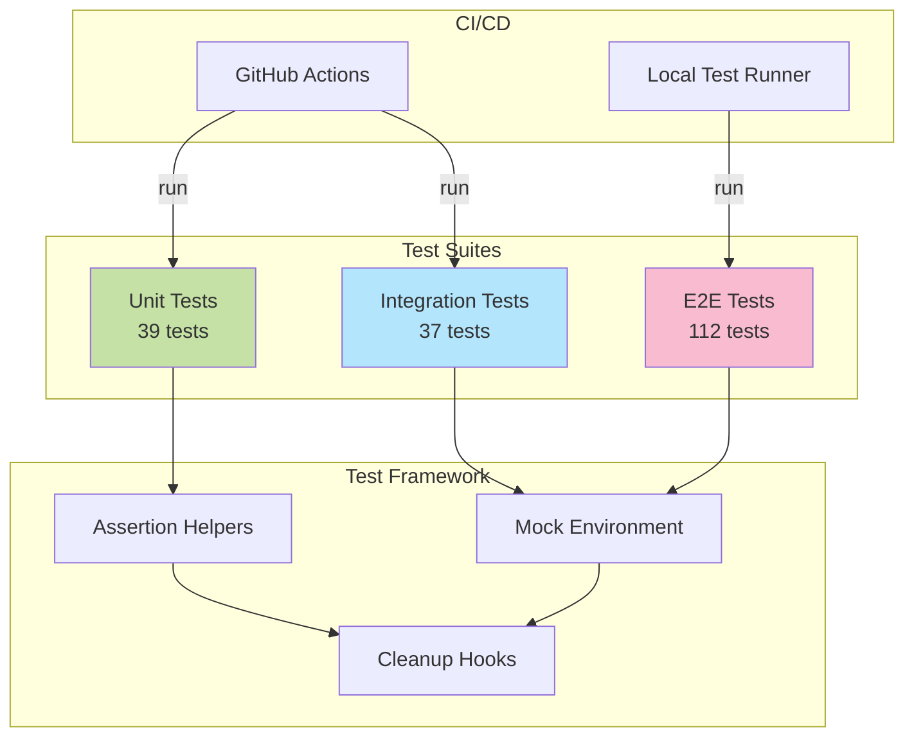

---

## Deployment Pipeline

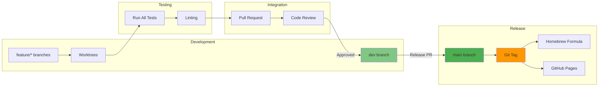

---

## See Also

- [API-COMPLETE.md](../reference/MASTER-API-REFERENCE.md) - Complete API reference
- [ARCHITECTURE.md](../reference/MASTER-ARCHITECTURE.md) - System architecture document
- [DISPATCHER-REFERENCE.md](../reference/MASTER-DISPATCHER-GUIDE.md) - Dispatcher details

---

**Last Updated:** 2026-01-15
**Version:** 5.10.0
