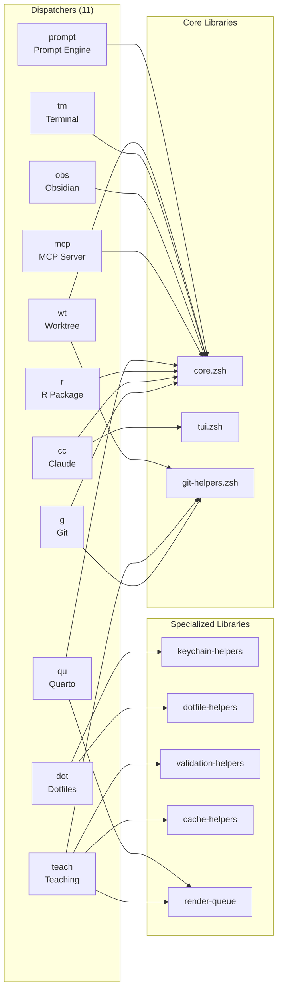

# Library Architecture Diagrams

> **Version:** 5.15.1 | **Updated:** 2026-01-22 | **Libraries:** 32 | **Functions:** 348

Visual documentation of flow-cli's library organization and dependencies.

---

## Library Layer Overview

```mermaid
graph TB
    subgraph "Layer 4: Specialized (160 functions)"
        DOT[dotfile-helpers<br/>27 funcs]
        AI1[ai-recipes<br/>11 funcs]
        AI2[ai-usage<br/>9 funcs]
        RQ[render-queue<br/>11 funcs]
        PH[parallel-helpers<br/>10 funcs]
        PP[parallel-progress<br/>9 funcs]
        DP[date-parser<br/>10 funcs]
        PM[performance-monitor<br/>10 funcs]
        RH[r-helpers<br/>9 funcs]
        PRF[profile-helpers<br/>9 funcs]
        RENV[renv-integration<br/>8 funcs]
        CV[custom-validators<br/>8 funcs]
        CFV[config-validator<br/>8 funcs]
        HI[hook-installer<br/>8 funcs]
        CA[cache-analysis<br/>6 funcs]
        SD[status-dashboard<br/>3 funcs]
        INV[inventory<br/>2 funcs]
        HB[help-browser<br/>2 funcs]
    end

    subgraph "Layer 3: Integration (80 functions)"
        AB[atlas-bridge<br/>21 funcs]
        PL[plugin-loader<br/>23 funcs]
        CFG[config<br/>16 funcs]
        KC[keychain-helpers<br/>7 funcs]
        PD[project-detector<br/>4 funcs]
        PC[project-cache<br/>9 funcs]
    end

    subgraph "Layer 2: Teaching (61 functions)"
        VH[validation-helpers<br/>19 funcs]
        BH[backup-helpers<br/>12 funcs]
        CH[cache-helpers<br/>11 funcs]
        IH[index-helpers<br/>12 funcs]
        TU[teaching-utils<br/>7 funcs]
    end

    subgraph "Layer 1: Core (47 functions)"
        CORE[core<br/>14 funcs]
        TUI[tui<br/>16 funcs]
        GH[git-helpers<br/>17 funcs]
    end

    %% Dependencies
    TUI --> CORE
    GH --> CORE

    VH --> CORE
    BH --> CORE
    CH --> CORE
    IH --> CORE
    TU --> CORE

    AB --> CORE
    PL --> CORE
    CFG --> CORE
    KC --> CORE
    PD --> CORE
    PC --> CORE

    DOT --> KC
    DOT --> CORE
    AI1 --> CORE
    AI2 --> CORE
    RQ --> CORE
    PH --> CORE
    PP --> TUI
    DP --> CORE
    PM --> CORE
    RH --> CORE
    PRF --> CORE
    RENV --> CORE
    CV --> CORE
    CFV --> CORE
    HI --> GH
    CA --> CH
    SD --> TUI
    SD --> CH
    INV --> CORE
    HB --> TUI
```

---

## Dispatcher Architecture

---

## Summary Statistics

| Layer | Libraries | Functions | Description |
|-------|-----------|-----------|-------------|
| **Core** | 3 | 47 | Logging, UI components, Git operations |
| **Teaching** | 5 | 61 | Validation, backup, cache, index management |
| **Integration** | 6 | 80 | Atlas, plugins, config, keychain, project detection |
| **Specialized** | 18 | 160 | Dotfiles, AI, rendering, R, Quarto, validators |
| **Total** | **32** | **348** | 49.4% documentation coverage |

---

## Layer Details

### Layer 1: Core (47 functions)

Foundation libraries used by all other layers.

| Library | Functions | Purpose |
|---------|-----------|---------|
| `core.zsh` | 14 | Logging, colors, utilities |
| `tui.zsh` | 16 | Progress bars, spinners, tables |
| `git-helpers.zsh` | 17 | Git operations, teaching commits |

### Layer 2: Teaching (61 functions)

Libraries supporting the teaching workflow.

| Library | Functions | Purpose |
|---------|-----------|---------|
| `validation-helpers.zsh` | 19 | YAML, syntax, render validation |
| `backup-helpers.zsh` | 12 | Content backup with retention |
| `cache-helpers.zsh` | 11 | Quarto freeze cache management |
| `index-helpers.zsh` | 12 | Course index link management |
| `teaching-utils.zsh` | 7 | Week calculation, date utilities |

### Layer 3: Integration (80 functions)

Libraries connecting flow-cli to external systems.

| Library | Functions | Purpose |
|---------|-----------|---------|
| `atlas-bridge.zsh` | 21 | Atlas state engine integration |
| `plugin-loader.zsh` | 23 | Plugin system, hooks, config |
| `config.zsh` | 16 | Configuration management |
| `keychain-helpers.zsh` | 7 | macOS Keychain secrets |
| `project-detector.zsh` | 4 | Project type detection |
| `project-cache.zsh` | 9 | Project list caching |

### Layer 4: Specialized (160 functions)

Domain-specific feature libraries.

| Library | Functions | Purpose |
|---------|-----------|---------|
| `dotfile-helpers.zsh` | 27 | Chezmoi, Bitwarden, Keychain |
| `ai-recipes.zsh` | 11 | AI recipe management |
| `ai-usage.zsh` | 9 | AI usage tracking |
| `render-queue.zsh` | 11 | Parallel render queue |
| `parallel-helpers.zsh` | 10 | Worker pool management |
| `parallel-progress.zsh` | 9 | Progress display |
| `date-parser.zsh` | 10 | Date extraction/normalization |
| `performance-monitor.zsh` | 10 | Metrics collection |
| `r-helpers.zsh` | 9 | R package detection |
| `profile-helpers.zsh` | 9 | Quarto profile management |
| `renv-integration.zsh` | 8 | renv.lock parsing |
| `custom-validators.zsh` | 8 | Validator plugin framework |
| `config-validator.zsh` | 8 | Config validation |
| `hook-installer.zsh` | 8 | Git hook management |
| `cache-analysis.zsh` | 6 | Cache diagnostics |
| `status-dashboard.zsh` | 3 | Teaching status display |
| `inventory.zsh` | 2 | Project inventory |
| `help-browser.zsh` | 2 | Interactive help |

---

## See Also

- [Core API Reference](../reference/.archive/CORE-API-REFERENCE.md)
- [Teaching API Reference](../reference/.archive/TEACHING-API-REFERENCE.md)
- [Integration API Reference](../reference/.archive/INTEGRATION-API-REFERENCE.md)
- [Specialized API Reference](../reference/.archive/SPECIALIZED-API-REFERENCE.md)
- [Architecture Overview](../reference/MASTER-ARCHITECTURE.md)
