# Teaching Workflow v3.0 - System Diagrams

Comprehensive Mermaid diagrams for Teaching Workflow v3.0 features.

---

## teach doctor - Health Check Flow

```mermaid
flowchart TD
    Start([teach doctor]) --> ParseFlags{Parse Flags}

    ParseFlags --> |--json| JSON[JSON Mode<br/>quiet=true]
    ParseFlags --> |--quiet| Quiet[Quiet Mode<br/>warnings only]
    ParseFlags --> |--fix| Fix[Fix Mode<br/>interactive]
    ParseFlags --> |default| Normal[Normal Mode<br/>full output]

    JSON --> CheckDeps
    Quiet --> CheckDeps
    Fix --> CheckDeps
    Normal --> CheckDeps

    CheckDeps[Check Dependencies] --> DepResults{All<br/>Required?}
    DepResults --> |Missing| FixMode{Fix<br/>Mode?}
    DepResults --> |OK| CheckConfig

    FixMode --> |Yes| InstallPrompt[Offer to Install]
    FixMode --> |No| DepFail[❌ Dependency<br/>Failed]

    InstallPrompt --> |User accepts| Install[Run Install<br/>Commands]
    InstallPrompt --> |User declines| DepFail
    Install --> CheckConfig

    CheckConfig[Check Config] --> ConfigExists{Config<br/>Exists?}
    ConfigExists --> |No| ConfigFail[❌ Config<br/>Not Found]
    ConfigExists --> |Yes| Validate[Validate<br/>Schema]

    Validate --> ValidResult{Valid?}
    ValidResult --> |Yes| CheckGit
    ValidResult --> |No| ConfigWarn[⚠️ Config<br/>Invalid]

    ConfigWarn --> CheckGit

    CheckGit[Check Git Status] --> GitChecks{Branch OK?<br/>Remote OK?}
    GitChecks --> |Issues| GitWarn[⚠️ Git<br/>Warnings]
    GitChecks --> |OK| CheckScholar

    GitWarn --> CheckScholar

    CheckScholar[Check Scholar] --> ScholarExists{Scholar<br/>Available?}
    ScholarExists --> |No| ScholarWarn[⚠️ Scholar<br/>Optional]
    ScholarExists --> |Yes| ScholarOK[✅ Scholar<br/>Ready]

    ScholarWarn --> Summary
    ScholarOK --> Summary
    ConfigFail --> Summary
    DepFail --> Summary

    Summary[Generate Summary] --> OutputMode{Output<br/>Mode?}
    OutputMode --> |JSON| JSONOut[Print JSON<br/>Results]
    OutputMode --> |Normal| NormalOut[Print Colored<br/>Summary]

    JSONOut --> Exit{Any<br/>Failures?}
    NormalOut --> Exit

    Exit --> |Yes| Fail([Exit 1])
    Exit --> |No| Success([Exit 0])

    style Start fill:#e1f5e1
    style Success fill:#c8e6c9
    style Fail fill:#ffcdd2
    style DepFail fill:#ffcdd2
    style ConfigFail fill:#ffcdd2
    style ScholarOK fill:#c8e6c9
    style DepResults fill:#fff3cd
    style FixMode fill:#fff3cd
    style ConfigExists fill:#fff3cd
    style ValidResult fill:#fff3cd
    style GitChecks fill:#fff3cd
    style ScholarExists fill:#fff3cd
```

---

## Backup System - Content Protection Flow

```mermaid
flowchart TD
    Generate[Generate Content] --> ContentType{Content<br/>Type?}

    ContentType --> |exam/quiz/assignment| Archive[Retention:<br/>archive]
    ContentType --> |syllabus/rubric| Archive
    ContentType --> |lecture/slides| Semester[Retention:<br/>semester]

    Archive --> CreateBackup
    Semester --> CreateBackup

    CreateBackup[Create Backup] --> Timestamp[Generate<br/>Timestamp]
    Timestamp --> BackupPath[.backups/<name>.<YYYY-MM-DD-HHMM>/]

    BackupPath --> CopyMethod{rsync<br/>available?}
    CopyMethod --> |Yes| Rsync[rsync -a<br/>--exclude=.backups]
    CopyMethod --> |No| CpFallback[cp -R + cleanup]

    Rsync --> VerifyBackup
    CpFallback --> VerifyBackup

    VerifyBackup{Backup<br/>Successful?} --> |Yes| UpdateMeta[Update Metadata]
    VerifyBackup --> |No| BackupFail[❌ Backup Failed]

    UpdateMeta --> SaveContent[Save New Content]

    SaveContent --> CleanupCheck{Need<br/>Cleanup?}
    CleanupCheck --> |semester policy| CountBackups{Backups<br/>> 5?}
    CleanupCheck --> |archive policy| KeepAll[Keep All<br/>Backups]

    CountBackups --> |Yes| RemoveOldest[Remove Oldest<br/>Backups]
    CountBackups --> |No| KeepRecent[Keep Recent<br/>Backups]

    RemoveOldest --> Complete
    KeepRecent --> Complete
    KeepAll --> Complete

    Complete([✅ Content Saved<br/>Backup Protected])

    style Generate fill:#e1f5e1
    style Complete fill:#c8e6c9
    style BackupFail fill:#ffcdd2
    style Archive fill:#bbdefb
    style Semester fill:#f0f4c3
    style VerifyBackup fill:#fff3cd
    style CleanupCheck fill:#fff3cd
```

---

## Delete Workflow - Safety with Confirmation

```mermaid
flowchart TD
    Delete[teach delete<br/>content.pdf] --> ParseFlags{Flags?}

    ParseFlags --> |--force| SkipConfirm[Skip Confirmation]
    ParseFlags --> |default| CheckBackup

    CheckBackup[Check for Backup] --> BackupExists{Backup<br/>Exists?}

    BackupExists --> |Yes| ShowInfo[Display Info:<br/>• File name<br/>• Size<br/>• Backup status]
    BackupExists --> |No| ShowInfoNoBackup[Display Info:<br/>• File name<br/>• Size<br/>⚠️ NO BACKUP]

    ShowInfo --> Prompt[Prompt: Delete?<br/>y/n]
    ShowInfoNoBackup --> PromptWarn[Prompt: DELETE?<br/>NO BACKUP!<br/>y/n]

    Prompt --> UserInput{User<br/>Response?}
    PromptWarn --> UserInput

    UserInput --> |y/yes| ConfirmDelete
    UserInput --> |n/no| Cancelled
    UserInput --> |invalid| Cancelled

    SkipConfirm --> ConfirmDelete

    ConfirmDelete[Delete File] --> Verify{Deleted?}
    Verify --> |Yes| Success[✅ Deleted<br/>Backup preserved]
    Verify --> |No| Failed[❌ Delete Failed]

    Cancelled([🚫 Cancelled])
    Success([✅ Complete])
    Failed([❌ Failed])

    style Delete fill:#e1f5e1
    style Success fill:#c8e6c9
    style Failed fill:#ffcdd2
    style Cancelled fill:#fff9c4
    style BackupExists fill:#fff3cd
    style ShowInfoNoBackup fill:#ffe0b2
    style PromptWarn fill:#ffe0b2
```

---

## Enhanced teach status - Information Display

```mermaid
flowchart TD
    Status[teach status] --> LoadConfig[Load Config]

    LoadConfig --> Display1[📚 Course Info<br/>Name, Semester, Instructor]
    Display1 --> Display2[📊 Content Summary<br/>Exams, Lectures, etc.]
    Display2 --> Display3[⚙️ Config Status<br/>Validation, Schema]

    Display3 --> GitCheck{Git<br/>Available?}
    GitCheck --> |Yes| Display4[📝 Git Status<br/>Modified files, Branch]
    GitCheck --> |No| SkipGit[Skip Git Section]

    Display4 --> DeployCheck
    SkipGit --> DeployCheck

    DeployCheck{Deploy<br/>Info?} --> |Available| Display5[🚀 Deployment Status<br/>Last deploy, Open PRs]
    DeployCheck --> |Not available| SkipDeploy

    Display5 --> BackupCheck
    SkipDeploy --> BackupCheck

    BackupCheck{Backups<br/>Exist?} --> |Yes| Display6[💾 Backup Summary<br/>Count, Last backup, Size]
    BackupCheck --> |No| SkipBackup

    Display6 --> ValidateCheck
    SkipBackup --> ValidateCheck

    ValidateCheck{Config<br/>Valid?} --> |Issues| Display7[⚠️ Warnings<br/>Config issues]
    ValidateCheck --> |OK| Complete

    Display7 --> Complete([✅ Status Display<br/>Complete])

    style Status fill:#e1f5e1
    style Complete fill:#c8e6c9
    style Display1 fill:#e3f2fd
    style Display2 fill:#e3f2fd
    style Display3 fill:#e3f2fd
    style Display4 fill:#e3f2fd
    style Display5 fill:#f1f8e9
    style Display6 fill:#f1f8e9
    style Display7 fill:#fff3e0
```

---

## Deploy Preview - Safe Deployment

```mermaid
flowchart TD
    Deploy[teach deploy] --> PreFlight[Pre-Flight Checks]

    PreFlight --> Check1{On draft<br/>branch?}
    Check1 --> |No| Error1[❌ Not on draft]
    Check1 --> |Yes| Check2

    Check2{Working tree<br/>clean?} --> |No| Error2[❌ Uncommitted<br/>changes]
    Check2 --> |Yes| Check3

    Check3{Unpushed<br/>commits?} --> |Yes| PushPrompt[Prompt: Push?]
    Check3 --> |No| Check4

    PushPrompt --> |Yes| Push[git push]
    PushPrompt --> |No| Error3[❌ Must push first]

    Push --> Check4

    Check4{Conflicts with<br/>main?} --> |Yes| ConflictPrompt[Prompt: Rebase?]
    Check4 --> |No| ShowPreview

    ConflictPrompt --> |Yes| Rebase[git rebase main]
    ConflictPrompt --> |No| Error4[❌ Conflicts exist]

    Rebase --> ShowPreview

    ShowPreview[📋 Show Changes Preview] --> Files[• Files changed<br/>• Additions/Deletions<br/>• Status codes M/A/D/R]

    Files --> FullDiff{View full<br/>diff?}
    FullDiff --> |Yes| Pager[delta/less<br/>pager]
    FullDiff --> |No| CreatePR

    Pager --> CreatePR{Create PR?}
    CreatePR --> |Yes| GeneratePR[Generate PR<br/>• Title<br/>• Commit list<br/>• Checklist]
    CreatePR --> |No| Cancelled

    GeneratePR --> Submit[gh pr create]
    Submit --> Success[✅ PR Created<br/>URL displayed]

    Error1 --> Failed
    Error2 --> Failed
    Error3 --> Failed
    Error4 --> Failed

    Cancelled([🚫 Cancelled])
    Failed([❌ Failed])
    Success([✅ Complete])

    style Deploy fill:#e1f5e1
    style Success fill:#c8e6c9
    style Failed fill:#ffcdd2
    style Cancelled fill:#fff9c4
    style Check1 fill:#fff3cd
    style Check2 fill:#fff3cd
    style Check3 fill:#fff3cd
    style Check4 fill:#fff3cd
    style ShowPreview fill:#e1f5fe
    style GeneratePR fill:#e8f5e9
```

---

## Scholar Integration - Template & Lesson Plan Flow

```mermaid
flowchart TD
    Command[teach exam/quiz/etc.] --> CheckFiles{Files<br/>Present?}

    CheckFiles --> |lesson-plan.yml| LoadLesson[Load Lesson Plan<br/>--context lesson-plan.yml]
    CheckFiles --> |No lesson plan| SkipLesson

    LoadLesson --> CheckTemplate
    SkipLesson --> CheckTemplate

    CheckTemplate{--template<br/>flag?} --> |Yes| UseTemplate[Use Specified<br/>Template]
    CheckTemplate --> |No| DefaultTemplate[Use Default<br/>Template]

    UseTemplate --> BuildContext
    DefaultTemplate --> BuildContext

    BuildContext[Build Context] --> ConfigContext[+ Course config<br/>+ Semester info]
    ConfigContext --> LessonContext{Lesson plan<br/>loaded?}

    LessonContext --> |Yes| RichContext[+ Week topics<br/>+ Learning objectives<br/>+ Key concepts]
    LessonContext --> |No| BasicContext[Course context<br/>only]

    RichContext --> InvokeScholar
    BasicContext --> InvokeScholar

    InvokeScholar[Invoke Scholar] --> Generate[Generate Content]
    Generate --> Validate[Validate Output]

    Validate --> Success([✅ Content<br/>Generated])

    style Command fill:#e1f5e1
    style Success fill:#c8e6c9
    style CheckFiles fill:#fff3cd
    style CheckTemplate fill:#fff3cd
    style LessonContext fill:#fff3cd
    style RichContext fill:#e8f5e9
    style BasicContext fill:#fff9c4
```

---

## teach init - Project Initialization

```mermaid
flowchart TD
    Init[teach init] --> ParseFlags{Flags?}

    ParseFlags --> |--config FILE| LoadExternal[Load External<br/>Config]
    ParseFlags --> |default| CheckExisting

    LoadExternal --> ValidateExt{Valid<br/>Config?}
    ValidateExt --> |Yes| CheckGitFlag
    ValidateExt --> |No| ConfigError[❌ Invalid Config]

    CheckExisting{Config<br/>Exists?} --> |Yes| Overwrite[Prompt:<br/>Overwrite?]
    CheckExisting --> |No| CreateDefault

    Overwrite --> |Yes| CreateDefault
    Overwrite --> |No| Cancelled

    CreateDefault[Create Default<br/>Config] --> CheckGitFlag

    CheckGitFlag{--github<br/>flag?} --> |Yes| GitSetup
    CheckGitFlag --> |No| LocalOnly

    GitSetup[Git Setup] --> InitRepo{Repo<br/>Exists?}
    InitRepo --> |No| CreateRepo[git init]
    InitRepo --> |Yes| SkipInit

    CreateRepo --> CreateIgnore
    SkipInit --> CreateIgnore

    CreateIgnore[Create .gitignore<br/>Teaching template] --> InitCommit[Initial Commit]
    InitCommit --> Branches[Create Branches<br/>draft, main]

    Branches --> GitHubPrompt{Create<br/>GitHub repo?}
    GitHubPrompt --> |Yes| GHCreate[gh repo create]
    GitHubPrompt --> |No| LocalGit

    GHCreate --> Push[git push origin]
    Push --> Complete

    LocalGit --> Complete
    LocalOnly --> Complete

    ConfigError --> Failed
    Cancelled --> CancelledExit

    Complete([✅ Project<br/>Initialized])
    Failed([❌ Failed])
    CancelledExit([🚫 Cancelled])

    style Init fill:#e1f5e1
    style Complete fill:#c8e6c9
    style Failed fill:#ffcdd2
    style CancelledExit fill:#fff9c4
    style ParseFlags fill:#fff3cd
    style CheckExisting fill:#fff3cd
    style ValidateExt fill:#fff3cd
    style CheckGitFlag fill:#fff3cd
    style InitRepo fill:#fff3cd
    style GitHubPrompt fill:#fff3cd
```

---

## teach deploy - Safety Enhancement Flow (v6.6.0)

```mermaid
flowchart TD
    Start([teach deploy]) --> Preflight[Pre-flight Checks]

    Preflight --> |Pass| DirtyCheck{Working<br/>tree dirty?}
    Preflight --> |Fail| Abort[❌ Pre-flight<br/>Failed]

    DirtyCheck --> |Clean| ModeDispatch{Deploy<br/>Mode?}
    DirtyCheck --> |Dirty| CICheck{CI Mode?}

    CICheck --> |Yes| CIFail[❌ Uncommitted changes<br/>Fail immediately]
    CICheck --> |No| Prompt[Uncommitted changes detected<br/>Suggested: content: week-05<br/>Commit and continue? Y/n]

    Prompt --> |N| Cancel[Deploy cancelled]
    Prompt --> |Y/Enter| GitAdd[git add -A]

    GitAdd --> Commit[git commit -m smart_msg]
    Commit --> |Success| CommitOK[✅ Committed]
    Commit --> |Fail| HookFail[❌ Commit failed<br/>likely pre-commit hook]

    HookFail --> Options[Options:<br/>1. Fix + retry<br/>2. QUARTO_PRE_COMMIT_RENDER=0<br/>3. git commit --no-verify<br/>Changes still staged]
    Options --> Return1[return 1]

    CommitOK --> ModeDispatch

    ModeDispatch --> |--direct| DirectMode
    ModeDispatch --> |PR default| PRMode

    subgraph DirectMode [Direct Merge Mode]
        TrapD[trap: checkout draft<br/>on EXIT/INT/TERM]
        TrapD --> Push[Push draft → origin]
        Push --> Switch[Checkout production]
        Switch --> Merge[Merge draft → production]
        Merge --> PushProd[Push production → origin]
        PushProd --> SwitchBack[Checkout draft]
        SwitchBack --> ClearTrapD[trap - EXIT INT TERM]
    end

    subgraph PRMode [PR Mode]
        TrapP[trap: checkout draft<br/>on EXIT/INT/TERM]
        TrapP --> PRChecks[Check uncommitted<br/>Check unpushed<br/>Check conflicts]
        PRChecks --> CreatePR[Create Pull Request]
        CreatePR --> ClearTrapP[trap - EXIT INT TERM]
    end

    DirectMode --> Summary
    PRMode --> Summary

    Summary[Deployment Summary Box<br/>Mode / Files / Duration / Commit<br/>URL / Actions link]

    style Start fill:#e3f2fd
    style Summary fill:#c8e6c9
    style Abort fill:#ffcdd2
    style CIFail fill:#ffcdd2
    style Cancel fill:#fff9c4
    style Return1 fill:#ffcdd2
    style HookFail fill:#ffcdd2
    style CommitOK fill:#c8e6c9
    style TrapD fill:#fff3cd
    style TrapP fill:#fff3cd
    style ClearTrapD fill:#c8e6c9
    style ClearTrapP fill:#c8e6c9
    style Prompt fill:#e1f5fe
    style Options fill:#fff9c4
```

---

**Generated:** 2026-02-09
**Version:** Teaching Workflow v3.0 + v6.6.0 Safety Enhancements
**Total Diagrams:** 8

These diagrams provide comprehensive visual documentation for all major Teaching Workflow features.
