# WT Workflow Enhancement - Architecture Diagrams

**Version:** v5.13.0
**Date:** 2026-01-17

---

## System Overview

```mermaid
graph TB
    subgraph "User Interface"
        CLI[Command Line]
    end

    subgraph "Dispatchers"
        WT[wt dispatcher<br/>lib/dispatchers/wt-dispatcher.zsh]
        PICK[pick command<br/>commands/pick.zsh]
    end

    subgraph "Core Functions - Phase 1"
        OVERVIEW[_wt_overview<br/>Formatted table output]
        STATUS[Status Detection<br/>active/merged/stale/main]
        SESSION[Session Detection<br/>🟢🟡⚪ indicators]
    end

    subgraph "Core Functions - Phase 2"
        DELETE[_pick_wt_delete<br/>Interactive deletion]
        REFRESH[_pick_wt_refresh<br/>Cache invalidation]
    end

    subgraph "External Tools"
        GIT[git worktree]
        FZF[fzf picker]
        CACHE[Project Cache]
    end

    CLI --> WT
    CLI --> PICK

    WT -->|wt| OVERVIEW
    WT -->|wt <filter>| OVERVIEW
    WT -->|other commands| GIT

    PICK -->|pick wt| FZF

    OVERVIEW --> STATUS
    OVERVIEW --> SESSION
    OVERVIEW --> GIT

    FZF -->|Ctrl-X| DELETE
    FZF -->|Ctrl-R| REFRESH
    FZF -->|Enter| WT

    DELETE --> GIT
    DELETE --> CACHE
    REFRESH --> CACHE
    REFRESH --> OVERVIEW

    style OVERVIEW fill:#90EE90
    style DELETE fill:#FFB6C1
    style REFRESH fill:#87CEEB
    style STATUS fill:#DDA0DD
    style SESSION fill:#F0E68C
```

---

## Data Flow - Overview Display

```mermaid
sequenceDiagram
    participant User
    participant wt as wt()
    participant overview as _wt_overview()
    participant git as git worktree
    participant status as Status Detection
    participant session as Session Detection

    User->>wt: wt
    wt->>overview: _wt_overview()

    overview->>git: git worktree list --porcelain
    git-->>overview: worktree data

    loop For each worktree
        overview->>status: Detect status
        status->>git: git branch --merged
        git-->>status: merged branches
        status-->>overview: status icon (✅🧹⚠️🏠)

        overview->>session: Detect session
        session->>session: find .claude/ -mmin -30
        session->>session: find .claude/ -mtime -1
        session-->>overview: session icon (🟢🟡⚪)
    end

    overview->>overview: Format table
    overview-->>User: Display formatted output
```

---

## Data Flow - Filter Operation

---

## Data Flow - Delete Action

---

## Data Flow - Refresh Action

```mermaid
sequenceDiagram
    participant User
    participant pick as pick wt
    participant fzf as fzf picker
    participant refresh as _pick_wt_refresh()
    participant cache as Project Cache
    participant overview as _wt_overview()

    User->>pick: pick wt
    pick->>fzf: Launch picker

    User->>fzf: Ctrl-R (refresh)

    fzf-->>pick: Refresh action
    pick->>refresh: _pick_wt_refresh()

    refresh->>User: ⟳ Refreshing worktree cache...
    refresh->>cache: _proj_cache_invalidate()
    refresh->>User: ✓ Cache cleared

    refresh->>overview: _wt_overview()
    overview-->>refresh: Formatted output
    refresh-->>User: Display updated overview
```

---

## Component Architecture

---

## Status Detection Logic

```mermaid
flowchart TD
    Start([For each worktree]) --> CheckGit{.git exists?}

    CheckGit -->|No| Stale[⚠️ stale]
    CheckGit -->|Yes| CheckMain{Is main branch?}

    CheckMain -->|main/master/dev/develop| Main[🏠 main]
    CheckMain -->|No| CheckMerged{Merged to base?}

    CheckMerged -->|Yes| Merged[🧹 merged]
    CheckMerged -->|No| Active[✅ active]

    Stale --> End([Return status])
    Main --> End
    Merged --> End
    Active --> End

    style Stale fill:#FFB6C1
    style Main fill:#87CEEB
    style Merged fill:#FFD700
    style Active fill:#90EE90
```

---

## Session Detection Logic

```mermaid
flowchart TD
    Start([For each worktree]) --> CheckDir{.claude/ exists?}

    CheckDir -->|No| None1[⚪ none]
    CheckDir -->|Yes| CheckRecent{Files < 24h old?}

    CheckRecent -->|No| None2[⚪ none]
    CheckRecent -->|Yes| CheckActive{Files < 30min old?}

    CheckActive -->|Yes| Active[🟢 active]
    CheckActive -->|No| Recent[🟡 recent]

    None1 --> End([Return indicator])
    None2 --> End
    Active --> End
    Recent --> End

    style None1 fill:#E0E0E0
    style None2 fill:#E0E0E0
    style Active fill:#90EE90
    style Recent fill:#FFD700
```

---

## File Structure

---

## Integration Points

---

## User Journey - Quick Overview

---

## User Journey - Interactive Cleanup

---

## Performance Characteristics

---

**Last Updated:** 2026-01-17
**Version:** v5.13.0
**Diagrams:** 10 comprehensive views
**Status:** ✅ Complete architecture documentation
