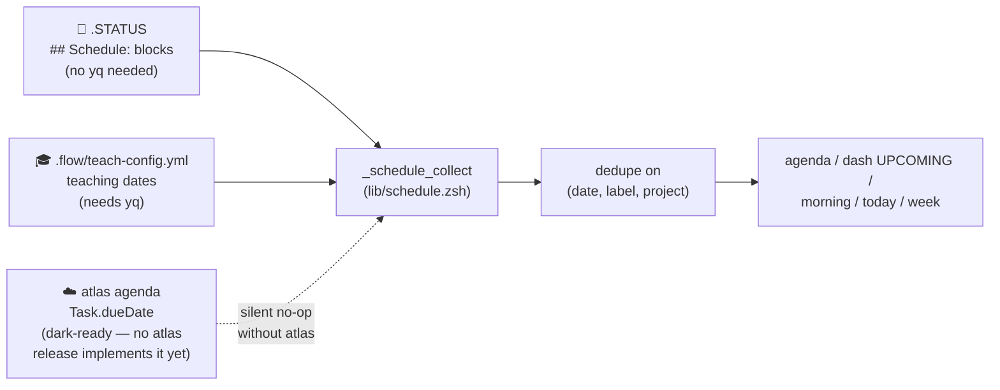

---
tags:
  - guides
  - commands
  - adhd
---

# 📅 Agenda & Schedule Guide

!!! tldr "What this gives you"
    A single forward-looking view of everything *due soon* across all your
    projects — assignment due dates, exam dates, manuscript/grant deadlines,
    milestones, and recurring blocks — so deadlines stop living siloed in
    course configs or in your head.

`dash`, `morning`, `today`, and `week` have always been present- and
backward-looking (status, current session, wins). The **agenda layer** adds the
missing forward-looking dimension, driven by one shared engine
(`lib/schedule.zsh`). It works fully **without atlas** and **without `yq`**.

---

## The `agenda` command

```bash
agenda                # Next 7 days + overdue (default)
agenda today          # Due today + overdue
agenda -w / --week    # Next 7 days (same as default)
agenda -m / --month   # Next 30 days (adds a LATER bucket)
agenda --all          # Everything, including holidays
agenda --overdue      # Overdue items only
agenda <filter>       # Filter by item type or project category (see below)
agenda -h             # Help
```

### Filtering

A filter argument matches a record's own **type** *or* the project's detected
**category** — whichever hits first:

| Filter | Matches |
|--------|---------|
| `research`, `teaching`, `general`, `recurring` | items with that **type** (`- … \| research`), in any project |
| `dev`, `r`, `teach`, `quarto`, `apps` | items in a project of that **category** |

So `agenda research` surfaces every item you tagged `| research` no matter which
project it lives in — a manuscript deadline kept in a `dev`-category repo still
shows up. `teach` and `teaching` are synonyms.

Items are grouped into **OVERDUE → TODAY → THIS WEEK → LATER** buckets, with
overdue surfaced loudly (🔥 colors first) and a calm empty state when nothing
is due:

```text
  📅 AGENDA (next 7 days)

  OVERDUE (1)
  🔬 overdue 3d  Submit JRSS-B revision (manuscript-x)

  TODAY (1)
  📌 today       Project beta milestone (app-y)

  THIS WEEK (2)
  🔬 in 2d       Advisor meeting 🔁 (study-z)
  🔁 in 4d       Grading window (stat-101)

  4 items • 'agenda -h' for options
```

### Aliases

| Alias | Expands to |
|-------|-----------|
| `agt` | `agenda today` |
| `agw` | `agenda -w` |
| `agm` | `agenda -m` |

!!! note "Why not `ag`?"
    `ag` collides with the silver-searcher binary, so the aliases are
    `agt`/`agw`/`agm`.

---

## Where items come from

Three sources feed the same engine and are merged, deduped, and rendered
identically no matter which surface you're looking at:



The dotted line marks the atlas source as **optional and currently inert** —
see [Atlas integration](#atlas-integration-optional-dark-ready) below. The
other two sources work fully without atlas and without `yq` (the teaching
path is the only one that needs `yq`; it's skipped gracefully when absent).

### 1. `## Schedule:` in a project's `.STATUS` (no `yq` needed)

Add a `## Schedule:` section to any project's `.STATUS` file:

```markdown
## Schedule:
- 2026-06-20 | Submit JRSS-B revision | research
- 2026-07-01 | Project beta milestone | general
- weekly:fri | Grading window | recurring
- weekly:mon | Advisor meeting | research
```

Grammar — one list item per line:

```text
- <when> | <label> [| <type>]
```

| Field | Values |
|-------|--------|
| `when`  | ISO date `YYYY-MM-DD`, or a recurring token `weekly:<dow>` (`mon`…`sun`) |
| `label` | Free text (must not contain `\|`) |
| `type`  | `teaching` · `research` · `general` · `recurring` (optional) |

If `type` is omitted it defaults to `general` for dated items and `recurring`
for `weekly:` tokens. The **project** is inferred from the directory name.
Unknown tokens are skipped silently — never fatal.

Recurring `weekly:<dow>` tokens are expanded into concrete dates within the
view's window (correctly across month and year boundaries).

### 2. Teaching dates from `.flow/teach-config.yml` (automatic)

For teaching projects, week start dates, exams, deadlines, and holidays are
read straight from your existing `.flow/teach-config.yml` via the teaching date
engine — no re-entry. This path uses `yq`; if `yq` is absent the rest of the
agenda still works, the teaching items are just skipped.

!!! warning "`weeks[].start_date` required"
    The teaching date loader reads `semester_info.weeks[].start_date`. A config
    that only has `weeks[].date` yields no week items.

Holidays are typed `holiday` and hidden unless you pass `--all`.

### 3. Atlas-tracked deadlines (dark-ready, optional)

A third source, `_schedule_atlas_items` (`lib/schedule.zsh`), reads
atlas-tracked deadlines (`Task.dueDate`) — things you track in atlas rather
than in a project's `.STATUS`. See
[Atlas integration](#atlas-integration-optional-dark-ready) below for details
and a real merged example. **No atlas release implements this yet** — until
it does, this source is a silent no-op and changes nothing about the two
sources above.

---

## Icons

| Icon | Meaning |
|------|---------|
| 🎓 | teaching |
| 🔬 | research |
| 📌 | general |
| 🔁 | recurring |
| 🏖️ | holiday (only with `--all`) |

A trailing 🔁 also flags a recurring item whose *type* isn't `recurring`
(e.g. a research weekly block).

---

## Where the schedule shows up

The same engine feeds every surface, so they all render consistently:

| Surface | What it adds |
|---------|--------------|
| `dash` | **UPCOMING** section (after QUICK WINS) — next 4 items, 7d + overdue; self-suppresses when empty. |
| `morning` | **Upcoming (next 7 days)** block — top 5; `morning -q` adds a `📅 N due soon` one-liner. |
| `today` | **📅 Due today** — today + overdue (window 0). |
| `week` | **📅 This week's deadlines** — 7 days, grouped by weekday (overdue first). |

Results are cached per session (date + window keyed, ~10 min TTL), so running
`agenda` and then `dash` reuses the work.

### What it looks like

The same items, surfaced by `today` (today + overdue) …

```text
📅 TODAY Wednesday, June 17

  📅 Due today
  🔬 overdue 3d  Submit JRSS-B revision (manuscript-x)
  📌 today       Project beta milestone (manuscript-x)
```

… and by `week` (7 days, grouped by weekday, overdue first):

```text
📊 WEEKLY REVIEW
Week of June 17, 2026

  📅 This week's deadlines:
     Overdue:
  🔬 overdue 3d  Submit JRSS-B revision (manuscript-x)
     Wednesday:
  📌 today       Project beta milestone (manuscript-x)
     Friday:
  🔬 in 2d       Advisor meeting (manuscript-x)
     Sunday:
  🔁 in 4d       Grading window (manuscript-x)
```

Same data, same icons and relative-day labels — just framed for the question
each command answers.

---

## Atlas integration (optional, dark-ready)

Atlas integration is two independent, opportunistic paths — a push (flow-cli
→ atlas, shipped) and a read (atlas → flow-cli, dark-ready as of v7.14.0).
Both degrade to a silent no-op without atlas; neither is required for
`agenda` to work.

### Push: flow-cli → atlas (shipped)

When atlas is installed **and** exposes a `schedule` subcommand, `agenda` pushes
the collected items opportunistically and asynchronously
(`atlas schedule push --format=json`). When atlas is absent — or present but
without that subcommand — the push is a silent no-op. flow-cli owns the model;
atlas is just a sync target.

### Read: atlas → flow-cli (dark-ready, v7.14.0)

`_schedule_atlas_items` (source #3 above) reads atlas-tracked deadlines back
into the engine via `atlas agenda <window-days> --format=json`, probed once per
session (`atlas agenda --help`) and cached. **No atlas release implements
`agenda` yet** — real atlas doesn't have the command, so this ships as tested,
capability-probed, inert code. Zero user-visible change until atlas ships it;
zero rework required here when it does.

Below is a real captured run (not a fabricated transcript) against a stub
`atlas` returning one deadline, merged alongside a `.STATUS` Schedule item and
a teaching week — this is what it looks like once atlas *does* implement
`agenda`:

```text
$ agenda -m

  📅 AGENDA (next 30 days)

  THIS WEEK (4)
  🔁 in 2d       Grading window (manuscript-x)
  🔬 in 4d       Submit JRSS-B revision (manuscript-x)
  🎓 in 5d       Week 1 (stat-101)
  🔬 in 7d       NIH progress report (manuscript-x)

  LATER (4)
  🔁 in 9d       Grading window (manuscript-x)
  🔁 in 16d      Grading window (manuscript-x)
  🔁 in 23d      Grading window (manuscript-x)
  🔁 in 30d      Grading window (manuscript-x)

  8 items • 'agenda -h' for options
```

"NIH progress report" is the only atlas-sourced item (`🔬`, same research
icon as any other research-typed record — the source is invisible to the
rendered output, by design). "Submit JRSS-B revision" and the weekly
"Grading window" come from `.STATUS`; "Week 1" comes from teach-config. If an
atlas record matches a local one exactly on `(date, label, project)`, it's
deduped — the local `.STATUS` record always wins.

See [ATLAS-CONTRACT](../ATLAS-CONTRACT.md) for the full `atlas agenda`
contract (request/response shape, capability probe).

---

## Examples

```bash
# Morning triage: what's on fire?
agenda --overdue

# Plan the month for a single research project
agenda -m research

# Quick glance without leaving your flow
agt            # just today
agw            # this week
```
