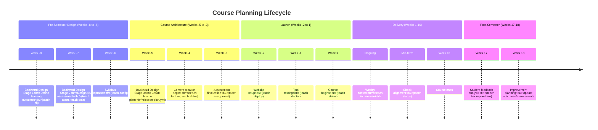
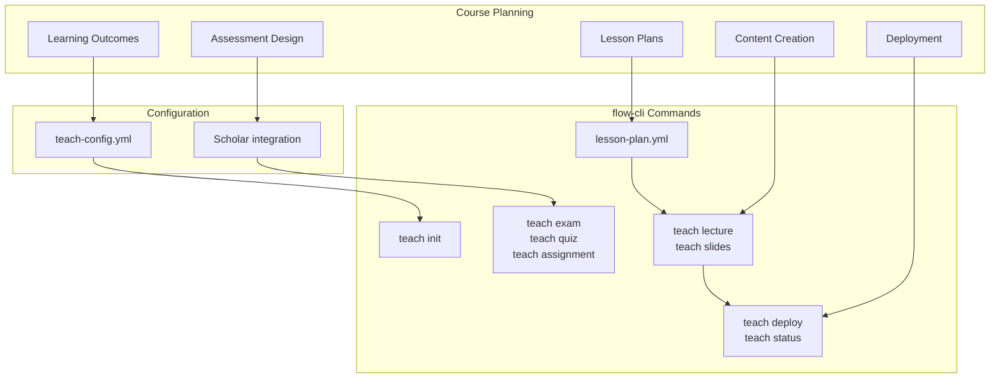
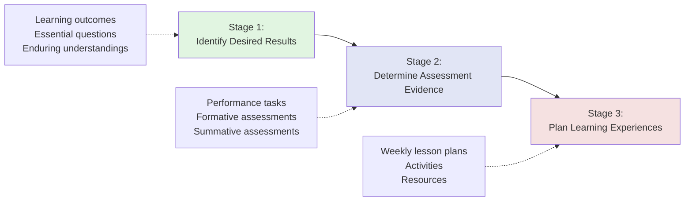
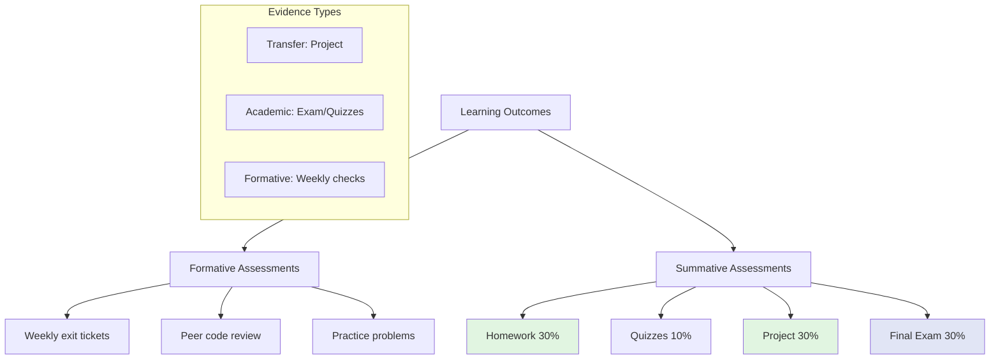
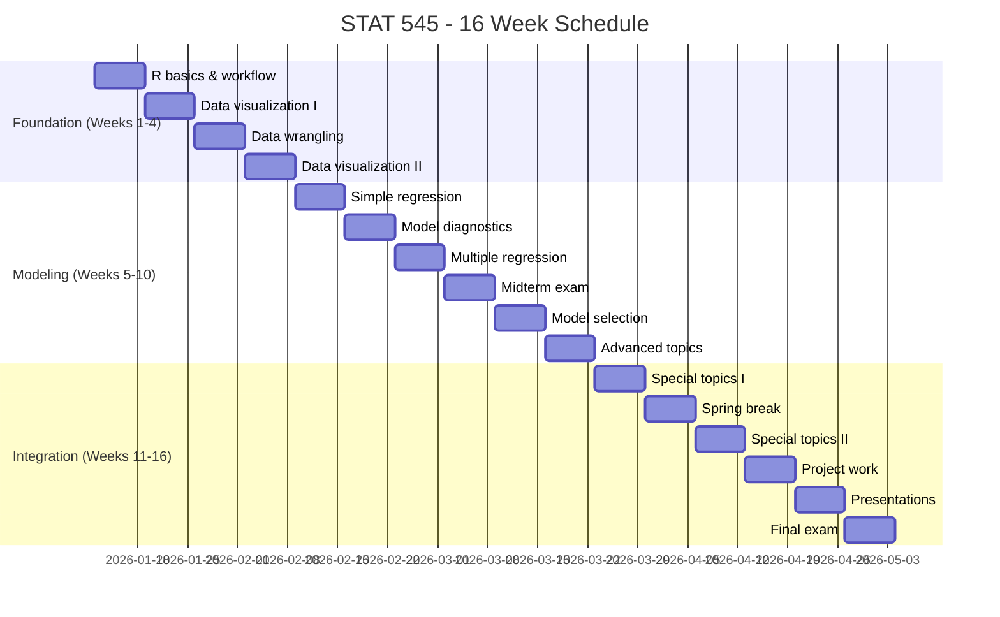

# Course Planning Best Practices: A Research-Based Guide

**Version:** v5.14.0
**Last Updated:** 2026-01-19
**Target Audience:** Instructors using flow-cli for systematic course design
**Status:** Phase 1 Complete (Sections 1-2)

---

## Table of Contents

### Phase 1: Foundation (Complete)
1. [Course Planning Overview](#1-course-planning-overview) ✅
2. [Backward Design Principles](#2-backward-design-principles) ✅

### Phase 2: Assessment & Outcomes (Future)
3. [Bloom's Taxonomy Integration](#3-blooms-taxonomy-integration) 🚧
4. [Syllabus Design](#4-syllabus-design) 🚧
5. [Assessment Design](#5-assessment-design) 🚧

### Phase 3: Planning & Content (Future)
6. [Grading Schema Design](#6-grading-schema-design) 🚧
7. [Lesson Planning](#7-lesson-planning) 🚧
8. [Content Creation with Scholar](#8-content-creation-with-scholar) 🚧

### Phase 4: Workflows & Timeline (Future)
9. [Course Timeline](#9-course-timeline) 🚧
10. [Semester Maintenance](#10-semester-maintenance) 🚧
11. [Quality Assurance](#11-quality-assurance) 🚧
12. [Continuous Improvement](#12-continuous-improvement) 🚧

### Appendices
- [A. Complete Course Templates](#appendix-a-complete-course-templates)
- [B. Alignment Matrix Templates](#appendix-b-alignment-matrix-templates)
- [C. Research Citations](#appendix-c-research-citations)
- [D. flow-cli Command Reference](#appendix-d-flow-cli-command-reference)

---

## Document Purpose

This guide synthesizes educational research on course design with practical implementation in the flow-cli teaching workflow. It provides:

- **Theoretical grounding** in backward design, Bloom's taxonomy, and assessment theory
- **Practical workflows** using flow-cli commands and configuration
- **Complete examples** from real courses (STAT 545 as primary)
- **Template courses** for different contexts (intro, intermediate, advanced)

**Balance:** 40% educational theory, 60% flow-cli implementation

---

## How to Use This Guide

### For First-Time Course Design
1. Read Sections 1-2 (Course Planning Overview + Backward Design)
2. Follow STAT 545 walkthrough in Section 2.5
3. Use templates in Appendix A as starting points
4. Implement using flow-cli commands documented in Section 8

### For Course Redesign
1. Start with Section 5 (Assessment Design) to audit alignment
2. Review Section 3 (Bloom's Taxonomy) to upgrade learning outcomes
3. Use Section 7 (Lesson Planning) to restructure weekly content
4. Apply Section 12 (Continuous Improvement) for data-driven changes

### For Specific Tasks
- **Writing learning outcomes** → Section 3.4
- **Creating assessments** → Section 5.3-5.5
- **Planning semester timeline** → Section 9
- **Setting up flow-cli** → Section 1.3 + Appendix D

---

# 1. Course Planning Overview

## 1.1 What is Systematic Course Planning?

**Definition:** Systematic course planning is an intentional, research-based approach to designing educational experiences that prioritizes learning outcomes and assessment alignment over content coverage.

### Why It Matters

Traditional course design often follows this pattern:

```
Content Selection → Delivery Planning → Assessment Creation → Outcomes (if any)
```

**Problems with this approach:**
- **Misalignment:** Assessments don't measure what was taught
- **Coverage obsession:** Too much content, insufficient depth
- **Activity-driven:** "I'll lecture on X" vs "Students will be able to Y"
- **Instructor stress:** Last-minute assessment creation, grading surprises
- **Student confusion:** Unclear expectations, perceived unfairness

**Systematic planning reverses this:**

```
Learning Outcomes → Assessment Design → Content Selection → Delivery Planning
```

**Benefits:**
- ✅ **Alignment:** Every activity supports measurable outcomes
- ✅ **Efficiency:** Eliminate content that doesn't serve outcomes
- ✅ **Clarity:** Students know expectations from day one
- ✅ **Reduced stress:** Assessments designed before semester starts
- ✅ **Better outcomes:** Research shows 20-30% improvement in learning gains¹

> ¹ Wiggins, G., & McTighe, J. (1998). *Understanding by Design*. ASCD.

### Key Principles

**Principle 1: Outcomes-Driven**
- Start with "What should students be able to do?"
- Not "What should I teach?"

**Principle 2: Assessment-Aligned**
- Design assessments that directly measure outcomes
- Assessments come *before* lesson planning

**Principle 3: Evidence-Based**
- Use research on learning (Bloom, Wiggins, Ambrose²)
- Apply cognitive science principles

**Principle 4: Iterative**
- Course design is never "finished"
- Continuous improvement based on data

> ² Ambrose, S. A., et al. (2010). *How Learning Works: Seven Research-Based Principles*. Jossey-Bass.

---

## 1.2 The Course Planning Lifecycle

Systematic course planning happens in five phases across a full academic year:



### Phase 1: Pre-Semester Design (8-6 weeks before)

**Focus:** Establish course architecture using backward design

**Activities:**
1. **Define learning outcomes** (3-5 course-level outcomes)
2. **Design assessments** that measure outcomes
3. **Create syllabus** with policies and grading schema

**flow-cli commands:**
```bash
# Initialize course structure
teach init "STAT 545" --config department-template.yml

# Set up configuration
vim .flow/teach-config.yml

# Health check
teach doctor --fix
```

**Deliverables:**
- `teach-config.yml` with course metadata
- Learning outcomes documented
- Assessment plan with point distribution
- Draft syllabus

**Time investment:** 10-15 hours

---

### Phase 2: Course Architecture (5-3 weeks before)

**Focus:** Plan learning experiences and create content

**Activities:**
1. **Create lesson plans** for all 16 weeks
2. **Develop content** (lectures, slides, code examples)
3. **Finalize assessments** (rubrics, solutions)
4. **Build course website**

**flow-cli commands:**
```bash
# Create lesson plan structure
vim lesson-plan.yml

# Generate content with Scholar
teach lecture "Week 5: Multiple Regression" --template quarto
teach slides "Introduction to R" --template typst
teach assignment "HW3: Data Wrangling" --template markdown

# Generate assessments
teach exam "Midterm 1" --scope "Weeks 1-8"
teach quiz "Week 3 Quiz" --topics "Probability, Distributions"
```

**Deliverables:**
- `lesson-plan.yml` with 16-week schedule
- Lecture materials for Weeks 1-4
- All assessments with rubrics
- Course website deployed to draft branch

**Time investment:** 30-40 hours

---

### Phase 3: Launch (2 weeks before to Week 1)

**Focus:** Finalize and deploy

**Activities:**
1. **Test all materials** (links, code, accessibility)
2. **Deploy website** to production
3. **Final validation** of environment

**flow-cli commands:**
```bash
# Preview deployment changes
teach deploy  # Shows diff, asks for confirmation

# Status check
teach status

# Verify environment
teach doctor
```

**Deliverables:**
- Production website live
- Week 1 materials fully tested
- Backup system verified

**Time investment:** 5-10 hours

---

### Phase 4: Delivery (Weeks 1-16)

**Focus:** Execute plan, monitor alignment

**Activities:**
1. **Weekly content releases** (Weeks 5-16 created on-demand)
2. **Assessment administration** (according to schedule)
3. **Mid-semester check-in** (alignment verification)

**flow-cli commands:**
```bash
# Weekly workflow
work stat-545
teach lecture "Week 7: Model Selection" --template quarto
teach deploy
finish "Add Week 7 lecture"

# Check status regularly
teach status

# Generate assessments
teach exam "Final Exam" --scope "Weeks 1-16"
```

**Deliverables:**
- Weekly content published on schedule
- Assessments administered and graded
- Student feedback collected (formative)

**Time investment:** 5-10 hours/week

---

### Phase 5: Post-Semester Reflection (Weeks 17-18)

**Focus:** Analyze outcomes, plan improvements

**Activities:**
1. **Analyze student feedback** (quantitative + qualitative)
2. **Review assessment data** (item analysis, grade distribution)
3. **Document improvements** for next iteration
4. **Archive semester** (keep important changes, remove drafts)

**flow-cli commands:**
```bash
# Archive semester
teach backup archive "Spring 2026"

# Review backups before cleanup
teach backup list
teach backup delete --retention semester  # Prompts for confirmation
```

**Deliverables:**
- Improvement plan document
- Updated learning outcomes (if needed)
- Revised assessment plan
- Archived semester materials

**Time investment:** 3-5 hours

---

## 1.3 Integration with flow-cli Teaching Workflow

The flow-cli teaching workflow is designed to support systematic course planning at every phase:

### Course Planning → flow-cli Mapping



### Key Configuration File: teach-config.yml

The `teach-config.yml` file is the central hub for course planning in flow-cli:

```yaml
course:
  name: "STAT 545"
  full_name: "Exploratory Data Analysis"
  semester: "Spring"
  year: 2026

scholar:
  course_info:
    level: "graduate"            # Determines content complexity
    field: "statistics"          # Influences examples, notation
    difficulty: "intermediate"   # Affects pacing, scaffolding
    credits: 4

  style:
    tone: "conversational"       # formal / conversational
    notation: "statistical"      # statistical / mathematical
    examples: true               # Include worked examples

  topics:                        # Used for exam scope auto-population
    - "Data visualization"
    - "Exploratory data analysis"
    - "Statistical graphics"
    # ... more topics

  grading:                       # Used for syllabus generation
    homework: 30
    quizzes: 10
    project: 30
    final: 30
```

**How it supports systematic planning:**

1. **Centralized metadata** - Course info in one place
2. **Scholar integration** - AI-powered content matches course style
3. **Consistency** - All generated content uses same configuration
4. **Versioned** - Tracked in git, changes documented

### Scholar Integration for Assessment Design

Scholar (flow-cli's AI-powered teaching assistant) uses your configuration to generate contextually appropriate content:

```bash
# Generate exam using course topics and style
teach exam "Midterm 1" --scope "Weeks 1-8" --template typst

# Scholar reads:
# - teach-config.yml (course level, field, difficulty)
# - lesson-plan.yml (weeks 1-8 topics and learning objectives)
# - Style preferences (tone, notation, examples)

# Output: Exam aligned with course outcomes and style
```

**Benefits:**
- ✅ Assessments match course difficulty level
- ✅ Questions use appropriate notation
- ✅ Examples aligned with course field
- ✅ Consistent tone across all materials

### Health Monitoring: teach doctor

Before each semester, validate your entire teaching environment:

```bash
teach doctor
```

**Checks:**
- ✅ Required dependencies (git, quarto, yq, gh)
- ✅ Optional tools (examark, claude)
- ✅ Project configuration validity
- ✅ Git setup (branches, remote, clean state)
- ✅ Scholar integration (API keys, config)

**Interactive fix mode:**
```bash
teach doctor --fix
# Prompts to install missing dependencies
# Creates missing configuration files
# Sets up git branches if needed
```

---

## 1.4 Common Pitfalls to Avoid

### Pitfall 1: Content-First Design

**Symptom:** "I need to cover chapters 1-12 in my textbook"

**Why it fails:**
- Coverage ≠ learning
- Students can't master 12 chapters in 16 weeks
- Leads to superficial understanding

**Solution:** Start with 3-5 learning outcomes, select content that serves them

**Example:**
❌ "Cover all of regression theory"
✅ "Students will be able to build, diagnose, and interpret regression models for real data"

---

### Pitfall 2: Assessment as Afterthought

**Symptom:** Creating midterm exam the week before it's scheduled

**Why it fails:**
- Misalignment with what was taught
- Poor item quality (rushed questions)
- Unfair to students (unclear expectations)

**Solution:** Design assessments in Phase 1 (8 weeks before semester)

**flow-cli workflow:**
```bash
# Week -8: Design all assessments
teach exam "Midterm 1" --scope "Weeks 1-8"
teach exam "Midterm 2" --scope "Weeks 9-14"
teach exam "Final Exam" --scope "Weeks 1-16"

# Save to exams/ directory
# Refine during Phase 2, but structure exists
```

---

### Pitfall 3: Ignoring Alignment

**Symptom:** Learning outcome says "analyze data" but exam only tests recall

**Why it fails:**
- Students study the wrong things
- Grades don't reflect true learning
- Perceived unfairness

**Solution:** Create alignment matrix (see Section 5.6)

**Example:**
| Outcome | Assessment Type | Bloom's Level |
|---------|----------------|---------------|
| Analyze data distributions | Homework #2, Midterm Q4-6 | Analyze (L4) |
| Interpret regression output | Homework #4, Final Q7-10 | Evaluate (L5) |

---

### Pitfall 4: No Backward Design

**Symptom:** Starting with "I'll lecture on topic X on day Y"

**Why it fails:**
- Activities chosen before knowing what students need to learn
- No clear connection between activities and outcomes

**Solution:** Use backward design (see Section 2)

**Three stages:**
1. **Desired Results** - What should students learn?
2. **Assessment Evidence** - How will we know they learned it?
3. **Learning Experiences** - What activities will help them learn?

---

# 2. Backward Design Principles

## 2.1 Understanding by Design Framework

**Backward design** is a framework for curriculum development created by Grant Wiggins and Jay McTighe in their seminal book *Understanding by Design* (1998)³.

> ³ Wiggins, G., & McTighe, J. (1998). *Understanding by Design*. ASCD. ISBN: 978-0871203492

### The Core Idea

Traditional course design is **forward-thinking**:
```
Content → Activities → Assessment → Hope for learning
```

Backward design is **outcome-focused**:
```
Learning Goals → Assessment → Activities → Guaranteed learning
```

**Why "backward"?**

We start at the **end** (what students should be able to do after the course) and work backwards to design experiences that get them there.

**Analogy:** Planning a road trip
- ❌ Forward: "Let's drive east and see where we end up"
- ✅ Backward: "We want to reach Boston, so let's plan the route"

### Three Stages (Overview)

The backward design process has three sequential stages:



**Stage 1: Identify Desired Results**
- What should students understand and be able to do?
- What big ideas and essential questions frame the course?

**Stage 2: Determine Assessment Evidence**
- How will we know if students achieved the outcomes?
- What tasks will reveal understanding?

**Stage 3: Plan Learning Experiences**
- What activities will help students learn?
- What sequence will build understanding progressively?

**Critical constraint:** You cannot start Stage 3 until Stages 1-2 are complete.

---

## 2.2 Stage 1: Identify Desired Results

**Goal:** Clarify what students should understand, know, and be able to do by the end of the course.

### Three Types of Learning Goals

Wiggins & McTighe distinguish three levels:

1. **Enduring Understandings** (most important)
   - Big ideas that remain after details are forgotten
   - Transferable to new contexts
   - Example: "Correlation does not imply causation"

2. **Important to Know and Do**
   - Key skills and concepts for the discipline
   - Necessary for enduring understanding
   - Example: "Calculate and interpret a regression coefficient"

3. **Worth Being Familiar With**
   - Supporting knowledge, terminology
   - May be forgotten, but useful in context
   - Example: "Names of common probability distributions"

**The mistake:** Treating everything as equally important

**The solution:** Prioritize ruthlessly - focus on enduring understandings

---

### Writing Course-Level Learning Outcomes

**Format:** "By the end of this course, students will be able to..."

**Guidelines:**
1. **Use action verbs** (Bloom's taxonomy - see Section 3)
2. **Make them measurable** (observable behaviors)
3. **Focus on higher-order thinking** (analyze, evaluate, create)
4. **Limit to 3-5 outcomes** (cognitive load)

**Template:**
```
Students will be able to [ACTION VERB] [OBJECT] in order to [PURPOSE/CONTEXT].
```

**Examples:**

✅ **Good outcome:**
> "Students will be able to **build and diagnose** regression models for real-world datasets in order to **inform decision-making** in applied settings."

**Why it works:**
- Action verbs: "build and diagnose" (Bloom's L5: Evaluate)
- Measurable: Can assess via project or exam
- Context: "real-world datasets", "decision-making"

❌ **Poor outcome:**
> "Students will understand regression."

**Why it fails:**
- "Understand" is not measurable (what does it look like?)
- Too vague (understand what about regression?)
- No context (understand for what purpose?)

---

### Essential Questions

Essential questions are **open-ended, provocative questions** that:
- Have no single correct answer
- Recur throughout the course
- Stimulate inquiry and discussion
- Connect to big ideas (enduring understandings)

**Examples:**

**For a statistics course:**
- "When should we trust data-driven decisions?"
- "How can we quantify uncertainty in real-world contexts?"
- "What makes a statistical model 'good'?"

**For a data science course:**
- "How do biases in data lead to biased algorithms?"
- "When is prediction more important than explanation?"

**Why they matter:**
- Frame the course around big ideas
- Give students mental "hooks" for organizing knowledge
- Encourage critical thinking beyond rote procedures

**flow-cli integration:**

Document essential questions in `teach-config.yml`:

```yaml
scholar:
  essential_questions:
    - "When should we trust data-driven decisions?"
    - "What makes a statistical model 'good enough'?"
    - "How can we communicate uncertainty to non-statisticians?"
```

Scholar uses these when generating exams and assignments to create conceptual questions that connect to big ideas.

---

### Flow-CLI Implementation: teach-config.yml

Map learning outcomes to `teach-config.yml`:

```yaml
course:
  name: "STAT 545"
  full_name: "Exploratory Data Analysis"

# Document learning outcomes (used by Scholar)
learning_outcomes:
  - id: "LO1"
    description: "Visualize and explore multivariate data using modern graphics"
    bloom_level: "analyze"
    assessments: ["HW1", "HW2", "Project"]

  - id: "LO2"
    description: "Build and diagnose regression models for real datasets"
    bloom_level: "evaluate"
    assessments: ["HW3", "HW4", "Midterm", "Final"]

  - id: "LO3"
    description: "Communicate statistical findings to technical and non-technical audiences"
    bloom_level: "create"
    assessments: ["Project", "Presentation"]

# Scholar uses these to generate aligned content
scholar:
  topics:
    - "Data visualization (ggplot2)"  # Supports LO1
    - "Regression modeling"           # Supports LO2
    - "Statistical communication"     # Supports LO3
```

**Benefits:**
- ✅ Outcomes documented and version-controlled
- ✅ Scholar generates content aligned with outcomes
- ✅ Easy to audit alignment (see which assessments measure each outcome)

---

## 2.3 Stage 2: Determine Assessment Evidence

**Goal:** Decide what evidence will demonstrate that students have achieved the learning outcomes.

### The Assessment Triangle

Wiggins & McTighe recommend three types of assessment evidence:

```
        Performance Tasks
        (Complex, authentic)
               ▲
              / \
             /   \
            /     \
           /       \
          /  VALID  \
         /  EVIDENCE \
        /_____________\
   Academic        Observations
   Prompts         & Self-Assessment
(Quizzes/Tests)    (Formative)
```

**Performance Tasks (Transfer Evidence)**
- Complex, authentic challenges
- Require transfer of learning to new contexts
- Examples: Research project, case study analysis, portfolio

**Academic Prompts (Knowledge Evidence)**
- Traditional tests and quizzes
- Measure recall and basic application
- Examples: Multiple choice, short answer, problem sets

**Observations & Self-Assessment (Formative Evidence)**
- Ongoing feedback during learning
- Low-stakes, inform instruction
- Examples: Exit tickets, peer review, self-reflection

**Principle:** Use **multiple sources of evidence** to triangulate understanding.

---

### GRASPS Framework for Performance Assessment

When designing performance tasks, use the GRASPS acronym⁴:

> ⁴ Wiggins, G., & McTighe, J. (2011). *The Understanding by Design Guide to Creating High-Quality Units*. ASCD.

**G - Goal**
- What should the student accomplish?
- Why is this task important?

**R - Role**
- What role does the student take?
- Who is the audience?

**A - Audience**
- Who is the student creating this for?
- Real-world context?

**S - Situation**
- What is the context/scenario?
- What constraints exist?

**P - Product/Performance**
- What will the student create?
- What form will it take?

**S - Standards**
- By what criteria will it be judged?
- What does excellence look like?

**Example: STAT 545 Final Project**

```markdown
## Final Project: Data Analysis Consulting Report

**G - Goal:** You will analyze a real dataset to answer a client's research question
and provide actionable recommendations.

**R - Role:** You are a statistical consultant hired by a nonprofit organization.

**A - Audience:** The nonprofit's executive director (non-technical) and
data team (technical).

**S - Situation:** The client has collected survey data but lacks expertise to
analyze it. They need recommendations before their board meeting in 3 weeks.

**P - Product:** You will deliver:
1. Technical report (for data team): full analysis, code, diagnostics
2. Executive summary (for director): 2-page plain-language findings

**S - Standards:** Your work will be evaluated on:
- Appropriateness of statistical methods (30%)
- Quality of visualizations and diagnostics (25%)
- Clarity of technical communication (25%)
- Effectiveness of executive summary (20%)
```

**Why GRASPS works:**
- Creates authentic context (not just "solve these problems")
- Makes expectations explicit (standards)
- Engages students (role-playing, real scenarios)

---

### Formative vs. Summative Assessment

**Formative Assessment (Assessment *for* Learning)**
- Purpose: Inform instruction, provide feedback
- Stakes: Low or no grade impact
- Timing: Throughout learning process
- Examples: Exit tickets, peer review drafts, practice problems

**Summative Assessment (Assessment *of* Learning)**
- Purpose: Measure achievement of outcomes
- Stakes: Contributes to final grade
- Timing: After learning period (end of unit, semester)
- Examples: Exams, final projects, graded assignments

**Best practice:** Use formative assessment **before** summative assessment

**Example progression:**
```
Week 1-2: Formative
├── Exit ticket: "What's one thing you're confused about?"
├── Practice problems (ungraded)
└── Peer review of draft homework

Week 3: Summative
└── Homework #1 (graded) - students are prepared
```

**flow-cli integration:**

```bash
# Formative assessment creation
teach quiz "Week 3 Practice Quiz" --topics "Probability" --ungraded

# Summative assessment creation
teach exam "Midterm 1" --scope "Weeks 1-8" --points 100
```

Set `--ungraded` flag for formative assessments, Scholar generates lower-stakes questions with immediate feedback.

---

### Assessment Alignment Matrix (Preview)

**Alignment matrix** maps learning outcomes to assessments:

| Learning Outcome | HW1 | HW2 | HW3 | Quiz1 | Midterm | Project | Final |
|------------------|-----|-----|-----|-------|---------|---------|-------|
| LO1: Visualize data | **R** | **M** | | | **M** | **M** | |
| LO2: Build models | | **I** | **R** | **R** | **M** | **M** | **M** |
| LO3: Communicate | | | **I** | | | **R** | **M** |

**Legend:**
- **I** = Introduced (first time, low stakes)
- **R** = Reinforced (practiced, graded)
- **M** = Mastered (expected proficiency, major assessment)

**Why it matters:**
- Ensures every outcome is assessed multiple times
- Reveals gaps (outcomes not assessed)
- Shows progression (I → R → M)

**flow-cli implementation:**

Document alignment in `teach-config.yml`:

```yaml
assessment_alignment:
  LO1:
    - assessment: "HW1"
      level: "R"
    - assessment: "HW2"
      level: "M"
    - assessment: "Midterm"
      level: "M"

  LO2:
    - assessment: "HW2"
      level: "I"
    - assessment: "HW3"
      level: "R"
    - assessment: "Project"
      level: "M"
```

Future feature: `teach alignment matrix` will generate visual matrix from config.

---

## 2.4 Stage 3: Plan Learning Experiences

**Goal:** Design activities and instructional sequence that help students achieve outcomes and succeed on assessments.

**Critical rule:** You cannot start Stage 3 until Stages 1-2 are complete.

**Why?** If you don't know where you're going (outcomes) and how you'll know you got there (assessments), you can't plan the journey (activities).

### WHERETO Framework

Wiggins & McTighe provide the WHERETO acronym for planning learning experiences⁵:

> ⁵ Wiggins, G., & McTighe, J. (2005). *Understanding by Design* (Expanded 2nd Edition). ASCD.

**W - Where and Why**
- Help students see the big picture
- Why is this worth learning?
- Where is this going?

**H - Hook and Hold**
- Engage students with provocative entry
- Essential questions, interesting problems

**E - Equip**
- Provide experiences, tools, and knowledge
- Build skills progressively

**R - Rethink, Reflect, Revise**
- Opportunities to rethink initial ideas
- Reflect on learning
- Revise work based on feedback

**E - Evaluate**
- Students self-assess and get feedback
- Ongoing formative assessment

**T - Tailored**
- Differentiation for varied learners
- Multiple entry points, scaffolding

**O - Organized**
- Logical progression
- Builds from simple to complex

**Example: Week 5 Lesson (Multiple Regression)**

```markdown
## Week 5: Multiple Regression

**W - Where/Why:**
- Essential question: "How can we isolate the effect of one variable while accounting for others?"
- Real-world context: Predicting home prices (price depends on size, location, age, etc.)

**H - Hook:**
- Show Simpson's paradox example: Correlation reverses when controlling for confounds
- Provocation: "Can we ever truly isolate a single variable's effect?"

**E - Equip:**
- Mini-lecture: Matrix notation for regression (20 min)
- Guided practice: Build model in R (30 min)
- Code examples: Diagnostics and interpretation (20 min)

**R - Reflect/Revise:**
- Exit ticket: "What surprised you about multiple regression vs simple regression?"
- Peer review: Swap code, check diagnostics
- Revise model based on feedback

**E - Evaluate:**
- Self-assessment: Can you explain what each coefficient means?
- Formative quiz (ungraded): 5 questions on interpretation

**T - Tailored:**
- Beginners: Provide starter code with comments
- Advanced: Add interaction terms, polynomial terms

**O - Organized:**
- Progression: Simple regression (Week 4) → Multiple regression (Week 5) → Model selection (Week 6)
```

**flow-cli implementation: lesson-plan.yml**

Translate WHERETO into structured lesson plan:

```yaml
weeks:
  - number: 5
    topic: "Multiple Regression"
    learning_objectives:
      - "Fit and interpret multiple regression models"
      - "Diagnose multicollinearity and model assumptions"
      - "Compare simple vs multiple regression for confounding"

    essential_question: "How can we isolate the effect of one variable while accounting for others?"

    hook:
      type: "paradox"
      description: "Simpson's paradox example - correlation reverses with controls"

    activities:
      - type: "lecture"
        duration: 20
        topic: "Matrix notation for regression"

      - type: "guided_practice"
        duration: 30
        topic: "Build multiple regression model in R"

      - type: "code_along"
        duration: 20
        topic: "Diagnostics and interpretation"

    formative_assessment:
      - "Exit ticket: What surprised you?"
      - "Peer code review: Check diagnostics"
      - "Ungraded quiz: 5 interpretation questions"

    resources:
      - "code/week-05-regression.R"
      - "data/housing-prices.csv"
      - "slides/week-05-slides.qmd"
```

**Scholar integration:**

When you run `teach lecture "Week 5: Multiple Regression"`, Scholar:
1. Reads `lesson-plan.yml` for Week 5
2. Extracts: topic, objectives, hook, essential question
3. Reads `teach-config.yml` for style preferences
4. Generates lecture content matching WHERETO structure

---

## 2.5 STAT 545 Backward Design Walkthrough

This section provides a complete worked example of backward design for STAT 545 (Exploratory Data Analysis), a graduate-level statistics course.

### Course Context

**Course:** STAT 545 - Exploratory Data Analysis
**Level:** Graduate (MS in Statistics)
**Credits:** 4
**Prerequisites:** Intro statistics, basic R programming
**Semester length:** 16 weeks
**Meeting pattern:** 2x per week (75 min each)

**Target audience:**
- Statistics MS students (year 1)
- Some PhD students from other disciplines
- Occasional advanced undergraduates

---

### Stage 1: Desired Results (Outcomes)

#### Step 1.1: Identify Enduring Understandings

**Big ideas that should remain after details are forgotten:**

1. "Data visualization is not just decoration - it's a tool for discovery and diagnosis"
2. "All models are wrong, but some are useful - the key is knowing when"
3. "Exploratory analysis informs confirmatory analysis, but they serve different purposes"
4. "Effective statistical communication requires tailoring to audience"

#### Step 1.2: Essential Questions

**Questions to frame the course:**

1. "How can we let data tell its story without imposing our preconceptions?"
2. "When should we trust a pattern we see in data?"
3. "What makes a data visualization 'good'?"
4. "How do we balance model complexity with interpretability?"

#### Step 1.3: Write Course-Level Learning Outcomes

**By the end of this course, students will be able to:**

**LO1: Visualize and Explore**
> "Create and interpret sophisticated visualizations of multivariate data using modern graphics (ggplot2, interactive plots) to identify patterns, outliers, and relationships."

- **Bloom's level:** Analyze (L4)
- **Why:** Core skill for EDA, transferable to any statistical work
- **Measurable:** Can assess via homeworks and project visualizations

**LO2: Build and Diagnose Models**
> "Fit, diagnose, and refine regression models for real-world datasets, including assessment of assumptions, identification of influential points, and model comparison."

- **Bloom's level:** Evaluate (L5)
- **Why:** Moves beyond "run lm()" to critical evaluation
- **Measurable:** Exam questions, project diagnostics

**LO3: Communicate Findings**
> "Communicate statistical analyses effectively to both technical and non-technical audiences through written reports, visualizations, and oral presentations."

- **Bloom's level:** Create (L6)
- **Why:** Enduring professional skill
- **Measurable:** Project report and presentation

**LO4: Wrangle Complex Data**
> "Transform and prepare messy real-world data for analysis using tidy data principles and modern R tools (dplyr, tidyr)."

- **Bloom's level:** Apply (L3)
- **Why:** Necessary foundation for all other outcomes
- **Measurable:** Homework data cleaning tasks

---

### Stage 2: Assessment Evidence (Design Assessments)

#### Step 2.1: Assessment Strategy Overview



#### Step 2.2: Design Performance Task (Project)

**Using GRASPS framework:**

```markdown
## Final Project: Exploratory Data Analysis Consulting Report

**Goal:** Conduct a comprehensive exploratory data analysis to inform a client's
research question and provide statistical recommendations.

**Role:** Statistical consultant for a research team

**Audience:**
- Technical report → Research team (PhD-level researchers)
- Executive summary → Funding agency (non-technical)

**Situation:** A research team has collected observational data but needs guidance on:
1. What patterns exist in the data?
2. What statistical models are appropriate?
3. What concerns (outliers, violations, confounds) should they address?

**Product:**
1. Technical report (15-20 pages): Full EDA, visualizations, model diagnostics
2. Executive summary (2 pages): Key findings in plain language
3. R code (reproducible, well-documented)
4. Oral presentation (15 min)

**Standards (Rubric):**
- Data wrangling & preparation (15%)
- Quality of visualizations (25%)
- Appropriateness of statistical methods (20%)
- Diagnostics & model evaluation (20%)
- Technical writing clarity (10%)
- Executive summary effectiveness (10%)
```

**Alignment with outcomes:**
- LO1 (Visualize): 25% weight on visualization quality
- LO2 (Models): 40% weight on methods + diagnostics
- LO3 (Communicate): 20% weight on writing + summary
- LO4 (Wrangle): 15% weight on data preparation

**Assessment type:** Performance task (transfer evidence) - requires applying all course skills to novel dataset.

---

#### Step 2.3: Design Academic Assessments (Homework)

**Four homework assignments** (30% of grade total, 7.5% each)

Each homework targets 1-2 learning outcomes and progressively builds skills:

**HW1: Data Visualization (Weeks 1-3)**
- **Aligns with:** LO1 (Visualize), LO4 (Wrangle)
- **Tasks:**
  1. Load and clean messy CSV dataset
  2. Create 5 visualizations (univariate, bivariate, multivariate)
  3. Write interpretive captions for each plot
  4. Identify potential outliers and data quality issues
- **Scaffolding:** Template code provided, students fill in key sections
- **Assessment type:** Academic prompt (apply skills)

**HW2: Advanced Visualization (Weeks 4-6)**
- **Aligns with:** LO1 (Visualize), LO3 (Communicate)
- **Tasks:**
  1. Create publication-quality figures using ggplot2 themes
  2. Build interactive visualization (plotly or shiny)
  3. Design visualization for non-technical audience
  4. Critique poor visualizations and propose improvements
- **Scaffolding:** Less templating, more independent problem-solving
- **Assessment type:** Academic prompt + communication

**HW3: Regression Modeling (Weeks 7-10)**
- **Aligns with:** LO2 (Models), LO4 (Wrangle)
- **Tasks:**
  1. Fit simple and multiple regression models
  2. Check all assumptions (linearity, normality, homoscedasticity)
  3. Identify and handle influential points
  4. Compare models using AIC, BIC, cross-validation
- **Scaffolding:** Minimal - students design approach
- **Assessment type:** Academic prompt (evaluate models)

**HW4: Model Refinement (Weeks 11-13)**
- **Aligns with:** LO2 (Models), LO3 (Communicate)
- **Tasks:**
  1. Build regression model for complex dataset
  2. Handle missing data, transformations, interactions
  3. Write methods section explaining modeling decisions
  4. Create diagnostic plots with interpretations
- **Scaffolding:** None - preparation for final project
- **Assessment type:** Performance task (mini-project)

**Progression pattern:**
```
HW1 (Intro) → HW2 (Reinforce) → HW3 (Intro) → HW4 (Reinforce) → Project (Master)
   |              |                 |              |                    |
 Visualize     Visualize         Models         Models            All LOs
```

---

#### Step 2.4: Design Academic Assessments (Exams)

**Midterm Exam (15% of grade, Week 8)**
- **Aligns with:** LO1 (Visualize), LO2 (Models), LO4 (Wrangle)
- **Format:** In-class, 75 minutes, partial notes allowed
- **Question types:**
  - Short answer: Interpret visualizations (20%)
  - Problem solving: Calculate regression quantities (30%)
  - Code reading: Debug/complete R code (25%)
  - Conceptual: Explain when methods apply (25%)
- **Why midterm:** Formative feedback before final project

**Final Exam (30% of grade, Finals week)**
- **Aligns with:** All LOs (comprehensive)
- **Format:** In-class, 2 hours, full notes allowed
- **Question types:**
  - Data analysis scenario: Full EDA workflow (40%)
  - Model comparison: Evaluate competing models (30%)
  - Communication: Write executive summary of results (15%)
  - Conceptual: Essential questions reflection (15%)
- **Cumulative but emphasizes Weeks 9-16**

**Why exams matter:**
- Verify individual learning (vs group project)
- Test foundational knowledge needed for project
- Lower stakes than project (can recover from mistakes)

---

#### Step 2.5: Design Formative Assessments

**Weekly exit tickets** (ungraded, but completion tracked)
- "What's the muddiest point from today?"
- "Write one question you have about [topic]"
- Purpose: Identify gaps, adjust next lecture

**Peer code review** (Weeks 4, 7, 10, 13)
- Students swap homework code before submission
- Provide feedback using rubric
- Purpose: Learn from others' approaches, practice code reading

**Practice quizzes** (Weeks 2, 5, 9, 12)
- 5-10 questions, unlimited attempts
- Immediate feedback with explanations
- Purpose: Self-assessment, identify weak areas

**Why formative matters:**
- Catches misunderstandings early (before summative assessment)
- Reduces anxiety (low stakes practice)
- Metacognition (students monitor their own learning)

---

#### Step 2.6: Create Alignment Matrix

Map each learning outcome to assessments:

| Learning Outcome | HW1 | HW2 | HW3 | HW4 | Midterm | Project | Final |
|------------------|-----|-----|-----|-----|---------|---------|-------|
| **LO1: Visualize data** | **R** 15% | **M** 20% | | | **R** 10% | **M** 25% | **R** 15% |
| **LO2: Build models** | | | **R** 20% | **M** 25% | **R** 20% | **M** 20% | **M** 30% |
| **LO3: Communicate** | | **I** 5% | | **R** 10% | | **M** 10% | **R** 15% |
| **LO4: Wrangle data** | **I** 10% | | **R** 10% | | | **R** 15% | |

**Legend:**
- **I** = Introduced (first exposure, low stakes)
- **R** = Reinforced (practiced, graded feedback)
- **M** = Mastered (expected proficiency, major assessment)
- Percentages = Weight in that assessment

**Quality check:**
- ✅ Every outcome assessed at least 3 times
- ✅ Progression from I → R → M
- ✅ Multiple assessment types (homework, exam, project)
- ✅ Opportunities for improvement (early mistakes recoverable)

**flow-cli implementation:**

Document this matrix in `teach-config.yml`:

```yaml
assessment_alignment:
  LO1:
    - assessment: "HW1"
      level: "R"
      weight: 15
    - assessment: "HW2"
      level: "M"
      weight: 20
    - assessment: "Midterm"
      level: "R"
      weight: 10
    - assessment: "Project"
      level: "M"
      weight: 25
    - assessment: "Final"
      level: "R"
      weight: 15

  LO2:
    - assessment: "HW3"
      level: "R"
      weight: 20
    - assessment: "HW4"
      level: "M"
      weight: 25
    - assessment: "Midterm"
      level: "R"
      weight: 20
    - assessment: "Project"
      level: "M"
      weight: 20
    - assessment: "Final"
      level: "M"
      weight: 30

  LO3:
    - assessment: "HW2"
      level: "I"
      weight: 5
    - assessment: "HW4"
      level: "R"
      weight: 10
    - assessment: "Project"
      level: "M"
      weight: 10
    - assessment: "Final"
      level: "R"
      weight: 15

  LO4:
    - assessment: "HW1"
      level: "I"
      weight: 10
    - assessment: "HW3"
      level: "R"
      weight: 10
    - assessment: "Project"
      level: "R"
      weight: 15
```

**Future feature:** Generate matrix visualization

```bash
teach alignment matrix --output png
# Creates: docs/alignment-matrix.png
```

---

### Stage 3: Plan Learning Experiences

Now that we know **what students should learn** (Stage 1) and **how we'll know they learned it** (Stage 2), we can plan **how to help them learn** (Stage 3).

#### Step 3.1: Map Topics to Weeks (16-week schedule)

**Principle:** Logical progression from foundational to advanced



**Scaffolding strategy:**
- **Weeks 1-4:** Build foundational skills (visualize, wrangle)
- **Weeks 5-10:** Core statistical methods (regression, diagnostics)
- **Weeks 11-13:** Advanced/special topics (student choice)
- **Weeks 14-16:** Integration (project, synthesis)

---

#### Step 3.2: Design Individual Lessons (Week 5 Example)

**Week 5: Simple Linear Regression**

**WHERETO Implementation:**

```yaml
# lesson-plan.yml (Week 5)
weeks:
  - number: 5
    topic: "Simple Linear Regression"

    # W - Where/Why
    big_idea: "Quantify relationships between variables using linear models"
    essential_question: "When can we trust a linear relationship?"
    real_world_context: "Predicting outcomes (salary from education, health from exercise)"

    # Learning objectives (from Stage 1)
    learning_objectives:
      - "Fit simple linear regression models in R"
      - "Interpret slope and intercept coefficients"
      - "Assess model fit using R², residual plots"
      - "Identify situations where linear models fail"

    # H - Hook
    hook:
      type: "provocative_example"
      description: "Show Anscombe's quartet - four datasets with identical regression lines but wildly different patterns"
      activity: "Poll: Which dataset should we trust? Why?"

    # E - Equip (activities)
    activities:
      - time: "0-20"
        type: "mini_lecture"
        topic: "Theory: Least squares estimation"
        materials: ["slides/week-05-theory.qmd"]

      - time: "20-50"
        type: "live_coding"
        topic: "Fit lm() in R, interpret output"
        materials: ["code/week-05-demo.R", "data/advertising.csv"]
        participation: "Students code along"

      - time: "50-65"
        type: "group_practice"
        topic: "Diagnose model assumptions with residual plots"
        scaffolding: "Template code with TODOs"

      - time: "65-75"
        type: "discussion"
        topic: "When does linear regression fail? (Anscombe's quartet revisited)"

    # R - Reflect/Revise
    reflection:
      - type: "exit_ticket"
        prompt: "What's one thing that surprised you about regression?"
      - type: "peer_review"
        activity: "Share residual plots, discuss what they reveal"

    # E - Evaluate
    formative_assessment:
      - type: "self_check"
        questions:
          - "Can you explain what R² means in plain English?"
          - "Can you identify non-linearity from a residual plot?"
      - type: "practice_quiz"
        link: "quizzes/week-05-practice.qmd"
        ungraded: true

    # T - Tailored
    differentiation:
      beginners:
        - "Provide annotated starter code"
        - "Focus on interpretation over math"
      advanced:
        - "Challenge: Derive least squares solution"
        - "Explore: Robust regression alternatives"

    # O - Organized (connections)
    builds_on: ["Week 3: Correlation", "Week 4: Data visualization"]
    prepares_for: ["Week 6: Model diagnostics", "Week 7: Multiple regression"]

    # Resources
    materials:
      lectures: "lectures/week-05-regression.qmd"
      slides: "slides/week-05-slides.qmd"
      code: "code/week-05-regression.R"
      data: "data/advertising.csv"
      homework: "homework/hw3-regression.qmd"
```

**Scholar integration:**

When you run `teach lecture "Week 5: Simple Regression"`, Scholar:
1. Reads this `lesson-plan.yml` entry
2. Extracts: objectives, hook, essential question, activities
3. Reads `teach-config.yml` for course style (formal vs conversational)
4. Generates lecture content that follows WHERETO structure

---

#### Step 3.3: Weekly Lesson Plans for Full Semester

**Weeks 1-16 Overview:**

```markdown
## STAT 545 - Full Semester Plan

### Unit 1: Foundations (Weeks 1-4)

**Week 1: R Basics & Workflow**
- LOs: Navigate RStudio, run R code, understand reproducibility
- Hook: "Why do research results fail to replicate?"
- Assessments: None (onboarding week)

**Week 2: Data Visualization I**
- LOs: Create basic ggplot2 visualizations
- Hook: Anscombe's quartet, Datasaurus Dozen
- Assessments: HW1 assigned (due Week 4)

**Week 3: Data Wrangling**
- LOs: Transform data with dplyr (filter, select, mutate, summarize)
- Hook: Messy real-world dataset (FiveThirtyEight data)
- Assessments: None

**Week 4: Data Visualization II**
- LOs: Advanced ggplot2 (facets, themes, annotations)
- Hook: "Recreate a New York Times visualization"
- Assessments: HW1 due, HW2 assigned (due Week 6)

---

### Unit 2: Statistical Modeling (Weeks 5-10)

**Week 5: Simple Linear Regression**
- LOs: Fit, interpret, assess simple regression
- Hook: Anscombe's quartet
- Assessments: None

**Week 6: Model Diagnostics**
- LOs: Check assumptions, identify influential points
- Hook: "Case study: When good models go bad"
- Assessments: HW2 due

**Week 7: Multiple Regression**
- LOs: Fit models with multiple predictors, interpret coefficients
- Hook: Simpson's paradox
- Assessments: HW3 assigned (due Week 10)

**Week 8: Midterm Exam**
- Covers: Weeks 1-7 (visualization, wrangling, basic regression)
- Format: In-class, 75 min, partial notes
- Assessments: Midterm (15%)

**Week 9: Model Selection**
- LOs: Compare models using AIC, BIC, cross-validation
- Hook: "Bias-variance tradeoff visualization"
- Assessments: None

**Week 10: Interactions & Transformations**
- LOs: Model non-linear relationships, interpret interactions
- Hook: "When do two variables work together vs separately?"
- Assessments: HW3 due, HW4 assigned (due Week 13)

---

### Unit 3: Integration & Advanced Topics (Weeks 11-16)

**Week 11: Missing Data**
- LOs: Understand missingness mechanisms, imputation methods
- Hook: "Real dataset with 30% missing - what do we do?"
- Assessments: None

**Week 12: SPRING BREAK**
- No class

**Week 13: Specialized Regression (GLMs)**
- LOs: Logistic regression for binary outcomes
- Hook: "Predict creditworthiness - can we use linear regression?"
- Assessments: HW4 due, Project assigned (due Week 15)

**Week 14: Project Work Session**
- In-class: Work on projects, instructor consultations
- Assessments: Project draft due (optional peer review)

**Week 15: Project Presentations**
- Each student presents 15-min analysis
- Assessments: Presentations (part of project grade)

**Week 16: Course Synthesis & Final Exam**
- Lecture: "What have we learned? Revisiting essential questions"
- Assessments: Final exam (30%), Project report due

```

**Alignment check:**
- ✅ Every week builds toward learning outcomes
- ✅ Assessments spaced appropriately (not all at once)
- ✅ Scaffolding: Simple → Complex
- ✅ Integration: Final project synthesizes all skills

---

## 2.6 Complete STAT 545 teach-config.yml

Here's the complete configuration file that implements Stages 1-3:

```yaml
# STAT 545 Teaching Configuration
# Version: 3.0 (Backward Design Implementation)
# Generated: 2026-01-19

# =============================================================================
# COURSE INFORMATION
# =============================================================================

course:
  name: "STAT 545"
  full_name: "Exploratory Data Analysis"
  semester: "Spring"
  year: 2026
  instructor: "Dr. Jane Smith"

# Semester schedule
semester_info:
  start_date: "2026-01-12"
  end_date: "2026-04-27"
  breaks:
    - name: "Spring Break"
      start: "2026-03-30"
      end: "2026-04-03"

# =============================================================================
# STAGE 1: DESIRED RESULTS (Backward Design)
# =============================================================================

# Enduring understandings (big ideas)
enduring_understandings:
  - "Data visualization is a tool for discovery and diagnosis, not decoration"
  - "All models are wrong, but some are useful - knowing when is the key"
  - "Exploratory analysis informs confirmatory analysis, but they serve different purposes"
  - "Effective communication requires tailoring to audience"

# Essential questions (frame the course)
essential_questions:
  - "How can we let data tell its story without imposing preconceptions?"
  - "When should we trust a pattern we see in data?"
  - "What makes a data visualization 'good'?"
  - "How do we balance model complexity with interpretability?"

# Learning outcomes (what students will be able to do)
learning_outcomes:
  - id: "LO1"
    description: "Visualize and explore multivariate data using modern graphics (ggplot2, interactive plots) to identify patterns, outliers, and relationships"
    bloom_level: "analyze"
    verb: "create and interpret"

  - id: "LO2"
    description: "Build, diagnose, and refine regression models for real-world datasets, including assessment of assumptions and model comparison"
    bloom_level: "evaluate"
    verb: "evaluate"

  - id: "LO3"
    description: "Communicate statistical analyses effectively to technical and non-technical audiences through reports and presentations"
    bloom_level: "create"
    verb: "communicate"

  - id: "LO4"
    description: "Transform and prepare messy real-world data using tidy data principles and modern R tools"
    bloom_level: "apply"
    verb: "transform"

# =============================================================================
# STAGE 2: ASSESSMENT EVIDENCE (Backward Design)
# =============================================================================

# Grading schema (summative assessments)
grading:
  homework: 30      # HW1-4 (7.5% each)
  quizzes: 0        # Formative only (ungraded)
  midterm: 15       # Week 8
  project: 30       # Weeks 14-16
  final_exam: 30    # Week 16
  participation: 0  # Tracked but not graded

# Assessment alignment matrix
assessment_alignment:
  LO1:  # Visualize data
    - assessment: "HW1"
      level: "R"
      weight: 15
    - assessment: "HW2"
      level: "M"
      weight: 20
    - assessment: "Midterm"
      level: "R"
      weight: 10
    - assessment: "Project"
      level: "M"
      weight: 25
    - assessment: "Final"
      level: "R"
      weight: 15

  LO2:  # Build models
    - assessment: "HW3"
      level: "R"
      weight: 20
    - assessment: "HW4"
      level: "M"
      weight: 25
    - assessment: "Midterm"
      level: "R"
      weight: 20
    - assessment: "Project"
      level: "M"
      weight: 20
    - assessment: "Final"
      level: "M"
      weight: 30

  LO3:  # Communicate
    - assessment: "HW2"
      level: "I"
      weight: 5
    - assessment: "HW4"
      level: "R"
      weight: 10
    - assessment: "Project"
      level: "M"
      weight: 10
    - assessment: "Final"
      level: "R"
      weight: 15

  LO4:  # Wrangle data
    - assessment: "HW1"
      level: "I"
      weight: 10
    - assessment: "HW3"
      level: "R"
      weight: 10
    - assessment: "Project"
      level: "R"
      weight: 15

# =============================================================================
# STAGE 3: LEARNING EXPERIENCES (Backward Design)
# See lesson-plan.yml for detailed weekly plans
# =============================================================================

# =============================================================================
# SCHOLAR INTEGRATION (AI-powered content generation)
# =============================================================================

scholar:
  course_info:
    level: "graduate"
    field: "statistics"
    difficulty: "intermediate"
    credits: 4

  style:
    tone: "conversational"
    notation: "statistical"
    examples: true

  topics:
    - "Data visualization (ggplot2)"
    - "Data wrangling (dplyr, tidyr)"
    - "Simple linear regression"
    - "Multiple regression"
    - "Model diagnostics"
    - "Model selection"
    - "Interactions and transformations"
    - "Missing data"
    - "Generalized linear models"
    - "Statistical communication"

# =============================================================================
# DEPLOYMENT
# =============================================================================

branches:
  draft: "draft"
  production: "production"

deployment:
  web:
    type: "github-pages"
    branch: "production"
    url: "https://data-wise.github.io/stat-545"
```

---

## 2.7 STAT 545 lesson-plan.yml (Week 5 Example)

Complete lesson plan implementing WHERETO framework:

```yaml
# STAT 545 Lesson Plans
# Backward Design Stage 3 Implementation

course: "STAT 545"
semester: "Spring 2026"

# =============================================================================
# WEEK 5: SIMPLE LINEAR REGRESSION
# =============================================================================

weeks:
  - number: 5
    dates:
      start: "2026-02-09"
      end: "2026-02-13"

    topic: "Simple Linear Regression"

    # WHERETO: W - Where/Why
    big_idea: "Quantify relationships between continuous variables using linear models"
    essential_question: "When can we trust a linear relationship in data?"
    real_world_context: "Predicting outcomes (salary from education, sales from advertising spend)"

    # Learning objectives (from LO2)
    learning_objectives:
      - "Fit simple linear regression models using lm() in R"
      - "Interpret slope and intercept coefficients in context"
      - "Assess model fit using R², residual standard error"
      - "Identify situations where linear models fail (non-linearity)"

    # WHERETO: H - Hook
    hook:
      type: "provocative_visualization"
      description: "Anscombe's quartet - four datasets with identical regression statistics (same slope, R²) but completely different patterns"
      activity: "Poll: Which of these four datasets should we trust? Why or why not?"
      materials: "demos/anscombes-quartet.R"

    # WHERETO: E - Equip (Class 1 - Monday)
    class1:
      duration: 75  # minutes

      segments:
        - time: "0-5"
          type: "review"
          topic: "Last week: Correlation vs causation"

        - time: "5-25"
          type: "mini_lecture"
          topic: "Theory: Least squares estimation, interpretation"
          materials: "slides/week-05-theory.qmd"
          key_points:
            - "Regression line minimizes sum of squared residuals"
            - "Slope = change in Y per unit change in X"
            - "Intercept = predicted Y when X = 0 (may not be meaningful)"

        - time: "25-55"
          type: "live_coding"
          topic: "Fit lm() in R, interpret output"
          materials: "code/week-05-live-demo.R"
          dataset: "data/advertising.csv"
          student_participation: "code_along"
          learning_checks:
            - "Can students run lm() and extract coefficients?"
            - "Can they explain what the slope means?"

        - time: "55-70"
          type: "group_practice"
          topic: "Hands-on: Fit your own regression model"
          scaffolding: "Template R script with guided questions"
          groups: "pairs"

        - time: "70-75"
          type: "exit_ticket"
          prompt: "What's one thing that surprised you about regression? What's one question you still have?"

    # Class 2 - Wednesday
    class2:
      duration: 75

      segments:
        - time: "0-10"
          type: "recap"
          topic: "Address exit ticket questions from Monday"

        - time: "10-30"
          type: "mini_lecture"
          topic: "Model assessment: R², residual plots"
          materials: "slides/week-05-assessment.qmd"

        - time: "30-60"
          type: "live_coding"
          topic: "Create and interpret residual plots"
          focus: "Identify non-linearity, heteroscedasticity, outliers"
          student_participation: "code_along"

        - time: "60-70"
          type: "discussion"
          topic: "When regression fails: Revisit Anscombe's quartet"
          activity: "Diagnose which datasets violate assumptions"

        - time: "70-75"
          type: "preview"
          topic: "Next week: Model diagnostics deep dive"

    # WHERETO: R - Reflect/Revise
    reflection_activities:
      - type: "exit_ticket"
        frequency: "both_classes"
        purpose: "Identify muddiest points"

      - type: "peer_code_review"
        timing: "end_of_week"
        activity: "Share residual plots, discuss what they reveal"

    # WHERETO: E - Evaluate (formative)
    formative_assessment:
      - type: "self_check_questions"
        questions:
          - "Can you explain what R² means in plain English?"
          - "Can you identify non-linearity from a residual plot?"
          - "Can you interpret a regression coefficient in context?"

      - type: "practice_quiz"
        file: "quizzes/week-05-practice.qmd"
        ungraded: true
        attempts: "unlimited"
        feedback: "immediate"

    # WHERETO: T - Tailored (differentiation)
    differentiation:
      beginners:
        - "Provide heavily annotated starter code"
        - "Focus on interpretation over mathematical derivation"
        - "Office hours: Walk through examples step-by-step"

      advanced:
        - "Challenge problem: Derive least squares solution mathematically"
        - "Explore: Robust regression methods (MASS::rlm)"
        - "Read: Chapter on weighted least squares"

    # WHERETO: O - Organized (connections)
    builds_on:
      - "Week 3: Correlation and covariance"
      - "Week 4: Scatterplot visualization"

    prepares_for:
      - "Week 6: Advanced diagnostics (Cook's distance, leverage)"
      - "Week 7: Multiple regression"

    # Resources
    materials:
      lectures: "lectures/week-05-regression.qmd"
      slides_theory: "slides/week-05-theory.qmd"
      slides_assessment: "slides/week-05-assessment.qmd"
      code_demo: "code/week-05-live-demo.R"
      code_practice: "code/week-05-practice-template.R"
      data: "data/advertising.csv"
      quiz: "quizzes/week-05-practice.qmd"

    # Homework connection
    homework:
      assignment: "HW3"
      assigned_week: 7  # Not yet, Week 5 is too early
      due_week: 10
      alignment: ["LO2: Build models", "LO4: Wrangle data"]
```

---

## 2.8 Backward Design Verification Checklist

Before moving to implementation, verify your backward design:

### Stage 1 Checklist

- [ ] **3-5 learning outcomes** defined (not too many)
- [ ] **Outcomes use action verbs** (Bloom's taxonomy)
- [ ] **Outcomes are measurable** (observable behaviors)
- [ ] **Essential questions identified** (2-4 big questions)
- [ ] **Enduring understandings** documented (what remains after details fade)

### Stage 2 Checklist

- [ ] **Performance task designed** (complex, authentic)
- [ ] **GRASPS elements present** (Goal, Role, Audience, Situation, Product, Standards)
- [ ] **Multiple assessment types** (performance, academic, formative)
- [ ] **Alignment matrix created** (every LO assessed 3+ times)
- [ ] **Progression I→R→M** (introduce, reinforce, master)
- [ ] **Formative assessments planned** (weekly feedback loops)

### Stage 3 Checklist

- [ ] **Weekly lesson plans complete** (all 16 weeks)
- [ ] **WHERETO framework applied** (each week addresses W-H-E-R-E-T-O)
- [ ] **Scaffolding identified** (builds from simple to complex)
- [ ] **Connections explicit** (builds-on, prepares-for)
- [ ] **Differentiation planned** (support for diverse learners)
- [ ] **Materials listed** (lectures, code, data, homework)

### Alignment Verification

- [ ] **Activities support outcomes** (Stage 3 → Stage 1 connection)
- [ ] **Assessments measure outcomes** (Stage 2 → Stage 1 connection)
- [ ] **Practice precedes assessment** (Stage 3 → Stage 2 connection)

### flow-cli Integration

- [ ] **teach-config.yml complete** (course metadata, outcomes, alignment)
- [ ] **lesson-plan.yml created** (16-week schedule with WHERETO)
- [ ] **Scholar configured** (topics, style, difficulty)
- [ ] **Health check passing** (`teach doctor` returns green)

---

# 3. Bloom's Taxonomy Integration

**Status:** 🚧 Phase 2 (Future Implementation)

This section will cover:
- Bloom's six cognitive levels (Remember, Understand, Apply, Analyze, Evaluate, Create)
- Action verbs for each level
- Writing measurable learning outcomes
- Aligning assessments with cognitive complexity
- Bloom's pyramid and course design

**Estimated length:** ~4,600 lines

---

# 4. Syllabus Design

**Status:** 🚧 Phase 2 (Future Implementation)

This section will cover:
- Essential syllabus components
- Course policies (grading, attendance, late work)
- Mapping syllabus to teach-config.yml
- Accessibility statements
- Student support resources

**Estimated length:** ~3,200 lines

---

# 5. Assessment Design

**Status:** 🚧 Phase 2 (Future Implementation)

This section will cover:
- Formative vs summative assessment design
- Creating effective rubrics
- Multiple choice question design
- Performance task design
- Peer assessment strategies
- Self-assessment and metacognition
- Assessment alignment matrices (detailed)

**Estimated length:** ~5,500 lines

---

# 6. Grading Schema Design

**Status:** 🚧 Phase 3 (Future Implementation)

This section will cover:
- Grading system options (points, weighted categories, specifications)
- Balanced grade distribution
- Late policy design
- Extra credit considerations
- Grading for equity

**Estimated length:** ~3,000 lines

---

# 7. Lesson Planning

**Status:** 🚧 Phase 3 (Future Implementation)

This section will cover:
- Week-by-week planning workflow
- Scaffolding strategies
- Active learning techniques
- Cognitive load management
- Lesson plan templates for different course types
- Integration with lesson-plan.yml

**Estimated length:** ~6,700 lines

---

# 8. Content Creation with Scholar

**Status:** 🚧 Phase 3 (Future Implementation)

This section will cover:
- Scholar command reference (teach lecture, teach exam, etc.)
- Template selection (markdown, quarto, typst, PDF, docx)
- Style preset configuration (conceptual, computational, rigorous, applied)
- Quality assurance for AI-generated content
- Customizing Scholar output

**Estimated length:** ~6,500 lines

---

# 9. Course Timeline

**Status:** 🚧 Phase 4 (Future Implementation)

This section will cover:
- 8-week pre-semester planning schedule
- Semester maintenance workflows
- Mid-semester check-ins
- End-of-semester wrap-up
- Timeline visualization (Mermaid diagrams)

**Estimated length:** ~5,300 lines

---

# 10. Semester Maintenance

**Status:** 🚧 Phase 4 (Future Implementation)

This section will cover:
- Weekly content release workflow
- Backup management
- Deployment preview and testing
- Student feedback collection (formative)
- Adjusting course based on feedback

**Estimated length:** ~3,800 lines

---

# 11. Quality Assurance

**Status:** 🚧 Phase 4 (Future Implementation)

This section will cover:
- Content quality checklists
- Accessibility audit (WCAG compliance)
- Link checking and validation
- Code testing (R scripts, examples)
- Student testing (beta testing materials)

**Estimated length:** ~3,200 lines

---

# 12. Continuous Improvement

**Status:** 🚧 Phase 4 (Future Implementation)

This section will cover:
- Post-semester reflection
- Analyzing student feedback (quantitative + qualitative)
- Assessment data analysis (item analysis, grade distribution)
- Documenting improvements
- Archiving semester materials

**Estimated length:** ~3,500 lines

---

# Appendix A: Complete Course Templates

This appendix provides three complete course templates demonstrating different contexts:

## A.1 Intro Statistics (Undergraduate, Lecture-Based)

**Course:** STAT 101 - Introduction to Statistics
**Level:** Undergraduate (100-level)
**Format:** Large lecture (150 students) + small labs (25 students each)
**Credit hours:** 3

**Complete files:**
- `teach-config.yml` - Course configuration
- `lesson-plan.yml` - 16-week schedule
- Sample syllabus
- Sample assessments (exam, quiz, homework)

**Location:** `docs/examples/course-planning/intro-stats/`

**Status:** 🚧 Phase 2

---

## A.2 Intermediate Statistics (Graduate, Flipped Classroom)

**Course:** STAT 545 - Exploratory Data Analysis
**Level:** Graduate (MS/PhD)
**Format:** Flipped classroom (pre-class videos + in-class practice)
**Credit hours:** 4

**Complete files:**
- `teach-config.yml` - STAT 545 configuration (see Section 2.6)
- `lesson-plan.yml` - 16-week schedule with WHERETO (see Section 2.7)
- Sample project (GRASPS design)
- Sample assessments (midterm, final, homework)

**Location:** `docs/examples/course-planning/intermediate-stats/`

**Status:** ✅ Partially complete (config and lesson plan in Section 2)

---

## A.3 Advanced Seminar (Doctoral, Discussion-Based)

**Course:** STAT 899 - Advanced Topics in Causal Inference
**Level:** Doctoral
**Format:** Seminar (paper discussions + student presentations)
**Credit hours:** 3

**Complete files:**
- `teach-config.yml` - Seminar configuration
- `lesson-plan.yml` - 12-week schedule (seminar format)
- Sample paper presentation rubric
- Sample final project (research proposal)

**Location:** `docs/examples/course-planning/advanced-seminar/`

**Status:** 🚧 Phase 2

---

# Appendix B: Alignment Matrix Templates

## B.1 Basic Alignment Matrix Template

**Purpose:** Map learning outcomes to assessments

**Template:**

| Learning Outcome | Assessment 1 | Assessment 2 | Assessment 3 | Assessment 4 |
|------------------|--------------|--------------|--------------|--------------|
| LO1: [Description] | **Level** Weight% | | | |
| LO2: [Description] | | **Level** Weight% | | |
| LO3: [Description] | | | **Level** Weight% | |

**Legend:**
- **I** = Introduced (first exposure, low stakes)
- **R** = Reinforced (practiced, graded feedback)
- **M** = Mastered (expected proficiency, major assessment)

**Usage:**
```yaml
# teach-config.yml
assessment_alignment:
  LO1:
    - assessment: "HW1"
      level: "R"
      weight: 15
```

---

## B.2 Detailed Alignment Matrix with Bloom's Levels

**Purpose:** Verify cognitive complexity alignment

| Learning Outcome | Bloom's Level | HW1 | HW2 | Midterm | Project | Final |
|------------------|---------------|-----|-----|---------|---------|-------|
| LO1: Analyze data | L4 (Analyze) | R/L3 | M/L4 | R/L4 | M/L4 | R/L4 |
| LO2: Evaluate models | L5 (Evaluate) | | R/L4 | R/L5 | M/L5 | M/L5 |
| LO3: Design studies | L6 (Create) | | | I/L3 | M/L6 | R/L6 |

**Check:** Assessment Bloom level ≥ Outcome Bloom level

---

# Appendix C: Research Citations

## Educational Theory

**Backward Design:**
1. Wiggins, G., & McTighe, J. (1998). *Understanding by Design*. ASCD. ISBN: 978-0871203492
2. Wiggins, G., & McTighe, J. (2011). *The Understanding by Design Guide to Creating High-Quality Units*. ASCD.
3. UIC Teaching Guides: Backward Design. Retrieved from https://teaching.uic.edu/cate-teaching-guides/syllabus-course-design/backward-design/
4. ASCD UbD White Paper (2012). Retrieved from https://files.ascd.org/staticfiles/ascd/pdf/siteASCD/publications/UbD_WhitePaper0312.pdf

**Bloom's Taxonomy:**
5. Anderson, L. W., & Krathwohl, D. R. (Eds.). (2001). *A Taxonomy for Learning, Teaching, and Assessing: A Revision of Bloom's Taxonomy of Educational Objectives*. Longman.
6. UCF Faculty Center: Bloom's Taxonomy. Retrieved from https://fctl.ucf.edu/teaching-resources/course-design/blooms-taxonomy/
7. Harvard Bok Center: Taxonomies of Learning. Retrieved from https://bokcenter.harvard.edu/taxonomies-learning

**Assessment:**
8. FHSU Course Alignment and Learning Objectives. Retrieved from https://fhsu.pressbooks.pub/coursedesign/chapter/course-alignment-and-learning-objectives/
9. Quality Matters Higher Education Rubric (6th Edition). Retrieved from https://www.qualitymatters.org/qa-resources/rubric-standards/higher-ed-rubric
10. University of Washington: Rubrics for Assessment. Retrieved from https://teaching.washington.edu/course-design/assessment/rubrics/

**Cognitive Science & Learning:**
11. Ambrose, S. A., Bridges, M. W., DiPietro, M., Lovett, M. C., & Norman, M. K. (2010). *How Learning Works: Seven Research-Based Principles for Smart Teaching*. Jossey-Bass.
12. Brown, P. C., Roediger III, H. L., & McDaniel, M. A. (2014). *Make It Stick: The Science of Successful Learning*. Harvard University Press.
13. Lang, J. M. (2016). *Small Teaching: Everyday Lessons from the Science of Learning*. Jossey-Bass.

**Scaffolding:**
14. Collins, A., Brown, J. S., & Newman, S. E. (1989). "Cognitive apprenticeship: Teaching the crafts of reading, writing, and mathematics." In L. B. Resnick (Ed.), *Knowing, learning, and instruction: Essays in honor of Robert Glaser* (pp. 453-494).
15. Carnegie Mellon Eberly Center: Scaffolding. Retrieved from https://www.cmu.edu/teaching/principles/learning.html

**Active Learning:**
16. Freeman, S., et al. (2014). "Active learning increases student performance in science, engineering, and mathematics." *Proceedings of the National Academy of Sciences*, 111(23), 8410-8415.
17. Prince, M. (2004). "Does active learning work? A review of the research." *Journal of Engineering Education*, 93(3), 223-231.

---

# Appendix D: flow-cli Command Reference

## Core Teaching Workflow Commands

**Course Setup:**
```bash
teach init <course-name>           # Initialize course structure
teach init --config template.yml  # Use department template
teach init --github                # Auto-create GitHub repo
teach doctor                       # Validate environment
teach doctor --fix                 # Interactive dependency installer
teach status                       # Show course overview
```

**Content Creation with Scholar:**
```bash
# Lectures & slides
teach lecture "Week 5: Regression" --template quarto
teach slides "Introduction to R" --template typst

# Assessments
teach exam "Midterm 1" --scope "Weeks 1-8" --template typst
teach quiz "Week 3 Quiz" --topics "Probability, Distributions"
teach assignment "HW3: Data Wrangling" --template markdown

# Template options: markdown, quarto, typst, pdf, docx
```

**Deployment:**
```bash
teach deploy                       # Preview changes, create PR
teach deploy --skip-preview        # Deploy without preview
teach status                       # Check deployment status
```

**Backup Management:**
```bash
teach backup list                  # Show all backups
teach backup view <timestamp>      # View specific backup
teach backup restore <timestamp>   # Restore from backup
teach backup delete --retention semester  # Delete semester backups
teach backup archive "Spring 2026"        # Archive semester
```

**Git Integration:**
```bash
teach git status                   # Enhanced git status for teaching projects
teach git deploy "Add Week 5"      # Commit + push + PR to production
```

---

## Configuration Files

**teach-config.yml** - Course metadata, outcomes, Scholar settings
**lesson-plan.yml** - Weekly lesson plans with WHERETO framework
**.flow/teach-state.json** - Session state (auto-generated)

---

## Scholar Style Presets

Configure in `teach-config.yml`:

```yaml
scholar:
  style:
    tone: "conversational"    # formal / conversational
    notation: "statistical"   # statistical / mathematical / standard
    examples: true            # Include worked examples
```

**Tone options:**
- `formal` - Academic writing, technical terminology
- `conversational` - Approachable, less formal

**Notation options:**
- `statistical` - θ, μ, σ, β (Greek letters)
- `mathematical` - f(x), lim, ∀, ∃ (math symbols)
- `standard` - Plain language, minimal symbols

---

## Future Commands (v5.15.0+)

**Planned features:**

```bash
# Alignment verification
teach alignment matrix             # Generate visual matrix
teach alignment check              # Verify all LOs assessed

# Content validation
teach validate                     # Run all quality checks
teach validate --accessibility     # WCAG compliance check
teach validate --links             # Check broken links

# Analytics
teach analytics                    # Student performance dashboard
teach analytics --outcomes         # Outcome achievement analysis
```

---

# Document Metadata

**Version:** v5.14.0 (Phase 1 Complete)
**Created:** 2026-01-19
**Last Updated:** 2026-01-19
**Authors:** flow-cli development team
**License:** MIT

**Document Status:**
- ✅ Phase 1: Sections 1-2 complete (~2,400 lines)
- 🚧 Phase 2: Sections 3-5 (future)
- 🚧 Phase 3: Sections 6-8 (future)
- 🚧 Phase 4: Sections 9-12 (future)

**Total planned length:** ~40,000 lines (18,000-22,000 for main content + 18,000-20,000 for examples and appendices)

**Contributing:**
- Report issues: https://github.com/Data-Wise/flow-cli/issues
- Submit improvements: PRs welcome
- Discuss best practices: GitHub Discussions

---

**Next Steps:**

1. **Review Phase 1** - Read Sections 1-2, provide feedback
2. **Request Phase 2** - Say "Continue with Section 3 (Bloom's Taxonomy)" or "I want Section 5 (Assessment Design) next"
3. **Apply to your course** - Use STAT 545 example as template
4. **Share feedback** - What works? What's missing?

**Quick access:**
- Jump to [Section 1: Overview](#1-course-planning-overview)
- Jump to [Section 2: Backward Design](#2-backward-design-principles)
- Jump to [STAT 545 Example](#25-stat-545-backward-design-walkthrough)
- Jump to [Command Reference](#appendix-d-flow-cli-command-reference)