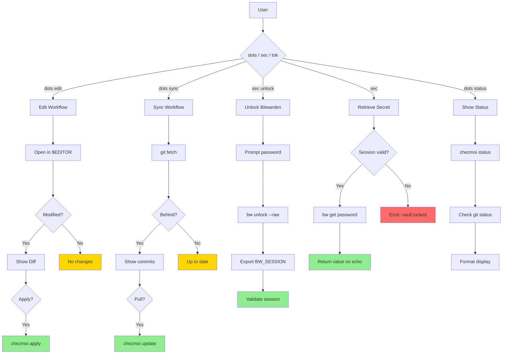

# Dotfile Management Guide

**Manage your dotfiles across machines with chezmoi and Bitwarden secrets**

**Last Updated:** 2026-01-11
**Version:** v2.0.0
**Target Audience:** Users wanting to synchronize dotfiles and manage secrets securely

---

## Overview

The `dots`, `sec`, and `tok` dispatchers provide a unified interface for managing your dotfiles with chezmoi, secrets with macOS Keychain/Bitwarden, and API tokens. It's designed to be ADHD-friendly with smart defaults, clear status displays, and progressive disclosure of complexity.

**Key Benefits:**

| Feature | Benefit |
|---------|---------|
| **Sync dotfiles** | Keep configs consistent across machines |
| **Secure secrets** | Store API keys/tokens in Bitwarden |
| **Safe edits** | Preview changes before applying |
| **Fast operations** | < 500ms for most commands |
| **Optional tools** | Works even if tools not installed |

---

## Quick Start

### 1. Install Tools

```bash
# Required for dotfile sync
brew install chezmoi

# Required for secret management
brew install bitwarden-cli

# Optional (for pretty secret listings)
brew install jq
```

### 2. Initialize Chezmoi

```bash
# Option A: Start fresh
chezmoi init

# Option B: Clone existing dotfiles
chezmoi init https://github.com/yourusername/dotfiles
```

### 3. Authenticate Bitwarden

```bash
# One-time login
bw login
```

### 4. Start Using

```bash
# Check status
dots

# Edit a dotfile
dots edit .zshrc

# Unlock secrets
sec unlock
```

---

## Architecture



**Key Components:**

- **Chezmoi:** Dotfile source control & templating
- **Bitwarden CLI:** Secret management
- **Git:** Version control & sync
- **Flow-CLI:** Unified interface

---

## Common Workflows

### Workflow 1: Edit Dotfile (Most Common)

```bash
# 1. Check current status
dots

# 2. Edit a file
dots edit .zshrc

# 3. Preview changes (automatic)
# Shows: Modified: ~/.zshrc

# 4. Apply changes
# Prompt: Apply changes? [Y/n/d(iff)]
# Press: y

# 5. Changes applied to home directory
```

**Time:** < 30 seconds
**Commands:** 2 (`dots`, `dots edit .zshrc`)

### Workflow 2: Sync from Another Machine

```bash
# 1. Pull latest changes
dots sync

# 2. Review what changed
# Shows: Remote has updates: [commit list]

# 3. Confirm pull
# Prompt: Pull updates? [Y/n]
# Press: y

# 4. Apply changes (if needed)
dots apply
```

**Time:** 10-30 seconds
**Commands:** 2 (`dots sync`, `dots apply`)

### Workflow 3: Push Local Changes

```bash
# 1. Check what's modified
dots diff

# 2. Push changes
dots push

# 3. Enter commit message
# Prompt: Commit message:
# Type: "Update ZSH aliases"

# 4. Committed and pushed
```

**Time:** 20-40 seconds
**Commands:** 2-3 (`dots diff`, `dots push`)

### Workflow 4: Use Secret in Template

```bash
# 1. Unlock Bitwarden
sec unlock

# 2. Edit template file
dots edit .gitconfig

# 3. Add secret reference in template
# {{ bitwarden "item" "github-token" }}

# 4. Apply template (automatic)
# Result: ~/.gitconfig contains actual token
```

**Time:** 1-2 minutes
**Commands:** 2-3 (`sec unlock`, `dots edit`)

---

## Chezmoi Setup

### Directory Structure

```
~/.local/share/chezmoi/          # Source files (templates)
├── .git/                        # Git repository
├── dot_zshrc.tmpl               # Template → ~/.zshrc
├── dot_gitconfig.tmpl           # Template → ~/.gitconfig
├── private_env.sh.tmpl          # Private → ~/.env.sh
└── ...

~/                               # Applied files
├── .zshrc                       # Generated from template
├── .gitconfig                   # Generated from template
└── ...
```

### Naming Convention

Chezmoi uses special prefixes for file transformations:

| Prefix | Result | Example |
|--------|--------|---------|
| `dot_` | Adds leading `.` | `dot_zshrc` → `.zshrc` |
| `.tmpl` | Template processing | `dot_gitconfig.tmpl` → `.gitconfig` |
| `private_` | Executable only by you | `private_env.sh` → `.env.sh` (0600) |
| `executable_` | Executable file | `executable_script.sh` → `script.sh` (0755) |

### Adding New Files

```bash
# Add file to chezmoi (starts tracking)
chezmoi add ~/.zshrc

# Add as template (for variable substitution)
chezmoi add --template ~/.gitconfig
```

### Removing Files

```bash
# Stop tracking a file
chezmoi forget ~/.old_config

# Remove from chezmoi directory
rm ~/.local/share/chezmoi/dot_old_config
```

---

## Bitwarden Setup

### Initial Configuration

```bash
# 1. Login (one-time)
bw login

# 2. Test authentication
bw status
# Output: {"status":"locked",...}

# 3. Unlock vault (per-session)
sec unlock

# 4. Verify unlock
sec list
```

### Creating Items

```bash
# Option A: Via CLI
bw create item \
  --name "github-token" \
  --username "youruser" \
  --password "ghp_..." \
  --folder "Work/GitHub"

# Option B: Via web vault
# 1. Go to vault.bitwarden.com
# 2. Add item → Login
# 3. Name: github-token
# 4. Password: ghp_...
# 5. Save
```

### Organizing Items

Use folders for organization:

```
Work/
├── GitHub
│   ├── github-token
│   └── github-ssh-key
├── Node
│   ├── npm-token
│   └── npmrc-auth
└── Cloud
    ├── aws-key
    └── do-token

Personal/
├── ssh-passphrase
└── gpg-key
```

### Item Types

| Type | Icon | Use Case | Example |
|------|------|----------|---------|
| Login | 🔑 | API tokens, passwords | GitHub token |
| Secure Note | 📝 | SSH keys, certificates | Private key |
| Card | 💳 | Stripe test keys | Payment API |

---

## Token Management (v5.2.0)

### Token Wizards

Create tokens with guided wizards that handle validation and storage:

```bash
# GitHub Personal Access Token
tok github

# NPM automation token
tok npm

# PyPI project token
tok pypi
```

**Example wizard session:**

```
🧙 GitHub Token Wizard

Select token type:
  1. Classic Personal Access Token
  2. Fine-grained Token (recommended)

Choice [1/2]: 2

ℹ Opening GitHub token creation page...

Paste your new token: ghp_xxxxxxxxxxxx

✓ Token validated!
  User: youruser
  Scopes: repo, workflow

✓ Stored as 'github-token' in Bitwarden
  Expires: 2026-04-10 (90 days)
```

### Session Cache (15-minute)

Bitwarden sessions are cached for 15 minutes to reduce password prompts:

```bash
sec unlock     # Unlocks for 15 minutes
sec x   # Works without re-prompting
# ... 14 minutes later ...
sec y   # Still works (cached)
# ... 16 minutes later ...
sec z   # Prompts to unlock again
```

### Secrets Dashboard

View all tokens with expiration status:

```bash
sec dashboard
```

**Dashboard output:**

```
╭───────────────────────────────────────────────────────────────╮
│  🔐 Secrets Dashboard                                          │
├───────────────────────────────────────────────────────────────┤
│                                                               │
│  🔑 github-token                                              │
│     Expires: 2026-04-10 (89 days)                            │
│     Scopes: repo, workflow                                    │
│                                                               │
│  🔑 npm-token                                                 │
│     Expires: 2026-07-10 (180 days)                           │
│     Type: automation                                          │
│                                                               │
│  ⚠️  pypi-token                                               │
│     Expires: 2026-01-20 (9 days) ← EXPIRING SOON             │
│     Scope: project:mypackage                                  │
│                                                               │
╰───────────────────────────────────────────────────────────────╯
```

### Token Rotation

Rotate expiring tokens with a single command:

```bash
# Rotate a specific token
tok pypi-token --refresh

# Short form
tok pypi-token -r
```

**Rotation output:**

```
🔄 Rotating token: pypi-token

ℹ Current token expires: 2026-01-20 (9 days)

ℹ Opening PyPI token creation page...

Paste your new token: pypi-xxxxxxxx

✓ Token validated!
✓ Updated in Bitwarden
  New expiration: 2026-04-10 (90 days)

⚠️  Remember to revoke old token at:
   https://pypi.org/manage/account/token/
```

### CI/CD Integration

**Sync to GitHub Actions:**

```bash
sec sync github
```

```
ℹ Syncing secrets to: Data-Wise/flow-cli

Select secrets to sync:
  [x] GITHUB_TOKEN
  [x] NPM_TOKEN
  [ ] PYPI_TOKEN

✓ 2 secrets synced to repository
```

**Generate .envrc for direnv:**

```bash
dots env
```

```
✓ Generated .envrc with 3 secrets

  Contents:
  ─────────────────────────────
  export GITHUB_TOKEN="$(sec github-token)"
  export NPM_TOKEN="$(sec npm-token)"
  ─────────────────────────────

💡 Run 'direnv allow' to activate
```

---

## Template Examples

### Example 1: Git Config with Token

**File:** `~/.local/share/chezmoi/dot_gitconfig.tmpl`

```ini
[user]
    name = Your Name
    email = your@email.com

[github]
    user = youruser
    token = {{ bitwarden "item" "github-token" }}

[core]
    editor = vim
```

**Apply:**

```bash
sec unlock
dots edit .gitconfig
# Changes applied → ~/.gitconfig has actual token
```

### Example 2: ZSH with API Keys

**File:** `~/.local/share/chezmoi/dot_zshrc.tmpl`

```bash
# API Keys (from Bitwarden)
export OPENAI_API_KEY="{{ bitwarden "item" "openai-key" }}"
export ANTHROPIC_API_KEY="{{ bitwarden "item" "anthropic-key" }}"
export GITHUB_TOKEN="{{ bitwarden "item" "github-token" }}"

# Regular config
export PATH="$HOME/bin:$PATH"
```

**Apply:**

```bash
sec unlock
dots edit .zshrc
source ~/.zshrc
```

### Example 3: Environment File

**File:** `~/.local/share/chezmoi/private_env.sh.tmpl`

```bash
#!/bin/bash
# Auto-generated from Bitwarden secrets
# Source: source ~/.env.sh

export OPENAI_API_KEY="{{ bitwarden "item" "openai-key" }}"
export ANTHROPIC_API_KEY="{{ bitwarden "item" "anthropic-key" }}"
export GITHUB_TOKEN="{{ bitwarden "item" "github-token" }}"
export NPM_TOKEN="{{ bitwarden "item" "npm-token" }}"
```

**Apply:**

```bash
sec unlock
chezmoi apply ~/.env.sh
source ~/.env.sh
```

### Example 4: SSH Config

**File:** `~/.local/share/chezmoi/private_dot_ssh/config.tmpl`

```
Host github.com
    User git
    IdentityFile ~/.ssh/github_ed25519
    IdentitiesOnly yes

Host bitbucket.org
    User git
    IdentityFile ~/.ssh/bitbucket_rsa
```

**Apply:**

```bash
dots edit .ssh/config
```

---

## Dashboard Integration

The `dash` command automatically shows dotfile status:

```
╭──────────────────────────────────────────────────────────────╮
│  🌊 FLOW DASHBOARD ✓                  Jan 09, 2026  🕐 14:30 │
╰──────────────────────────────────────────────────────────────╯

  ...

  📝 Dotfiles: 🟢 Synced (2h ago) · 12 files tracked

  ...
```

**Status Icons:**

| Icon | State | Meaning |
|------|-------|---------|
| 🟢 | Synced | Everything up to date |
| 🟡 | Modified | Local changes pending |
| 🔴 | Behind | Remote has new commits |
| 🔵 | Ahead | Local commits not pushed |

**Performance:** < 100ms (uses cached values)

---

## Doctor Integration

The `flow doctor` command includes dotfile health checks:

```
📁 DOTFILES
  ✓ chezmoi v2.45.0
  ✓ Bitwarden CLI v2024.1.0
  ✓ Chezmoi initialized with git
  ✓ Remote configured: git@github.com:user/dotfiles.git
  ✓ No uncommitted changes
  ✓ Synced with remote
  ✓ Bitwarden vault unlocked
```

**Run diagnostics:**

```bash
# Via dot dispatcher
dots doctor

# Via flow doctor
flow doctor
```

---

## Troubleshooting

### "Chezmoi not initialized"

**Symptoms:**
- `dots status` shows "Not initialized"
- Commands fail with errors

**Solution:**

```bash
# Option A: Start fresh
chezmoi init

# Option B: Clone existing repo
chezmoi init https://github.com/yourusername/dotfiles
```

### "Bitwarden vault is locked"

**Symptoms:**
- `sec` fails
- Template processing fails

**Solution:**

```bash
# Unlock vault
sec unlock

# Try again
sec github-token
```

### "Item not found or access denied"

**Symptoms:**
- `sec <name>` fails
- Template shows error

**Solution:**

```bash
# List all items (check exact name)
sec list

# Check item exists
bw get item github-token
```

### Changes Not Applied

**Symptoms:**
- `dots edit` succeeds but file unchanged
- Templates not processing

**Solution:**

```bash
# Check pending changes
dots diff

# Apply manually
dots apply

# For templates, ensure vault unlocked
sec unlock
dots apply
```

### Session Token in History

**Concern:**
- Worried about BW_SESSION in shell history

**Solution:**

The `sec unlock` command safely captures tokens without exposing them. History exclusion patterns prevent storage:

```bash
# Verify history settings
echo $HISTIGNORE

# Should include: *bw unlock*:*bw get*:*BW_SESSION*
```

This is automatically configured when dotfile helpers load.

---

## Security Best Practices

### ✅ DO

- **Unlock per-session:** Run `sec unlock` in each shell where you need secrets
- **Lock when done:** Run `bw lock` after template operations
- **Use templates:** Store templates in chezmoi, not plain files with secrets
- **Capture securely:** Use `VAR=$(sec name)` to capture without echo
- **Validate items:** Use `sec list` to verify item names before using
- **Review templates:** Check templates before applying to ensure no leaks

### ❌ DON'T

- **Don't export globally:** Never add `export BW_SESSION=...` to `.zshrc`
- **Don't commit secrets:** Never commit files with actual secret values
- **Don't echo secrets:** Avoid `echo $(sec name)` in scripts
- **Don't log secrets:** Ensure secrets aren't written to logs/history
- **Don't share sessions:** Each user should unlock their own vault
- **Don't hardcode tokens:** Use templates and Bitwarden instead

### Security Checklist

```bash
# 1. Check for global BW_SESSION exports (should find nothing)
grep -r "export BW_SESSION" ~/.config/zsh ~/.zshrc ~/.zshenv 2>/dev/null

# 2. Verify history exclusion
echo $HISTIGNORE | grep "bw unlock"

# 3. Check for committed secrets (in chezmoi repo)
cd ~/.local/share/chezmoi
git log -p | grep -i "token\|password\|secret" | grep -v "bitwarden"

# 4. Audit applied files (should contain actual secrets, not templates)
grep "bitwarden" ~/.gitconfig ~/.zshrc 2>/dev/null
# Should return nothing (templates are processed)
```

---

## Advanced Usage

### Multiple Machines

Keep dotfiles synced across machines:

```bash
# Machine A (iMac): Make changes
dots edit .zshrc
dots push

# Machine B (MacBook): Pull changes
dots sync
dots apply
```

### Conditional Templates

Use chezmoi's template syntax for machine-specific config:

```bash
{{ if eq .chezmoi.hostname "imac" }}
export WORK_MODE=true
{{ else }}
export WORK_MODE=false
{{ end }}
```

### Custom Fields

Access custom fields in Bitwarden items:

```bash
# In template
{{ bitwardenFields "item" "api-key" "custom-field-name" }}
```

### Secret Rotation

**Method 1: Use Token Wizard (Recommended - v5.2.0)**

```bash
# Rotate with guided wizard
tok github-token --refresh

# This opens browser, validates new token, updates Bitwarden
# and reminds you to revoke the old token
```

**Method 2: Manual Update**

```bash
# 1. Update in Bitwarden
bw edit item github-token

# 2. Re-apply templates
sec unlock
dots apply

# 3. Verify new secret
grep github-token ~/.gitconfig
```

---

## Command Reference

| Command | Alias | Purpose |
|---------|-------|---------|
| `dots` | - | Show status (default) |
| `dots status` | `dots s` | Show sync status |
| `dots edit FILE` | `dots e FILE` | Edit dotfile with preview |
| `dots sync` | - | Pull from remote |
| `dots push` | `dots p` | Push to remote |
| `dots diff` | `dots d` | Show pending changes |
| `dots apply` | `dots a` | Apply changes |
| `dots env` | - | Generate .envrc for direnv |
| `dots doctor` | `dots dr` | Run diagnostics |
| `dots help` | - | Show help |
| `sec unlock` | `sec u` | Unlock Bitwarden vault (15-min session) |
| `sec lock` | `sec l` | Lock Bitwarden vault |
| `sec NAME` | - | Retrieve secret |
| `sec list` | - | List all secrets |
| `sec dashboard` | - | Dashboard with expiration |
| `sec sync github` | - | Sync to GitHub Actions |
| `tok github` | `tok gh` | GitHub PAT wizard |
| `tok npm` | - | NPM token wizard |
| `tok pypi` | `tok pip` | PyPI token wizard |
| `tok rotate NAME` | - | Rotate existing token |

---

## See Also

- [Dispatcher Reference](../reference/MASTER-DISPATCHER-GUIDE.md#dots-dispatcher) - Complete command reference
- [Chezmoi Documentation](https://www.chezmoi.io/) - Official chezmoi docs
- [Bitwarden CLI Documentation](https://bitwarden.com/help/cli/) - Official Bitwarden CLI docs

---

**Version:** 2.0.0
**Last Updated:** 2026-01-11
**Status:** Production Ready
