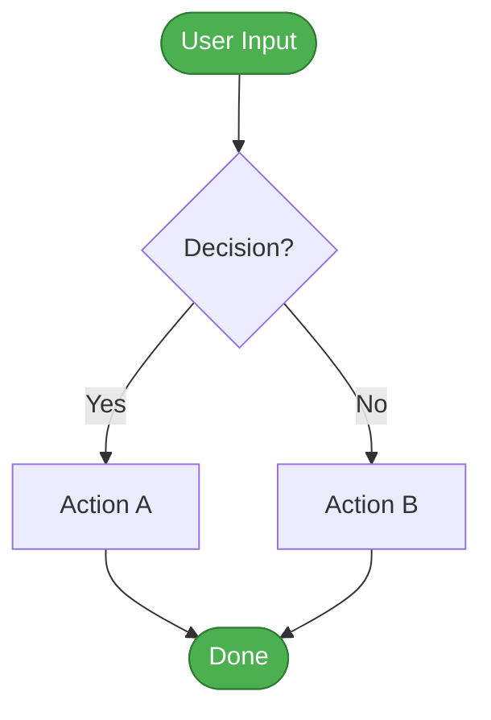
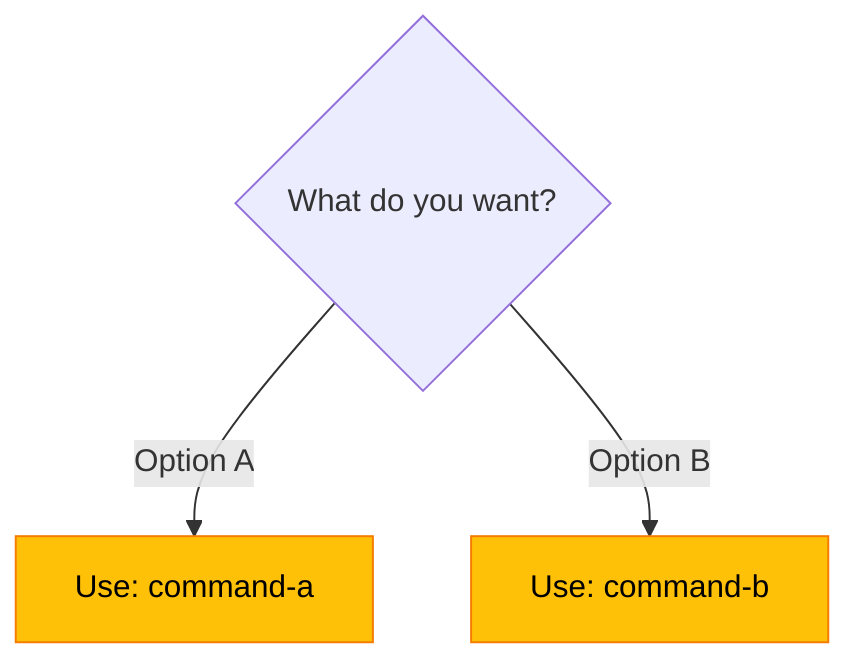
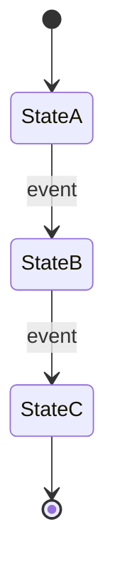

# 📊 Mermaid Diagrams - Quick Start Guide

**Status:** Ready to implement
**Time to first diagram:** 30 minutes
**Value:** High (ADHD-friendly visual documentation)

---

## ✅ YES, Add Mermaid Diagrams!

**Your Question:** Should we include Mermaid diagrams for `dash` and other commands?

**Answer:** ⭐ **Absolutely YES!** Here's why:

1. **ADHD-Friendly** - Visual > text for understanding flow
2. **Quick Reference** - Glance at diagram vs read paragraphs
3. **Already Supported** - MkDocs Material has built-in Mermaid support
4. **Low Effort** - 30 min per diagram, high impact
5. **Proven Value** - Other projects (GitHub, Rust) use extensively

---

## 🎯 What I Created for You

### 1. Comprehensive Brainstorm Document

**File:** `PROPOSAL-MERMAID-DIAGRAM-DOCUMENTATION.md`

**Contents:**

- 6 diagram type categories (flowchart, decision tree, state, sequence, etc.)
- Multiple implementation approaches (incremental, comprehensive, hybrid)
- Priority matrix (high/medium/low priority commands)
- 6 creative ideas (interactive diagrams, animations, etc.)
- Complete technical implementation guide
- ADHD-friendly design principles
- Success metrics and maintenance plan

**Key Recommendation:** Start with `dash` diagram today (30 min), then expand incrementally.

---

### 2. Example Documentation Page

**File:** `EXAMPLE-dash-command-doc.md`

**Features:**

- ✅ Simple flowchart (quick view)
- ✅ Detailed flowchart (expandable, 40+ nodes)
- ✅ Text alternative (accessibility)
- ✅ Step-by-step procedure
- ✅ Usage examples with outputs
- ✅ Troubleshooting section
- ✅ Related commands
- ✅ Best practices

**Use as:** Template for documenting other commands

---

## 🚀 Next Steps (Choose Your Path)

### Option A: Quick Win (30 minutes)

**Do right now:**

1. Copy `EXAMPLE-dash-command-doc.md` to `docs/commands/dash.md`
2. Test rendering: `mkdocs serve`
3. View at `http://localhost:8000/commands/dash/`
4. Ship it!

**Result:** One high-quality diagram-rich command page

---

### Option B: Strategic Rollout (2 hours over 1 week)

**Week 1:**

- [ ] Day 1: `dash` command (30 min)
- [ ] Day 2: Command selection decision tree (20 min)
- [ ] Day 3: `pick` command flowchart (20 min)
- [ ] Day 4: `work` command sequence diagram (30 min)
- [ ] Day 5: Review and user feedback (20 min)

**Result:** 4 diagram-rich pages, established pattern

---

### Option C: Comprehensive Documentation (10 hours over 1 month)

**Phase 1 (Week 1):** Core commands (4 diagrams)
**Phase 2 (Week 2):** Smart dispatchers (6 diagrams)
**Phase 3 (Week 3):** Advanced flows (5 diagrams)
**Phase 4 (Week 4):** Templates and guidelines

**Result:** 15+ diagrams, complete visual documentation system

---

## 💡 Recommended Choice

⭐ **Option A** (Quick Win) + **Option B** (Strategic Rollout)

**Why:**

- Immediate value with `dash` diagram
- Low risk, high impact
- User feedback drives priorities
- Sustainable pace (20-30 min/day)

---

## 📐 Diagram Templates Available

### 1. Flowchart Template



---

### 2. Decision Tree Template



---

### 3. State Diagram Template



---

## 🎨 Color Scheme (Copy-Paste Ready)

```
Success/Start:  #4CAF50 (Green)
Process/Action: #2196F3 (Blue)
Decision/Choice:#FFC107 (Yellow)
Error/Block:    #F44336 (Red)
Info/Reference: #9C27B0 (Purple)
Neutral/End:    #757575 (Gray)
```

**Usage:**

```mermaid
style NodeName fill:#4CAF50,stroke:#2E7D32,color:#fff
```

---

## 🔍 MkDocs Configuration Check

**Verify Mermaid is enabled:**

```bash
# Check mkdocs.yml for:
cat mkdocs.yml | grep -A 5 "superfences"
```

**Should see:**

```yaml
markdown_extensions:
  - pymdownx.superfences:
      custom_fences:
        - name: mermaid
          class: mermaid
          format: !!python/name:pymdownx.superfences.fence_code_format
```

**If missing, add it!**

---

## ✅ Quality Checklist

Before publishing each diagram:

- [ ] **Clarity** - Can user understand flow in 30 seconds?
- [ ] **Simplicity** - Is there a simpler version for quick view?
- [ ] **Accessibility** - Does it have text alternative?
- [ ] **Colors** - Uses consistent color scheme?
- [ ] **Labels** - Are all nodes clearly labeled?
- [ ] **Testing** - Renders correctly locally?

---

## 📊 High-Priority Commands for Diagrams

| Priority  | Command       | Reason                            | Effort      |
| --------- | ------------- | --------------------------------- | ----------- |
| 🔥 **P0** | `dash`        | Complex, multi-step, high-traffic | 30 min      |
| 🔥 **P0** | Decision tree | Common user question              | 20 min      |
| ⭐ **P1** | `pick`        | Interactive, branching logic      | 20 min      |
| ⭐ **P1** | `work`        | Multiple side effects             | 30 min      |
| 📋 **P2** | `cc` / `gm`   | Project integration               | 15 min each |

---

## 🎓 Learning Resources

- [Mermaid Live Editor](https://mermaid.live/) - Test diagrams interactively
- [Mermaid Docs](https://mermaid.js.org/) - Full syntax reference
- [Example `dash` doc](EXAMPLE-dash-command-doc.md) - Template

---

## 🚀 START HERE: 30-Minute Action Plan

**Goal:** Ship your first diagram-rich doc page

1. **Copy example** (5 min)

   ```bash
   cp EXAMPLE-dash-command-doc.md docs/commands/dash.md
   ```

2. **Verify MkDocs config** (5 min)
   - Check `mkdocs.yml` has Mermaid support
   - Add if missing

3. **Test locally** (10 min)

   ```bash
   mkdocs serve
   # Open http://localhost:8000/commands/dash/
   ```

4. **Customize** (10 min)
   - Update any project-specific details
   - Adjust examples if needed
   - Verify diagrams render correctly

5. **Ship it!**
   ```bash
   git add docs/commands/dash.md
   git commit -m "docs: add dash command with Mermaid diagrams"
   ```

---

## 💬 Get Feedback

After shipping first diagram:

**Ask users:**

- Does the diagram help you understand the command?
- What would make it more useful?
- Which other commands need diagrams?

**Iterate based on feedback!**

---

## 📈 Success Metrics

**Track these:**

- Page views on diagram pages
- Time spent on page (should decrease!)
- User questions about command flow (should decrease!)
- Contributor PRs referencing diagrams

---

## 🎯 Summary

**What:** Add Mermaid flowcharts and diagrams to command documentation

**Why:** ADHD-friendly visual reference, faster comprehension

**How:** Start with `dash` command (30 min), expand incrementally

**When:** Start today with Option A (Quick Win)

**Result:** Clear, visual, scannable documentation that answers "how does this work?" at a glance

---

**Files Created:**

1. ✅ `PROPOSAL-MERMAID-DIAGRAM-DOCUMENTATION.md` - Full brainstorm
2. ✅ `EXAMPLE-dash-command-doc.md` - Template implementation
3. ✅ `MERMAID-DIAGRAMS-QUICK-START.md` - This guide

**Ready to ship?** Start with the 30-minute action plan above! 🚀
