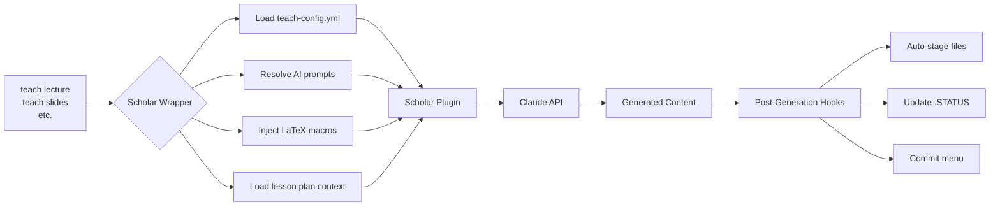
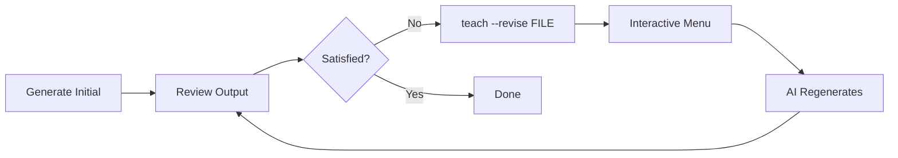
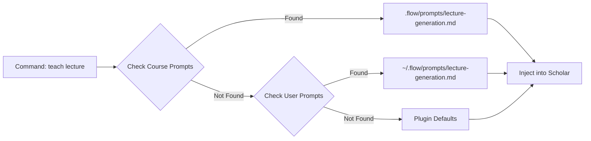

# Scholar Wrappers Guide

> Complete documentation for the 9 AI content generation commands in the teach system.
>
> **Version:** v6.1.0+ | **Prerequisites:** Scholar plugin, teach-config.yml

## Table of Contents

- [Prerequisites](#prerequisites)
- [How Scholar Wrappers Work](#how-scholar-wrappers-work)
- [Quick Setup](#quick-setup)
- [Commands](#commands)
  - [teach lecture](#teach-lecture)
  - [teach slides](#teach-slides)
  - [teach exam](#teach-exam)
  - [teach quiz](#teach-quiz)
  - [teach assignment](#teach-assignment)
  - [teach syllabus](#teach-syllabus)
  - [teach rubric](#teach-rubric)
  - [teach feedback](#teach-feedback)
  - [teach demo](#teach-demo)
- [Universal Options](#universal-options)
- [Configuration Reference](#configuration-reference)
- [Common Workflows](#common-workflows)
- [Troubleshooting](#troubleshooting)
- [See Also](#see-also)

---

## Prerequisites

Before using Scholar wrappers, ensure you have:

1. **Scholar plugin installed** - AI content generation engine
2. **teach-config.yml** - Course metadata configuration
3. **(Optional) Custom prompts** - Project-specific AI instructions
4. **(Optional) LaTeX macros** - Consistent mathematical notation
5. **(Optional) Lesson plans** - Week-by-week content structure

### Verification

Run health check to verify all dependencies:

```bash
teach doctor
```

**Expected Output:**

```
✓ Scholar plugin found
✓ teach-config.yml valid
✓ Lesson plans available (optional)
✓ LaTeX macros configured (optional)
✓ Custom prompts detected (optional)
```

### Minimum Configuration

At minimum, you need `.flow/teach-config.yml` with course identification:

```yaml
course:
  name: 'STAT-101'
  full_name: 'Introduction to Statistics'
  semester: 'Fall'
  year: 2026

locations:
  lectures: 'lectures'
```

---

## How Scholar Wrappers Work

Scholar wrappers are intelligent bridges between flow-cli's teaching commands and the Scholar AI plugin. They handle configuration, validation, context injection, and post-generation workflows.

### Architecture



### Data Flow

```mermaid
flowchart TD
    A[User Command<br/>teach lecture "ANOVA" --week 5] --> B{Parser}

    B --> C[Extract Topic]
    B --> D[Extract Week]
    B --> E[Extract Flags]

    C --> F[3-Tier Resolution]
    D --> G[Load Lesson Plan]
    E --> H[Resolve Content]

    F --> I[teach-config.yml]
    F --> J[~/.flow/teach-config.yml]
    F --> K[Plugin Defaults]

    G --> L[.flow/lesson-plans.yml]
    L --> M[Week 5: ANOVA Details]

    H --> N[Style Preset<br/>conceptual, computational, rigorous, applied]
    N --> O[Content Overrides<br/>--math, --code, --examples]

    I --> P[Scholar Context]
    J --> P
    K --> P
    M --> P
    O --> P

    P --> Q[AI Prompt]
    Q --> R[Claude Generation]
    R --> S[Output File]
```

### Key Components

1. **Config Resolution** - 3-tier hierarchy (Project → User → Plugin)
2. **Prompt Injection** - Auto-inject course-specific prompts
3. **Macro Injection** - Ensure consistent LaTeX notation
4. **Lesson Plan Integration** - Pull week-specific details
5. **Post-Generation Hooks** - Auto-stage, status update, commit menu

---

## Quick Setup

### Step 1: Initialize Course

```bash
teach init "STAT-101" --github
```

Creates:
- `.flow/teach-config.yml` - Course metadata
- `.flow/lesson-plans.yml` - Empty lesson plan file
- Basic directory structure

### Step 2: Run Health Check

```bash
teach doctor --fix
```

Verifies and auto-fixes:
- Configuration validity
- Scholar plugin availability
- Required directories

### Step 3: (Optional) Create Lesson Plan

```bash
teach plan create 1 --topic "Introduction to Statistics" --style conceptual
```

Adds week structure to `.flow/lesson-plans.yml` for enhanced AI generation.

### Step 4: Generate Your First Content

```bash
teach lecture "Introduction to Statistics" --week 1
```

---

## Commands

### teach lecture

Generate lecture notes in Quarto (.qmd) format.

**Aliases:** `lec`

**Usage:**

```bash
teach lecture <topic> [options]
teach lecture --week N --topic "title"
```

**What It Generates:**

- Structured lecture notes with sections
- Learning objectives
- Conceptual explanations
- Examples and practice problems
- Code snippets (if `--code` flag)
- Output: `lectures/week-NN-<topic>.qmd`

**Required Config Fields:**

```yaml
course:
  name: 'STAT-101'              # Course code
locations:
  lectures: 'lectures'          # Output directory
```

**Style Options:**

- `conceptual` - Theory-focused with explanations
- `computational` - Applied with code examples
- `rigorous` - Math-heavy with proofs
- `applied` - Practical applications

**Example with STAT-101:**

```bash
# Generate conceptual lecture for week 1
teach lecture "Introduction to Statistics" --week 1 --style conceptual

# Generate computational lecture with code
teach lecture "Data Visualization" --week 2 --style computational --code

# Generate from lesson plan (auto-fills topic and style)
teach lecture --week 3
```

**Output Format:**

```markdown
---
title: "Introduction to Statistics"
week: 1
format: html
---

# Learning Objectives
- Define key statistical concepts
- Distinguish between data types
- Calculate descriptive statistics

# Introduction
...

# Key Concepts
...

# Examples
...
```

**Command-Specific Options:**

- `--template FORMAT` - markdown, quarto, typst, pdf, docx
- `--style formal|casual` - Writing tone
- `--length N` - Target page count (20-40)
- `--difficulty easy|medium|hard` - Content depth
- `--examples N` - Number of examples
- `--math-notation LaTeX|unicode|text` - Math display

---

### teach slides

Create presentation slides from topics or existing lecture files.

**Aliases:** `sl`

**Usage:**

```bash
teach slides <topic> [options]
teach slides --week N --topic "title"
teach slides --from-lecture <file>
```

**What It Generates:**

- RevealJS presentation slides (.qmd)
- Slide structure optimized for teaching
- Visual hierarchy with callouts
- Code demonstrations (if requested)
- Output: `slides/week-NN-<topic>.qmd`

**Special Feature: --from-lecture**

Convert existing lecture notes to slides:

```bash
# Auto-detect lecture file for week 5
teach slides --from-lecture week-05-regression.qmd

# Or specify week number
teach slides --week 5 --from-lecture week-05-regression.qmd

# With AI optimization (Phase 4)
teach slides --from-lecture week-05.qmd --optimize
teach slides --week 5 --optimize --preview-breaks
teach slides --week 5 --optimize --apply-suggestions
```

**Optimization Flags (v5.15.0+):**

- `--optimize` - AI-powered slide structure analysis
- `--preview-breaks` - Show suggested breaks before generating
- `--apply-suggestions` - Auto-apply slide break suggestions
- `--key-concepts` - Emphasize key concepts with callouts

**Required Config Fields:**

```yaml
locations:
  lectures: 'lectures'          # Source directory
  slides_output: '_site/slides' # Rendered output
```

**Example with STAT-101:**

```bash
# Generate slides from scratch
teach slides "Probability Distributions" --week 4 --style computational

# Convert lecture to slides
teach slides --from-lecture lectures/week-03-probability.qmd

# Optimized conversion with key concepts
teach slides --week 5 --from-lecture week-05-regression.qmd --optimize --key-concepts
```

**Output Format:**

```markdown
---
title: "Probability Distributions"
format: revealjs
theme: default
---

# Introduction

## What is Probability?

...

## Key Concepts {.callout-important}

- Random variables
- Probability mass functions
- Expected value
```

**Command-Specific Options:**

- `--template FORMAT` - markdown, quarto
- `--theme NAME` - default, academic, minimal
- `--from-lecture FILE` - Source lecture file
- `--optimize` - AI slide optimization
- `--preview-breaks` - Preview before generating
- `--apply-suggestions` - Auto-apply AI suggestions

---

### teach exam

Generate comprehensive exams with multiple question types.

**Aliases:** `e`

**Usage:**

```bash
teach exam <topic> [options]
teach exam --questions N --duration minutes
```

**What It Generates:**

- Multiple choice questions
- Short answer questions
- Problem-solving questions
- Answer keys (if requested)
- Integration with `teach macros` for consistent notation
- Output: `exams/exam-<topic>-YYYY-MM-DD.qmd`

**LaTeX Macro Integration:**

When `teach macros` is configured, exams automatically use consistent notation:

```bash
# Ensure macros are synced
teach macros sync

# Generate exam (auto-injects macros)
teach exam "Linear Regression" --math
```

**Example with STAT-101:**

```bash
# Basic exam (5 questions, default)
teach exam "Midterm Review"

# Specific question count and duration
teach exam "Hypothesis Testing" --questions 10 --duration 60

# With question type breakdown
teach exam "ANOVA" --questions 8 --duration 60 --types "mc:3,sa:2,problem:3"

# Math-heavy exam with consistent notation
teach exam "Probability" --questions 12 --math --style rigorous
```

**Required Config Fields:**

```yaml
course:
  name: 'STAT-101'
```

**Optional Config Fields (enhances output):**

```yaml
scholar:
  grading:
    midterm: 20                 # Used in exam preamble
    final_exam: 30
  latex_macros:
    enabled: true               # Ensures consistent notation
    sources:
      - path: "_macros.qmd"
        format: "qmd"
```

**Output Format:**

```markdown
---
title: "STAT-101 Midterm Exam"
date: "2026-03-15"
format: pdf
---

**Instructions:** You have 60 minutes. Show all work.

# Section 1: Multiple Choice (30 points)

1. Which of the following...
   a) Option A
   b) Option B
   ...

# Section 2: Short Answer (40 points)

2. Define the central limit theorem...

# Section 3: Problems (30 points)

3. Calculate $\E{Y}$ for the following distribution...
```

**Command-Specific Options:**

- `--questions N` - Number of questions (default: 5)
- `--duration N` - Duration in minutes
- `--types TYPES` - Question type breakdown (e.g., "mc:5,sa:3,problem:2")
- `--format FORMAT` - quarto, qti, markdown
- `--difficulty easy|medium|hard` - Content depth

---

### teach quiz

Create quiz questions for formative assessment.

**Aliases:** `q`

**Usage:**

```bash
teach quiz <topic> [options]
teach quiz --questions N --time-limit minutes
```

**What It Generates:**

- Quick assessment questions
- Multiple choice or short answer
- Auto-graded format (if QTI)
- Immediate feedback (if requested)
- Output: `quizzes/quiz-<topic>-YYYY-MM-DD.qmd`

**Example with STAT-101:**

```bash
# Basic quiz (5 questions)
teach quiz "Descriptive Statistics"

# Timed quiz
teach quiz "Hypothesis Testing" --questions 10 --time-limit 15

# With explanations
teach quiz "Regression Basics" --questions 8 --explanation

# Math-focused quiz
teach quiz "Probability Distributions" --questions 12 --math --style rigorous
```

**Required Config Fields:**

```yaml
course:
  name: 'STAT-101'
```

**Command-Specific Options:**

- `--questions N` - Number of questions (default: 5)
- `--time-limit N` - Time limit in minutes
- `--format FORMAT` - quarto, qti, markdown
- `--difficulty easy|medium|hard` - Content depth

---

### teach assignment

Generate homework assignments with problems and instructions.

**Aliases:** `hw`

**Usage:**

```bash
teach assignment <topic> [options]
```

**What It Generates:**

- Problem sets
- Instructions and rubric
- Dataset references (if applicable)
- Due date and point values
- Output: `assignments/hw-<topic>-YYYY-MM-DD.qmd`

**Example with STAT-101:**

```bash
# Basic assignment
teach assignment "Linear Regression Practice"

# With due date and points
teach assignment "ANOVA Problems" --due-date 2026-03-15 --points 100

# Computational assignment
teach assignment "Data Visualization" --style computational --code

# Week-based assignment
teach assignment "Week 5 Practice" --week 5
```

**Required Config Fields:**

```yaml
course:
  name: 'STAT-101'
locations:
  homework: 'assignments'
```

**Optional Config Fields:**

```yaml
semester_info:
  deadlines:
    homework5:
      week: 5
      offset_days: 5            # Auto-populate due date
```

**Command-Specific Options:**

- `--due-date YYYY-MM-DD` - Assignment due date
- `--points N` - Total points
- `--format quarto|markdown` - Output format

---

### teach syllabus

Create a complete course syllabus from configuration.

**Aliases:** `syl`

**Usage:**

```bash
teach syllabus [options]
```

**What It Generates:**

- Course description and objectives
- Grading breakdown
- Weekly schedule (from lesson plans)
- Policies and expectations
- Output: `syllabus/syllabus-<semester>-<year>.qmd`

**Example with STAT-101:**

```bash
# Generate syllabus from config
teach syllabus

# PDF format for distribution
teach syllabus --format pdf

# Verbose mode
teach syllabus --verbose
```

**Required Config Fields:**

```yaml
course:
  name: 'STAT-101'
  full_name: 'Introduction to Statistics'
  semester: 'Fall'
  year: 2026
  instructor: 'Dr. Jane Smith'
  description: 'A first course in statistics...'

scholar:
  grading:
    homework: 30
    midterm: 20
    final_exam: 30
    project: 20

semester_info:
  start_date: '2026-08-26'
  end_date: '2026-12-15'
```

**Optional Enhancement:**

If `.flow/lesson-plans.yml` exists, weekly topics are auto-populated.

**Command-Specific Options:**

- `--format quarto|markdown|pdf` - Output format

---

### teach rubric

Generate grading rubrics for assignments or projects.

**Aliases:** `rb`

**Usage:**

```bash
teach rubric <assignment> [options]
```

**What It Generates:**

- Criteria-based rubric
- Point breakdowns
- Performance levels (Excellent, Good, Fair, Poor)
- Output: `rubrics/rubric-<assignment>.qmd`

**Example with STAT-101:**

```bash
# Basic rubric
teach rubric "Final Project"

# With specific number of criteria
teach rubric "Midterm Exam" --criteria 5

# Week-based rubric
teach rubric "Week 5 Assignment" --week 5
```

**Required Config Fields:**

```yaml
course:
  name: 'STAT-101'
```

**Command-Specific Options:**

- `--criteria N` - Number of criteria
- `--format quarto|markdown` - Output format

---

### teach feedback

Create personalized student feedback.

**Aliases:** `fb`

**Usage:**

```bash
teach feedback <student> [options]
```

**What It Generates:**

- Personalized feedback comments
- Strengths and areas for improvement
- Actionable suggestions
- Output: `feedback/<student>-<assignment>.md`

**Example with STAT-101:**

```bash
# Generate feedback for student
teach feedback "John Doe - Assignment 3"

# Week-based feedback
teach feedback "Jane Smith - Midterm" --week 8
```

**Required Config Fields:**

```yaml
course:
  name: 'STAT-101'
```

---

### teach demo

Generate demo course content for testing or examples.

**Usage:**

```bash
teach demo [options]
```

**What It Generates:**

- Sample lecture
- Sample slides
- Sample quiz
- Sample assignment
- Output: `demo/` directory

**Example:**

```bash
# Generate full demo course
teach demo

# Specific content type
teach demo --type lecture --topic "Introduction to Statistics"
```

---

## Universal Options

These flags work with ALL Scholar wrapper commands.

### Selection Flags

Control which week/topic to generate content for:

| Flag | Short | Type | Description | Example |
|------|-------|------|-------------|---------|
| `--topic` | `-t` | string | Topic name | `--topic "Linear Regression"` |
| `--week` | `-w` | number | Week number (1-20) | `--week 5` |
| `--style` | — | enum | Content style preset | `--style rigorous` |
| `--interactive` | `-i` | flag | Interactive wizard | `--interactive` |
| `--revise` | — | string | Revise existing file | `--revise week-05-lecture.qmd` |
| `--context` | — | flag | Include additional context | `--context` |

**Style Presets:**

| Preset | Includes | Best For |
|--------|----------|----------|
| `conceptual` | explanation, definitions, examples | Introductory courses, theory |
| `computational` | explanation, examples, code, practice | Applied courses, data science |
| `rigorous` | definitions, explanation, math, proof | Graduate courses, mathematics |
| `applied` | explanation, examples, code, practice | Hands-on workshops, labs |

### Content Toggle Flags

Add or remove specific content types:

| Flag | Short | Description | Negation |
|------|-------|-------------|----------|
| `--explanation` | `-e` | Include conceptual explanations | `--no-explanation` |
| `--proof` | — | Include mathematical proofs | `--no-proof` |
| `--math` | `-m` | Include mathematical notation | `--no-math` |
| `--examples` | `-x` | Include numerical examples | `--no-examples` |
| `--code` | `-c` | Include code snippets | `--no-code` |
| `--diagrams` | `-d` | Include diagrams and visualizations | `--no-diagrams` |
| `--practice-problems` | `-p` | Include practice problems | `--no-practice-problems` |
| `--definitions` | — | Include formal definitions | `--no-definitions` |
| `--references` | `-r` | Include citations and references | `--no-references` |

**Examples:**

```bash
# Rigorous style WITHOUT proofs
teach lecture "Regression" --style rigorous --no-proof

# Computational style WITH extra diagrams
teach slides "ANOVA" --style computational --diagrams

# Custom content mix
teach exam "Midterm" --math --code --examples --no-practice-problems
```

### Revision Workflow (--revise)

Iteratively improve existing content (v5.13.0+):

```bash
# Initial generation
teach lecture "Linear Regression" --week 5

# Review output...

# Revise with improvements
teach lecture --revise lectures/week-05-regression.qmd
```

**Revision Options (interactive menu):**

1. Add more examples
2. Increase technical depth
3. Add code snippets
4. Improve clarity
5. Add practice problems
6. Custom instructions

**Workflow:**



### Interactive Mode (--interactive)

Step-by-step wizard for content generation:

```bash
# Launch interactive wizard
teach lecture --interactive

# Or with topic pre-filled
teach slides "ANOVA" --interactive
```

**Wizard Steps:**

1. Select week (from lesson plans)
2. Confirm/edit topic
3. Choose style preset
4. Select content flags
5. Review and generate

**Example Session:**

```
🧙 Scholar Interactive Wizard

Step 1/4: Select Week
  [1] Week 1: Introduction to Statistics
  [2] Week 2: Data Visualization
  [3] Week 3: Probability
  → Your choice: 3

Step 2/4: Topic
  Default topic: "Probability"
  → Press Enter to accept or type new: Probability Basics

Step 3/4: Style Preset
  [1] conceptual - Theory-focused
  [2] computational - Applied with code
  [3] rigorous - Math-heavy
  [4] applied - Practical
  → Your choice: 2

Step 4/4: Content Flags (multi-select)
  [x] Explanation
  [x] Examples
  [x] Code
  [ ] Math notation
  [ ] Diagrams
  → Press Enter to continue

Generating lecture with:
  - Week: 3
  - Topic: "Probability Basics"
  - Style: computational
  - Flags: --explanation --examples --code
```

---

## Configuration Reference

### Which Config Fields Each Command Reads

| Command | Required Fields | Optional Fields (enhance output) |
|---------|----------------|----------------------------------|
| `teach lecture` | `course.name`, `locations.lectures` | `semester_info.weeks[]`, `scholar.course_info`, `scholar.latex_macros` |
| `teach slides` | `course.name`, `locations.slides_output` | `semester_info.weeks[]`, `scholar.style` |
| `teach exam` | `course.name` | `scholar.grading`, `scholar.latex_macros` |
| `teach quiz` | `course.name` | `scholar.course_info.difficulty` |
| `teach assignment` | `course.name`, `locations.homework` | `semester_info.deadlines` |
| `teach syllabus` | `course.name`, `course.full_name`, `course.semester`, `course.year`, `scholar.grading`, `semester_info.start_date`, `semester_info.end_date` | `semester_info.weeks[]`, `semester_info.holidays`, `semester_info.exams` |
| `teach rubric` | `course.name` | `scholar.grading` |
| `teach feedback` | `course.name` | — |
| `teach demo` | — | — |

### Prompt Resolution (3-Tier)

AI prompts are resolved in this order:



**Priority:**

1. **Course prompts** (`.flow/prompts/`) - Highest priority
2. **User prompts** (`~/.flow/prompts/`) - Personal defaults
3. **Plugin defaults** - Embedded fallbacks

**Managing Prompts:**

```bash
# List available prompts (shows resolution)
teach prompt list

# Edit course-specific prompt
teach prompt edit lecture-generation

# Validate all prompts
teach prompt validate

# Export for Scholar integration (auto-injected)
teach prompt export
```

See [REFCARD-PROMPTS.md](../reference/REFCARD-PROMPTS.md) for complete prompt management guide.

### Macro Injection

When `scholar.latex_macros.enabled: true`, all math-heavy commands automatically inject consistent notation:

**teach-config.yml:**

```yaml
scholar:
  latex_macros:
    enabled: true
    sources:
      - path: "_macros.qmd"
        format: "qmd"
    export:
      include_in_prompts: true
```

**_macros.qmd:**

```latex
$$
\newcommand{\E}[1]{\mathbb{E}\left[#1\right]}
\newcommand{\Var}[1]{\text{Var}\left(#1\right)}
\newcommand{\Cov}[2]{\text{Cov}\left(#1, #2\right)}
$$
```

**Result in Generated Content:**

```markdown
# Expected Value

The expected value of $Y$ is denoted $\E{Y}$, and variance as $\Var{Y}$.
```

**Managing Macros:**

```bash
# List all macros
teach macros list

# Sync from source files
teach macros sync

# Export for Scholar (auto-injected)
teach macros export --format json
```

See [Tutorial 26: LaTeX Macros](../tutorials/26-latex-macros.md) for complete macro workflow.

---

## Common Workflows

### Generating a Full Week of Content

Complete workflow for creating week 5 materials:

```bash
# 1. Create lesson plan
teach plan create 5 --topic "Linear Regression" --style computational

# 2. Generate lecture notes
teach lecture "Linear Regression" --week 5

# 3. Create slides from lecture
teach slides --from-lecture lectures/week-05-regression.qmd --optimize

# 4. Generate quiz for formative assessment
teach quiz "Linear Regression Basics" --week 5 --questions 10

# 5. Create assignment
teach assignment "Regression Practice" --week 5 --due-date 2026-03-15

# 6. Validate all content
teach validate lectures/week-05-*.qmd slides/week-05-*.qmd --render

# 7. Preview
quarto preview

# 8. Deploy
teach deploy --preview
teach deploy
```

### Creating an Exam from Lesson Plan

Use lesson plan topics to generate comprehensive exam:

```bash
# 1. View lesson plan topics
teach plan list

# 2. Identify exam coverage (e.g., weeks 1-8)
# 3. Generate exam with mixed topics
teach exam "Midterm Exam" \
  --questions 20 \
  --duration 120 \
  --types "mc:8,sa:6,problem:6" \
  --style rigorous \
  --math

# 4. Create grading rubric
teach rubric "Midterm Exam" --criteria 6

# 5. Preview
quarto preview exams/
```

### Iterative Revision Workflow

Refine content through multiple iterations:

```bash
# 1. Initial generation
teach lecture "Probability Distributions" --week 4 --style conceptual

# 2. Review output
quarto preview lectures/week-04-probability.qmd

# 3. First revision (add examples)
teach lecture --revise lectures/week-04-probability.qmd
# → Select "Add more examples" from menu

# 4. Second revision (add code)
teach lecture --revise lectures/week-04-probability.qmd
# → Select "Add code snippets"

# 5. Final review
quarto preview lectures/week-04-probability.qmd

# 6. Deploy
teach deploy
```

### Customizing Output with Prompts and Macros

Fine-tune AI generation with course-specific prompts and notation:

```bash
# 1. Create custom prompt for lecture generation
teach prompt edit lecture-generation

# Add course-specific instructions:
# "For STAT-101, always include R code examples.
#  Use tidyverse syntax. Assume students have basic R knowledge."

# 2. Configure LaTeX macros
teach macros sync

# 3. Generate lecture (automatically uses custom prompt + macros)
teach lecture "Data Wrangling" --week 3 --code

# Output will:
# - Include tidyverse code examples (from prompt)
# - Use consistent notation like \E{Y} (from macros)
```

---

## Troubleshooting

### Scholar Plugin Not Found

**Symptom:**

```
❌ Error: Scholar plugin not available
```

**Solution:**

```bash
# Check if Scholar is installed
claude plugins list | grep scholar

# If missing, install Scholar plugin
# (See Scholar plugin documentation)

# Verify
teach doctor
```

---

### Missing Config Fields

**Symptom:**

```
❌ Error: Required field 'course.name' not found in teach-config.yml
```

**Solution:**

```bash
# Edit config
teach config

# Add missing field:
course:
  name: 'STAT-101'

# Validate
teach doctor
```

---

### Empty Output

**Symptom:**

```
✓ Generation complete
✓ File created: lectures/week-05-regression.qmd
```

But file is empty or contains only frontmatter.

**Solution:**

```bash
# 1. Check Scholar plugin status
teach doctor --check scholar

# 2. Verify API key
echo $ANTHROPIC_API_KEY

# 3. Try with verbose mode
teach lecture "Topic" --week 5 --verbose

# 4. Check Scholar plugin logs
# (See Scholar documentation for log location)
```

---

### Conflicting Flags Error

**Symptom:**

```
❌ Error: Conflicting flags: --math and --no-math
```

**Solution:**

Don't use both positive and negative versions of the same flag:

```bash
# ❌ Wrong
teach lecture "Topic" --math --no-math

# ✓ Correct (pick one)
teach lecture "Topic" --math
# OR
teach lecture "Topic" --no-math
```

---

### LaTeX Macro Not Rendering

**Symptom:**

Generated content shows `\E{Y}` as raw LaTeX instead of rendered notation.

**Solution:**

```bash
# 1. Verify macros are configured
teach macros list

# 2. Check macro export
teach macros export --format json

# 3. Ensure Scholar integration is enabled
teach config --view
# Look for:
scholar:
  latex_macros:
    enabled: true
    export:
      include_in_prompts: true

# 4. Regenerate content
teach lecture "Topic" --week 5 --math
```

---

## See Also

### Quick References

- [REFCARD-TEACH-DISPATCHER.md](../reference/REFCARD-TEACH-DISPATCHER.md) - All 29 teach commands
- [REFCARD-PROMPTS.md](../reference/REFCARD-PROMPTS.md) - Prompt management
- [REFCARD-TEMPLATES.md](../reference/REFCARD-TEMPLATES.md) - Template management
- [REFCARD-TEACH-PLAN.md](../reference/REFCARD-TEACH-PLAN.md) - Lesson plan commands

### Configuration

- [TEACH-CONFIG-SCHEMA.md](../reference/TEACH-CONFIG-SCHEMA.md) - Complete config reference
- [TEACH-CONFIG-SCHEMA.md - Lesson Plans](../reference/TEACH-CONFIG-SCHEMA.md#lesson-plansyml-schema) - Lesson plan schema

### Tutorials

**Scholar Enhancement Series:**

- [Tutorial: Getting Started](../tutorials/scholar-enhancement/01-getting-started.md) - First AI-generated content
- [Tutorial: Intermediate](../tutorials/scholar-enhancement/02-intermediate.md) - Lesson plans & interactive mode
- [Tutorial: Advanced](../tutorials/scholar-enhancement/03-advanced.md) - Revision & complex workflows

**Content Management:**

- [Tutorial 24: Template Management](../tutorials/24-template-management.md)
- [Tutorial 26: LaTeX Macros](../tutorials/26-latex-macros.md)
- [Tutorial 28: AI Prompt Management](../tutorials/28-teach-prompt.md)

### API Documentation

- [MASTER-API-REFERENCE.md](../reference/MASTER-API-REFERENCE.md) - Function signatures
- [MASTER-DISPATCHER-GUIDE.md](../reference/MASTER-DISPATCHER-GUIDE.md) - All dispatchers

### Architecture

- [MASTER-ARCHITECTURE.md](../reference/MASTER-ARCHITECTURE.md) - System design with diagrams

---

**Version:** v6.1.0
**Last Updated:** 2026-02-02
**Commands Documented:** 9 Scholar wrappers
