# Teaching Commands - Detailed Guide

**Version:** 1.2
**Status:** Production Ready
**Last Updated:** 2026-01-18

---

## Overview

This guide provides comprehensive, step-by-step explanations of each teaching command, what it does, why you'd use it, and real-world workflows.

### Teaching Workflow Architecture

The teaching workflow follows a **draft → production** pattern that keeps your work safe while giving students a stable experience:

```mermaid
flowchart TB
    subgraph Setup["🎓 One-Time Setup"]
        init["teach init"]
    end

    subgraph Daily["📝 Daily Workflow"]
        work["work course-name"]
        edit["Edit materials"]
        commit["git commit"]
        deploy["teach deploy"]
    end

    subgraph Monitor["👀 Monitoring"]
        status["teach status"]
        week["teach week"]
    end

    subgraph Semester["📦 End of Semester"]
        archive["teach archive"]
        config["teach config"]
    end

    init --> work
    work --> edit
    edit --> commit
    commit --> deploy
    deploy --> status

    status -.-> week
    week -.-> edit

    deploy --> archive
    archive --> config
    config --> work

    style init fill:#4CAF50,color:#fff
    style deploy fill:#2196F3,color:#fff
    style archive fill:#FF9800,color:#fff
```



### Branch Strategy


**Key Principle:** You always work on `draft`. Students always see `production`. The `teach deploy` command safely moves changes between them.

---

## Command Breakdown

### 1. `teach init` - Initialize a New Course

**What it does:**
Sets up a complete teaching workflow for a course repository. This one-time setup creates all the infrastructure needed for course website management.

#### Process Flowchart

```mermaid
flowchart TD
    Start([teach init "Course"]) --> CheckGit{Git repo?}
    CheckGit -->|No| InitGit[git init]
    CheckGit -->|Yes| CheckFlags{Check flags}
    InitGit --> CheckFlags

    CheckFlags -->|--dry-run| DryRun[Show plan only]
    CheckFlags -->|-y/--yes| SafeDefaults[Use safe defaults]
    CheckFlags -->|none| Interactive[Interactive prompts]

    DryRun --> End([Done])

    SafeDefaults --> CreateConfig
    Interactive --> PromptSemester[Prompt: Semester?]
    PromptSemester --> PromptDates[Prompt: Start/End dates?]
    PromptDates --> PromptBreaks[Prompt: Include breaks?]
    PromptBreaks --> PromptPush[Prompt: Push to GitHub?]
    PromptPush --> CreateConfig

    CreateConfig[Create .flow/teach-config.yml] --> CreateScripts[Create scripts/]
    CreateScripts --> CreateWorkflows[Create .github/workflows/]
    CreateWorkflows --> SetupBranches[Setup draft/production branches]
    SetupBranches --> GitCommit[Create initial commit]
    GitCommit --> CheckPush{Push to GitHub?}

    CheckPush -->|Yes| GitPush[git push -u origin draft production]
    CheckPush -->|No| ShowNext[Show next steps]
    GitPush --> ShowNext
    ShowNext --> End

    style Start fill:#4CAF50,color:#fff
    style CreateConfig fill:#2196F3,color:#fff
    style End fill:#9E9E9E,color:#fff
```

#### Decision Tree

| Flag | Behavior | Use Case |
|------|----------|----------|
| (none) | Interactive prompts | First-time setup, custom config |
| `-y` / `--yes` | Safe defaults, no prompts | Quick setup, CI/CD |
| `--dry-run` | Preview only, no changes | See what would happen |

**Syntax:**

```bash
teach init "Course Name"              # Interactive mode
teach init -y "Course Name"           # Non-interactive (safe defaults)
teach init --dry-run "Course Name"    # Preview without changes
```

**When to use:**
- First time setting up a course repository
- Migrating an existing course to flow-cli
- Setting up a new semester variant of a course

**What happens step-by-step:**

1. **Configuration Creation**
   - Creates `.flow/teach-config.yml` configuration file
   - Stores course name, semester, schedule, and branch names
   - Example:

     ```yaml
     course:
       name: "STAT 545"
       semester: "spring"
       year: 2026

     branches:
       draft: "draft"           # Where you make edits
       production: "production" # What students see

     semester_info:
       start_date: "2026-01-13"
       end_date: "2026-05-08"
     ```

2. **Branch Setup**
   - Creates `draft` and `production` branches
   - `draft`: Your working branch (safe to edit)
   - `production`: Student-facing branch (auto-deployed)
   - Sets `draft` as default branch

3. **Script Installation**
   - Creates `scripts/quick-deploy.sh` - One-command deployment
   - Creates `scripts/semester-archive.sh` - End-of-semester archival
   - Both scripts are executable and ready to use

4. **GitHub Actions Setup**
   - Creates `.github/workflows/` if needed
   - Configures automatic deployment to GitHub Pages
   - Triggers on production branch updates
   - Students see updates automatically

5. **Git Commit**
   - Stages all new files
   - Creates initial commit with setup
   - Ready for pushing to GitHub

**Options:**

**`-y` or `--yes` (Non-interactive mode):**
- Accepts safe defaults without prompting
- Great for automated setup or when you know what you want
- Defaults:
  - ✅ Keep git history (in-place conversion)
  - ✅ Auto-exclude build artifacts (renv, _build, etc)
  - ✅ Use sensible semester dates
  - ✅ Skip GitHub push (do manually)

**`--dry-run`:**
- Shows what would happen without making changes
- Preview the setup plan
- Useful to see what files will be created

**Interactive prompts:**
- Course name (already provided)
- Semester and year
- Branch names (usually `draft` and `production`)
- Semester start/end dates
- Include breaks? (Spring Break, etc)
- Push to GitHub now? (optional)

**Example:**

```bash
# Initialize a new course - interactive
cd ~/projects/teaching/stat-545
teach init "STAT 545"

# Output:
# 🎓 Teaching Workflow Setup
# ━━━━━━━━━━━━━━━━━━━━━━━━━━
#
# Course Name: STAT 545
# Semester: Spring
# Year: 2026
#
# ✓ Created .flow/teach-config.yml
# ✓ Created scripts/quick-deploy.sh
# ✓ Created scripts/semester-archive.sh
# ✓ Configured GitHub Actions
# ✓ Initial commit created
#
# Next: push to GitHub
# $ git push -u origin draft production
```

**Non-interactive (safe defaults):**

```bash
teach init -y "STAT 440"
# Uses all defaults, completes in seconds
```

---

### 2. `teach deploy` - Deploy Changes to Production

**What it does:**
Moves your changes from the `draft` branch (where you edit) to the `production` branch (what students see) via a PR workflow. Safely handles pre-flight checks, branch switching, and triggers GitHub Pages deployment.

#### Process Flowchart



```mermaid
flowchart TD
    Start([teach deploy]) --> CheckGit{In git repo?}
    CheckGit -->|No| ErrorGit[❌ Not a git repository]
    CheckGit -->|Yes| CheckConfig{Config exists?}

    CheckConfig -->|No| ErrorConfig[❌ .flow/teach-config.yml not found]
    CheckConfig -->|Yes| LoadConfig[Load branch configuration]

    ErrorGit --> End([Exit])
    ErrorConfig --> HintInit[💡 Run 'teach init' first]
    HintInit --> End

    LoadConfig --> CheckBranch{On draft branch?}
    CheckBranch -->|No| PromptSwitch{Switch to draft?}
    PromptSwitch -->|Yes| SwitchBranch[git checkout draft]
    PromptSwitch -->|No| Cancel[Cancelled]
    Cancel --> End
    SwitchBranch --> CheckClean

    CheckBranch -->|Yes| CheckClean{Clean working tree?}
    CheckClean -->|No| ErrorDirty[❌ Uncommitted changes]
    ErrorDirty --> HintCommit[💡 Commit or stash first]
    HintCommit --> End

    CheckClean -->|Yes| CheckRemote{Remote up-to-date?}
    CheckRemote -->|No| WarnRemote[⚠️ Remote has changes]
    WarnRemote --> PromptRebase{Rebase first?}
    PromptRebase -->|Yes| Rebase[git rebase origin/draft]
    PromptRebase -->|No| Continue
    Rebase --> Continue

    CheckRemote -->|Yes| Continue[Continue deployment]

    Continue --> CheckProd{Production has updates?}
    CheckProd -->|Yes| PromptMerge{Rebase onto production?}
    PromptMerge -->|Yes| RebaseProd[git rebase origin/production]
    PromptMerge -->|No| SkipRebase[Continue anyway]
    RebaseProd --> CreatePR
    SkipRebase --> CreatePR

    CheckProd -->|No| CreatePR{--direct-push?}

    CreatePR -->|Yes| DirectMerge[Merge draft → production]
    CreatePR -->|No| PRWorkflow[Create PR: draft → production]

    DirectMerge --> Push[git push origin production]
    PRWorkflow --> Push

    Push --> Trigger[🚀 GitHub Actions triggered]
    Trigger --> Deploy[📦 Deploy to GitHub Pages]
    Deploy --> Success[✅ Deployment complete]
    Success --> ShowURL[🌐 Show live URL]
    ShowURL --> End

    style Start fill:#2196F3,color:#fff
    style Success fill:#4CAF50,color:#fff
    style ErrorGit fill:#f44336,color:#fff
    style ErrorConfig fill:#f44336,color:#fff
    style ErrorDirty fill:#f44336,color:#fff
    style End fill:#9E9E9E,color:#fff
```

#### Pre-flight Checks Summary

| Check | Pass | Fail | Recovery |
|-------|------|------|----------|
| Git repository | ✓ Continue | ❌ Exit | `git init` |
| Config file | ✓ Continue | ❌ Exit | `teach init` |
| On draft branch | ✓ Continue | ⚠️ Prompt | Auto-switch or manual |
| Clean working tree | ✓ Continue | ❌ Exit | Commit or stash |
| Remote synced | ✓ Continue | ⚠️ Warn | Optional rebase |
| Production updated | ✓ Continue | ⚠️ Prompt | Optional rebase |

**Syntax:**

```bash
teach deploy              # Standard PR workflow
teach deploy --direct-push # Bypass PR (advanced users only)
```

**Requirements:**
- Must be in a git repository
- Config file must exist at `.flow/teach-config.yml`
- Must be on the draft branch (or will prompt to switch)

**When to use:**
- After making changes to lectures, assignments, solutions
- Publishing new course materials
- Fixing typos on the live site
- Multiple times per day (very fast!)

**What happens step-by-step:**

1. **Pre-flight Checks** (v5.13.0+)
   - Verifies `.flow/teach-config.yml` exists
   - Reads branch configuration from config
   - Verifies you're on `draft` branch (offers to switch if not)
   - Checks for uncommitted changes
   - Checks if remote is up-to-date
   - Checks if production has new commits (offers rebase)

2. **Branch Configuration**
   The deploy command reads branch names from `.flow/teach-config.yml`:

   ```yaml
   # Preferred format (v5.11.0+)
   branches:
     draft: draft
     production: main

   # Legacy format (still supported)
   git:
     draft_branch: draft
     production_branch: main
   ```

3. **Branch Merge**

   ```
   draft (your edits)
      ↓
   production (students see this)
      ↓
   GitHub (via PR or direct push)
      ↓
   GitHub Pages (automatic deployment)
      ↓
   Live website
   ```

4. **Git Operations**
   - Creates PR from `draft` → `production` (default)
   - Or direct merge with `--direct-push`
   - Returns to `draft` branch
   - Shows merge summary

5. **Deployment Trigger**
   - Pushes to GitHub
   - GitHub Actions workflow starts automatically
   - Site rebuilds and deploys to GitHub Pages
   - Usually takes 1-2 minutes

6. **Completion Status**
   - Shows successful deployment message
   - URL to live site
   - Suggestion to verify changes

**Example: Daily Typo Fix**

```bash
# You notice a typo on the live site
cd ~/projects/teaching/stat-545
work stat-545          # Starts work session on draft branch

# Make edits...
# Fix: "Lineare regression" → "Linear regression" in lectures/week05.qmd

git add lectures/week05.qmd
git commit -m "fix: correct spelling in week 5"

# Deploy immediately
teach deploy

# Output:
# ✅ Validating deployment...
# ✅ On draft branch
# ✅ No uncommitted changes
# ✅ Merging draft → production
# ✅ Pushing to GitHub
#
# Deployment Summary:
# ━━━━━━━━━━━━━━━━━━━━━━━━━━━━━━━━━━━━
# Files changed: 1
# Typo fixed: 1
# ✅ Deployed to production in 47s
# 🌐 Site: https://user.github.io/stat-545
# ⏳ GitHub Actions deploying (usually < 2 min)
```

**Error scenarios:**

**On production branch warning:**

```
❌ Must be on draft branch
Current branch: production
Run: git checkout draft
```

**Uncommitted changes:**

```
❌ Uncommitted changes found
Commit or stash changes first:
$ git add .
$ git commit -m "your message"
```

**Merge conflicts:**
- Automatically resolves most conflicts
- If manual intervention needed, shows instructions
- Always safe to attempt (reverts on conflict)

---

### 3. `teach status` - View Course Status

**What it does:**
Shows a dashboard of your current course including semester info, week number, branch status, and safety indicators.

#### Process Flowchart



```mermaid
flowchart TD
    Start([teach status]) --> CheckConfig{Config exists?}
    CheckConfig -->|No| ErrorConfig[❌ No teaching config found]
    CheckConfig -->|Yes| LoadConfig[Load .flow/teach-config.yml]

    ErrorConfig --> End([Exit])

    LoadConfig --> GetCourse[Read course info]
    GetCourse --> GetSemester[Calculate semester dates]
    GetSemester --> GetWeek[Calculate current week]
    GetWeek --> GetBranch[Check current git branch]
    GetBranch --> GetDirty[Check uncommitted changes]
    GetDirty --> GetDeploy[Check last deployment]

    GetDeploy --> RenderDashboard[Render Dashboard]

    subgraph Dashboard["📊 Dashboard Output"]
        CourseInfo["📚 Course name & semester"]
        WeekInfo["📅 Week X of Y"]
        BranchStatus["🔀 Branch status"]
        SafetyIndicator["🚦 Safety indicator"]
        DeployStatus["🚀 Deploy status"]
    end

    RenderDashboard --> CourseInfo
    CourseInfo --> WeekInfo
    WeekInfo --> BranchStatus
    BranchStatus --> SafetyIndicator
    SafetyIndicator --> DeployStatus
    DeployStatus --> End

    style Start fill:#9C27B0,color:#fff
    style RenderDashboard fill:#2196F3,color:#fff
    style End fill:#9E9E9E,color:#fff
```

#### Status Indicators

| Indicator | Meaning | Action Needed |
|-----------|---------|---------------|
| 🟢 Safe | On draft branch, clean | None - ready to work |
| 🟡 Warning | On production branch | Switch to draft |
| 🔴 Attention | Uncommitted changes | Commit or stash |
| ⚡ Pending | Undeployed changes | Run `teach deploy` |

**Syntax:**

```bash
teach status
```

**When to use:**
- Starting a work session (quick orientation)
- Checking current week for course context
- Verifying you're on the correct branch
- Monitoring deployment status

**Output includes:**

1. **Course Information**
   - Course name and code
   - Semester and year
   - Display name for context

2. **Semester Information**
   - Current week number
   - Weeks elapsed
   - Weeks remaining
   - Break periods (if applicable)

3. **Branch Status**
   - Current branch you're on
   - Last commit message
   - Last commit time

4. **Safety Indicators**
   - 🟢 Safe (on draft branch)
   - 🟡 Warning (on production branch)
   - 🔴 Needs attention (uncommitted changes)

5. **Deployment Status**
   - Last deployment time
   - Files changed in draft vs production
   - Sync status

**Example output:**

```
╭────────────────────────────────────────────────────╮
│  📚 STAT 545 - Statistical Methods I               │
├────────────────────────────────────────────────────┤
│                                                    │
│  Semester: Spring 2026 (Jan 13 - May 8)            │
│  Current: Week 8 of 16                             │
│  Status: 🟢 Active & On Schedule                   │
│                                                    │
│  Branch: draft (✅ Safe to edit)                   │
│  Last change: "Add week 8 lecture notes" (2h ago)  │
│                                                    │
│  Deployment:                                       │
│    Last deploy: 2026-01-10 14:30                   │
│    Files pending: 3                                │
│    Status: Up to date                              │
│                                                    │
│  💡 Tip: Run 'teach deploy' to publish changes     │
│                                                    │
╰────────────────────────────────────────────────────╯
```

---

### 4. `teach week` - Show Current Week

**What it does:**
Displays the current week number in your semester, useful for checking course progress and scheduling.

#### Process Flowchart



```mermaid
flowchart TD
    Start([teach week]) --> CheckArgs{Week number provided?}

    CheckArgs -->|Yes| ValidateWeek{Valid week number?}
    CheckArgs -->|No| UseToday[Use today's date]

    ValidateWeek -->|Invalid| ErrorWeek[❌ Invalid week number]
    ValidateWeek -->|Valid| SpecificWeek[Show week N info]
    ErrorWeek --> End([Exit])

    UseToday --> LoadConfig[Load .flow/teach-config.yml]
    SpecificWeek --> LoadConfig

    LoadConfig --> GetDates[Get semester start/end dates]
    GetDates --> CalcWeek[Calculate week number]
    CalcWeek --> GetBreaks[Check for breaks]

    GetBreaks --> CheckBreak{During a break?}
    CheckBreak -->|Yes| ShowBreak[⏸️ Show break info]
    CheckBreak -->|No| ShowWeek[📅 Show week info]

    ShowBreak --> ShowTimeline
    ShowWeek --> ShowTimeline[Show semester timeline]
    ShowTimeline --> ShowUpcoming[Show upcoming events]
    ShowUpcoming --> End

    style Start fill:#FF9800,color:#fff
    style ShowWeek fill:#4CAF50,color:#fff
    style ShowBreak fill:#9C27B0,color:#fff
    style End fill:#9E9E9E,color:#fff
```

#### Week Calculation

```mermaid
flowchart LR
    Today[Today's Date] --> Diff[Days since start]
    Diff --> Divide[÷ 7]
    Divide --> Floor[Floor + 1]
    Floor --> WeekNum[Week Number]

    subgraph Example
        Jan13["Jan 13 (Start)"]
        Jan27["Jan 27"]
        Result["Week 3"]
    end

    Jan13 --> |14 days| Jan27
    Jan27 --> |14 ÷ 7 + 1| Result
```



**Syntax:**

```bash
teach week           # Current week
teach week 5         # Info for week 5
```

**When to use:**
- Planning course materials
- Checking if you're on schedule
- Setting up lectures/assignments for specific weeks
- Semester progress tracking

**Output:**

```
📅 Current Week: 8

Semester Timeline:
  Started: Jan 13, 2026
  Weeks elapsed: 7
  Current week: 8 of 16
  Weeks remaining: 8
  Expected end: May 8, 2026

⚡ No breaks this week
💡 Coming up: Spring Break (Mar 10-17)
```

---

### 5. `teach archive` - Archive a Semester

**What it does:**
Creates a permanent snapshot of your semester at its completion. Useful for:
- Preserving final state of course
- Starting fresh for next semester
- Comparing changes between years
- Regulatory/institutional requirements

#### Process Flowchart


#### Archive Tag Naming


#### Semester Lifecycle


**Syntax:**

```bash
teach archive
```

**When to use:**
- End of each semester (after final grades submitted)
- Before starting a new semester variant
- Creating historical records
- Backing up course state

**What happens:**

1. **Validation**
   - Confirms you want to archive
   - Shows current semester info
   - Lists files that will be tagged

2. **Git Tag Creation**
   - Creates annotated git tag: `spring-2026-final`
   - Captures complete repository state
   - Includes timestamp and notes

3. **Configuration Update Prompt**
   - Shows instructions for next semester
   - Suggests: Update `course.year` and `course.semester`
   - Points to `.flow/teach-config.yml`

4. **Backup Created**
   - Tag is pushed to GitHub
   - Immutable snapshot accessible forever
   - Can browse entire codebase at that point

**Example workflow:**

```bash
# End of semester
teach archive

# Output:
# 📦 Archiving Semester
# ━━━━━━━━━━━━━━━━━━━━━━━━━━━━━━━━━━━━
#
# Course: STAT 545 - Spring 2026
# Semester end: May 8, 2026
#
# Archive tag: spring-2026-final
# Description: Semester archive for Spring 2026
#
# Create archive? [Y/n] y
#
# ✅ Archive created: spring-2026-final
#
# Next steps:
# 1. Update .flow/teach-config.yml
#    $ teach config
#
# 2. Change these fields:
#    - course.semester: "fall"
#    - course.year: 2026
#    - semester_info.start_date: "2026-08-25"
#
# 3. Commit and deploy:
#    $ git add .flow/teach-config.yml
#    $ git commit -m "prep: update for Fall 2026"
#    $ teach deploy
```

---

### 6. `teach config` - Edit Configuration

**What it does:**
Opens the `.flow/teach-config.yml` file in your editor for customization.

**Syntax:**

```bash
teach config
```

**When to use:**
- Updating semester dates
- Changing course name or code
- Modifying branch names
- Adding break periods
- Configuring shortcuts

**Configuration file reference:**

```yaml
# Basic course info
course:
  name: "STAT 545"           # Full course name
  code: "stat-545"           # Short code (used for shortcuts)
  semester: "spring"         # spring|summer|fall|winter
  year: 2026
  full_name: "Statistical Methods I"
  instructor: "Your Name"

# Semester schedule
semester_info:
  start_date: "2026-01-13"   # YYYY-MM-DD
  end_date: "2026-05-08"
  breaks:
    - name: "Spring Break"
      start: "2026-03-10"
      end: "2026-03-17"
    - name: "Reading Week"
      start: "2026-04-14"
      end: "2026-04-18"

# Git branch names
branches:
  draft: "draft"             # Your working branch
  production: "production"   # Students see this

# Custom shortcuts (auto-loaded in work sessions)
shortcuts:
  s545: "work stat-545"      # Quick work shortcut
  s545d: "./scripts/quick-deploy.sh"  # Quick deploy
```

**Common edits:**

**After semester ends:**

```yaml
# OLD
semester: "spring"
year: 2026
start_date: "2026-01-13"

# NEW
semester: "fall"
year: 2026
start_date: "2026-08-25"
end_date: "2026-12-10"
```

**Adding breaks:**

```yaml
breaks:
  - name: "Thanksgiving"
    start: "2026-11-23"
    end: "2026-11-30"
  - name: "Winter Break"
    start: "2026-12-20"
    end: "2027-01-08"
```

---

### 7. `teach exam` - Create Exam Template

**What it does:**
Creates a new exam/quiz template using the `examark` tool (if installed). Sets up structured question format with point values, duration, and automatic grading capabilities.

**Syntax:**

```bash
teach exam "Midterm 1"
teach exam "Final Exam"
```

**When to use:**
- Creating new exams or quizzes
- Building Canvas-compatible question sets
- Setting up automated grading
- Organizing exam administration

**What happens:**

1. **Template Creation**
   - Creates exam file in `exams/` directory
   - Sets up question structure
   - Configures scoring and timing

2. **Interactive Prompts** (if using examark)
   - Exam name / title
   - Duration (in minutes)
   - Total points
   - Question types

3. **Output Format**
   - Human-readable markdown
   - Machine-readable for grading
   - Canvas QTI compatible (for upload)

**Example workflow:**

```bash
teach exam "Midterm 1"

# Prompts:
# Exam name: Linear Regression Midterm
# Duration (minutes): 90
# Total points: 100
#
# ✓ Created: exams/midterm-1.md

# Output file structure:
---
title: "Linear Regression Midterm"
duration: 90
points: 100
---

## Part 1: Conceptual (30 points)

### Question 1 (10 points)
What is the least squares estimator?

a) ...
b) ...
c) ...
d) ...

### Question 2 (10 points)
...
```

---

## Real-World Workflows

### Workflow 1: Daily Course Maintenance (5 minutes)

**Scenario:** You notice a typo, update a lecture, add office hours.

```bash
# 1. Start work session
work stat-545
# → Checks branch, warns if production
# → Shows course context
# → Opens editor

# 2. Make edits
# Edit: lectures/week08.qmd
# Edit: materials/office-hours.md
# Add: resources/week08-slides.pdf

# 3. Commit changes
git add .
git commit -m "refine: week 8 lecture notes and office hours"

# 4. Deploy immediately
teach deploy
# → Validates branch
# → Merges to production
# → Deploys to students
# → Takes < 2 minutes

# 5. Verify live
open https://yoursite.github.io/stat-545
```

**Time:** 5 minutes total

---

### Workflow 2: Publishing Weekly Materials (15 minutes)

**Scenario:** Week 9 starts, publish all materials for the week.

```bash
# 1. Start work session
work stat-545

# 2. Check current week
teach week
# → Shows Week 9 of 16
# → Helps confirm you're on schedule

# 3. Create week 9 materials
# Create: lectures/week09.qmd (40% of time)
# Create: assignments/week09.qmd (40% of time)
# Create: solutions/week09.qmd (20% of time)

# 4. Commit materials
git add lectures/assignments/solutions
git commit -m "feat: add week 9 course materials"

# 5. Deploy
teach deploy
# → All materials live immediately
# → Students can access within 2 minutes

# 6. Verify (optional)
teach status
# → Shows deployment successful
# → Shows week number for verification
```

**Time:** 15 minutes

---

### Workflow 3: End-of-Semester Archival (10 minutes)

**Scenario:** Semester finished, archive and prepare for next one.

```bash
# 1. Make final edits (grades, final notes)
work stat-545
# ... make any final updates ...
git add .
git commit -m "docs: final semester wrap-up notes"
teach deploy

# 2. Verify everything is live
teach status
# → Confirms up to date

# 3. Archive semester
teach archive
# → Creates spring-2026-final tag
# → Preserves complete state

# 4. Update config for next semester
teach config
# Edit:
# - course.semester: "fall"
# - course.year: 2026
# - semester_info.start_date: "2026-08-25"

git add .flow/teach-config.yml
git commit -m "prep: configure for Fall 2026"
teach deploy

# 5. Done!
# Next semester starts fresh with new dates, same branch structure
```

**Time:** 10 minutes

---

### Workflow 4: Emergency Fix While Semester Running (2 minutes)

**Scenario:** Critical typo, wrong answer key, or broken link. Fix ASAP.

```bash
# 1. Emergency work session
work stat-545

# 2. Quick fix
# Edit one file: solutions/assignment-03.qmd
# Change one line: Answer was "0.042" → "0.420"

# 3. Immediate deploy
git add solutions/assignment-03.qmd
git commit -m "fix: correct answer in assignment 3"
teach deploy

# 4. Students see fix within 2 minutes
# No need to email them, they'll see it when they check

# Result: Problem solved in 2 minutes, students notified automatically
```

**Time:** 2 minutes

---

## Troubleshooting

### ".flow/teach-config.yml not found" error

**Problem:** The teaching configuration file doesn't exist

**Solution:**

```bash
# Initialize teaching workflow for this course
teach init "Course Name"

# Or with non-interactive mode
teach init -y "Course Name"
```

**What this creates:**
- `.flow/teach-config.yml` - Configuration file
- `scripts/quick-deploy.sh` - Deployment script
- Branch structure (draft/production)

---

### "Not on draft branch" error

**Problem:** You tried to deploy but you're on the wrong branch

**Solution:**

```bash
# Option 1: Let teach deploy switch for you
teach deploy
# → Will prompt: "Switch to draft branch? [Y/n]"
# → Type 'y' to switch automatically

# Option 2: Switch manually
git checkout draft
teach deploy
```

**Prevention:** Work sessions automatically warn if on production

---

### "Uncommitted changes" warning

**Problem:** You made edits but forgot to commit

**Solution:**

```bash
# Check what changed
git status

# Stage changes
git add .

# Commit with message
git commit -m "fix: update lecture notes"

# Now deploy
teach deploy
```

---

### Deploy seems slow

**Problem:** Deployment taking > 3 minutes

**Check:**

```bash
# View GitHub Actions status
gh run list

# Or visit GitHub Actions tab:
# github.com/your-org/repo-name/actions
```

Usually caused by:
- Large file changes (PDFs, images)
- First-time GitHub Pages setup
- GitHub service delays (rare)

---

## Integration with Other Commands

### With `work` command

```bash
# Start work automatically shows teaching context
work stat-545
# → Branch safety check
# → Course name displayed
# → Week number shown
# → Shortcuts loaded
```

### With `pick` command

```bash
# Pick shows teaching projects with 🎓 icon
pick
# 🎓 stat-545
# 🎓 stat-440
```

### With `dash` command

```bash
# Dashboard shows teaching projects
dash teach
# Shows: Course, semester, week, branch status
```

---

## See Also

- [Teaching Workflow Guide](./TEACHING-WORKFLOW.md) - Architecture and principles
- [Quick Reference Card](../reference/.archive/REFCARD-TEACHING.md) - Command cheat sheet
- [teach-init Deep Dive](../commands/teach-init.md) - Detailed initialization
- [work Command](../commands/work.md) - Work session management
