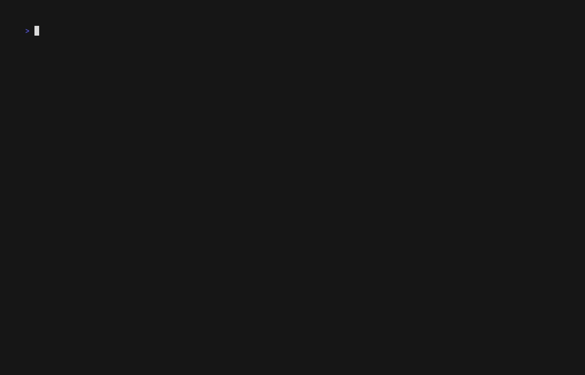

# Teaching Workflow v3.0 Migration Guide

**Upgrading from v2.x to v3.0**

This guide helps you migrate from Teaching Workflow v2.x to v3.0, covering all breaking changes, new features, and migration steps.

---

## 📊 What's New in v3.0

### Major Features

| Feature | Description | Impact |
|---------|-------------|--------|
| **teach doctor** | Environment health check | NEW - Validates entire setup |
| **Backup System** | Automated content backups | NEW - Prevents data loss |
| **Enhanced Status** | Deployment + backup info | ENHANCED - More visibility |
| **Deploy Preview** | Review changes before PR | ENHANCED - Safer deployments |
| **Scholar Templates** | Template selection support | ENHANCED - More flexibility |
| **Lesson Plan Auto-load** | Automatic context enrichment | NEW - Better generation |
| **teach init Overhaul** | --config, --github flags | ENHANCED - More powerful |

---

## 🔄 Breaking Changes

### 1. teach-init Command Removed

**v2.x:**

```bash
teach-init                    # Standalone command
teach-init --help             # Help for init
```

**v3.0:**

```bash
teach init                    # Now part of teach dispatcher
teach init --help             # Help via dispatcher
teach init --config custom.yml --github   # New flags
```

**Migration:**
- Replace all `teach-init` calls with `teach init`
- Update scripts and documentation
- No functionality lost, enhanced instead

---

### 2. Help System Changes

**v2.x:**

```bash
teach exam                    # No built-in help
teach --help                  # General help only
```

**v3.0:**

```bash
teach exam --help             # Command-specific help with examples
teach quiz --help             # Each command has detailed help
teach deploy --help           # Usage, examples, flags
```

**Migration:**
- All sub-commands now support `--help`
- Update documentation to mention `--help` flag
- Training materials should show help examples

---

## ✨ New Features You Should Adopt

### 1. teach doctor - Health Checks


*Demo: Environment health check with teach doctor*

**Purpose:** Validate your teaching environment before you start working.

```bash
# Quick check (deps, R, config, git)
teach doctor

# Full check (all 11 categories)
teach doctor --full

# Brief mode (warnings/failures only)
teach doctor --brief

# JSON output (automation)
teach doctor --json

# Interactive fix
teach doctor --fix
```

**When to Use:**
- Start of semester setup
- After updating dependencies
- Troubleshooting issues
- CI/CD validation

**Benefits:**
- Catch missing dependencies early
- Validate config automatically
- Git status verification
- Scholar integration checks

---

### 2. Automated Backup System



*Demo: Automated backup system with retention policies*

**Purpose:** Protect your teaching content with automatic backups.

**How It Works:**

```bash
# Generate content (auto-creates backup)
teach exam "Topic" --output exams/midterm-1.pdf

# Backup created automatically at:
# exams/.backups/midterm-1.2026-01-18-1430/
```

**Retention Policies:**

Edit `.flow/teach-config.yml`:

```yaml
backups:
  retention:
    assessments: archive    # Keep forever (exams, quizzes, assignments)
    syllabi: archive        # Keep forever (syllabus, rubrics)
    lectures: semester      # Clean after semester (slides, lectures)
```

**Benefits:**
- Never lose content to accidental deletion
- Recover from editing mistakes
- Archive important assessments permanently
- Clean up lecture materials automatically

**Migration Steps:**
1. No action required - backups happen automatically
2. (Optional) Configure retention policies in config
3. (Optional) Review existing content and create initial backups

---

### 3. Enhanced teach status

**New Information Displayed:**

```bash
teach status
```

**v2.x showed:**
- Course info
- Content summary
- Config status
- Git status (if available)

**v3.0 adds:**
- 🚀 **Deployment Status** - Last deploy commit, open PRs
- 💾 **Backup Summary** - Backup count, last backup, size
- ⚠️ **Validation Warnings** - Config issues prominently displayed

**Migration:**
- No changes needed
- Enjoy richer status information
- Update screenshots in documentation

---

### 4. Deploy Preview

**Purpose:** Review changes before creating PR.

**v2.x:**

```bash
teach deploy    # Immediately creates PR
```

**v3.0:**

```bash
teach deploy

# Shows:
# 📋 Changes Preview
# ─────────────────────
# Files changed: 8
#   M  lectures/week-1.qmd
#   M  lectures/week-2.qmd
#   A  exams/midterm-1.pdf
#   D  old-file.md
#
# View full diff? (y/n) y
# [Shows full diff with delta/less]
#
# Create PR? (y/n) y
# ✅ PR created: #42
```

**Benefits:**
- Catch accidental file changes
- Review diff before committing to PR
- Safer deployment process
- Better PR descriptions

**Migration:**
- No changes needed
- Adds extra confirmation step (can use --direct-push to skip)
- Update deployment workflows to account for prompts

---

### 5. Scholar Template Selection

**Purpose:** Use different output templates for different needs.

**v2.x:**

```bash
teach exam "Topic"    # Default template only
```

**v3.0:**

```bash
# Default template
teach exam "Topic"

# Specific template
teach exam "Topic" --template detailed
teach exam "Topic" --template concise
teach exam "Topic" --template practical
```

**Available Templates:**
- `default` - Standard exam format
- `detailed` - More comprehensive
- `concise` - Shorter, focused
- `practical` - Hands-on emphasis

**Migration:**
- Existing commands work unchanged
- Add `--template` flag for custom formatting
- Update course-specific workflows

---

### 6. Lesson Plan Auto-Loading

**Purpose:** Automatically enrich Scholar context with lesson plans.

**Setup:**

Create `lesson-plan.yml` in your project root:

```yaml
weeks:
  - number: 1
    topic: "Introduction to Linear Regression"
    learning_objectives:
      - Understand least squares estimation
      - Interpret regression coefficients
    key_concepts:
      - Simple linear regression
      - R-squared
      - Residual analysis

  - number: 2
    topic: "Multiple Regression"
    # ...
```

**Auto-Loading:**

```bash
# v2.x: Manual context specification
teach exam "Week 1" --context lesson-plan.yml

# v3.0: Automatic if lesson-plan.yml exists
teach exam "Week 1"    # Automatically uses lesson-plan.yml

# Still works explicitly
teach exam "Week 1" --context custom-plan.yml
```

**Benefits:**
- Richer, more targeted content generation
- Week-specific context automatically included
- Learning objectives embedded in assessments
- Consistent course terminology

**Migration:**
1. Create `lesson-plan.yml` (optional but recommended)
2. Existing commands work unchanged
3. Scholar will automatically use lesson plan if present

---

### 7. teach init Enhancements

**New Capabilities:**

```bash
# External config
teach init --config ~/templates/stats-course.yml

# GitHub repo creation
teach init --github

# Combined
teach init --config template.yml --github
```

**Benefits:**
- Reuse course templates across semesters
- Automatic GitHub repository setup
- Non-interactive mode for automation
- Default config generation improved

**Migration:**
- Update course setup scripts
- Create reusable templates
- Consider GitHub integration for new courses

---

## 📋 Migration Checklist

### Pre-Migration

- [ ] Backup your current `.flow/teach-config.yml`
- [ ] Document any custom workflows
- [ ] Review existing scripts using `teach-init`
- [ ] Note any non-standard configurations

### Migration Steps

1. **Update flow-cli:**

   ```bash
   # Via Homebrew
   brew update && brew upgrade flow-cli

   # Via Plugin Manager
   zinit update Data-Wise/flow-cli
   # or
   antidote update
   ```

2. **Replace teach-init:**

   ```bash
   # Find all uses
   grep -r "teach-init" ~/projects/teaching/

   # Replace with teach init
   # (Manual or script-based)
   ```

3. **Run teach doctor:**

   ```bash
   cd ~/projects/teaching/your-course
   teach doctor
   ```

   Fix any issues reported.

4. **Review Config:**

   ```bash
   teach status
   ```

   Check for validation warnings.

5. **Add Backup Configuration (Optional):**

   Edit `.flow/teach-config.yml`:

   ```yaml
   backups:
     retention:
       assessments: archive
       syllabi: archive
       lectures: semester
   ```

6. **Create Lesson Plan (Optional):**

   Create `lesson-plan.yml` with your course structure.

7. **Test Workflows:**

   ```bash
   # Test generation
   teach exam "Test Topic" --dry-run

   # Test deployment
   teach deploy --dry-run  # (if supported)
   ```

8. **Update Documentation:**
   - Update internal course docs
   - Update scripts and automation
   - Update student-facing documentation

### Post-Migration

- [ ] All `teach-init` replaced with `teach init`
- [ ] `teach doctor` passes all checks
- [ ] Backup system tested
- [ ] Deploy preview reviewed
- [ ] (Optional) Lesson plan created
- [ ] (Optional) Templates configured
- [ ] Documentation updated
- [ ] Team/collaborators notified

---

## 🔧 Configuration Changes

### Backup Configuration (New)

Add to `.flow/teach-config.yml`:

```yaml
backups:
  enabled: true                    # Default: true
  retention:
    assessments: archive           # Keep forever
    syllabi: archive               # Keep forever
    lectures: semester             # Clean after semester
  max_backups_per_semester: 5      # For semester retention
```

### Git Workflow (Enhanced)

```yaml
git:
  default_branch: draft            # Unchanged
  remote_name: origin              # Unchanged

workflow:
  teaching_mode: true              # Unchanged
  auto_commit: true                # Unchanged
  deployment_method: pr            # NEW: or 'direct'
  preview_before_pr: true          # NEW in v3.0
```

---

## 🆘 Troubleshooting

### teach-init not found

**Problem:** `teach-init: command not found`

**Solution:**

```bash
# Replace with:
teach init
```

**Cause:** Standalone command removed in v3.0.

---

### Config validation errors

**Problem:** `teach doctor` reports config validation errors

**Solution:**

```bash
# Check config syntax
yq eval .flow/teach-config.yml

# Validate against schema
teach doctor

# See specific errors
teach status
```

**Cause:** Schema updated in v3.0 with stricter validation.

---

### Backup directory growing large

**Problem:** `.backups/` folders consuming disk space

**Solution:**

```bash
# Check backup sizes
du -sh lectures/.backups/

# Clean old semester backups (if semester retention)
# (Automatic cleanup after semester end)

# Manual cleanup if needed
rm -rf lectures/.backups/old-lecture.2025-*

# Or adjust retention policy
# Edit .flow/teach-config.yml
```

---

### Deploy preview blocking automated workflows

**Problem:** `teach deploy` now prompts for confirmation

**Solution:**

```bash
# Use direct push to skip preview
teach deploy --direct-push

# Or in config (.flow/teach-config.yml)
workflow:
  preview_before_pr: false
```

**Note:** Preview is a safety feature; consider keeping it enabled.

---

## 📚 Additional Resources

- **Full v3.0 Guide:** `docs/guides/TEACHING-WORKFLOW-V3-GUIDE.md`
- **Backup System Guide:** `docs/guides/BACKUP-SYSTEM-GUIDE.md`
- **Command Reference:** `docs/reference/MASTER-DISPATCHER-GUIDE.md#teach-dispatcher`
- **Quick Reference:** `docs/reference/MASTER-DISPATCHER-GUIDE.md#teach-dispatcher`

---

## 🎯 Recommended Adoption Path

### Week 1: Core Migration

1. Update flow-cli to v3.0
2. Replace `teach-init` with `teach init`
3. Run `teach doctor` to validate setup
4. Review `teach status` for new information

### Week 2: Backup System

1. Configure retention policies
2. Test backup creation with sample content
3. Verify backup structure
4. Update team documentation

### Week 3: Enhanced Features

1. Create `lesson-plan.yml`
2. Test template selection
3. Try deploy preview workflow
4. Update deployment scripts

### Week 4: Optimization

1. Fine-tune backup retention
2. Customize templates
3. Integrate `teach doctor` into CI/CD
4. Train collaborators on new features

---

## 💡 Tips for Success

1. **Start Small:** Migrate one course at a time
2. **Test Thoroughly:** Use `--dry-run` flags when available
3. **Backup First:** Keep v2.x backups until comfortable
4. **Read Help:** All commands now have `--help`
5. **Use doctor:** Run `teach doctor` regularly
6. **Adopt Gradually:** Don't rush to use all features
7. **Document Changes:** Keep notes on customizations
8. **Share Knowledge:** Help teammates migrate

---

## 🎉 Benefits Summary

After migration, you'll have:

- ✅ Automated content backups (never lose work)
- ✅ Environment validation (catch issues early)
- ✅ Enhanced visibility (better status information)
- ✅ Safer deployments (preview before PR)
- ✅ Richer generation (lesson plan integration)
- ✅ More flexibility (template selection)
- ✅ Better help (command-specific --help)
- ✅ Streamlined init (external configs, GitHub)

---

**Version:** v3.0
**Last Updated:** 2026-01-18
**Estimated Migration Time:** 1-2 hours per course

For questions or issues, see the [Troubleshooting](#troubleshooting) section or open an issue on GitHub.
