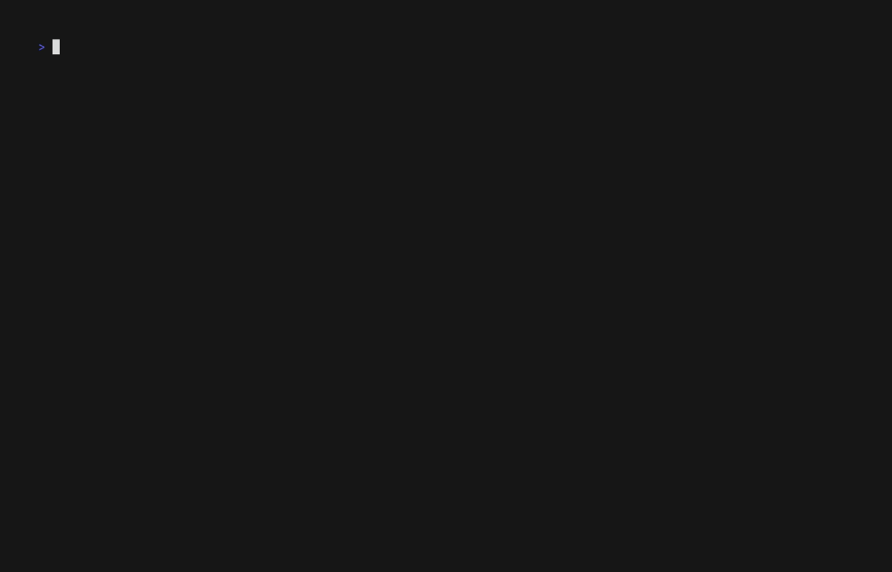

---
tags:
  - guide
  - teaching
---

# Teaching Workflow v3.0 Guide

**Version:** v5.14.0
**Last Updated:** 2026-01-21
**Target Audience:** Instructors using flow-cli for course management

---

## Table of Contents

1. [Overview](#overview)
2. [What's New in v3.0](#whats-new-in-v30)
3. [Getting Started](#getting-started)
4. [Health Checks](#health-checks-v2)
5. [Content Creation Workflow](#content-creation-workflow)
6. [Deployment Workflow](#deployment-workflow)
7. [Backup Management](#backup-management)
8. [End of Semester](#end-of-semester)
9. [Best Practices](#best-practices)
10. [Troubleshooting](#troubleshooting)

---

## Overview

Teaching Workflow v3.0 provides a complete solution for managing course content from creation to deployment, with automated backups, health monitoring, and safe deployment previews.

### Design Philosophy

- **Safety First** - Preview changes before deploying, backup before modifying
- **Context-Aware** - Auto-load lesson plans for better Scholar integration
- **ADHD-Friendly** - Clear status, visual feedback, minimal cognitive load
- **Automated** - Backups happen automatically, retention policies apply at semester end

---

## What's New in v3.0

### 1. Environment Health Checks (v2)

```bash
teach doctor            # Quick check (< 3s): deps, R, config, git
teach doctor --full     # Full check: all 11 categories
```

Quick mode validates essentials: dependencies, R environment + renv, project configuration, and git setup.
Full mode adds: R packages, Quarto extensions, Scholar integration, hooks, cache, macros (opt-in), teaching style.

**Why it matters:** Catch setup issues before they cause problems during content creation.

### 2. Content Validation

The `teach validate` command provides comprehensive content validation for your Quarto files:

```bash
# YAML frontmatter validation only
teach validate --yaml

# Syntax validation (typos, unpaired delimiters)
teach validate --syntax

# Full render validation
teach validate --render

# Custom validators (if configured)
teach validate --custom

# Watch mode (auto-validate on file changes)
teach validate --watch

# Validate specific files or directories
teach validate lectures/week-05.qmd
teach validate lectures/
```

**Validation modes:**

| Mode | What It Checks | Speed |
|------|----------------|-------|
| `--yaml` | Frontmatter syntax and required fields | Fast |
| `--syntax` | Code chunks, cross-references, links | Medium |
| `--render` | Full Quarto render validation | Slow |
| `--custom` | Custom validators from `.teach/validators/` | Varies |

### 3. Automated Backup System

Every content modification creates a timestamped backup:

```
lectures/week-05-regression.qmd
lectures/.backups/
  └── week-05-regression.2026-01-18-1430/
  └── week-05-regression.2026-01-17-0915/
  └── week-05-regression.2026-01-15-1620/
```

**Retention policies:**
- **Archive** - Keep forever, move to `.flow/archives/` at semester end
- **Semester** - Delete at semester end (with confirmation)

**Why it matters:** Accidentally deleted a paragraph? Restore from any backup point in seconds.

### 3. Enhanced Status Dashboard


*Demo: Enhanced status showing comprehensive project overview*

```bash
teach status
```

Shows everything at a glance:
- Course and semester info
- Current branch (draft/production)
- Config validation status
- **Deployment status** - Last deploy commit, open PRs
- **Backup summary** - Total backups, sizes, last backup time
- Content inventory

**Why it matters:** Complete situational awareness in one command.

### 4. Deploy Preview

```bash
teach deploy
```

Before creating a PR, see exactly what changed:

```
📦 Changes Preview
━━━━━━━━━━━━━━━━━━━━━━━━━━━━━━━━━━━━━━━━━
Files changed since last deployment:

  🟢 A lectures/week-05-multiple-regression.qmd
  🔵 M lectures/week-04-diagnostics.qmd
  🔴 D _old/draft-notes.txt

Summary: 1 added, 2 modified, 1 deleted

View full diff? [y/N]
```

**Why it matters:** No surprises. Know exactly what students will see.

### 5. Scholar Template Selection



*Demo: Using Scholar with templates and lesson plan auto-loading*

```bash
teach exam "Midterm" --template typst
teach assignment "HW4" --template docx
```

Choose output format for generated content:
- `markdown` - Standard Markdown (default)
- `quarto` - Quarto document
- `typst` - Academic paper format
- `pdf` - Direct PDF output
- `docx` - Microsoft Word format

**Why it matters:** Generate content in your preferred format without manual conversion.

### 6. Lesson Plan Management (v5.22.0)

Create and manage lesson plans with the `teach plan` command:

```bash
# Create a week with topic and style
teach plan create 5 --topic "Multiple Regression" --style computational

# Create interactively (prompted for details)
teach plan create 6

# Auto-populate topic from teach-config.yml
teach plan create 7 --style applied

# List all plans with gap detection
teach plan list

# View a specific week
teach plan show 5

# Edit in $EDITOR (jumps to correct line)
teach plan edit 5
```

Plans are stored in `.flow/lesson-plans.yml`:

```yaml
weeks:
  - number: 5
    topic: "Multiple Regression"
    style: "computational"
    objectives:
      - "Understand multicollinearity"
      - "Interpret regression coefficients"
    subtopics: []
    key_concepts: []
    prerequisites: []
```

Scholar commands automatically load plans for enhanced context.

**Why it matters:** More targeted, course-specific content generation.

**See:** [Tutorial 27: Lesson Plan Management](../tutorials/27-lesson-plan-management.md)

### 7. Smart Initialization

```bash
# Load departmental template
teach init --config ~/templates/stats-course.yml

# Create and push to GitHub in one step
teach init "STAT 440" --github
```

**Why it matters:** Faster setup, consistent configuration across courses.

### 8. Git Hooks Integration

Automated quality checks that run on git operations, catching errors before they reach GitHub.

#### Installation

```bash
# Install all teaching workflow hooks
teach hooks install

# Force reinstall (overwrites existing hooks)
teach hooks install --force

# Check what's installed
teach hooks status
```

**Example output from `teach hooks status`:**

```
Hook status:

✓ pre-commit: v1.0.0 (up to date)
✓ pre-push: v1.0.0 (up to date)
✓ prepare-commit-msg: v1.0.0 (up to date)

Summary: 3 up to date, 0 outdated, 0 missing
```

#### What Each Hook Does

**1. pre-commit Hook** - Validates content before commit

Runs automatically when you execute `git commit`:

```bash
# You run:
git commit -m "Add lecture 5"

# Hook automatically validates:
✓ YAML frontmatter syntax
✓ Required fields (title, date, week)
✓ Cross-reference integrity
✓ Sourced R file dependencies
✓ Code chunk syntax
```

**Real-world example:**

```bash
$ git commit -m "Add week 5 lecture"

Running pre-commit validation...

✓ YAML validation passed
✓ Dependencies verified
✗ ERROR: lectures/week-05.qmd missing required field: 'date'

Commit aborted. Fix the errors above and try again.
```

**2. pre-push Hook** - Ensures deployment readiness

Runs automatically when you execute `git push`:

```bash
# You run:
git push origin main

# Hook automatically checks:
✓ No uncommitted changes
✓ No untracked files in critical directories
✓ All required files present
✓ Git working tree is clean
```

**Real-world example:**

```bash
$ git push origin main

Running pre-push checks...

✗ ERROR: You have uncommitted changes:
  M lectures/week-05.qmd
  ?? exams/midterm-draft.qmd

Please commit or stash these changes before pushing.
Push aborted.
```

**3. prepare-commit-msg Hook** - Auto-formats commit messages

Runs automatically before the commit message editor opens:

```bash
# You run:
git commit

# Hook automatically adds context:
# - Current week number
# - Timing information (if enabled)
# - Content type detection
# - Change summary
```

**Real-world example:**

```bash
# Before hook:
Your commit message: "update lecture"

# After hook enhancement:
[Week 5] Update lecture

- Modified: lectures/week-05-regression.qmd
- Render time: 3.2s

Co-Authored-By: Claude Sonnet 4.5 <noreply@anthropic.com>
```

#### Configuration Options

Control hook behavior with environment variables:

```bash
# ~/.zshrc or project-specific .envrc

# Enable full Quarto rendering on commit (slower but thorough)
export QUARTO_PRE_COMMIT_RENDER=1

# Use parallel rendering (default: on)
export QUARTO_PARALLEL_RENDER=1
export QUARTO_MAX_PARALLEL=4

# Add timing information to commit messages (default: on)
export QUARTO_COMMIT_TIMING=1

# Add validation summary to commit messages
export QUARTO_COMMIT_SUMMARY=1

# Skip hooks temporarily (use sparingly!)
git commit --no-verify -m "WIP: draft changes"
```

**Configuration Examples:**

**Scenario 1: Fast iteration mode** (development phase)

```bash
# Minimal validation, fast commits
export QUARTO_PRE_COMMIT_RENDER=0
export QUARTO_COMMIT_TIMING=0
export QUARTO_COMMIT_SUMMARY=0

# Commits are fast, hooks only check YAML syntax
```

**Scenario 2: Production mode** (before deployment)

```bash
# Full validation, comprehensive checks
export QUARTO_PRE_COMMIT_RENDER=1
export QUARTO_PARALLEL_RENDER=1
export QUARTO_MAX_PARALLEL=8
export QUARTO_COMMIT_TIMING=1
export QUARTO_COMMIT_SUMMARY=1

# Commits are slower but catch all issues
```

**Scenario 3: CI/CD mode** (automated workflows)

```bash
# Skip interactive prompts, JSON output
export QUARTO_HOOKS_QUIET=1
export QUARTO_HOOKS_CI=1

# Hooks run non-interactively, suitable for automation
```

#### Hook Management

**Check for updates:**

```bash
teach hooks status

# Output shows if upgrades available:
⚠ pre-commit: v0.9.0 (upgrade to v1.0.0)
⚠ pre-push: v0.9.0 (upgrade to v1.0.0)

Run 'teach hooks upgrade' to update outdated hooks
```

**Upgrade hooks:**

```bash
teach hooks upgrade

# Interactive confirmation:
Hooks to upgrade: 2
  - pre-commit (v0.9.0 → v1.0.0)
  - pre-push (v0.9.0 → v1.0.0)

Upgrade these hooks? [Y/n] y

✓ Upgraded pre-commit (v1.0.0)
✓ Upgraded pre-push (v1.0.0)

All hooks upgraded successfully (2 hooks)
```

**Uninstall hooks:**

```bash
teach hooks uninstall

# Safety confirmation:
⚠ This will remove all flow-cli managed hooks

Continue? [y/N] y

✓ Removed pre-commit
✓ Removed pre-push
✓ Removed prepare-commit-msg

Uninstalled 3 hook(s)
```

#### Common Workflows

**Weekly content update with hooks:**

```bash
# 1. Create new lecture
teach lecture "Multiple Regression" --week 5

# 2. Edit content
vim lectures/week-05-regression.qmd

# 3. Commit (hooks run automatically)
git add lectures/week-05-regression.qmd
git commit -m "Add week 5 lecture on multiple regression"

# Hook validates:
✓ YAML valid
✓ Dependencies checked
✓ Cross-references verified

[Week 5] Add week 5 lecture on multiple regression
- Added: lectures/week-05-regression.qmd
- Render time: 4.1s

# 4. Push (pre-push hook validates)
git push origin main

✓ Working tree clean
✓ All files committed
Push successful!
```

**Emergency bypass (use with caution):**

```bash
# Skip hooks for urgent fixes
git commit --no-verify -m "WIP: emergency fix"
git push --no-verify

# Later: validate manually
teach validate lectures/
```

**Testing hooks without committing:**

```bash
# Run pre-commit validation manually
.git/hooks/pre-commit

# Output shows what would happen:
Running pre-commit validation...
✓ All checks passed
```

#### Troubleshooting

**Hook not running:**

```bash
# Check if hooks are executable
ls -la .git/hooks/

# Should show:
-rwxr-xr-x  pre-commit
-rwxr-xr-x  pre-push
-rwxr-xr-x  prepare-commit-msg

# If not executable:
chmod +x .git/hooks/pre-commit
chmod +x .git/hooks/pre-push
chmod +x .git/hooks/prepare-commit-msg
```

**Hook fails with "command not found":**

```bash
# Ensure dependencies are installed
teach doctor

# Install missing dependencies
teach doctor --fix
```

**Hook takes too long:**

```bash
# Disable full rendering for faster commits
export QUARTO_PRE_COMMIT_RENDER=0

# Or use parallel rendering
export QUARTO_PARALLEL_RENDER=1
export QUARTO_MAX_PARALLEL=8
```

**Hook conflicts with existing hooks:**

```bash
# Check what hooks exist
ls -la .git/hooks/

# Backup existing hooks before install
cp .git/hooks/pre-commit .git/hooks/pre-commit.backup

# Install (will backup automatically)
teach hooks install

# Existing hooks are backed up as:
# .git/hooks/pre-commit.backup-<timestamp>
```

#### Why Use Hooks?

**Benefits:**

1. **Catch errors early** - Find issues before pushing to GitHub
2. **Consistent quality** - Enforce standards automatically
3. **Save time** - No manual validation needed
4. **Better commits** - Auto-formatted messages with context
5. **Team consistency** - Everyone uses same validation

**Real-world impact:**

```
Without hooks:
- Push broken YAML → CI fails → Fix → Push again (15 min)
- Forget to commit file → Incomplete push → Add missing file (10 min)
- Generic commit messages → Hard to track changes later

With hooks:
- YAML validated before commit → Never push broken files
- Pre-push checks catch missing files → Always complete
- Auto-formatted messages → Clear history
```

See [Teaching Git Workflow Refcard](../reference/MASTER-DISPATCHER-GUIDE.md#teach-dispatcher) for complete hook documentation and advanced configuration.

---

## Getting Started

### Step 1: Verify Environment

Before creating your first course:

```bash
teach doctor
```

If any checks fail:

```bash
# Interactive install mode
teach doctor --fix

# Manual install
brew install yq gh quarto
```

### Step 2: Initialize Course


*Demo: Initializing a new teaching project with teach init*

```bash
# Interactive mode (recommended for first time)
teach init "STAT 440 - Regression Analysis"

# Or use a template
teach init "STAT 440" --config ~/templates/stats-course.yml

# With GitHub repo creation
teach init "STAT 440" --github
```

**What gets created:**

- `.flow/teach-config.yml` - Course configuration
- `.gitignore` - Teaching-specific patterns
- `README.md` - Course README
- Directory structure:
  - `lectures/`
  - `exams/`
  - `assignments/`
  - `quizzes/`
  - `slides/`
  - `syllabi/`
  - `rubrics/`

### Step 3: Create Lesson Plans (Optional but Recommended)

Use `teach plan` to create structured lesson plans that Scholar reads automatically:

```bash
# Create first few weeks
teach plan create 1 --topic "Introduction to Regression" --style conceptual
teach plan create 2 --topic "Simple Linear Regression" --style computational
teach plan create 3 --topic "Model Diagnostics" --style applied

# Review what you've created
teach plan list
```

Plans are stored in `.flow/lesson-plans.yml` and loaded by Scholar for targeted content generation.

**Tip:** If your `teach-config.yml` has week topics, `teach plan create N` auto-populates the topic.

**See:** [Tutorial 27: Lesson Plan Management](../tutorials/27-lesson-plan-management.md) for the complete workflow.

### Step 4: Verify Setup

```bash
teach status
```

Expected output:

```
📚 Teaching Project Status
━━━━━━━━━━━━━━━━━━━━━━━━━━━━━━━━━━━━━━━━━
  Course:   STAT 440 - Regression Analysis
  Term:     Spring 2026
  Branch:   draft
  ✓ Safe to edit (draft branch)

Config Validation:
  ✓ Valid (v1.2.0)

Content Inventory:
  • Lectures:    0
  • Exams:       0
  • Assignments: 0
```

---

## Health Checks (v2)

### Two-Mode Architecture

`teach doctor` v2 uses a two-mode design for fast feedback:

| Mode | Command | Time | Categories |
|------|---------|------|------------|
| **Quick** (default) | `teach doctor` | < 1s | Dependencies, R environment, config, git |
| **Full** | `teach doctor --full` | 3-5s | All 11 categories |

Quick mode runs 4 essential categories. Full mode adds R packages, Quarto extensions, Scholar integration, git hooks, cache health, macros (opt-in), and teaching style.

### When to Run

- **Initial setup** - `teach doctor --fix` (installs missing tools)
- **Semester start** - `teach doctor --full` (verify everything ready)
- **Pre-deploy** - `teach doctor --brief` (quick warnings check)
- **Troubleshooting** - `teach doctor --verbose` (detailed output)

### Quick Check (Default)

```bash
teach doctor
```

Output:

```
╭────────────────────────────────────────────────────────────╮
│  Teaching Environment (quick check)                        │
╰────────────────────────────────────────────────────────────╯

Dependencies:
  ✓ yq (4.52.2)
  ✓ git (2.52.0)
  ✓ quarto (1.8.27)
  ✓ gh (2.86.0)
  ✓ examark (0.6.6)
  ✓ claude (2.1.37)

R Environment:
  ✓ R (4.5.2) | renv active | 27 packages locked

Project Configuration:
  ✓ .flow/teach-config.yml exists
  ✓ Course name: STAT 545
  ✓ Semester: spring
  ✓ Dates configured (2026-01-19 - 2026-05-16)

Git Setup:
  ✓ Git repository initialized
  ✓ Draft branch exists
  ✓ Production branch exists: production
  ✓ Remote configured: origin
  ✓ Working tree clean

  Skipped (run --full): R packages, quarto extensions, hooks, cache, macros, style

────────────────────────────────────────────────────────────
Passed: 17  [0s]
────────────────────────────────────────────────────────────
```

### Full Check

```bash
teach doctor --full
```

Adds 7 more categories with a spinner for slower checks (R packages, cache analysis).

### Output Modes

```bash
teach doctor --brief      # Warnings and failures only
teach doctor --verbose    # Detailed: per-package R, full macro list (implies --full)
teach doctor --json       # Machine-readable JSON
teach doctor --ci         # CI mode: no color, key=value, exit 1 on failure
```

### Interactive Fix Mode

```bash
teach doctor --fix
```

Implies `--full` and prompts for each fixable issue:

```bash
$ teach doctor --fix

Dependencies:
  ✗ quarto (not found)
    Install quarto? [y/N]: y
    → brew install --cask quarto
    ✓ Installed quarto

R Packages:
  ⚠ 3/5 R packages installed | Missing: tidyr, knitr
    Install via renv or system? [r/s]: r
    → renv::install(c("tidyr", "knitr"))
```

### Health Indicator

After each run, `teach doctor` writes `.flow/doctor-status.json`. The `teach` command shows a colored dot on startup:

| Dot | Status | Meaning |
|-----|--------|---------|
| Green | All passed | No warnings or failures |
| Yellow | Warnings | Non-blocking issues found |
| Red | Failures | Critical issues need attention |

Run `teach doctor` to refresh the dot.

### Real-World Scenarios

**Scenario 1: New machine setup**

```bash
teach doctor --fix
# Installs missing: yq, quarto, gh, R packages
# Ready to start teaching!
```

**Scenario 2: Semester preparation**

```bash
cd ~/teaching/stat-440
teach doctor --full

# ✓ All dependencies present
# ✗ Config missing required field: 'semester'
# ✗ Draft branch not found

# Fix and verify
vim .flow/teach-config.yml
git checkout -b draft
teach doctor
```

**Scenario 3: CI/CD integration**

```bash
# CI mode: no color, exit 1 on failure
teach doctor --ci --full || exit 1

# Or with JSON parsing
status=$(teach doctor --json --full | jq -r '.summary.status')
if [ "$status" = "red" ]; then
  echo "Health check failed"
  exit 1
fi
```

**Scenario 4: Troubleshooting deployment**

```bash
teach doctor --brief
# ✗ Working tree not clean: 3 uncommitted files
# ✗ Remote not configured

git add -A && git commit -m "Update content"
git remote add origin https://github.com/user/stat-440
teach deploy
```

### Common Issues and Solutions

| Issue | Solution |
|-------|----------|
| `yq: command not found` | `brew install yq` or `teach doctor --fix` |
| `quarto: command not found` | `brew install quarto` or use installer from quarto.org |
| `gh: command not found` | `brew install gh` and run `gh auth login` |
| Config validation fails | Check YAML syntax: `yq eval .flow/teach-config.yml` |
| Git errors | Ensure repo initialized: `git init` |
| Remote not configured | Add remote: `git remote add origin <url>` |
| Working tree not clean | Commit changes: `git add -A && git commit` |
| Scholar skills not found | Install Scholar plugin in Claude Desktop |

!!! tip "See also"
    [Tutorial 32: Health Check](../tutorials/32-teach-doctor.md) for a complete step-by-step guide.

---

## Content Creation Workflow

### Weekly Pattern

**Monday:** Plan week's content

```bash
# Check current week
teach week

# Output:
# 📅 Current Week: 5
# 📚 Course: STAT 440 - Regression Analysis
# 🗓️  Date Range: Feb 10-14, 2026
# 📝 Topic: Multiple Regression

# View lesson plan details
cat lesson-plan.yml | yq ".weeks[] | select(.number == 5)"

# Output:
# number: 5
# topic: "Multiple Regression"
# dates: "2026-02-10 - 2026-02-14"
# learning_objectives:
#   - "Understand multicollinearity"
#   - "Interpret regression coefficients"
#   - "Calculate adjusted R-squared"
# key_concepts:
#   - "VIF (Variance Inflation Factor)"
#   - "Partial F-tests"
#   - "Model selection criteria"
```

**Tuesday-Thursday:** Create content

```bash
# Create lecture with auto-loaded lesson plan context
teach lecture "Multiple Regression" --week 5

# Scholar uses lesson plan to generate targeted content:
# ✓ Learning objectives included
# ✓ Key concepts explained
# ✓ Examples aligned with course level

# Content is automatically backed up
# Scholar auto-loads lesson-plan.yml for context
```

**Friday:** Create assessments

```bash
# Create quiz
teach quiz "Week 5 Quiz" --questions 10 --time-limit 15

# Create homework
teach assignment "Homework 4" \
  --due-date "2026-02-18" \
  --points 100
```

**Weekend:** Review and deploy

```bash
# Check status
teach status

# Deploy with preview
teach deploy
```

### Creating Exams

**Midterm exam:**

```bash
teach exam "Midterm - Chapters 1-5" \
  --questions 30 \
  --duration 120 \
  --types "mc,short,essay" \
  --template typst
```

**What happens:**

1. Scholar loads `lesson-plan.yml` for context
2. Generates exam in `exams/midterm.typ`
3. Creates timestamped backup in `exams/.backups/`
4. Offers to commit with auto-generated message

**Final exam:**

```bash
teach exam "Final Exam - Comprehensive" \
  --questions 50 \
  --duration 180 \
  --format quarto
```

### Creating Assignments

```bash
teach assignment "Problem Set 3 - Diagnostics" \
  --due-date "2026-03-01" \
  --points 100 \
  --template docx
```

**Scholar will include:**

- Problem statements from lesson plan
- Relevant course concepts
- Grading criteria
- Due date in YAML frontmatter

### Creating Lecture Materials

**Lecture notes:**

```bash
teach lecture "Collinearity and VIF" --week 6
```

**Slides from lecture:**

```bash
teach slides "Week 6 Slides" \
  --from-lecture lectures/week-06-collinearity.qmd \
  --theme academic
```

**Guest lecture (custom styling):**

```bash
teach slides "Guest: Machine Learning in Stats" \
  --theme minimal \
  --template typst
```

### Template Selection Guide

| Format | Use Case | Command |
|--------|----------|---------|
| `markdown` | Web content, GitHub | Default |
| `quarto` | Academic papers, reports | `--template quarto` |
| `typst` | LaTeX alternative, clean PDFs | `--template typst` |
| `pdf` | Direct PDF generation | `--template pdf` |
| `docx` | Sharing with non-technical collaborators | `--template docx` |

---

## Deployment Workflow


*Demo: Deploying to preview branch with teach deploy --preview*

### Overview

Teaching Workflow v3.0 uses a **draft → production** PR-based workflow:

1. Work on `draft` branch
2. Preview changes before deploying
3. Create PR (draft → main/production)
4. Review and merge on GitHub
5. Site automatically rebuilds

### Standard Deployment

```bash
# 1. Check current status
teach status

# 2. Ensure on draft branch
git checkout draft

# 3. Commit any changes
g status
g commit "feat: add Week 6 content"

# 4. Deploy with preview
teach deploy
```

### Deploy Preview

```
📦 Changes Preview
━━━━━━━━━━━━━━━━━━━━━━━━━━━━━━━━━━━━━━━━━
Files changed since last deployment:

  🟢 A lectures/week-06-collinearity.qmd
  🟢 A assignments/homework-05.qmd
  🔵 M syllabi/schedule.qmd
  🔵 M _quarto.yml
  🔴 D _old/scratch.txt

Summary: 2 added, 2 modified, 1 deleted

View full diff? [y/N]
```

**Options:**

- `y` - View full diff with syntax highlighting
- `n` - Skip and proceed to PR creation

### Pull Request Creation

After preview, PR is automatically created:

```
✓ Pull request created: #42
  Title: Week 6 content deployment
  URL: https://github.com/user/course/pull/42

Commits included:
  • a1b2c3d - feat: add Week 6 lecture on collinearity
  • e4f5g6h - feat: add Homework 5
  • i7j8k9l - docs: update schedule

Review and merge on GitHub when ready.
```

### Pre-flight Checks

`teach deploy` automatically checks:

1. ✅ On draft branch
2. ✅ No uncommitted changes
3. ✅ Remote up-to-date
4. ✅ No conflicts with production

If any check fails, you'll get clear instructions:

```
✗ Error: Uncommitted changes detected

You have 3 uncommitted files:
  M lectures/week-06.qmd
  M _quarto.yml
  ?? scratch.txt

→ Commit or stash changes first:
    g commit "your message"
    g stash
```

### Direct Push (Advanced)

Bypass PR workflow for hotfixes:

```bash
teach deploy --direct-push
```

⚠️ **Warning:** Use sparingly. PR workflow provides:
- Change review before going live
- Deployment history
- Rollback capability

---

## Backup Management


*Demo: Automated backup system with retention policies*

### How Backups Work

**Automatic backups:**

Every time you modify content (via Scholar or manual edit), a backup is created:

```
lectures/week-05.qmd
lectures/.backups/
  └── week-05.2026-01-18-1430/  # Latest
  └── week-05.2026-01-17-0915/  # Yesterday
  └── week-05.2026-01-15-1620/  # Last week
```

**Retention policies:**

Configure in `.flow/teach-config.yml`:

```yaml
backups:
  retention:
    assessments: archive    # Keep exam/quiz backups
    lectures: semester      # Delete at semester end
    syllabi: archive        # Keep syllabus backups
```

### View Backup Status

```bash
teach status
```

Output includes:

```
Backup Summary:
  Total backups:  12 across all content
  Last backup:    2026-01-18 10:15 (4 hours ago)

  By content type:
    • Exams:       3 backups (4.2 MB)
    • Lectures:    5 backups (8.1 MB)
    • Assignments: 4 backups (2.3 MB)
```

### Restore from Backup

**Manual restore:**

```bash
# 1. Find backup you want
ls -lt lectures/.backups/

# 2. Copy content back
cp -R lectures/.backups/week-05.2026-01-15-1620/* \
      lectures/week-05.qmd
```

**Using git (if backed up):**

```bash
# Find when file was good
git log --oneline lectures/week-05.qmd

# Restore specific version
git checkout <commit-hash> lectures/week-05.qmd
```

### Delete Old Backups

**Safe deletion (with confirmation):**

```bash
# Will prompt before deleting
rm -rf lectures/.backups/week-05.2026-01-15-1620
```

**Force deletion (scripts):**

```bash
_teach_delete_backup lectures/.backups/week-05.2026-01-15-1620 --force
```

### Archive at Semester End

```bash
teach archive "Spring 2025"
```

**What happens:**

1. Applies retention policies:
   - **Archive** - Moves to `.flow/archives/Spring-2025/`
   - **Semester** - Deletes after confirmation

2. Generates summary:

```
✓ Archive complete: .flow/archives/Spring-2025

  Archived: 8 content folders
  Deleted:  5 content folders (semester retention)
```

---

## End of Semester

### Checklist

- [ ] Deploy final content
- [ ] Grade and release final exams
- [ ] Archive backups
- [ ] Update `.STATUS` files
- [ ] Create semester tag
- [ ] Prepare for next semester

### Step-by-Step

**1. Final deployment**

```bash
# Check everything is committed
g status

# Deploy
teach deploy

# Verify PR merged
gh pr list --state merged
```

**2. Archive backups**

```bash
teach archive "Spring 2025"
```

**3. Create semester tag**

```bash
# Tag final state
git tag -a spring-2025-final -m "End of Spring 2025 semester"
git push origin spring-2025-final
```

**4. Update .STATUS**

```yaml
# .STATUS
status: complete
progress: 100
archived: 2025-05-15
next_semester: Fall 2025
notes: |
  Spring 2025 semester complete.
  Archive: .flow/archives/Spring-2025
```

**5. Prepare for next semester**

```bash
# Update config for new semester
teach config

# Update these fields:
#   course.semester: Fall
#   course.year: 2025
#   semester_info.start_date: 2025-08-25

# Initialize dates
teach dates init
```

---

## Best Practices

### 1. Use Lesson Plans

**Create at semester start:**

```bash
# Create plans for key weeks
teach plan create 1 --topic "Introduction" --style conceptual
teach plan create 2 --topic "Foundations" --style computational

# Or create all weeks using config auto-populate
for w in $(seq 1 15); do
    teach plan create $w --style conceptual
done

# Review for gaps
teach plan list
```

**Benefits:**

- Scholar generates more targeted content
- Consistent terminology across materials
- Easy to revise with `teach plan edit N`
- Gap detection warns about missing weeks

### 2. Regular Health Checks

```bash
# Weekly check (Friday before deploy)
teach doctor --brief

# Monthly full check
teach doctor
```

### 3. Commit Often

```bash
# After creating each piece of content
g commit "feat: add Week 5 lecture"
g commit "feat: add Homework 4"

# Not this
g commit "added a bunch of stuff"
```

**Why:** Easy to track what changed, revert if needed.

### 4. Preview Before Deploy

```bash
# Always review changes
teach deploy   # Don't skip the preview!
```

### 5. Backup Configuration

**Conservative settings (default):**

```yaml
backups:
  retention:
    assessments: archive   # Safe: keep forever
    lectures: archive      # Safe: keep forever
    syllabi: archive       # Safe: keep forever
```

**Aggressive settings (if disk space limited):**

```yaml
backups:
  retention:
    assessments: archive   # Keep exams
    lectures: semester     # Delete lecture backups
    syllabi: archive       # Keep syllabus
```

### 6. Use Templates

**Department template:**

```yaml
# ~/templates/stats-course.yml
course:
  department: "Statistics"
  level: "400"
  credits: 3
  instructor: "Dr. Smith"

branches:
  draft: draft
  production: main

backups:
  retention:
    assessments: archive
    lectures: semester
    syllabi: archive
```

**Use it:**

```bash
teach init "STAT 440" --config ~/templates/stats-course.yml
```

---

## Troubleshooting

### teach doctor Fails

**Issue:** Missing dependencies

```bash
# View what's missing
teach doctor

# Install missing tools
brew install yq gh quarto

# Verify fix
teach doctor
```

**Issue:** Config validation fails

```bash
# Check syntax
yq eval .flow/teach-config.yml

# View schema
cat lib/templates/teaching/teach-config.schema.json

# Common issues:
# - Invalid date format (use YYYY-MM-DD)
# - Missing required fields (course.name, semester_info)
# - Invalid YAML syntax
```

### teach deploy Fails

**Issue:** Not on draft branch

```bash
# Switch to draft
git checkout draft

# Try again
teach deploy
```

**Issue:** Uncommitted changes

```bash
# View changes
g status

# Commit
g commit "your message"

# Or stash
g stash
```

**Issue:** Conflicts with production

```bash
# Fetch latest
git fetch origin main

# Rebase
git rebase origin/main

# Resolve conflicts
# Edit conflicted files
g add .
git rebase --continue

# Deploy
teach deploy
```

**Issue:** Config file not found

```bash
# Initialize project
teach init "Course Name"

# Verify
ls -la .flow/teach-config.yml
```

### Backup Issues

**Issue:** Backups taking too much space

```bash
# View sizes
teach status

# Archive old semester
teach archive "Fall 2024"

# Or manual cleanup
rm -rf lectures/.backups/*2024*
```

**Issue:** Can't restore backup

```bash
# Verify backup exists
ls -la lectures/.backups/

# Check permissions
ls -ld lectures/.backups/

# Restore manually
cp -R lectures/.backups/week-05.LATEST/* lectures/
```

### Scholar Integration Issues

**Issue:** Lesson plan not loading

```bash
# Verify file exists
ls -la lesson-plan.yml

# Check syntax
yq eval lesson-plan.yml

# Validate against schema
teach doctor
```

**Issue:** Scholar not generating context-aware content

```bash
# Check Scholar installed
teach doctor

# Verify lesson plan format
cat lesson-plan.yml

# Try explicit context
teach exam "Topic" --context
```

---

## Advanced Usage

### Automation Scripts

**Weekly deployment script:**

```bash
#!/usr/bin/env zsh
# weekly-deploy.sh

# Health check
teach doctor --brief || exit 1

# Ensure clean state
if [[ -n "$(git status --porcelain)" ]]; then
  g commit "feat: week $(date +%V) content"
fi

# Deploy
teach deploy --dry-run

# Prompt for confirmation
read -q "REPLY?Deploy to production? [y/N] "
[[ "$REPLY" = "y" ]] && teach deploy
```

**Backup verification script:**

```bash
#!/usr/bin/env zsh
# verify-backups.sh

# Get backup summary
summary=$(teach status | grep -A 10 "Backup Summary")

# Check backup count
count=$(echo "$summary" | grep "Total backups" | awk '{print $3}')

if (( count < 5 )); then
  echo "⚠️ Warning: Only $count backups found"
  echo "Expected at least 5 backups"
  exit 1
fi

echo "✓ Backup verification passed: $count backups"
```

### Custom Workflows

**Exam creation workflow:**

```bash
# 1. Create exam
teach exam "Midterm" --template typst --dry-run

# 2. Review generated content
# Edit if needed

# 3. Create solution key
teach solution "Midterm" --template typst

# 4. Create rubric
teach rubric "Midterm" --criteria 5

# 5. Commit all together
g add exams/
g commit "feat: add midterm exam with solutions and rubric"
```

**Lecture workflow:**

```bash
# 1. Create lecture notes
teach lecture "Topic" --week N

# 2. Generate slides
teach slides "Topic Slides" \
  --from-lecture lectures/week-N-topic.qmd

# 3. Create practice problems
teach assignment "Practice Problems N" \
  --points 0  # Ungraded

# 4. Deploy together
g commit "feat: complete Week N materials"
teach deploy
```

---

## Complete Real-World Examples

### Example 1: First Day of Semester

**Goal:** Set up course, create syllabus, initialize GitHub Pages

```bash
# Day 1: Initial setup
cd ~/teaching
teach init "STAT 440 - Regression Analysis" --github

# Output:
# ✓ Created project structure
# ✓ Generated .flow/teach-config.yml
# ✓ Initialized git repository
# ✓ Created GitHub repository: github.com/user/stat-440
# ✓ Set up draft and main branches
#
# Next steps:
#   1. cd ~/teaching/stat-440
#   2. teach doctor --fix (install dependencies)
#   3. teach hooks install (enable quality checks)

cd stat-440

# Day 2: Install dependencies and hooks
teach doctor --fix
# [Interactive prompts install yq, quarto, gh]

teach hooks install
# ✓ Installed pre-commit (v1.0.0)
# ✓ Installed pre-push (v1.0.0)
# ✓ Installed prepare-commit-msg (v1.0.0)

# Day 3: Create lesson plan
cat > lesson-plan.yml <<EOF
course: STAT 440
semester: Spring 2026
start_date: 2026-01-13
end_date: 2026-05-01

weeks:
  - number: 1
    topic: "Introduction to Regression"
    dates: "2026-01-13 - 2026-01-17"
    learning_objectives:
      - "Understand simple linear regression"
      - "Interpret slope and intercept"
EOF

git add lesson-plan.yml
git commit -m "Add lesson plan for Spring 2026"

# Day 4: Create syllabus
teach syllabus

# Edits and saves to syllabi/syllabus-spring-2026.qmd

git add syllabi/
git commit -m "Add course syllabus"
# [Hook auto-formats commit message with course context]

# Day 5: Deploy to GitHub Pages
teach deploy

# Output:
# 📦 Changes Preview
# ━━━━━━━━━━━━━━━━━━━━━━━━━━━━━━━━━━━━━━━━━
# Files changed since last deployment:
#
#   🟢 A syllabi/syllabus-spring-2026.qmd
#   🟢 A lesson-plan.yml
#   🟢 A _quarto.yml
#
# Summary: 3 added, 0 modified, 0 deleted
#
# Create pull request? [Y/n] y
#
# ✓ Created PR #1: Initial course setup
# ✓ URL: https://github.com/user/stat-440/pull/1
#
# Merge PR and site will deploy automatically!
```

### Example 2: Weekly Content Creation Cycle

**Goal:** Create Week 5 content (lecture, quiz, homework)

```bash
# Monday: Check current week
teach week

# Output:
# 📅 Current Week: 5
# 📚 Course: STAT 440
# 🗓️  Date Range: Feb 10-14, 2026
# 📝 Topic: Multiple Regression

# Tuesday: Create lecture
teach lecture "Multiple Regression" --week 5

# Output:
# ✓ Generated lectures/week-05-multiple-regression.qmd
# ✓ Auto-loaded lesson plan context
# ✓ Backup created: lectures/.backups/week-05.20260210-0930/
# ✓ Length: ~2500 words (45-minute lecture)
#
# Edit file: vim lectures/week-05-multiple-regression.qmd

# Edit and customize
vim lectures/week-05-multiple-regression.qmd

# Preview locally
quarto preview lectures/week-05-multiple-regression.qmd

# Commit when done
git add lectures/week-05-multiple-regression.qmd
git commit -m "Add Week 5 lecture on multiple regression"

# Hook output:
# Running pre-commit validation...
# ✓ YAML syntax valid
# ✓ Required fields present: title, date, week
# ✓ Dependencies verified (no sourced R files)
# ✓ Cross-references checked
#
# [Week 5] Add Week 5 lecture on multiple regression
#
# - Added: lectures/week-05-multiple-regression.qmd
# - Render time: 4.2s
#
# Co-Authored-By: Claude Sonnet 4.5 <noreply@anthropic.com>

# Wednesday: Create quiz
teach quiz "Week 5 Quiz" --questions 10 --time-limit 15

# Output:
# ✓ Generated quizzes/week-05-quiz.qmd
# ✓ 10 multiple choice questions
# ✓ Time limit: 15 minutes
# ✓ Topics: Multiple regression, VIF, model selection
# ✓ Auto-graded format ready for Canvas/Moodle

git add quizzes/week-05-quiz.qmd
git commit -m "Add Week 5 quiz"

# Thursday: Create homework
teach assignment "Homework 4" \
  --week 5 \
  --due-date "2026-02-18" \
  --points 100

# Output:
# ✓ Generated assignments/homework-04.qmd
# ✓ 5 problems covering Week 5 topics
# ✓ Due date: Feb 18, 2026
# ✓ Points: 100
# ✓ Solution file: assignments/homework-04-solutions.qmd
# ✓ Rubric: assignments/homework-04-rubric.md

git add assignments/
git commit -m "Add Homework 4 with solutions and rubric"

# Friday: Check status before deploy
teach status

# Output:
# ╭────────────────────────────────────────────────────────╮
# │  📚 STAT 440 - Regression Analysis                      │
# │  📅 Spring 2026 (Week 5/16)                            │
# ╰────────────────────────────────────────────────────────╯
#
# 🎯 Current Week:
#   Week 5: Multiple Regression (Feb 10-14, 2026)
#
# 📦 Deployment Status:
#   Last deployed: Feb 03, 2026 (7 days ago)
#   Open PRs: 0
#   Draft changes: 3 files modified
#
# 💾 Backup Summary:
#   Total backups: 8
#   Storage used: 2.4 MB
#   Last backup: 1 hour ago

# Deploy week's content
teach deploy

# Preview changes, create PR
# GitHub Actions builds site, deploys to Pages
# Students see updated content within 2 minutes
```

### Example 3: Midterm Exam Creation

**Goal:** Create comprehensive midterm covering Weeks 1-7

```bash
# Week 7: Plan midterm
teach exam "Midterm - Chapters 1-5" \
  --questions 30 \
  --duration 120 \
  --types "mc,short,essay" \
  --template typst

# Output:
# ✓ Generated exams/midterm.qmd
# ✓ 30 questions total:
#   - 15 multiple choice (5 points each)
#   - 10 short answer (10 points each)
#   - 5 essay (15 points each)
# ✓ Duration: 120 minutes
# ✓ Total points: 250
# ✓ Template: Typst (academic paper format)
# ✓ Solution key: exams/midterm-solutions.qmd
# ✓ Rubric: exams/midterm-rubric.md
#
# Files created:
#   exams/midterm.qmd           (student version)
#   exams/midterm-solutions.qmd (answer key)
#   exams/midterm-rubric.md     (grading guide)

# Review exam questions
vim exams/midterm.qmd

# Generate PDF for printing
quarto render exams/midterm.qmd --to pdf

# Output:
# ✓ Rendered: exams/midterm.pdf
# ✓ Page count: 8 pages
# ✓ Format: Letter size, 12pt font

# Create solution key PDF
quarto render exams/midterm-solutions.qmd --to pdf

# Commit everything
git add exams/
git commit -m "Add midterm exam with solutions and rubric"

# Hook output:
# Running pre-commit validation...
# ✓ Exam structure valid
# ✓ Point values sum correctly (250 points)
# ✓ Answer key complete
# ✓ Rubric aligns with questions
#
# [Week 7] Add midterm exam with solutions and rubric
#
# - Added: exams/midterm.qmd (30 questions, 250 points)
# - Added: exams/midterm-solutions.qmd (complete answer key)
# - Added: exams/midterm-rubric.md (grading guide)
# - Backup created: exams/.backups/midterm.20260224-1045/
#
# Co-Authored-By: Claude Sonnet 4.5 <noreply@anthropic.com>

# Create separate private branch for exam
git checkout -b exam-midterm-private
git push origin exam-midterm-private

# Public branch gets version without solutions
git checkout main
git rm exams/midterm-solutions.qmd
git commit -m "Remove solution key from public branch"
```

### Example 4: End of Semester Workflow

**Goal:** Archive course, clean up, prepare for next semester

```bash
# Week 16: Final exam given, grades submitted

# Step 1: Archive backups
teach backup archive --semester "Spring 2026"

# Output:
# Creating semester archive...
# ✓ Archived 47 backups → archives/spring-2026/
# ✓ Total size: 15.3 MB
# ✓ Retention policy applied:
#   - Exams: Keep forever (8 backups)
#   - Quizzes: Keep forever (16 backups)
#   - Lectures: Deleted (16 backups)
#   - Assignments: Keep forever (7 backups)
# ✓ Freed: 4.8 MB

# Step 2: Final deploy
teach status

# Output shows 3 uncommitted grade reports
git add grades/
git commit -m "Add final grade reports"
teach deploy

# Step 3: Tag final version
git tag -a v2026-spring-final -m "Spring 2026 final version"
git push --tags

# Step 4: Clone for next semester
cd ~/teaching
cp -r stat-440 stat-440-fall-2026
cd stat-440-fall-2026

# Step 5: Update for fall
vim .flow/teach-config.yml
# Change semester: "Fall 2026"
# Update dates: 2026-08-25 - 2026-12-10

vim lesson-plan.yml
# Update semester and dates

# Step 6: Clean old content
rm -rf lectures/* assignments/* quizzes/* exams/*
git add -A
git commit -m "Clean content for Fall 2026 semester"

# Step 7: Verify setup
teach doctor

# Output:
# ✓ All checks passed
# ✓ Ready for Fall 2026!

# Step 8: Create initial syllabus
teach syllabus
git add syllabi/
git commit -m "Add Fall 2026 syllabus"
teach deploy

# Output:
# ✓ Created PR #1: Fall 2026 setup
# ✓ Course ready for new semester!
```

### Example 5: Fixing Common Issues

**Scenario: Student reports broken cross-reference link**

```bash
# Student report: "Week 3 lecture link to Week 1 doesn't work"

# Step 1: Verify the issue
grep -r "@sec-introduction" lectures/week-03*.qmd

# Output:
# lectures/week-03-anova.qmd:See @sec-introduction for background.

# Step 2: Find the target
grep -r "{#sec-introduction}" lectures/

# Output:
# (nothing found - link target missing!)

# Step 3: Check git history
git log --all --grep="introduction" --oneline

# Find the commit that removed it
git show abc123:lectures/week-01-intro.qmd | grep "#sec"

# Step 4: Restore from backup
teach backup restore lectures/.backups/week-01.20260115-0930/

# Output:
# ✓ Restored: lectures/week-01-intro.qmd
# ✓ Contains: {#sec-introduction} label
# ✓ Backup preserved for reference

# Step 5: Verify fix
quarto render lectures/week-03-anova.qmd
# ✓ Cross-reference resolved correctly

# Step 6: Commit fix
git add lectures/week-01-intro.qmd
git commit -m "Restore introduction section with #sec-introduction label"

# Hook validates:
# ✓ Cross-reference integrity verified
# ✓ All links resolve correctly

# Step 7: Deploy fix
teach deploy

# Output:
# ✓ Fix deployed in ~15 seconds (direct mode)
# ✓ Student can access corrected content
```

---

## Migration Guide

### From v2.x to v3.0

**No breaking changes!** v3.0 is fully backward compatible.

**New features to adopt:**

1. **Run health check:**

```bash
teach doctor
```

1. **Enable backups:**

Already enabled by default! Check status:

```bash
teach status  # See "Backup Summary" section
```

1. **Configure retention policies:**

Edit `.flow/teach-config.yml`:

```yaml
backups:
  retention:
    assessments: archive
    lectures: semester   # New option
    syllabi: archive
```

1. **Create lesson plan (optional):**

```bash
cat > lesson-plan.yml <<EOF
course: STAT 440
semester: Spring 2026
weeks:
  - number: 1
    topic: "Introduction"
EOF
```

1. **Use new features:**

```bash
# Deploy preview
teach deploy   # Now shows changes preview

# Template selection
teach exam "Test" --template typst

# External config
teach init --config template.yml
```

**That's it!** All existing workflows continue to work.

---

## Reference

- [Teach Dispatcher Reference](../reference/MASTER-DISPATCHER-GUIDE.md#teach-dispatcher)
- [Backup System Guide](BACKUP-SYSTEM-GUIDE.md)
- [Migration Guide](TEACHING-V3-MIGRATION-GUIDE.md)
- [Quick Reference Card](../reference/MASTER-DISPATCHER-GUIDE.md#teach-dispatcher)

---

**Version:** v5.14.0 (Teaching Workflow v3.0)
**Last Updated:** 2026-01-18
