# Teaching Workflow Guide

**Version:** 2.0 (Increment 1 - Core Deployment)
**Status:** Production Ready
**Last Updated:** 2026-01-11

---

## Overview

The **Teaching Workflow** is a deployment-focused workflow system designed to solve the 5-15 minute deployment pain point for course websites. It provides:

✅ **Fast Deployment** - Typo to live in < 2 minutes
✅ **Branch Safety** - Prevents accidental edits to production branch
✅ **Course Context** - Teaching-aware work sessions
✅ **Automation Scripts** - One-command deployment and archival
✅ **Semester Management** - Easy semester transitions

---

## Quick Start

### 1. Initialize Teaching Workflow

```bash
cd ~/projects/teaching/my-course
teach-init "STAT 545"
```

**What happens:**
- Creates `draft` and `production` branches
- Installs automation scripts in `scripts/`
- Generates `.flow/teach-config.yml` configuration
- Sets up GitHub Actions workflow
- Commits the setup

### 2. Start Working

```bash
work stat-545
```

**What happens:**
- Checks current git branch
- **Warns if on production branch** (students see this!)
- Loads course-specific shortcuts
- Shows course context
- Opens editor

### 3. Deploy Changes

```bash
./scripts/quick-deploy.sh
```

**What happens:**
- Validates you're on `draft` branch
- Merges `draft` → `production`
- Pushes to GitHub
- GitHub Actions deploys to GitHub Pages
- **Completes in < 2 minutes**

---

## Architecture

### Branch Workflow


### Work Session Flow

```mermaid
sequenceDiagram
    participant User
    participant Work Command
    participant Git
    participant Editor

    User->>Work Command: work stat-545
    Work Command->>Git: Check current branch

    alt On production branch
        Git-->>Work Command: production
        Work Command->>User: ⚠️ WARNING: Production branch!
        Work Command->>User: Switch to draft? [y/N]
        User->>Work Command: n
        Work Command->>Git: git checkout draft
    end

    Work Command->>Work Command: Load shortcuts
    Work Command->>User: Display course context
    Work Command->>Editor: Open project
```



### Deployment Pipeline

```mermaid
graph TB
    subgraph "Local (Draft Branch)"
        A[Edit Files] --> B[Git Commit]
        B --> C[quick-deploy.sh]
    end

    subgraph "Deployment Script"
        C --> D{On draft branch?}
        D -->|No| E[Error: Must be on draft]
        D -->|Yes| F[Merge draft → production]
        F --> G[Push to GitHub]
    end

    subgraph "GitHub"
        G --> H[GitHub Actions Triggered]
        H --> I[Quarto Render]
        I --> J[Deploy to Pages]
    end

    subgraph "Result"
        J --> K[Live Website Updated]
    end

    style A fill:#e1f5ff
    style F fill:#fff4e1
    style K fill:#e8f5e9
    style E fill:#ffebee
```



---

## Commands

### teach-init

**Purpose:** Initialize teaching workflow in a course repository

**Usage:**
```bash
teach-init "Course Name"
```

**Prerequisites:**
- Git repository initialized
- `yq` installed (`brew install yq`)

**Interactive Options:**

1. **In-place conversion** - Rename current branch → production, create draft
2. **Two-branch setup** - Keep current branch, create draft + production

**What it creates:**
```
.flow/
  teach-config.yml       # Course configuration

scripts/
  quick-deploy.sh        # Fast deployment (< 2 min)
  semester-archive.sh    # Semester archival tool

.github/workflows/
  deploy.yml            # GitHub Actions workflow
```

**Example:**
```bash
$ cd ~/projects/teaching/stat-545
$ teach-init "STAT 545"

🎓 Initializing teaching workflow for: STAT 545

📋 Detected existing git repository

Current branch: main

Choose migration strategy:
  1. In-place conversion (rename main → production, create draft)
  2. Two-branch setup (keep main, create draft + production)

Choice [1/2]: 1

⚠️  This will:
  1. Rename main → production
  2. Create new draft branch from production
  3. Add .flow/teach-config.yml and scripts/

Continue? [y/N] y

✅ Migration complete

━━━━━━━━━━━━━━━━━━━━━━━━━━━━━━━━━━━━━━━━━━━━━━━━━━━━
🎉 Teaching workflow initialized!
━━━━━━━━━━━━━━━━━━━━━━━━━━━━━━━━━━━━━━━━━━━━━━━━━━━━
```

---

### work (Teaching-Aware)

**Purpose:** Start teaching session with branch safety and course context

**Usage:**
```bash
work <course-name>
```

**Features:**

1. **Branch Safety Check**
   - Detects if you're on production branch
   - Warns: "Students see this branch!"
   - Prompts to switch to draft branch

2. **Shortcut Loading**
   - Loads course-specific shortcuts from config
   - Available for current session only

3. **Course Context Display**
   - Shows course name
   - Shows current branch
   - Lists loaded shortcuts

**Example (Safe - On Draft Branch):**
```bash
$ work stat-545

📚 STAT 545
  Branch: draft

Shortcuts loaded:
  s545 → work stat-545
  s545d → ./scripts/quick-deploy.sh

[Editor opens]
```

**Example (Warning - On Production Branch):**
```bash
$ work stat-545

━━━━━━━━━━━━━━━━━━━━━━━━━━━━━━━━━━━━━━━━━━━━━━━━━━━━
⚠️  WARNING: You are on PRODUCTION branch
━━━━━━━━━━━━━━━━━━━━━━━━━━━━━━━━━━━━━━━━━━━━━━━━━━━━

  Branch: production
  Students see this branch!

  Recommended: Switch to draft branch for edits
  Draft branch: draft

━━━━━━━━━━━━━━━━━━━━━━━━━━━━━━━━━━━━━━━━━━━━━━━━━━━━

Continue on production anyway? [y/N] n

ℹ Switching to draft branch: draft
Switched to branch 'draft'

📚 STAT 545
  Branch: draft
```

---

## Configuration

### .flow/teach-config.yml

**Location:** `.flow/teach-config.yml` (in course repository)

**Structure:**

```yaml
# Course Information
course:
  name: "STAT 545"              # Display name
  full_name: "Design of Experiments"
  semester: "spring"            # spring|summer|fall
  year: 2026
  instructor: "Your Name"

# Git Branches
branches:
  draft: "draft"                # Edit here
  production: "production"      # Students see this

# Deployment Configuration
deployment:
  web:
    type: "github-pages"
    branch: "production"        # Deploy from this branch
    url: "https://example.com/stat-545"

# Automation Scripts
automation:
  quick_deploy: "scripts/quick-deploy.sh"

# Session Shortcuts (loaded by work command)
shortcuts:
  s545: "work stat-545"
  s545d: "./scripts/quick-deploy.sh"
```

**Required Fields:**
- `course.name` - Course display name
- `branches.draft` - Draft branch name
- `branches.production` - Production branch name

**Optional Fields:**
- `course.full_name` - Full course title
- `course.semester` - Semester (for archival)
- `course.year` - Year
- `course.instructor` - Instructor name
- `deployment.web.url` - Course website URL
- `shortcuts.*` - Custom shortcuts

---

## Automation Scripts

### quick-deploy.sh

**Purpose:** Fast deployment from draft to production (< 2 min)

**Usage:**
```bash
./scripts/quick-deploy.sh
```

**Safety Checks:**
1. ✅ Validates on `draft` branch (fails otherwise)
2. ✅ Checks for uncommitted changes
3. ✅ Prompts to commit if needed
4. ✅ Handles merge conflicts gracefully
5. ✅ Returns to draft branch after deploy

**Output:**
```bash
$ ./scripts/quick-deploy.sh

🚀 Quick Deploy: draft → production

Merging draft...
Pushing to remote...

━━━━━━━━━━━━━━━━━━━━━━━━━━━━━━━━━━━━━━━━━━━━━━━━━━━━
✅ Deployed to production in 47s
━━━━━━━━━━━━━━━━━━━━━━━━━━━━━━━━━━━━━━━━━━━━━━━━━━━━

🌐 Site: https://data-wise.github.io/stat-545
⏳ GitHub Actions deploying (usually < 2 min)

💡 Tip: Check deployment status at:
   https://github.com/data-wise/stat-545/actions
```

**Error Handling:**
```bash
# If not on draft branch
❌ Must be on draft branch
Current branch: production
Run: git checkout draft

# If merge conflict occurs
❌ Merge conflict detected
Resolve conflicts and run again
[Aborts merge, returns to draft]
```

---

### semester-archive.sh

**Purpose:** Archive semester at end of term

**Usage:**
```bash
./scripts/semester-archive.sh
```

**What it does:**
1. Reads semester info from config
2. Creates git tag: `{semester}-{year}-final`
3. Pushes tag to remote

**Example:**
```bash
$ ./scripts/semester-archive.sh

📋 Semester Archive Tool

  Semester: spring 2026
  Tag: spring-2026-final

Create archive tag? [Y/n] y

✅ Archived: spring-2026-final

📝 Next steps:
   1. Update .flow/teach-config.yml for next semester
   2. Update course.year (or course.semester)
   3. Commit config changes to draft branch
```

---

## Workflows

### Initial Setup (New Course)

**Scenario:** Starting a brand new course

```bash
# 1. Create repository
cd ~/projects/teaching
mkdir stat-545
cd stat-545
git init

# 2. Create initial content
echo "# STAT 545" > README.md
git add README.md
git commit -m "Initial commit"

# 3. Initialize teaching workflow
teach-init "STAT 545"
# Choose migration strategy
# Templates installed

# 4. Review config
$EDITOR .flow/teach-config.yml
# Update course.full_name, deployment.web.url

# 5. Commit config changes
git add .flow/teach-config.yml
git commit -m "Update course configuration"

# 6. Set up GitHub repo
gh repo create stat-545 --public --source=. --push

# 7. Enable GitHub Pages
# Go to repo Settings → Pages
# Source: production branch, / (root)

# 8. Start working
work stat-545
```

---

### Migration (Existing Course)

**Scenario:** Adding teaching workflow to existing course

```bash
# 1. Navigate to existing course
cd ~/projects/teaching/stat-440

# 2. Ensure on main/master branch
git checkout main

# 3. Initialize teaching workflow
teach-init "STAT 440"

# 4. Choose migration strategy
# Option 1: In-place (rename main → production)
# Option 2: Two-branch (keep main)

# 5. Review what was created
ls -la .flow/ scripts/ .github/workflows/

# 6. Test deployment script
git checkout draft
./scripts/quick-deploy.sh

# 7. Verify GitHub Pages still works
# Check: https://your-username.github.io/stat-440
```

---

### Daily Workflow

**Scenario:** Fixing a typo on the course website

```bash
# 1. Start session
work stat-545

# [Branch safety check happens automatically]
# [Shortcuts loaded]

# 2. Make changes
# Edit files in editor...

# 3. Commit
git add .
git commit -m "Fix typo in lecture 3"

# 4. Deploy (using shortcut)
s545d

# [Deployment happens automatically]
# [Returns to draft branch]

# 5. Verify live
# Visit course website

# Total time: < 2 minutes from typo discovery to live fix
```

---

### Weekly Lecture Publishing

**Scenario:** Publishing weekly lecture content

```bash
# 1. Start session
work stat-545

# 2. Create new lecture
mkdir -p lectures
cat > lectures/week05.qmd <<EOF
---
title: "Week 5: Linear Models"
---

# Learning Objectives
- Understand simple linear regression
- Fit models in R
EOF

# 3. Update schedule
echo "- Week 5: Linear Models" >> schedule.md

# 4. Commit changes
git add lectures/week05.qmd schedule.md
git commit -m "Add week 5 lecture"

# 5. Deploy
s545d

# Lecture is live in < 2 min
```

---

### Semester Transition

**Scenario:** End of semester archival and setup for next term

```bash
# 1. Archive current semester
cd ~/projects/teaching/stat-545
./scripts/semester-archive.sh
# Creates tag: spring-2026-final

# 2. Update config for next semester
$EDITOR .flow/teach-config.yml
# Update: course.semester = "fall"
# Update: course.year = 2026

# 3. Commit config changes
git checkout draft
git add .flow/teach-config.yml
git commit -m "Update config for Fall 2026"

# 4. Deploy updated config
./scripts/quick-deploy.sh

# 5. Archive old lectures (optional)
mkdir -p archive/spring-2026
git mv lectures archive/spring-2026/
git commit -m "Archive Spring 2026 lectures"

# 6. Create fresh lectures directory
mkdir lectures
git add lectures/.gitkeep
git commit -m "Initialize Fall 2026 lectures"

# Ready for new semester!
```

---

## Troubleshooting

### "yq is required"

**Problem:** `teach-init` fails with "yq is required"

**Solution:**
```bash
brew install yq
```

**Why:** Config validation requires `yq` to parse YAML files

---

### "Must be on draft branch"

**Problem:** `quick-deploy.sh` fails with branch error

**Solution:**
```bash
git checkout draft
./scripts/quick-deploy.sh
```

**Why:** Deployment script only runs from draft branch for safety

---

### Merge Conflict During Deployment

**Problem:** `quick-deploy.sh` reports merge conflict

**Cause:** Production branch has changes not in draft (e.g., hotfix)

**Solution:**
```bash
# 1. Script already aborted and returned to draft
git status  # Verify on draft

# 2. Merge production into draft first
git merge production

# 3. Resolve conflicts manually
git status  # Shows conflicted files
$EDITOR conflicted-file.qmd
git add conflicted-file.qmd
git commit -m "Resolve merge conflict"

# 4. Try deployment again
./scripts/quick-deploy.sh
```

---

### Production Branch Warning Appears Every Time

**Problem:** `work stat-545` always shows production warning

**Cause:** You're on production branch

**Solution:**
```bash
# Switch to draft branch
git checkout draft

# Or set environment variable to skip prompt (not recommended)
export FLOW_TEACHING_ALLOW_PRODUCTION=1
work stat-545
```

**Best Practice:** Always work on draft branch

---

### Shortcuts Not Loading

**Problem:** Course shortcuts (e.g., `s545d`) not available

**Cause:** Shortcuts only loaded in teaching session

**Solution:**
```bash
# Shortcuts are session-specific
# Start work session to load them
work stat-545

# Now shortcuts are available
s545d
```

---

### GitHub Pages Not Deploying

**Problem:** Changes not appearing on live site after deployment

**Checks:**
1. Verify GitHub Pages enabled
   ```bash
   # Go to repo Settings → Pages
   # Source should be: production branch, / (root)
   ```

2. Check GitHub Actions status
   ```bash
   gh run list --limit 5
   # Or visit: https://github.com/user/repo/actions
   ```

3. Verify production branch pushed
   ```bash
   git checkout production
   git log -1  # Should show recent merge
   ```

4. Check workflow file exists
   ```bash
   cat .github/workflows/deploy.yml
   ```

---

## Integration with Existing Workflow

### With Regular Work Sessions

Teaching workflow **extends** the regular `work` command:

```bash
# Regular project (no teaching config)
work my-r-package
# → Standard work session

# Teaching project (has .flow/teach-config.yml)
work stat-545
# → Teaching-aware session (branch check + shortcuts)
```

No conflict! Teaching features only activate for teaching projects.

---

### With Project Picker

Teaching projects appear in `pick` with teaching icon:

```bash
$ pick teach

🎓 stat-545              ~/projects/teaching/stat-545
🎓 stat-440              ~/projects/teaching/stat-440
🎓 causal-inference      ~/projects/teaching/causal-inference
```

Press Enter → `cd` to project
Press Ctrl-O → `cd` + launch Claude

---

### With Dash Command

Teaching projects show in dashboard:

```bash
$ dash teach

╭───────────────────────────────────────────────╮
│ Teaching Projects                             │
├───────────────────────────────────────────────┤
│ 🎓 STAT 545          ~/teaching/stat-545     │
│    spring 2026 • draft branch                 │
│                                               │
│ 🎓 STAT 440          ~/teaching/stat-440     │
│    spring 2026 • production branch ⚠️         │
╰───────────────────────────────────────────────╯
```

---

## FAQ

### Can I use different branch names?

**Yes!** Edit `.flow/teach-config.yml`:

```yaml
branches:
  draft: "dev"           # Instead of "draft"
  production: "main"     # Instead of "production"
```

Scripts adapt automatically.

---

### Can I have multiple courses?

**Yes!** Each course has its own config:

```bash
# STAT 545
cd ~/teaching/stat-545
teach-init "STAT 545"
# Creates shortcuts: s545, s545d

# STAT 440
cd ~/teaching/stat-440
teach-init "STAT 440"
# Creates shortcuts: s440, s440d

# No conflicts!
```

---

### Do I need GitHub Pages?

**No!** The workflow works with any deployment method:

```yaml
# .flow/teach-config.yml
deployment:
  web:
    type: "netlify"         # Or vercel, custom, etc.
    branch: "production"
    url: "https://my-course.netlify.app"
```

Adapt `quick-deploy.sh` if needed, or just use it for git workflow.

---

### What if I want to edit on production directly?

**Not recommended**, but possible:

```bash
export FLOW_TEACHING_ALLOW_PRODUCTION=1
work stat-545
# Skip branch warning
```

**Risk:** Students might see incomplete changes!

---

### Can I customize shortcuts?

**Yes!** Edit `.flow/teach-config.yml`:

```yaml
shortcuts:
  s545: "work stat-545"
  deploy: "./scripts/quick-deploy.sh"
  preview: "quarto preview"
  archive: "./scripts/semester-archive.sh"
```

Shortcuts load when you run `work stat-545`.

---

## Next Steps

### Increment 2: Course Context (Planned)

Future enhancements:

- **Current week calculation** - Auto-detect week from semester start date
- **Semester progress** - Show progress through term
- **Recent activity** - Display recent commits in context

**Config addition:**
```yaml
semester_info:
  start_date: "2026-01-13"  # ISO 8601
  weeks: 16
  breaks:
    - start: "2026-03-10"
      end: "2026-03-14"
      name: "Spring Break"
```

### Increment 3: Exam Workflow (Optional)

Optional exam automation:

- `teach-exam` command - Guided exam creation
- examark integration - Markdown → Canvas QTI
- Scholar skill integration - AI-powered exam generation

---

## See Also

- [Test Coverage Report](../../tests/TEACHING-WORKFLOW-TEST-COVERAGE.md) - Comprehensive testing documentation
- [Quick Reference Card](../reference/REFCARD-TEACHING.md) - Command cheat sheet
- [Demo Walkthrough](../demos/teaching-workflow.tape) - Visual tutorial
- [Spec v2.0](../specs/SPEC-teaching-workflow-v2.md) - Implementation specification
- [CLAUDE.md](../../CLAUDE.md#teaching-workflow-support) - AI assistant context

---

**Questions or Issues?**
https://github.com/Data-Wise/flow-cli/issues
