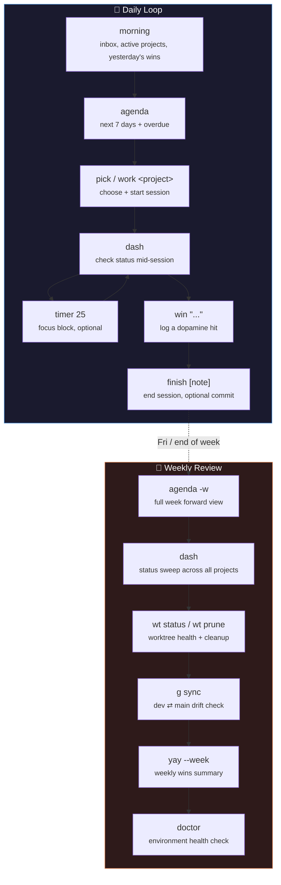

# Workflow Cookbook — Daily & Weekly flow-cli Recipes

> Copy-paste routines for the two cadences flow-cli is built around: the daily loop and the
> weekly review.
>
> **Version:** v7.14.0 | **Last Updated:** 2026-07-02

Each recipe follows the same structure: **When** — **Commands** — **Why**.
For full command reference see [`docs/help/QUICK-REFERENCE.md`](../help/QUICK-REFERENCE.md) and
[`docs/reference/MASTER-DISPATCHER-GUIDE.md`](../reference/MASTER-DISPATCHER-GUIDE.md).

---

## The Two Cadences at a Glance



---

## Table of Contents

**Daily**

- [1. Morning Startup](#1-morning-startup)
- [2. Picking What to Work On](#2-picking-what-to-work-on)
- [3. Starting a Focused Session](#3-starting-a-focused-session)
- [4. Mid-Session Check-In](#4-mid-session-check-in)
- [5. Focus Blocks with the Timer](#5-focus-blocks-with-the-timer)
- [6. Logging Wins](#6-logging-wins)
- [7. Ending the Session](#7-ending-the-session)

**Weekly**

- [8. Weekly Forward Look](#8-weekly-forward-look)
- [9. Full Project Status Sweep](#9-full-project-status-sweep)
- [10. Worktree Health and Cleanup](#10-worktree-health-and-cleanup)
- [11. Branch Sync Check](#11-branch-sync-check)
- [12. Weekly Wins Review](#12-weekly-wins-review)
- [13. Environment Health Check](#13-environment-health-check)

---

## Daily

### 1. Morning Startup

**When:** First terminal session of the day, before picking any specific task.

**Commands:**

```zsh
morning
```

**Why:** Reduces decision fatigue at the start of the day — one command shows your inbox, active
projects, yesterday's wins, and suggests what to work on, instead of you reconstructing context
from memory. See [`docs/commands/morning.md`](../commands/morning.md).

---

### 2. Picking What to Work On

**When:** `morning` gave you a suggestion but you want to browse, or you're returning
mid-day and need to switch projects.

**Commands:**

```zsh
pick              # interactive fzf picker across all projects
# or, if you already know the project:
work <project>
```

**Why:** `pick` is the ADHD-friendly "just show me the list" fallback when the suggested project
isn't the right one — filterable, with `.STATUS`/git-log previews inline so you don't have to
`cd` around to remember what a project is.

---

### 3. Starting a Focused Session

**When:** You've chosen a project and are ready to work.

**Commands:**

```zsh
work <project>          # cd + context + session timer, no editor
work <project> -e       # same, plus opens $EDITOR
```

**Why:** `work` bundles the context-switch cost — `cd`, reading `.STATUS`, starting a session
timer — into one command so switching projects mid-day doesn't cost you the 2-3 minutes of manual
orientation each time.

---

### 4. Mid-Session Check-In

**When:** You've been heads-down and want a quick "where am I" without breaking flow, or you're
about to context-switch and want to leave a clean marker.

**Commands:**

```zsh
dash              # full dashboard: git status, .STATUS, active tasks
status             # just the .STATUS summary for the current project
```

**Why:** `dash` is a zero-typing snapshot — no need to run `git status` + open `.STATUS` + check
task lists separately.

---

### 5. Focus Blocks with the Timer

**When:** You want Pomodoro-style structure inside a work session — optional, use only if timeboxing helps.

**Commands:**

```zsh
timer 25          # start a 25-minute focus block
timer status       # check remaining time
brk 5              # 5-minute break timer
timer stop         # cancel early
```

**Why:** External time pressure reduces the "how long have I actually been doing this" ADHD blind
spot — the timer notifies you rather than requiring you to self-monitor.

---

### 6. Logging Wins

**When:** Any time you complete something, however small — don't wait for "big" accomplishments.

**Commands:**

```zsh
win "Fixed the flaky test"
yay                  # show recent wins (dopamine hit)
```

**Why:** Auto-categorized progress logging — the `yay` feedback loop is deliberately immediate and
cheap to trigger, which is the point (see
[`docs/guides/DOPAMINE-FEATURES-GUIDE.md`](DOPAMINE-FEATURES-GUIDE.md)).

---

### 7. Ending the Session

**When:** Wrapping up for the day, or switching to a different project.

**Commands:**

```zsh
finish                    # end session, no commit
finish "short note"       # end session + optional commit prompt with note
```

**Why:** Closes the loop cleanly — records session duration, prompts for a commit if there are
uncommitted changes, so the next `morning` or `work` has an accurate "yesterday's activity" to
show you.

---

## Weekly

### 8. Weekly Forward Look

**When:** Start of the week, or Friday planning-ahead — before diving into daily work.

**Commands:**

```zsh
agenda -w          # next 7 days + overdue, across all projects
agenda --month      # next 30 days if you need to plan further out
```

**Why:** `agenda` is flow-cli's forward-looking layer (as opposed to `dash`/`morning`, which are
present/backward-looking) — surfaces deadlines, due dates, and milestones that live in project
configs, not in your head. See
[`docs/guides/AGENDA-SCHEDULE-GUIDE.md`](AGENDA-SCHEDULE-GUIDE.md).

---

### 9. Full Project Status Sweep

**When:** Weekly review — checking every active project, not just the one you're in.

**Commands:**

```zsh
dash                # from any project root — shows cross-project view
dash -i             # interactive fzf picker over the dashboard
```

**Why:** Catches projects that have gone stale (`.STATUS` says "active" but no recent commits) or
projects whose `Progress`/`Focus` fields are out of date — the kind of drift that's invisible day
to day but obvious on a weekly zoom-out.

---

### 10. Worktree Health and Cleanup

**When:** Weekly — worktrees accumulate from feature work across the week and need pruning.

**Commands:**

```zsh
wt status            # disk usage, merge status, session tracking per worktree
wt prune --dry-run   # preview what would be cleaned
wt prune             # remove merged worktrees
wt prune -b          # also delete the now-merged branches
```

**Why:** Stale worktrees silently consume disk and clutter `git worktree list` output; `wt prune`
only removes worktrees whose branch is actually merged, so it's safe to run routinely rather than
only when you notice the clutter.

---

### 11. Branch Sync Check

**When:** Weekly, for any repo using the multi-branch pattern (`main` ← `dev` ← `feature/*`) — to
catch drift before it compounds.

**Commands:**

```zsh
g sync              # smart sync check against remote
```

**Why:** Catches `dev` falling behind `main` (or vice versa) early — a weekly check is cheap;
discovering drift mid-release is not.

---

### 12. Weekly Wins Review

**When:** End of week — a reflective pass, not just a productivity metric.

**Commands:**

```zsh
yay --week          # weekly summary + graph
flow goal set 3     # (re)set daily win target for the coming week if it's not fitting
```

**Why:** Turns the day-to-day `win` logging into a shape you can actually reflect on — useful both
for morale (ADHD-friendly positive reinforcement) and for spotting which days/projects are
consistently low-output.

---

### 13. Environment Health Check

**When:** Weekly, or any time something feels "off" (a dispatcher misbehaves, Claude Code seems
to have stale context).

**Commands:**

```zsh
flow doctor              # dependency + tool health
flow doctor --fix        # interactive install of missing tools
flow claude check         # Claude Code environment health (C1-C11)
```

**Why:** Cheaper to catch configuration drift (missing tools, stale hooks, Homebrew keg drift) on
a weekly cadence than to debug it reactively when it blocks actual work.

---

## See Also

- [`docs/help/QUICK-REFERENCE.md`](../help/QUICK-REFERENCE.md) — full command reference
- [`docs/reference/MASTER-DISPATCHER-GUIDE.md`](../reference/MASTER-DISPATCHER-GUIDE.md) — all 14 dispatchers
- [`docs/guides/AGENDA-SCHEDULE-GUIDE.md`](AGENDA-SCHEDULE-GUIDE.md) — the forward-looking layer in depth
- [`docs/guides/DOPAMINE-FEATURES-GUIDE.md`](DOPAMINE-FEATURES-GUIDE.md) — `win`/`yay`/`js` design rationale
- [`docs/commands/work.md`](../commands/work.md), [`morning.md`](../commands/morning.md), [`finish.md`](../commands/finish.md), [`dash.md`](../commands/dash.md)
