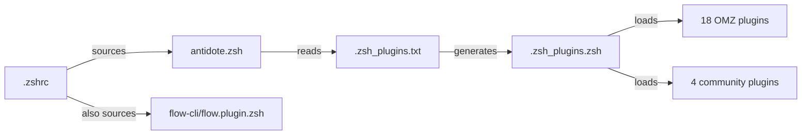

# ZSH Plugin Ecosystem Guide

**Complete guide to understanding and using your ZSH plugins via antidote**

**Author:** Flow-CLI Project
**Created:** 2026-01-24
**Status:** Living Document
**Audience:** Beginners to ZSH plugin management

---

## Table of Contents

1. [Understanding the Ecosystem](#understanding-the-ecosystem)
2. [Your Setup: Antidote + OMZ Plugins](#your-setup-antidote--omz-plugins)
3. [Plugin Categories](#plugin-categories)
4. [Beginner's Tutorial](#beginners-tutorial)
5. [Advanced Usage](#advanced-usage)
6. [Troubleshooting](#troubleshooting)

---

## Understanding the Ecosystem

### The Big Picture

```
┌─────────────────────────────────────────────────────────────┐
│                   YOUR ZSH ENVIRONMENT                      │
├─────────────────────────────────────────────────────────────┤
│                                                             │
│  ┌─────────────────────────────────────────────────────┐   │
│  │ PLUGIN MANAGER: Antidote                            │   │
│  │ (Modern, fast, minimal overhead)                    │   │
│  └─────────────────────────────────────────────────────┘   │
│                           ↓                                 │
│  ┌──────────────────┬──────────────────┬─────────────────┐ │
│  │   OMZ Plugins    │  Community       │  flow-cli       │ │
│  │   (18 loaded)    │  Plugins (4)     │  (standalone)   │ │
│  └──────────────────┴──────────────────┴─────────────────┘ │
│                                                             │
│  Total: 22 plugins + flow-cli = 351 aliases                │
│                                                             │
└─────────────────────────────────────────────────────────────┘
```

### Key Concepts

| Term | What it Means | Example |
|------|---------------|---------|
| **Plugin Manager** | Tool that installs and loads plugins | antidote, zinit, OMZ |
| **Plugin** | Collection of functions/aliases/completions | git plugin, zsh-autosuggestions |
| **OMZ** | Oh-My-Zsh - large plugin ecosystem | Source of 18 plugins you use |
| **Antidote** | Modern plugin manager you're using | Loads OMZ plugins without OMZ itself |
| **flow-cli** | Workflow tool (independent of OMZ) | work, dash, finish commands |

### What You DON'T Have

❌ **Oh-My-Zsh (OMZ) as a plugin manager** - You don't have `~/.oh-my-zsh/` directory
❌ **OMZ framework overhead** - No slow `$ZSH/oh-my-zsh.sh` sourcing
❌ **OMZ update mechanism** - You use `antidote update` instead

### What You DO Have

✅ **Antidote plugin manager** - Modern, fast, Rust-inspired
✅ **OMZ plugins loaded via antidote** - Best of both worlds
✅ **Automatic updates** - `antidote update` updates all plugins
✅ **flow-cli** - Works independently, no OMZ dependency

---

## Your Setup: Antidote + OMZ Plugins

### Configuration Files

```bash
~/.config/zsh/
├── .zshrc                    # Main config (sources antidote)
├── .zsh_plugins.txt          # Plugin list (antidote reads this)
└── .zsh_plugins.zsh          # Generated cache (auto-updated)
```

### How It Works



**Startup sequence:**

1. Shell starts → loads `.zshrc`
2. `.zshrc` sources antidote → `source $(brew --prefix)/opt/antidote/share/antidote/antidote.zsh`
3. Antidote loads `.zsh_plugins.txt` → `antidote load $ZDOTDIR/.zsh_plugins.txt`
4. Antidote generates/updates `.zsh_plugins.zsh` cache
5. All plugins loaded → 351 aliases + commands available

### Your Loaded Plugins (22 Total)

#### OMZ Plugins (18)

| Plugin | Purpose | Commands/Aliases |
|--------|---------|------------------|
| **ohmyzsh/ohmyzsh path:lib** | Core OMZ libraries | Utility functions, completion system |
| **git** | Git shortcuts | `ga`, `gaa`, `gco`, `gst`, `gp` (226+ aliases) |
| **github** | GitHub shortcuts | `gist`, `repo` commands |
| **docker** | Docker shortcuts | `dk`, `dki`, `dkl`, `dkrm` |
| **colored-man-pages** | Prettier man pages | Automatic (no commands) |
| **command-not-found** | Package suggestions | Automatic "did you mean?" |
| **extract** | Smart archive extraction | `x file.zip` (works on any archive) |
| **copybuffer** | Copy terminal buffer | Ctrl+O (copy current line) |
| **copypath** | Copy file paths | `copypath` command |
| **copyfile** | Copy file contents | `copyfile` command |
| **dirhistory** | Directory navigation | Alt+Left/Right (dir history) |
| **sudo** | Add sudo to command | ESC ESC (adds sudo to current line) |
| **history** | Better history | `h`, `hs`, `hsi` commands |
| **web-search** | Search from terminal | `google`, `ddg`, `stackoverflow` |
| **fzf** | Fuzzy finder | Ctrl+R (history), Ctrl+T (files) |
| **alias-finder** | Find aliases | `alias-finder git status` |
| **aliases** | List aliases | `aliases` command |
| **brew** | Homebrew shortcuts | `bubo`, `bubc`, `bubu` |

#### Community Plugins (4)

| Plugin | Purpose | Features |
|--------|---------|----------|
| **zsh-autosuggestions** | Fish-like suggestions | Type → see gray suggestion → → to accept |
| **zsh-syntax-highlighting** | Real-time syntax check | Valid commands = green, invalid = red |
| **zsh-completions** | Extra completions | Better tab-completion for 200+ commands |
| **zsh-you-should-use** | Alias reminders | "You should use: ga" when you type `git add` |

---

## Plugin Categories

### 1. Productivity Boosters

These make you faster:

#### zsh-autosuggestions

```bash
# As you type, it suggests commands from history
$ git pu▊                    # Gray text appears
$ git push origin main       # → to accept full suggestion
$ git pu                     # Alt+→ to accept next word
```

**Commands:**
- `→` - Accept full suggestion
- `Alt+→` - Accept next word
- `Ctrl+Space` - Toggle suggestions

#### zsh-syntax-highlighting

```bash
# Valid commands turn green, invalid turn red
$ ls        # Green (valid)
$ lss       # Red (command not found)
$ cd /tmp   # Green path exists
$ cd /xyz   # Red path doesn't exist
```

**No commands - automatic highlighting**

#### zsh-you-should-use

```bash
$ git status
# → You should use: gst

$ docker ps
# → You should use: dkps
```

**Teaches you to use aliases automatically!**

---

### 2. Git Workflow

#### git plugin (226+ aliases)

**Most useful aliases:**

```bash
# Status & Info
gst         # git status
gss         # git status -s (short)
gl          # git pull
gp          # git push
glog        # git log --oneline --graph

# Add & Commit
ga          # git add
gaa         # git add --all
gcmsg       # git commit -m "message"
gc!         # git commit --amend

# Branches
gco         # git checkout
gcb         # git checkout -b
gbd         # git branch -d
gbD         # git branch -D (force)

# Stash
gsta        # git stash
gstp        # git stash pop
gstl        # git stash list

# Diff & Show
gd          # git diff
gds         # git diff --staged
gsh         # git show
```

**Full list:** Run `aliases git` or see [OMZ git plugin docs](https://github.com/ohmyzsh/ohmyzsh/tree/master/plugins/git)

#### github plugin

```bash
# Open repo in browser
repo                    # Opens current repo
repo user/repo          # Opens specific repo

# Gist management
gist file.txt          # Create gist from file
gist -p file.txt       # Private gist
```

---

### 3. Clipboard Tools

#### copybuffer (Ctrl+O)

```bash
# Type a long command, then press Ctrl+O
$ kubectl get pods --all-namespaces --field-selector...
# [Ctrl+O] → Entire line copied to clipboard
```

#### copypath

```bash
# Copy current directory
copypath              # Copies $(pwd)

# Copy specific file path
copypath file.txt     # Copies absolute path
```

#### copyfile

```bash
# Copy file contents
copyfile config.json  # File contents → clipboard
```

---

### 4. Directory Navigation

#### dirhistory (Alt+Left/Right)

```bash
$ cd ~/projects
$ cd foo
$ cd bar
# [Alt+Left] → Back to ~/projects/foo
# [Alt+Left] → Back to ~/projects
# [Alt+Right] → Forward to ~/projects/foo
```

**Like browser back/forward buttons!**

#### zoxide (separate install)

```bash
# Smart cd with frecency (frequency + recency)
z medfit               # Jump to ~/projects/r-packages/medfit
z docs                 # Jump to most recent "docs" directory
zi                     # Interactive picker (fzf)

# Add directory manually
za ~/custom/path
```

---

### 5. Command Discovery

#### alias-finder

```bash
# Find aliases for commands
alias-finder git status
# → gst='git status'

alias-finder docker ps
# → dkps='docker ps'
```

#### aliases (built-in)

```bash
# List all aliases
aliases                # Categorized view

# By category
aliases git            # All git aliases
aliases claude         # All Claude Code aliases
aliases r              # All R package aliases
```

---

### 6. Archive Extraction

#### extract plugin

```bash
# One command for all archive types
x file.zip
x archive.tar.gz
x package.rar
x data.7z
```

**Supports:** zip, tar, tar.gz, tar.bz2, rar, 7z, xz, lzma, and more

---

### 7. Developer Tools

#### docker plugin

```bash
dkl         # docker logs
dkps        # docker ps
dkpsa       # docker ps -a
dkrm        # docker rm
dkrmi       # docker rmi
dkb         # docker build
```

#### fzf plugin

```bash
# Fuzzy history search
[Ctrl+R]               # Search command history

# Fuzzy file finder
[Ctrl+T]               # Find file in current dir

# Fuzzy cd
[Alt+C]                # Fuzzy cd into subdirectory
```

---

### 8. Quality of Life

#### colored-man-pages

```bash
# Just view any man page
man ls                 # Colors automatically applied
man git                # Much easier to read!
```

#### command-not-found

```bash
$ pytohn
# zsh: command not found: pytohn
# Did you mean: python?
# Install with: brew install python
```

#### sudo (ESC ESC)

```bash
$ apt install foo
# [ESC ESC] → sudo apt install foo
```

---

## Beginner's Tutorial

### Tutorial 1: Using Git Aliases

**Goal:** Learn the most useful git aliases in 5 minutes

```bash
# 1. Check status
gst                    # Instead of: git status

# 2. Add files
ga file.txt            # Instead of: git add file.txt
gaa                    # Instead of: git add --all

# 3. Commit
gcmsg "Fix bug"        # Instead of: git commit -m "Fix bug"

# 4. Push
gp                     # Instead of: git push

# 5. View log
glog                   # Pretty git log with graph
```

**Practice:**
1. Create test file: `touch test.txt`
2. Stage it: `ga test.txt`
3. Commit: `gcmsg "Add test file"`
4. Check log: `glog`

**Result:** You just saved 50+ keystrokes!

---

### Tutorial 2: Clipboard Mastery

**Goal:** Master clipboard workflows

```bash
# 1. Copy current directory
cd ~/projects/my-app
copypath               # Path copied!
# Paste in another terminal or app

# 2. Copy file path
copypath package.json  # Full path copied

# 3. Copy file contents
copyfile config.json   # Contents copied
# Paste into another file or editor

# 4. Copy long command (Ctrl+O)
kubectl get pods --all-namespaces --field-selector status.phase=Running
# [Ctrl+O] → Entire command copied
```

---

### Tutorial 3: Directory Navigation

**Goal:** Navigate like a pro

```bash
# 1. Use dirhistory
cd ~/projects
cd foo
cd bar
cd baz
# [Alt+Left] [Alt+Left] [Alt+Left] → Back to ~/projects

# 2. Use zoxide
z medfit               # Jump to recently used "medfit" directory
zi                     # Interactive picker
```

---

### Tutorial 4: Archive Extraction

**Goal:** Extract any archive with one command

```bash
# Download test archives
curl -O https://example.com/data.tar.gz
curl -O https://example.com/backup.zip

# Extract with x
x data.tar.gz          # Extracts to current directory
x backup.zip           # Works for any format!
```

---

### Tutorial 5: Command Suggestions

**Goal:** Let plugins teach you

```bash
# 1. Type long command
git status

# Output: You should use: gst
# → Start using gst instead!

# 2. Use autosuggestions
git pu▊                # See suggestion appear
# → to accept

# 3. Find aliases
alias-finder docker ps
# → dkps='docker ps'
```

---

## Advanced Usage

### Updating Plugins

```bash
# Update all plugins
antidote update

# Check what updated
# (antidote shows git log for each updated plugin)
```

**Frequency:** Run monthly or when you see plugin bugs

---

### Adding New Plugins

**Edit** `~/.config/zsh/.zsh_plugins.txt`:

```bash
# Add new plugin
ohmyzsh/ohmyzsh path:plugins/npm

# Reload shell
source ~/.zshrc
```

**Popular plugins to consider:**

```bash
# Development
ohmyzsh/ohmyzsh path:plugins/node
ohmyzsh/ohmyzsh path:plugins/python
ohmyzsh/ohmyzsh path:plugins/rust

# Productivity
ohmyzsh/ohmyzsh path:plugins/tmux
ohmyzsh/ohmyzsh path:plugins/ssh-agent
```

---

### Removing Plugins

**Comment out** in `.zsh_plugins.txt`:

```bash
# Disable web-search plugin
# ohmyzsh/ohmyzsh path:plugins/web-search kind:defer

# Reload
source ~/.zshrc
```

---

### Performance Optimization

#### Lazy Loading

Some plugins load slowly. Use `kind:defer` for background loading:

```bash
# Load docker plugin only when needed
ohmyzsh/ohmyzsh path:plugins/docker kind:defer

# Load github plugin only when needed
ohmyzsh/ohmyzsh path:plugins/github kind:defer
```

**Already optimized in your setup!**

---

## Troubleshooting

### Issue: Alias conflicts

**Symptom:** Command doesn't work as expected

```bash
# Check what the alias does
which g                # Shows: g is aliased to git
type g                 # More detailed info
```

**Solution:** Use full command or different alias

```bash
# If 'g' is taken, use full command
git status

# Or find alternative alias
alias-finder git
```

---

### Issue: Plugin not loading

**Symptom:** Plugin commands don't work

**Diagnosis:**

```bash
# Check if plugin is in cache
grep "plugin-name" ~/.config/zsh/.zsh_plugins.zsh

# Check for errors
source ~/.zshrc 2>&1 | grep -i error
```

**Solution:**

```bash
# Regenerate cache
rm ~/.config/zsh/.zsh_plugins.zsh
source ~/.zshrc
```

---

### Issue: Slow shell startup

**Symptom:** New terminals take >1 second to open

**Diagnosis:**

```bash
# Time your shell startup
time zsh -i -c exit
```

**Solution:**

```bash
# 1. Remove unused plugins from .zsh_plugins.txt
# 2. Add kind:defer to slow plugins
# 3. Disable unneeded OMZ libraries

# Example: Only load what you need
# ohmyzsh/ohmyzsh path:lib  # REMOVE if too slow
```

---

### Issue: Commands not found after update

**Symptom:** After `antidote update`, some commands broken

**Solution:**

```bash
# Regenerate completions
rm ~/.zcompdump*
compinit

# Reload shell
exec zsh
```

---

## Quick Reference

### Essential Commands

```bash
# Plugin Management
antidote update              # Update all plugins
source ~/.zshrc              # Reload plugins

# Discovery
aliases                      # List all aliases
alias-finder <cmd>           # Find alias for command
which <cmd>                  # See what command does

# Git
gst, ga, gaa, gcmsg, gp     # Status, add, commit, push
glog, gd, gco                # Log, diff, checkout

# Clipboard
copypath, copyfile           # Copy paths/contents
[Ctrl+O]                     # Copy current line

# Navigation
[Alt+Left/Right]             # Directory history
z <dir>                      # Smart cd (zoxide)

# Extraction
x <archive>                  # Extract any format
```

---

## Further Reading

- **Antidote Docs:** https://getantidote.github.io/
- **OMZ Plugin Index:** https://github.com/ohmyzsh/ohmyzsh/wiki/Plugins
- **flow-cli Docs:** https://data-wise.github.io/flow-cli/
- **zsh-users Plugins:** https://github.com/zsh-users

---

## Appendix: Full Plugin List

Your complete `.zsh_plugins.txt`:

```bash
# Theme
romkatv/powerlevel10k

# OMZ Integration
getantidote/use-omz
ohmyzsh/ohmyzsh path:lib

# Git
ohmyzsh/ohmyzsh path:plugins/git
ohmyzsh/ohmyzsh path:plugins/github kind:defer

# Development
ohmyzsh/ohmyzsh path:plugins/docker kind:defer

# Enhancements
ohmyzsh/ohmyzsh path:plugins/colored-man-pages
ohmyzsh/ohmyzsh path:plugins/command-not-found
ohmyzsh/ohmyzsh path:plugins/extract

# Clipboard
ohmyzsh/ohmyzsh path:plugins/copybuffer
ohmyzsh/ohmyzsh path:plugins/copypath
ohmyzsh/ohmyzsh path:plugins/copyfile

# Navigation
ohmyzsh/ohmyzsh path:plugins/dirhistory

# Productivity
ohmyzsh/ohmyzsh path:plugins/sudo
ohmyzsh/ohmyzsh path:plugins/history
ohmyzsh/ohmyzsh path:plugins/web-search kind:defer

# Fuzzy Finding
ohmyzsh/ohmyzsh path:plugins/fzf

# Discovery
ohmyzsh/ohmyzsh path:plugins/alias-finder
ohmyzsh/ohmyzsh path:plugins/aliases
MichaelAquilina/zsh-you-should-use

# Fish-like Features
zsh-users/zsh-autosuggestions
zsh-users/zsh-syntax-highlighting
zsh-users/zsh-completions

# Homebrew
ohmyzsh/ohmyzsh path:plugins/brew
```

---

**Last Updated:** 2026-01-24
**Version:** 1.0.0
**Maintained By:** flow-cli project
