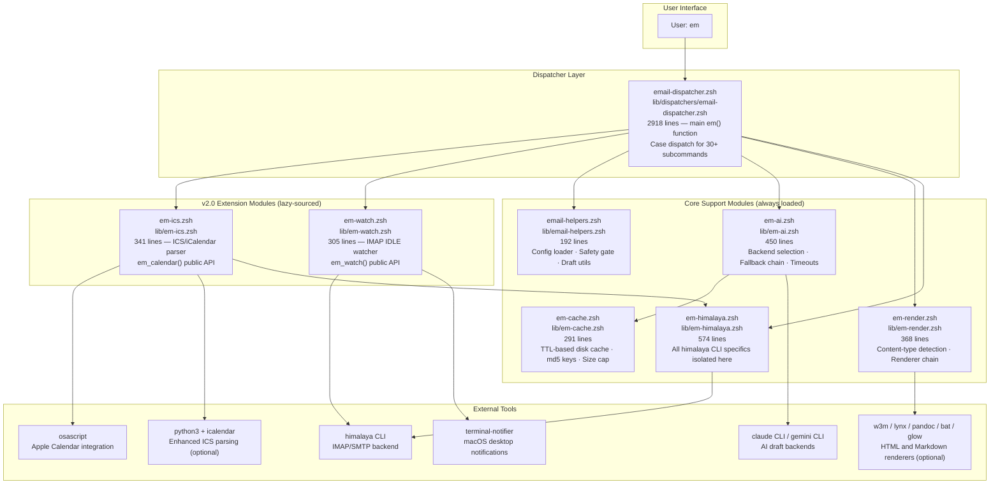
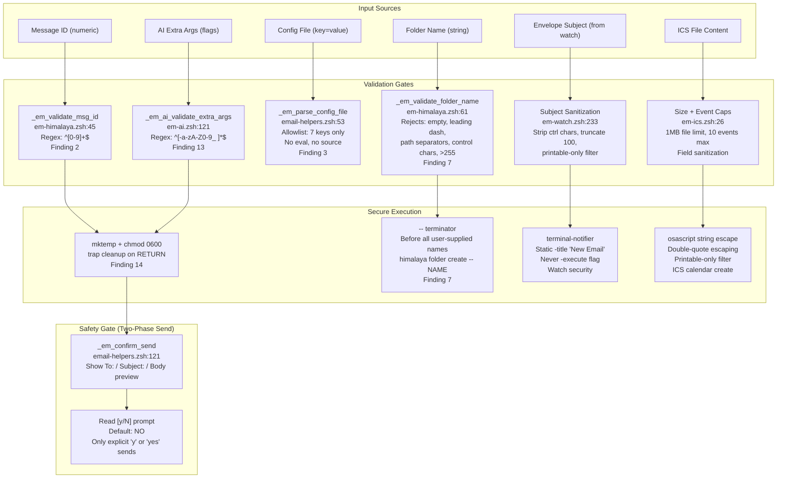
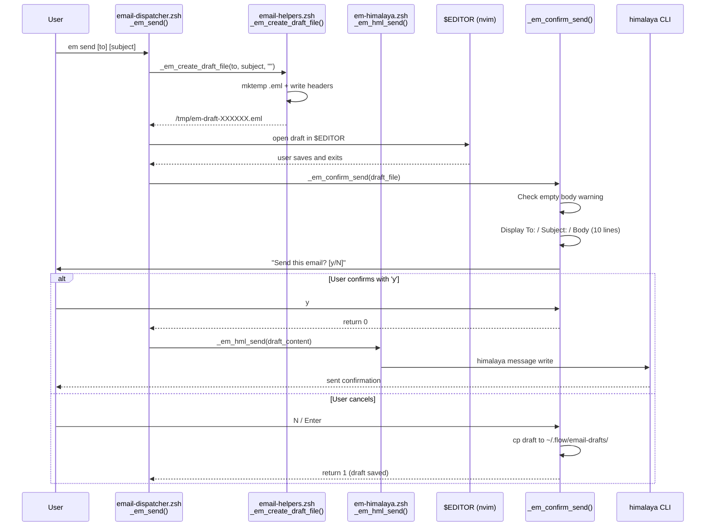
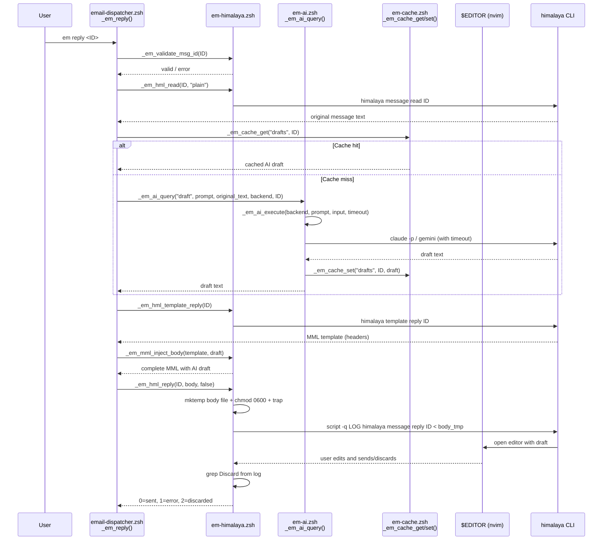
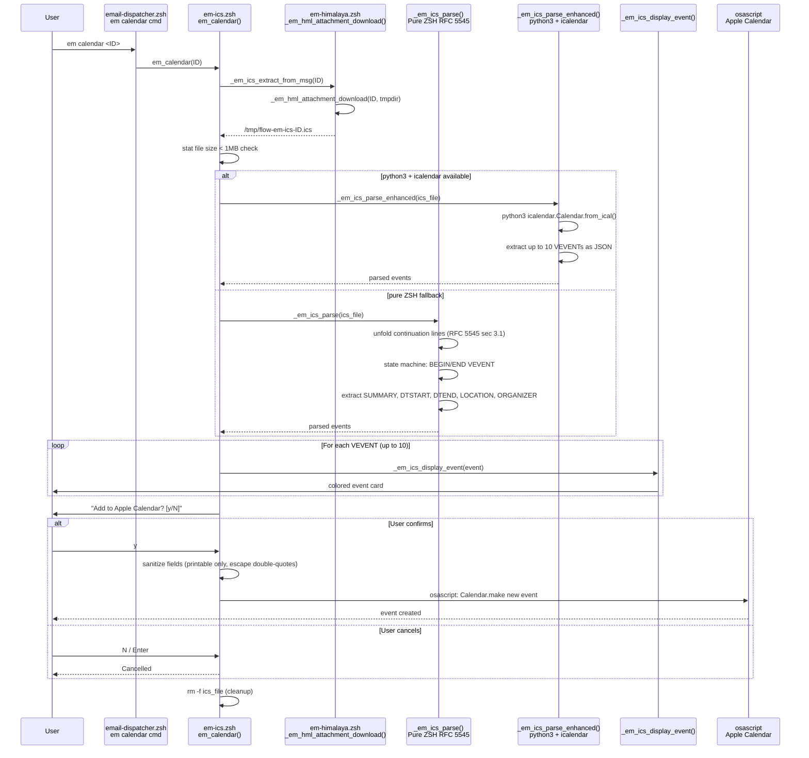
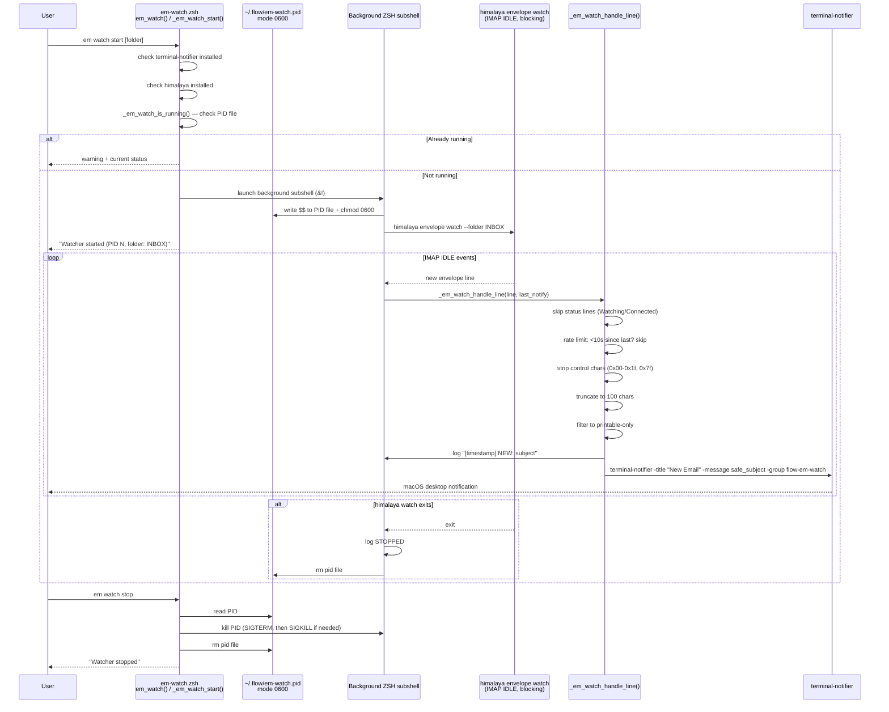

# Em v2.0 — Internal Architecture Reference

> **Scope:** Internal contributor documentation. Not published to the MkDocs site.
> **Status:** Feature branch `feature/em-v2` — pre-merge to `dev`.
> **Last Updated:** 2026-02-26

---

## Table of Contents

1. [Overview](#1-overview)
2. [System Architecture Diagram](#2-system-architecture-diagram)
3. [Security Architecture Diagram](#3-security-architecture-diagram)
4. [Data Flow Diagrams](#4-data-flow-diagrams)
   - [Send Flow](#41-send-flow)
   - [Reply Flow](#42-reply-flow)
   - [Calendar Flow](#43-calendar-flow)
   - [Watch Flow](#44-watch-flow)
5. [Module Reference Table](#5-module-reference-table)
6. [Version Detection and Progressive Enhancement](#6-version-detection-and-progressive-enhancement)
7. [Testing Architecture](#7-testing-architecture)

---

## 1. Overview

The `em` dispatcher is flow-cli's email management subsystem. It wraps the
[himalaya](https://github.com/pimalaya/himalaya) CLI behind a layered
architecture that isolates backend specifics, adds an AI draft pipeline, caches
expensive AI calls, and renders email content through a content-type-aware
display pipeline.

**v2.0 adds two new modules** that did not exist in v1.x:

- `em-ics.zsh` — Pure ZSH RFC 5545 parser for `.ics` calendar attachments,
  with optional Python `icalendar` fallback and Apple Calendar integration via
  `osascript`.
- `em-watch.zsh` — Background IMAP IDLE watcher that drives macOS desktop
  notifications via `terminal-notifier`, with PID file lifecycle management and
  rate limiting.

**v2.0 also delivers a comprehensive security hardening pass** covering 14
identified findings across input validation, config loading, temp file
handling, and AI argument injection.

### Key Design Constraints

| Constraint | Decision |
|---|---|
| Zero runtime dependencies | Pure ZSH; optional tools degrade gracefully |
| Sub-10ms interactive response | Module sourcing is lazy; version cache is session-scoped |
| Adapter isolation | All himalaya CLI syntax lives in `em-himalaya.zsh` only |
| Security by default | No `source` of user config; all IDs validated numeric; folder names validated against injection |
| Single-instance watch | PID file at `~/.flow/em-watch.pid`, mode 0600 |

---

## 2. System Architecture Diagram



### Module Loading Sequence

When the user runs any `em` command, the loading order is:

1. `flow.plugin.zsh` sources `lib/email-helpers.zsh`, `lib/em-himalaya.zsh`,
   `lib/em-ai.zsh`, `lib/em-cache.zsh`, and `lib/em-render.zsh` at plugin load
   time (always available).

2. `email-dispatcher.zsh` lazy-sources `em-ics.zsh` and `em-watch.zsh` only if
   the files exist, inside a subshell-like block that prevents pollution of the
   dispatcher's local namespace:

   ```zsh
   # lib/dispatchers/email-dispatcher.zsh, lines 65-69
   {
       local _em_lib_dir="${0:A:h:h}"  # lib/ directory
       [[ -f "$_em_lib_dir/em-ics.zsh" ]]   && source "$_em_lib_dir/em-ics.zsh"
       [[ -f "$_em_lib_dir/em-watch.zsh" ]]  && source "$_em_lib_dir/em-watch.zsh"
   }
   ```

3. Configuration is loaded via `_em_load_config` (safe parser, no `source`)
   before the dispatcher case block executes.

---

## 3. Security Architecture Diagram

The v2.0 security model is documented against 14 numbered findings from a
security review. The diagram shows the validation pipeline that every
user-supplied value passes through before reaching the himalaya CLI.



### Security Findings Reference

| Finding | Location | Mitigation |
|---|---|---|
| 2 | `_em_hml_reply`, `_em_hml_attachment_list` | `_em_validate_msg_id`: numeric-only regex |
| 3 | `_em_load_config` | `_em_parse_config_file`: line-by-line parse with 7-key allowlist |
| 5 | `_em_hml_reply` | Body passed via temp file (`stdin`), not positional arg |
| 7 | `_em_hml_folder_create`, `_em_hml_folder_delete` | `_em_validate_folder_name` + `--` terminator |
| 13 | `_em_ai_execute` | `_em_ai_validate_extra_args`: allowlist regex `^[-a-zA-Z0-9_ ]*$` |
| 14 | `_em_hml_reply` | `mktemp` + `chmod 0600` + `trap "rm -f" RETURN` |

---

## 4. Data Flow Diagrams

### 4.1 Send Flow

The `em send` command opens the user's `$EDITOR` with a blank MML template,
then requires explicit confirmation before transmitting.



### 4.2 Reply Flow

The `em reply <ID>` command reads the original message, generates an AI draft,
opens the editor pre-populated with the draft, then requires explicit
confirmation.



### 4.3 Calendar Flow

The `em calendar <ID>` command extracts an `.ics` attachment, parses VEVENT
blocks, displays them, then optionally creates an Apple Calendar event.



### 4.4 Watch Flow

The `em watch start` command launches a background ZSH subshell that runs
`himalaya envelope watch` in IMAP IDLE mode. New envelope lines trigger
sanitized macOS notifications.



---

## 5. Module Reference Table

| File | Lines | Purpose | Public Functions | Dependencies |
|---|---|---|---|---|
| `lib/dispatchers/email-dispatcher.zsh` | 2918 | Main `em()` dispatcher. Top-level case switch for 30+ subcommands. Configuration defaults. Lazy-sources v2.0 modules. | `em()` | `email-helpers.zsh`, `em-himalaya.zsh`, `em-ai.zsh`, `em-cache.zsh`, `em-render.zsh` |
| `lib/em-himalaya.zsh` | 574 | Adapter layer. All himalaya CLI specifics live here. Version detection. Input validation. | `_em_hml_check`, `_em_hml_list`, `_em_hml_read`, `_em_hml_send`, `_em_hml_reply`, `_em_hml_template_reply`, `_em_hml_template_send`, `_em_hml_search`, `_em_hml_folders`, `_em_hml_headers`, `_em_hml_move`, `_em_hml_unread_count`, `_em_hml_attachments`, `_em_hml_flags`, `_em_hml_delete`, `_em_hml_expunge`, `_em_hml_idle`, `_em_hml_watch`, `_em_hml_folder_create`, `_em_hml_folder_delete`, `_em_hml_attachment_list`, `_em_hml_attachment_download`, `_em_validate_msg_id`, `_em_validate_folder_name`, `_em_hml_version`, `_em_hml_version_gte`, `_em_require_version`, `_em_hml_version_clear_cache`, `_em_mml_inject_body` | `himalaya` CLI |
| `lib/em-ics.zsh` | 341 | ICS/iCalendar parser (v2.0 new). RFC 5545 VEVENT extraction. Apple Calendar integration via osascript. | `em_calendar()`, `_em_calendar_help`, `_em_ics_extract_from_msg`, `_em_ics_parse`, `_em_ics_parse_enhanced`, `_em_ics_format_dt`, `_em_ics_display_event`, `_em_ics_create_event` | `em-himalaya.zsh` (`_em_hml_attachment_download`), `osascript`, `python3` (optional) |
| `lib/em-watch.zsh` | 305 | IMAP IDLE background watcher (v2.0 new). PID lifecycle. Rate-limited notifications. | `em_watch()`, `_em_watch_start`, `_em_watch_stop`, `_em_watch_status`, `_em_watch_log`, `_em_watch_is_running`, `_em_watch_handle_line`, `_em_watch_doctor`, `_em_watch_help` | `himalaya` CLI (`himalaya envelope watch`), `terminal-notifier` |
| `lib/email-helpers.zsh` | 192 | Config loader (safe parser). Two-phase send safety gate. Draft temp file utilities. Editor integration. | `_em_load_config`, `_em_parse_config_file`, `_em_confirm_send`, `_em_create_draft_file`, `_em_open_in_editor` | None (standalone) |
| `lib/em-ai.zsh` | 450 | AI abstraction layer. Backend selection (claude/gemini). Per-operation timeouts. Fallback chain. AI arg validation. | `_em_ai_query`, `_em_ai_validate_extra_args`, `_em_ai_execute`, `_em_ai_backend_for_op`, `_em_ai_timeout_for_op`, `_em_ai_fallback_chain` | `em-cache.zsh`, `claude` CLI (optional), `gemini` CLI (optional) |
| `lib/em-cache.zsh` | 291 | TTL-based disk cache for AI results. md5-keyed entries per operation type. Background size enforcement. | `_em_cache_dir`, `_em_cache_key`, `_em_cache_get`, `_em_cache_set`, `_em_cache_invalidate`, `_em_cache_clear`, `_em_cache_enforce_cap` | None (pure ZSH + `md5`/`md5sum`) |
| `lib/em-render.zsh` | 368 | Content-type detection and rendering pipeline. HTML, Markdown, plain, ICS detection. Optional tool chain. | `_em_render`, `_em_render_with`, `_em_render_markdown`, `_em_pager` | `w3m`, `lynx`, `pandoc`, `bat`, `glow` (all optional) |

### Configuration Variables (Dispatcher-Level)

These shell variables configure the dispatcher. They are set via the safe
config parser or environment, never `source`d from user files.

| Variable | Default | Purpose |
|---|---|---|
| `FLOW_EMAIL_AI` | `claude` | AI backend: `claude`, `gemini`, or `none` |
| `FLOW_EMAIL_PAGE_SIZE` | `25` | Default inbox page size |
| `FLOW_EMAIL_FOLDER` | `INBOX` | Default mail folder |
| `FLOW_EMAIL_TRASH_FOLDER` | `Trash` | Trash folder (Exchange: `"Deleted Items"`) |
| `FLOW_EMAIL_AI_TIMEOUT` | `30` | AI draft timeout in seconds |
| `FLOW_EMAIL_CACHE_MAX_MB` | (see cache module) | Max cache directory size |
| `FLOW_EMAIL_CACHE_WARM` | (see cache module) | Pre-warm cache on startup |

### Cache Structure

```
.flow/email-cache/          (project-local, gitignored)
  summaries/<md5>.txt       1-line summary (TTL: 24h)
  classifications/<md5>.txt category label (TTL: 24h)
  drafts/<md5>.txt          AI draft text (TTL: 1h)
  schedules/<md5>.json      extracted dates (TTL: 24h)
  unread/<md5>.txt          unread count (TTL: 1min)
```

Cache keys are MD5 hashes of the message ID, preventing special characters
from appearing in filesystem paths. TTL is enforced at read time by comparing
file mtime against the current epoch. Stale entries are deleted on read miss.
A background size cap prunes the oldest entries when the cache exceeds
`FLOW_EMAIL_CACHE_MAX_MB`.

### Watch State Files

```
~/.flow/em-watch.pid        PID of background watcher (mode 0600)
~/.flow/em-watch.log        Timestamped event log
~/.flow/em-watch.folder     Currently watched folder name
```

These paths use `${FLOW_STATE_DIR:-$HOME/.flow}` as the base, respecting the
user's configured state directory.

---

## 6. Version Detection and Progressive Enhancement

The `_em_hml_version` function in `lib/em-himalaya.zsh` implements a
session-scoped cache for the himalaya version string, avoiding repeated
subprocess forks on every operation.

```zsh
# lib/em-himalaya.zsh, lines 112–147
typeset -g _EM_HML_VERSION=""   # session-scoped, persists across em() calls

_em_hml_version() {
    # Returns cached version on second+ call — zero disk I/O
    if [[ -n "$_EM_HML_VERSION" ]]; then
        echo "$_EM_HML_VERSION"; return 0
    fi
    local raw; raw=$(himalaya --version 2>/dev/null)
    local version; version="${raw##* }"
    # Validate: must match X.Y.Z pattern
    if [[ ! "$version" =~ ^[0-9]+(\.[0-9]+)*$ ]]; then return 1; fi
    _EM_HML_VERSION="$version"
    echo "$version"
}
```

### Version Comparison

`_em_hml_version_gte` performs a numeric per-segment comparison that correctly
handles minor version rollovers (e.g., `1.9.0 < 1.10.0`):

```zsh
# Pads shorter version array with zeros
# Returns 0 if installed >= min_version
_em_hml_version_gte "1.2.0"
```

### Feature Gating Pattern

Features that require a minimum himalaya version use `_em_require_version` as
a guard at the top of the function:

```zsh
# Example: attachment JSON output requires v1.2+
_em_hml_attachment_list() {
    if ! _em_validate_msg_id "$msg_id"; then return 1; fi
    if _em_hml_version_gte "1.2.0"; then
        himalaya attachment list --output json "$msg_id" 2>/dev/null
    else
        himalaya attachment list "$msg_id" 2>/dev/null
    fi
}
```

### Progressive Enhancement Matrix

| Feature | Min Version | Fallback Behavior |
|---|---|---|
| Attachment JSON output | himalaya 1.2.0 | Plain text output |
| HTML export via `message export` | himalaya 1.1.0 | Plain text only |
| IMAP IDLE via `envelope watch` | himalaya 1.0+ | Not available |
| ICS Python parser | python3 + icalendar | Pure ZSH RFC 5545 parser |
| HTML rendering (w3m) | w3m available | lynx → pandoc → bat → cat |
| Markdown rendering (glow) | glow available | bat → cat |

---

## 7. Testing Architecture

The em v2.0 test suite uses the flow-cli ZSH test framework (`tests/test-framework.zsh`).
All tests use TDD discipline — test files were written before the implementation
files they cover.

### Test Files

| File | Functions Under Test | What It Validates |
|---|---|---|
| `tests/test-em-v2-security.zsh` | `_em_validate_msg_id`, `_em_validate_folder_name`, `_em_parse_config_file` (via `_em_load_config`), `_em_ai_validate_extra_args` | Input sanitization: numeric IDs, folder name injection prevention, config key allowlist, AI arg injection prevention |
| `tests/test-em-v2-safety-gate.zsh` | `_em_safety_gate`, `_em_compose_draft`, `_em_draft_cleanup` | Two-phase send confirmation: preview display, default-deny, force mode, temp file security (mktemp + 0600), cleanup on RETURN |
| `tests/test-em-v2-ics.zsh` | `_em_ics_parse`, `_em_ics_format_dt`, `_em_ics_display_event`, `_em_ics_create_event` | ICS field extraction, RFC 5545 datetime formatting (with/without Z suffix, continuation lines), display output, AppleScript event creation and escape handling |
| `tests/test-em-v2-watch.zsh` | `_em_watch_start`, `_em_watch_stop`, `_em_watch_status`, `_em_watch_log`, `_em_watch_is_running`, `_em_watch_handle_line` | IMAP watch lifecycle, single-instance PID guard, rate limiting (10s window), subject sanitization (control chars, truncation), static notification title enforcement |
| `tests/test-em-v2-version.zsh` | `_em_hml_version`, `_em_hml_version_gte`, `_em_require_version`, `_em_hml_version_clear_cache` | Version string parsing, semver comparison correctness (1.9 vs 1.10), cache hit/miss, cache invalidation |
| `tests/test-em-v2-attachments.zsh` | `_em_attach_list`, `_em_attach_get`, `_em_hml_attachment_list` | Attachment listing, download, path traversal prevention, filename sanitization, version-aware himalaya integration |
| `tests/test-em-v2-folders.zsh` | `_em_create_folder`, `_em_delete_folder`, `_em_hml_folder_create`, `_em_hml_folder_delete` | Folder CRUD, option injection prevention (leading dash, path separators, control chars), `--` terminator, type-to-confirm on delete |
| `tests/dogfood-em-v2.zsh` | Full dispatcher surface | End-to-end dogfooding: real himalaya connection, real send/reply/calendar/watch flows |

### TDD Contract Approach

Each test file documents its contract in the header comment block:

```
# Functions under test:
#   _em_validate_msg_id       - Numeric message ID validation
#   _em_validate_folder_name  - Folder name safety checks
# Created: 2026-02-26 (TDD — tests first)
```

The contract approach means:
- The test file defines the expected API signature before the implementation file exists.
- If the implementation changes the function name, the test file catches it on the next run.
- Each test case targets one behaviour, not one function, making failures immediately diagnostic.

### Running the Em Test Suites

```zsh
# Run all em v2.0 specific tests
for f in tests/test-em-v2-*.zsh; do zsh "$f"; done

# Run a single suite
zsh tests/test-em-v2-security.zsh

# Run full test suite (includes em tests)
./tests/run-all.sh
```

Tests must be run from the repository root. The test framework stubs
`FLOW_QUIET=1` and `FLOW_ATLAS_ENABLED=no` to suppress interactive output and
optional integrations. `exec < /dev/null` prevents any test from accidentally
consuming TTY input.

---

*This document is an internal architecture reference for flow-cli contributors.
It is not part of the public documentation site.*
