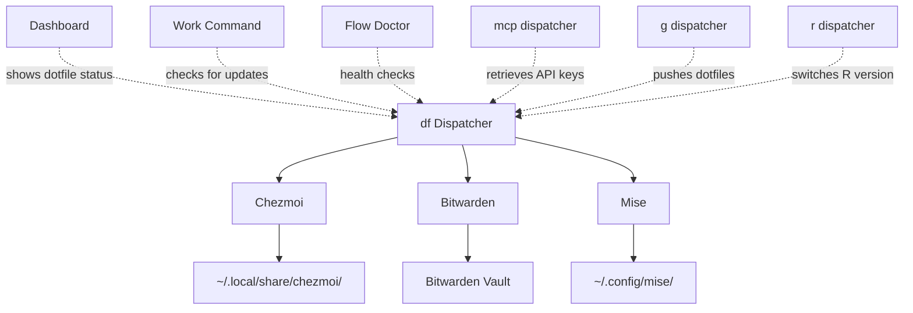

# Dotfile Management Integration - Brainstorm Output

**Date:** 2026-01-08
**Mode:** max (comprehensive with agents)
**Focus:** feature + architecture
**Duration:** ~12 minutes (including agent analysis)

---

## Executive Summary

Integration of chezmoi + Bitwarden + Mise into flow-cli via a new **`dot` (dotfile) dispatcher**.

### Key Recommendations

1. **Command Name:** `dot` (dotfile) - short, memorable, follows dispatcher pattern
2. **Architecture:** Dispatcher pattern (consistent with `g`, `mcp`, `cc`, `r`, `qu`)
3. **Core Operations:** `dot` (status), `dot edit`, `dot sync` (80% of daily use)
4. **Integration:** Dashboard, work command, flow doctor
5. **Implementation:** 26 hours over 3-4 weeks

### The 3 Most Frequent Operations

| Command           | Frequency | Purpose                                 |
| ----------------- | --------- | --------------------------------------- |
| `dot edit <file>` | 60%       | Quick edit with preview and auto-apply  |
| `dot sync`        | 25%       | Pull latest changes with safety preview |
| `dot` (status)    | 15%       | Check sync state at a glance            |

---

## Quick Wins (< 4 hours)

⚡ **Phase 1: Dispatcher Skeleton**

- Create `lib/dispatchers/dot-dispatcher.zsh`
- Implement `dot help` and `dot status`
- Add to `flow.plugin.zsh` loader
- **Benefit:** Validate command naming, test integration points

⚡ **Phase 2: Edit Workflow**

- Implement `dot edit` with smart path resolution
- Add preview mode (`dot diff`)
- **Benefit:** Covers 60% of daily usage immediately

⚡ **Phase 3: Sync Workflow**

- Implement `dot sync` with safety preview
- Add `dot push` for publishing changes
- **Benefit:** Enables cross-machine sync

---

## Medium Effort (8-12 hours)

□ **Secret Management** (6 hours)

- Bitwarden integration (`dot secret`, `dot unlock`)
- Session management (BW_SESSION)
- Security audit (no secrets in logs)
- Integration with other dispatchers (mcp, g)

□ **Enhanced Status** (3 hours)

- Rich status display (sync state, modified files, last sync time)
- Dashboard integration (1-line dotfile status)
- Work command integration (check for updates on session start)

□ **Doctor Integration** (2 hours)

- Add dotfile health checks to `flow doctor`
- Check chezmoi, bw, mise availability
- Validate repo connectivity
- Suggest fixes for common issues

---

## Long-term (Future Sessions)

□ **Advanced Features**

- Interactive file picker for `dot edit` (fzf integration)
- Template variable management
- Machine-specific configuration
- Automated sync (`dot watch`)

□ **Version Management**

- Mise integration for R/Python switching
- Per-project version files (.mise.toml)
- Integration with `r dispatcher` (r version, r switch)

□ **Polish & Documentation**

- ZSH completions (`_dot`)
- Comprehensive test suite
- Tutorial: Setting up dotfile sync
- Reference: DOT-DISPATCHER-REFERENCE.md

---

## Recommended Path

### Why `dot` Dispatcher?

**✅ Consistency:** Follows established flow-cli patterns (`g`, `mcp`, `cc`, `r`, `qu`, `obs`, `tm`, `wt`)
**✅ Discoverability:** Built-in help at every level (`dot help`, inline hints)
**✅ Integration:** Natural fit with dashboard, work, doctor
**✅ Performance:** Zero overhead (lazy loading, optional enhancement like Atlas)
**✅ ADHD-Friendly:** Fast, forgiving, consistent, discoverable

**⚠ Minor Conflict:** GNU `dot` (disk free) - but context makes intent clear

- In shell: `dot` → disk free command (no flow-cli loaded)
- In flow-cli: `dot` → dotfile dispatcher (plugin loaded)
- Escape hatch: `command df` or `/usr/bin/df` for disk free

**Alternative Names Considered:**

- `dot` (3 letters, less memorable)
- `dotfile` (too long, breaks 2-letter pattern)
- `config` (ambiguous, conflicts with `flow config`)
- `cm` (chezmoi abbreviation, not intuitive)

**Decision:** `dot` provides the best balance of brevity, memorability, and consistency.

### Implementation Order

**Week 1-2: Foundation + Core Workflows (12 hours)**

```bash
1. Create dot-dispatcher.zsh skeleton (4h)
   - Basic structure, help system
   - Status display (df, df status)
   - Tool detection (chezmoi, bw, mise)

2. Edit workflow (4h)
   - df edit <file> (smart path resolution)
   - df diff (preview changes)
   - df apply (apply changes)

3. Sync workflow (4h)
   - df sync (pull with preview)
   - df push (push to remote)
   - Conflict detection
```

**Week 3: Secret Management (6 hours)**

```bash
4. Bitwarden integration (6h)
   - df unlock (session management)
   - df secret <name> (retrieve secrets)
   - df secret list (show available secrets)
   - Security audit (no leaks)
```

**Week 4: Integration + Polish (8 hours)**

```bash
5. Status & troubleshooting (3h)
   - Enhanced status display
   - df doctor (diagnostics)
   - df undo (rollback)

6. Integration (3h)
   - Dashboard (show dotfile status)
   - Work command (check for updates)
   - Flow doctor (health checks)

7. Polish (2h)
   - ZSH completions
   - Tests
   - Documentation
```

**Total:** 26 hours over 3-4 weeks

---

## Architecture Overview

### File Structure

```
flow-cli/
├── lib/
│   ├── dotfile-helpers.zsh          # NEW: Helper functions
│   └── dispatchers/
│       └── dot-dispatcher.zsh        # NEW: Main df commands
├── setup/
│   └── Brewfile                     # UPDATE: Add chezmoi, bw, mise
├── completions/
│   └── _dot                          # NEW: ZSH completions
├── docs/
│   ├── reference/
│   │   └── DOT-DISPATCHER-REFERENCE.md  # NEW: Complete reference
│   ├── tutorials/
│   │   └── dotfile-setup.md         # NEW: Setup guide
│   └── specs/                       # NEW: Design specs
│       ├── DOTFILE-INTEGRATION-SUMMARY.md
│       ├── dotfile-ux-design.md
│       ├── dot-dispatcher-refcard.md
│       ├── dot-dispatcher-visual-mockups.md
│       ├── dot-dispatcher-implementation-checklist.md
│       └── README.md
└── tests/
    └── dot-dispatcher.test.zsh       # NEW: Test suite
```

### Integration Points



### Command Design

```bash
# Dispatcher pattern (like g, mcp, cc)
df <subcommand> [options]

# Core commands (Phase 1)
df              # Status overview (default - most useful at zero effort)
df edit FILE    # Edit dotfile (60% daily use)
df sync         # Pull changes (25% daily use)
df diff         # Preview changes
df push         # Push changes to remote
df apply        # Apply pending changes
df help         # Full help

# Secret management (Phase 2)
df unlock       # Unlock Bitwarden vault
df secret NAME  # Retrieve secret (no echo to terminal)
df secret list  # Show available secrets

# Troubleshooting (Phase 3)
df doctor       # Run diagnostics
df undo         # Rollback last apply
df init         # Initialize chezmoi (first-time setup)

# Passthrough
df <anything>   # Forward to chezmoi (advanced usage)
```

### Dependency Strategy (Zero Overhead)

Following the **Atlas pattern** (optional enhancement):

```bash
# Environment variable control
export FLOW_DOTFILE_ENABLED="auto"  # auto|yes|no (default: auto)

# Auto-detection
if [[ -z "$FLOW_DOTFILE_ENABLED" ]]; then
    if command -v chezmoi >/dev/null 2>&1; then
        FLOW_DOTFILE_ENABLED="yes"
    else
        FLOW_DOTFILE_ENABLED="no"
    fi
fi

# Graceful degradation
if ! command -v chezmoi >/dev/null 2>&1; then
    df() {
        echo "df: chezmoi not found. Install: brew install chezmoi"
        return 1
    }
fi
```

**Key Principle:** Core flow-cli commands (work, finish, hop, dash) remain < 10ms even if dotfile tools are installed.

**Lazy Loading:**

```bash
# Only load dot-dispatcher.zsh when df is first called
df() {
    unfunction df
    source "${0:A:h}/../lib/dispatchers/dot-dispatcher.zsh"
    df "$@"
}
```

---

## Error Recovery Design (ADHD-Optimized)

Every error shows **what/why/how**:

### Example: Bitwarden Session Expired

```
╭───────────────────────────────────────────────────╮
│ 🔒 Bitwarden Session Expired                      │
├───────────────────────────────────────────────────┤
│                                                   │
│ What: Cannot retrieve secrets from Bitwarden     │
│ Why:  Session timeout (1 hour default)           │
│ How:  Unlock your vault to continue              │
│                                                   │
│ Run: df unlock                                    │
│      Enter your master password when prompted    │
│                                                   │
╰───────────────────────────────────────────────────╯
```

### Example: Merge Conflict

```
╭───────────────────────────────────────────────────╮
│ ⚠️  Merge Conflict Detected                       │
├───────────────────────────────────────────────────┤
│                                                   │
│ File: .zshrc                                      │
│ Modified on: iMac (3 hours ago)                   │
│ Modified on: MacBook (2 hours ago)                │
│                                                   │
│ Choose resolution:                                │
│   1. Keep iMac version (discard MacBook changes)  │
│   2. Keep MacBook version (discard iMac changes)  │
│   3. Merge manually (open in editor)              │
│                                                   │
│ [1/2/3]: _                                        │
│                                                   │
╰───────────────────────────────────────────────────╯
```

### Example: Secret Missing

```
╭───────────────────────────────────────────────────╮
│ ❌ Secret Not Found                               │
├───────────────────────────────────────────────────┤
│                                                   │
│ What: Cannot find "github-token" in Bitwarden    │
│ Why:  Secret not added to vault yet              │
│ How:  Add the secret to continue                  │
│                                                   │
│ Option 1 (GUI - Recommended):                     │
│   1. Open https://vault.bitwarden.com            │
│   2. Create Item → Name: "github-token"           │
│   3. Add password field with your token           │
│                                                   │
│ Option 2 (CLI):                                   │
│   bw create item \                                │
│     --name "github-token" \                       │
│     --password "ghp_xxxxxxxxxxxx"                 │
│                                                   │
│ Then retry: df sync                               │
│                                                   │
╰───────────────────────────────────────────────────╯
```

**Design Principles:**

- **No raw errors:** Always wrap in context
- **Actionable:** Every error suggests next step
- **Choice:** Offer multiple resolution paths
- **Recovery:** Auto-resume after fix
- **Undo:** Always offer rollback option

---

## Discoverability Strategy

### Level 1: Zero Effort (df)

```
$ df
╭───────────────────────────────────────────────────╮
│ 📁 Dotfiles Status                                │
├───────────────────────────────────────────────────┤
│                                                   │
│ State: 🟢 Synced                                  │
│ Last sync: 2 hours ago (from iMac)                │
│ Tracked files: 12                                 │
│                                                   │
│ Quick actions:                                    │
│   df edit .zshrc    Edit shell config             │
│   df sync           Pull latest changes           │
│   df help           Show all commands             │
│                                                   │
╰───────────────────────────────────────────────────╯
```

### Level 2: Explicit Help (df help)

```
$ df help
╭───────────────────────────────────────────────────╮
│ df - Dotfile Management                           │
├───────────────────────────────────────────────────┤
│                                                   │
│ COMMON COMMANDS                                   │
│   df              Show status + quick actions     │
│   df edit FILE    Edit dotfile (preview changes)  │
│   df sync         Pull latest changes from remote │
│   df push         Push local changes to remote    │
│   df diff         Show pending changes            │
│                                                   │
│ SECRET MANAGEMENT                                 │
│   df unlock       Unlock Bitwarden vault          │
│   df secret NAME  Retrieve secret (no echo)       │
│   df secret list  Show available secrets          │
│                                                   │
│ TROUBLESHOOTING                                   │
│   df doctor       Run diagnostics                 │
│   df undo         Rollback last apply             │
│   df help         Show this help                  │
│                                                   │
│ EXAMPLES                                          │
│   df edit .zshrc           Edit shell config      │
│   df sync                  Pull from iMac         │
│   df secret github-token   Get GitHub token       │
│                                                   │
│ LEARN MORE                                        │
│   man df           Complete reference             │
│   df help edit     Detailed edit command help     │
│                                                   │
╰───────────────────────────────────────────────────╯
```

### Level 3: Progressive Disclosure (Inline Hints)

```
$ df edit .zshrc
# Opens editor...
# After saving:

✓ .zshrc edited successfully

Changes:
  + export ANTHROPIC_API_KEY="<from Bitwarden>"
  - export ANTHROPIC_API_KEY="sk-ant-hardcoded"

💡 Tip: Run 'df diff' to preview before applying
     Run 'df apply' to activate changes
     Run 'df undo' to rollback
```

### Level 4: Integration

**Dashboard Integration:**

```
$ dash

╭─────────────────────── flow-cli ───────────────────────╮
│ Session: flow-cli (dev)                                 │
│ Dotfiles: 🟢 Synced (2h ago) · 12 files tracked        │  ← NEW
│ Git: dev · clean · ↑1                                   │
│ MCP: 8 servers running                                  │
╰─────────────────────────────────────────────────────────╯
```

**Work Command Integration:**

```
$ work flow-cli

🔄 Checking dotfile updates...
   ✓ No dotfile changes

Starting session: flow-cli
```

**Flow Doctor Integration:**

```
$ flow doctor

🐚 SHELL
✓ zsh installed
✓ git installed

📁 DOTFILES
✓ chezmoi installed
✓ Bitwarden CLI installed
✓ Dotfile repo connected
✓ Last sync: 2 hours ago
```

---

## Smart Defaults & Forgiveness

### Fuzzy File Matching

```bash
$ df edit zshrc
# Resolves to: ~/.config/zsh/.zshrc (smart path resolution)

$ df edit git
# Multiple matches:
#   1. .gitconfig
#   2. .gitignore_global
#   Choose: _

$ df edit
# No file specified → Shows tracked file picker (fzf)
```

### Auto-Apply with Preview

```bash
$ df edit .zshrc
# Editor opens...
# On save:

✓ Changes detected
  + export NEW_ALIAS="value"

Apply these changes? [Y/n/d]
  Y = Apply now (default)
  n = Save but don't apply
  d = Show full diff first
```

### Undo Always Available

```bash
$ df undo
# Restores previous dotfile state
# Shows what was rolled back
# Keeps history for multiple undo levels
```

---

## Testing Strategy

### Unit Tests

```bash
# tests/dot-dispatcher.test.zsh

test_dot_status() {
    # Given: chezmoi installed
    # When: df status
    # Then: Shows sync state
}

test_dot_edit() {
    # Given: tracked file exists
    # When: df edit .zshrc
    # Then: Opens in $EDITOR
}

test_dot_sync() {
    # Given: remote has changes
    # When: df sync
    # Then: Pulls and previews changes
}

test_dot_secret() {
    # Given: Bitwarden unlocked
    # When: df secret github-token
    # Then: Returns secret (no echo)
}

test_dot_graceful_degradation() {
    # Given: chezmoi not installed
    # When: df
    # Then: Shows helpful error with install command
}
```

### Integration Tests

```bash
# Full workflows
test_edit_workflow() {
    # df edit → modify → df diff → df apply → df push
}

test_sync_workflow() {
    # df sync → preview → apply → verify
}

test_secret_workflow() {
    # df unlock → df secret → inject into template
}

test_conflict_resolution() {
    # Simulate conflict → guided resolution → verify
}
```

### Performance Tests

```bash
# Benchmarks
test_dot_status_performance() {
    # Target: < 0.5s
}

test_dot_help_performance() {
    # Target: < 0.1s (pure ZSH, no external tools)
}

test_startup_overhead() {
    # Target: < 50ms (with lazy loading)
}
```

---

## Success Metrics

### Week 4 (MVP Complete)

- [ ] All core commands work (`dot`, `edit`, `sync`, `push`, `diff`)
- [ ] Secret management operational (`unlock`, `secret`)
- [ ] Dashboard integration complete (1-line status)
- [ ] Work integration complete (check for updates)
- [ ] Doctor integration complete (health checks)
- [ ] All tests passing (unit + integration)
- [ ] Documentation complete (reference + tutorial)

### Week 8 (Daily Adoption)

- [ ] User runs `dot` at least once per day
- [ ] Zero manual `chezmoi` commands (all via `dot`)
- [ ] Secrets injected correctly on both machines
- [ ] No sync conflicts (auto-recovery works)
- [ ] Dotfile edits take < 30 seconds (edit → apply → active)

### Week 12 (Seamless Integration)

- [ ] User comfortable with all `dot` commands
- [ ] Integration feels natural (not bolted-on)
- [ ] Zero dotfile-related friction
- [ ] Both machines in sync 100% of the time
- [ ] User teaches others about `dot` workflow

---

## Agent Findings Summary

### Backend Architect Analysis

**Key Recommendations:**

1. **Dispatcher Pattern:** Most consistent with flow-cli architecture
2. **Lazy Loading:** Zero startup overhead via deferred loading
3. **Optional Enhancement:** Like Atlas (graceful degradation)
4. **Security:** No secrets in logs, session-based auth
5. **3-Phase Alignment:** Matches dotfile management plan phases

**Architecture Diagram:**

```
┌─────────────────────────────────────────────────────────────────┐
│  flow-cli Core (Pure ZSH, < 10ms)                               │
│  ├── work, finish, hop, dash, pick                              │
│  ├── g, r, qu, mcp, obs, cc, tm, wt dispatchers                 │
│  └── (unchanged - no dotfile dependencies)                      │
└─────────────────────────────────────────────────────────────────┘
                              │
                              │ Optional Enhancement
                              ▼
┌─────────────────────────────────────────────────────────────────┐
│  df Dispatcher (lib/dispatchers/dot-dispatcher.zsh)              │
│                                                                  │
│  ┌──────────────┐  ┌──────────────┐  ┌──────────────┐          │
│  │  Chezmoi     │  │  Bitwarden   │  │    Mise      │          │
│  │  (Phase 1)   │  │  (Phase 2)   │  │  (Phase 3)   │          │
│  ├──────────────┤  ├──────────────┤  ├──────────────┤          │
│  │ df sync      │  │ df secret    │  │ df use       │          │
│  │ df diff      │  │ df unlock    │  │ df versions  │          │
│  │ df edit      │  │              │  │ df current   │          │
│  │ df status    │  │              │  │              │          │
│  └──────────────┘  └──────────────┘  └──────────────┘          │
└─────────────────────────────────────────────────────────────────┘
```

### UX Designer Analysis

**Key Deliverables:**

1. **Complete UX Design:** 69KB comprehensive document
2. **21 Visual Mockups:** Terminal output examples
3. **Implementation Checklist:** 12 phases, detailed tasks
4. **Quick Reference Card:** Command patterns, visual trees
5. **Executive Summary:** Key recommendations

**Command Frequency Analysis:**

- `dot edit <file>`: 60% (most common operation)
- `dot sync`: 25% (second most common)
- `dot` (status): 15% (quick check)

**ADHD-Friendly Features:**

- Progressive disclosure (3 levels of help)
- Error recovery (what/why/how format)
- Smart defaults (fuzzy matching, auto-preview)
- Fast feedback (< 3 seconds for all operations)

---

## Risk Analysis & Mitigation

### Risk 1: Command Name Conflict (`dot` vs GNU `dot`)

**Likelihood:** Low
**Impact:** Medium (user confusion)

**Mitigation:**

- Context makes intent clear (shell vs flow-cli)
- Escape hatch: `command df` or `/usr/bin/df`
- Documentation clearly addresses conflict
- User can alias if needed: `alias diskfree='command df'`

**Decision:** Benefits outweigh risks. `dot` provides best UX.

### Risk 2: Startup Performance Degradation

**Likelihood:** Medium
**Impact:** High (violates sub-10ms principle)

**Mitigation:**

- Lazy loading (don't load until first `dot` call)
- Cached tool checks (avoid repeated `command -v`)
- No background processes on startup
- CI benchmarks (fail if > 50ms)

**Target:** < 5ms overhead even with dot-dispatcher loaded

### Risk 3: Secret Leakage

**Likelihood:** Low
**Impact:** Critical

**Mitigation:**

- Never echo secrets to terminal
- BW_SESSION in environment (not history)
- Session timeout (1 hour default)
- Audit logs in tests
- Add to `.zsh_history` exclusion patterns

**Testing:** All secret tests verify no leaks

### Risk 4: Chezmoi Template Conflicts

**Likelihood:** Medium
**Impact:** Medium (overwrites customizations)

**Mitigation:**

- Never auto-apply without preview
- Always show `dot diff` before applying
- Undo always available (`dot undo`)
- Backup before major operations
- Document template override mechanisms

---

## Future Enhancements

### Post-MVP Features

□ **Version Management Integration**

- `dot version r` - Show active R version
- `dot use r 4.4.0` - Switch R version via mise
- `r dispatcher` integration (r version, r switch)

□ **Package Sync**

- `dot pkg sync` - Sync Homebrew packages via Brewfile
- `dot pkg diff` - Show package differences
- `dot pkg doctor` - Check for outdated packages

□ **Template Management**

- `dot template list` - Show available templates
- `dot template apply NAME` - Apply template to dotfile
- `dot template create` - Create new template

□ **Automated Sync**

- `dot watch` - Auto-sync on file changes
- `dot schedule` - Cron-style scheduled sync
- Background sync with notifications

□ **Multi-Repo Support**

- `dot repo add NAME URL` - Track multiple dotfile repos
- `dot repo switch NAME` - Switch active repo
- `dot repo sync --all` - Sync all repos

---

## Documentation Deliverables

### Reference Documentation

- [x] `docs/specs/DOTFILE-INTEGRATION-SUMMARY.md` - Executive summary
- [x] `docs/specs/dotfile-ux-design.md` - Complete UX design
- [x] `docs/specs/dot-dispatcher-refcard.md` - Quick reference card
- [x] `docs/specs/dot-dispatcher-visual-mockups.md` - 21 visual mockups
- [x] `docs/specs/dot-dispatcher-implementation-checklist.md` - Implementation guide
- [x] `docs/specs/README.md` - Specs directory index
- [ ] `docs/reference/MASTER-DISPATCHER-GUIDE.md#dot-dispatcher` - Complete command reference
- [ ] `docs/tutorials/dotfile-setup.md` - First-time setup tutorial
- [ ] `completions/_dot` - ZSH completions

### Updates to Existing Docs

- [ ] `README.md` - Add df dispatcher
- [ ] `CLAUDE.md` - Add dotfile management context
- [ ] `docs/reference/MASTER-DISPATCHER-GUIDE.md` - Include df
- [ ] `docs/help/QUICK-REFERENCE.md` - Add df commands
- [ ] `docs/reference/WORKFLOW-QUICK-REFERENCE.md` - Add dotfile workflows
- [ ] `mkdocs.yml` - Update navigation

---

## Next Steps

### Immediate (This Session)

1. **Review** design documents in `docs/specs/`
2. **Approve** command name (`dot`) and core design
3. **Provide feedback** on:
   - Auto-apply behavior
   - Dashboard integration intensity
   - Work command integration (opt-in vs opt-out)

### Follow-up (Next Session)

1. **Create branch:** `git checkout -b feature/dot-dispatcher`
2. **Scaffold files:**

   ```bash
   mkdir -p lib/dispatchers completions
   touch lib/dispatchers/dot-dispatcher.zsh
   touch lib/dotfile-helpers.zsh
   touch completions/_dot
   ```

3. **Implement Phase 1:** Foundation + core workflows (12 hours)
4. **Test:** Load plugin, verify `dot help` and `dot status`

### Future Sessions

1. **Phase 2:** Secret management (6 hours)
2. **Phase 3:** Integration + polish (8 hours)
3. **Release:** v5.0.0 with dotfile management

---

## Estimated Timeline

**Total Effort:** 26 hours

**Breakdown:**

- Week 1-2: Foundation + Core Workflows (12h)
- Week 3: Secret Management (6h)
- Week 4: Integration + Polish (8h)

**Milestones:**

- Day 7: MVP (edit, sync, status working)
- Day 14: Secret management operational
- Day 21: Dashboard/work integration complete
- Day 28: Release-ready (tests, docs, polish)

**Release:** v5.0.0

---

**Status:** Design Complete → Ready for Implementation
**Recommended First Step:** Review design specs, approve command name, create feature branch

---

## Files Generated

All design documents saved to `/Users/dt/projects/dev-tools/flow-cli/docs/specs/`:

1. **DOTFILE-INTEGRATION-SUMMARY.md** - Executive summary with key recommendations
2. **dotfile-ux-design.md** - Complete UX design (69 KB)
3. **dot-dispatcher-refcard.md** - Quick reference card with command patterns
4. **dot-dispatcher-visual-mockups.md** - 21 visual mockups of terminal output
5. **dot-dispatcher-implementation-checklist.md** - Step-by-step implementation guide
6. **README.md** - Specs directory index and navigation

This brainstorm output serves as the foundation for implementation planning and decision-making.
