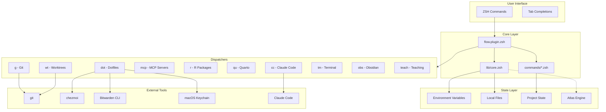
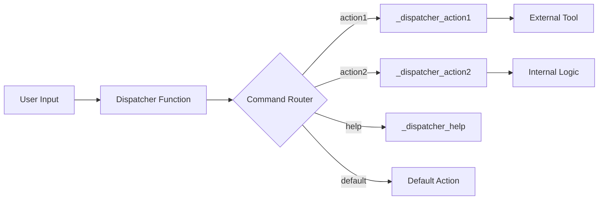
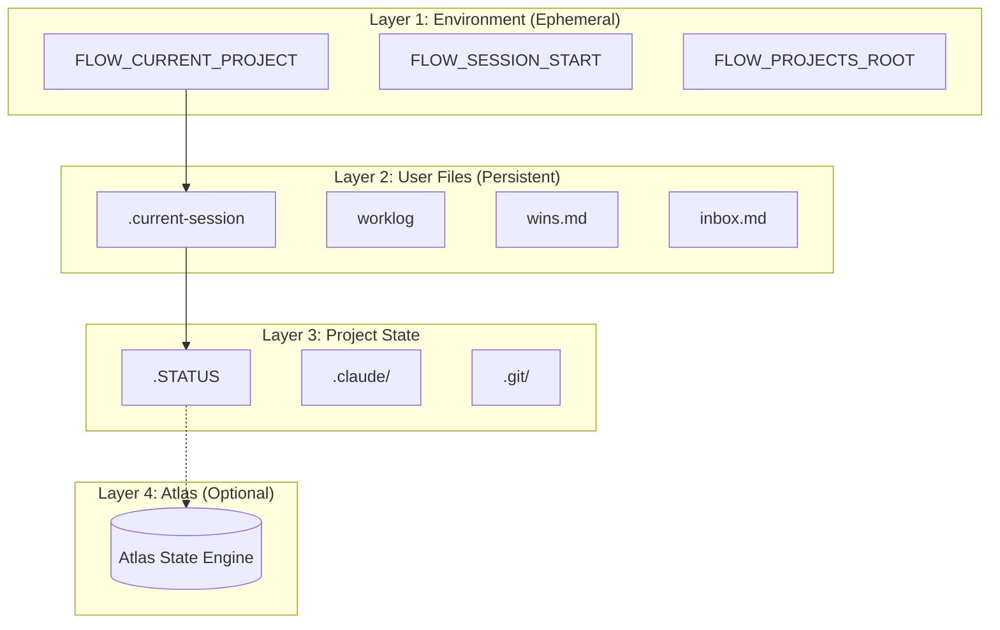
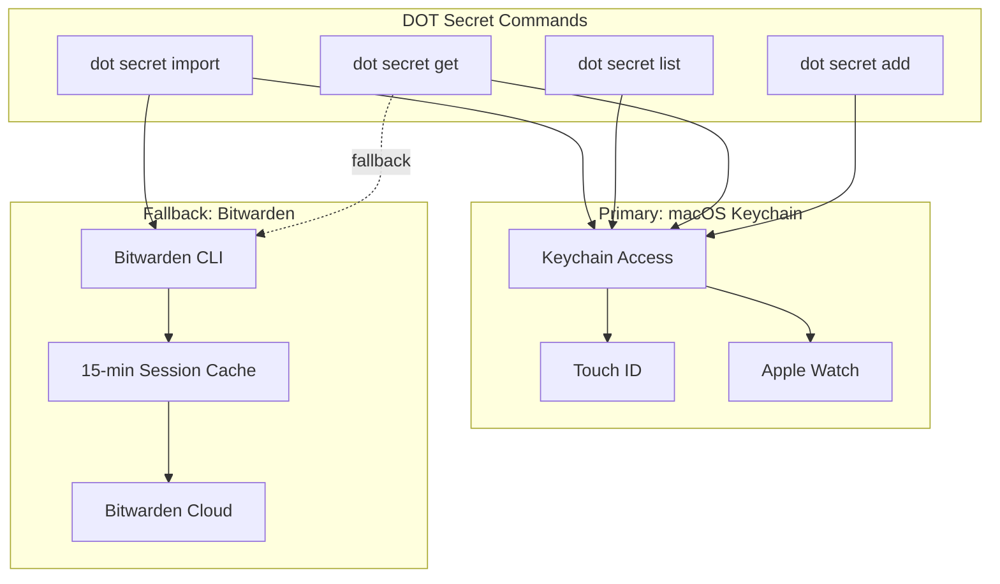
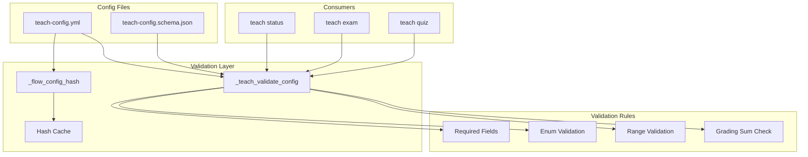
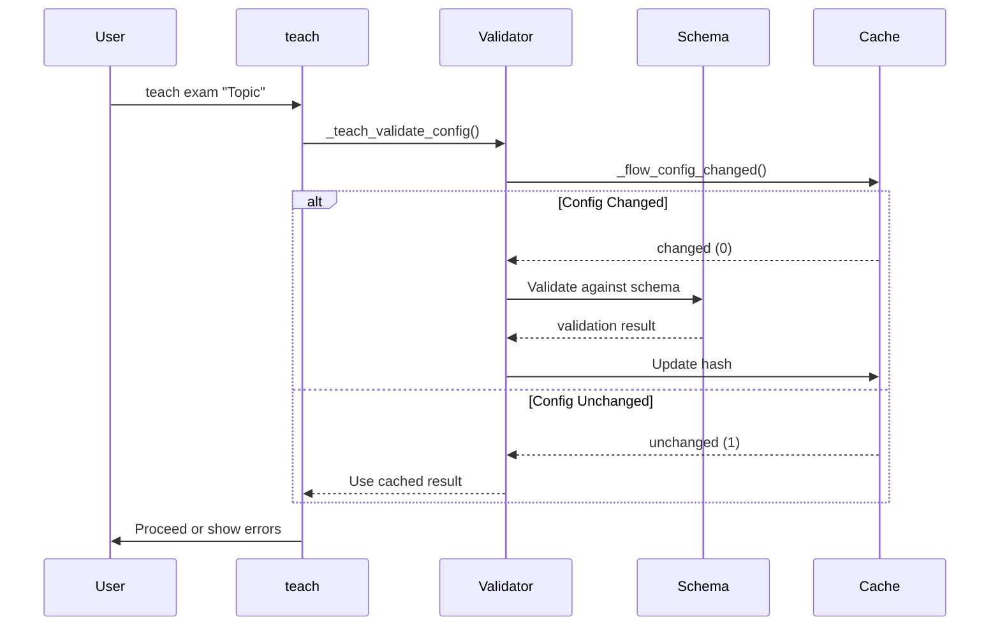
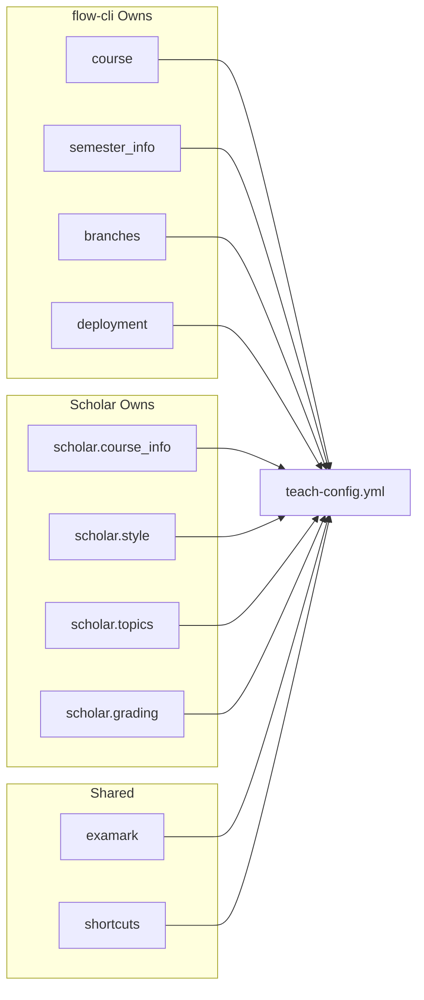
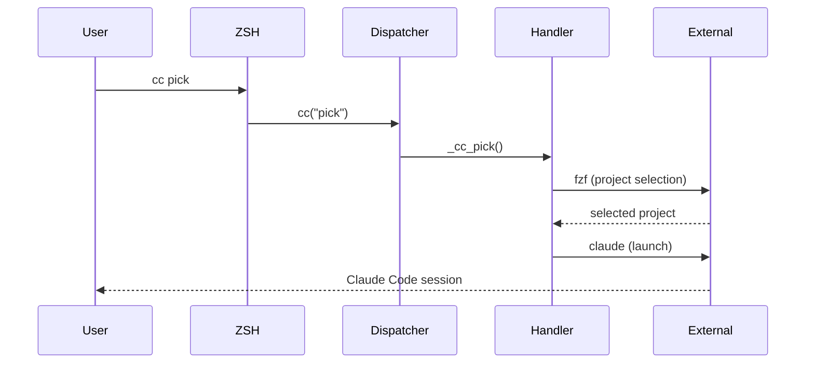
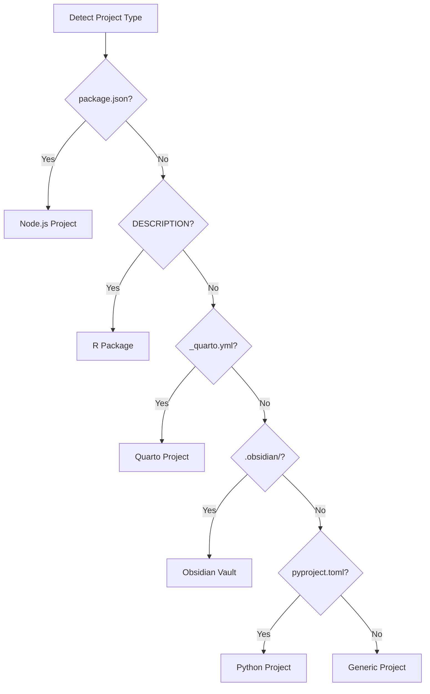

# flow-cli Architecture

**Version:** v5.9.0
**Last Updated:** 2026-01-14

---

## System Overview



---

## Dispatcher Architecture

Each dispatcher follows a consistent pattern:



### Dispatcher Pattern

```zsh
# Standard dispatcher structure
<letter>() {
    local cmd="$1"
    shift 2>/dev/null

    case "$cmd" in
        action1) _<letter>_action1 "$@" ;;
        action2) _<letter>_action2 "$@" ;;
        help|--help|-h) _<letter>_help ;;
        *) _<letter>_default "$cmd" "$@" ;;
    esac
}
```

---

## State Management



### State Locations

| Layer | Location | Persistence | Purpose |
|-------|----------|-------------|---------|
| 1 | `$FLOW_*` | Session | Current context |
| 2 | `~/.config/flow-cli/` | User | Session history |
| 2 | `~/Library/Application Support/flow-cli/` | User | Logs, captures |
| 3 | `{project}/.STATUS` | Project | Project metadata |
| 4 | Atlas database | Global | Enhanced state (optional) |

---

## Secret Management Architecture (v5.5.0)



### Secret Storage Comparison

| Feature | macOS Keychain | Bitwarden |
|---------|----------------|-----------|
| Access Speed | Instant | Requires unlock |
| Authentication | Touch ID, Watch | Master password |
| Offline | Yes | After unlock |
| Team Sharing | No | Yes |
| Cross-device | iCloud Keychain | Cloud sync |
| Session timeout | None (auto-lock) | 15 minutes |

---

## Config Validation Architecture (v5.9.0)



### Validation Flow



### Config Ownership Protocol



---

## Command Flow



---

## Project Detection



---

## File Structure

```
flow-cli/
├── flow.plugin.zsh       # Entry point
├── lib/
│   ├── core.zsh          # Logging, colors, utilities
│   ├── atlas-bridge.zsh  # Optional Atlas integration
│   ├── project-detector.zsh
│   ├── tui.zsh           # Terminal UI components
│   ├── keychain-helpers.zsh  # macOS Keychain (v5.5.0)
│   └── dispatchers/
│       ├── cc-dispatcher.zsh    # Claude Code
│       ├── dot-dispatcher.zsh   # Dotfiles + Secrets
│       ├── g-dispatcher.zsh     # Git workflows
│       ├── mcp-dispatcher.zsh   # MCP servers
│       ├── r-dispatcher.zsh     # R packages
│       ├── qu-dispatcher.zsh    # Quarto
│       ├── wt-dispatcher.zsh    # Worktrees
│       ├── tm-dispatcher.zsh    # Terminal
│       ├── obs.zsh              # Obsidian
│       └── teach-dispatcher.zsh # Teaching
├── commands/
│   ├── work.zsh          # work, finish, hop
│   ├── dash.zsh          # Dashboard
│   ├── capture.zsh       # win, yay, catch
│   ├── pick.zsh          # Project picker
│   ├── doctor.zsh        # Health check
│   └── flow.zsh          # Main flow command
├── completions/          # ZSH completions
├── hooks/                # chpwd, precmd hooks
└── tests/                # Test suites
```

---

## Performance Targets

| Operation | Target | Actual |
|-----------|--------|--------|
| Plugin load | < 50ms | ~30ms |
| Core commands | < 10ms | ~5ms |
| Dispatchers | < 100ms | ~50ms |
| Dashboard | < 500ms | ~300ms |
| Keychain access | < 100ms | ~50ms |

---

## Design Principles

1. **Pure ZSH** - No Node.js runtime, no build step
2. **ADHD-Friendly** - Fast, forgiving, discoverable
3. **Graceful Degradation** - Works without optional dependencies
4. **Consistent Patterns** - Same structure across all dispatchers
5. **Progressive Disclosure** - Simple defaults, power when needed

---

## See Also

- [Workflow Architecture Analysis](../specs/workflow-system-architecture-analysis.md)
- [Dispatcher Reference](DISPATCHER-REFERENCE.md)
- [Project Detection Guide](PROJECT-DETECTION-GUIDE.md)
