# Plugin-Tutorial Quick Reference Map

**Purpose:** Fast lookup for "Which tutorial covers plugin X?"
**Format:** Visual tables and diagrams
**Audience:** Documentation writers and users

---

## Plugin → Tutorial Lookup

### Quick Answer Table

| Plugin | Primary Tutorial | Also Mentioned In | Use Case |
|--------|-----------------|-------------------|----------|
| **git** | 24 | 08, 09 | 226 git shortcuts |
| **github** | 24 | 08 | Open repos, create gists |
| **zsh-autosuggestions** | 26 | 01, all | Fish-like suggestions |
| **zsh-syntax-highlighting** | 26 | 01, all | Real-time validation |
| **zsh-you-should-use** | 28 | 06, 08 | Alias learning |
| **copybuffer** | 25 | 10, 12 | Ctrl+O copy line |
| **copypath** | 25 | 10, 14 | Copy file paths |
| **copyfile** | 25 | 10, 12, 14 | Copy file contents |
| **dirhistory** | 27 | 02, 09 | Alt+Left/Right nav |
| **fzf** | 30 | 03 | Fuzzy finding |
| **alias-finder** | 28 | 06 | Find alias for command |
| **aliases** | 28 | 06, all | List all aliases |
| **docker** | 29 | 21 | Container shortcuts |
| **brew** | 29 | 22 | Package management |
| **extract** | 29 | 21 | Smart archive extraction |
| **sudo** | 31 | 11 | ESC ESC adds sudo |
| **history** | 30 | - | Enhanced history |
| **web-search** | 30 | 12, 14 | Search from terminal |
| **colored-man-pages** | 31 | - | Prettier man pages |
| **command-not-found** | 31 | 01 | Package suggestions |

---

## Tutorial → Plugins Lookup

### Existing Tutorials (01-23) + Plugin Enhancements

| Tutorial | Plugins Integrated | Integration Type | Benefit |
|----------|-------------------|------------------|---------|
| **01: First Session** | autosuggestions, syntax, command-not-found | Dedicated section | Prevent beginner errors |
| **02: Multiple Projects** | dirhistory, zoxide | Inline tips | Faster project switching |
| **03: Status Visualizations** | fzf | Optional section | Interactive filtering |
| **06: Dopamine Features** | alias-finder, aliases, you-should-use | Dedicated section | Discover while celebrating |
| **08: Git Workflow** | git (226 aliases), github | Throughout | 80% typing reduction |
| **09: Worktrees** | git aliases, dirhistory | Inline tips | Navigate worktrees faster |
| **10: CC Dispatcher** | copypath, copyfile, copybuffer | Dedicated section | Share context with Claude |
| **11: TM Dispatcher** | sudo | Inline tip | Quick privilege escalation |
| **12: DOT Dispatcher** | copybuffer, web-search | Security tips | Safe secret management |
| **14: Teach Dispatcher** | copyfile, web-search | Workflow section | Content creation workflow |
| **21: Teach Analyze** | extract, docker | Advanced section | Handle archives, containers |
| **22: Plugin Optimization** | brew | Troubleshooting | Update dependencies |

### New Plugin Tutorials (24-31)

| Tutorial | Plugins Covered | Focus | Target Audience |
|----------|----------------|-------|-----------------|
| **24: Git Workflow** | git, github | 226 shortcuts | Git users (all levels) |
| **25: Clipboard Magic** | copybuffer, copypath, copyfile | Copy/paste workflows | Everyone |
| **26: Smart Suggestions** | autosuggestions, syntax, you-should-use | Error prevention | Beginners |
| **27: Directory Navigation** | dirhistory, zoxide | Fast navigation | Multi-project users |
| **28: Command Discovery** | alias-finder, aliases, you-should-use | Learn aliases | Learning curve reduction |
| **29: Docker & Dev Tools** | docker, brew, extract | Developer workflows | Developers |
| **30: History & Search** | history, fzf, web-search | Research & recall | Power users |
| **31: Quality of Life** | sudo, colored-man-pages, command-not-found | Shell improvements | Everyone |

---

## Visual Flow: User Journey → Plugin Discovery

```mermaid
flowchart TD
    Start["New User Starts Tutorial 01"]

    Start --> T01["Tutorial 01: First Session"]
    T01 --> P26["💡 Discovers: autosuggestions<br/>🔗 Link to Tutorial 26"]

    T01 --> T06["Tutorial 06: Dopamine"]
    T06 --> P28["💡 Discovers: alias-finder<br/>🔗 Link to Tutorial 28"]

    T01 --> T08["Tutorial 08: Git Workflow"]
    T08 --> P24["💡 Discovers: git aliases<br/>🔗 Link to Tutorial 24"]

    T08 --> T09["Tutorial 09: Worktrees"]
    T09 --> P27["💡 Discovers: dirhistory<br/>🔗 Link to Tutorial 27"]

    T01 --> T10["Tutorial 10: CC Dispatcher"]
    T10 --> P25["💡 Discovers: clipboard<br/>🔗 Link to Tutorial 25"]

    T10 --> T12["Tutorial 12: DOT Dispatcher"]
    T12 --> P25

    P24 --> Learn24["📚 Read Tutorial 24<br/>Learn 226 git aliases"]
    P25 --> Learn25["📚 Read Tutorial 25<br/>Master clipboard"]
    P26 --> Learn26["📚 Read Tutorial 26<br/>Smart suggestions"]
    P27 --> Learn27["📚 Read Tutorial 27<br/>Navigation shortcuts"]
    P28 --> Learn28["📚 Read Tutorial 28<br/>Command discovery"]

    style Start fill:#d4edda
    style P24 fill:#fff3cd
    style P25 fill:#fff3cd
    style P26 fill:#fff3cd
    style P27 fill:#fff3cd
    style P28 fill:#fff3cd
    style Learn24 fill:#d1ecf1
    style Learn25 fill:#d1ecf1
    style Learn26 fill:#d1ecf1
    style Learn27 fill:#d1ecf1
    style Learn28 fill:#d1ecf1
```



---

## Use Case → Tutorial Map

### "I want to..."

| User Goal | Plugin Solution | Tutorial |
|-----------|----------------|----------|
| Type git commands faster | git plugin (226 aliases) | 24, 08 |
| Avoid typos as I type | autosuggestions + syntax | 26, 01 |
| Copy file contents quickly | copyfile | 25, 10 |
| Navigate projects faster | dirhistory, zoxide | 27, 02 |
| Find shorter commands | alias-finder, you-should-use | 28, 06 |
| Search history interactively | fzf | 30 |
| Copy terminal output | copybuffer (Ctrl+O) | 25, 10 |
| Learn available aliases | aliases command | 28 |
| Extract archives easily | extract | 29 |
| Search web from terminal | web-search | 30, 12 |
| Add sudo to last command | sudo (ESC ESC) | 31, 11 |
| Get prettier man pages | colored-man-pages | 31 |

---

## Integration Density Map

**How many plugin mentions per tutorial:**

```
Tutorial  Plugin Mentions  Intensity
━━━━━━━━━━━━━━━━━━━━━━━━━━━━━━━━━━━━━━━━
01        ████████ 3       MEDIUM
02        ████ 2           LIGHT
03        ██ 1             LIGHT
06        ████████ 3       MEDIUM
08        ████████████ 4   HEAVY
09        ████ 2           LIGHT
10        ████████████ 4   HEAVY
11        ██ 1             LIGHT
12        ████ 2           LIGHT
14        ████ 2           LIGHT
21        ████ 2           LIGHT
22        ██ 1             LIGHT

24-31     ████████████ 3-4 HEAVY (standalone)
```

**Legend:**
- LIGHT (1-2 plugins): Optional mention, collapsed section
- MEDIUM (3 plugins): Dedicated section, visible by default
- HEAVY (4+ plugins): Central to tutorial, multiple sections

---

## Plugin Category Coverage

### By Tutorial Series

**Core Workflow (01-14):**
- Productivity Boosters: ✅ Covered (01, 26)
- Git Workflow: ✅ Covered (08, 24)
- Clipboard Tools: ✅ Covered (10, 25)
- Directory Navigation: ✅ Covered (02, 27)
- Command Discovery: ✅ Covered (06, 28)

**Developer Tools (21-23):**
- Docker/Dev: ✅ Covered (29)
- History/Search: ✅ Covered (30)
- Quality of Life: ✅ Covered (31)

**Coverage:** 100% of 8 plugin categories have dedicated tutorials

---

## Cross-Reference Matrix

**Which tutorials link to each plugin tutorial:**

| Plugin Tutorial | Linked From | Total Links |
|----------------|-------------|-------------|
| **24: Git** | 08, 09 | 2 |
| **25: Clipboard** | 10, 12, 14 | 3 |
| **26: Suggestions** | 01, all (footer) | 6+ |
| **27: Navigation** | 02, 09 | 2 |
| **28: Discovery** | 06, all (footer) | 6+ |
| **29: Docker** | 21, 22 | 2 |
| **30: History** | 03, 12 | 2 |
| **31: QoL** | 11 | 1 |

**Most referenced:** Tutorial 26 (Suggestions) and 28 (Discovery) - foundational skills

---

## Progressive Disclosure Path

**Beginner → Intermediate → Advanced progression:**

```
LEVEL 1: BEGINNERS (Tutorials 01-06)
┌────────────────────────────────────────┐
│ Core Plugins (Auto-loaded)             │
├────────────────────────────────────────┤
│ • autosuggestions (prevent typos)      │
│ • syntax-highlighting (validate)       │
│ • command-not-found (suggestions)      │
│ • colored-man-pages (readability)      │
└────────────────────────────────────────┘
         ↓
LEVEL 2: INTERMEDIATE (Tutorials 08-14)
┌────────────────────────────────────────┐
│ Workflow Accelerators                  │
├────────────────────────────────────────┤
│ • git (226 shortcuts)                  │
│ • clipboard (3 tools)                  │
│ • navigation (dirhistory, zoxide)      │
│ • discovery (alias-finder, aliases)    │
│ • fzf (fuzzy finding)                  │
└────────────────────────────────────────┘
         ↓
LEVEL 3: ADVANCED (Tutorials 21-23)
┌────────────────────────────────────────┐
│ Developer Tooling                      │
├────────────────────────────────────────┤
│ • docker (container shortcuts)         │
│ • brew (package mgmt)                  │
│ • extract (archive handling)           │
│ • web-search (research)                │
│ • history (advanced recall)            │
└────────────────────────────────────────┘
```

---

## FAQ: Finding the Right Tutorial

**Q: I use git a lot. Which tutorial helps me most?**
A: Tutorial 24 (Git Workflow plugins) for comprehensive reference, Tutorial 08 (Git Feature Workflow) for flow-cli integration.

**Q: I'm new to terminal. Where do I start?**
A: Tutorial 01 (First Session) mentions autosuggestions. For deep dive, see Tutorial 26 (Smart Suggestions).

**Q: How do I copy/paste faster?**
A: Tutorial 25 (Clipboard Magic) covers all 3 clipboard plugins. Also integrated in Tutorial 10 (CC Dispatcher).

**Q: I want to discover shortcuts as I work.**
A: Tutorial 28 (Command Discovery) covers alias-finder, aliases, and zsh-you-should-use. Also mentioned in Tutorial 06 (Dopamine).

**Q: Which plugins are mentioned in every tutorial?**
A: Autosuggestions and syntax-highlighting (beginner safety), alias-finder and aliases (discovery).

**Q: Where do I find a complete plugin reference?**
A: See `docs/guides/ZSH-PLUGIN-ECOSYSTEM-GUIDE.md` (1,200+ lines, comprehensive).

---

## Appendix: All 22 Plugins at a Glance

### OMZ Plugins (18)

| Plugin | Category | Tutorial | One-Line Summary |
|--------|----------|----------|------------------|
| git | Git | 24 | 226+ git shortcuts |
| github | Git | 24 | Open repos, create gists |
| docker | Dev Tools | 29 | Container shortcuts |
| colored-man-pages | QoL | 31 | Prettier man pages |
| command-not-found | QoL | 31 | Package suggestions |
| extract | Dev Tools | 29 | `x file.zip` (any archive) |
| copybuffer | Clipboard | 25 | Ctrl+O copy line |
| copypath | Clipboard | 25 | Copy file paths |
| copyfile | Clipboard | 25 | Copy file contents |
| dirhistory | Navigation | 27 | Alt+Left/Right nav |
| sudo | QoL | 31 | ESC ESC adds sudo |
| history | History | 30 | Enhanced history |
| web-search | History | 30 | Search from terminal |
| fzf | History | 30 | Fuzzy finder |
| alias-finder | Discovery | 28 | Find alias for command |
| aliases | Discovery | 28 | List all aliases |
| brew | Dev Tools | 29 | Homebrew shortcuts |
| ohmyzsh/ohmyzsh path:lib | Core | - | OMZ utility functions |

### Community Plugins (4)

| Plugin | Category | Tutorial | One-Line Summary |
|--------|----------|----------|------------------|
| zsh-autosuggestions | Productivity | 26 | Fish-like suggestions |
| zsh-syntax-highlighting | Productivity | 26 | Real-time validation |
| zsh-completions | Productivity | - | Enhanced completions |
| zsh-you-should-use | Discovery | 28 | Alias learning prompts |

**Total:** 22 plugins, 351 aliases

---

**Document Status:** Complete reference map
**Last Updated:** 2026-01-24
**Related Docs:**
- PLUGIN-INTEGRATION-STRATEGY.md (full plan)
- PLUGIN-QUICK-START.md (action plan)
- PLUGIN-INTEGRATION-SUMMARY.md (executive summary)
