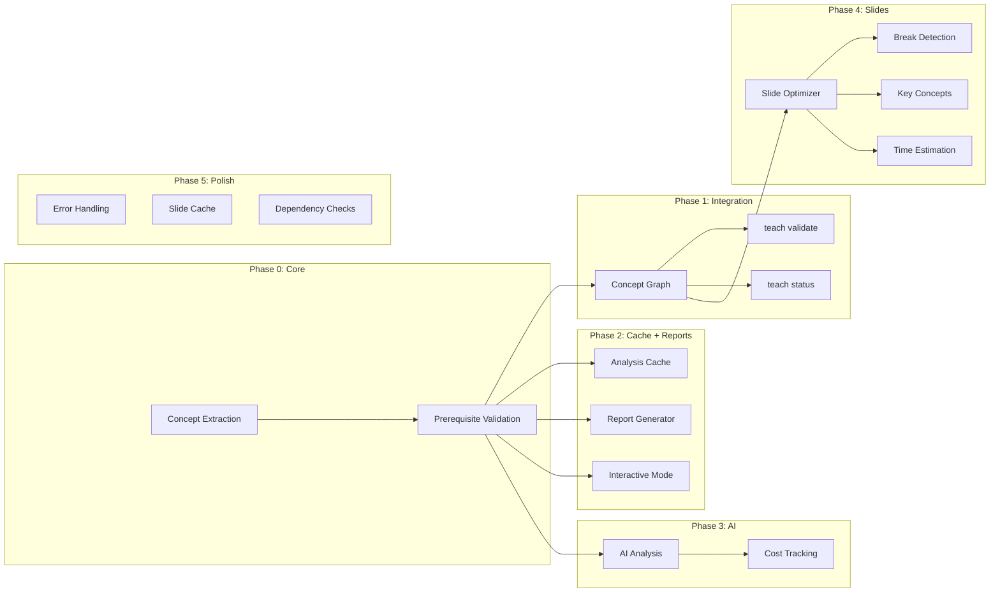
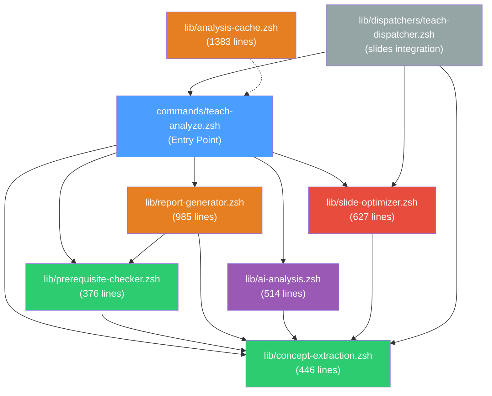
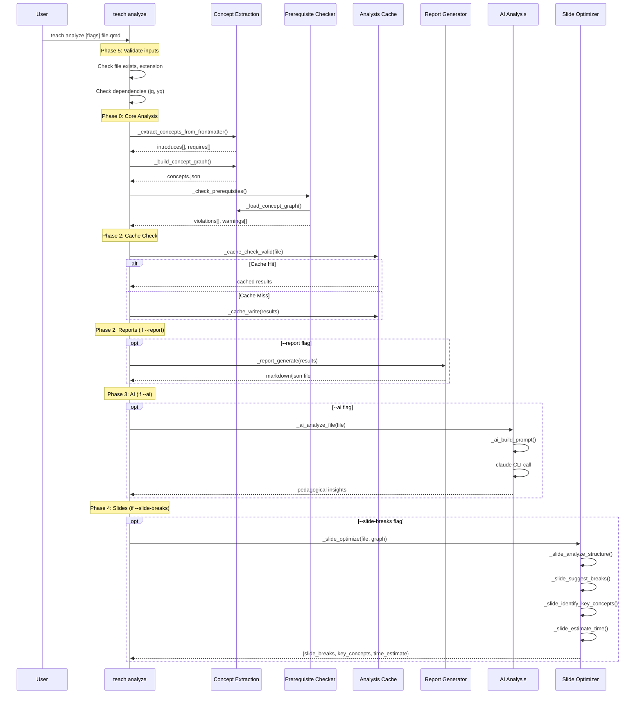
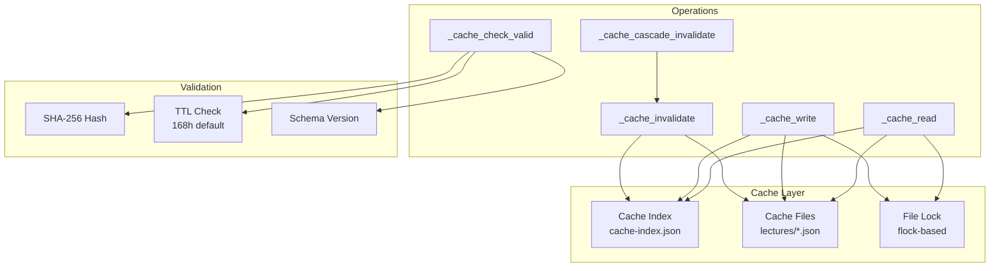
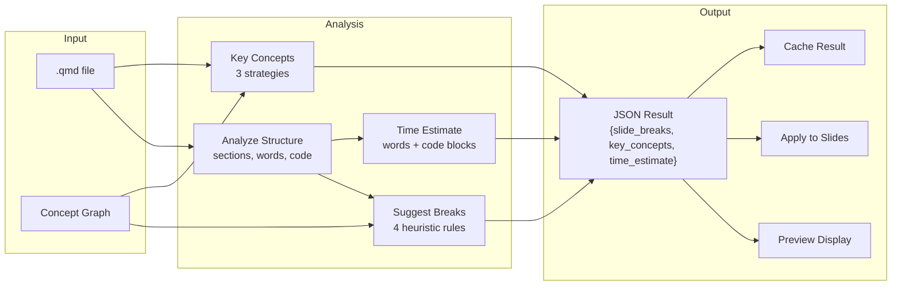
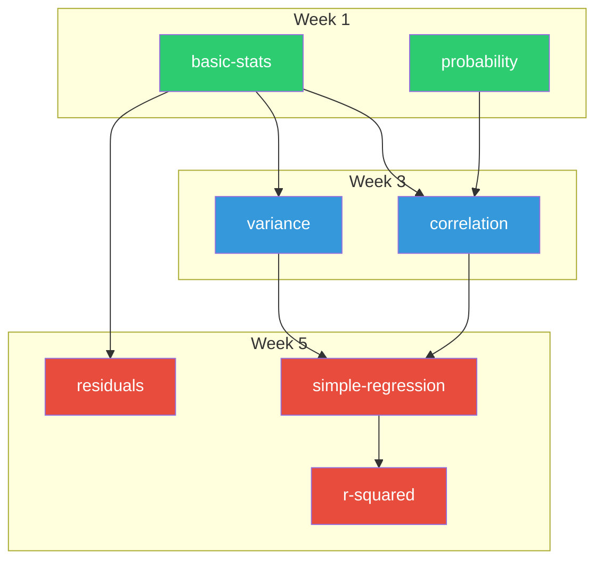
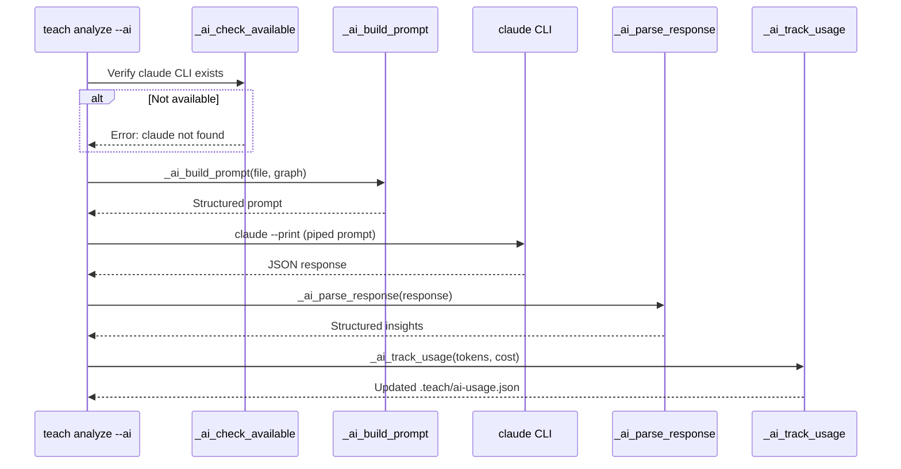
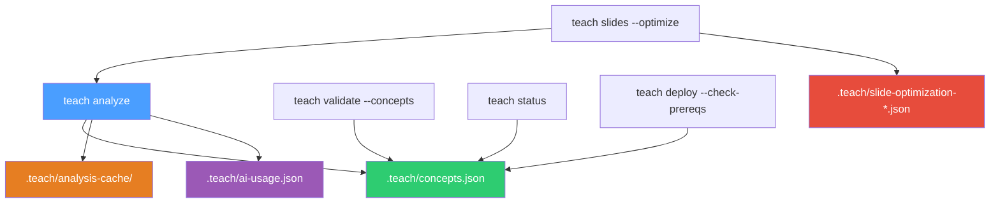
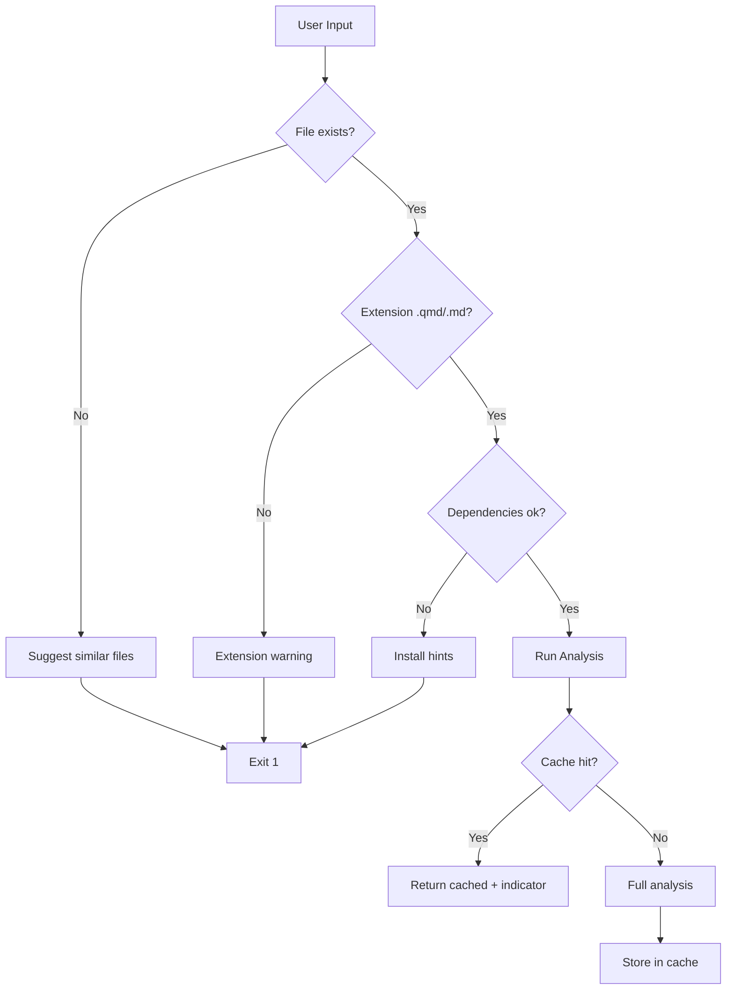

# Teach Analyze Architecture

**Version:** v5.16.0 (Phase 0-5 Complete)
**Last Updated:** 2026-01-22

---

## System Overview

The `teach analyze` system provides intelligent content analysis for teaching workflows in flow-cli. It operates as a 6-phase pipeline that progressively adds capabilities from basic concept extraction through AI-powered analysis and slide optimization.

---

## Phase Pipeline



---

## Module Dependency Graph



**Legend:** Green = Phase 0, Orange = Phase 2, Purple = Phase 3, Red = Phase 4, Grey = Dispatcher

---

## Data Flow



---

## File Structure

```
flow-cli/
├── commands/
│   └── teach-analyze.zsh          # Entry point (1203 lines)
│                                   # - _teach_analyze()
│                                   # - _teach_analyze_help()
│                                   # - _teach_analyze_interactive()
│
├── lib/
│   ├── concept-extraction.zsh     # Phase 0 (446 lines)
│   │                               # - _extract_concepts_from_frontmatter()
│   │                               # - _parse_introduced_concepts()
│   │                               # - _parse_required_concepts()
│   │                               # - _get_week_from_file()
│   │                               # - _build_concept_graph()
│   │                               # - _load_concept_graph()
│   │                               # - _save_concept_graph()
│   │
│   ├── prerequisite-checker.zsh   # Phase 0 (376 lines)
│   │                               # - _check_prerequisites()
│   │                               # - _check_concept_prerequisites()
│   │                               # - _find_missing_prerequisites()
│   │                               # - _find_future_prerequisites()
│   │                               # - _get_dependency_chain()
│   │
│   ├── analysis-cache.zsh         # Phase 2 (1383 lines)
│   │                               # - _cache_init()
│   │                               # - _cache_get_content_hash()
│   │                               # - _cache_check_valid()
│   │                               # - _cache_read() / _cache_write()
│   │                               # - _cache_invalidate()
│   │                               # - _cache_cascade_invalidate()
│   │                               # - _cache_get_or_analyze()
│   │                               # - _cache_get_stats()
│   │                               # - _cache_clean_expired()
│   │
│   ├── report-generator.zsh       # Phase 2 (985 lines)
│   │                               # - _report_generate()
│   │                               # - _report_format_markdown()
│   │                               # - _report_format_json()
│   │                               # - _report_summary_stats()
│   │                               # - _report_violations_table()
│   │                               # - _report_concept_graph_text()
│   │                               # - _report_week_breakdown()
│   │                               # - _report_recommendations()
│   │                               # - _report_save()
│   │
│   ├── ai-analysis.zsh            # Phase 3 (514 lines)
│   │                               # - _ai_check_available()
│   │                               # - _ai_analyze_file()
│   │                               # - _ai_build_prompt()
│   │                               # - _ai_parse_response()
│   │                               # - _ai_enhance_concept_graph()
│   │                               # - _ai_track_usage()
│   │                               # - _ai_get_cost_summary()
│   │                               # - _ai_analyze_course()
│   │
│   ├── slide-optimizer.zsh         # Phase 4 (627 lines)
│   │                               # - _slide_analyze_structure()
│   │                               # - _slide_suggest_breaks()
│   │                               # - _slide_extract_sections()
│   │                               # - _slide_identify_key_concepts()
│   │                               # - _slide_estimate_time()
│   │                               # - _slide_optimize()
│   │                               # - _slide_preview_breaks()
│   │                               # - _slide_apply_breaks()
│   │
│   └── dispatchers/
│       └── teach-dispatcher.zsh    # Slides integration
│                                   # - _teach_slides_optimized()
│
├── tests/
│   ├── test-teach-analyze-phase0-unit.zsh
│   ├── test-teach-analyze-phase0-integration.zsh
│   ├── test-teach-analyze-phase1-unit.zsh
│   ├── test-teach-analyze-phase2-unit.zsh
│   ├── test-teach-analyze-phase2-integration.zsh
│   ├── test-teach-analyze-phase3-unit.zsh
│   ├── test-teach-analyze-phase3-integration.zsh
│   ├── test-teach-analyze-phase4-unit.zsh
│   ├── test-teach-analyze-phase4-integration.zsh
│   ├── test-teach-analyze-phase5-final.zsh
│   └── test-slides-optimize-integration.zsh
│
└── docs/
    ├── guides/
    │   └── INTELLIGENT-CONTENT-ANALYSIS.md  # User guide
    └── reference/
        ├── TEACH-ANALYZE-API-REFERENCE.md   # API docs
        ├── TEACH-ANALYZE-ARCHITECTURE.md    # This file
        └── REFCARD-TEACH-ANALYZE.md         # Quick reference
```

---

## Cache Architecture



### Cache Directory Layout

```
.teach/
├── analysis-cache/
│   ├── cache-index.json           # Metadata index
│   ├── lectures/
│   │   ├── week-01-lecture.json   # Cached analysis
│   │   └── week-05-regression.json
│   └── assignments/
│       └── hw-01.json
├── concepts.json                  # Global concept graph
├── prerequisites.json             # Prerequisites database
└── slide-optimization-*.json      # Slide optimizer cache
```

### Cache Entry Format

```json
{
  "schema_version": "1.0",
  "file_path": "lectures/week-05-regression.qmd",
  "content_hash": "sha256:a1b2c3...",
  "timestamp": "2026-01-22T10:30:00Z",
  "ttl_hours": 168,
  "results": {
    "introduces": ["regression", "residuals"],
    "requires": ["correlation", "variance"],
    "violations": [],
    "warnings": []
  }
}
```

---

## Slide Optimizer Pipeline



### Break Detection Rules

| # | Rule | Condition | Priority |
|---|------|-----------|----------|
| 1 | Word Density | >300 words in section | **high** |
| 2 | Code Chunks | 3+ code blocks in section | **medium** |
| 3 | Definition Boundary | Definition + example pattern | **medium** |
| 4 | Dense Text | >150 words, no code | **low** |

### Key Concept Detection Strategies

| Strategy | Source | Method |
|----------|--------|--------|
| Concept Graph | `.teach/concepts.json` | `introduces` from frontmatter |
| Definitions | `**Definition**:` patterns | Regex extraction |
| Emphasis | `**bold terms**` in text | Content scanning |

---

## Slide Optimization JSON Schema

```json
{
  "slide_breaks": [
    {
      "section": "Introduction to Regression",
      "priority": "high",
      "reason": "312 words exceeds 300-word threshold",
      "line": 42,
      "suggested_sub_slides": 3
    }
  ],
  "key_concepts_for_emphasis": [
    {
      "name": "regression-coefficient",
      "source": "concept_graph",
      "definition": "The expected change in Y for a one-unit change in X"
    }
  ],
  "time_estimate": {
    "total_minutes": 28,
    "sections": [
      {"name": "Regression", "minutes": 18},
      {"name": "Diagnostics", "minutes": 10}
    ]
  }
}
```

---

## Prerequisite Validation Model



### Validation Modes

| Mode | Missing Prereqs | Future Prereqs | Action |
|------|----------------|----------------|--------|
| `strict` | Error | Error | Block deployment |
| `moderate` | Warning | Error | Warn user |
| `relaxed` | Info | Warning | Log only |

---

## AI Analysis Flow



### AI Response Structure

```json
{
  "learning_objectives": ["Understand regression coefficients"],
  "difficulty_level": "intermediate",
  "pedagogical_suggestions": ["Add worked example before code"],
  "concept_alignment": 0.85,
  "missing_scaffolding": ["variance refresher needed"]
}
```

---

## Integration Points



### Entry Points

| Command | Integration | Data Flow |
|---------|-------------|-----------|
| `teach analyze` | Primary | Builds concept graph, validates prerequisites |
| `teach slides --optimize` | Auto-analyze | Lazy-loads analyze, uses concept graph for optimization |
| `teach validate --concepts` | Layer 6 | Reads `.teach/concepts.json` for validation |
| `teach status` | Dashboard | Reads concept graph for status display |
| `teach deploy --check-prereqs` | Gate | Blocks deploy on strict violations |

---

## Test Coverage

| Suite | Tests | Phase | Focus |
|-------|-------|-------|-------|
| phase0-unit | ~40 | 0 | Concept extraction, prereq checking |
| phase0-integration | ~25 | 0 | End-to-end concept analysis |
| phase1-unit | ~20 | 1 | Integration hooks |
| phase2-unit | ~45 | 2 | Cache, reports, interactive |
| phase2-integration | ~20 | 2 | Cache + report pipeline |
| phase3-unit | 35 | 3 | AI analysis functions |
| phase3-integration | 20 | 3 | AI + cost tracking |
| phase4-unit | 72 | 4 | Slide optimizer functions |
| phase4-integration | 37 | 4 | Full optimization pipeline |
| phase5-final | 33 | 5 | Error handling, slide cache |
| slides-optimize-integration | 29 | 4+5 | teach slides --optimize |

**Total:** 362+ tests across 11 suites

---

## Performance Characteristics

| Operation | Target | Mechanism |
|-----------|--------|-----------|
| Cache check | < 10ms | SHA-256 hash comparison |
| Cache read | < 20ms | Direct JSON file read |
| Cache write | < 50ms | Atomic write + flock |
| Index rebuild | < 50ms | Full directory scan |
| Concept extraction | < 100ms | yq frontmatter parse |
| Slide optimization | < 500ms | Structure analysis + jq |
| AI analysis | 5-15s | Claude CLI call |

---

## Error Handling Strategy (Phase 5)



---

## Dependencies

| Tool | Required By | Purpose |
|------|-------------|---------|
| `jq` | Phase 2, 4, 5 | JSON processing |
| `yq` | Phase 0 | YAML frontmatter parsing |
| `claude` | Phase 3 | AI-powered analysis |
| `shasum` | Phase 2, 5 | Content hashing |
| `flock` | Phase 2 | Concurrent access safety |

---

## Related Documentation

- **User Guide:** `docs/guides/INTELLIGENT-CONTENT-ANALYSIS.md`
- **API Reference:** `docs/reference/.archive/TEACH-ANALYZE-API-REFERENCE.md`
- **Quick Reference:** `docs/reference/.archive/REFCARD-TEACH-ANALYZE.md`
- **Dispatcher:** `docs/reference/.archive/TEACH-DISPATCHER-REFERENCE-v4.6.0.md`
- **Spec:** `docs/specs/SPEC-intelligent-content-analysis-2026-01-20.md`
