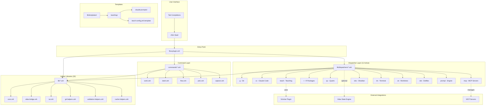
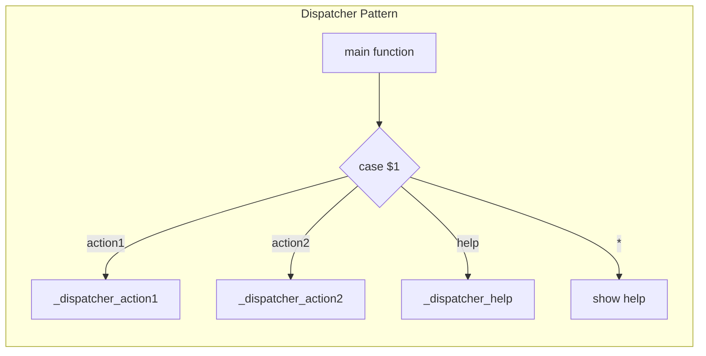
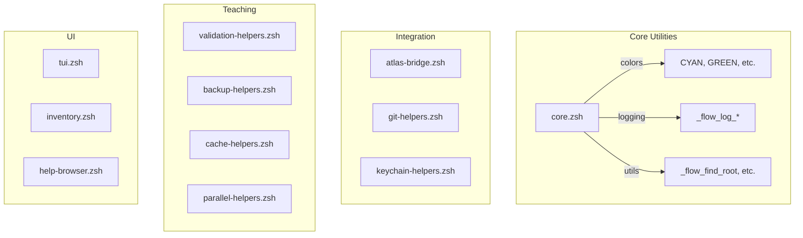
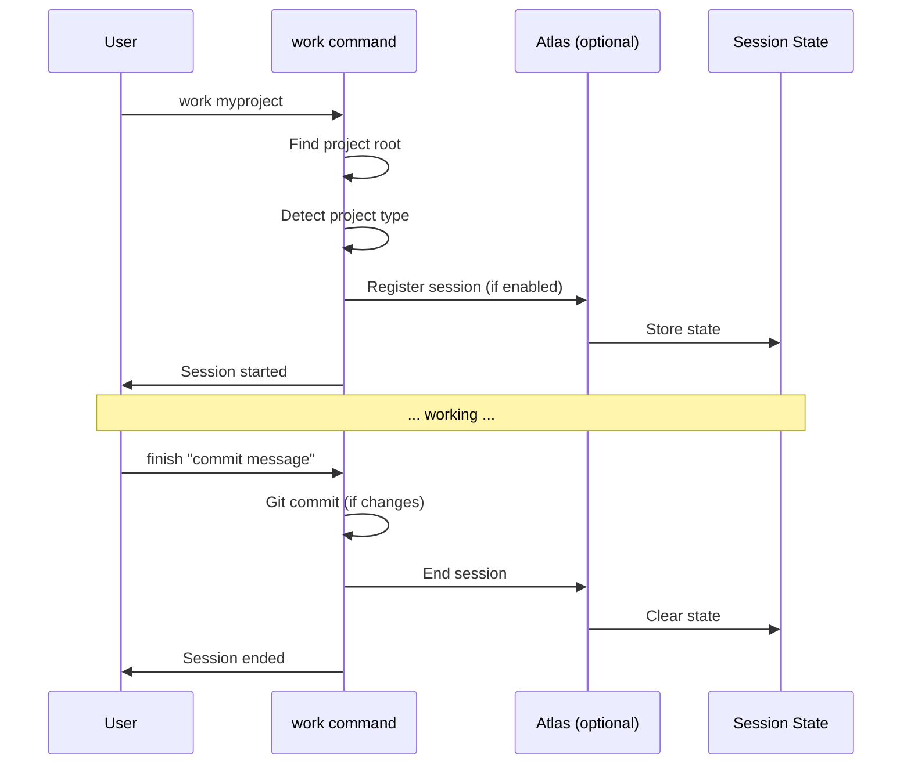
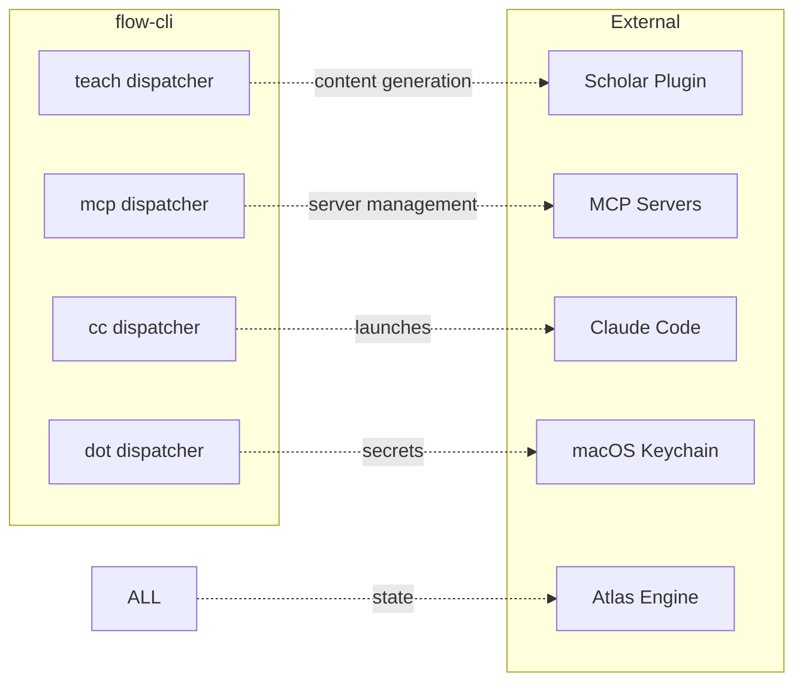

# flow-cli Architecture Overview

**Version:** 5.15.0
**Updated:** 2026-01-21

---

## System Architecture



---

## Component Hierarchy

### Layer 1: Entry Point

```
flow.plugin.zsh
├── Sources lib/core.zsh (utilities, colors, logging)
├── Sources lib/*.zsh (helper libraries)
├── Sources lib/dispatchers/*.zsh (11 dispatchers)
├── Sources commands/*.zsh (core commands)
├── Sets up completions
└── Initializes hooks
```

### Layer 2: Dispatchers (Smart Commands)

Each dispatcher follows this pattern:



**Active Dispatchers:**

| Dispatcher | Command | Functions | Purpose |
|------------|---------|-----------|---------|
| g | `g` | 10 | Git workflows |
| cc | `cc` | 7 | Claude Code launcher |
| teach | `teach` | 75 | Teaching workflows |
| r | `r` | 1+ | R package development |
| qu | `qu` | 1+ | Quarto publishing |
| mcp | `mcp` | 8 | MCP server management |
| obs | `obs` | 6 | Obsidian notes |
| tm | `tm` | 6 | Terminal manager |
| wt | `wt` | 9 | Git worktrees |
| dot | `dot` | 41 | Dotfile management |
| prompt | `prompt` | 12 | Prompt engine switcher |

### Layer 3: Helper Libraries



---

## Data Flow

### Session Lifecycle



### Teaching Workflow

```mermaid
flowchart LR
    subgraph "Content Creation"
        A[teach init] --> B[Configure course]
        B --> C[teach exam "Topic"]
        C --> D[Scholar generates]
    end

    subgraph "Validation"
        E[teach validate] --> F{Errors?}
        F -->|Yes| G[Fix issues]
        F -->|No| H[Ready]
    end

    subgraph "Deployment"
        H --> I[teach deploy]
        I --> J[Create PR]
        J --> K[GitHub Pages]
    end

    D --> E
    G --> E
```

---

## File Organization

```
flow-cli/
├── flow.plugin.zsh          # Entry point
│
├── lib/
│   ├── core.zsh             # Core utilities (colors, logging)
│   ├── atlas-bridge.zsh     # Optional Atlas integration
│   ├── tui.zsh              # Terminal UI components
│   ├── git-helpers.zsh      # Git integration
│   ├── keychain-helpers.zsh # macOS Keychain secrets
│   ├── config-validator.zsh # Config validation
│   ├── ...                  # (32 helper libraries total)
│   │
│   ├── dispatchers/         # Smart command dispatchers
│   │   ├── g-dispatcher.zsh
│   │   ├── cc-dispatcher.zsh
│   │   ├── teach-dispatcher.zsh
│   │   ├── ...              # (11 active dispatchers)
│   │   └── v-dispatcher.zsh # Experimental
│   │
│   └── templates/           # Template files
│       └── teaching/
│           ├── claude-prompts/
│           ├── teach-config.yml.template
│           └── exam-template.md
│
├── commands/                # Core commands
│   ├── work.zsh            # Session management
│   ├── dash.zsh            # Dashboard
│   ├── flow.zsh            # Main flow command
│   ├── pick.zsh            # Project picker
│   └── ...                 # (27 command files)
│
├── completions/            # ZSH completions
│   └── _*                  # Completion functions
│
├── hooks/                  # ZSH hooks
│
├── setup/                  # Installation scripts
│
├── tests/                  # Test suite (100+ files)
│
└── docs/                   # Documentation (306 files)
    ├── getting-started/
    ├── tutorials/
    ├── guides/
    ├── reference/
    └── commands/
```

---

## Integration Points

### External Systems



### Configuration

| Config | Location | Purpose |
|--------|----------|---------|
| Plugin settings | `~/.config/zsh/.zshrc` | Environment variables |
| Teaching config | `.teach/teaching.yml` | Course configuration |
| MCP config | `~/.claude/settings.json` | MCP server settings |
| Atlas state | `~/.atlas/` | Session state |

---

## Performance Considerations

### Design Goals

1. **Sub-10ms response** for core commands
2. **Lazy loading** where possible
3. **Cached project scanning**
4. **Parallel operations** for teaching workflows

### Key Optimizations

- Helper libraries only loaded when needed
- Project detection cached per session
- Parallel rendering for Quarto (3-10x speedup)
- Frecency-based project sorting

---

## Extension Points

### Adding a New Dispatcher

1. Create `lib/dispatchers/NAME-dispatcher.zsh`
2. Follow the dispatcher pattern (main function + case statement)
3. Add `_NAME_help()` function
4. Source in `flow.plugin.zsh`
5. Add completions in `completions/_NAME`
6. Document in `docs/reference/NAME-DISPATCHER-REFERENCE.md`

### Adding a New Command

1. Create `commands/NAME.zsh`
2. Use helpers from `lib/core.zsh`
3. Add help with `--help` flag
4. Source in `flow.plugin.zsh`
5. Add completions if needed

---

## Version Compatibility

| Component | Minimum Version |
|-----------|-----------------|
| ZSH | 5.8+ |
| Git | 2.30+ |
| macOS | 11.0+ (for Keychain) |
| Quarto | 1.3+ (for teaching) |

---

## Related Documentation

- [DISPATCHER-REFERENCE.md](DISPATCHER-REFERENCE.md) - All dispatchers overview
- [API-REFERENCE.md](API-REFERENCE.md) - Function reference
- [PHILOSOPHY.md](../PHILOSOPHY.md) - Design principles
- [CONVENTIONS.md](../CONVENTIONS.md) - Code standards
