# Master Architecture Guide

**Purpose:** Complete system architecture documentation for flow-cli
**Audience:** Contributors, maintainers, advanced users
**Format:** Design decisions, diagrams, implementation details
**Version:** v5.17.0-dev
**Last Updated:** 2026-01-24

---

## Table of Contents

- [System Overview](#system-overview)
- [Architecture Principles](#architecture-principles)
- [Component Design](#component-design)
- [Data Flow](#data-flow)
- [Plugin System](#plugin-system)
- [Cache Strategy](#cache-strategy)
- [Security Model](#security-model)
- [Performance Optimization](#performance-optimization)
- [Testing Strategy](#testing-strategy)
- [Future Architecture](#future-architecture)

---

## System Overview

### High-Level Architecture


---

### Layer Architecture

flow-cli follows a layered architecture:

```
┌─────────────────────────────────────────────────────────────┐
│  Layer 4: User Interface                                    │
│  - ZSH completions                                           │
│  - Interactive prompts (fzf)                                 │
│  - TUI components                                            │
└─────────────────────────────────────────────────────────────┘
                           ↓
┌─────────────────────────────────────────────────────────────┐
│  Layer 3: Commands & Dispatchers                            │
│  - Core commands (work, dash, pick, doctor)                 │
│  - 12 dispatchers (g, cc, r, qu, mcp, obs, wt, dot, teach)  │
└─────────────────────────────────────────────────────────────┘
                           ↓
┌─────────────────────────────────────────────────────────────┐
│  Layer 2: Business Logic                                    │
│  - Project detection                                         │
│  - Git integration                                           │
│  - Teaching workflows                                        │
│  - Secret management                                         │
└─────────────────────────────────────────────────────────────┘
                           ↓
┌─────────────────────────────────────────────────────────────┐
│  Layer 1: Core Utilities                                    │
│  - Logging (success/error/warning)                          │
│  - Color utilities                                           │
│  - Cache management                                          │
│  - Configuration                                             │
└─────────────────────────────────────────────────────────────┘
                           ↓
┌─────────────────────────────────────────────────────────────┐
│  Layer 0: External Integrations                             │
│  - Atlas (optional state engine)                             │
│  - macOS Keychain                                            │
│  - GitHub API                                                │
│  - Scholar CLI                                               │
│  - MCP Servers                                               │
└─────────────────────────────────────────────────────────────┘
```

**Benefits:**
- **Separation of concerns:** Each layer has single responsibility
- **Testability:** Layers can be tested independently
- **Maintainability:** Changes isolated to specific layers
- **Extensibility:** New features fit into existing layers

---

## Architecture Principles

### 1. Pure ZSH (No Runtime Dependencies)

**Decision:** flow-cli is pure ZSH, no Node.js runtime required

**Rationale:**
- **Performance:** Sub-10ms response time
- **Simplicity:** No build step, no dependency hell
- **Reliability:** Works wherever ZSH works
- **ADHD-friendly:** Instant feedback, no waiting

**Implementation:**
- All core features in ZSH
- Optional integrations (Atlas, Scholar) are external
- Graceful degradation if optional tools missing

**Trade-offs:**
- ✅ Zero startup overhead
- ✅ No version conflicts
- ❌ Complex logic harder in shell vs JavaScript
- ❌ Limited data structures

---

### 2. ADHD-Optimized Design

**Principles:**
- **Instant feedback:** Commands respond < 100ms
- **Clear hierarchy:** Visual organization with colors/emojis
- **Progressive disclosure:** Basics first, advanced features hidden
- **Dopamine loops:** Win tracking, streaks, progress

**Implementation:**

```zsh
# Instant feedback
_flow_log_success "✅ Session started"    # Immediate visual confirmation

# Clear hierarchy
echo "$(_flow_color_green 'SUCCESS:')" "Operation complete"

# Progressive disclosure
# Basics:  g status
# Advanced: g feature start (revealed in help)

# Dopamine
win "Implemented feature X"  # Tracks progress + streak
```

---

### 3. Dispatcher Pattern

**Decision:** Single-letter commands that dispatch to subcommands

**Rationale:**
- **Discoverability:** `g <Tab>` shows all git commands
- **Muscle memory:** Short commands (`g status` vs `git status`)
- **Consistency:** Same pattern across all domains
- **Extensibility:** Easy to add new subcommands

**Pattern:**
```zsh
# Dispatcher function
g() {
    case "$1" in
        status) shift; _g_status "$@" ;;
        push)   shift; _g_push "$@" ;;
        help)   _g_help ;;
        *)      _g_help ;;
    esac
}

# Subcommand implementation
_g_status() {
    git status "$@"
}
```

**Benefits:**
- **Unified interface:** All dispatchers work the same way
- **Tab completion:** Automatic for all subcommands
- **Help system:** Consistent `<dispatcher> help`

---

### 4. Optional Atlas Integration

**Decision:** Atlas is optional, not required

**Rationale:**
- **Flexibility:** Users can choose state management
- **Zero dependencies:** Works standalone
- **Performance:** Atlas adds features, not overhead when disabled

**Implementation:**
```zsh
if [[ "$FLOW_ATLAS_ENABLED" == "yes" ]] || [[ "$FLOW_ATLAS_ENABLED" == "auto" && -x "$(command -v atlas)" ]]; then
    # Use Atlas
    _flow_atlas_connect
else
    # Use local state
    _flow_local_state
fi
```

---

## Component Design

### Core Library (lib/core.zsh)

**Purpose:** Essential utilities used throughout flow-cli

**Key Components:**


**Design Decisions:**

**1. Logging with emojis:**
- ✅ Instant visual feedback
- 🎯 ADHD-friendly
- 📊 Scannable output

**2. Color utilities:**
- Consistent color scheme
- Fallback to plain text if no color support

**3. Project utilities:**
- Git-aware (finds repository root)
- Type detection (Node, R, Python, Quarto, etc.)
- Cached for performance

---

### Dispatcher Architecture

**Pattern:** All dispatchers follow same structure

```zsh
# 1. Main function (single letter or short name)
g() {
    case "$1" in
        # Subcommands
        status) shift; _g_status "$@" ;;
        push)   shift; _g_push "$@" ;;
        feature)
            case "$2" in
                start)  shift 2; _g_feature_start "$@" ;;
                finish) shift 2; _g_feature_finish "$@" ;;
                *)      _g_feature_help ;;
            esac
            ;;
        help|--help|-h) _g_help ;;
        *)
            # Pass through to git
            git "$@"
            ;;
    esac
}

# 2. Subcommand implementations
_g_status() {
    git status "$@"
}

_g_push() {
    # Validate token before push
    _flow_git_validate_token || return 1
    git push "$@"
}

# 3. Help function
_g_help() {
    cat <<EOF
g - Git dispatcher

Usage:
  g status         Show git status
  g push           Push to remote (validates token)
  g feature start  Start feature branch

See: g help for full list
EOF
}
```

**Benefits:**
- Consistent UX across all dispatchers
- Easy to add new subcommands
- Built-in help system
- Passthrough to underlying tool

---

### Cache Strategy

**Design:** Multi-layer caching for performance


**Cache Types:**

**1. Project Cache**
- **File:** `~/.cache/flow/projects/*.cache`
- **TTL:** 1 hour
- **Content:** Project list, types, status
- **Invalidation:** On project creation/deletion

**2. Token Cache (v5.17.0)**
- **File:** `~/.cache/flow/doctor/tokens.cache`
- **TTL:** 5 minutes
- **Content:** Token validation status
- **Invalidation:** On rotation, manual clear

**3. Teaching Analysis Cache**
- **File:** `~/.cache/flow/teach/*.cache`
- **TTL:** 24 hours
- **Content:** AI analysis results
- **Invalidation:** On file content change (SHA-256 hash)

---

## Data Flow

### Session Lifecycle

```mermaid
sequenceDiagram
    participant User
    participant work
    participant Core
    participant Atlas
    participant Project

    User->>work: work my-project
    work->>Core: Load configuration
    work->>Project: Detect project type
    Project-->>work: Type: Node.js
    work->>Atlas: Query project state (optional)
    Atlas-->>work: State: Active, 75% progress
    work->>Core: Create session
    Core-->>work: Session ID
    work->>User: ✅ Session started

    Note over User,Project: User works on project

    User->>work: finish "Daily progress"
    work->>Atlas: Update state (optional)
    work->>Core: Git commit
    Core-->>work: Committed
    work->>User: ✅ Session complete
```



---

### Git Operations with Token Validation

```mermaid
sequenceDiagram
    participant User
    participant g
    participant GitHelpers
    participant Cache
    participant Keychain
    participant GitHub

    User->>g: g push
    g->>GitHelpers: _flow_git_validate_token()
    GitHelpers->>Cache: Check token cache

    alt Cache Hit (< 5 min old)
        Cache-->>GitHelpers: ✅ Valid
    else Cache Miss or Expired
        GitHelpers->>Keychain: Get GITHUB_TOKEN
        Keychain-->>GitHelpers: Token value
        GitHelpers->>GitHub: Validate token
        GitHub-->>GitHelpers: Valid + expiration
        GitHelpers->>Cache: Store result (TTL: 5 min)
    end

    GitHelpers-->>g: ✅ Token valid
    g->>GitHub: git push
    GitHub-->>g: Success
    g-->>User: ✅ Pushed to origin/dev
```



---

### Teaching Analysis Workflow


---

## Plugin System

### ZSH Plugin Architecture

flow-cli is a ZSH plugin that integrates with plugin managers:


**Loading Sequence:**

1. **Entry point:** `flow.plugin.zsh`
2. **Load order:**
   - Core utilities (`lib/core.zsh`)
   - Atlas bridge (if enabled)
   - Project detector
   - All dispatchers
   - Commands
   - Completions
3. **Initialization:**
   - Check dependencies
   - Setup cache directories
   - Load configuration
   - Connect to Atlas (optional)

---

### Integration with OMZ Plugins

flow-cli integrates with 22 OMZ plugins:


**Design:** flow-cli doesn't require OMZ, but enhances workflow if plugins present.

---

## Security Model

### Secret Management (macOS Keychain)

```mermaid
graph TD
    User[User] --> dot[dot secret set]
    dot --> TouchID{Touch ID}
    TouchID -->|Authorized| Keychain[macOS Keychain]
    TouchID -->|Denied| Error[❌ Access Denied]

    Keychain --> Encrypt[Encrypted Storage]
    Encrypt --> Secure[Secure Enclave]

    App[Application] --> dotget[dot secret get]
    dotget --> TouchID2{Touch ID}
    TouchID2 -->|Authorized| Keychain
    TouchID2 -->|Denied| Error2[❌ Access Denied]
    Keychain --> Decrypt[Decrypt]
    Decrypt --> App
```



**Security Features:**

1. **Touch ID Authentication:**
   - Required for all secret operations
   - Fallback to password if Touch ID unavailable
   - Configurable unlock duration (default: 5 min)

2. **Encryption:**
   - Secrets encrypted at rest
   - Stored in macOS Keychain (not in files)
   - Secure Enclave on supported Macs

3. **Access Control:**
   - Secrets scoped to flow-cli (app-specific)
   - Not accessible to other applications
   - Keychain ACLs enforced

4. **Token Rotation:**
   - Built-in rotation workflow
   - Shows current value before replacement
   - Validates new token before storing

---

### Git Token Security

**Problem:** Git credentials exposed in environment or config

**Solution:** Keychain-backed token retrieval

```zsh
# Before (insecure):
export GITHUB_TOKEN="ghp_hardcoded_in_zshrc"  # ❌ Plain text

# After (secure):
# Token stored in keychain via Touch ID
g push  # ✅ Retrieves token from keychain, validates, uses, discards
```

**Benefits:**
- Tokens never in plain text files
- Touch ID required for access
- Automatic expiration checking
- Rotation workflow built-in

---

## Performance Optimization

### Target: Sub-10ms Response

**Constraint:** Core commands must respond < 10ms for ADHD-friendly UX

**Optimizations:**

**1. Cache Everything:**
```zsh
# Project list cached (1 hour TTL)
_flow_cache_get "projects" || {
    result=$(_flow_scan_projects)
    _flow_cache_set "projects" "$result" 3600
}
```

**2. Lazy Loading:**
```zsh
# Don't load all dispatchers upfront
# Load on first use
g() {
    if [[ -z "$_G_LOADED" ]]; then
        source "${FLOW_PLUGIN_DIR}/lib/dispatchers/g-dispatcher.zsh"
        _G_LOADED=1
    fi
    _g_dispatch "$@"
}
```

**3. Background Processes:**
```zsh
# Slow operations in background
_flow_update_cache &!  # zsh disown syntax
```

**4. Minimal External Calls:**
```zsh
# Avoid:
result=$(git status | grep modified | wc -l)  # 3 processes

# Prefer:
result=$(git status --porcelain | awk '/^ M/ {count++} END {print count}')  # 2 processes
```

---

### Performance Metrics (v5.17.0)

| Operation | Target | Actual | Status |
|-----------|--------|--------|--------|
| `work <project>` | < 100ms | ~50ms | ✅ 2x better |
| `dash` | < 200ms | ~120ms | ✅ 1.7x better |
| `g status` | < 10ms | ~5ms | ✅ 2x better |
| `flow doctor` | < 60s | ~45s | ✅ 1.3x better |
| `flow doctor --dot` | < 3s | ~1.5s | ✅ 2x better |
| Token validation (cached) | < 100ms | ~50ms | ✅ 2x better |
| Token validation (fresh) | < 3s | ~2s | ✅ 1.5x better |

**Improvements (v5.16.0 → v5.17.0):**
- 3-10x speedup from optimization pass
- 80% API call reduction via caching
- Sub-10ms for all core commands

---

## Testing Strategy

### Test Pyramid

```
        ┌─────────────┐
        │   Manual    │  10% - Real user testing
        └─────────────┘
       ┌───────────────┐
       │  Integration  │  20% - E2E workflows
       └───────────────┘
      ┌─────────────────┐
      │      Unit       │  70% - Function-level tests
      └─────────────────┘
```

**423 Total Tests:**
- **70% Unit:** Function-level (296 tests)
- **20% Integration:** Multi-component (85 tests)
- **10% E2E:** Full workflows (29 tests) + Interactive (13 tests)

---

### Test Structure

**Test Files:**
```
tests/
├── test-pick-command.zsh           # Unit: 39 tests
├── test-cc-dispatcher.zsh          # Unit: 37 tests
├── test-dot-v5.16.0-unit.zsh       # Unit: 112 tests
├── test-teach-dates-unit.zsh       # Unit: 33 tests
├── test-teach-dates-integration.zsh # Integration: 16 tests
├── e2e-teach-analyze.zsh           # E2E: 29 tests
├── interactive-dog-teaching.zsh    # Interactive: 10 tasks
└── run-all.sh                      # Test runner
```

---

### Test Patterns

**Unit Test Pattern:**
```zsh
# Test setup
setup_test() {
    export TEST_DIR="/tmp/flow-test-$$"
    mkdir -p "$TEST_DIR"
}

# Test function
test_project_detection() {
    cd "$TEST_DIR"
    echo '{"name": "test"}' > package.json

    result=$(_flow_detect_project_type "$TEST_DIR")

    assert_equals "node" "$result" "Should detect Node.js project"
}

# Teardown
teardown_test() {
    rm -rf "$TEST_DIR"
}
```

**Integration Test Pattern:**
```zsh
test_full_workflow() {
    work test-project
    # ... make changes ...
    finish "Test commit"

    assert_git_clean
    assert_session_complete
}
```

---

## Future Architecture

### Planned Enhancements

**1. Remote State Sync (v5.18.0+)**


**Features:**
- Multi-device sync
- Cloud backup (optional)
- Conflict resolution

---

**2. Plugin System v2 (v6.0.0)**


**Features:**
- Third-party plugin support
- Plugin registry
- Auto-updates
- Sandboxed execution

---

**3. Web Dashboard (v6.1.0)**

```
┌─────────────────────────────────────┐
│  flow-cli Web Dashboard             │
│                                     │
│  📊 Projects    🎯 Goals   ⚡ Wins  │
│  ├─ Active: 5                       │
│  ├─ Paused: 2                       │
│  └─ Archive: 12                     │
│                                     │
│  📈 Progress Charts                 │
│  🔥 Streak: 15 days                 │
└─────────────────────────────────────┘
```

---

## Design Decisions Log

### ADR-001: Pure ZSH vs Node.js Runtime

**Date:** 2025-11-01
**Status:** Accepted

**Context:** Needed fast, reliable workflow tool

**Decision:** Pure ZSH, no Node.js runtime

**Consequences:**
- ✅ Sub-10ms response time
- ✅ Zero dependencies
- ❌ Complex logic harder
- ❌ Limited data structures

---

### ADR-002: Dispatcher Pattern

**Date:** 2025-11-15
**Status:** Accepted

**Context:** Needed consistent command interface

**Decision:** Single-letter dispatchers with subcommands

**Consequences:**
- ✅ Consistent UX
- ✅ Easy tab completion
- ✅ Discoverable
- ❌ Namespace pollution (single letters)

---

### ADR-003: Optional Atlas Integration

**Date:** 2025-12-01
**Status:** Accepted

**Context:** State management strategy

**Decision:** Atlas optional, local state fallback

**Consequences:**
- ✅ Works standalone
- ✅ Enhanced with Atlas
- ✅ No forced dependency
- ❌ Two code paths to maintain

---

## See Also

- [MASTER-DISPATCHER-GUIDE.md](MASTER-DISPATCHER-GUIDE.md) - Dispatcher reference
- [MASTER-API-REFERENCE.md](MASTER-API-REFERENCE.md) - API documentation
- [CONVENTIONS.md](../CONVENTIONS.md) - Code conventions
- [TESTING.md](../guides/TESTING.md) - Testing guide

---

**Version:** v5.17.0-dev
**Last Updated:** 2026-01-24
**Diagrams:** 8 Mermaid diagrams
**Total:** 2,500+ lines
