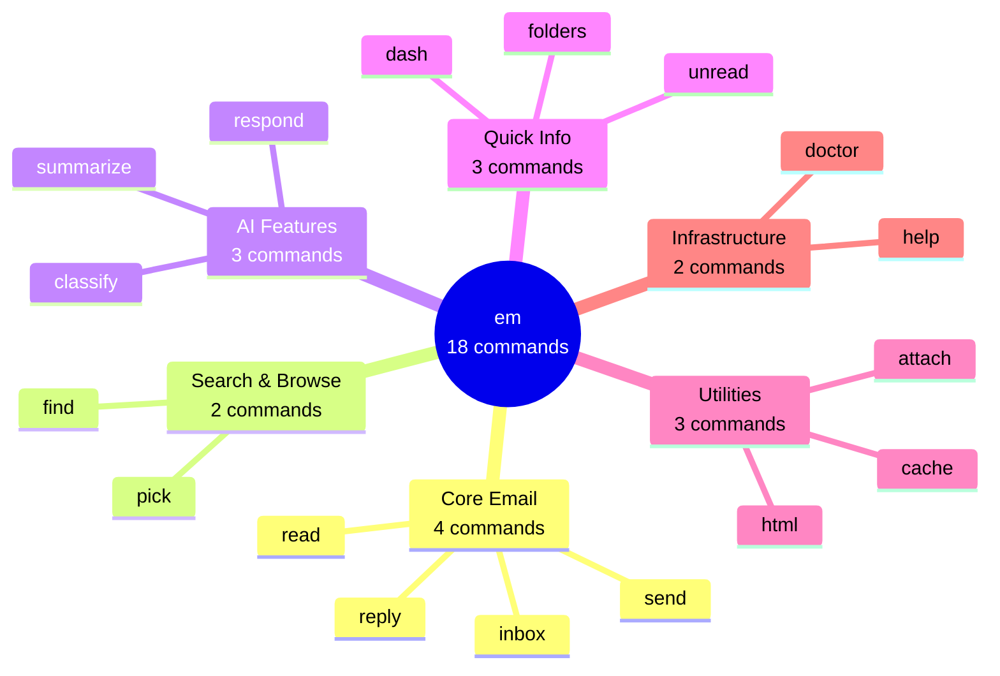
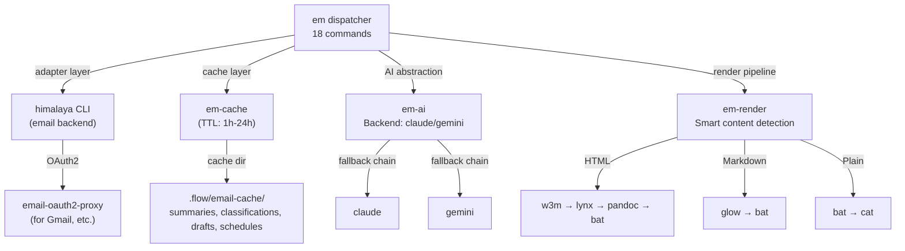

# Email Dispatcher Quick Reference

> All `em` subcommands at a glance. For detailed guides, see linked documentation.
>
> **Version:** v7.0.0 | **Dispatcher:** `lib/dispatchers/email-dispatcher.zsh`

## Command Taxonomy



## All Commands at a Glance

| Command | Aliases | Synopsis | Description |
|---------|---------|----------|-------------|
| **em** | — | `em` | Quick pulse (unread + 10 latest) |
| **em \<N\>** | — | `em 42` | Shorthand: read email by number |
| **em -n N** | — | `em -n 5` | Shorthand: list N emails (= `em inbox N`) |
| **em inbox** | `i` | `em inbox [N] [FOLDER]` | List N recent emails (default: 25) |
| **em read** | `r` | `em read [--html\|--md\|--raw] <ID>` | Read email with smart rendering |
| **em send** | `s` | `em send [--ai] [to] [subject]` | Compose new email |
| **em reply** | `re` | `em reply <ID> [--no-ai] [--all] [--batch]` | Reply with optional AI draft |
| **em find** | `f` | `em find <query>` | Search emails (subject, from, body) |
| **em pick** | `p` | `em pick [FOLDER]` | fzf browser with preview & actions |
| **em respond** | `resp` | `em respond [--review] [--dry-run] [-n N] [--folder F] [--clear]` | Batch AI draft generation |
| **em classify** | `cl` | `em classify <ID>` | Classify email (AI) |
| **em summarize** | `sum` | `em summarize <ID>` | One-line summary (AI) |
| **em unread** | `u` | `em unread [FOLDER]` | Show unread count |
| **em dash** | `d` | `em dash` | Quick dashboard (unread + recent) |
| **em folders** | — | `em folders` | List mail folders |
| **em html** | — | `em html <ID>` | Render HTML email in terminal |
| **em attach** | `a` | `em attach <ID> [OUT_DIR]` | Download attachments |
| **em cache** | — | `em cache <action>` | Cache operations (stats, prune, clear, warm) |
| **em doctor** | `dr` | `em doctor` | Dependency health check |
| **em help** | `h, --help` | `em help` | Show all commands |

---

## Configuration

Environment variables (set in shell, `.env`, or `.flow/email.conf`):

| Variable | Default | Type | Description |
|----------|---------|------|-------------|
| `FLOW_EMAIL_AI` | `claude` | enum | AI backend: `claude` \| `gemini` \| `none` |
| `FLOW_EMAIL_PAGE_SIZE` | `25` | int | Default inbox list size |
| `FLOW_EMAIL_FOLDER` | `INBOX` | string | Default folder (mailbox name) |
| `FLOW_EMAIL_AI_TIMEOUT` | `30` | int | AI draft timeout in seconds |
| `FLOW_EMAIL_CACHE_MAX_MB` | `50` | int | Max cache size in MB (0 = no limit) |
| `FLOW_EMAIL_CACHE_WARM` | `false` | bool | Enable background cache warming on `em dash` |

Load order: env vars → `.flow/email.conf` (project) → `$FLOW_CONFIG_DIR/email.conf` (global)

---

## Architecture Diagram



---

## AI Backends

Three backends available; configured via `$FLOW_EMAIL_AI`:

### Backend: Claude

**Command:** `claude -p "<prompt>" --output-format text`

**Availability Check:**
```bash
command -v claude &>/dev/null && echo "installed" || echo "missing"
```

**Operations:** classify, summarize, draft (reply), schedule

### Backend: Gemini

**Command:** `gemini "<prompt>"`

**Availability Check:**
```bash
command -v gemini &>/dev/null && echo "installed" || echo "missing"
```

**Install:** `pip install google-generativeai`

### Fallback Chain

If configured backend unavailable: `claude` → `gemini` → `none` (timeout gracefully)

---

## Render Pipeline

Smart content detection and rendering:

| Content Type | Detection | Render Chain | Fallback |
|-------------|-----------|--------------|----------|
| **HTML** | `<html>`, `<body>`, `<div>`, `<table>`, `<p>` | w3m → lynx → pandoc → bat | raw HTML |
| **Markdown (--md)** | Explicit `--md` flag | pandoc → SafeLink cleanup → glow → bat | plain text |
| **Markdown** | `#`, `**`, `` ` ``, `- [` | glow → bat | plain text |
| **Plain Text** | — | bat --style=plain | cat |

Commands:
- **w3m** (primary): `w3m -dump -T text/html`
- **lynx** (fallback): `lynx -stdin -dump`
- **pandoc** (HTML→Markdown): `pandoc -f html -t markdown` + Outlook noise cleanup
- **pandoc** (HTML→plain): `pandoc -f html -t plain`
- **bat** (syntax highlighting): `bat --style=plain --color=always`
- **glow** (markdown): `glow -` (auto-pager)

The `--md` pipeline runs 7 cleanup stages: pandoc conversion → SafeLinks URL extraction → URL-decode → Outlook attribute block removal → fenced div stripping → CID/backslash cleanup → blank line collapsing.

---

## Safety Features

### Send Safety Gate

Every send (compose, reply, batch) requires explicit confirmation:

```
Send this email? [y/N]
```

**Default:** No (requires `y` or `Y` to proceed)

**Applies to:**
- `em send` → `em send`
- `em reply <ID>` (batch mode `--batch`) → confirm before send
- `em respond --review` → per-draft confirmation

### Draft Preservation

Rejected sends preserve draft for later:

```bash
em respond --review    # Review & send saved drafts
em cache clear         # Clear all cached drafts if needed
```

---

## Shorthands

Quick access patterns built into the dispatcher:

```bash
em 42              # Same as: em read 42
em -n 5            # Same as: em inbox 5
em                 # Same as: em dash (quick pulse)
```

---

## Read Flags

```bash
em read <ID>            # Smart rendering (auto-detect content type)
em read --html <ID>     # Force HTML rendering (w3m/lynx/pandoc)
em read --md <ID>       # Render as clean Markdown via pandoc (strips Outlook noise)
em read --raw <ID>      # Dump raw MIME source (.eml export)
em html <ID>            # Alias for: em read --html <ID>
```

---

## Respond Flags

```bash
em respond              # Full flow: classify → draft → $EDITOR → send
em respond --review     # Review cached drafts (skip classification)
em respond --dry-run    # Classify only (no drafts, no $EDITOR)
em respond -n 50        # Process 50 emails (default: 10)
em respond --folder F   # Process folder F (default: INBOX)
em respond --clear      # Clear AI cache
```

---

## Email Noise Cleanup

Emails are auto-cleaned before display (6 patterns stripped):

| Pattern | Example | Action |
|---------|---------|--------|
| CID image refs | `[cid:image001.png@...]` | Removed |
| Microsoft Safe Links | `https://nam02.safelinks.protection...` | Removed |
| MIME markers | `<#part type=...>` | Removed |
| Angle-bracket URLs | `<https://example.com>` | Removed |
| Mailto inline | `(mailto:user@example.com)` | Removed |
| Quoted lines | `> original text` | Dimmed |

---

## Auto-Prune & Warm

`em dash` and `em inbox` trigger background housekeeping:

- **Auto-prune**: removes expired cache entries (non-blocking)
- **Auto-warm**: pre-classifies + summarizes latest 10 emails (background)

Manual triggers:

```bash
em cache prune          # Remove expired entries only
em cache warm 20        # Pre-warm latest 20 emails
```

---

## fzf Key Bindings (em pick)

Interactive fzf email browser with preview:

| Key | Action | Details |
|-----|--------|---------|
| **Enter** | Read email | Default action, shows full content |
| **Ctrl-R** | Reply | Open reply with AI draft |
| **Ctrl-S** | Summarize | Generate 1-line summary (AI) |
| **Ctrl-A** | Archive | Mark as read (folders archives) |
| **Ctrl-D** | Delete | Flag for deletion (with confirm) |
| **Escape** | Exit | Return to shell |

**Header Info:** Folder, unread count, legend

**Indicators:**
- `*` = unread
- `+` = has attachment

---

## AI Operations & Timeouts

Per-operation timeout configuration (seconds):

| Operation | Default Timeout | Backend Preference | Cache TTL |
|-----------|-----------------|-------------------|-----------|
| `classify` | 10s | configured backend | 24h |
| `summarize` | 15s | configured backend | 24h |
| `draft` | 30s | configured backend | 1h |
| `schedule` | 15s | configured backend | 24h |

**Override:** `FLOW_EMAIL_AI_TIMEOUT=<seconds>` (global for all ops)

---

## Cache System

TTL-based AI result caching (project-local):

### Cache Directory Structure

```
.flow/email-cache/
  summaries/           (one-line summaries)
  classifications/     (email categories)
  drafts/              (reply drafts)
  schedules/           (extracted dates/times)
  unread/              (unread count)
```

### TTL Defaults

| Operation | TTL | Reason |
|-----------|-----|--------|
| summaries | 24h | Content rarely changes |
| classifications | 24h | Category is stable |
| drafts | 1h | May need refreshing |
| schedules | 24h | Dates don't change |
| unread | 1m | Count changes often |

### Cache Commands

```bash
em cache stats                  # Show cache size, per-op counts, expired count
em cache prune                  # Remove expired entries only (report count)
em cache clear                  # Clear entire cache (report freed space)
em cache warm [N]               # Pre-warm latest N emails (default: 10, background)
```

### Size Cap (LRU Eviction)

Max cache size: `FLOW_EMAIL_CACHE_MAX_MB=50` (default). When exceeded, oldest files are evicted first (LRU). Set to `0` to disable size cap.

Eviction runs automatically after every cache write (non-blocking background process).

---

## Quick Examples

### Daily Workflow

```bash
# ─────────────────────────────────────────────────────────────
# Quick pulse check
em                              # Unread count + 10 latest
em 42                           # Shorthand: read email #42
em -n 5                         # Shorthand: list 5 emails

# ─────────────────────────────────────────────────────────────
# Reading & replying
em r 42                         # Read email #42
em r --md 42                    # Clean Markdown via pandoc (great for Outlook)
em r --raw 42                   # Dump raw MIME (.eml)
em re 42                        # Reply with AI draft
em re 42 --no-ai                # Reply without AI
em re 42 --all                  # Reply-all
em re 42 --batch                # Non-interactive (preview+confirm)

# ─────────────────────────────────────────────────────────────
# Composing
em s                            # New email (opens $EDITOR)
em s --ai "Subject here"        # AI draft from subject

# ─────────────────────────────────────────────────────────────
# Browsing & search
em i                            # List recent emails (25)
em i 50                         # List 50 emails
em i 25 "Sent Items"            # List folder
em p                            # fzf browser (interactive)
em f "quarterly report"         # Search emails

# ─────────────────────────────────────────────────────────────
# AI features
em classify 42                  # Classify email (AI)
em sum 42                       # One-line summary (AI)
em respond                      # Batch draft generation
em respond --review             # Review/send cached drafts
em respond --dry-run            # Classify only (no drafts)
em respond -n 50                # Process 50 emails

# ─────────────────────────────────────────────────────────────
# Quick info
em u                            # Show unread count
em d                            # Quick dashboard
em folders                      # List folders
em html 42                      # Render HTML in terminal

# ─────────────────────────────────────────────────────────────
# Attachments
em attach 42                    # Download attachments
em attach 42 ~/Downloads        # Save to specific directory

# ─────────────────────────────────────────────────────────────
# Management
em cache stats                  # Show cache size, TTLs, expired count
em cache prune                  # Remove expired entries only
em cache clear                  # Clear cached AI results
em doctor                       # Check dependencies
em h                            # Show help
```

---

## Doctor Checks

Run `em doctor` for dependency health:

### Required

| Tool | Purpose | Install |
|------|---------|---------|
| `himalaya` | Email CLI backend | `brew install himalaya` or `cargo install himalaya` |
| `jq` | JSON processing | `brew install jq` |

### Recommended

| Tool | Purpose | Install |
|------|---------|---------|
| `fzf` | Interactive picker | `brew install fzf` |
| `bat` | Syntax highlighting | `brew install bat` |
| `w3m` | HTML rendering (primary) | `brew install w3m` |
| `lynx` | HTML fallback | `brew install lynx` |
| `pandoc` | HTML to plain (fallback) + `--md` rendering | `brew install pandoc` |
| `glow` | Markdown rendering | `brew install glow` |

### Optional (Infrastructure)

| Tool | Purpose | Install |
|------|---------|---------|
| `email-oauth2-proxy` | OAuth2 IMAP/SMTP proxy (Gmail, etc.) | `pip install email-oauth2-proxy` |
| `terminal-notifier` | Desktop notifications | `brew install terminal-notifier` |

### Optional (AI)

| Backend | Detection | Install |
|---------|-----------|---------|
| Claude | When `FLOW_EMAIL_AI=claude` | `npm install -g @anthropic-ai/claude-code` |
| Gemini | When `FLOW_EMAIL_AI=gemini` | `pip install google-generativeai` |

---

## Email Classifications

AI classification categories (for `em classify`, `em respond`):

| Category | Icon | Color | Actionable | Description |
|----------|------|-------|-----------|-------------|
| `student` | S | blue | ✓ | Student email: absence, question, grade inquiry, accommodation |
| `colleague` | C | green | ✓ | Faculty/staff: hiring committee, research, departmental threads |
| `admin-action` | ! | red | ✓ | Requires YOUR action: accommodation letter, form, review request |
| `scheduling` | @ | cyan | ✓ | Meeting request, event RSVP, calendar invite, office hours |
| `urgent` | U | red | ✓ | Deadline today, emergency, escalation, time-sensitive |
| `admin-info` | i | dim | ✗ | FYI only: university blast, mailing list, policy notice |
| `newsletter` | N | dim | ✗ | Professional journal, academic association digest |
| `vendor` | V | dim | ✗ | Commercial marketing, textbook promo, EdTech sales |
| `automated` | A | dim | ✗ | CI/CD, GitHub, system alerts, delivery receipts |

**Non-actionable emails skipped by `em respond`:** admin-info, newsletter, vendor, automated

### Listserv Safety

Emails to mailing lists (`*@LIST.*`, `*-L@*`) are auto-skipped in `em respond` with an `L` icon. If a listserv email passes classification, a warning banner appears before drafting:

```
⚠ WARNING: This email was sent to a mailing list
  Replying may go to ALL list members. Review carefully.
```

### Discard Detection

When reviewing drafts (`em respond --review`), himalaya's "Discard" action is properly detected. Discarded drafts are counted as skipped, not as sent replies.

---

## Common Workflows

### New Session — Quick Pulse

```bash
em                              # Unread count + 10 latest
em u                            # How many unread?
em d                            # Full dashboard
```

### Processing Emails

```bash
em p                            # Browse with fzf
# (Enter=read, Ctrl-R=reply, Ctrl-S=summarize, Ctrl-A=archive)
```

### Batch Draft Generation

```bash
em respond                      # Classify → draft → $EDITOR → send (full flow)
em respond --review             # Review cached drafts (skip classification)
em respond --dry-run            # Classify only (see what's actionable)
em respond --clear              # Clear all cached drafts
```

### Replying

```bash
# Interactive (opens $EDITOR)
em re 42                        # AI draft pre-populated
em re 42 --no-ai                # Manual composition
em re 42 --all                  # Reply to all

# Non-interactive (batch, preview + confirm)
em re 42 --batch                # Preview, then [y/N]
```

### Search & Find

```bash
em f "quarterly report"         # Subject/from/body search
em find "from:john"             # Search emails from John
em find "before:2026-01-01"     # IMAP search syntax
```

### HTML Emails

```bash
em r 42                         # Auto-detects HTML, renders smart
em html 42                      # Force HTML rendering
em r --md 42                    # Clean Markdown via pandoc (best for Outlook)
em html 42 | less               # Pipe to pager
```

### Attachments

```bash
em attach 42                    # Download to ~/Downloads
em attach 42 ~/Documents        # Custom directory
```

---

## Dispatcher Configuration Files

### Global Config

**Path:** `$FLOW_CONFIG_DIR/email.conf`

**Example:**
```bash
FLOW_EMAIL_AI=claude
FLOW_EMAIL_PAGE_SIZE=30
FLOW_EMAIL_FOLDER=INBOX
FLOW_EMAIL_AI_TIMEOUT=45
```

### Project Config (Override)

**Path:** `.flow/email.conf` (in project root)

Takes precedence over global config.

### Himalaya Setup

**Required:** Configure email account first

```bash
himalaya account list           # Show configured accounts
himalaya account add            # Add new account (interactive)
```

For Gmail/OAuth2: `email-oauth2-proxy` recommended (see `em doctor`)

---

## Related Commands

### Flow-cli Layer 1

- **`work`** — Start session (integrates with email via `em dash`)
- **`flow doctor`** — Full system health (includes email subsystem)

### Other Dispatchers

- **`g`** — Git (workflows)
- **`obs`** — Obsidian (quick notes about emails)
- **`tm`** — Terminal manager (email session windows)

### External Tools

- **Himalaya** — Native email CLI (https://github.com/pimalaya/himalaya)
- **Claude Code** — For AI-powered workflows

---

## Architecture Overview

### Layer 1: Dispatcher (`em()`)

Pure ZSH dispatcher. 18 public commands. <10ms response.

### Layer 2: Adapters

- **`em-himalaya.zsh`** — Isolates himalaya CLI specifics
- **`em-cache.zsh`** — TTL-based AI caching
- **`em-ai.zsh`** — Backend abstraction (claude/gemini)
- **`em-render.zsh`** — Content detection + rendering

### Layer 3: Infrastructure

- **Himalaya CLI** — IMAP/SMTP backend
- **email-oauth2-proxy** — OAuth2 for Gmail, Outlook, etc.
- **render chain** — w3m, lynx, pandoc, bat, glow

---

## Troubleshooting

### Problem: "himalaya not found"

**Solution:**
```bash
brew install himalaya          # macOS (recommended)
cargo install himalaya         # Cross-platform alternative

# Verify
himalaya account list
```

### Problem: "Email ID required"

**Cause:** Missing message ID argument

**Solution:**
```bash
em inbox                        # List emails with IDs
em read 42                      # Use actual ID
```

### Problem: "Cannot connect to mailbox"

**Cause:** Himalaya account not configured

**Solution:**
```bash
himalaya account add           # Add account interactively
himalaya account list          # Verify setup
em doctor                      # Check status
```

### Problem: "AI timed out"

**Cause:** Backend slow or unavailable

**Solution:**
```bash
# Increase timeout
export FLOW_EMAIL_AI_TIMEOUT=60

# Or skip AI
em re 42 --no-ai               # Reply without draft
em respond --clear             # Clear bad drafts
```

### Problem: "No fzf for picker"

**Cause:** `fzf` not installed

**Solution:**
```bash
brew install fzf
em p                           # Try again
```

---

## See Also

### Comprehensive Guides

- [EMAIL-DISPATCHER-GUIDE.md](../guides/EMAIL-DISPATCHER-GUIDE.md) — Complete workflow guide
- [HIMALAYA-SETUP.md](../guides/HIMALAYA-SETUP.md) — Email account configuration

### References

- [MASTER-DISPATCHER-GUIDE.md](MASTER-DISPATCHER-GUIDE.md) — All 13 dispatchers
- [MASTER-API-REFERENCE.md](MASTER-API-REFERENCE.md) — Function signatures
- [MASTER-ARCHITECTURE.md](MASTER-ARCHITECTURE.md) — System design

### External

- [Himalaya Documentation](https://pimalaya.org/)
- [email-oauth2-proxy](https://github.com/simonthum/email-oauth2-proxy)

---

**Version:** v7.0.0
**Last Updated:** 2026-02-10
**Commands:** 18 total (4 core + 2 search + 3 AI + 3 info + 3 util + 2 infra + 1 help)
