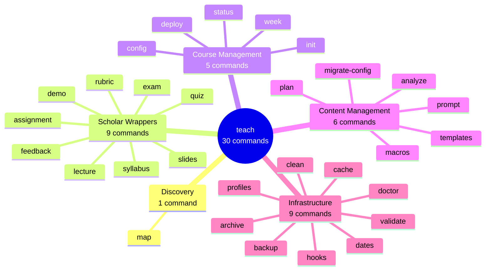

# Teach Dispatcher Quick Reference

> All 30 `teach` subcommands at a glance. For detailed guides, see linked documentation.
>
> **Version:** v6.6.0+ | **Dispatcher:** `lib/dispatchers/teach-dispatcher.zsh`

## Command Taxonomy



## Discovery (v6.6.0)

Ecosystem-wide command discovery across all teaching tools.

| Command | Aliases | Synopsis | Description |
|---------|---------|----------|-------------|
| `teach map` | — | `teach map` | Show all teaching commands across flow-cli, Scholar, and Craft grouped by workflow phase |

Shows commands from three tools in one view: flow-cli (shell), Scholar (Claude Code plugin), and Craft (Claude Code plugin). Commands from uninstalled tools appear dimmed with install hints. Slash commands (`/craft:*`, `/scholar:*`) are shown for Claude Code users.

---

## Scholar Wrappers (AI Content Generation)

AI-powered content creation via Scholar plugin. All commands require Scholar to be available.

| Command | Aliases | Synopsis | Description | Docs |
|---------|---------|----------|-------------|------|
| `teach lecture` | `lec` | `teach lecture <topic> [flags]` | Generate lecture notes with AI | [TEACHING-WORKFLOW-V3-GUIDE.md](../guides/TEACHING-WORKFLOW-V3-GUIDE.md) |
| `teach slides` | `sl` | `teach slides <topic> [flags]` | Create presentation slides | [TEACHING-WORKFLOW-V3-GUIDE.md](../guides/TEACHING-WORKFLOW-V3-GUIDE.md) |
| `teach exam` | `e` | `teach exam <topic> [flags]` | Generate comprehensive exam | [TEACHING-WORKFLOW-V3-GUIDE.md](../guides/TEACHING-WORKFLOW-V3-GUIDE.md) |
| `teach quiz` | `q` | `teach quiz <topic> [flags]` | Create quiz questions | [TEACHING-WORKFLOW-V3-GUIDE.md](../guides/TEACHING-WORKFLOW-V3-GUIDE.md) |
| `teach assignment` | `hw` | `teach assignment <topic> [flags]` | Generate homework assignment | [TEACHING-WORKFLOW-V3-GUIDE.md](../guides/TEACHING-WORKFLOW-V3-GUIDE.md) |
| `teach syllabus` | `syl` | `teach syllabus <course> [flags]` | Create course syllabus | [TEACHING-WORKFLOW-V3-GUIDE.md](../guides/TEACHING-WORKFLOW-V3-GUIDE.md) |
| `teach rubric` | `rb` | `teach rubric <assignment> [flags]` | Generate grading rubric | [TEACHING-WORKFLOW-V3-GUIDE.md](../guides/TEACHING-WORKFLOW-V3-GUIDE.md) |
| `teach feedback` | `fb` | `teach feedback <work> [flags]` | Create student feedback | [TEACHING-WORKFLOW-V3-GUIDE.md](../guides/TEACHING-WORKFLOW-V3-GUIDE.md) |
| `teach demo` | — | `teach demo <topic> [flags]` | Create demo course content | [TEACHING-WORKFLOW-V3-GUIDE.md](../guides/TEACHING-WORKFLOW-V3-GUIDE.md) |

## Course Management

Project lifecycle and workflow commands.

| Command | Aliases | Synopsis | Description | Docs |
|---------|---------|----------|-------------|------|
| `teach init` | `i` | `teach init [name] [--config <file>] [--github]` | Initialize teaching project | [teach init](../commands/teach-init.md) |
| `teach deploy` | `d` | `teach deploy [files] [-d] [--dry-run] [--rollback N] [--history N]` | Deploy course site (direct merge, PR, rollback) | [Deploy Guide](../guides/TEACH-DEPLOY-GUIDE.md) |
| `teach config` | `c` | `teach config [--view\|--cat]` | Edit or view configuration | [TEACH-CONFIG-SCHEMA.md](TEACH-CONFIG-SCHEMA.md) |
| `teach status` | `s` | `teach status [--full\|--performance]` | Project dashboard | [TEACHING-WORKFLOW-V3-GUIDE.md](../guides/TEACHING-WORKFLOW-V3-GUIDE.md) |
| `teach week` | `w` | `teach week` | Current week info | [Tutorial 20](../tutorials/20-teaching-dates-automation.md) |

## Content Management

Lesson plans, templates, macros, and AI prompts.

| Command | Aliases | Synopsis | Description | Docs |
|---------|---------|----------|-------------|------|
| `teach plan` | `pl` | `teach plan <action> [args]` | Lesson plan CRUD (create, list, show, edit, delete) | [REFCARD-TEACH-PLAN.md](REFCARD-TEACH-PLAN.md) |
| `teach templates` | `tmpl`, `tpl` | `teach templates <action> [args]` | Template management (list, new, validate, sync) | [REFCARD-TEMPLATES.md](REFCARD-TEMPLATES.md) |
| `teach macros` | `macro`, `m` | `teach macros <action> [args]` | LaTeX macro management (list, sync, export) | [Tutorial 26](../tutorials/26-latex-macros.md) |
| `teach prompt` | `pr` | `teach prompt <action> [args]` | AI prompt management (list, show, edit, validate, export) | [REFCARD-PROMPTS.md](REFCARD-PROMPTS.md) |
| `teach analyze` | `concept`, `concepts` | `teach analyze <file> [--mode strict\|moderate] [--ai]` | Validate content prerequisites | [Tutorial 21](../tutorials/21-teach-analyze.md) |
| `teach migrate-config` | `migrate` | `teach migrate-config [--dry-run] [--force]` | Extract lesson plans from config | [Tutorial 25](../tutorials/25-lesson-plan-migration.md) |

## Infrastructure

Health checks, validation, caching, backups, and Git hooks.

| Command | Aliases | Synopsis | Description | Docs |
|---------|---------|----------|-------------|------|
| `teach doctor` | `doc` | `teach doctor [--fix] [--json]` | Health checks (6 categories) with auto-fix | [doctor](../commands/doctor.md) |
| `teach validate` | `val`, `v` | `teach validate [files] [--yaml\|--syntax\|--render] [--watch]` | Validate .qmd files | [Tutorial 27](../tutorials/27-lint-quickstart.md) |
| `teach dates` | — | `teach dates <action> [args]` | Date management (add, list, show, edit, delete, sync) | [Tutorial 20](../tutorials/20-teaching-dates-automation.md) |
| `teach cache` | — | `teach cache <action>` | Cache operations (status, clear, rebuild) | [TEACHING-WORKFLOW-V3-GUIDE.md](../guides/TEACHING-WORKFLOW-V3-GUIDE.md) |
| `teach clean` | `cl` | `teach clean [--dry-run]` | Delete `_freeze/` and `_site/` | [TEACHING-WORKFLOW-V3-GUIDE.md](../guides/TEACHING-WORKFLOW-V3-GUIDE.md) |
| `teach backup` | `bk` | `teach backup <action> [args]` | Backup management (create, list, restore, delete) | [Backup Guide](../guides/BACKUP-SYSTEM-GUIDE.md) |
| `teach archive` | `a` | `teach archive [semester]` | Archive semester | [TEACHING-WORKFLOW-V3-GUIDE.md](../guides/TEACHING-WORKFLOW-V3-GUIDE.md) |
| `teach hooks` | `hook` | `teach hooks <action>` | Git hook management (install, upgrade, status, uninstall) | [Tutorial 19](../tutorials/19-teaching-git-integration.md) |
| `teach profiles` | `profile`, `prof` | `teach profiles <action> [args]` | Profile management (list, activate, create) | [TEACHING-WORKFLOW-V3-GUIDE.md](../guides/TEACHING-WORKFLOW-V3-GUIDE.md) |

## Universal Scholar Flags

Available to ALL Scholar wrapper commands (lecture, slides, exam, quiz, assignment, syllabus, rubric, feedback, demo).

### Selection Flags

| Flag | Short | Type | Description | Example |
|------|-------|------|-------------|---------|
| `--topic` | `-t` | string | Topic name | `--topic "Linear Regression"` |
| `--week` | `-w` | number | Week number (1-20) | `--week 5` |
| `--style` | — | enum | Content style preset | `--style rigorous` |
| `--interactive` | `-i` | flag | Interactive mode | `--interactive` |
| `--revise` | — | string | Revise existing file | `--revise week-05-lecture.qmd` |
| `--context` | — | flag | Include additional context | `--context` |

**Style Options:** `conceptual`, `computational`, `rigorous`, `applied`

### Content Toggle Flags

| Flag | Short | Description | Negation |
|------|-------|-------------|----------|
| `--explanation` | `-e` | Include explanations | `--no-explanation` |
| `--proof` | — | Include proofs | `--no-proof` |
| `--math` | `-m` | Include mathematics | `--no-math` |
| `--examples` | `-x` | Include examples | `--no-examples` |
| `--code` | `-c` | Include code | `--no-code` |
| `--diagrams` | `-d` | Include diagrams | `--no-diagrams` |
| `--practice-problems` | `-p` | Include practice problems | `--no-practice-problems` |
| `--definitions` | — | Include definitions | `--no-definitions` |
| `--references` | `-r` | Include references | `--no-references` |

### Command-Specific Flags

**Exam/Quiz:**
- `--questions N` - Number of questions
- `--duration N` - Time limit (exam)
- `--time-limit N` - Time limit (quiz)
- `--types "mc,sa,tf"` - Question types (exam)
- `--format quarto|qti|markdown` - Output format
- `--dry-run` - Preview without creating
- `--verbose` - Show detailed output

**Slides:**
- `--theme default|academic|minimal` - Slide theme
- `--from-lecture <file>` - Generate from lecture notes
- `--format quarto|markdown` - Output format
- `--dry-run` - Preview without creating
- `--verbose` - Show detailed output

**Assignment:**
- `--due-date YYYY-MM-DD` - Due date
- `--points N` - Total points
- `--format quarto|markdown` - Output format
- `--dry-run` - Preview without creating
- `--verbose` - Show detailed output

**Syllabus:**
- `--format quarto|markdown|pdf` - Output format
- `--dry-run` - Preview without creating
- `--verbose` - Show detailed output

**Rubric:**
- `--criteria N` - Number of criteria
- `--format quarto|markdown` - Output format
- `--dry-run` - Preview without creating
- `--verbose` - Show detailed output

## Quick Examples

Using STAT-101 demo course for all examples.

```bash
# ─────────────────────────────────────────────────────────────
# Scholar Wrappers
# ─────────────────────────────────────────────────────────────

# Generate lecture with week-based naming
teach lecture "Introduction to Statistics" --week 1 --style conceptual

# Create slides from existing lecture
teach slides "Probability" --week 3 --from-lecture week-03-lecture.qmd

# Generate exam with 20 questions, 120 minutes
teach exam "Midterm" --questions 20 --duration 120 --style rigorous

# Create quiz with interactive mode
teach quiz "Hypothesis Testing" --questions 10 --week 8 -i

# Generate assignment with due date
teach assignment "Linear Regression" --week 5 --due-date 2026-02-15

# Create syllabus for STAT-101
teach syllabus "Introduction to Statistics" --format pdf

# Generate rubric with 5 criteria
teach rubric "Final Project" --criteria 5

# Create student feedback
teach feedback "Assignment 3 - John Doe"

# ─────────────────────────────────────────────────────────────
# Course Management
# ─────────────────────────────────────────────────────────────

# Initialize new course with GitHub
teach init "STAT-101" --github

# Deploy with preview
teach deploy --preview

# View config in pager
teach config --view

# Show dashboard with performance metrics
teach status --performance

# Get current week info
teach week

# ─────────────────────────────────────────────────────────────
# Content Management
# ─────────────────────────────────────────────────────────────

# Create lesson plan for week 3
teach plan create 3 --topic "Probability" --style rigorous

# List all lesson plans
teach plan list

# Show week 5 details
teach plan show 5

# Edit week 3 in $EDITOR
teach plan edit 3

# Create lecture from template
teach templates new lecture week-05 --topic "ANOVA"

# List all templates
teach templates list

# Sync macros from source files
teach macros sync

# Export macros for Scholar
teach macros export --format json

# List AI prompts (3-tier resolution)
teach prompt list

# Edit course-specific prompt
teach prompt edit exam-generation

# Analyze prerequisites in lecture file
teach analyze lectures/week-05-regression.qmd --mode strict

# Migrate lesson plans from old config
teach migrate-config --dry-run

# ─────────────────────────────────────────────────────────────
# Infrastructure
# ─────────────────────────────────────────────────────────────

# Run health checks and auto-fix issues
teach doctor --fix

# Validate all .qmd files with rendering
teach validate --render

# Validate specific files (YAML only)
teach validate lectures/*.qmd --yaml

# Watch mode (continuous validation)
teach validate --watch

# Add important date
teach dates add "Midterm Exam" 2026-03-15 --type exam

# List all dates
teach dates list

# Show cache status
teach cache status

# Clear cache
teach cache clear

# Clean build artifacts
teach clean

# Create backup with description
teach backup create "Before Week 5"

# List all backups
teach backup list

# Restore from backup
teach backup restore backup-2026-02-02-143022

# Archive Fall 2025 semester
teach archive "Fall 2025"

# Install Git hooks
teach hooks install

# Check hook status
teach hooks status

# List available profiles
teach profiles list

# ─────────────────────────────────────────────────────────────
# Content Toggles (Universal)
# ─────────────────────────────────────────────────────────────

# Lecture with no proofs, include code
teach lecture "Regression" -w 5 --no-proof --code

# Quiz with examples and diagrams
teach quiz "Distributions" -w 4 -x -d

# Exam without practice problems
teach exam "Final" --no-practice-problems

# ─────────────────────────────────────────────────────────────
# Combined Workflow
# ─────────────────────────────────────────────────────────────

# Full setup workflow
teach init "STAT-101"
teach doctor --fix
teach hooks install
teach migrate-config

# Content creation workflow
teach plan create 5 --topic "Linear Regression"
teach lecture "Linear Regression" --week 5 --style computational
teach validate lectures/week-05-*.qmd --render
teach deploy --preview
teach deploy
teach backup create "After Week 5"
```

## Common Workflows

### New Course Setup

```bash
teach init "STAT-101" --github
teach doctor --fix
teach hooks install
teach migrate-config              # If migrating from old config
teach plan list                   # Review lesson plans
teach templates sync              # Get latest templates
```

### Weekly Content Creation

```bash
teach plan create 5 --topic "ANOVA"
teach lecture "ANOVA" --week 5 --style computational
teach slides "ANOVA" --week 5 --from-lecture week-05-lecture.qmd
teach quiz "ANOVA Basics" --week 5 --questions 10
teach validate lectures/week-05-*.qmd --render
```

### Pre-Deployment Checklist

```bash
teach doctor
teach validate --render
teach analyze lectures/*.qmd --mode moderate
teach deploy --preview
teach backup create "Before deployment"
teach deploy
```

### Semester End

```bash
teach backup create "Final backup - Fall 2025"
teach archive "Fall 2025"
teach status --performance        # Review metrics
```

## See Also

### Comprehensive Guides

- [TEACHING-WORKFLOW-V3-GUIDE.md](../guides/TEACHING-WORKFLOW-V3-GUIDE.md) — Complete teaching workflow
- [SCHOLAR-WRAPPERS-GUIDE.md](../guides/SCHOLAR-WRAPPERS-GUIDE.md) — Scholar integration details

### Schema & Config

- [TEACH-CONFIG-SCHEMA.md](TEACH-CONFIG-SCHEMA.md) — `.flow/teach-config.yml` schema
- [TEACH-CONFIG-SCHEMA.md - Lesson Plans](TEACH-CONFIG-SCHEMA.md#lesson-plansyml-schema) — `.flow/lesson-plans.yml` schema

### Quick Reference Cards

- [REFCARD-TEACH-PLAN.md](REFCARD-TEACH-PLAN.md) — Lesson plan commands
- [REFCARD-TEMPLATES.md](REFCARD-TEMPLATES.md) — Template commands
- [REFCARD-PROMPTS.md](REFCARD-PROMPTS.md) — AI prompt commands

### Tutorials

**Teaching Foundations**
- [Tutorial 19: Git Integration](../tutorials/19-teaching-git-integration.md)
- [Tutorial 20: Date Automation](../tutorials/20-teaching-dates-automation.md)
- [Tutorial 21: Content Analysis](../tutorials/21-teach-analyze.md)

**Content Management**
- [Tutorial 24: Template Management](../tutorials/24-template-management.md)
- [Tutorial 25: Lesson Plan Migration](../tutorials/25-lesson-plan-migration.md)
- [Tutorial 26: LaTeX Macros](../tutorials/26-latex-macros.md)
- [Tutorial 27: Lint Quickstart](../tutorials/27-lint-quickstart.md)
- [Tutorial 28: AI Prompt Management](../tutorials/28-teach-prompt.md)

**Guides**
- [Scholar Wrappers Guide](../guides/SCHOLAR-WRAPPERS-GUIDE.md) — AI content generation
- [Deploy Guide](../guides/TEACH-DEPLOY-GUIDE.md) — Deployment workflow
- [Backup System Guide](../guides/BACKUP-SYSTEM-GUIDE.md) — Backup & restore
- [Config Schema](TEACH-CONFIG-SCHEMA.md) — Configuration reference

### API Documentation

- [MASTER-API-REFERENCE.md](MASTER-API-REFERENCE.md) — Function signatures
- [MASTER-DISPATCHER-GUIDE.md](MASTER-DISPATCHER-GUIDE.md) — All 12 dispatchers

### Architecture

- [MASTER-ARCHITECTURE.md](MASTER-ARCHITECTURE.md) — System design with Mermaid diagrams

---

**Version:** v6.7.0
**Last Updated:** 2026-02-10
**Commands:** 30 total (9 Scholar wrappers + 5 course mgmt + 6 content mgmt + 9 infrastructure + 1 discovery)
