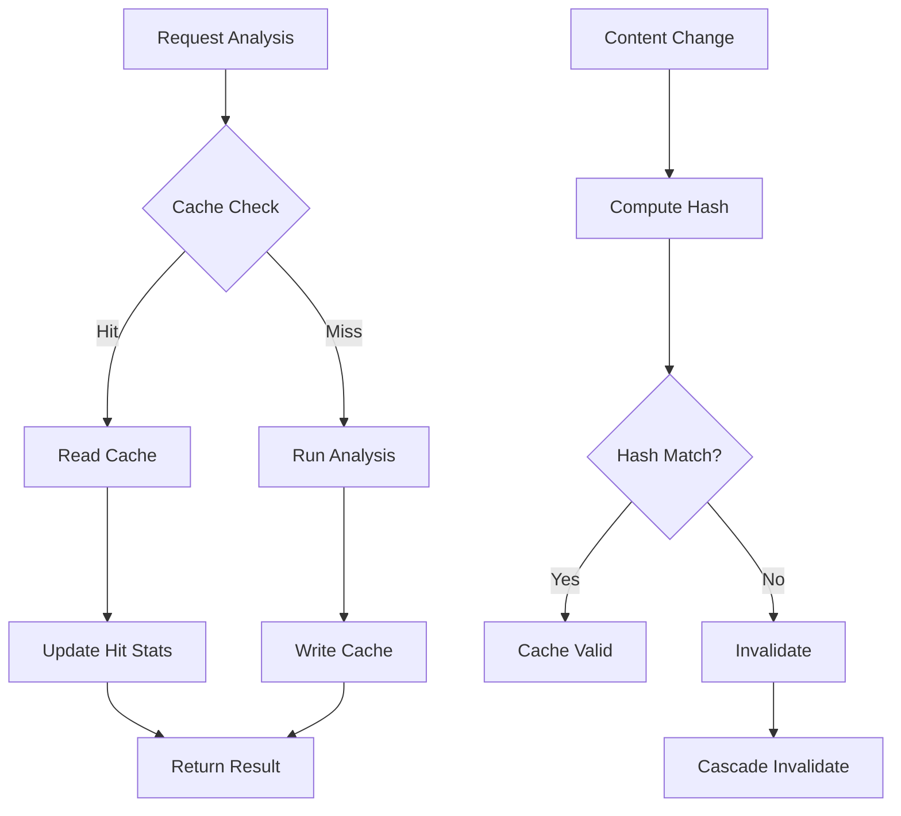
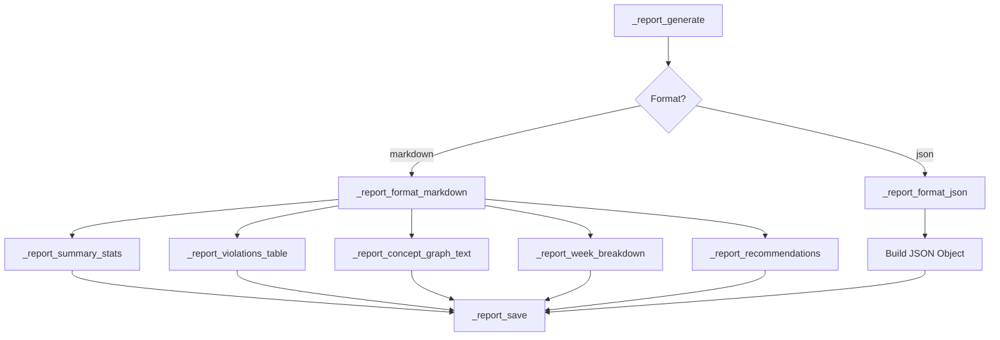
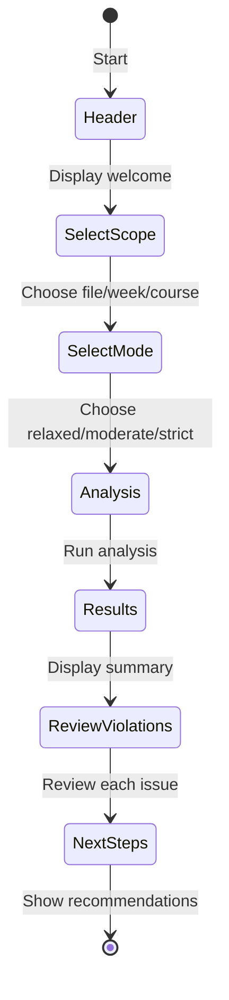
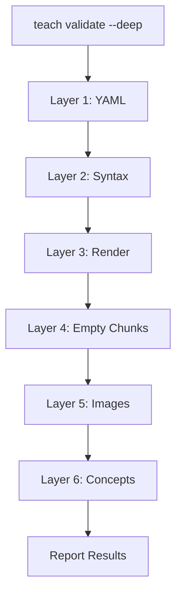
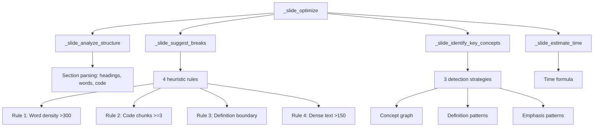

# Teach Analyze API Reference

**Version:** v5.16.0 (Phase 5)
**Last Updated:** 2026-01-22

---

## Overview

The `teach analyze` system provides intelligent content analysis for teaching workflows. This reference documents all public functions, commands, and configuration options.

### Feature Summary

| Feature | Description | Phase |
|---------|-------------|-------|
| Concept Extraction | Parse `concepts:` from YAML frontmatter | Phase 0 |
| Prerequisite Validation | Detect missing/future prerequisites | Phase 0 |
| Integration | `teach validate --concepts`, `teach status` | Phase 1 |
| Smart Caching | SHA-256 content hash, TTL expiration | Phase 2 |
| Report Generation | Markdown/JSON reports | Phase 2 |
| Interactive Mode | Guided ADHD-friendly prompts | Phase 2 |
| Deep Validation | Layer 6 validation, deploy blocking | Phase 2 |
| AI Analysis | Claude-powered pedagogical insights | Phase 3 |
| Cost Tracking | AI usage cost monitoring | Phase 3 |
| Slide Breaks | Heuristic slide break detection | Phase 4 |
| Break Preview | Detailed break suggestions display | Phase 4 |
| Key Concepts | Auto-identify concepts for callouts | Phase 4 |
| Time Estimation | Presentation timing from content | Phase 4 |
| Error Handling | File suggestions, extension validation | Phase 5 |
| Slide Cache | Content-hash caching for optimization | Phase 5 |

---

## Command Reference

### teach analyze

Build concept graph and validate prerequisites.

```bash
teach analyze [OPTIONS] [FILE]
```

#### Options

| Flag | Phase | Description |
|------|-------|-------------|
| `--mode MODE` | 0 | Strictness: `strict`, `moderate`, `relaxed` |
| `--summary`, `-s` | 0 | Compact summary only |
| `--quiet`, `-q` | 0 | Suppress progress indicators |
| `--interactive`, `-i` | 2 | Guided interactive mode (ADHD-friendly) |
| `--report [FILE]` | 2 | Generate report to FILE |
| `--format FORMAT` | 2 | Report format: `markdown` (default), `json` |
| `--ai` | 3 | Enable AI-powered analysis |
| `--costs` | 3 | Show AI analysis cost summary |
| `--slide-breaks` | 4 | Analyze slide structure and suggest breaks |
| `--preview-breaks` | 4 | Detailed break preview (exits early) |
| `--help`, `-h` | - | Show help |

#### Examples

```bash
# Basic analysis
teach analyze lectures/week-05-regression.qmd

# Interactive mode
teach analyze --interactive lectures/week-05-regression.qmd

# Generate markdown report
teach analyze lectures/week-05-regression.qmd --report analysis.md

# JSON report for CI
teach analyze lectures/week-05-regression.qmd --report results.json --format json

# AI-powered analysis (Phase 3)
teach analyze --ai lectures/week-05-regression.qmd
teach analyze --ai --costs lectures/week-05-regression.qmd

# View AI costs only
teach analyze --costs

# Slide optimization (Phase 4)
teach analyze --slide-breaks lectures/week-05-regression.qmd
teach analyze --preview-breaks lectures/week-05-regression.qmd

# Combine flags
teach analyze --slide-breaks --quiet lectures/week-05.qmd --report report.md
```

### teach validate --deep

Run Layer 6 deep validation with concept analysis.

```bash
teach validate --deep [OPTIONS]
```

#### Options

| Flag | Description |
|------|-------------|
| `--deep` | Enable Layer 6 concept validation |
| `--concepts` | Concept validation only (no other layers) |
| `--quiet`, `-q` | Suppress non-error output |
| `--json` | Output as JSON |

#### Examples

```bash
# Full validation with concepts
teach validate --deep

# Concept validation only
teach validate --concepts

# Combined with YAML validation
teach validate --yaml --deep
```

### teach deploy --check-prereqs

Check prerequisites before deployment.

```bash
teach deploy --check-prereqs [OPTIONS]
```

#### Behavior

- **Errors (missing prerequisites)**: Blocks deployment
- **Warnings (future prerequisites)**: Allows deployment

#### Examples

```bash
# Deploy with prereq check
teach deploy --check-prereqs

# Dry run
teach deploy --check-prereqs --dry-run
```

---

## Cache API

**File:** `lib/analysis-cache.zsh`

### Architecture



### Functions

#### _cache_init

Initialize cache directory structure and index.

```zsh
_cache_init [course_dir]
```

| Parameter | Type | Description |
|-----------|------|-------------|
| `course_dir` | string | Course directory (optional, uses PWD) |

**Returns:** 0 on success, 1 on failure

**Example:**
```zsh
_cache_init "/path/to/course"
```

---

#### _cache_get_content_hash

Compute SHA-256 hash of file contents.

```zsh
_cache_get_content_hash <file_path>
```

| Parameter | Type | Description |
|-----------|------|-------------|
| `file_path` | string | Path to file |

**Returns:** Hash string prefixed with `sha256:`, or empty on error

**Example:**
```zsh
local hash=$(_cache_get_content_hash "lectures/week-01.qmd")
# Returns: sha256:abc123def456...
```

---

#### _cache_check_valid

Check if cache entry is valid for a file.

```zsh
_cache_check_valid <file_path>
```

| Parameter | Type | Description |
|-----------|------|-------------|
| `file_path` | string | Source file path |

**Returns:** 0 if valid (cache hit), 1 if invalid (cache miss)

**Performance:** Target < 50ms

**Example:**
```zsh
if _cache_check_valid "lectures/week-01.qmd"; then
    echo "Cache hit"
else
    echo "Cache miss"
fi
```

---

#### _cache_read

Read cached analysis result.

```zsh
_cache_read <file_path>
```

| Parameter | Type | Description |
|-----------|------|-------------|
| `file_path` | string | Source file path |

**Returns:** Cached JSON data to stdout, or empty on miss

**Side Effects:** Updates hit statistics in cache index

**Example:**
```zsh
local cached=$(_cache_read "lectures/week-01.qmd")
if [[ -n "$cached" ]]; then
    echo "$cached" | jq '.concepts'
fi
```

---

#### _cache_write

Write analysis result to cache.

```zsh
_cache_write <file_path> <data>
```

| Parameter | Type | Description |
|-----------|------|-------------|
| `file_path` | string | Source file path |
| `data` | string | JSON data to cache |

**Returns:** 0 on success, 1 on failure

**Locking:** Uses flock for concurrent access safety

**Example:**
```zsh
local analysis='{"concepts":["mean","variance"]}'
_cache_write "lectures/week-01.qmd" "$analysis"
```

---

#### _cache_invalidate

Invalidate cache entries.

```zsh
_cache_invalidate <pattern>
```

| Parameter | Type | Description |
|-----------|------|-------------|
| `pattern` | string | File path or glob pattern |

**Patterns:**
- Single file: `lectures/week-01.qmd`
- Wildcard: `lectures/*.qmd`
- All: `*`

**Example:**
```zsh
# Invalidate single file
_cache_invalidate "lectures/week-01.qmd"

# Invalidate all lectures
_cache_invalidate "lectures/*"
```

---

#### _cache_cascade_invalidate

Invalidate entry and all dependent entries.

```zsh
_cache_cascade_invalidate <file_path>
```

| Parameter | Type | Description |
|-----------|------|-------------|
| `file_path` | string | Source file path |

**Behavior:** If Week 3 changes, invalidates Weeks 4-15 that may depend on it.

**Example:**
```zsh
# Changing week 3 invalidates weeks 4+
_cache_cascade_invalidate "lectures/week-03.qmd"
```

---

#### _cache_clean_expired

Remove expired cache entries.

```zsh
_cache_clean_expired
```

**Returns:** Number of entries removed

**Example:**
```zsh
local removed=$(_cache_clean_expired)
echo "Cleaned $removed expired entries"
```

---

#### _cache_get_stats

Get cache statistics.

```zsh
_cache_get_stats [--json]
```

| Flag | Description |
|------|-------------|
| `--json` | Output as JSON |

**Output (text):**
```
Cache Statistics
  Location: .teach/analysis-cache/
  Entries: 42
  Hit Rate: 87.3%
  Size: 128 KB
```

**Output (JSON):**
```json
{
  "entries": 42,
  "hits": 156,
  "misses": 23,
  "hit_rate": 87.3,
  "size_kb": 128
}
```

---

#### _cache_rebuild_index

Rebuild cache index from files on disk.

```zsh
_cache_rebuild_index
```

**Use Case:** Recovery from corrupted index

**Example:**
```zsh
_cache_rebuild_index
```

---

## Report API

**File:** `lib/report-generator.zsh`

### Architecture



### Functions

#### _report_generate

Main entry point for report generation.

```zsh
_report_generate [OPTIONS]
```

| Option | Description |
|--------|-------------|
| `--output FILE` | Output file path |
| `--format FORMAT` | `markdown` or `json` |
| `--summary-only` | Only summary section |
| `--violations-only` | Only violations section |

**Returns:** 0 on success, 1 on failure

**Example:**
```zsh
_report_generate --output analysis.md --format markdown
```

---

#### _report_format_markdown

Format report as markdown.

```zsh
_report_format_markdown <concepts_json>
```

| Parameter | Type | Description |
|-----------|------|-------------|
| `concepts_json` | string | Concept graph JSON |

**Returns:** Markdown string to stdout

---

#### _report_format_json

Format report as JSON.

```zsh
_report_format_json <concepts_json>
```

| Parameter | Type | Description |
|-----------|------|-------------|
| `concepts_json` | string | Concept graph JSON |

**Returns:** JSON string to stdout

---

#### _report_summary_stats

Generate summary statistics.

```zsh
_report_summary_stats <concepts_json>
```

**Returns:** Summary object with counts

---

#### _report_violations_table

Generate violations table.

```zsh
_report_violations_table <violations_json>
```

**Returns:** Markdown table or JSON array

---

#### _report_recommendations

Generate fix recommendations.

```zsh
_report_recommendations <violations_json>
```

**Returns:** Numbered list of recommendations

---

#### _report_save

Save report to file.

```zsh
_report_save <content> <file_path>
```

| Parameter | Type | Description |
|-----------|------|-------------|
| `content` | string | Report content |
| `file_path` | string | Output path |

**Returns:** 0 on success

---

## Interactive Mode API

**File:** `commands/teach-analyze.zsh`

### State Machine



### Functions

#### _teach_analyze_interactive

Main entry point for interactive mode.

```zsh
_teach_analyze_interactive [file]
```

| Parameter | Type | Description |
|-----------|------|-------------|
| `file` | string | Optional specific file |

**Flow:**
1. Display header
2. Select scope (file/week/course)
3. Select mode (relaxed/moderate/strict)
4. Run analysis with progress
5. Display results
6. Review violations
7. Show next steps

---

#### _interactive_select_scope

Prompt user to select analysis scope.

```zsh
_interactive_select_scope
```

**Returns:** `file`, `week`, or `course`

**UI:**
```
Select analysis scope:
1) Single file
2) Single week
3) Full course

>
```

---

#### _interactive_select_mode

Prompt user to select strictness mode.

```zsh
_interactive_select_mode
```

**Returns:** `relaxed`, `moderate`, or `strict`

---

#### _interactive_display_results

Display analysis results with formatting.

```zsh
_interactive_display_results <results_json>
```

**Output:**
```
Results
  Concepts found: 18
  Weeks covered: 6
  Errors: 0
  Warnings: 2
```

---

#### _interactive_review_violations

Step through violations one by one.

```zsh
_interactive_review_violations <violations_json>
```

**Per-violation options:**
- `y` - Apply suggested fix
- `n` - Skip this violation
- `s` - Skip all remaining
- `q` - Quit review

---

#### _interactive_next_steps

Show recommended next actions.

```zsh
_interactive_next_steps <summary>
```

**Output:**
```
Next Steps
1. Fix 2 warnings in week 3
2. Run teach deploy --check-prereqs
3. Generate report with teach analyze --report
```

---

## Validation API

**File:** `commands/teach-validate.zsh`

### Validation Layers



### Functions

#### _teach_validate_deep

Run Layer 6 deep validation.

```zsh
_teach_validate_deep [OPTIONS]
```

**Behavior:**
1. Run standard validation (Layers 1-5)
2. Check cache for concept analysis
3. Build/update concept graph
4. Validate prerequisites
5. Report combined results

**Returns:** Error count (0 = success)

---

#### _check_prerequisites_for_deploy

Check prerequisites before deployment.

```zsh
_check_prerequisites_for_deploy
```

**Returns:**
- `0` - OK to deploy (no errors, warnings allowed)
- `1` - Block deploy (missing prerequisites)

**Example:**
```zsh
if ! _check_prerequisites_for_deploy; then
    echo "Deploy blocked: fix prerequisites first"
    exit 1
fi
```

---

## AI Analysis API (Phase 3)

**File:** `lib/ai-analysis.zsh`

### Functions

#### _ai_analyze_content

Run Claude-powered pedagogical analysis on lecture content.

```zsh
_ai_analyze_content <file_path> [quiet]
```

| Parameter | Type | Description |
|-----------|------|-------------|
| `file_path` | string | Lecture file to analyze |
| `quiet` | string | "true" to suppress progress |

**Returns:** JSON with pedagogical insights to stdout

**Requirements:** Claude CLI must be installed and authenticated

---

#### _ai_format_results

Format AI analysis results for display.

```zsh
_ai_format_results <analysis_json>
```

**Returns:** Formatted text output

---

#### _ai_track_cost

Record cost of an AI analysis invocation.

```zsh
_ai_track_cost <amount>
```

| Parameter | Type | Description |
|-----------|------|-------------|
| `amount` | float | Cost in USD |

---

#### _ai_get_cost_summary

Get cumulative AI usage cost summary.

```zsh
_ai_get_cost_summary
```

**Returns:** Formatted cost summary to stdout

---

## Slide Optimizer API (Phase 4)

**File:** `lib/slide-optimizer.zsh`

### Architecture



### Constants

| Constant | Value | Purpose |
|----------|-------|---------|
| `SLIDE_MINUTES_PER_CONTENT` | 2 | Minutes per content word unit |
| `SLIDE_MINUTES_PER_CODE` | 3 | Minutes per code block |
| `SLIDE_MINUTES_PER_EXAMPLE` | 2 | Minutes per example |
| `SLIDE_WORDS_PER_UNIT` | 150 | Words per timing unit |
| `SLIDE_HIGH_DENSITY_THRESHOLD` | 300 | Word count for "high" priority |
| `SLIDE_MEDIUM_DENSITY_THRESHOLD` | 150 | Word count for "low" priority |
| `SLIDE_CODE_CHUNK_THRESHOLD` | 3 | Code blocks for "medium" priority |

### Functions

#### _slide_analyze_structure

Parse lecture file into structured section data.

```zsh
_slide_analyze_structure <file_path>
```

| Parameter | Type | Description |
|-----------|------|-------------|
| `file_path` | string | Path to .qmd file |

**Returns:** JSON with sections array:
```json
{
  "total_sections": 3,
  "sections": [
    {
      "title": "Regression Analysis",
      "level": 2,
      "word_count": 312,
      "code_chunks": 4,
      "has_definition": true,
      "has_example": true
    }
  ]
}
```

---

#### _slide_suggest_breaks

Apply heuristic rules to suggest where slides need breaks.

```zsh
_slide_suggest_breaks <structure_json> <concept_graph_json>
```

| Parameter | Type | Description |
|-----------|------|-------------|
| `structure_json` | string | Output from `_slide_analyze_structure` |
| `concept_graph_json` | string | Concept graph content |

**Returns:** JSON array of break suggestions:
```json
[
  {"section": "Regression", "priority": "high", "reason": "Word density (312 words)"},
  {"section": "Diagnostics", "priority": "medium", "reason": "Multiple code chunks (4)"}
]
```

**Rules applied:**

| # | Condition | Priority | Reason |
|---|-----------|----------|--------|
| 1 | word_count > 300 | high | Word density |
| 2 | code_chunks >= 3 | medium | Multiple code chunks |
| 3 | has_definition && has_example | medium | Definition + example boundary |
| 4 | word_count > 150 && code_chunks == 0 | low | Dense text without code |

---

#### _slide_identify_key_concepts

Find concepts worth highlighting as callout boxes on slides.

```zsh
_slide_identify_key_concepts <file_path> <concept_graph_json>
```

**Returns:** JSON array of key concepts with source:
```json
[
  {"concept": "regression-coefficient", "source": "definition"},
  {"concept": "residuals", "source": "concept_graph"},
  {"concept": "r-squared", "source": "emphasis"}
]
```

**Detection strategies:**
1. **concept_graph** - Concepts from `.teach/concepts.json` appearing in file
2. **definition** - Lines matching "Definition:", "**Definition**", etc.
3. **emphasis** - Bold terms (`**term**`) in content paragraphs

---

#### _slide_estimate_time

Estimate presentation time from content analysis.

```zsh
_slide_estimate_time <structure_json>
```

**Returns:** Estimated minutes (integer)

**Formula:**
```
time = (total_words ÷ 150) × 2 + (code_blocks × 3) + (examples × 2)
```

---

#### _slide_optimize

Full optimization pipeline combining all analyses.

```zsh
_slide_optimize <file_path> <concept_graph_json> [quiet]
```

| Parameter | Type | Description |
|-----------|------|-------------|
| `file_path` | string | Lecture file path |
| `concept_graph_json` | string | Concept graph content |
| `quiet` | string | "true" to suppress progress |

**Returns:** Complete optimization JSON:
```json
{
  "structure": {...},
  "breaks": [...],
  "key_concepts": [...],
  "estimated_minutes": 28
}
```

---

#### _slide_preview_breaks

Display formatted preview of break suggestions.

```zsh
_slide_preview_breaks <optimization_json>
```

**Output:** Formatted table with section, priority, and reason columns

---

#### _slide_apply_breaks

Apply break suggestions to generate optimized slide content.

```zsh
_slide_apply_breaks <file_path> <breaks_json>
```

| Parameter | Type | Description |
|-----------|------|-------------|
| `file_path` | string | Source lecture file |
| `breaks_json` | string | Break suggestions array |

**Returns:** Modified content with break markers inserted

---

## Configuration

### teach-config.yml

```yaml
concepts:
  auto_extract: true
  analysis:
    strict_ordering: true
    warn_orphans: false
  cache:
    ttl_hours: 168  # 7 days
    max_size_mb: 100
```

### Environment Variables

| Variable | Description | Default |
|----------|-------------|---------|
| `FLOW_PLUGIN_DIR` | Plugin root directory | Auto-detected |
| `FLOW_DEBUG` | Enable debug output | `0` |

---

## Exit Codes

| Code | Meaning |
|------|---------|
| `0` | Success |
| `1` | General error |
| `2+` | Number of validation errors |
| `10` | Cache error |
| `20` | Report generation error |
| `30` | Interactive mode cancelled |

---

## Related Documentation

- [Intelligent Content Analysis Guide](../guides/INTELLIGENT-CONTENT-ANALYSIS.md)
- [Teach Dispatcher Reference](TEACH-DISPATCHER-REFERENCE-v3.0.md)
- [Teaching Workflow v3.0 Guide](../guides/TEACHING-WORKFLOW-V3-GUIDE.md)
