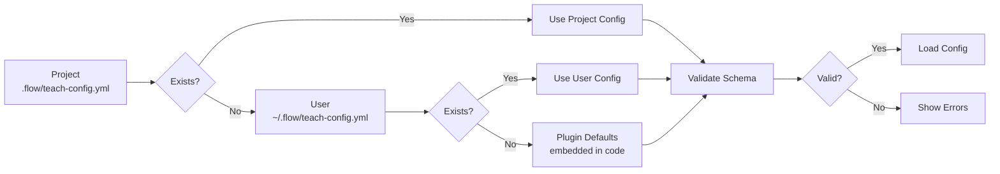

# teach-config.yml Schema Reference

> Complete field reference for teaching project configuration.
>
> **Version:** v6.1.0+ | **Location:** `.flow/teach-config.yml`

## Overview

The `teach-config.yml` file is the central configuration for teaching projects. It defines course metadata, semester schedules, Scholar plugin integration, and learning design parameters. This file is created by `teach init` and validated by all teach commands.

**Key Features:**

- **3-tier resolution:** Project (.flow/) → User (~/.flow/) → Plugin defaults
- **Schema validation:** Automatic validation via `_teach_validate_config()`
- **Hash-based change detection:** Only reloads when file changes
- **Scholar integration:** Seamless configuration sharing with Scholar plugin
- **Backward design support:** Maps to learning outcomes, assessments, and activities

## Config Resolution Chain



**Resolution Order:**

1. **Project config** (`.flow/teach-config.yml`) - Highest priority, project-specific
2. **User config** (`~/.flow/teach-config.yml`) - Personal defaults across all projects
3. **Plugin defaults** - Embedded fallbacks in `teach-dispatcher.zsh`

**Access via API:**

```bash
course_name=$(_teach_config_get "course.name" "Unknown Course")
level=$(_teach_config_get "scholar.course_info.level" "undergraduate")
```

---

## Top-Level Keys

### `course` (required)

Core course identification and metadata.

| Field | Type | Required | Default | Description | Validation Rules |
|-------|------|----------|---------|-------------|------------------|
| `name` | string | ✅ Yes | — | Course code (e.g., "STAT-101") | Must be non-empty |
| `full_name` | string | No | — | Full course title | — |
| `semester` | enum | No | — | Academic term | Spring, Summer, Fall, Winter |
| `year` | integer | No | — | Academic year | 2020-2100 |
| `credits` | integer | No | — | Credit hours | — |
| `instructor` | string | No | — | Instructor name | — |
| `department` | string | No | — | Department name | — |
| `university` | string | No | — | Institution name | — |
| `description` | string | No | — | Course description | — |

**Example:**

```yaml
course:
  name: 'STAT-101'
  full_name: 'STAT 101 - Introduction to Statistics'
  semester: 'Fall'
  year: 2026
  credits: 3
  instructor: 'Dr. Jane Smith'
  description: 'A first course in statistics covering descriptive statistics, probability, and inference.'
```

---

### `locations` (required)

File paths for course materials (relative to project root).

| Field | Type | Required | Default | Description | Validation Rules |
|-------|------|----------|---------|-------------|------------------|
| `lectures` | string | ✅ Yes | `lectures` | Lecture notes directory | — |
| `concepts` | string | No | `.teach/concepts.json` | Concept graph file | — |
| `slides_output` | string | No | `_site/slides` | Rendered slides output | — |
| `labs` | string | No | `labs` | Lab materials directory | — |
| `homework` | string | No | `homework` | Homework assignments | — |

**Example:**

```yaml
locations:
  lectures: 'lectures'
  concepts: '.teach/concepts.json'
  slides_output: '_site/slides'
  labs: 'labs'
  homework: 'assignments'
```

---

### `settings` (optional)

Plugin behavior and feature flags.

| Field | Type | Required | Default | Description | Validation Rules |
|-------|------|----------|---------|-------------|------------------|
| `default_style` | enum | No | `conceptual` | Default content style | conceptual, computational, rigorous, applied |
| `enable_ai_analysis` | boolean | No | `true` | Enable `teach analyze` | — |
| `cache_enabled` | boolean | No | `true` | Cache analysis results | — |
| `auto_stage` | boolean | No | `false` | Auto-stage generated files | — |
| `verbose` | boolean | No | `false` | Verbose logging | — |

**Example:**

```yaml
settings:
  default_style: 'conceptual'
  enable_ai_analysis: true
  cache_enabled: true
  auto_stage: false
```

---

### `scholar` (optional)

Scholar plugin integration configuration. This section is **owned by Scholar** and read-only for flow-cli.

| Field | Type | Required | Default | Description | Validation Rules |
|-------|------|----------|---------|-------------|------------------|
| `course_info.level` | enum | No | `undergraduate` | Course level | undergraduate, graduate, both |
| `course_info.difficulty` | enum | No | `intermediate` | Difficulty level | beginner, intermediate, advanced |
| `style.tone` | enum | No | `conversational` | Content tone | formal, conversational |
| `latex_macros.enabled` | boolean | No | `false` | Enable LaTeX macro injection | — |
| `latex_macros.sources` | array | No | `[]` | Macro source files | See below |
| `latex_macros.auto_discover` | boolean | No | `false` | Auto-find macro files | — |
| `grading.*` | integer | No | — | Grading percentages | Must sum to ~100% (95-105) |

**LaTeX Macros Source Schema:**

| Field | Type | Required | Description | Validation |
|-------|------|----------|-------------|------------|
| `path` | string | ✅ Yes | File path (relative to project root) | Must be non-empty |
| `format` | enum | ✅ Yes | File format | qmd, mathjax, latex |

**Example:**

```yaml
scholar:
  course_info:
    level: 'undergraduate'
    difficulty: 'intermediate'

  style:
    tone: 'conversational'

  latex_macros:
    enabled: true
    sources:
      - path: "_macros.qmd"
        format: "qmd"
      - path: "macros.tex"
        format: "latex"
    auto_discover: false
    validation:
      warn_undefined: true
      warn_unused: false
      warn_conflicts: true
    export:
      format: "json"
      include_in_prompts: true

  grading:
    homework: 30
    midterm: 20
    project: 25
    final_exam: 25
```

---

### `semester_info` (required for dates)

Academic calendar configuration for date calculations.

| Field | Type | Required | Default | Description | Validation Rules |
|-------|------|----------|---------|-------------|------------------|
| `start_date` | string | ✅ Yes* | — | Semester start | YYYY-MM-DD format |
| `end_date` | string | ✅ Yes* | — | Semester end | YYYY-MM-DD format |
| `break_weeks` | array | No | `[]` | Week numbers with breaks | Integers 1-52 |
| `holidays` | array | No | `[]` | Holiday definitions | See below |
| `deadlines` | object | No | `{}` | Assignment deadlines | See below |
| `exams` | array | No | `[]` | Exam schedule | See below |
| `weeks` | array | No | `[]` | **Legacy:** Use lesson-plans.yml | See below |

\* Required if using `teach dates` commands

**Holiday Schema:**

| Field | Type | Required | Description | Validation |
|-------|------|----------|-------------|------------|
| `name` | string | ✅ Yes | Holiday name | — |
| `date` | string | ✅ Yes | Holiday date | YYYY-MM-DD |
| `type` | enum | No | Type of holiday | break, holiday, no_class |

**Deadline Schema (oneOf constraint):**

Must provide **either** `due_date` **OR** both `week` and `offset_days`:

| Field | Type | Required | Description | Validation |
|-------|------|----------|-------------|------------|
| `due_date` | string | Option A | Absolute date | YYYY-MM-DD |
| `week` | integer | Option B | Week number | 1-52 |
| `offset_days` | integer | Option B | Days from week start | Any integer (can be negative) |

**Exam Schema:**

| Field | Type | Required | Description | Validation |
|-------|------|----------|-------------|------------|
| `name` | string | ✅ Yes | Exam name | — |
| `date` | string | ✅ Yes | Exam date | YYYY-MM-DD |
| `type` | string | No | Exam type | — |
| `weight` | integer | No | Percentage of grade | — |

**Example:**

```yaml
semester_info:
  start_date: '2026-08-26'
  end_date: '2026-12-15'
  break_weeks: [10]  # Thanksgiving

  holidays:
    - name: 'Labor Day'
      date: '2026-09-07'
      type: 'holiday'

    - name: 'Thanksgiving Break'
      date: '2026-11-26'
      type: 'break'

  deadlines:
    homework1:
      due_date: '2026-09-15'

    homework2:
      week: 5
      offset_days: 3  # Due Friday of week 5

  exams:
    - name: 'Midterm'
      date: '2026-10-15'
      weight: 20

    - name: 'Final'
      date: '2026-12-10'
      weight: 30
```

---

### `weeks[]` (nested under `semester_info`) - LEGACY

**⚠️ DEPRECATED:** As of v6.1.0, lesson plan data should be stored in `.flow/lesson-plans.yml` instead of embedded in `teach-config.yml`. Use `teach migrate-config` to extract.

| Field | Type | Required | Description | Validation |
|-------|------|----------|-------------|------------|
| `number` | integer | ✅ Yes | Week number | 1-52 |
| `topic` | string | ✅ Yes | Week topic | — |
| `style` | enum | No | Content style | conceptual, computational, rigorous, applied |
| `date` | string | No | Week start date | YYYY-MM-DD (deprecated, use `start_date`) |
| `start_date` | string | No | Week start date | YYYY-MM-DD |
| `objectives` | array | No | Learning objectives | — |
| `subtopics` | array | No | Subtopic list | — |
| `key_concepts` | array | No | Concept IDs | — |
| `prerequisites` | array | No | Prerequisite strings | — |

**Migration:**

```bash
# Extract weeks from teach-config.yml → lesson-plans.yml
teach migrate-config

# Review extracted plans
teach plan list
```

---

## lesson-plans.yml Schema

Separated lesson plan file for cleaner organization (v6.1.0+).

**Location:** `.flow/lesson-plans.yml`

### Top-Level Structure

```yaml
weeks:
  - number: 1
    topic: "..."
    # ... week fields ...
  - number: 2
    topic: "..."
    # ...
```

### Per-Week Fields

| Field | Type | Required | Default | Description | Validation |
|-------|------|----------|---------|-------------|------------|
| `number` | integer | ✅ Yes | — | Week number | 1-20 |
| `topic` | string | ✅ Yes | — | Week topic | — |
| `style` | enum | No | `conceptual` | Content style | conceptual, computational, rigorous, applied |
| `date` | string | No | Auto-calculated | Week start date | YYYY-MM-DD |
| `duration` | string | No | — | Class duration | e.g., "75 minutes" |
| `objectives` | array | No | `[]` | Learning objectives | Strings |
| `subtopics` | array | No | `[]` | Subtopic list | Strings |
| `key_concepts` | array | No | `[]` | Concept IDs | Strings |
| `prerequisites` | array | No | `[]` | Prerequisites | Strings (e.g., "Week 1: Intro") |
| `activities` | array | No | `[]` | In-class activities | See below |
| `assessments` | array | No | `[]` | Assessment items | See below |
| `materials` | array | No | `[]` | Required materials | Strings |

**Activity Schema:**

| Field | Type | Required | Description |
|-------|------|----------|-------------|
| `type` | string | ✅ Yes | Activity type (lecture, demo, lab, discussion, etc.) |
| `duration` | string | No | Time allocation (e.g., "20 min") |
| `description` | string | ✅ Yes | Activity description |

**Assessment Schema:**

| Field | Type | Required | Description |
|-------|------|----------|-------------|
| `type` | string | ✅ Yes | Assessment type (quiz, homework, project, etc.) |
| `description` | string | ✅ Yes | What is being assessed |

**Example:**

```yaml
weeks:
  - number: 1
    topic: "Introduction to Statistics"
    style: "conceptual"
    date: "2026-08-26"
    duration: "75 minutes"

    objectives:
      - "Define and calculate descriptive statistics"
      - "Distinguish between data types"

    subtopics:
      - "Measures of central tendency"
      - "Categorical vs numerical data"

    key_concepts:
      - "descriptive-stats"
      - "data-types"

    prerequisites: []

    activities:
      - type: "lecture"
        duration: "30 min"
        description: "Introduction to statistical thinking"

      - type: "demo"
        duration: "15 min"
        description: "R demonstration of summary statistics"

      - type: "practice"
        duration: "20 min"
        description: "Small group exercise: Calculate by hand"

    assessments:
      - type: "formative"
        description: "In-class polling questions"

      - type: "homework"
        description: "Practice problems on descriptive statistics"

    materials:
      - "Lecture slides"
      - "R script for demonstrations"
      - "Dataset: student_survey.csv"
```

---

## Full Annotated Example

Complete STAT-101 configuration with inline comments.

```yaml
# =============================================================================
# COURSE IDENTIFICATION
# =============================================================================

course:
  name: 'STAT-101'                      # Course code (REQUIRED)
  full_name: 'STAT 101 - Introduction to Statistics'
  semester: 'Fall'                      # Spring, Summer, Fall, Winter
  year: 2026                            # 2020-2100
  credits: 3
  instructor: 'Dr. Test Instructor'
  department: 'Statistics'
  university: 'State University'
  description: 'A first course in statistics covering descriptive statistics, probability, and inference.'

# =============================================================================
# FILE LOCATIONS (relative to project root)
# =============================================================================

locations:
  lectures: 'lectures'                  # Lecture notes directory
  concepts: '.teach/concepts.json'      # Concept graph (teach analyze)
  slides_output: '_site/slides'         # Quarto render output
  labs: 'labs'
  homework: 'assignments'

# =============================================================================
# PLUGIN SETTINGS
# =============================================================================

settings:
  default_style: 'conceptual'           # Default for teach commands
  enable_ai_analysis: true              # Enable teach analyze
  cache_enabled: true                   # Cache analysis results
  auto_stage: false                     # Auto-stage generated files
  verbose: false                        # Verbose logging

# =============================================================================
# SCHOLAR PLUGIN INTEGRATION (owned by Scholar, read-only for flow-cli)
# =============================================================================

scholar:
  # Course metadata
  course_info:
    level: 'undergraduate'              # undergraduate, graduate, both
    difficulty: 'intermediate'          # beginner, intermediate, advanced

  # Content style
  style:
    tone: 'conversational'              # formal, conversational

  # LaTeX macro injection (for consistent notation in AI-generated content)
  latex_macros:
    enabled: true                       # Enable macro system
    sources:
      - path: "_macros.qmd"             # Macro file path
        format: "qmd"                   # qmd, mathjax, latex
    auto_discover: false                # Auto-find macro files
    validation:
      warn_undefined: true              # Warn on undefined macros
      warn_unused: false
      warn_conflicts: true
    export:
      format: "json"                    # Export format (qmd, json, latex)
      include_in_prompts: true          # Inject into Scholar prompts

  # Grading schema (must sum to ~100%)
  grading:
    homework: 30
    midterm: 20
    project: 25
    final_exam: 25

# =============================================================================
# ACADEMIC CALENDAR (required for teach dates commands)
# =============================================================================

semester_info:
  start_date: '2026-08-26'              # YYYY-MM-DD (REQUIRED)
  end_date: '2026-12-15'                # YYYY-MM-DD (REQUIRED)
  break_weeks: [10]                     # Week numbers (Thanksgiving)

  # Holidays
  holidays:
    - name: 'Labor Day'
      date: '2026-09-07'
      type: 'holiday'                   # break, holiday, no_class

    - name: 'Thanksgiving Break'
      date: '2026-11-26'
      type: 'break'

  # Assignment deadlines (absolute OR relative)
  deadlines:
    homework1:
      due_date: '2026-09-15'            # Option A: Absolute date

    homework2:
      week: 5                           # Option B: Relative to week start
      offset_days: 3                    # Friday of week 5

  # Exam schedule
  exams:
    - name: 'Midterm'
      date: '2026-10-15'
      type: 'in-class'
      weight: 20

    - name: 'Final'
      date: '2026-12-10'
      type: 'cumulative'
      weight: 30

  # LEGACY: Embedded weeks (use lesson-plans.yml instead)
  # Uncomment for backward compatibility
  # weeks:
  #   - number: 1
  #     topic: 'Introduction'
  #     style: 'conceptual'
  #     date: '2026-08-26'
```

---

## Validation Rules

The `_teach_validate_config()` function enforces these rules:

### Required Fields

- `course.name` - Must be non-empty

### Enum Validation

| Field | Valid Values |
|-------|--------------|
| `course.semester` | Spring, Summer, Fall, Winter |
| `scholar.course_info.level` | undergraduate, graduate, both |
| `scholar.course_info.difficulty` | beginner, intermediate, advanced |
| `scholar.style.tone` | formal, conversational |
| `settings.default_style` | conceptual, computational, rigorous, applied |
| `scholar.latex_macros.sources[].format` | qmd, mathjax, latex |
| `scholar.latex_macros.export.format` | qmd, mathjax, latex, json |
| `semester_info.holidays[].type` | break, holiday, no_class |

### Range Validation

| Field | Range |
|-------|-------|
| `course.year` | 2020-2100 |
| `semester_info.weeks[].number` | 1-52 |
| `lesson-plans.yml weeks[].number` | 1-20 |

### Date Format

All date fields must use `YYYY-MM-DD` format:

- `semester_info.start_date`
- `semester_info.end_date`
- `semester_info.holidays[].date`
- `semester_info.deadlines[].due_date`
- `semester_info.exams[].date`
- `semester_info.weeks[].date` (legacy)
- `semester_info.weeks[].start_date` (legacy)

### Grading Validation

If `scholar.grading` is present and complete, percentages must sum to ~100% (95-105% tolerance).

### Boolean Validation

These fields must be `true` or `false` (not strings):

- `settings.enable_ai_analysis`
- `settings.cache_enabled`
- `settings.auto_stage`
- `settings.verbose`
- `scholar.latex_macros.enabled`
- `scholar.latex_macros.auto_discover`
- `scholar.latex_macros.validation.warn_undefined`
- `scholar.latex_macros.validation.warn_unused`
- `scholar.latex_macros.validation.warn_conflicts`
- `scholar.latex_macros.export.include_in_prompts`

### Deadline Constraint (oneOf)

Each deadline must have **either**:

- `due_date` (absolute date), **OR**
- Both `week` and `offset_days` (relative date)

Cannot have both absolute and relative dates simultaneously.

---

## API Functions

### Reading Config

```bash
# Get a config value (with default fallback)
_teach_config_get "course.name" "Unknown Course"
_teach_config_get "scholar.style.tone" "conversational" ".flow/teach-config.yml"

# Check if Scholar section exists
if _teach_has_scholar_config; then
    echo "Scholar integration available"
fi

# Find config by searching up directory tree
config_path=$(_teach_find_config)
```

### Validation

```bash
# Validate config (with output)
_teach_validate_config ".flow/teach-config.yml"

# Validate quietly (for scripts)
if _teach_validate_config "" --quiet; then
    echo "Config is valid"
fi
```

### Change Detection

```bash
# Check if config changed (hash-based)
if _flow_config_changed ".flow/teach-config.yml"; then
    echo "Config changed, reloading..."
fi

# Compute hash manually
hash=$(_flow_config_hash ".flow/teach-config.yml")

# Force cache invalidation
_flow_config_invalidate
```

### Display

```bash
# Show formatted config summary (for dashboards)
_teach_config_summary                    # Auto-detect
_teach_config_summary ".flow/teach-config.yml"
```

---

## See Also

### Configuration Management

- [Lesson Plan Quick Reference](REFCARD-TEACH-PLAN.md) - `teach plan` command reference
- [Template Management](REFCARD-TEMPLATES.md) - `teach templates` reference
- [Migration Guide](../tutorials/25-lesson-plan-migration.md) - Extracting embedded weeks

### API Documentation

- [Master API Reference](MASTER-API-REFERENCE.md) - Full function signatures
- [Dispatcher Guide](MASTER-DISPATCHER-GUIDE.md) - Complete `teach` command reference

---

**Last Updated:** 2026-02-02
**Version:** v6.1.0
