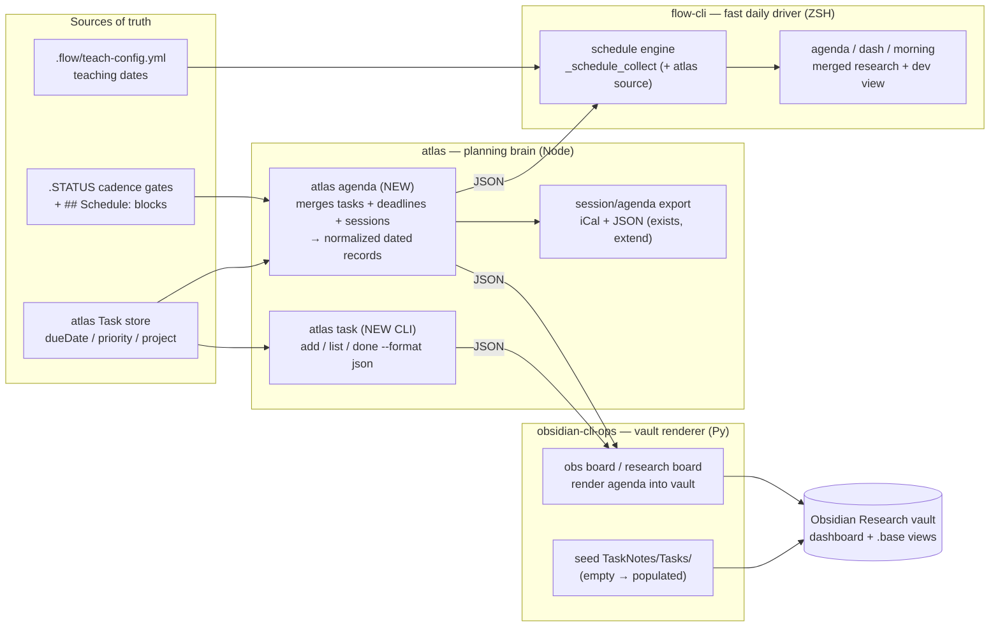

# BRAINSTORM — flow-cli ⇄ atlas ⇄ obsidian-cli-ops: Daily-Planning Coordination

**Date:** 2026-07-01 · **Depth:** deep · **Focus:** architecture / ops
**Decisions locked (via brainstorm grill):** planning brain = **atlas**; sequencing = **both tracks in parallel**; canonical task/deadline store = **atlas `Task` entity**; deliverable = **proposal + SPEC + `--orch` handoff**.

---

## Context — why this, why now

Three tools already touch daily planning, but each is blind to part of the picture:

- **flow-cli v7.13.0** has a mature schedule engine (`lib/schedule.zsh`, shipped v7.10.0) that renders a forward-looking `agenda`. It reads *only* `.STATUS ## Schedule:` blocks + `teach-config.yml`. It is **blind to atlas's `Task.dueDate`** and has **no `obs` bridge**.
- **atlas v0.12.2** owns the richest task model — `Task.js` already has `dueDate` / `isOverdue` / `isDueSoon`, plus `atlas plan` (morning ritual) and iCal/JSON export — but exposes **no `atlas task` CLI and no agenda aggregator**.
- **obsidian-cli-ops v4.3.0** already consumes `atlas project list --format json` to render vault boards (`obs board`, `obs research board`; PRs #80–82 automated this) — but has **no task-by-due-date query** and the vault's **task/daily layer is empty** (TaskNotes installed, `TaskNotes/Tasks/` empty; kanban/agenda/calendar `.base` views unused).

**The gap:** there is no single daily agenda that merges *research deadlines* (atlas tasks / `.STATUS` cadence gates) with *dev schedule* (flow-cli), and no populated task store the vault can render. atlas has the data model; flow-cli has the fast surface; obs has the vault renderer. They just aren't wired end-to-end.

**Intended outcome:** atlas becomes the planning brain (canonical tasks + a daily-agenda aggregator with JSON/iCal output); flow-cli becomes the <10ms daily driver that *displays* that agenda merged with its existing schedule sources; obs renders the same agenda into the vault and seeds the empty TaskNotes store. Meanwhile flow-cli's planning-command internals get de-duplicated so the new surface is built on a clean base.

---

## Target architecture

**Contract principle (reuse the existing pattern):** flow-cli already models "atlas commands that don't exist yet" as *proposed contract* entries (`schedule push` is capability-probed via `_FLOW_ATLAS_HAS_SCHEDULE`, ships a silent no-op until atlas implements it). The new `atlas task list` / `atlas agenda` follow the same discipline — flow-cli codes against the proposed contract in `docs/ATLAS-CONTRACT.md`, degrades gracefully when absent, and lights up when atlas ships it.

---

## Work, by track (parallel)

### Track A — flow-cli internal refactor *(no cross-repo dependency; ship first & independently)*

The planning commands carry duplication that makes any new feature fragile:

| Debt | Where | Fix |
|---|---|---|
| `.STATUS` field parsing reimplemented 4+ ways | `dash.zsh:1325`, `atlas-bridge.zsh:836`, inline `grep` in `morning.zsh:84`, `adhd.zsh:104`, `capture.zsh:406` | one `_flow_status_field <root> <field>` accessor in `lib/core.zsh` |
| **Latent bug**: `$path` vs `project_path` | `morning.zsh:83`, `adhd.zsh:103` read `$path` (ZSH's PATH array); fallback emits `project_path=` (`atlas-bridge.zsh:397`) | use `project_path`; focus/progress/icon lookups there are currently silently broken |
| Two divergent project-path resolvers | `_dash_find_project_path` (`dash.zsh:1284`) vs `_flow_get_project_fallback` (`atlas-bridge.zsh:370`) | single resolver covering apps + quarto/manuscripts + presentations |
| "Suggest a project" reimplemented 5× | `dash.zsh:181`, `:1139`, `morning.zsh:144`, `adhd.zsh` (`next`), `js` | one `_flow_suggest_project` |
| Today-stats recomputed twice | `_dash_header` (`dash.zsh:98`), `_dash_right_now` (`:181`) | shared helper |
| `agenda` pipeline inlined, diverges from shared surfaces | `agenda.zsh:62` vs `_schedule_window_records` (`schedule.zsh:549`) | route `agenda` through the shared engine |

### Track B — atlas planning brain *(atlas repo; critical path for coordination)*

1. **`atlas task` CLI** — promote the existing `Task` entity to a first-class command: `add`, `list`, `done`, `rm`, with `--format json`, `--due`, `--priority`, `--project`, `--overdue`. The data model (`dueDate`/`isOverdue`/`isDueSoon`) already exists.
2. **`atlas agenda [today|week|--all]`** — the aggregator: merge open tasks (by `dueDate`), project deadlines (parsed from `.STATUS` cadence gates in the research registry), and active sessions into a **normalized dated record set** matching flow-cli's existing `date|label|type|project|recurrence|source` shape (so flow-cli ingests it without translation).
3. **Wire into `atlas plan`** (morning ritual already exists) and **extend iCal export** (`session export` → `agenda export --format ics`).

### Track C — flow-cli consumes the atlas agenda *(depends on B's contract; can start against proposed contract)*

1. Add `_schedule_atlas_items` as a new source inside `_schedule_collect` (`schedule.zsh:378`) — capability-probed via the existing `_flow_atlas_json` helper; emits the same normalized records; **graceful no-op when atlas/agenda absent** (mirrors `_FLOW_ATLAS_HAS_SCHEDULE`).
2. `agenda` / `dash` UPCOMING / `morning` now show **research deadlines + dev schedule in one view**.
3. Extend `docs/ATLAS-CONTRACT.md` — add `atlas task list --format json` and `atlas agenda --format json` (proposed → pinned once atlas ships), with contract tests (`tests/test-atlas-contract.zsh`).

### Track D — obs renders + seeds the vault *(depends on B; obs already speaks atlas JSON)*

1. Extend `obs board` / `obs research board` to render the **daily agenda + tasks** (not just project registry state) into the marker-bounded vault board.
2. **Seed `TaskNotes/Tasks/`** from `atlas task list --format json` — populate the empty store so the installed kanban/agenda/calendar `.base` views finally have data (this is the vault's missing daily/calendar layer).
3. Reconcile with the existing `PROPOSAL-unified-research-board.md` (four overlapping boards → one).

---

## Quick Wins (< 30 min each)
1. **Fix the `$path` bug** (`morning.zsh:83`, `adhd.zsh:103`) — one-word change each, restores broken focus/progress display. *(Track A)*
2. **Mark `SPEC-agenda-schedule-2026-06-13.md` implemented** — stale draft for a shipped feature. *(hygiene)*
3. **Draft the two proposed ATLAS-CONTRACT entries** (`atlas task list`, `atlas agenda`) so Tracks C/D can code against them immediately. *(Track C prep)*

## Medium Effort (1–2 hrs each)
- [ ] `_flow_status_field` accessor + migrate the 4 call sites *(Track A)*
- [ ] `_flow_suggest_project` + `_flow_resolve_project_path` unification *(Track A)*
- [ ] `_schedule_atlas_items` source wired into `_schedule_collect` against the proposed contract *(Track C)*
- [ ] `atlas task` CLI thin wrapper over existing `Task` entity *(Track B)*

## Long-term (multi-session)
- [ ] `atlas agenda` aggregator + iCal export *(Track B)*
- [ ] obs agenda rendering + TaskNotes seeding *(Track D)*
- [ ] Board consolidation per `PROPOSAL-unified-research-board.md` *(Track D)*

## Recommended Next Step
→ **Ship Track A first** (pure flow-cli, no cross-repo dependency, includes the confirmed bug fix), *in parallel with* drafting the Track B `atlas task`/`atlas agenda` contract. Track A gives immediate value and a clean base; the contract unblocks C and D. This is exactly what the SPEC + `--orch` handoff sequences.

---

## Test-Plan Scaffold *(default-on; tiers inferred from change shape)*

flow-cli changes touch parsers/helpers **and** cross-command data flow with an external dependency (atlas) → tiers: `unit`, `integration`, `e2e`, `dogfood`, `dependency`.

| Tier | Coverage | Status |
|---|---|---|
| `unit` | `_flow_status_field`, `_flow_suggest_project`, `_flow_resolve_project_path`, `_schedule_atlas_items` record normalization | RED stub — `tests/test-schedule-atlas-source.zsh`, `tests/test-status-field-accessor.zsh` |
| `integration` | agenda pipeline merges `.STATUS` + teach + atlas sources without double-counting; `dash`/`morning`/`agenda` share one engine | RED stub — `tests/integration/agenda-merged-sources.zsh` |
| `dependency` | ATLAS-CONTRACT: `atlas task list`/`atlas agenda` JSON shape pinned; graceful no-op when absent | extend `tests/test-atlas-contract.zsh` |
| `e2e` | `agenda` renders merged view in a sandbox with a stub atlas returning tasks | RED stub — `tests/e2e-agenda-atlas.zsh` |
| `dogfood` | run `agenda` / `dash` against real repo; confirm research deadlines appear | manual, documented in PR |
| `count-cascade` | `N/A` — no new command/skill/agent (extends existing `agenda`) | — |

> Stubs land **red-first**; each carries `# TODO(author): delete if not contract-bearing` until confirmed.

## Documentation Scaffold *(default-on; doc-scorer ≥3)*

- [x] **Guide** — update `MASTER-DISPATCHER-GUIDE.md` + `AGENDA-SCHEDULE-GUIDE.md` (new atlas source, merged view)
- [x] **Refcard** — `docs/help/QUICK-REFERENCE.md` (agenda now spans research + dev)
- [x] **Contract** — `docs/ATLAS-CONTRACT.md` (new `atlas task`/`atlas agenda` entries) + bump version
- [x] **CHANGELOG** — `[Unreleased]` mirror (root + `docs/`)
- [ ] **Demo** — `N/A — score 2` (no new user-facing command surface)
- [ ] **Mermaid** — `[x]` included above (architecture diagram)

*(Auto-docs touch semantic docs only — version/count lines stay in `bump-version.sh`.)*

---

## Cross-repo note

Tracks B (atlas) and D (obs) live in sibling repos and need their own specs. The companion **`SPEC-planning-coordination-2026-07-01.md`** in this repo scopes Tracks A + C (what flow-cli owns) and documents B as a contract dependency. The `--orch` handoff (`/craft:orchestrate:plan`) can detect the cross-repo shape and fan out B/D specs.
