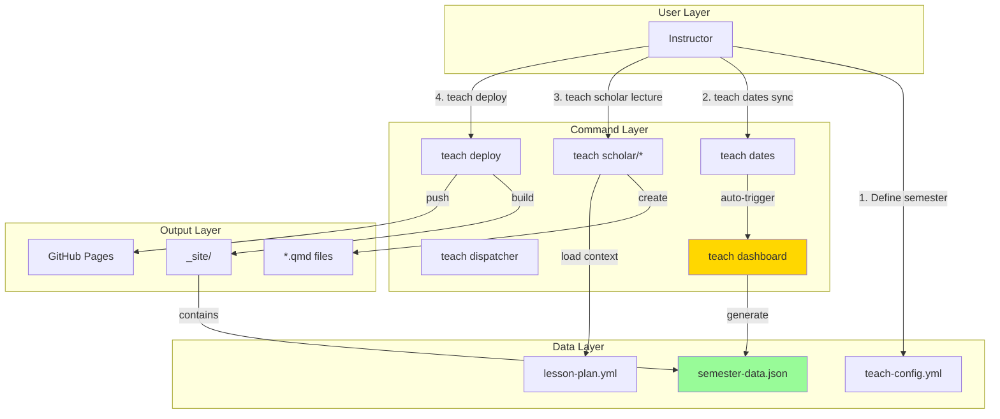

# Brainstorm: teach dashboard Integration & Architecture

**Created:** 2026-01-19
**Context:** Feature spec approved, exploring integration with existing teach workflow
**Related:** SPEC-teach-dashboard-2026-01-18.md
**Status:** Brainstorm → Will inform implementation

---

## Overview

Deep dive into how `teach dashboard` integrates with the existing teach dispatcher ecosystem, including teach dates, teach deploy, Scholar integration, and the broader teaching workflow.

---

## Architecture Layers



---

## Integration Points

### 1. teach dates Integration (Critical)

**Decision:** Dashboard auto-generates when dates sync

#### Implementation Options

**Option A: Direct Hook in teach-dates.zsh (Recommended)**
```zsh
# In _teach_dates_sync() after successful date updates
_teach_dates_sync() {
    # ... existing date sync logic ...

    if [[ $changes_made == true ]]; then
        _flow_log_success "Dates synced successfully"

        # Auto-generate dashboard if config exists
        if [[ -f ".flow/teach-config.yml" ]] && _teach_has_dashboard_config; then
            _flow_log_info "Regenerating dashboard..."
            _teach_dashboard_generate --quiet || {
                _flow_log_warn "Dashboard generation failed (non-fatal)"
            }
        fi
    fi
}
```

**Pros:**
- Automatic, user doesn't think about it
- Always in sync
- Simple implementation

**Cons:**
- Adds ~500ms to dates sync
- Hidden behavior (could surprise users)

**Option B: Explicit Flag**
```zsh
teach dates sync --regenerate-dashboard
```

**Pros:**
- Explicit control
- User knows what's happening

**Cons:**
- Cognitive overhead
- Easy to forget

**Recommendation:** Option A with informative logging

---

### 2. teach deploy Integration

**Question:** Should deploy verify dashboard is current?

#### Implementation Options

**Option A: Pre-deploy Check (Recommended)**
```zsh
_teach_deploy() {
    # ... existing checks ...

    # Check if dashboard is stale
    if _teach_dashboard_is_stale; then
        _flow_log_warn "Dashboard may be out of sync with config"
        _flow_log_info "Run: teach dashboard generate"

        if _flow_confirm "Regenerate dashboard before deploying?"; then
            _teach_dashboard_generate || return 1
        fi
    fi

    # ... proceed with deploy ...
}

_teach_dashboard_is_stale() {
    local config_mtime=$(stat -f %m .flow/teach-config.yml 2>/dev/null)
    local json_mtime=$(stat -f %m .flow/semester-data.json 2>/dev/null)

    [[ -z "$json_mtime" ]] && return 0  # JSON missing
    [[ $config_mtime -gt $json_mtime ]] && return 0  # Config newer
    return 1  # Dashboard current
}
```

**Pros:**
- Prevents deploying stale data
- Safety net for missed regeneration
- User can skip if intentional

**Cons:**
- Adds step to deploy
- Might be annoying if intentionally not using dashboard

**Option B: No Check, Trust Workflow**

**Pros:**
- Faster deploys
- Simpler code

**Cons:**
- Risk of stale dashboard on production

**Recommendation:** Option A with skip option (--skip-dashboard-check)

---

### 3. Scholar Integration

**Question:** Should Scholar commands be aware of dashboard?

#### Scenario: Creating Content

```bash
# User generates lecture
teach exam "Factorial Designs" --week 5

# Scholar creates:
# - lectures/week-05_factorial-designs.qmd
# - Uses lesson-plan.yml context
# - Updates teach-config.yml weeks[5].lecture.url?
```

#### Option A: Scholar Passive (Recommended for MVP)

Scholar creates content, dashboard reads config separately.

**Pros:**
- Loose coupling
- Scholar doesn't need dashboard knowledge
- Works with manual config updates

**Cons:**
- User must manually update teach-config.yml with URLs
- Two-step process

#### Option B: Scholar Active (Future Enhancement)

Scholar updates teach-config.yml when creating content.

```zsh
_teach_scholar_lecture() {
    # Generate lecture content
    local output_file=$(scholar_generate_lecture "$topic")

    # Update config with file location
    if [[ -n "$week" ]]; then
        yq -i ".semester_info.weeks[$((week-1))].lecture.url = \"$output_file\"" \
            .flow/teach-config.yml

        # Trigger dashboard regeneration
        _teach_dashboard_generate --quiet
    fi
}
```

**Pros:**
- Fully automated workflow
- Single command updates everything
- Less chance of config drift

**Cons:**
- Tight coupling
- Complex error handling
- What if Scholar fails?

**Recommendation:** Start with Option A, add Option B in v5.16.0

---

### 4. Quarto Integration

**Question:** How does Quarto copy JSON to _site/?

#### Option A: Quarto Resource (Recommended)

Add to `_quarto.yml`:
```yaml
project:
  resources:
    - .flow/semester-data.json
```

**Quarto behavior:**
- Copies file to `_site/.flow/semester-data.json` on render
- Preserves directory structure
- No custom script needed

**Client JS:**
```javascript
fetch('.flow/semester-data.json')
    .then(res => res.json())
    .then(data => updateDashboard(data));
```

**Pros:**
- Standard Quarto behavior
- No custom build step
- Works with quarto preview

**Cons:**
- `.flow/` in URL might be non-standard
- Possible path confusion

#### Option B: Custom Copy Script

```yaml
# _quarto.yml
project:
  pre-render: scripts/copy-dashboard-data.sh
```

```bash
# scripts/copy-dashboard-data.sh
#!/bin/bash
cp .flow/semester-data.json _site/data/semester-data.json
```

**Pros:**
- Control over destination path
- Can add processing/validation
- Clear intent

**Cons:**
- Extra script to maintain
- Runs every render (slower)

**Recommendation:** Option A for simplicity, document path in spec

---

## Data Flow Architecture

### Complete Workflow Sequence

```
┌─────────────────────────────────────────────────────────────┐
│ 1. SEMESTER SETUP                                           │
├─────────────────────────────────────────────────────────────┤
│ teach init "STAT 545"                                       │
│   └─> Creates .flow/teach-config.yml                       │
│   └─> Creates .flow/lesson-plan.yml                        │
│                                                             │
│ [Manual: Edit teach-config.yml with weeks, topics, dates]  │
└─────────────────────────────────────────────────────────────┘
                        │
                        ▼
┌─────────────────────────────────────────────────────────────┐
│ 2. DATE SYNCHRONIZATION                                     │
├─────────────────────────────────────────────────────────────┤
│ teach dates sync                                            │
│   ├─> Scans *.qmd files for date references                │
│   ├─> Updates dates in frontmatter + content               │
│   ├─> [HOOK] Auto-triggers teach dashboard generate        │
│   └─> Creates/updates .flow/semester-data.json             │
└─────────────────────────────────────────────────────────────┘
                        │
                        ▼
┌─────────────────────────────────────────────────────────────┐
│ 3. CONTENT GENERATION (Scholar)                             │
├─────────────────────────────────────────────────────────────┤
│ teach lecture "Factorial Designs" --week 5                  │
│   ├─> Loads lesson-plan.yml context                        │
│   ├─> Generates lectures/week-05_factorial.qmd             │
│   └─> [Future] Updates teach-config.yml with URL           │
│                                                             │
│ teach exam "Midterm 1" --weeks 1-5                          │
│   └─> Generates exams/midterm1.qmd                         │
└─────────────────────────────────────────────────────────────┘
                        │
                        ▼
┌─────────────────────────────────────────────────────────────┐
│ 4. ANNOUNCEMENTS (Ad-hoc)                                   │
├─────────────────────────────────────────────────────────────┤
│ teach dashboard announce "Exam Next Week" \                 │
│   --expires 2026-03-05 --type warning                       │
│   └─> Updates .flow/semester-data.json                     │
└─────────────────────────────────────────────────────────────┘
                        │
                        ▼
┌─────────────────────────────────────────────────────────────┐
│ 5. PREVIEW & VALIDATION                                     │
├─────────────────────────────────────────────────────────────┤
│ teach dashboard preview --week 5                            │
│   ├─> Reads .flow/semester-data.json                       │
│   ├─> Calculates what students will see                    │
│   └─> ASCII mockup of dashboard                            │
│                                                             │
│ teach status                                                │
│   └─> Shows dashboard status (last generated, issues)      │
└─────────────────────────────────────────────────────────────┘
                        │
                        ▼
┌─────────────────────────────────────────────────────────────┐
│ 6. DEPLOYMENT                                               │
├─────────────────────────────────────────────────────────────┤
│ teach deploy                                                │
│   ├─> [Pre-deploy check] Dashboard current?                │
│   ├─> Quarto render (copies JSON to _site/)                │
│   ├─> Git commit + push                                    │
│   └─> Creates PR to production                             │
└─────────────────────────────────────────────────────────────┘
                        │
                        ▼
┌─────────────────────────────────────────────────────────────┐
│ 7. CLIENT-SIDE RENDERING                                    │
├─────────────────────────────────────────────────────────────┤
│ Student visits homepage                                     │
│   ├─> Page loads index.html                                │
│   ├─> stat545.js fetches .flow/semester-data.json          │
│   ├─> Calculates current week (timezone-aware)             │
│   ├─> Filters active announcements                         │
│   ├─> Updates DOM with current week content                │
│   └─> Displays hero banner, cards, next up widget          │
└─────────────────────────────────────────────────────────────┘
```

---

## File Structure & Organization

### Project Tree

```
course-root/
├── .flow/
│   ├── teach-config.yml              # Source of truth
│   ├── semester-data.json            # Generated dashboard data ★ NEW
│   ├── lesson-plan.yml               # Scholar context
│   └── .validation-cache.json        # Config validation cache
│
├── lectures/
│   ├── week-01_intro.qmd
│   └── week-05_factorial.qmd
│
├── assignments/
│   ├── assignment1.qmd
│   └── assignment5.qmd
│
├── index.qmd                          # Homepage (dashboard container)
├── _quarto.yml                        # Project config
│
├── _site/                             # Generated output
│   ├── .flow/
│   │   └── semester-data.json        # Copied by Quarto
│   ├── index.html
│   └── lectures/
│
└── js/
    └── stat545.js                     # Dashboard renderer ★ NEW
```

### File Ownership

| File | Owner | Generated By | Modified By |
|------|-------|--------------|-------------|
| teach-config.yml | Instructor | teach init | Manual editing |
| semester-data.json | teach dashboard | teach dashboard generate | teach dashboard announce |
| lesson-plan.yml | Instructor | teach init | Manual editing |
| *.qmd | Instructor/Scholar | teach scholar/* | Manual editing |
| stat545.js | Developer | Manual | Manual |

---

## teach-dispatcher.zsh Integration

### Command Routing

```zsh
teach() {
    case "$1" in
        # Existing commands
        init|doctor|status|deploy)
            shift; _teach_"$1" "$@" ;;

        dates)
            shift; _teach_dates_dispatcher "$@" ;;

        # Scholar wrappers
        lecture|exam|quiz|assignment|syllabus|rubric|feedback|slides|notes)
            _teach_scholar_wrapper "$@" ;;

        # NEW: Dashboard subcommands
        dashboard)
            shift; _teach_dashboard_dispatcher "$@" ;;

        *)
            _teach_help ;;
    esac
}
```

### Dispatcher Implementation Location

**Option A: Inline in teach-dispatcher.zsh**
- Simple
- All teach code in one file
- File already 3161 lines (getting large)

**Option B: Separate file (Recommended)**
```
lib/dispatchers/teach-dashboard-impl.zsh
```

Load in teach-dispatcher.zsh:
```zsh
if [[ -z "$_FLOW_TEACH_DASHBOARD_LOADED" ]]; then
    local dashboard_path="${0:A:h}/teach-dashboard-impl.zsh"
    [[ -f "$dashboard_path" ]] && source "$dashboard_path"
    typeset -g _FLOW_TEACH_DASHBOARD_LOADED=1
fi
```

**Recommendation:** Option B, follows existing pattern (teach-doctor-impl.zsh)

---

## Configuration Schema Extensions

### Current Schema (v5.14.0)

```yaml
semester_info:
  start_date: "2026-01-19"
  end_date: "2026-05-16"
  weeks:
    - number: 1
      topic: "Introduction"
  breaks:
    - name: "Spring Break"
      start: "2026-03-15"
      end: "2026-03-22"
```

### Extended Schema (v5.15.0)

```yaml
semester_info:
  start_date: "2026-01-19"
  end_date: "2026-05-16"
  timezone: "America/Denver"        # NEW (optional, default: system)

  weeks:
    - number: 1
      topic: "Introduction to Experimental Design"
      focus: "Randomization, replication, blocking"  # NEW (optional)

      lecture:                      # NEW (optional)
        title: "Design Principles"
        url: "lectures/week-01_intro.qmd"

      lab:                          # NEW (optional)
        title: "Getting Started with R"
        url: "r_help.qmd"

      assignment:                   # NEW (optional)
        title: "Assignment 1"
        url: "assignments/assignment1.qmd"
        due: "2026-01-29"

      reading:                      # NEW (optional, for seminar courses)
        title: "Design of Experiments"
        author: "Montgomery"
        pages: "1-25"
        url: "readings/week01.qmd"

  breaks:
    - name: "Spring Break"
      start: "2026-03-15"
      end: "2026-03-22"
      show_next: true               # NEW (optional, default: true)

# NEW section
dashboard:
  # Structure options
  show_labs: true
  show_assignments: true
  show_readings: false

  # Display options
  card_style: "detailed"            # detailed|simple
  hero_style: "banner"              # banner|minimal

  # Feature toggles
  enable_announcements: true
  max_announcements: 5

  # Content
  fallback_message: "Check the Syllabus for current week information."

  announcements:                    # Optional, can also use CLI
    - id: "welcome-2026"
      type: "note"
      title: "Welcome!"
      date: "2026-01-13"
      content: "Review the syllabus..."
      link: "syllabus/syllabus-final.qmd"
      expires: "2026-01-26"
```

### Validation Rules

```zsh
# Required fields
- semester_info.start_date
- semester_info.weeks[] (at least 1)
- semester_info.weeks[].number
- semester_info.weeks[].topic

# Optional fields (with defaults)
- semester_info.timezone (default: system timezone)
- dashboard.* (all optional, sensible defaults)

# Validation logic
_teach_validate_dashboard_config() {
    # Check required fields exist
    yq -e '.semester_info.start_date' .flow/teach-config.yml >/dev/null || {
        _flow_log_error "Missing required field: semester_info.start_date"
        return 1
    }

    # Validate timezone if specified
    local tz=$(yq '.semester_info.timezone // ""' .flow/teach-config.yml)
    if [[ -n "$tz" ]]; then
        TZ="$tz" date >/dev/null 2>&1 || {
            _flow_log_warn "Invalid timezone: $tz (will use system default)"
        }
    fi

    # Validate max_announcements
    local max=$(yq '.dashboard.max_announcements // 5' .flow/teach-config.yml)
    if [[ $max -lt 1 || $max -gt 20 ]]; then
        _flow_log_warn "max_announcements out of range (1-20), using default: 5"
    fi

    return 0
}
```

---

## Error Handling & Edge Cases

### Common Failure Scenarios

#### 1. Config Missing or Invalid

```zsh
_teach_dashboard_generate() {
    # Check config exists
    if [[ ! -f ".flow/teach-config.yml" ]]; then
        _flow_log_error "teach-config.yml not found"
        _flow_log_info "Run: teach init"
        return 1
    fi

    # Validate config
    _teach_validate_dashboard_config || {
        _flow_log_error "Invalid config, cannot generate dashboard"
        return 1
    }

    # ... proceed with generation ...
}
```

#### 2. Timezone Calculation Failure

```zsh
_teach_calculate_current_week() {
    local start_date="$1"
    local timezone="${2:-America/Denver}"

    # Try with specified timezone
    local current_date
    if ! current_date=$(TZ="$timezone" date +%Y-%m-%d 2>/dev/null); then
        _flow_log_warn "Timezone error, using system timezone"
        current_date=$(date +%Y-%m-%d)
    fi

    # Calculate week number
    local days_since_start=$(( ($(date -j -f "%Y-%m-%d" "$current_date" +%s) - \
                                 $(date -j -f "%Y-%m-%d" "$start_date" +%s)) / 86400 ))
    local week_number=$(( days_since_start / 7 + 1 ))

    # Bounds check
    if [[ $week_number -lt 1 ]]; then
        echo "0"  # Before semester starts
    else
        echo "$week_number"
    fi
}
```

#### 3. Break Week Handling

```zsh
_teach_get_active_week_for_date() {
    local target_date="$1"
    local weeks_json="$2"
    local breaks_json="$3"

    # Check if date is within a break
    local in_break=$(echo "$breaks_json" | jq --arg date "$target_date" '
        map(select($date >= .start and $date <= .end)) | length > 0
    ')

    if [[ "$in_break" == "true" ]]; then
        # Check if break has show_next: true
        local show_next=$(echo "$breaks_json" | jq --arg date "$target_date" -r '
            map(select($date >= .start and $date <= .end))[0].show_next // true
        ')

        if [[ "$show_next" == "true" ]]; then
            # Show next week after break
            local break_end=$(echo "$breaks_json" | jq --arg date "$target_date" -r '
                map(select($date >= .start and $date <= .end))[0].end
            ')
            # Calculate week for day after break
            _teach_calculate_week_for_date "$(date -v+1d -j -f "%Y-%m-%d" "$break_end" +%Y-%m-%d)"
        else
            # Show message that course is on break
            echo "BREAK"
        fi
    else
        # Normal week calculation
        _teach_calculate_week_for_date "$target_date"
    fi
}
```

#### 4. JSON Generation Failure

```zsh
_teach_dashboard_generate() {
    # ... validation ...

    # Generate JSON with error handling
    local json_output
    json_output=$(_build_dashboard_json) || {
        _flow_log_error "JSON generation failed"
        return 1
    }

    # Validate JSON before writing
    if ! echo "$json_output" | jq . >/dev/null 2>&1; then
        _flow_log_error "Generated invalid JSON"
        _flow_log_debug "$json_output"
        return 1
    fi

    # Atomic write (write to temp, then move)
    local temp_file=".flow/.semester-data.json.tmp"
    echo "$json_output" > "$temp_file" || {
        _flow_log_error "Failed to write temp file"
        return 1
    }

    mv "$temp_file" ".flow/semester-data.json" || {
        _flow_log_error "Failed to move JSON to final location"
        rm -f "$temp_file"
        return 1
    }

    _flow_log_success "Generated: .flow/semester-data.json"
}
```

---

## Performance Considerations

### Generation Speed

**Target:** < 500ms for typical course (16 weeks, 5 announcements)

#### Optimization Strategies

**1. Lazy Loading**
```zsh
# Only load dashboard code if needed
if [[ "$1" == "dashboard" ]]; then
    source "${0:A:h}/teach-dashboard-impl.zsh"
fi
```

**2. Caching**
```zsh
# Cache parsed config (already exists via config-validator.zsh)
_TEACH_CONFIG_CACHE=""

_get_cached_config() {
    if [[ -z "$_TEACH_CONFIG_CACHE" ]]; then
        _TEACH_CONFIG_CACHE=$(cat .flow/teach-config.yml)
    fi
    echo "$_TEACH_CONFIG_CACHE"
}
```

**3. Minimize yq/jq Calls**
```zsh
# Bad: Multiple yq calls
weeks=$(yq '.semester_info.weeks' .flow/teach-config.yml)
start_date=$(yq '.semester_info.start_date' .flow/teach-config.yml)
timezone=$(yq '.semester_info.timezone' .flow/teach-config.yml)

# Good: Single yq call
config=$(yq -o=json '{
    weeks: .semester_info.weeks,
    start_date: .semester_info.start_date,
    timezone: .semester_info.timezone
}' .flow/teach-config.yml)

weeks=$(echo "$config" | jq -r '.weeks')
start_date=$(echo "$config" | jq -r '.start_date')
timezone=$(echo "$config" | jq -r '.timezone')
```

### JSON Size

**Typical Course:**
- 16 weeks × ~200 bytes = 3.2 KB
- 5 announcements × ~150 bytes = 750 bytes
- Metadata: ~500 bytes
- **Total: ~4.5 KB**

**Large Course:**
- 32 weeks × 200 bytes = 6.4 KB
- 10 announcements × 150 bytes = 1.5 KB
- **Total: ~8 KB**

**Recommendation:** No need for minification, sizes are trivial.

---

## Testing Strategy

### Unit Tests (test-teach-dashboard.zsh)

```bash
#!/usr/bin/env zsh

# Test 1: Generate with minimal config
test_generate_minimal() {
    setup_minimal_config
    teach dashboard generate
    assert_file_exists ".flow/semester-data.json"
    assert_json_valid ".flow/semester-data.json"
}

# Test 2: Generate with full config
test_generate_full() {
    setup_full_config
    teach dashboard generate
    local json=$(cat .flow/semester-data.json)
    assert_json_field_equals "$json" ".weeks | length" "16"
    assert_json_field_equals "$json" ".announcements | length" "3"
}

# Test 3: Preview current week
test_preview_current() {
    setup_config_with_current_week_5
    output=$(teach dashboard preview)
    assert_contains "$output" "Week 5"
    assert_contains "$output" "Factorial Designs"
}

# Test 4: Preview specific week
test_preview_week() {
    setup_full_config
    output=$(teach dashboard preview --week 8)
    assert_contains "$output" "Week 8"
    assert_not_contains "$output" "Week 5"
}

# Test 5: Break week shows next
test_break_week_show_next() {
    setup_config_with_break_week_3
    freeze_date "2026-02-02"  # During break
    output=$(teach dashboard preview)
    assert_contains "$output" "Week 4"  # Shows next week
    assert_contains "$output" "Spring Break"
}

# Test 6: Add announcement
test_add_announcement() {
    setup_full_config
    teach dashboard announce "Test" "Message" --expires 2026-12-31
    local json=$(cat .flow/semester-data.json)
    assert_json_field_contains "$json" ".announcements[].title" "Test"
}

# Test 7: Timezone handling
test_timezone_conversion() {
    setup_config_with_timezone "America/New_York"
    teach dashboard generate
    local json=$(cat .flow/semester-data.json)
    assert_json_field_equals "$json" ".timezone" "America/New_York"
}

# Test 8: Invalid config
test_invalid_config() {
    setup_invalid_config  # Missing start_date
    output=$(teach dashboard generate 2>&1)
    assert_exit_code 1
    assert_contains "$output" "Missing required field"
}

# Test 9: Config options respected
test_config_options_show_labs_false() {
    setup_config_with_show_labs_false
    teach dashboard generate
    output=$(teach dashboard preview --week 1)
    assert_not_contains "$output" "[LAB]"
}

# Test 10: Stale check
test_dashboard_stale_check() {
    setup_full_config
    teach dashboard generate
    sleep 1
    touch .flow/teach-config.yml  # Make config newer
    assert_true _teach_dashboard_is_stale
}
```

### Integration Tests

```bash
# Test: Full workflow
test_full_workflow() {
    # 1. Init course
    teach init "Test Course"

    # 2. Edit config (simulate)
    add_weeks_to_config

    # 3. Generate dashboard
    teach dashboard generate
    assert_file_exists ".flow/semester-data.json"

    # 4. Preview
    output=$(teach dashboard preview)
    assert_success

    # 5. Add announcement
    teach dashboard announce "Welcome" "Test message" --expires 2026-12-31

    # 6. Deploy (dry run)
    output=$(teach deploy --dry-run)
    assert_contains "$output" "Dashboard current"
}

# Test: dates sync integration
test_dates_sync_regenerates_dashboard() {
    setup_full_config
    teach dashboard generate
    local old_mtime=$(stat -f %m .flow/semester-data.json)

    sleep 1
    teach dates sync --force

    local new_mtime=$(stat -f %m .flow/semester-data.json)
    assert_not_equal "$old_mtime" "$new_mtime"
}
```

---

## Future Enhancements

### Phase 2 Features (v5.16.0+)

#### 1. Scholar Auto-Update
```bash
# When Scholar creates content, update config
teach lecture "Topic" --week 5
# Auto-adds lecture.url to teach-config.yml week 5
# Auto-regenerates dashboard
```

#### 2. Multi-Course Dashboard
```bash
# Support multiple courses in one repo
teach dashboard generate --course stat545
teach dashboard generate --course stat440
```

#### 3. Dashboard Analytics
```bash
# Track what students are viewing
teach dashboard analytics
# Shows: most viewed weeks, announcement click-through, etc.
```

#### 4. Custom Themes
```bash
# User-provided templates
teach dashboard generate --theme custom.json
```

#### 5. Announcement Templates
```bash
# Pre-defined announcement types
teach dashboard announce --template exam
# Fills in standard exam announcement
```

---

## Open Integration Questions

### 1. teach status Integration

**Should teach status show dashboard info?**

```bash
teach status

📊 Course Status
━━━━━━━━━━━━━━━━━━━━━━━━━━━━━━━━━━━━━━━━━━━━━━━━━━━━

Repository: Clean
Git Status: 3 files staged

Dashboard: ✅ Current (generated 2 hours ago)
  • Current Week: 5
  • Active Announcements: 2
  • Last Updated: 2026-01-19 14:30

Deployment: Last deployed 3 days ago
  • Open PRs: 1 (deploy-2026-01-16)
```

**Recommendation:** Yes, add dashboard section

---

### 2. Backup System Integration

**Should backups include semester-data.json?**

```bash
teach backup create
# Should this backup .flow/semester-data.json?
```

**Considerations:**
- JSON is generated, not source
- But contains announcements added via CLI
- Announcements might also be in teach-config.yml

**Recommendation:** Backup JSON, but mark as "derived" in backup manifest

---

### 3. Multi-Language Support

**Should dashboard support i18n?**

```yaml
dashboard:
  language: "en"  # en, es, fr
  labels:
    lecture: "Lecture"
    lab: "Lab"
    assignment: "Assignment"
```

**Recommendation:** Defer to v5.17.0, add when needed

---

## Summary & Recommendations

### Critical Decisions

| Integration Point | Decision | Priority |
|-------------------|----------|----------|
| **teach dates sync** | Auto-trigger dashboard generate | High |
| **teach deploy** | Pre-deploy staleness check | High |
| **Scholar** | Passive (no auto-update) | Medium |
| **Quarto** | Use project resources | High |
| **File location** | lib/dispatchers/teach-dashboard-impl.zsh | High |
| **teach status** | Add dashboard section | Low |
| **Backups** | Include JSON as derived | Low |

### Implementation Order

1. **Phase 1:** Core generation (standalone)
2. **Phase 2:** teach dates integration
3. **Phase 3:** teach deploy integration
4. **Phase 4:** teach status integration
5. **Future:** Scholar auto-update, multi-course

### Architecture Principles

✅ **Loose Coupling:** Dashboard reads config, doesn't modify it (initially)
✅ **Graceful Degradation:** Works without dashboard config section
✅ **Progressive Enhancement:** Start simple, add features incrementally
✅ **Fail-Safe:** Errors don't break teach workflow

---

## Next Actions

1. **Commit this brainstorm** to dev branch
2. **Update SPEC** with integration details
3. **Create feature branch** via worktree
4. **Begin Phase 1** implementation

---

**End of Brainstorm**
