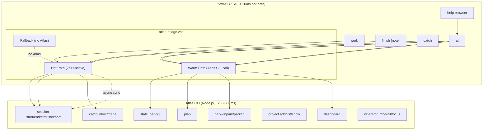

# SPEC: Atlas Integration Update

> **Status:** draft
> **Created:** 2026-02-22
> **From Brainstorm:** `BRAINSTORM-atlas-plugin-update-2026-02-22.md`
> **Version:** flow-cli v7.4.x + Atlas v0.9.x

---

## Overview

Enhance flow-cli's Atlas bridge layer to expose all major Atlas features (sessions, analytics, planning, context parking, dashboard), fix the help browser to list all 15 dispatchers + Atlas, establish a formal API contract between the two projects, and standardize Atlas help output to follow flow-cli conventions.

Currently flow-cli bridges only 6 of 30+ Atlas commands (27% coverage). The help browser lists only 8 of 15 dispatchers, hiding 7 from discoverability. There is no formal contract preventing integration breakage.

---

## Primary User Story

**As** a developer using both flow-cli and Atlas for ADHD-optimized workflow management,
**I want** all Atlas features accessible through the `at()` shortcut with consistent help formatting,
**So that** I can use `at stats`, `at plan`, `at park`, and `at dash` without switching to the raw Atlas CLI, and discover all commands through `flow help`.

### Acceptance Criteria

- [ ] All 15 dispatchers + `at` listed in help browser (`lib/help-browser.zsh`)
- [ ] Help preview regex updated to match all 16 entries
- [ ] Enhanced `at()` handles `help`, `stats`, `plan`, `park`, `unpark`, `parked`, `dash`, `focus`, `triage`
- [ ] `_at_help()` renders in flow-cli visual convention (box header, color scheme, sections)
- [ ] API contract documented in `docs/ATLAS-CONTRACT.md`
- [ ] Contract integration tests in `tests/test-atlas-contract.zsh`
- [ ] `flow doctor` shows enhanced Atlas status (version, backend, project count)
- [ ] Graceful degradation: all new bridge functions work when Atlas is not installed

---

## Secondary User Stories

**As** a flow-cli contributor,
**I want** a formal API contract between flow-cli and Atlas,
**So that** changes in Atlas don't silently break flow-cli integration.

**As** a developer exploring flow-cli,
**I want** all dispatchers visible in the help browser,
**So that** I discover `dots`, `sec`, `tok`, `teach`, `prompt`, `v`, `em`, and `at` naturally.

---

## Architecture



### Performance Model

| Path | Latency | Functions | Strategy |
|------|---------|-----------|----------|
| Hot | < 10ms | session start/end, catch, where, crumb | ZSH-native + async Atlas |
| Warm | < 500ms | stats, plan, park, dash, triage | Direct Atlas CLI call |
| Fallback | < 10ms | All bridge functions | ZSH-native without Atlas |

---

## API Design

### Enhanced `at()` Command Table

| Command | Atlas CLI | Fallback (no Atlas) | New? |
|---------|-----------|---------------------|------|
| `at help` | Show `_at_help()` | Show `_at_help()` | YES |
| `at stats [period]` | `atlas stats` | "Atlas required" | YES |
| `at plan` | `atlas plan` | "Atlas required" | YES |
| `at park [note]` | `atlas park` | "Atlas required" | YES |
| `at unpark [id]` | `atlas unpark` | "Atlas required" | YES |
| `at parked` | `atlas parked` | "Atlas required" | YES |
| `at dash` | `atlas dashboard` | "Atlas required" | YES |
| `at focus <p> [text]` | `atlas focus` | "Atlas required" | YES |
| `at triage` | `atlas inbox --triage` | "Atlas required" | YES |
| `at catch <text>` | `atlas catch` | ZSH fallback | existing |
| `at inbox` | `atlas inbox` | ZSH fallback | existing |
| `at where [p]` | `atlas where` | ZSH fallback | existing |
| `at crumb <text>` | `atlas crumb` | ZSH fallback | existing |
| `at *` | `atlas "$@"` | Error message | existing |

### API Contract (docs/ATLAS-CONTRACT.md)

```markdown
## Required Commands (flow-cli depends on these)

| Command | Exit Code | stdout Format |
|---------|-----------|---------------|
| `atlas session start <project>` | 0 | Human-readable session info |
| `atlas session end [note]` | 0 | Duration + celebration |
| `atlas project list --format=names` | 0 | One name per line (no JSON) |
| `atlas catch <text>` | 0 | Confirmation message |
| `atlas where [project]` | 0 | Context info |
| `atlas crumb <text>` | 0 | Confirmation |
| `atlas stats [period]` | 0 | Analytics table |
| `atlas plan` | 0 | Planning output |
| `atlas park [note]` | 0 | Confirmation |
| `atlas unpark [id]` | 0 | Restoration info |
| `atlas parked` | 0 | List of parked contexts |
| `atlas dashboard` | 0 | Launches TUI |
| `atlas -v` | 0 | Version string only |

## Output Formats
- `--format=names`: plain text, one per line (NOT JSON)
- `--format=json`: valid JSON object/array
- `--format=table`: human-readable table (default)
- `--format=shell`: shell-evaluable key=value pairs

## Breaking Change Policy
- Changing exit codes = breaking
- Changing --format=names output = breaking
- Adding new flags = non-breaking
- Adding new commands = non-breaking
```

---

## Data Models

N/A - No data model changes. Atlas owns its data storage (filesystem/SQLite). flow-cli only reads Atlas output via CLI.

---

## Dependencies

| Dependency | Type | Notes |
|-----------|------|-------|
| Atlas CLI v0.9.x | Optional runtime | Via `npm i -g @data-wise/atlas` or `npm link` |
| flow-cli core colors | Internal | `$_C_BOLD`, `$_C_CYAN`, etc. from `lib/core.zsh` |
| No new ZSH dependencies | - | Pure ZSH implementation |

---

## UI/UX Specifications

### Help Browser Update

**User Flow:**
1. User types `flow help` or triggers help browser
2. fzf shows ALL 16 entries (15 dispatchers + `at`)
3. User selects `at` → preview shows `_at_help()` output
4. User presses Enter → full Atlas help displayed

**Before (8 entries):**
```
g       Git workflows
cc      Claude Code launcher
wt      Worktree management
...
```

**After (16 entries):**
```
g       Git workflows
cc      Claude Code launcher
wt      Worktree management
mcp     MCP server management
r       R package development
qu      Quarto publishing
obs     Obsidian notes
tm      Terminal manager
dots    Dotfile management (chezmoi)
sec     Secret management (Keychain/Bitwarden)
tok     Token management (create/rotate/expire)
teach   Teaching workflow (analyze, deploy, exam)
prompt  Prompt engine switcher
v       Vibe coding mode
em      Email management (himalaya, 31 commands)
at      Atlas CLI (stats, plan, park, dash)
```

### `_at_help()` Output (flow-cli convention)

```
╭─────────────────────────────────────────────╮
│ at - Atlas Project Intelligence             │
╰─────────────────────────────────────────────╯

Usage: at [command] [args]

MOST COMMON (daily workflow):
  at stats           Session analytics
  at plan            Morning planning ritual
  at park "note"     Save context before switching
  at unpark          Restore parked context
  at dash            Launch TUI dashboard

QUICK EXAMPLES:
  $ at stats week        # Weekly session summary
  $ at plan              # Morning planning ritual
  $ at park "switching"  # Save context
  $ at dash              # Launch dashboard

SESSION:
  at session start <project>  Start session (usually via 'work')
  at session end [note]       End session (usually via 'finish')
  at session status           Current session info
  at session export           Export to iCal

CAPTURE:
  at catch "text"             Quick capture idea
  at inbox                    Show inbox
  at inbox --triage           Interactive triage

CONTEXT:
  at where                    Where was I?
  at crumb "text"             Leave breadcrumb
  at trail                    View breadcrumb trail
  at park [note]              Save context
  at unpark [id]              Restore context
  at parked                   List parked contexts

PROJECT:
  at project list             List all projects
  at project show <name>      Project details
  at focus <project> [text]   Get/set focus
  at status [project]         Get/set status

Atlas v0.9.0 | at = atlas shortcut
```

### Accessibility Checklist

- [x] All commands have help text (via `_at_help()`)
- [x] Color-blind safe (uses bold + symbols, not just color)
- [x] Keyboard navigable (fzf help browser)
- [x] Graceful degradation (fallback messages when Atlas missing)

---

## Open Questions

1. **Should `at` be added to ZSH completions?** — Currently `at()` has no tab completion. Adding `completions/_at` would improve discoverability.
2. **Should Atlas MCP server be integrated?** — Atlas has 10 MCP tools (`atlas_get_context`, `atlas_start_session`, `atlas_capture`, etc.) that could coordinate with Claude Code. Out of scope for this spec but worth a future spec.
3. **Atlas-side help standardization** — Should Atlas CLI also adopt flow-cli help conventions in its own `--help` output? The contract could include a help format spec so both CLIs feel consistent when used side-by-side. This spec covers the flow-cli wrapper (`_at_help()`); an Atlas-side spec would cover `atlas --help`, `atlas session --help`, etc.
4. **ADHD preferences bridge** — Atlas has rich ADHD preferences (`adhd.showStreak`, `adhd.showCelebrations`, etc.) via `atlas config prefs`. Should flow-cli read these preferences to align its own ADHD features (dopamine mode, win celebrations)?

---

## Review Checklist

- [ ] All 5 proposals reviewed (bridge, help, contract, doctor, help conventions)
- [ ] Performance model validated (hot/warm path boundaries)
- [ ] Fallback behavior tested (Atlas not installed scenario)
- [ ] Help browser shows all 16 entries
- [ ] Contract spec agreed by both projects
- [ ] Tests pass (`./tests/run-all.sh`)
- [ ] Documentation updated (QUICK-REFERENCE, MASTER-DISPATCHER-GUIDE)

---

## Implementation Notes

### File Changes

| File | Change Type | Description |
|------|-------------|-------------|
| `lib/atlas-bridge.zsh` | MODIFY | Add `_at_help()`, enhance `at()` with new subcommands |
| `lib/help-browser.zsh` | MODIFY | Add 7 missing dispatchers + `at`, fix regex |
| `commands/doctor.zsh` | MODIFY | Enhanced Atlas status display |
| `docs/ATLAS-CONTRACT.md` | CREATE | API contract specification |
| `tests/test-atlas-contract.zsh` | CREATE | Contract integration tests |
| `docs/reference/MASTER-DISPATCHER-GUIDE.md` | MODIFY | Add `at` section |
| `docs/help/QUICK-REFERENCE.md` | MODIFY | Add `at` commands |
| `completions/_at` | CREATE (optional) | ZSH tab completion for `at` |

### Implementation Order

1. Fix help browser (30 min) — immediate visibility win
2. Add `_at_help()` to atlas-bridge.zsh (1h) — flow-cli convention help
3. Enhance `at()` with new subcommands (1h) — stats, plan, park, dash
4. Write `docs/ATLAS-CONTRACT.md` (1h) — API contract
5. Write `tests/test-atlas-contract.zsh` (1h) — contract tests
6. Enhance `flow doctor` Atlas section (30 min)
7. Update reference docs (30 min)

**Total estimated effort:** ~6 hours across 2-3 sessions

### Key Constraints

- **No new dependencies** — pure ZSH for bridge layer
- **Atlas is optional** — every bridge function must have fallback
- **Sub-10ms for hot path** — session start/end, catch, crumb stay ZSH-native
- **< 500ms for warm path** — stats, plan, park OK to call Atlas CLI directly
- **flow-cli help conventions** — `_at_help()` must use box header, color scheme, sections

---

## History

| Date | Event |
|------|-------|
| 2026-02-22 | Initial spec from max brainstorm session |
| 2026-02-22 | Added Proposal 5: Atlas help standardization |
