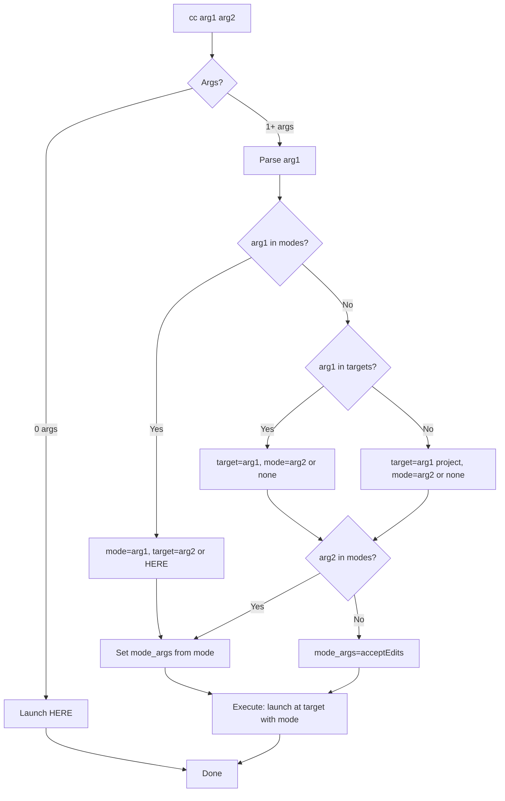

# SPEC: CC Unified Grammar

**Status:** Implemented
**Created:** 2026-01-02
**Released:** v4.8.0
**Target Version:** v4.8.0

---

## Overview

Add support for **both mode-first and target-first** command orders in the `cc` dispatcher, enabling users to write commands that read naturally (`cc flow opus`) while maintaining the unified pattern (`cc opus flow`). This spec implements **Option 3: Unified Grammar** from the brainstorm.

**Goal:** Support flexible command ordering without breaking existing workflows, optimizing for zero friction and consistency with flow-cli patterns.

---

## Primary User Story

**As a flow-cli user,**
**I want** to write `cc` commands in the order that feels natural to me,
**So that** I can launch Claude Code without thinking about syntax rules.

**Acceptance Criteria:**
1. ✅ `cc opus pick` works (mode-first, current behavior)
2. ✅ `cc pick opus` works (target-first, new behavior)
3. ✅ Both produce identical results
4. ✅ Zero breaking changes to existing workflows
5. ✅ `cc` (no args) still launches HERE instantly

---

## Secondary User Stories

### Story 2: Explicit HERE
**As a user concerned about launching in wrong directory,**
**I want** explicit syntax for "launch HERE",
**So that** my intent is clear in scripts/history.

**Solution:** Add `.` and `here` as target aliases
```bash
cc .                  # Explicit HERE
cc here               # Readable HERE
cc opus .             # Opus mode HERE
```

### Story 3: Reserved Keyword Handling
**As a user with a project named "opus",**
**I want** to access my project without conflict,
**So that** I can use `cc` with any project name.

**Solution:** Modes take precedence, use `pick` for projects
```bash
cc opus               # Mode (Opus HERE)
cc pick opus          # Project (jump to 'opus')
```

---

## Technical Requirements

### Architecture

#### Current State (v4.7.1)
```bash
cc [mode] [target]
  mode   = (empty) | yolo | plan | opus | haiku
  target = (empty) | pick | <project> | wt <branch>
```

**Parsing:** Mode-first only, positional

#### Proposed State (v4.8.0)
```bash
cc [mode|target] [target|mode]
  mode   = (empty) | yolo | y | plan | p | opus | o | haiku | h
  target = (empty) | . | here | pick | <project> | wt <branch>
```

**Parsing:** Detect mode vs target, accept either order

### Parsing Algorithm



### Grammar Specification

#### Reserved Keywords (Modes)
```
yolo, y       → --dangerously-skip-permissions
plan, p       → --permission-mode plan
opus, o       → --model opus --permission-mode acceptEdits
haiku, h      → --model haiku --permission-mode acceptEdits
```

#### Reserved Keywords (Targets)
```
(empty)       → HERE (current directory)
., here       → HERE (explicit)
pick          → Project picker (fzf)
wt, w         → Worktree (requires branch arg)
<string>      → Project name (via pick direct jump)
```

#### Precedence Rules
1. If arg1 is mode keyword → parse as mode-first
2. If arg1 is target keyword → parse as target-first
3. If arg1 is unknown → assume project name (target)
4. Modes take precedence in conflicts

### API Design

#### Function Signature
```bash
cc [mode|target] [target|mode] [args...]
```

#### Examples Table

| Command | Mode | Target | Result |
|---------|------|--------|--------|
| `cc` | none | HERE | Launch HERE, acceptEdits |
| `cc opus` | opus | HERE | Launch HERE, Opus model |
| `cc pick` | none | pick | Picker → launch acceptEdits |
| `cc opus pick` | opus | pick | Picker → launch Opus |
| `cc pick opus` | opus | pick | Picker → launch Opus |
| `cc flow` | none | flow | Jump to flow → launch |
| `cc opus flow` | opus | flow | Jump to flow → launch Opus |
| `cc flow opus` | opus | flow | Jump to flow → launch Opus |
| `cc .` | none | HERE | Launch HERE (explicit) |
| `cc here opus` | opus | HERE | Launch HERE, Opus |

---

## Data Models

N/A - No data model changes (pure shell logic)

---

## Dependencies

### Required
- ZSH 5.8+
- `pick` function (from flow-cli)
- Existing `cc` dispatcher base

### Optional
- None

---

## UI/UX Specifications

### User Flow

```
User types: cc flow opus

   ↓
Detect: arg1='flow' (not a mode, assume target)
        arg2='opus' (is a mode)

   ↓
Parse: target='flow', mode='opus'

   ↓
Execute: pick --no-claude "flow" && claude --model opus --permission-mode acceptEdits

   ↓
Result: Changed to flow-cli directory, launched Claude with Opus
```

### Help Text Updates

#### Before (v4.7.1)
```
🚀 LAUNCH MODES:
  cc opus pick          Pick project → Opus model
```

#### After (v4.8.0)
```
🚀 LAUNCH MODES (Flexible Order):
  cc opus pick          Mode first (unified pattern)
  cc pick opus          Target first (natural reading)

  Both work! Use whichever feels natural.
```

### Accessibility

N/A - CLI only, no accessibility concerns

---

## Open Questions

### Q1: How to handle three-arg combinations?
**Example:** `cc yolo wt feature` (mode + target + target-arg)

**Options:**
- A. Parse left-to-right (current): mode=yolo, target=wt, arg=feature ✅
- B. Parse mode anywhere: detect yolo, parse rest as target
- C. Require mode-first for 3+ args

**Decision:** Option A (left-to-right, mode-first required for 3+ args)
**Rationale:** Simplest, consistent with current behavior

### Q2: Should we warn on ambiguous patterns?
**Example:** Project named "opus"

**Options:**
- A. Silent precedence (modes win, no warning)
- B. Warn once per session: "Did you mean cc pick opus?"
- C. Always warn
- D. Require explicit: `cc mode:opus` or `cc project:opus`

**Decision:** Option A (silent precedence)
**Rationale:** Matches user preference for zero friction

### Q3: Should `.` and `here` work with pick?
**Example:** `cc pick .` (pick project, then launch HERE?)

**Options:**
- A. Error: "pick and HERE are mutually exclusive"
- B. Ignore `.`: treat as `cc pick` ✅
- C. Special behavior: picker defaults to current dir

**Decision:** Option B (ignore `.`, treat as `cc pick`)
**Rationale:** `.` after pick is nonsensical, gracefully ignore

---

## Review Checklist

- [ ] All user stories have acceptance criteria
- [ ] Technical requirements are implementation-ready
- [ ] Grammar is formally specified
- [ ] Parsing algorithm is documented (Mermaid)
- [ ] Examples cover edge cases
- [ ] Open questions resolved
- [ ] Migration path defined (zero breaking changes)
- [ ] Performance impact assessed (minimal)
- [ ] Security review (N/A for this change)
- [ ] Accessibility review (N/A for CLI)

---

## Implementation Notes

### Phase 1: Core Parsing (Priority 1)

**File:** `lib/dispatchers/cc-dispatcher.zsh`

**Changes:**
1. Update `cc()` function to detect mode vs target
2. Add parsing logic for both orders
3. Add `.` and `here` as target keywords

**Estimated LOC:** ~50 lines (mostly case statements)

**Test coverage:**
- Unit tests for all combinations
- Integration tests for end-to-end flows
- Edge case tests (ambiguity, conflicts)

### Phase 2: Documentation (Priority 2)

**Files to update:**
1. `docs/reference/CC-DISPATCHER-REFERENCE.md` - Add both-order examples
2. `CLAUDE.md` - Update quick reference
3. `README.md` - Update getting started
4. `_cc_help()` function - Update help text

### Phase 3: Completions (Priority 3)

**File:** `completions/_cc`

**Update completions to:**
- Suggest modes after targets: `cc flow <Tab>` → yolo, opus, haiku
- Suggest targets after modes: `cc opus <Tab>` → pick, flow, here

### Performance Considerations

**Current:** `cc` executes in <10ms (instant)

**After change:**
- Parsing adds ~2 case statements (negligible)
- No new external commands
- No caching needed

**Estimated:** <10ms (no measurable impact)

### Error Handling

**Invalid combinations:**
```bash
cc yolo plan          # Two modes
→ Error: "Cannot combine modes 'yolo' and 'plan'"

cc pick wt            # Two targets
→ Error: "Cannot combine targets 'pick' and 'wt'"

cc opus haiku         # Two modes
→ Error: "Cannot combine modes 'opus' and 'haiku'"
```

**Unknown arguments:**
```bash
cc invalidmode
→ Assume project name, attempt pick direct jump
→ If pick fails: "Project 'invalidmode' not found"
```

### Backward Compatibility

**v4.7.1 patterns (all still work):**
```bash
cc                    ✅ Launch HERE
cc pick               ✅ Picker
cc opus               ✅ Opus HERE
cc opus pick          ✅ Opus + picker
cc flow               ✅ Jump to flow
cc yolo wt feature    ✅ YOLO + worktree
```

**New v4.8.0 patterns:**
```bash
cc pick opus          ✅ NEW: Opus + picker
cc flow opus          ✅ NEW: Jump to flow + Opus
cc here               ✅ NEW: Explicit HERE
cc .                  ✅ NEW: Explicit HERE (short)
```

---

## History

### 2026-01-02
- Initial spec created from brainstorm
- Selected Option 3 (Unified Grammar)
- Defined parsing algorithm
- Resolved open questions Q1, Q2, Q3
- Status: Draft

---

## Appendix A: Rejected Alternatives

### Option 1: Minimal Change
**Why rejected:** Doesn't add enough value, creates redundant patterns

### Option 2: Smart Default
**Why rejected:** Breaking change, violates zero-friction priority

### Option 4: Explicit Flags
**Why rejected:** Too verbose, inconsistent with flow-cli style

### Option 5: Natural Language
**Why rejected:** Latency, complexity, overkill for simple dispatcher

---

## Appendix B: Future Enhancements

### v5.0: Smart Context Detection
```bash
cc                    # Smart: HERE if in project, PICK if not
```

### v5.0: Project Namespacing
```bash
cc @opus              # Always project
cc %opus              # Always mode
```

### v5.0: REPL Mode
```bash
cc repl
> mode opus
> target pick
> go
```

### v6.0: Custom Modes
```bash
cc --save-mode mysetup --model opus --yolo
cc mysetup pick       # Use saved mode
```

---

**End of Spec**
