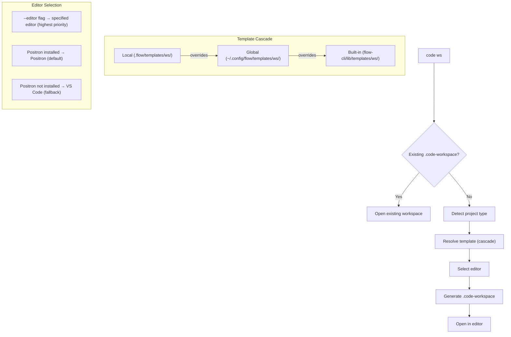

# SPEC: Workspace Manager (`code ws`)

| Field | Value |
|-------|-------|
| **Status** | draft |
| **Created** | 2026-02-13 |
| **From Brainstorm** | ~/BRAINSTORM-code-workspace-2026-02-13.md |
| **Component** | `lib/code-workspace.zsh` |
| **Affects** | `code` binary overload, `work` command, templates |

## Overview

Overload the `code` VS Code binary as a ZSH function with a `ws` subcommand for smart workspace management. Auto-detects project type (R, Python, Node, Generic), applies matching workspace templates with extension recommendations, and supports multi-root monorepos. **Positron is the default editor** when installed — it's built on Code OSS so it handles the same `.code-workspace` format, extensions, and settings, while adding native data science features (variables pane, plots, connections). Falls back to VS Code when Positron is unavailable. `--editor` flag overrides for any editor. Templates use a 3-tier cascade (built-in → global → per-project). Integrates with `work` sessions to auto-open workspaces.

## Primary User Story

**As a** flow-cli user working across R, Python, and Node projects,
**I want** `code ws` to create project-type-aware workspaces with the right settings and extensions, opening in Positron by default,
**So that** I don't have to manually configure workspace files for each project.

### Acceptance Criteria

- [ ] `code ws` creates `.code-workspace` file with detected project type template
- [ ] `code ws` opens existing `.code-workspace` if one exists in current directory
- [ ] `code <anything-else>` passes through to VS Code binary (100% transparent)
- [ ] 4 built-in templates: R package, Python/uv, Node/Bun, Generic
- [ ] Each template includes recommended extensions for its project type
- [ ] Auto-detect project type via DESCRIPTION/pyproject.toml/package.json
- [ ] Positron is the default editor when `positron` binary is available
- [ ] Falls back to VS Code (`code`) when Positron is not installed
- [ ] `--editor <name>` flag overrides default (code/cursor/positron)
- [ ] `--name <name>` flag overrides workspace filename (default: directory name)
- [ ] Template cascade: built-in → `~/.config/flow/templates/ws/` → `.flow/templates/ws/`
- [ ] Multi-root support: `code ws add <folder>` adds folder to existing workspace
- [ ] Template CRUD: `code ws list|create|edit|delete`
- [ ] `work <project>` auto-opens workspace file if one exists
- [ ] `code ws help` shows help in standard flow-cli format
- [ ] Pure ZSH implementation — no external dependencies

## Secondary User Stories

### Positron-first editing

**As a** data scientist working across R, Python, and Node projects,
**I want** all projects to open in Positron by default (with VS Code fallback),
**So that** I get native data science features (variables, plots, connections) everywhere, with `--editor code` for the rare cases I need vanilla VS Code.

### Monorepo workspace management

**As a** user working on monorepos with multiple packages,
**I want** `code ws add ../shared-lib` to add folders to my workspace,
**So that** I can work across related packages in one editor window.

### Custom template per project

**As a** user with project-specific editor settings,
**I want** to override the default template with a `.flow/templates/ws/` file,
**So that** my workspace settings match my team's conventions.

### Work session integration

**As a** flow-cli user who starts sessions with `work myproject`,
**I want** my workspace to open automatically when I start a work session,
**So that** I'm immediately productive without an extra command.

## Architecture



## API Design

### Function Signature

```zsh
# Main overload — defined in lib/code-workspace.zsh
code() {
    case "$1" in
        ws) shift; _code_ws "$@" ;;
        *)  command code "$@" ;;
    esac
}
```

### Subcommand Table

| Command | Args | Description |
|---------|------|-------------|
| `code ws` | (none) | Smart: open existing OR create + open new |
| `code ws create` | `[--name NAME] [--editor ED] [--type TYPE]` | Create new workspace from template |
| `code ws open` | `[--editor ED]` | Open existing workspace file |
| `code ws add` | `<folder> [--name LABEL]` | Add folder to workspace (multi-root) |
| `code ws list` | (none) | List available templates (all tiers) |
| `code ws edit` | `<template-name>` | Edit template in `$EDITOR` |
| `code ws delete` | `<template-name>` | Delete user-created template |
| `code ws help` | (none) | Show help |
| `code *` | `(anything)` | Passthrough to VS Code binary |

### Flags

| Flag | Values | Default | Description |
|------|--------|---------|-------------|
| `--editor` | `code`, `cursor`, `positron` | positron (if installed), else code | Override editor binary |
| `--name` | string | directory name | Override workspace filename |
| `--type` | `r-package`, `python`, `node`, `generic` | auto-detect | Override project type |

## Data Models

### Workspace Template Format

Templates are standard VS Code `.code-workspace` JSON files stored with `.json` extension:

```
lib/templates/ws/
├── r-package.json      # R package template
├── python.json         # Python/uv template
├── node.json           # Node/Bun template
└── generic.json        # Minimal template
```

### Template Structure

```json
{
  "folders": [
    { "path": "." }
  ],
  "settings": {
    "files.exclude": { "**/.git": true }
  },
  "extensions": {
    "recommendations": []
  }
}
```

### Template Cascade Resolution

```zsh
_code_ws_resolve_template() {
    local type="$1"
    local local_tmpl=".flow/templates/ws/${type}.json"
    local global_tmpl="${HOME}/.config/flow/templates/ws/${type}.json"
    local builtin_tmpl="${FLOW_PLUGIN_DIR}/lib/templates/ws/${type}.json"

    if [[ -f "$local_tmpl" ]]; then
        echo "$local_tmpl"
    elif [[ -f "$global_tmpl" ]]; then
        echo "$global_tmpl"
    elif [[ -f "$builtin_tmpl" ]]; then
        echo "$builtin_tmpl"
    else
        echo "$builtin_tmpl"  # fallback to generic
    fi
}
```

### Editor Selection Logic

```zsh
_code_ws_select_editor() {
    local editor_flag="$1"  # from --editor

    # 1. Explicit flag wins (highest priority)
    if [[ -n "$editor_flag" ]]; then
        echo "$editor_flag"
        return
    fi

    # 2. Positron is the default editor (built on Code OSS,
    #    same workspace format, plus native data science features)
    if command -v positron &>/dev/null; then
        echo "positron"
        return
    fi

    # 3. Fall back to VS Code
    echo "code"
}
```

**Rationale:** Positron handles R, Python, AND Node projects equally well (same extension marketplace, same workspace format). Its native data science features (variables pane, plots viewer, connections pane) benefit all project types. No reason to split by project type — just use the better editor when available.

## Dependencies

| Dependency | Required | Purpose |
|------------|----------|---------|
| Positron (`positron`) | Preferred default | Code OSS + native data science |
| VS Code (`code`) | Fallback | Used when Positron not installed |
| Cursor (`cursor`) | Optional | Alternative via `--editor cursor` |
| `jq` | Optional | JSON manipulation for `ws add` |
| flow-cli core | Required | `_flow_detect_project_type`, logging |

**Note on `jq`:** Multi-root `ws add` needs to parse and modify JSON. Pure ZSH JSON manipulation is fragile. Two options:
1. Use `jq` if available (preferred)
2. Fall back to `sed`-based insertion (simple cases only)

## UI/UX Specifications

### User Flow: `code ws` (Default)

```
$ code ws
→ Found existing: myproject.code-workspace
→ Opening in Positron...

$ code ws                          # (no existing workspace)
→ Detected: R package (DESCRIPTION found)
→ Template: r-package (built-in)
→ Created: myproject.code-workspace
→ Opening in Positron...

$ code ws                          # (Positron not installed)
→ Detected: Node (package.json found)
→ Template: node (built-in)
→ Created: myproject.code-workspace
→ Opening in VS Code... (Positron not found, using fallback)
```

### User Flow: `code ws create --type python --editor cursor`

```
$ code ws create --type python --editor cursor
→ Template: python (built-in)
→ Created: myproject.code-workspace
→ Opening in Cursor...
```

### User Flow: `code ws add ../shared-lib`

```
$ code ws add ../shared-lib
→ Updated: myproject.code-workspace
→ Added folder: ../shared-lib (shared-lib)
→ Workspace now has 2 folders
```

### User Flow: `code ws list`

```
$ code ws list
Templates:
  Built-in:
    r-package   R package (ESS, lintr, httpgd)
    python      Python/uv (Pyright, Ruff)
    node        Node/Bun (ESLint, Prettier)
    generic     Minimal (git exclude only)

  Global (~/.config/flow/templates/ws/):
    (none)

  Local (.flow/templates/ws/):
    (none)
```

### Help Output

```
$ code ws help

  code ws — VS Code Workspace Manager

  Usage:
    code ws                     Smart open/create workspace
    code ws create [opts]       Create from template
    code ws open [opts]         Open existing workspace
    code ws add <folder>        Add folder (multi-root)
    code ws list                List templates
    code ws edit <template>     Edit template
    code ws delete <template>   Delete template

  Flags:
    --editor <name>    Editor: positron, code, cursor (default: positron)
    --name <name>      Workspace filename (default: directory name)
    --type <type>      Project type (default: auto-detect)

  Editor: Positron (default) > VS Code (fallback) > --editor override

  Templates:
    r-package, python, node, generic
    Global: ~/.config/flow/templates/ws/
    Local:  .flow/templates/ws/

  Examples:
    code ws                     # Smart: open or create (in Positron)
    code ws create --type python
    code ws add ../shared-lib
    code ws --editor code       # Force VS Code
```

### Accessibility

- All output uses flow-cli color scheme from `lib/core.zsh`
- Success/error messages use `_flow_log_success`/`_flow_log_error`
- Help follows standard dispatcher help format
- No emoji in CLI output (follows flow-cli convention)

## Work Session Integration

When `work <project>` starts a session:

```zsh
# In commands/work.zsh, after session setup:
_work_auto_open_workspace() {
    local ws_file
    ws_file=$(find . -maxdepth 1 -name "*.code-workspace" -print -quit 2>/dev/null)
    if [[ -n "$ws_file" ]]; then
        local editor=$(_code_ws_select_editor "$(_code_ws_detect_type)")
        command "$editor" "$ws_file" &>/dev/null &
        _flow_log_info "Opened workspace in ${editor}"
    fi
}
```

**Behavior:** Silent auto-open. If no workspace file exists, nothing happens (no prompt to create one — that would add friction to `work`).

## Open Questions

1. **`jq` dependency for multi-root:** Pure ZSH JSON editing is fragile. Accept `jq` as optional dep for `ws add`? Or implement simple sed-based approach?
2. **Workspace settings merge:** When template cascade has overrides, should settings be deep-merged or replaced entirely?
3. **`.code-workspace` in `.gitignore`:** Should generated workspace files be gitignored by default? They're personal config but teams sometimes share them.
4. **Positron workspace format verification:** Positron is built on Code OSS and should use identical `.code-workspace` format — verify during Phase 1 implementation before shipping.

## Review Checklist

- [ ] Function overloads `code` without breaking passthrough
- [ ] All 4 templates produce valid `.code-workspace` JSON
- [ ] Template cascade resolves in correct priority order
- [ ] All projects default to Positron when installed
- [ ] `--editor` flag overrides auto-detection
- [ ] `--name` flag produces correctly named file
- [ ] Multi-root `ws add` produces valid JSON
- [ ] `work <project>` auto-opens workspace silently
- [ ] `code ws help` follows flow-cli help format
- [ ] Tests cover: passthrough, create, open, detect, cascade, multi-root
- [ ] No `local path=` variable shadowing (ZSH gotcha)
- [ ] Pure ZSH — no Node/Python dependencies

## Implementation Notes

### Phase 1: Core (1-2 hours)
- `code()` wrapper with passthrough
- `code ws` — smart create/open with auto-detect
- 4 built-in templates (R, Python, Node, Generic)
- Editor selection logic (Positron default → VS Code fallback)
- `code ws help`

### Phase 2: Templates + CRUD (1 hour)
- Template cascade resolution
- `code ws list` — show all templates
- `code ws create` with `--type` and `--name`
- `code ws edit` / `code ws delete`
- Global template directory creation

### Phase 3: Multi-root + Integration (1 hour)
- `code ws add <folder>` — JSON manipulation
- `work` session auto-open integration
- `--editor` flag for all subcommands

### Phase 4: Polish (30 min)
- ZSH completions for `code ws`
- Test suite (passthrough, create, detect, cascade, multi-root)
- Documentation updates

### Key ZSH Considerations

1. **`command code`** — Critical for passthrough. Calls the binary, not the function.
2. **No `local path=`** — Use `local ws_path`, `local tmpl_path` etc. (ZSH gotcha from memory)
3. **JSON generation** — Use heredoc with `cat <<EOF`, not `echo` (multiline).
4. **Background launch** — `command "$editor" "$ws_file" &>/dev/null &` to not block terminal.
5. **`FLOW_PLUGIN_DIR`** — Need this variable set to find built-in templates.

## History

| Date | Change |
|------|--------|
| 2026-02-13 | Initial spec from deep brainstorm (12 questions) |
| 2026-02-13 | Revised: Positron as default editor (was R-only), simplified editor selection logic |
