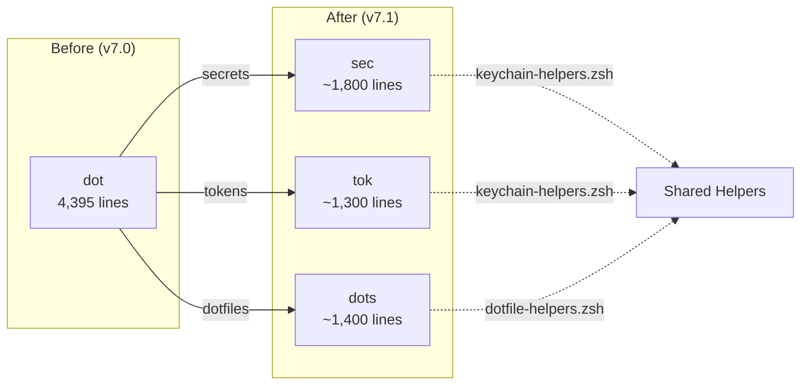

# SPEC: Rename `dot` → `dots` + Split into 3 Dispatchers

**Status:** draft
**Created:** 2026-02-14
**Version Target:** v7.1.0
**From Brainstorm:** BRAINSTORM-dot-rename-2026-02-14.md

---

## Overview

Rename the `dot` dispatcher to `dots` to avoid collision with Graphviz's `dot` command (`/opt/homebrew/bin/dot`), and split the monolithic 4,395-line dispatcher into three focused dispatchers: `dots` (dotfiles), `sec` (secrets), and `tok` (tokens). Clean break — no deprecated aliases.

---

## Primary User Story

**As a** developer using flow-cli with Graphviz installed,
**I want** the dotfile dispatcher to have a distinct name from Graphviz's `dot`,
**So that** tab completion, `which`, and shell lookups don't collide.

### Acceptance Criteria

- [ ] `dots` command replaces `dot` for all dotfile management
- [ ] `sec` command handles all secret/vault operations
- [ ] `tok` command handles all token management (github, npm, pypi)
- [ ] `dot` function no longer exists (clean break)
- [ ] All 243 internal `_dot_*` references renamed to match new dispatchers
- [ ] All 10 test files updated and passing
- [ ] All 16 doc files updated
- [ ] Completions split into `_dots`, `_sec`, `_tok`
- [ ] `flow doctor` aggregates health from all 3 dispatchers
- [ ] Each dispatcher has its own `doctor` subcommand

---

## Secondary User Stories

**As a** flow-cli user managing secrets,
**I want** a dedicated `sec` command,
**So that** secret operations don't feel buried under dotfile management.

**As a** flow-cli user rotating tokens,
**I want** a dedicated `tok` command,
**So that** token workflows (github, npm, pypi) have their own namespace.

---

## Architecture

### Current (Monolith)

```
dot() ─── 4,395 lines
├── Dotfile mgmt (status, edit, sync, push, diff, apply, ignore, init, undo, env, doctor)
├── Secret mgmt (secret, secrets, unlock, lock, sync, bw integration)
└── Token mgmt (token github, token npm, token pypi, token rotate, token refresh)
```

### Target (3 Dispatchers)

```
dots() ─── ~1,400 lines
├── status/s       # Dotfile sync status
├── edit/e         # Edit dotfile
├── sync/pull      # Pull from remote
├── push/p         # Push to remote
├── diff/d         # Show pending changes
├── apply/a        # Apply changes
├── add            # Add file to chezmoi
├── ignore/ig      # Manage .chezmoiignore
├── size           # Analyze repo size
├── init           # Initialize dotfile mgmt
├── undo           # Rollback last apply
├── env            # Direnv integration
├── doctor/dr      # Dotfile-specific diagnostics
└── help           # Help

sec() ─── ~1,800 lines
├── <name>         # Get secret by name (default action)
├── list           # List secrets
├── add            # Store new secret
├── delete         # Remove secret
├── check          # Check expirations
├── status         # Backend config status
├── unlock/u       # Unlock Bitwarden vault
├── lock/l         # Lock vault
├── sync           # Sync Keychain ↔ Bitwarden
├── bw <cmd>       # Bitwarden-specific ops
├── dashboard      # Secrets overview (was `dot secrets`)
├── doctor/dr      # Secret-specific diagnostics
└── help           # Help

tok() ─── ~1,300 lines
├── github/gh      # GitHub token wizard
├── npm            # NPM token wizard
├── pypi           # PyPI token wizard
├── rotate         # Token rotation
├── refresh        # Refresh expiring tokens
├── expiring       # Show expiring tokens
├── sync           # Sync to GitHub secrets
├── doctor/dr      # Token-specific diagnostics
└── help           # Help
```

### Mermaid Diagram



---

## API Design

### Command Mapping (old → new)

| Old Command | New Command | Notes |
|---|---|---|
| `dot` | `dots` | Status overview |
| `dot status` | `dots status` | Dotfile sync status |
| `dot edit .zshrc` | `dots edit .zshrc` | Edit dotfile |
| `dot sync` | `dots sync` | Pull from remote |
| `dot push` | `dots push` | Push to remote |
| `dot diff` | `dots diff` | Pending changes |
| `dot apply` | `dots apply` | Apply changes |
| `dot add` | `dots add` | Add to chezmoi |
| `dot ignore` | `dots ignore` | Manage ignores |
| `dot init` | `dots init` | Initialize |
| `dot undo` | `dots undo` | Rollback |
| `dot env` | `dots env` | Direnv |
| `dot doctor` | `dots doctor` | Dotfile diagnostics |
| `dot secret <name>` | `sec <name>` | Get secret (default) |
| `dot secret list` | `sec list` | List secrets |
| `dot secret add` | `sec add` | Store secret |
| `dot secret check` | `sec check` | Check expirations |
| `dot secret status` | `sec status` | Backend status |
| `dot secret sync` | `sec sync` | Keychain ↔ Bitwarden |
| `dot secret bw <cmd>` | `sec bw <cmd>` | Bitwarden ops |
| `dot unlock` | `sec unlock` | Unlock vault |
| `dot lock` | `sec lock` | Lock vault |
| `dot secrets` | `sec dashboard` | Secrets overview |
| `dot secrets sync github` | `sec sync github` | Sync to GH secrets |
| `dot token` | `tok` | Token help |
| `dot token github` | `tok github` | GitHub token wizard |
| `dot token npm` | `tok npm` | NPM token wizard |
| `dot token pypi` | `tok pypi` | PyPI token wizard |
| `dot token rotate` | `tok rotate` | Token rotation |
| `dot token refresh` | `tok refresh` | Refresh expiring |

### Internal Function Rename Map

| Old Prefix | New Prefix | Approx Count |
|---|---|---|
| `_dot_status`, `_dot_edit`, `_dot_sync`, etc. | `_dots_*` | ~50 |
| `_dot_secret*`, `_dot_secrets*`, `_dot_unlock`, `_dot_lock` | `_sec_*` | ~80 |
| `_dot_token*` | `_tok_*` | ~40 |
| `_dot_help`, `_dot_version`, `_dot_doctor` | `_dots_*` | ~10 |
| `_dot_has_chezmoi`, `_dot_has_bw` | `_dots_has_chezmoi`, `_sec_has_bw` | ~15 |
| Shared helpers in `dotfile-helpers.zsh` | Keep or split | ~48 |

---

## Data Models

N/A — No data model changes. Keychain service name (`flow-cli`) and Bitwarden item naming remain unchanged.

---

## Dependencies

### Existing (unchanged)

- `chezmoi` (optional) — dotfile sync
- `bw` (optional) — Bitwarden CLI
- `jq` (optional) — JSON parsing
- macOS Keychain (native) — secret storage
- `security` (native) — Keychain CLI

### New

- None — pure refactor, no new dependencies

---

## UI/UX Specifications

### Help Screen Improvements

Each dispatcher gets a modernized help screen following the existing color scheme from `lib/core.zsh`:

```
┌─────────────────────────────────────────────────────────────┐
│  dots - Dotfile Management                                  │
├─────────────────────────────────────────────────────────────┤
│                                                             │
│  USAGE                                                      │
│    dots [command] [args]                                    │
│                                                             │
│  COMMANDS                                                   │
│    status, s       Show sync status                         │
│    edit, e         Edit a dotfile                           │
│    sync            Pull changes from remote                 │
│    push, p         Push changes to remote                   │
│    diff, d         Show pending changes                     │
│    apply, a        Apply pending changes                    │
│    add             Add file to chezmoi                      │
│    ignore, ig      Manage .chezmoiignore                    │
│    env             Direnv integration                       │
│    doctor, dr      Run diagnostics                          │
│                                                             │
│  RELATED                                                    │
│    sec             Secret management                        │
│    tok             Token management                         │
│                                                             │
│  EXAMPLES                                                   │
│    $ dots edit .zshrc                                       │
│    $ dots sync && dots apply                                │
│    $ dots doctor                                            │
│                                                             │
└─────────────────────────────────────────────────────────────┘
```

Cross-references between dispatchers in help output (RELATED section).

### Accessibility

N/A — CLI tool, no web UI.

### User Flow

```
Developer types "dots" → sees dotfile status (unchanged UX)
Developer types "sec github-token" → gets token from Keychain
Developer types "tok github" → enters GitHub token wizard
Developer types "flow doctor" → sees aggregated health from all 3
```

---

## Implementation Plan

### File Operations

#### New Files to Create

| File | Source | Lines |
|---|---|---|
| `lib/dispatchers/dots-dispatcher.zsh` | `dot-dispatcher.zsh` L1–1347 + doctor + help | ~1,400 |
| `lib/dispatchers/sec-dispatcher.zsh` | `dot-dispatcher.zsh` L1348–2499 + L3785–4395 | ~1,800 |
| `lib/dispatchers/tok-dispatcher.zsh` | `dot-dispatcher.zsh` L2500–3784 | ~1,300 |
| `completions/_dots` | Split from `_dot` | ~50 |
| `completions/_sec` | Split from `_dot` | ~50 |
| `completions/_tok` | Split from `_dot` | ~40 |
| `tests/test-dots-dispatcher.zsh` | Rename from `test-dot-dispatcher.zsh` | ~1,300 |
| `tests/test-sec-dispatcher.zsh` | New, from secret tests | ~1,300 |
| `tests/test-tok-dispatcher.zsh` | New, from token test extracts | ~800 |

#### Files to Delete

| File | Reason |
|---|---|
| `lib/dispatchers/dot-dispatcher.zsh` | Replaced by 3 dispatchers |
| `completions/_dot` | Replaced by 3 completions |

#### Files to Update (rename references)

| Category | Files | Changes |
|---|---|---|
| Plugin entry | `flow.plugin.zsh` | Source 3 dispatchers instead of 1 |
| Helper lib | `lib/dotfile-helpers.zsh` | Rename `_dot_*` helpers or split |
| Doctor integration | `lib/dispatchers/dot-doctor-integration.zsh` | Rename to aggregate |
| Test files | 10 test files | Rename functions, update assertions |
| Documentation | 16 doc files | Replace `dot` → `dots`/`sec`/`tok` |
| mkdocs nav | `mkdocs.yml` | Update nav entry |
| CLAUDE.md | `CLAUDE.md` | Update dispatcher list (14 → 15) |
| Quick reference | `docs/help/QUICK-REFERENCE.md` | Update command table |
| Master dispatcher guide | `docs/reference/MASTER-DISPATCHER-GUIDE.md` | Major update |
| Completions index | Any completion registry | Register 3 new completions |

### Implementation Increments

**Increment 1: Create 3 dispatcher files (core split)**

1. Create `dots-dispatcher.zsh` — extract dotfile functions, rename `_dot_` → `_dots_`
2. Create `sec-dispatcher.zsh` — extract secret functions, rename `_dot_secret*` → `_sec_*`
3. Create `tok-dispatcher.zsh` — extract token functions, rename `_dot_token*` → `_tok_*`
4. Update `flow.plugin.zsh` to source all 3
5. Delete `dot-dispatcher.zsh`
6. Run tests (expect failures)

**Increment 2: Fix helpers and shared code**

1. Update `lib/dotfile-helpers.zsh` — rename shared `_dot_*` helpers
2. Update `lib/keychain-helpers.zsh` if needed
3. Update `lib/dispatchers/dot-doctor-integration.zsh` → aggregate doctor
4. Ensure `sec` and `tok` can access Keychain helpers

**Increment 3: Update tests**

1. Rename test files and functions
2. Add new test files for `sec` and `tok`
3. Ensure all 45/45 test suites pass

**Increment 4: Update completions**

1. Create `_dots`, `_sec`, `_tok` completion files
2. Delete `_dot` completion
3. Test tab completion for all 3

**Increment 5: Update documentation**

1. Update all 16 doc files
2. Update mkdocs.yml nav
3. Update CLAUDE.md, QUICK-REFERENCE.md, MASTER-DISPATCHER-GUIDE.md
4. Update release script version references

**Increment 6: Help improvements**

1. Modernize help screens for all 3 dispatchers
2. Add RELATED cross-references
3. Simplify chezmoi integration messaging
4. Improve doctor output formatting

**Increment 7: Performance improvements**

1. Cache Keychain lookups in `sec` (session-scoped)
2. Reduce vault unlock friction (remember session)
3. Faster secret retrieval path

---

## Improvements Bundled in v7.1.0

### 1. Better Help Output

- Cross-references between `dots`, `sec`, `tok` in RELATED section
- Consistent formatting using `lib/core.zsh` color scheme
- Grouped commands by frequency of use
- Examples section in every help screen

### 2. Simplify Chezmoi Integration

- Clearer error messages when chezmoi not installed
- `dots init` wizard simplified (fewer questions)
- `dots doctor` clearly shows chezmoi state vs dotfile state
- Remove verbose safety warnings for read-only operations

### 3. Faster Secret Retrieval

- Session-scoped Keychain cache (avoid repeated `security` calls)
- `sec <name>` uses cache if available, falls back to Keychain
- Cache invalidation on `sec add`, `sec delete`, `sec sync`
- Bitwarden session persistence across subcommands

### 4. Better Doctor Diagnostics

- `dots doctor` — dotfile sync health, chezmoi state, repo integrity
- `sec doctor` — Keychain access, Bitwarden connectivity, expiring secrets
- `tok doctor` — token validity, expiration warnings, sync status
- `flow doctor` aggregates all 3 with section headers

---

## Open Questions

1. **Dispatcher count in CLAUDE.md** — Currently says "13 smart dispatchers". After split: 15 dispatchers (remove `dot`, add `dots`, `sec`, `tok`). Update all references.
2. **`dotfile-helpers.zsh` split** — Should the helper file also split, or do all 3 dispatchers share it?
3. **`dot-doctor-integration.zsh`** — Rename to what? `dots-doctor-integration.zsh`? Or split into 3 integration files?

---

## Review Checklist

- [ ] All `_dot_*` functions renamed (243 references)
- [ ] No orphan `dot()` function definition exists
- [ ] `flow.plugin.zsh` sources all 3 new dispatchers
- [ ] 45/45 test suites pass
- [ ] Tab completion works for `dots`, `sec`, `tok`
- [ ] `flow doctor` aggregates all 3 doctors
- [ ] Documentation updated (16 files + CLAUDE.md)
- [ ] mkdocs builds clean
- [ ] Release script handles new dispatcher names
- [ ] Graphviz `dot` command unaffected (`which dot` → Graphviz)

---

## Implementation Notes

- **Clean break**: No `dot()` alias, no deprecation path. Users update or break.
- **Line split is clean**: Secrets start at L1348, tokens at L2500, dashboard at L3785 — natural boundaries already exist.
- **Keychain service name unchanged**: `flow-cli` stays as the Keychain service — no secret migration needed.
- **Bitwarden items unchanged**: Item names in Bitwarden vault are not affected.
- **Test regression risk**: The `_dot_` → `_dots_`/`_sec_`/`_tok_` rename touches 243 references — high risk of missed renames. Run full test suite after each increment.

---

## History

| Date | Change |
|---|---|
| 2026-02-14 | Initial spec — rename `dot` → `dots`, split into `dots`/`sec`/`tok` |
