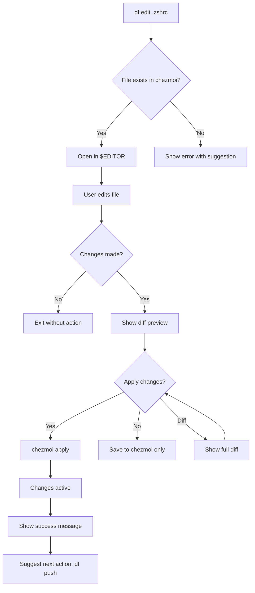
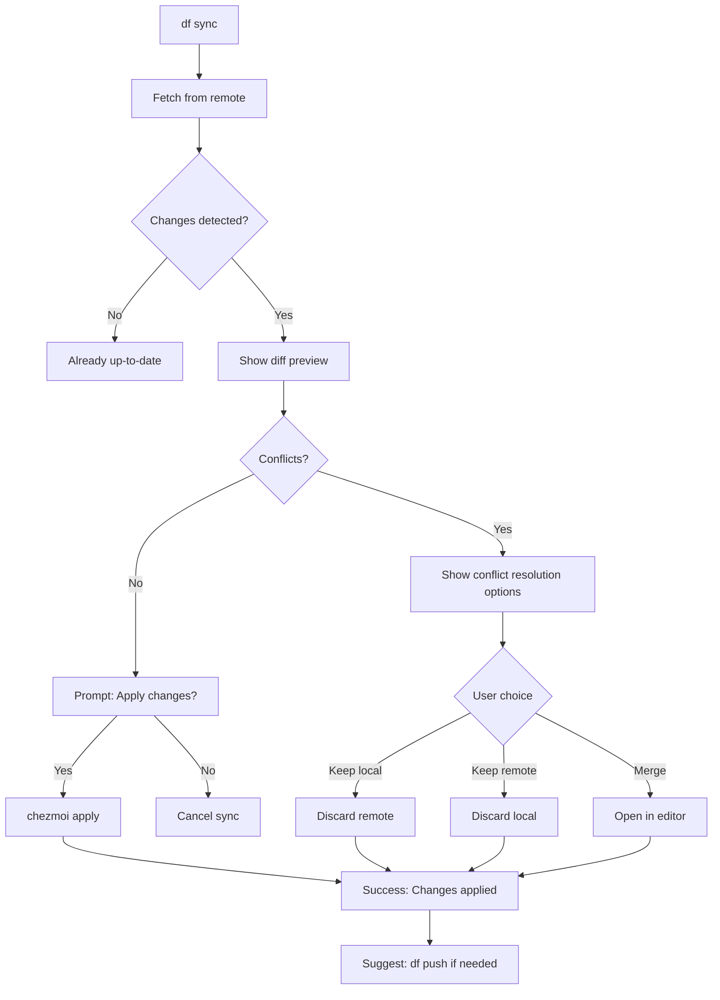
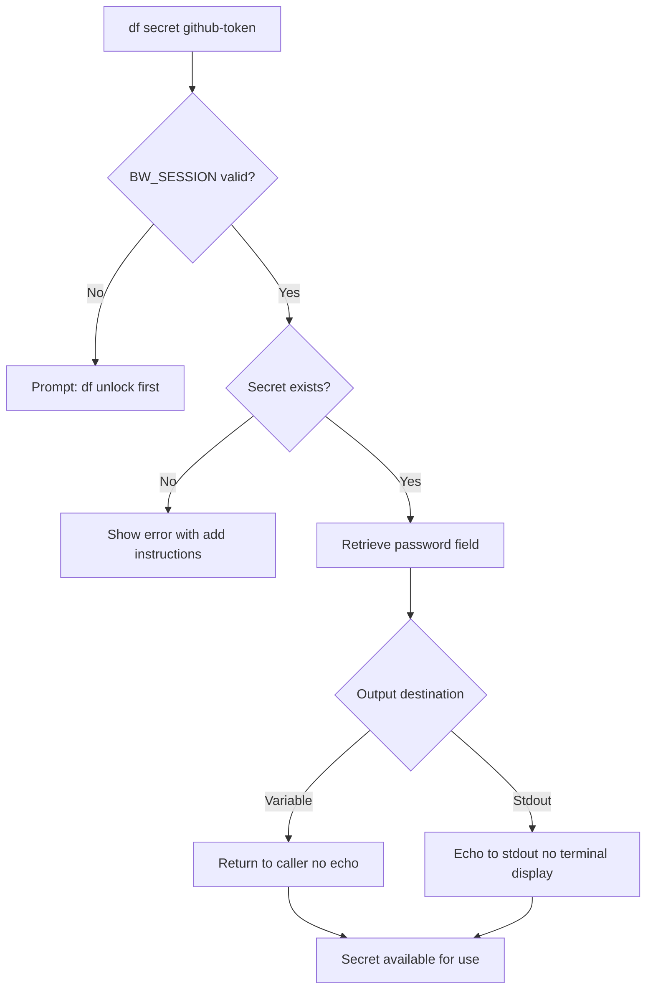

# SPEC: Dotfile Management Integration via dot Dispatcher

**Status:** Completed (Implemented in v5.3.0)
**Created:** 2026-01-08
**Updated:** 2026-01-13 (Documentation cleanup)
**Target Release:** v5.0.0 (Delivered in v5.3.0)
**Estimated Effort:** 26 hours over 3-4 weeks

---

## Overview

Integration of chezmoi + Bitwarden + Mise dotfile management tools into flow-cli via a new **`dot`** (dotfile) dispatcher. This enhancement enables users to manage their dotfiles, secrets, and development tool versions seamlessly within the flow-cli workflow.

**Note:** Originally designed as `dot` (2 letters), changed to `dot` (3 letters) per user preference for clearer intent, despite breaking the 2-letter dispatcher convention.

**Key Benefits:**
- **Consistency:** All dotfile operations in one place
- **Security:** Secrets managed via Bitwarden (no hardcoded API keys)
- **Cross-machine sync:** iMac ↔ MacBook dotfile sync in seconds
- **ADHD-friendly:** Fast, forgiving, discoverable interface

---

## Primary User Story

**As a** developer using flow-cli on multiple machines (iMac + MacBook),
**I want to** manage my dotfiles, secrets, and tool versions through flow-cli,
**So that** I can keep my development environment in sync without manual chezmoi/bitwarden commands.

**Acceptance Criteria:**
1. `dot` command shows sync status in < 0.5 seconds
2. `dot edit .zshrc` edits dotfile with preview and auto-apply
3. `dot sync` pulls changes with safety preview before applying
4. `dot secret <name>` retrieves secrets without echoing to terminal
5. Dashboard shows dotfile sync state (1 line, non-intrusive)
6. Work command checks for dotfile updates on session start
7. Flow doctor includes dotfile health checks
8. All core operations complete in < 3 seconds
9. Zero hardcoded secrets in dotfiles after setup
10. Both machines stay in sync with < 5 minute sync workflow

---

## Secondary User Stories

### 1. Quick File Editing

**As a** user making frequent shell config changes,
**I want to** edit dotfiles with automatic preview and apply,
**So that** changes take effect immediately without manual steps.

**Acceptance:** `dot edit .zshrc` → modify → auto-preview → apply → active in < 30 seconds

### 2. Safe Syncing

**As a** user working on multiple machines,
**I want to** see what will change before syncing,
**So that** I don't accidentally overwrite important customizations.

**Acceptance:** `dot sync` shows diff, requires confirmation, handles conflicts gracefully

### 3. Secret Management

**As a** user with API keys and credentials,
**I want to** store secrets in Bitwarden and inject them into dotfiles,
**So that** no secrets are committed to version control.

**Acceptance:** Secrets retrieved via `dot secret`, injected into templates, never echoed

---

## Technical Requirements

### Architecture

**Pattern:** Dispatcher (consistent with `g`, `mcp`, `cc`, `r`, `qu`)

**File Structure:**

```
lib/
├── dispatchers/
│   └── dot-dispatcher.zsh      # Main dispatcher logic
└── dotfile-helpers.zsh        # Helper functions

completions/
└── _dot                        # ZSH completions

tests/
└── dot-dispatcher.test.zsh     # Test suite

docs/
├── reference/
│   └── DOT-DISPATCHER-REFERENCE.md
└── tutorials/
    └── dotfile-setup.md
```

**Dependencies (Optional):**
- chezmoi (Homebrew)
- bitwarden-cli (Homebrew)
- mise (Homebrew) - future

**Dependency Strategy:**
- All tools optional (graceful degradation)
- Lazy loading (zero startup overhead)
- Feature detection (like Atlas integration)

### Core Components

#### 1. dot-dispatcher.zsh

Main command dispatcher with subcommands:

```zsh
df() {
    case "$1" in
        # Core operations
        ""|status)  _dot_status ;;
        edit)       shift; _dot_edit "$@" ;;
        sync)       shift; _dot_sync "$@" ;;
        push)       shift; _dot_push "$@" ;;
        diff)       shift; _dot_diff "$@" ;;
        apply)      shift; _dot_apply "$@" ;;

        # Secret management
        unlock)     _dot_unlock ;;
        secret)     shift; _dot_secret "$@" ;;

        # Troubleshooting
        doctor)     _dot_doctor ;;
        undo)       _dot_undo ;;
        init)       shift; _dot_init "$@" ;;

        # Meta
        help)       _dot_help ;;
        *)          _dot_passthrough "$@" ;;
    esac
}
```

#### 2. dotfile-helpers.zsh

Helper functions:

```zsh
# Tool detection
_dot_has_chezmoi() { ... }
_dot_has_bw() { ... }
_dot_require_tool() { ... }

# Status checks
_dot_get_sync_status() { ... }
_dot_get_modified_files() { ... }
_dot_get_last_sync_time() { ... }

# Path resolution
_dot_resolve_file_path() { ... }  # Fuzzy matching for file names

# Secret management
_dot_bw_session_valid() { ... }
_dot_retrieve_secret() { ... }

# UI helpers
_dot_format_status() { ... }
_dot_show_diff() { ... }
_dot_confirm_action() { ... }
```

#### 3. Integration Points

**Dashboard Integration:**

```zsh
# In commands/dash.zsh
if _dot_has_chezmoi; then
    local df_status=$(_dot_get_sync_status)
    echo "Dotfiles: $df_status"
fi
```

**Work Command Integration:**

```zsh
# In commands/work.zsh
if [[ "$FLOW_DOTFILE_CHECK_ON_START" != "no" ]]; then
    if _dot_has_chezmoi && _dot_has_updates; then
        echo "🔄 Dotfile updates available. Run 'df sync' to update."
    fi
fi
```

**Flow Doctor Integration:**

```zsh
# In commands/doctor.zsh
echo "📁 DOTFILES"
_doctor_check_cmd "chezmoi" "brew" "optional"
_doctor_check_cmd "bw" "brew:bitwarden-cli" "optional"

if _dot_has_chezmoi; then
    _dot_doctor  # Run dotfile-specific checks
fi
```

---

## Data Models

### Dotfile Sync State

```zsh
# Internal representation
typeset -gA _DF_STATE=(
    sync_status   "synced|modified|behind|ahead|conflict"
    last_sync     "timestamp"
    modified_files "array of file paths"
    untracked_files "array of file paths"
    remote_behind  "count"
    remote_ahead   "count"
)
```

### Status Display Format

```
State: 🟢 Synced | 🟡 Modified | 🔴 Behind | ⚠️  Conflict
Last sync: <relative time>
Modified: <count> files
```

### Bitwarden Session

```zsh
# Environment variable
export BW_SESSION="<session_key>"

# Session validation
bw unlock --check  # Returns 0 if valid
```

---

## Dependencies

### Required

- ZSH (5.8+)
- fzf (for interactive file picker)

### Optional (Graceful Degradation)

- **chezmoi** (core dotfile sync)
  - Install: `brew install chezmoi`
  - Fallback: df commands show install message

- **bitwarden-cli** (secret management)
  - Install: `brew install bitwarden-cli`
  - Fallback: df secret commands show install message

- **mise** (version management)
  - Install: `brew install mise`
  - Fallback: version commands unavailable

### Optional (Enhanced UX)

- **bat** (syntax-highlighted diffs)
- **delta** (better git diffs)
- **eza** (file listing with icons)

---

## UI/UX Specifications

### User Flow: Edit Dotfile



### User Flow: Sync from Remote



### User Flow: Retrieve Secret



### Wireframes (ASCII)

#### df (Status Display)

```
╭───────────────────────────────────────────────────╮
│ 📁 Dotfiles Status                                │
├───────────────────────────────────────────────────┤
│                                                   │
│ State: 🟢 Synced                                  │
│ Last sync: 2 hours ago (from iMac)                │
│ Tracked files: 12                                 │
│                                                   │
│ Quick actions:                                    │
│   df edit .zshrc    Edit shell config             │
│   df sync           Pull latest changes           │
│   df help           Show all commands             │
│                                                   │
╰───────────────────────────────────────────────────╯
```

#### df edit .zshrc (Success)

```
✓ .zshrc edited successfully

Changes:
  + export NEW_ALIAS="gst='git status'"
  - # old comment

💡 Tip: Run 'df push' to sync to other machines
```

#### df sync (With Changes)

```
🔄 Syncing dotfiles from remote...

Changes from iMac (3 hours ago):
  ~/.config/zsh/.zshrc
    + export ANTHROPIC_API_KEY="<secret>"
    - export OLD_VAR="value"

  ~/.gitconfig
    + [user]
    +   email = "updated@example.com"

Apply these changes? [Y/n/d]
  Y = Apply now (recommended)
  n = Cancel sync
  d = Show full diff first
```

#### df secret github-token (Session Expired)

```
╭───────────────────────────────────────────────────╮
│ 🔒 Bitwarden Session Expired                      │
├───────────────────────────────────────────────────┤
│                                                   │
│ What: Cannot retrieve secrets                     │
│ Why:  Session timeout (1 hour default)           │
│ How:  Unlock your vault to continue              │
│                                                   │
│ Run: df unlock                                    │
│      Enter your master password when prompted    │
│                                                   │
╰───────────────────────────────────────────────────╯
```

#### df doctor (Diagnostics)

```
📁 Dotfile Health Check

✓ chezmoi installed (v2.45.0)
✓ Bitwarden CLI installed (v2024.1.0)
✓ Dotfile repository connected
✓ Last sync: 2 hours ago (iMac)
⚠ 3 modified files (not pushed)
✓ No merge conflicts

Recommendations:
  → Run 'df push' to sync modified files
  → Run 'df sync' to check for remote updates
```

### Accessibility

N/A - CLI only (no web interface)

---

## Open Questions

1. **Auto-apply behavior:**
   - Should `dot edit` always auto-apply changes after preview?
   - Or should it require explicit `dot apply`?
   - **Recommendation:** Auto-apply with preview (can cancel)

2. **Dashboard integration intensity:**
   - Always show dotfile status in dashboard?
   - Or only when out-of-sync?
   - **Recommendation:** Always show (1 line, minimal)

3. **Work command integration:**
   - Opt-in or opt-out for dotfile update checks?
   - **Recommendation:** Opt-out (check by default, can disable with `FLOW_DOTFILE_CHECK_ON_START=no`)

4. **Conflict resolution default:**
   - Default to "keep local", "keep remote", or "merge manually"?
   - **Recommendation:** No default - force user to choose (3 clear options)

5. **Secret injection timing:**
   - When to inject secrets into templates?
   - On every `dot sync`? On demand?
   - **Recommendation:** On-demand via `dot secret`, automatic during `chezmoi apply` if template references Bitwarden

---

## Review Checklist

### Design Review

- [x] Command naming approved (`dot`)
- [x] Dispatcher pattern confirmed
- [x] Integration points identified
- [x] User flows documented
- [x] Visual mockups created
- [ ] Open questions resolved

### Implementation Review

- [ ] Core commands implemented
- [ ] Secret management functional
- [ ] Dashboard integration complete
- [ ] Work command integration complete
- [ ] Flow doctor integration complete
- [ ] Error handling comprehensive
- [ ] Performance targets met

### Testing Review

- [ ] Unit tests passing
- [ ] Integration tests passing
- [ ] Performance benchmarks met
- [ ] Security audit complete
- [ ] No secrets in logs/history

### Documentation Review

- [ ] Reference docs complete
- [ ] Tutorial written
- [ ] Examples provided
- [ ] Troubleshooting section added
- [ ] Migration guide (if needed)

### Release Review

- [ ] Version bumped (v5.0.0)
- [ ] Changelog updated
- [ ] Breaking changes documented
- [ ] Deployment tested on both machines

---

## Implementation Notes

### Phase 1: Foundation (4 hours)

**Goal:** Basic dispatcher skeleton with help and status

**Tasks:**
1. Create `lib/dispatchers/dot-dispatcher.zsh`
2. Implement basic structure (`dot`, `help`, `status`)
3. Add tool detection (`_dot_has_chezmoi`, `_dot_require_tool`)
4. Integrate into `flow.plugin.zsh`
5. Test: `dot help` shows help, `dot` shows status

**Deliverables:**
- Working `dot help` command
- Basic `dot` status display
- Tool detection logic

### Phase 2: Core Workflows (8 hours)

**Goal:** Edit and sync workflows operational

**Tasks:**
1. Implement `dot edit <file>` with smart path resolution
2. Add `dot diff` for preview
3. Implement `dot sync` with safety preview
4. Add `dot push` for publishing changes
5. Implement `dot apply` for applying changes
6. Add `dot undo` for rollback
7. Test: Complete edit/sync workflows

**Deliverables:**
- Edit workflow (edit → preview → apply)
- Sync workflow (sync → preview → apply)
- Push workflow (push to remote)
- Undo functionality

### Phase 3: Secret Management (6 hours)

**Goal:** Bitwarden integration functional

**Tasks:**
1. Implement `dot unlock` (BW session management)
2. Implement `dot secret <name>` (retrieve secrets)
3. Implement `dot secret list` (show available secrets)
4. Add secret injection into templates
5. Security audit (no leaks, no logs)
6. Test: Secret retrieval workflows

**Deliverables:**
- Working Bitwarden unlock
- Secret retrieval (no echo)
- Template injection
- Security verified

### Phase 4: Integration (4 hours)

**Goal:** Seamless integration with existing commands

**Tasks:**
1. Dashboard integration (dotfile status line)
2. Work command integration (check for updates)
3. Flow doctor integration (health checks)
4. Test: All integrations work together

**Deliverables:**
- Dashboard shows dotfile status
- Work command checks for updates
- Flow doctor includes dotfile checks

### Phase 5: Polish (4 hours)

**Goal:** Production-ready release

**Tasks:**
1. ZSH completions (`completions/_dot`)
2. Comprehensive test suite
3. Documentation (reference + tutorial)
4. Performance optimization
5. Final testing on both machines

**Deliverables:**
- Working completions
- All tests passing
- Complete documentation
- Performance benchmarks met

---

## History

| Date | Author | Change |
|------|--------|--------|
| 2026-01-08 | Backend Architect Agent | Initial architecture design |
| 2026-01-08 | UX Designer Agent | Complete UX design with 21 mockups |
| 2026-01-08 | Claude (Sonnet 4.5) | Synthesized findings into formal spec |

---

## Related Documents

- [DOT Dispatcher Reference](../reference/DOT-DISPATCHER-REFERENCE.md)
- [DOT Dispatcher Tutorial](../tutorials/12-dot-dispatcher.md)
- [Implementation Checklist](dot-dispatcher-implementation-checklist.md) (archived)
- [Quick Reference Card](dot-dispatcher-refcard.md) (archived)

---

**Implementation Complete:** v5.3.0 - See [DOT Dispatcher Reference](../reference/DOT-DISPATCHER-REFERENCE.md) for current documentation.
